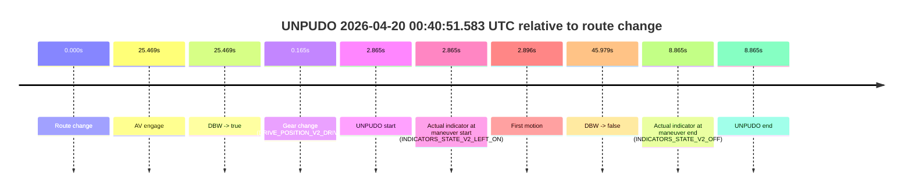
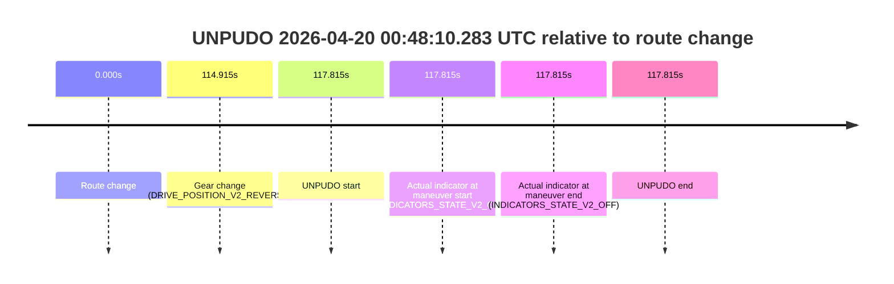
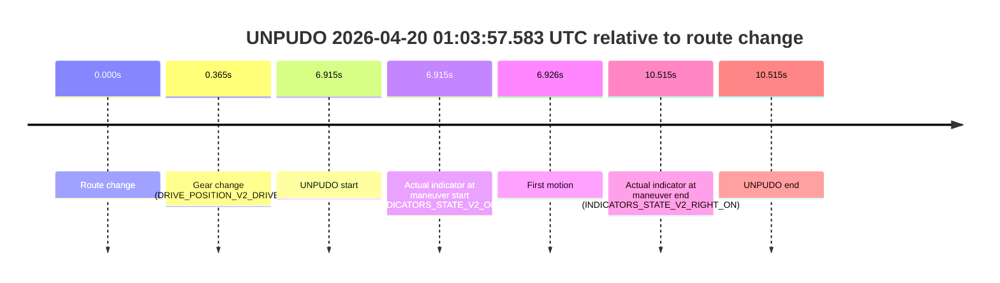
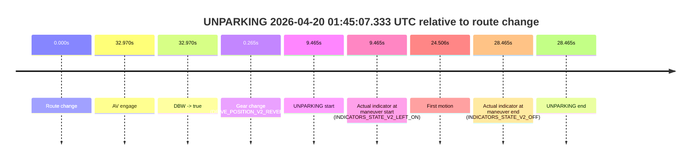

# Run Report: fme10010/2026-04-20--00-25-51--gen2-av-6e42eee7-6873-4c45-bf09-8fa363e8be0b

| Field | Value |
|---|---|
| Run ID | `fme10010/2026-04-20--00-25-51--gen2-av-6e42eee7-6873-4c45-bf09-8fa363e8be0b` |
| Date | `2026-04-20` |
| Model(s) | `pink-manta-ray-smooth` |
| Author | `guy.geva` |
| Event count | `9` |

## unpudo 2026-04-20 00:40:51.583 UTC

| Field | Value |
|---|---|
| Model | `pink-manta-ray-smooth` |
| Author | `guy.geva` |
| Run ID | `fme10010/2026-04-20--00-25-51--gen2-av-6e42eee7-6873-4c45-bf09-8fa363e8be0b` |
| Date | `2026-04-20` |
| Time (UTC) | `00:40:51.583` |
| Event type | `unpudo` |
| Disengagement type | `none observed` |
| Route change | `found` |
| Console | [run](https://console.sso.wayve.ai/run/fme10010/2026-04-20--00-25-51--gen2-av-6e42eee7-6873-4c45-bf09-8fa363e8be0b?id=&time-unixus=1776645651583314) |
| Foxglove | [segment](https://app.foxglove.dev/wayve-on-prem/p/prj_0dX18KZdVHg1fmmI/view?ds=foxglove-stream&ds.deviceName=fme10010&ds.start=2026-04-20T00%3A40%3A38.718230Z&ds.end=2026-04-20T00%3A41%3A44.697715Z&layoutId=lay_0e7VD4WIKDQGU73Y&time=2026-04-20T00%3A40%3A51.583314Z) |

### Event card: non-av

- Non-AV: there is no AV-owned portion anywhere inside the detected unpudo timeline, so it is kept for coverage but excluded from model success / failure scoring.

| Event | Time (UTC) | Delta from route change |
|---|---:|---:|
| Route change | 2026-04-20 00:40:48.718 | `0.000s` |
| AV engage | 2026-04-20 00:41:14.186 | `25.469s` |
| DBW -> true | 2026-04-20 00:41:14.186 | `25.469s` |
| Gear change (DRIVE_POSITION_V2_DRIVE) | 2026-04-20 00:40:48.883 | `0.165s` |
| UNPUDO start | 2026-04-20 00:40:51.583 | `2.865s` |
| Actual indicator at maneuver start (INDICATORS_STATE_V2_LEFT_ON) | 2026-04-20 00:40:51.583 | `2.865s` |
| First motion | 2026-04-20 00:40:51.614 | `2.896s` |
| DBW -> false | 2026-04-20 00:41:34.697 | `45.979s` |
| Actual indicator at maneuver end (INDICATORS_STATE_V2_OFF) | 2026-04-20 00:40:57.583 | `8.865s` |
| UNPUDO end | 2026-04-20 00:40:57.583 | `8.865s` |

| Metric | Value |
|---|---|
| Outcome | `non-av` |
| Effective failure type | `none` |
| Route change status | `found` |
| DBW at event start | `false` |
| DBW at event end | `false` |
| Predicted gear at AV start | `DRIVE_POSITION_V2_DRIVE` |
| Actual gear at AV start | `DRIVE_POSITION_V2_DRIVE` |
| Predicted gear at event start | `DRIVE_POSITION_V2_DRIVE` |
| Actual gear at event start | `DRIVE_POSITION_V2_DRIVE` |
| Planned indicator direction | `INDICATORS_STATE_V2_LEFT_ON` |
| Controller indicator direction | `INDICATORS_STATE_V2_LEFT_ON` |
| Actual indicator direction | `INDICATORS_STATE_V2_LEFT_ON` |
| Actual indicator at maneuver end | `INDICATORS_STATE_V2_OFF` |
| Driver accel help in AV | `false` |
| Driver accel help timestamp | `n/a` |
| Max accel pedal pct in AV | `0.0%` |
| Max brake pedal pct in AV | `0.0%` |
| Max speed mps in AV | `0.000` |
| Route -> AV | `25.469s` |
| AV -> event start | `-22.604s` |
| AV -> first motion | `-22.573s` |
| AV duration before disengagement | `20.511s` |
| Trajectory waypoint count | `36` |
| Driving-plan step count | `11` |

The scored portion starts from the AV-owned window, not from the pre-AV setup. Route-change search in the stopped pre-event segment was `found`, with the baseline therefore set to route change. At the event anchor the model predicts `DRIVE_POSITION_V2_DRIVE` and the actual gear is `DRIVE_POSITION_V2_DRIVE`. The effective model outcome is `non-av` because `there is no AV-owned overlap inside the event timeline`.

### Resolution

| Field | Value |
|---|---|
| Final outcome | `non-av` |
| Do we agree with this label? | `yes` |
| Source disengagement type | `none observed` |
| Resolved effective failure type | `none` |
| Confidence | `high` |

## unpudo 2026-04-20 00:42:13.083 UTC

| Field | Value |
|---|---|
| Model | `pink-manta-ray-smooth` |
| Author | `guy.geva` |
| Run ID | `fme10010/2026-04-20--00-25-51--gen2-av-6e42eee7-6873-4c45-bf09-8fa363e8be0b` |
| Date | `2026-04-20` |
| Time (UTC) | `00:42:13.083` |
| Event type | `unpudo` |
| Disengagement type | `none observed` |
| Route change | `found` |
| Console | [run](https://console.sso.wayve.ai/run/fme10010/2026-04-20--00-25-51--gen2-av-6e42eee7-6873-4c45-bf09-8fa363e8be0b?id=&time-unixus=1776645733083292) |
| Foxglove | [segment](https://app.foxglove.dev/wayve-on-prem/p/prj_0dX18KZdVHg1fmmI/view?ds=foxglove-stream&ds.deviceName=fme10010&ds.start=2026-04-20T00%3A40%3A38.718230Z&ds.end=2026-04-20T00%3A42%3A43.667800Z&layoutId=lay_0e7VD4WIKDQGU73Y&time=2026-04-20T00%3A42%3A13.083292Z) |

### Event card: non-av

- Non-AV: there is no AV-owned portion anywhere inside the detected unpudo timeline, so it is kept for coverage but excluded from model success / failure scoring.

| Event | Time (UTC) | Delta from route change |
|---|---:|---:|
| Route change | 2026-04-20 00:40:48.718 | `0.000s` |
| AV engage | 2026-04-20 00:42:30.336 | `101.619s` |
| DBW -> true | 2026-04-20 00:42:30.336 | `101.619s` |
| Gear change (DRIVE_POSITION_V2_DRIVE) | 2026-04-20 00:42:10.983 | `82.265s` |
| UNPUDO start | 2026-04-20 00:42:13.083 | `84.365s` |
| Actual indicator at maneuver start (INDICATORS_STATE_V2_LEFT_ON) | 2026-04-20 00:42:13.083 | `84.365s` |
| First motion | 2026-04-20 00:42:13.114 | `84.396s` |
| DBW -> false | 2026-04-20 00:42:33.667 | `104.950s` |
| Actual indicator at maneuver end (INDICATORS_STATE_V2_OFF) | 2026-04-20 00:42:18.283 | `89.565s` |
| UNPUDO end | 2026-04-20 00:42:18.283 | `89.565s` |

| Metric | Value |
|---|---|
| Outcome | `non-av` |
| Effective failure type | `none` |
| Route change status | `found` |
| DBW at event start | `false` |
| DBW at event end | `false` |
| Predicted gear at AV start | `DRIVE_POSITION_V2_DRIVE` |
| Actual gear at AV start | `DRIVE_POSITION_V2_DRIVE` |
| Predicted gear at event start | `DRIVE_POSITION_V2_DRIVE` |
| Actual gear at event start | `DRIVE_POSITION_V2_DRIVE` |
| Planned indicator direction | `INDICATORS_STATE_V2_LEFT_ON` |
| Controller indicator direction | `INDICATORS_STATE_V2_LEFT_ON` |
| Actual indicator direction | `INDICATORS_STATE_V2_LEFT_ON` |
| Actual indicator at maneuver end | `INDICATORS_STATE_V2_OFF` |
| Driver accel help in AV | `false` |
| Driver accel help timestamp | `n/a` |
| Max accel pedal pct in AV | `0.0%` |
| Max brake pedal pct in AV | `0.0%` |
| Max speed mps in AV | `0.000` |
| Route -> AV | `101.619s` |
| AV -> event start | `-17.254s` |
| AV -> first motion | `-17.223s` |
| AV duration before disengagement | `3.331s` |
| Trajectory waypoint count | `36` |
| Driving-plan step count | `11` |

The scored portion starts from the AV-owned window, not from the pre-AV setup. Route-change search in the stopped pre-event segment was `found`, with the baseline therefore set to route change. At the event anchor the model predicts `DRIVE_POSITION_V2_DRIVE` and the actual gear is `DRIVE_POSITION_V2_DRIVE`. The effective model outcome is `non-av` because `there is no AV-owned overlap inside the event timeline`.

### Resolution

| Field | Value |
|---|---|
| Final outcome | `non-av` |
| Do we agree with this label? | `yes` |
| Source disengagement type | `none observed` |
| Resolved effective failure type | `none` |
| Confidence | `high` |

## unpudo 2026-04-20 00:48:10.283 UTC

| Field | Value |
|---|---|
| Model | `pink-manta-ray-smooth` |
| Author | `guy.geva` |
| Run ID | `fme10010/2026-04-20--00-25-51--gen2-av-6e42eee7-6873-4c45-bf09-8fa363e8be0b` |
| Date | `2026-04-20` |
| Time (UTC) | `00:48:10.283` |
| Event type | `unpudo` |
| Disengagement type | `none observed` |
| Route change | `found` |
| Console | [run](https://console.sso.wayve.ai/run/fme10010/2026-04-20--00-25-51--gen2-av-6e42eee7-6873-4c45-bf09-8fa363e8be0b?id=&time-unixus=1776646090283310) |
| Foxglove | [segment](https://app.foxglove.dev/wayve-on-prem/p/prj_0dX18KZdVHg1fmmI/view?ds=foxglove-stream&ds.deviceName=fme10010&ds.start=2026-04-20T00%3A46%3A02.468276Z&ds.end=2026-04-20T00%3A48%3A20.283310Z&layoutId=lay_0e7VD4WIKDQGU73Y&time=2026-04-20T00%3A48%3A10.283310Z) |

### Event card: non-av

- Non-AV: there is no AV-owned portion anywhere inside the detected unpudo timeline, so it is kept for coverage but excluded from model success / failure scoring.

| Event | Time (UTC) | Delta from route change |
|---|---:|---:|
| Route change | 2026-04-20 00:46:12.468 | `0.000s` |
| Gear change (DRIVE_POSITION_V2_REVERSE) | 2026-04-20 00:48:07.383 | `114.915s` |
| UNPUDO start | 2026-04-20 00:48:10.283 | `117.815s` |
| Actual indicator at maneuver start (INDICATORS_STATE_V2_OFF) | 2026-04-20 00:48:10.283 | `117.815s` |
| Actual indicator at maneuver end (INDICATORS_STATE_V2_OFF) | 2026-04-20 00:48:10.283 | `117.815s` |
| UNPUDO end | 2026-04-20 00:48:10.283 | `117.815s` |

| Metric | Value |
|---|---|
| Outcome | `non-av` |
| Effective failure type | `none` |
| Route change status | `found` |
| DBW at event start | `false` |
| DBW at event end | `false` |
| Predicted gear at AV start | `n/a` |
| Actual gear at AV start | `n/a` |
| Predicted gear at event start | `DRIVE_POSITION_V2_REVERSE` |
| Actual gear at event start | `DRIVE_POSITION_V2_REVERSE` |
| Planned indicator direction | `INDICATORS_STATE_V2_OFF` |
| Controller indicator direction | `INDICATORS_STATE_V2_OFF` |
| Actual indicator direction | `INDICATORS_STATE_V2_OFF` |
| Actual indicator at maneuver end | `INDICATORS_STATE_V2_OFF` |
| Driver accel help in AV | `false` |
| Driver accel help timestamp | `n/a` |
| Max accel pedal pct in AV | `0.0%` |
| Max brake pedal pct in AV | `0.0%` |
| Max speed mps in AV | `0.000` |
| Route -> AV | `n/a` |
| AV -> event start | `n/a` |
| AV -> first motion | `n/a` |
| AV duration before disengagement | `n/a` |
| Trajectory waypoint count | `36` |
| Driving-plan step count | `11` |

The scored portion starts from the AV-owned window, not from the pre-AV setup. Route-change search in the stopped pre-event segment was `found`, with the baseline therefore set to route change. At the event anchor the model predicts `DRIVE_POSITION_V2_REVERSE` and the actual gear is `DRIVE_POSITION_V2_REVERSE`. The effective model outcome is `non-av` because `there is no AV-owned overlap inside the event timeline`.

### Resolution

| Field | Value |
|---|---|
| Final outcome | `non-av` |
| Do we agree with this label? | `yes` |
| Source disengagement type | `none observed` |
| Resolved effective failure type | `none` |
| Confidence | `high` |

## unpudo 2026-04-20 01:03:57.583 UTC

| Field | Value |
|---|---|
| Model | `pink-manta-ray-smooth` |
| Author | `guy.geva` |
| Run ID | `fme10010/2026-04-20--00-25-51--gen2-av-6e42eee7-6873-4c45-bf09-8fa363e8be0b` |
| Date | `2026-04-20` |
| Time (UTC) | `01:03:57.583` |
| Event type | `unpudo` |
| Disengagement type | `none observed` |
| Route change | `found` |
| Console | [run](https://console.sso.wayve.ai/run/fme10010/2026-04-20--00-25-51--gen2-av-6e42eee7-6873-4c45-bf09-8fa363e8be0b?id=&time-unixus=1776647037583293) |
| Foxglove | [segment](https://app.foxglove.dev/wayve-on-prem/p/prj_0dX18KZdVHg1fmmI/view?ds=foxglove-stream&ds.deviceName=fme10010&ds.start=2026-04-20T01%3A03%3A40.668270Z&ds.end=2026-04-20T01%3A04%3A11.183312Z&layoutId=lay_0e7VD4WIKDQGU73Y&time=2026-04-20T01%3A03%3A57.583293Z) |

### Event card: non-av

- Non-AV: there is no AV-owned portion anywhere inside the detected unpudo timeline, so it is kept for coverage but excluded from model success / failure scoring.

| Event | Time (UTC) | Delta from route change |
|---|---:|---:|
| Route change | 2026-04-20 01:03:50.668 | `0.000s` |
| Gear change (DRIVE_POSITION_V2_DRIVE) | 2026-04-20 01:03:51.033 | `0.365s` |
| UNPUDO start | 2026-04-20 01:03:57.583 | `6.915s` |
| Actual indicator at maneuver start (INDICATORS_STATE_V2_OFF) | 2026-04-20 01:03:57.583 | `6.915s` |
| First motion | 2026-04-20 01:03:57.594 | `6.926s` |
| Actual indicator at maneuver end (INDICATORS_STATE_V2_RIGHT_ON) | 2026-04-20 01:04:01.183 | `10.515s` |
| UNPUDO end | 2026-04-20 01:04:01.183 | `10.515s` |

| Metric | Value |
|---|---|
| Outcome | `non-av` |
| Effective failure type | `none` |
| Route change status | `found` |
| DBW at event start | `false` |
| DBW at event end | `false` |
| Predicted gear at AV start | `n/a` |
| Actual gear at AV start | `n/a` |
| Predicted gear at event start | `DRIVE_POSITION_V2_DRIVE` |
| Actual gear at event start | `DRIVE_POSITION_V2_DRIVE` |
| Planned indicator direction | `INDICATORS_STATE_V2_LEFT_ON` |
| Controller indicator direction | `INDICATORS_STATE_V2_LEFT_ON` |
| Actual indicator direction | `INDICATORS_STATE_V2_OFF` |
| Actual indicator at maneuver end | `INDICATORS_STATE_V2_RIGHT_ON` |
| Driver accel help in AV | `false` |
| Driver accel help timestamp | `n/a` |
| Max accel pedal pct in AV | `0.0%` |
| Max brake pedal pct in AV | `0.0%` |
| Max speed mps in AV | `0.000` |
| Route -> AV | `n/a` |
| AV -> event start | `n/a` |
| AV -> first motion | `n/a` |
| AV duration before disengagement | `n/a` |
| Trajectory waypoint count | `36` |
| Driving-plan step count | `11` |

The scored portion starts from the AV-owned window, not from the pre-AV setup. Route-change search in the stopped pre-event segment was `found`, with the baseline therefore set to route change. At the event anchor the model predicts `DRIVE_POSITION_V2_DRIVE` and the actual gear is `DRIVE_POSITION_V2_DRIVE`. The effective model outcome is `non-av` because `there is no AV-owned overlap inside the event timeline`.

### Resolution

| Field | Value |
|---|---|
| Final outcome | `non-av` |
| Do we agree with this label? | `yes` |
| Source disengagement type | `none observed` |
| Resolved effective failure type | `none` |
| Confidence | `high` |

## unpudo 2026-04-20 01:04:51.483 UTC

| Field | Value |
|---|---|
| Model | `pink-manta-ray-smooth` |
| Author | `guy.geva` |
| Run ID | `fme10010/2026-04-20--00-25-51--gen2-av-6e42eee7-6873-4c45-bf09-8fa363e8be0b` |
| Date | `2026-04-20` |
| Time (UTC) | `01:04:51.483` |
| Event type | `unpudo` |
| Disengagement type | `none observed` |
| Route change | `found` |
| Console | [run](https://console.sso.wayve.ai/run/fme10010/2026-04-20--00-25-51--gen2-av-6e42eee7-6873-4c45-bf09-8fa363e8be0b?id=&time-unixus=1776647091483296) |
| Foxglove | [segment](https://app.foxglove.dev/wayve-on-prem/p/prj_0dX18KZdVHg1fmmI/view?ds=foxglove-stream&ds.deviceName=fme10010&ds.start=2026-04-20T01%3A03%3A40.668270Z&ds.end=2026-04-20T01%3A05%3A23.456751Z&layoutId=lay_0e7VD4WIKDQGU73Y&time=2026-04-20T01%3A04%3A51.483296Z) |

### Event card: non-av

- Non-AV: there is no AV-owned portion anywhere inside the detected unpudo timeline, so it is kept for coverage but excluded from model success / failure scoring.

| Event | Time (UTC) | Delta from route change |
|---|---:|---:|
| Route change | 2026-04-20 01:03:50.668 | `0.000s` |
| AV engage | 2026-04-20 01:05:05.396 | `74.729s` |
| DBW -> true | 2026-04-20 01:05:05.396 | `74.729s` |
| Gear change (DRIVE_POSITION_V2_DRIVE) | 2026-04-20 01:04:49.533 | `58.865s` |
| UNPUDO start | 2026-04-20 01:04:51.483 | `60.815s` |
| Actual indicator at maneuver start (INDICATORS_STATE_V2_LEFT_ON) | 2026-04-20 01:04:51.483 | `60.815s` |
| First motion | 2026-04-20 01:04:51.494 | `60.826s` |
| DBW -> false | 2026-04-20 01:05:13.456 | `82.788s` |
| Actual indicator at maneuver end (INDICATORS_STATE_V2_OFF) | 2026-04-20 01:04:54.783 | `64.115s` |
| UNPUDO end | 2026-04-20 01:04:54.783 | `64.115s` |

| Metric | Value |
|---|---|
| Outcome | `non-av` |
| Effective failure type | `none` |
| Route change status | `found` |
| DBW at event start | `false` |
| DBW at event end | `false` |
| Predicted gear at AV start | `DRIVE_POSITION_V2_DRIVE` |
| Actual gear at AV start | `DRIVE_POSITION_V2_DRIVE` |
| Predicted gear at event start | `DRIVE_POSITION_V2_DRIVE` |
| Actual gear at event start | `DRIVE_POSITION_V2_DRIVE` |
| Planned indicator direction | `INDICATORS_STATE_V2_LEFT_ON` |
| Controller indicator direction | `INDICATORS_STATE_V2_LEFT_ON` |
| Actual indicator direction | `INDICATORS_STATE_V2_LEFT_ON` |
| Actual indicator at maneuver end | `INDICATORS_STATE_V2_OFF` |
| Driver accel help in AV | `false` |
| Driver accel help timestamp | `n/a` |
| Max accel pedal pct in AV | `0.0%` |
| Max brake pedal pct in AV | `0.0%` |
| Max speed mps in AV | `0.000` |
| Route -> AV | `74.729s` |
| AV -> event start | `-13.913s` |
| AV -> first motion | `-13.903s` |
| AV duration before disengagement | `8.060s` |
| Trajectory waypoint count | `36` |
| Driving-plan step count | `11` |

The scored portion starts from the AV-owned window, not from the pre-AV setup. Route-change search in the stopped pre-event segment was `found`, with the baseline therefore set to route change. At the event anchor the model predicts `DRIVE_POSITION_V2_DRIVE` and the actual gear is `DRIVE_POSITION_V2_DRIVE`. The effective model outcome is `non-av` because `there is no AV-owned overlap inside the event timeline`.

### Resolution

| Field | Value |
|---|---|
| Final outcome | `non-av` |
| Do we agree with this label? | `yes` |
| Source disengagement type | `none observed` |
| Resolved effective failure type | `none` |
| Confidence | `high` |

## unpudo 2026-04-20 01:31:51.433 UTC

| Field | Value |
|---|---|
| Model | `pink-manta-ray-smooth` |
| Author | `guy.geva` |
| Run ID | `fme10010/2026-04-20--00-25-51--gen2-av-6e42eee7-6873-4c45-bf09-8fa363e8be0b` |
| Date | `2026-04-20` |
| Time (UTC) | `01:31:51.433` |
| Event type | `unpudo` |
| Disengagement type | `none observed` |
| Route change | `found` |
| Console | [run](https://console.sso.wayve.ai/run/fme10010/2026-04-20--00-25-51--gen2-av-6e42eee7-6873-4c45-bf09-8fa363e8be0b?id=&time-unixus=1776648711433315) |
| Foxglove | [segment](https://app.foxglove.dev/wayve-on-prem/p/prj_0dX18KZdVHg1fmmI/view?ds=foxglove-stream&ds.deviceName=fme10010&ds.start=2026-04-20T01%3A31%3A36.769402Z&ds.end=2026-04-20T01%3A34%3A31.056920Z&layoutId=lay_0e7VD4WIKDQGU73Y&time=2026-04-20T01%3A31%3A51.433315Z) |

### Event card: non-av

- Non-AV: there is no AV-owned portion anywhere inside the detected unpudo timeline, so it is kept for coverage but excluded from model success / failure scoring.

| Event | Time (UTC) | Delta from route change |
|---|---:|---:|
| Route change | 2026-04-20 01:31:46.769 | `0.000s` |
| AV engage | 2026-04-20 01:32:00.076 | `13.307s` |
| DBW -> true | 2026-04-20 01:32:00.076 | `13.307s` |
| Gear change (DRIVE_POSITION_V2_DRIVE) | 2026-04-20 01:31:49.933 | `3.164s` |
| UNPUDO start | 2026-04-20 01:31:51.433 | `4.664s` |
| Actual indicator at maneuver start (INDICATORS_STATE_V2_LEFT_ON) | 2026-04-20 01:31:51.433 | `4.664s` |
| First motion | 2026-04-20 01:31:51.474 | `4.705s` |
| DBW -> false | 2026-04-20 01:34:21.056 | `154.288s` |
| Actual indicator at maneuver end (INDICATORS_STATE_V2_OFF) | 2026-04-20 01:31:55.183 | `8.414s` |
| UNPUDO end | 2026-04-20 01:31:55.183 | `8.414s` |

| Metric | Value |
|---|---|
| Outcome | `non-av` |
| Effective failure type | `none` |
| Route change status | `found` |
| DBW at event start | `false` |
| DBW at event end | `false` |
| Predicted gear at AV start | `DRIVE_POSITION_V2_DRIVE` |
| Actual gear at AV start | `DRIVE_POSITION_V2_DRIVE` |
| Predicted gear at event start | `DRIVE_POSITION_V2_DRIVE` |
| Actual gear at event start | `DRIVE_POSITION_V2_DRIVE` |
| Planned indicator direction | `INDICATORS_STATE_V2_LEFT_ON` |
| Controller indicator direction | `INDICATORS_STATE_V2_LEFT_ON` |
| Actual indicator direction | `INDICATORS_STATE_V2_LEFT_ON` |
| Actual indicator at maneuver end | `INDICATORS_STATE_V2_OFF` |
| Driver accel help in AV | `false` |
| Driver accel help timestamp | `n/a` |
| Max accel pedal pct in AV | `0.0%` |
| Max brake pedal pct in AV | `0.0%` |
| Max speed mps in AV | `0.000` |
| Route -> AV | `13.307s` |
| AV -> event start | `-8.643s` |
| AV -> first motion | `-8.602s` |
| AV duration before disengagement | `140.980s` |
| Trajectory waypoint count | `37` |
| Driving-plan step count | `11` |

The scored portion starts from the AV-owned window, not from the pre-AV setup. Route-change search in the stopped pre-event segment was `found`, with the baseline therefore set to route change. At the event anchor the model predicts `DRIVE_POSITION_V2_DRIVE` and the actual gear is `DRIVE_POSITION_V2_DRIVE`. The effective model outcome is `non-av` because `there is no AV-owned overlap inside the event timeline`.

### Resolution

| Field | Value |
|---|---|
| Final outcome | `non-av` |
| Do we agree with this label? | `yes` |
| Source disengagement type | `none observed` |
| Resolved effective failure type | `none` |
| Confidence | `high` |

## unpudo 2026-04-20 01:39:31.983 UTC

| Field | Value |
|---|---|
| Model | `pink-manta-ray-smooth` |
| Author | `guy.geva` |
| Run ID | `fme10010/2026-04-20--00-25-51--gen2-av-6e42eee7-6873-4c45-bf09-8fa363e8be0b` |
| Date | `2026-04-20` |
| Time (UTC) | `01:39:31.983` |
| Event type | `unpudo` |
| Disengagement type | `none observed` |
| Route change | `found` |
| Console | [run](https://console.sso.wayve.ai/run/fme10010/2026-04-20--00-25-51--gen2-av-6e42eee7-6873-4c45-bf09-8fa363e8be0b?id=&time-unixus=1776649171983324) |
| Foxglove | [segment](https://app.foxglove.dev/wayve-on-prem/p/prj_0dX18KZdVHg1fmmI/view?ds=foxglove-stream&ds.deviceName=fme10010&ds.start=2026-04-20T01%3A37%3A48.968240Z&ds.end=2026-04-20T01%3A41%3A57.896907Z&layoutId=lay_0e7VD4WIKDQGU73Y&time=2026-04-20T01%3A39%3A31.983324Z) |

### Event card: non-av

- Non-AV: there is no AV-owned portion anywhere inside the detected unpudo timeline, so it is kept for coverage but excluded from model success / failure scoring.

| Event | Time (UTC) | Delta from route change |
|---|---:|---:|
| Route change | 2026-04-20 01:37:58.968 | `0.000s` |
| AV engage | 2026-04-20 01:39:52.136 | `113.168s` |
| DBW -> true | 2026-04-20 01:39:52.136 | `113.168s` |
| Gear change (DRIVE_POSITION_V2_DRIVE) | 2026-04-20 01:39:23.433 | `84.465s` |
| UNPUDO start | 2026-04-20 01:39:31.983 | `93.015s` |
| Actual indicator at maneuver start (INDICATORS_STATE_V2_RIGHT_ON) | 2026-04-20 01:39:31.983 | `93.015s` |
| First motion | 2026-04-20 01:39:32.114 | `93.146s` |
| DBW -> false | 2026-04-20 01:41:47.896 | `228.929s` |
| Actual indicator at maneuver end (INDICATORS_STATE_V2_RIGHT_ON) | 2026-04-20 01:39:41.883 | `102.915s` |
| UNPUDO end | 2026-04-20 01:39:41.883 | `102.915s` |

| Metric | Value |
|---|---|
| Outcome | `non-av` |
| Effective failure type | `none` |
| Route change status | `found` |
| DBW at event start | `false` |
| DBW at event end | `false` |
| Predicted gear at AV start | `DRIVE_POSITION_V2_DRIVE` |
| Actual gear at AV start | `DRIVE_POSITION_V2_DRIVE` |
| Predicted gear at event start | `DRIVE_POSITION_V2_DRIVE` |
| Actual gear at event start | `DRIVE_POSITION_V2_DRIVE` |
| Planned indicator direction | `INDICATORS_STATE_V2_LEFT_ON` |
| Controller indicator direction | `INDICATORS_STATE_V2_LEFT_ON` |
| Actual indicator direction | `INDICATORS_STATE_V2_RIGHT_ON` |
| Actual indicator at maneuver end | `INDICATORS_STATE_V2_RIGHT_ON` |
| Driver accel help in AV | `false` |
| Driver accel help timestamp | `n/a` |
| Max accel pedal pct in AV | `0.0%` |
| Max brake pedal pct in AV | `0.0%` |
| Max speed mps in AV | `0.000` |
| Route -> AV | `113.168s` |
| AV -> event start | `-20.153s` |
| AV -> first motion | `-20.022s` |
| AV duration before disengagement | `115.761s` |
| Trajectory waypoint count | `36` |
| Driving-plan step count | `11` |

The scored portion starts from the AV-owned window, not from the pre-AV setup. Route-change search in the stopped pre-event segment was `found`, with the baseline therefore set to route change. At the event anchor the model predicts `DRIVE_POSITION_V2_DRIVE` and the actual gear is `DRIVE_POSITION_V2_DRIVE`. The effective model outcome is `non-av` because `there is no AV-owned overlap inside the event timeline`.

### Resolution

| Field | Value |
|---|---|
| Final outcome | `non-av` |
| Do we agree with this label? | `yes` |
| Source disengagement type | `none observed` |
| Resolved effective failure type | `none` |
| Confidence | `high` |

## unpudo 2026-04-20 01:42:10.983 UTC

| Field | Value |
|---|---|
| Model | `pink-manta-ray-smooth` |
| Author | `guy.geva` |
| Run ID | `fme10010/2026-04-20--00-25-51--gen2-av-6e42eee7-6873-4c45-bf09-8fa363e8be0b` |
| Date | `2026-04-20` |
| Time (UTC) | `01:42:10.983` |
| Event type | `unpudo` |
| Disengagement type | `none observed` |
| Route change | `found` |
| Console | [run](https://console.sso.wayve.ai/run/fme10010/2026-04-20--00-25-51--gen2-av-6e42eee7-6873-4c45-bf09-8fa363e8be0b?id=&time-unixus=1776649330983329) |
| Foxglove | [segment](https://app.foxglove.dev/wayve-on-prem/p/prj_0dX18KZdVHg1fmmI/view?ds=foxglove-stream&ds.deviceName=fme10010&ds.start=2026-04-20T01%3A41%3A50.683307Z&ds.end=2026-04-20T01%3A44%3A35.578125Z&layoutId=lay_0e7VD4WIKDQGU73Y&time=2026-04-20T01%3A42%3A10.983329Z) |

### Event card: non-av

- Non-AV: there is no AV-owned portion anywhere inside the detected unpudo timeline, so it is kept for coverage but excluded from model success / failure scoring.

| Event | Time (UTC) | Delta from route change |
|---|---:|---:|
| Route change | 2026-04-20 01:42:00.968 | `0.000s` |
| AV engage | 2026-04-20 01:42:21.056 | `20.088s` |
| DBW -> true | 2026-04-20 01:42:21.056 | `20.088s` |
| Gear change (DRIVE_POSITION_V2_DRIVE) | 2026-04-20 01:42:00.683 | `-0.285s` |
| UNPUDO start | 2026-04-20 01:42:10.983 | `10.015s` |
| Actual indicator at maneuver start (INDICATORS_STATE_V2_LEFT_ON) | 2026-04-20 01:42:10.983 | `10.015s` |
| First motion | 2026-04-20 01:42:11.034 | `10.066s` |
| DBW -> false | 2026-04-20 01:44:25.578 | `144.610s` |
| Actual indicator at maneuver end (INDICATORS_STATE_V2_OFF) | 2026-04-20 01:42:14.783 | `13.815s` |
| UNPUDO end | 2026-04-20 01:42:14.783 | `13.815s` |

| Metric | Value |
|---|---|
| Outcome | `non-av` |
| Effective failure type | `none` |
| Route change status | `found` |
| DBW at event start | `false` |
| DBW at event end | `false` |
| Predicted gear at AV start | `DRIVE_POSITION_V2_DRIVE` |
| Actual gear at AV start | `DRIVE_POSITION_V2_DRIVE` |
| Predicted gear at event start | `DRIVE_POSITION_V2_DRIVE` |
| Actual gear at event start | `DRIVE_POSITION_V2_DRIVE` |
| Planned indicator direction | `INDICATORS_STATE_V2_LEFT_ON` |
| Controller indicator direction | `INDICATORS_STATE_V2_LEFT_ON` |
| Actual indicator direction | `INDICATORS_STATE_V2_LEFT_ON` |
| Actual indicator at maneuver end | `INDICATORS_STATE_V2_OFF` |
| Driver accel help in AV | `false` |
| Driver accel help timestamp | `n/a` |
| Max accel pedal pct in AV | `0.0%` |
| Max brake pedal pct in AV | `0.0%` |
| Max speed mps in AV | `0.000` |
| Route -> AV | `20.088s` |
| AV -> event start | `-10.073s` |
| AV -> first motion | `-10.022s` |
| AV duration before disengagement | `124.521s` |
| Trajectory waypoint count | `36` |
| Driving-plan step count | `11` |

The scored portion starts from the AV-owned window, not from the pre-AV setup. Route-change search in the stopped pre-event segment was `found`, with the baseline therefore set to route change. At the event anchor the model predicts `DRIVE_POSITION_V2_DRIVE` and the actual gear is `DRIVE_POSITION_V2_DRIVE`. The effective model outcome is `non-av` because `there is no AV-owned overlap inside the event timeline`.

### Resolution

| Field | Value |
|---|---|
| Final outcome | `non-av` |
| Do we agree with this label? | `yes` |
| Source disengagement type | `none observed` |
| Resolved effective failure type | `none` |
| Confidence | `high` |

## unparking 2026-04-20 01:45:07.333 UTC

| Field | Value |
|---|---|
| Model | `pink-manta-ray-smooth` |
| Author | `guy.geva` |
| Run ID | `fme10010/2026-04-20--00-25-51--gen2-av-6e42eee7-6873-4c45-bf09-8fa363e8be0b` |
| Date | `2026-04-20` |
| Time (UTC) | `01:45:07.333` |
| Event type | `unparking` |
| Disengagement type | `none observed` |
| Route change | `found` |
| Console | [run](https://console.sso.wayve.ai/run/fme10010/2026-04-20--00-25-51--gen2-av-6e42eee7-6873-4c45-bf09-8fa363e8be0b?id=&time-unixus=1776649507333293) |
| Foxglove | [segment](https://app.foxglove.dev/wayve-on-prem/p/prj_0dX18KZdVHg1fmmI/view?ds=foxglove-stream&ds.deviceName=fme10010&ds.start=2026-04-20T01%3A44%3A47.868245Z&ds.end=2026-04-20T01%3A45%3A36.333307Z&layoutId=lay_0e7VD4WIKDQGU73Y&time=2026-04-20T01%3A45%3A07.333293Z) |

### Event card: non-av

- Non-AV: there is no AV-owned portion anywhere inside the detected unparking timeline, so it is kept for coverage but excluded from model success / failure scoring.

| Event | Time (UTC) | Delta from route change |
|---|---:|---:|
| Route change | 2026-04-20 01:44:57.868 | `0.000s` |
| AV engage | 2026-04-20 01:45:30.838 | `32.970s` |
| DBW -> true | 2026-04-20 01:45:30.838 | `32.970s` |
| Gear change (DRIVE_POSITION_V2_REVERSE) | 2026-04-20 01:44:58.133 | `0.265s` |
| UNPARKING start | 2026-04-20 01:45:07.333 | `9.465s` |
| Actual indicator at maneuver start (INDICATORS_STATE_V2_LEFT_ON) | 2026-04-20 01:45:07.333 | `9.465s` |
| First motion | 2026-04-20 01:45:22.374 | `24.506s` |
| Actual indicator at maneuver end (INDICATORS_STATE_V2_OFF) | 2026-04-20 01:45:26.333 | `28.465s` |
| UNPARKING end | 2026-04-20 01:45:26.333 | `28.465s` |

| Metric | Value |
|---|---|
| Outcome | `non-av` |
| Effective failure type | `none` |
| Route change status | `found` |
| DBW at event start | `false` |
| DBW at event end | `false` |
| Predicted gear at AV start | `DRIVE_POSITION_V2_DRIVE` |
| Actual gear at AV start | `DRIVE_POSITION_V2_DRIVE` |
| Predicted gear at event start | `DRIVE_POSITION_V2_REVERSE` |
| Actual gear at event start | `DRIVE_POSITION_V2_REVERSE` |
| Planned indicator direction | `INDICATORS_STATE_V2_LEFT_ON` |
| Controller indicator direction | `INDICATORS_STATE_V2_LEFT_ON` |
| Actual indicator direction | `INDICATORS_STATE_V2_LEFT_ON` |
| Actual indicator at maneuver end | `INDICATORS_STATE_V2_OFF` |
| Driver accel help in AV | `false` |
| Driver accel help timestamp | `n/a` |
| Max accel pedal pct in AV | `0.0%` |
| Max brake pedal pct in AV | `0.0%` |
| Max speed mps in AV | `0.000` |
| Route -> AV | `32.970s` |
| AV -> event start | `-23.505s` |
| AV -> first motion | `-8.464s` |
| AV duration before disengagement | `n/a` |
| Trajectory waypoint count | `37` |
| Driving-plan step count | `11` |

The scored portion starts from the AV-owned window, not from the pre-AV setup. Route-change search in the stopped pre-event segment was `found`, with the baseline therefore set to route change. At the event anchor the model predicts `DRIVE_POSITION_V2_REVERSE` and the actual gear is `DRIVE_POSITION_V2_REVERSE`. The effective model outcome is `non-av` because `there is no AV-owned overlap inside the event timeline`.

### Resolution

| Field | Value |
|---|---|
| Final outcome | `non-av` |
| Do we agree with this label? | `yes` |
| Source disengagement type | `none observed` |
| Resolved effective failure type | `none` |
| Confidence | `high` |
