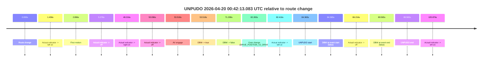
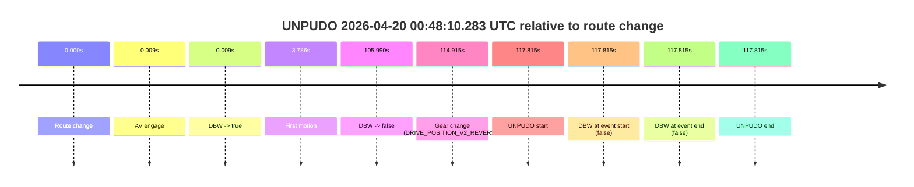
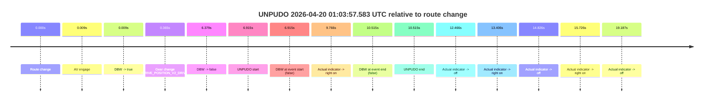
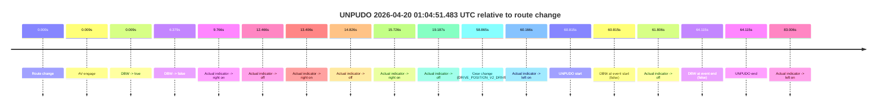

# Run Report: fme10010/2026-04-20--00-25-51--gen2-av-6e42eee7-6873-4c45-bf09-8fa363e8be0b

| Field | Value |
|---|---|
| Run ID | `fme10010/2026-04-20--00-25-51--gen2-av-6e42eee7-6873-4c45-bf09-8fa363e8be0b` |
| Date | `2026-04-20` |
| Model(s) | `pink-manta-ray-smooth` |
| Author | `guy.geva` |
| Event count | `4` |

## unpudo 2026-04-20 00:42:13.083 UTC

| Field | Value |
|---|---|
| Model | `pink-manta-ray-smooth` |
| Author | `guy.geva` |
| Run ID | `fme10010/2026-04-20--00-25-51--gen2-av-6e42eee7-6873-4c45-bf09-8fa363e8be0b` |
| Date | `2026-04-20` |
| Time (UTC) | `00:42:13.083` |
| Event type | `unpudo` |
| Disengagement type | `none observed` |
| Route change | `found` |
| Console | [run](https://console.sso.wayve.ai/run/fme10010/2026-04-20--00-25-51--gen2-av-6e42eee7-6873-4c45-bf09-8fa363e8be0b?id=&time-unixus=1776645733083292) |
| Foxglove | [segment](https://app.foxglove.dev/wayve-on-prem/p/prj_0dX18KZdVHg1fmmI/view?ds=foxglove-stream&ds.deviceName=fme10010&ds.start=2026-04-20T00%3A40%3A38.718230Z&ds.end=2026-04-20T00%3A42%3A28.283309Z&layoutId=lay_0e7VD4WIKDQGU73Y&time=2026-04-20T00%3A42%3A13.083292Z) |

### Event card: fail

- Fail: the credited unpudo does not stay AV-owned. The event window starts with DBW false, and the maneuver outcome lands outside a clean AV-owned segment.

| Event | Time (UTC) | Delta from route change |
|---|---:|---:|
| Route change | 2026-04-20 00:40:48.718 | `0.000s` |
| Actual indicator -> left on | 2026-04-20 00:40:50.154 | `1.436s` |
| First motion | 2026-04-20 00:40:51.614 | `2.896s` |
| Actual indicator -> off | 2026-04-20 00:40:53.994 | `5.276s` |
| Actual indicator -> right on | 2026-04-20 00:41:37.934 | `49.216s` |
| Actual indicator -> off | 2026-04-20 00:41:38.814 | `50.096s` |
| AV engage | 2026-04-20 00:41:42.236 | `53.518s` |
| DBW -> true | 2026-04-20 00:41:42.236 | `53.518s` |
| DBW -> false | 2026-04-20 00:42:00.016 | `71.299s` |
| Gear change (DRIVE_POSITION_V2_DRIVE) | 2026-04-20 00:42:10.983 | `82.265s` |
| Actual indicator -> left on | 2026-04-20 00:42:11.134 | `82.416s` |
| UNPUDO start | 2026-04-20 00:42:13.083 | `84.365s` |
| DBW at event start (false) | 2026-04-20 00:42:13.083 | `84.365s` |
| Actual indicator -> off | 2026-04-20 00:42:14.934 | `86.216s` |
| DBW at event end (false) | 2026-04-20 00:42:18.283 | `89.565s` |
| UNPUDO end | 2026-04-20 00:42:18.283 | `89.565s` |
| Actual indicator -> left on | 2026-04-20 00:42:34.594 | `105.876s` |

| Metric | Value |
|---|---|
| Outcome | `fail` |
| Effective failure type | `completed_outside_av` |
| Route change status | `found` |
| DBW at event start | `false` |
| DBW at event end | `false` |
| Predicted gear at AV start | `DRIVE_POSITION_V2_DRIVE` |
| Actual gear at AV start | `DRIVE_POSITION_V2_DRIVE` |
| Predicted gear at event start | `DRIVE_POSITION_V2_DRIVE` |
| Actual gear at event start | `DRIVE_POSITION_V2_DRIVE` |
| Planned indicator direction | `INDICATORS_STATE_V2_LEFT_ON` |
| Controller indicator direction | `INDICATORS_STATE_V2_LEFT_ON` |
| Actual indicator direction | `INDICATORS_STATE_V2_LEFT_ON` |
| Actual indicator at maneuver end | `INDICATORS_STATE_V2_OFF` |
| Driver accel help in AV | `false` |
| Driver accel help timestamp | `n/a` |
| Max accel pedal pct in AV | `0.0%` |
| Max brake pedal pct in AV | `15.2%` |
| Max speed mps in AV | `5.419` |
| Success timing baseline | `route change` |
| Route -> AV | `53.518s` |
| AV -> event start | `30.847s` |
| AV -> first motion | `-50.623s` |
| Success baseline -> event start | `84.365s` |
| Success baseline -> first motion | `2.896s` |
| AV duration before disengagement | `17.780s` |
| Trajectory waypoint count | `36` |
| Driving-plan step count | `11` |

The scored portion starts from the AV-owned window, not from the pre-AV setup. Route-change search in the stopped pre-event segment was `found`, with the baseline therefore set to route change. At the event anchor the model predicts `DRIVE_POSITION_V2_DRIVE` and the actual gear is `DRIVE_POSITION_V2_DRIVE`. The effective model outcome is `fail` because `completed_outside_av.`

### Resolution

| Field | Value |
|---|---|
| Final outcome | `fail` |
| Do we agree with this label? | `yes` |
| Source disengagement type | `none observed` |
| Resolved effective failure type | `completed_outside_av` |
| Confidence | `high` |

## unpudo 2026-04-20 00:48:10.283 UTC

| Field | Value |
|---|---|
| Model | `pink-manta-ray-smooth` |
| Author | `guy.geva` |
| Run ID | `fme10010/2026-04-20--00-25-51--gen2-av-6e42eee7-6873-4c45-bf09-8fa363e8be0b` |
| Date | `2026-04-20` |
| Time (UTC) | `00:48:10.283` |
| Event type | `unpudo` |
| Disengagement type | `none observed` |
| Route change | `found` |
| Console | [run](https://console.sso.wayve.ai/run/fme10010/2026-04-20--00-25-51--gen2-av-6e42eee7-6873-4c45-bf09-8fa363e8be0b?id=&time-unixus=1776646090283310) |
| Foxglove | [segment](https://app.foxglove.dev/wayve-on-prem/p/prj_0dX18KZdVHg1fmmI/view?ds=foxglove-stream&ds.deviceName=fme10010&ds.start=2026-04-20T00%3A46%3A02.468276Z&ds.end=2026-04-20T00%3A48%3A20.283310Z&layoutId=lay_0e7VD4WIKDQGU73Y&time=2026-04-20T00%3A48%3A10.283310Z) |

### Event card: fail

- Fail: the credited unpudo does not stay AV-owned. The event window starts with DBW false, and the maneuver outcome lands outside a clean AV-owned segment.

| Event | Time (UTC) | Delta from route change |
|---|---:|---:|
| Route change | 2026-04-20 00:46:12.468 | `0.000s` |
| AV engage | 2026-04-20 00:46:12.476 | `0.009s` |
| DBW -> true | 2026-04-20 00:46:12.476 | `0.009s` |
| First motion | 2026-04-20 00:46:16.254 | `3.786s` |
| DBW -> false | 2026-04-20 00:47:58.457 | `105.990s` |
| Gear change (DRIVE_POSITION_V2_REVERSE) | 2026-04-20 00:48:07.383 | `114.915s` |
| UNPUDO start | 2026-04-20 00:48:10.283 | `117.815s` |
| DBW at event start (false) | 2026-04-20 00:48:10.283 | `117.815s` |
| DBW at event end (false) | 2026-04-20 00:48:10.283 | `117.815s` |
| UNPUDO end | 2026-04-20 00:48:10.283 | `117.815s` |

| Metric | Value |
|---|---|
| Outcome | `fail` |
| Effective failure type | `not_av_owned` |
| Route change status | `found` |
| DBW at event start | `false` |
| DBW at event end | `false` |
| Predicted gear at AV start | `DRIVE_POSITION_V2_PARK` |
| Actual gear at AV start | `DRIVE_POSITION_V2_PARK` |
| Predicted gear at event start | `DRIVE_POSITION_V2_REVERSE` |
| Actual gear at event start | `DRIVE_POSITION_V2_REVERSE` |
| Planned indicator direction | `INDICATORS_STATE_V2_OFF` |
| Controller indicator direction | `INDICATORS_STATE_V2_OFF` |
| Actual indicator direction | `INDICATORS_STATE_V2_OFF` |
| Actual indicator at maneuver end | `INDICATORS_STATE_V2_OFF` |
| Driver accel help in AV | `false` |
| Driver accel help timestamp | `n/a` |
| Max accel pedal pct in AV | `0.0%` |
| Max brake pedal pct in AV | `26.0%` |
| Max speed mps in AV | `7.892` |
| Success timing baseline | `route change` |
| Route -> AV | `0.009s` |
| AV -> event start | `117.806s` |
| AV -> first motion | `3.777s` |
| Success baseline -> event start | `117.815s` |
| Success baseline -> first motion | `3.786s` |
| AV duration before disengagement | `105.981s` |
| Trajectory waypoint count | `36` |
| Driving-plan step count | `11` |

The scored portion starts from the AV-owned window, not from the pre-AV setup. Route-change search in the stopped pre-event segment was `found`, with the baseline therefore set to route change. At the event anchor the model predicts `DRIVE_POSITION_V2_REVERSE` and the actual gear is `DRIVE_POSITION_V2_REVERSE`. The effective model outcome is `fail` because `not_av_owned.`

### Resolution

| Field | Value |
|---|---|
| Final outcome | `fail` |
| Do we agree with this label? | `yes` |
| Source disengagement type | `none observed` |
| Resolved effective failure type | `not_av_owned` |
| Confidence | `high` |

## unpudo 2026-04-20 01:03:57.583 UTC

| Field | Value |
|---|---|
| Model | `pink-manta-ray-smooth` |
| Author | `guy.geva` |
| Run ID | `fme10010/2026-04-20--00-25-51--gen2-av-6e42eee7-6873-4c45-bf09-8fa363e8be0b` |
| Date | `2026-04-20` |
| Time (UTC) | `01:03:57.583` |
| Event type | `unpudo` |
| Disengagement type | `none observed` |
| Route change | `found` |
| Console | [run](https://console.sso.wayve.ai/run/fme10010/2026-04-20--00-25-51--gen2-av-6e42eee7-6873-4c45-bf09-8fa363e8be0b?id=&time-unixus=1776647037583293) |
| Foxglove | [segment](https://app.foxglove.dev/wayve-on-prem/p/prj_0dX18KZdVHg1fmmI/view?ds=foxglove-stream&ds.deviceName=fme10010&ds.start=2026-04-20T01%3A03%3A40.668270Z&ds.end=2026-04-20T01%3A04%3A11.183312Z&layoutId=lay_0e7VD4WIKDQGU73Y&time=2026-04-20T01%3A03%3A57.583293Z) |

### Event card: fail

- Fail: the credited unpudo does not stay AV-owned. The event window starts with DBW false, and the maneuver outcome lands outside a clean AV-owned segment.

| Event | Time (UTC) | Delta from route change |
|---|---:|---:|
| Route change | 2026-04-20 01:03:50.668 | `0.000s` |
| AV engage | 2026-04-20 01:03:50.676 | `0.009s` |
| DBW -> true | 2026-04-20 01:03:50.676 | `0.009s` |
| Gear change (DRIVE_POSITION_V2_DRIVE) | 2026-04-20 01:03:51.033 | `0.365s` |
| DBW -> false | 2026-04-20 01:03:57.047 | `6.379s` |
| UNPUDO start | 2026-04-20 01:03:57.583 | `6.915s` |
| DBW at event start (false) | 2026-04-20 01:03:57.583 | `6.915s` |
| Actual indicator -> right on | 2026-04-20 01:04:00.434 | `9.766s` |
| DBW at event end (false) | 2026-04-20 01:04:01.183 | `10.515s` |
| UNPUDO end | 2026-04-20 01:04:01.183 | `10.515s` |
| Actual indicator -> off | 2026-04-20 01:04:03.134 | `12.466s` |
| Actual indicator -> right on | 2026-04-20 01:04:04.074 | `13.406s` |
| Actual indicator -> off | 2026-04-20 01:04:05.494 | `14.826s` |
| Actual indicator -> right on | 2026-04-20 01:04:06.394 | `15.726s` |
| Actual indicator -> off | 2026-04-20 01:04:09.854 | `19.187s` |

| Metric | Value |
|---|---|
| Outcome | `fail` |
| Effective failure type | `not_av_owned` |
| Route change status | `found` |
| DBW at event start | `false` |
| DBW at event end | `false` |
| Predicted gear at AV start | `DRIVE_POSITION_V2_PARK` |
| Actual gear at AV start | `DRIVE_POSITION_V2_PARK` |
| Predicted gear at event start | `DRIVE_POSITION_V2_DRIVE` |
| Actual gear at event start | `DRIVE_POSITION_V2_DRIVE` |
| Planned indicator direction | `INDICATORS_STATE_V2_LEFT_ON` |
| Controller indicator direction | `INDICATORS_STATE_V2_LEFT_ON` |
| Actual indicator direction | `INDICATORS_STATE_V2_OFF` |
| Actual indicator at maneuver end | `INDICATORS_STATE_V2_RIGHT_ON` |
| Driver accel help in AV | `false` |
| Driver accel help timestamp | `n/a` |
| Max accel pedal pct in AV | `0.0%` |
| Max brake pedal pct in AV | `21.0%` |
| Max speed mps in AV | `0.000` |
| Success timing baseline | `route change` |
| Route -> AV | `0.009s` |
| AV -> event start | `6.906s` |
| AV -> first motion | `n/a` |
| Success baseline -> event start | `6.915s` |
| Success baseline -> first motion | `n/a` |
| AV duration before disengagement | `6.370s` |
| Trajectory waypoint count | `36` |
| Driving-plan step count | `11` |

The scored portion starts from the AV-owned window, not from the pre-AV setup. Route-change search in the stopped pre-event segment was `found`, with the baseline therefore set to route change. At the event anchor the model predicts `DRIVE_POSITION_V2_DRIVE` and the actual gear is `DRIVE_POSITION_V2_DRIVE`. The effective model outcome is `fail` because `not_av_owned.`

### Resolution

| Field | Value |
|---|---|
| Final outcome | `fail` |
| Do we agree with this label? | `yes` |
| Source disengagement type | `none observed` |
| Resolved effective failure type | `not_av_owned` |
| Confidence | `high` |

## unpudo 2026-04-20 01:04:51.483 UTC

| Field | Value |
|---|---|
| Model | `pink-manta-ray-smooth` |
| Author | `guy.geva` |
| Run ID | `fme10010/2026-04-20--00-25-51--gen2-av-6e42eee7-6873-4c45-bf09-8fa363e8be0b` |
| Date | `2026-04-20` |
| Time (UTC) | `01:04:51.483` |
| Event type | `unpudo` |
| Disengagement type | `none observed` |
| Route change | `found` |
| Console | [run](https://console.sso.wayve.ai/run/fme10010/2026-04-20--00-25-51--gen2-av-6e42eee7-6873-4c45-bf09-8fa363e8be0b?id=&time-unixus=1776647091483296) |
| Foxglove | [segment](https://app.foxglove.dev/wayve-on-prem/p/prj_0dX18KZdVHg1fmmI/view?ds=foxglove-stream&ds.deviceName=fme10010&ds.start=2026-04-20T01%3A03%3A40.668270Z&ds.end=2026-04-20T01%3A05%3A04.783311Z&layoutId=lay_0e7VD4WIKDQGU73Y&time=2026-04-20T01%3A04%3A51.483296Z) |

### Event card: fail

- Fail: the credited unpudo does not stay AV-owned. The event window starts with DBW false, and the maneuver outcome lands outside a clean AV-owned segment.

| Event | Time (UTC) | Delta from route change |
|---|---:|---:|
| Route change | 2026-04-20 01:03:50.668 | `0.000s` |
| AV engage | 2026-04-20 01:03:50.676 | `0.009s` |
| DBW -> true | 2026-04-20 01:03:50.676 | `0.009s` |
| DBW -> false | 2026-04-20 01:03:57.047 | `6.379s` |
| Actual indicator -> right on | 2026-04-20 01:04:00.434 | `9.766s` |
| Actual indicator -> off | 2026-04-20 01:04:03.134 | `12.466s` |
| Actual indicator -> right on | 2026-04-20 01:04:04.074 | `13.406s` |
| Actual indicator -> off | 2026-04-20 01:04:05.494 | `14.826s` |
| Actual indicator -> right on | 2026-04-20 01:04:06.394 | `15.726s` |
| Actual indicator -> off | 2026-04-20 01:04:09.854 | `19.187s` |
| Gear change (DRIVE_POSITION_V2_DRIVE) | 2026-04-20 01:04:49.533 | `58.865s` |
| Actual indicator -> left on | 2026-04-20 01:04:50.834 | `60.166s` |
| UNPUDO start | 2026-04-20 01:04:51.483 | `60.815s` |
| DBW at event start (false) | 2026-04-20 01:04:51.483 | `60.815s` |
| Actual indicator -> off | 2026-04-20 01:04:52.474 | `61.806s` |
| DBW at event end (false) | 2026-04-20 01:04:54.783 | `64.115s` |
| UNPUDO end | 2026-04-20 01:04:54.783 | `64.115s` |
| Actual indicator -> left on | 2026-04-20 01:05:13.674 | `83.006s` |

| Metric | Value |
|---|---|
| Outcome | `fail` |
| Effective failure type | `not_av_owned` |
| Route change status | `found` |
| DBW at event start | `false` |
| DBW at event end | `false` |
| Predicted gear at AV start | `DRIVE_POSITION_V2_PARK` |
| Actual gear at AV start | `DRIVE_POSITION_V2_PARK` |
| Predicted gear at event start | `DRIVE_POSITION_V2_DRIVE` |
| Actual gear at event start | `DRIVE_POSITION_V2_DRIVE` |
| Planned indicator direction | `INDICATORS_STATE_V2_LEFT_ON` |
| Controller indicator direction | `INDICATORS_STATE_V2_LEFT_ON` |
| Actual indicator direction | `INDICATORS_STATE_V2_LEFT_ON` |
| Actual indicator at maneuver end | `INDICATORS_STATE_V2_OFF` |
| Driver accel help in AV | `false` |
| Driver accel help timestamp | `n/a` |
| Max accel pedal pct in AV | `0.0%` |
| Max brake pedal pct in AV | `21.0%` |
| Max speed mps in AV | `0.000` |
| Success timing baseline | `route change` |
| Route -> AV | `0.009s` |
| AV -> event start | `60.806s` |
| AV -> first motion | `n/a` |
| Success baseline -> event start | `60.815s` |
| Success baseline -> first motion | `n/a` |
| AV duration before disengagement | `6.370s` |
| Trajectory waypoint count | `36` |
| Driving-plan step count | `11` |

The scored portion starts from the AV-owned window, not from the pre-AV setup. Route-change search in the stopped pre-event segment was `found`, with the baseline therefore set to route change. At the event anchor the model predicts `DRIVE_POSITION_V2_DRIVE` and the actual gear is `DRIVE_POSITION_V2_DRIVE`. The effective model outcome is `fail` because `not_av_owned.`

### Resolution

| Field | Value |
|---|---|
| Final outcome | `fail` |
| Do we agree with this label? | `yes` |
| Source disengagement type | `none observed` |
| Resolved effective failure type | `not_av_owned` |
| Confidence | `high` |
