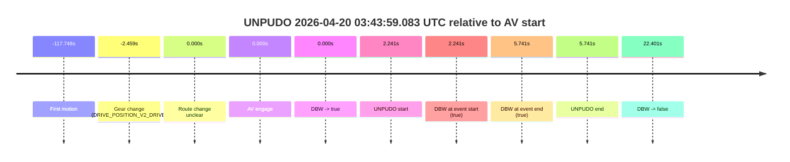
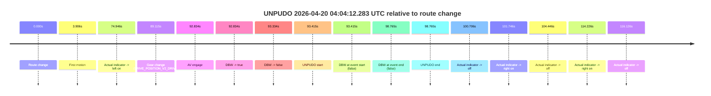
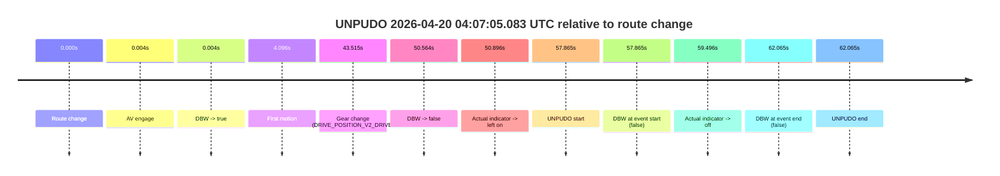

# Run Report: fme10010/2026-04-20--03-36-00--gen2-av-f6aace20-84ba-4a00-b9b5-7e85431a4d0c

| Field | Value |
|---|---|
| Run ID | `fme10010/2026-04-20--03-36-00--gen2-av-f6aace20-84ba-4a00-b9b5-7e85431a4d0c` |
| Date | `2026-04-20` |
| Model(s) | `pink-manta-ray-smooth` |
| Author | `guy.geva` |
| Event count | `3` |

## unpudo 2026-04-20 03:43:59.083 UTC

| Field | Value |
|---|---|
| Model | `pink-manta-ray-smooth` |
| Author | `guy.geva` |
| Run ID | `fme10010/2026-04-20--03-36-00--gen2-av-f6aace20-84ba-4a00-b9b5-7e85431a4d0c` |
| Date | `2026-04-20` |
| Time (UTC) | `03:43:59.083` |
| Event type | `unpudo` |
| Disengagement type | `none observed` |
| Route change | `unclear` |
| Console | [run](https://console.sso.wayve.ai/run/fme10010/2026-04-20--03-36-00--gen2-av-f6aace20-84ba-4a00-b9b5-7e85431a4d0c?id=&time-unixus=1776656639083290) |
| Foxglove | [segment](https://app.foxglove.dev/wayve-on-prem/p/prj_0dX18KZdVHg1fmmI/view?ds=foxglove-stream&ds.deviceName=fme10010&ds.start=2026-04-20T03%3A43%3A44.383292Z&ds.end=2026-04-20T03%3A44%3A29.243209Z&layoutId=lay_0e7VD4WIKDQGU73Y&time=2026-04-20T03%3A43%3A59.083290Z) |

### Event card: pass

- Pass: AV owns the credited unpudo from route change through the official unpudo window, the gear state is aligned at the anchor, and the vehicle moves without driver accelerator help in AV.

| Event | Time (UTC) | Delta from AV start |
|---|---:|---:|
| First motion | 2026-04-20 03:41:59.094 | `-117.748s` |
| Gear change (DRIVE_POSITION_V2_DRIVE) | 2026-04-20 03:43:54.383 | `-2.459s` |
| Route change unclear | 2026-04-20 03:43:56.842 | `0.000s` |
| AV engage | 2026-04-20 03:43:56.842 | `0.000s` |
| DBW -> true | 2026-04-20 03:43:56.842 | `0.000s` |
| UNPUDO start | 2026-04-20 03:43:59.083 | `2.241s` |
| DBW at event start (true) | 2026-04-20 03:43:59.083 | `2.241s` |
| DBW at event end (true) | 2026-04-20 03:44:02.583 | `5.741s` |
| UNPUDO end | 2026-04-20 03:44:02.583 | `5.741s` |
| DBW -> false | 2026-04-20 03:44:19.243 | `22.401s` |

| Metric | Value |
|---|---|
| Outcome | `pass` |
| Effective failure type | `none` |
| Route change status | `unclear` |
| DBW at event start | `true` |
| DBW at event end | `true` |
| Predicted gear at AV start | `DRIVE_POSITION_V2_DRIVE` |
| Actual gear at AV start | `DRIVE_POSITION_V2_DRIVE` |
| Predicted gear at event start | `DRIVE_POSITION_V2_DRIVE` |
| Actual gear at event start | `DRIVE_POSITION_V2_DRIVE` |
| Planned indicator direction | `INDICATORS_STATE_V2_LEFT_ON` |
| Controller indicator direction | `INDICATORS_STATE_V2_LEFT_ON` |
| Actual indicator direction | `INDICATORS_STATE_V2_OFF` |
| Actual indicator at maneuver end | `INDICATORS_STATE_V2_OFF` |
| Driver accel help in AV | `false` |
| Driver accel help timestamp | `n/a` |
| Max accel pedal pct in AV | `0.0%` |
| Max brake pedal pct in AV | `8.0%` |
| Max speed mps in AV | `5.228` |
| Success timing baseline | `AV start` |
| Route -> AV | `n/a` |
| AV -> event start | `2.241s` |
| AV -> first motion | `-117.748s` |
| Success baseline -> event start | `2.241s` |
| Success baseline -> first motion | `-117.748s` |
| AV duration before disengagement | `22.401s` |
| Trajectory waypoint count | `37` |
| Driving-plan step count | `11` |

The scored portion starts from the AV-owned window, not from the pre-AV setup. Route-change search in the stopped pre-event segment was `unclear`, with the baseline therefore set to AV start. At the event anchor the model predicts `DRIVE_POSITION_V2_DRIVE` and the actual gear is `DRIVE_POSITION_V2_DRIVE`. The effective model outcome is `pass` because `the credited unpudo stays AV-owned through the official unpudo window.`

### Resolution

| Field | Value |
|---|---|
| Final outcome | `pass` |
| Do we agree with this label? | `yes` |
| Source disengagement type | `none observed` |
| Resolved effective failure type | `none` |
| Confidence | `medium` |

## unpudo 2026-04-20 04:04:12.283 UTC

| Field | Value |
|---|---|
| Model | `pink-manta-ray-smooth` |
| Author | `guy.geva` |
| Run ID | `fme10010/2026-04-20--03-36-00--gen2-av-f6aace20-84ba-4a00-b9b5-7e85431a4d0c` |
| Date | `2026-04-20` |
| Time (UTC) | `04:04:12.283` |
| Event type | `unpudo` |
| Disengagement type | `uncommanded_disengagement` |
| Route change | `found` |
| Console | [run](https://console.sso.wayve.ai/run/fme10010/2026-04-20--03-36-00--gen2-av-f6aace20-84ba-4a00-b9b5-7e85431a4d0c?id=&time-unixus=1776657852283300) |
| Foxglove | [segment](https://app.foxglove.dev/wayve-on-prem/p/prj_0dX18KZdVHg1fmmI/view?ds=foxglove-stream&ds.deviceName=fme10010&ds.start=2026-04-20T04%3A02%3A28.868263Z&ds.end=2026-04-20T04%3A04%3A27.633314Z&layoutId=lay_0e7VD4WIKDQGU73Y&time=2026-04-20T04%3A04%3A12.283300Z) |

### Event card: accidental

- Accidental: AV ownership is present for less than `2s`, so this is treated as an accidental brush with the maneuver rather than a meaningful model attempt.

| Event | Time (UTC) | Delta from route change |
|---|---:|---:|
| Route change | 2026-04-20 04:02:38.868 | `0.000s` |
| First motion | 2026-04-20 04:02:42.774 | `3.906s` |
| Actual indicator -> left on | 2026-04-20 04:03:53.814 | `74.946s` |
| Gear change (DRIVE_POSITION_V2_DRIVE) | 2026-04-20 04:04:07.983 | `89.115s` |
| AV engage | 2026-04-20 04:04:11.701 | `92.834s` |
| DBW -> true | 2026-04-20 04:04:11.701 | `92.834s` |
| DBW -> false | 2026-04-20 04:04:12.202 | `93.334s` |
| UNPUDO start | 2026-04-20 04:04:12.283 | `93.415s` |
| DBW at event start (false) | 2026-04-20 04:04:12.283 | `93.415s` |
| DBW at event end (false) | 2026-04-20 04:04:17.633 | `98.765s` |
| UNPUDO end | 2026-04-20 04:04:17.633 | `98.765s` |
| Actual indicator -> off | 2026-04-20 04:04:19.574 | `100.706s` |
| Actual indicator -> right on | 2026-04-20 04:04:20.614 | `101.746s` |
| Actual indicator -> off | 2026-04-20 04:04:23.314 | `104.446s` |
| Actual indicator -> right on | 2026-04-20 04:04:33.094 | `114.226s` |
| Actual indicator -> off | 2026-04-20 04:04:34.994 | `116.126s` |

| Metric | Value |
|---|---|
| Outcome | `accidental` |
| Effective failure type | `none` |
| Route change status | `found` |
| DBW at event start | `false` |
| DBW at event end | `false` |
| Predicted gear at AV start | `DRIVE_POSITION_V2_DRIVE` |
| Actual gear at AV start | `DRIVE_POSITION_V2_DRIVE` |
| Predicted gear at event start | `DRIVE_POSITION_V2_DRIVE` |
| Actual gear at event start | `DRIVE_POSITION_V2_DRIVE` |
| Planned indicator direction | `INDICATORS_STATE_V2_LEFT_ON` |
| Controller indicator direction | `INDICATORS_STATE_V2_LEFT_ON` |
| Actual indicator direction | `INDICATORS_STATE_V2_LEFT_ON` |
| Actual indicator at maneuver end | `INDICATORS_STATE_V2_LEFT_ON` |
| Driver accel help in AV | `false` |
| Driver accel help timestamp | `n/a` |
| Max accel pedal pct in AV | `0.0%` |
| Max brake pedal pct in AV | `0.0%` |
| Max speed mps in AV | `0.000` |
| Success timing baseline | `route change` |
| Route -> AV | `92.834s` |
| AV -> event start | `0.581s` |
| AV -> first motion | `-88.928s` |
| Success baseline -> event start | `93.415s` |
| Success baseline -> first motion | `3.906s` |
| AV duration before disengagement | `0.500s` |
| Trajectory waypoint count | `37` |
| Driving-plan step count | `11` |

The scored portion starts from the AV-owned window, not from the pre-AV setup. Route-change search in the stopped pre-event segment was `found`, with the baseline therefore set to route change. At the event anchor the model predicts `DRIVE_POSITION_V2_DRIVE` and the actual gear is `DRIVE_POSITION_V2_DRIVE`. The effective model outcome is `accidental` because `the AV-owned portion is shorter than 2s.`

### Resolution

| Field | Value |
|---|---|
| Final outcome | `accidental` |
| Do we agree with this label? | `yes` |
| Source disengagement type | `uncommanded_disengagement` |
| Resolved effective failure type | `none` |
| Confidence | `high` |

## unpudo 2026-04-20 04:07:05.083 UTC

| Field | Value |
|---|---|
| Model | `pink-manta-ray-smooth` |
| Author | `guy.geva` |
| Run ID | `fme10010/2026-04-20--03-36-00--gen2-av-f6aace20-84ba-4a00-b9b5-7e85431a4d0c` |
| Date | `2026-04-20` |
| Time (UTC) | `04:07:05.083` |
| Event type | `unpudo` |
| Disengagement type | `failed_to_unpudo` |
| Route change | `found` |
| Console | [run](https://console.sso.wayve.ai/run/fme10010/2026-04-20--03-36-00--gen2-av-f6aace20-84ba-4a00-b9b5-7e85431a4d0c?id=&time-unixus=1776658025083315) |
| Foxglove | [segment](https://app.foxglove.dev/wayve-on-prem/p/prj_0dX18KZdVHg1fmmI/view?ds=foxglove-stream&ds.deviceName=fme10010&ds.start=2026-04-20T04%3A05%3A57.218433Z&ds.end=2026-04-20T04%3A07%3A19.283311Z&layoutId=lay_0e7VD4WIKDQGU73Y&time=2026-04-20T04%3A07%3A05.083315Z) |

### Event card: fail

- Fail: AV owns part of the segment, but the event still resolves as a model-performance failure under the AV-only scoring rule.

| Event | Time (UTC) | Delta from route change |
|---|---:|---:|
| Route change | 2026-04-20 04:06:07.218 | `0.000s` |
| AV engage | 2026-04-20 04:06:07.222 | `0.004s` |
| DBW -> true | 2026-04-20 04:06:07.222 | `0.004s` |
| First motion | 2026-04-20 04:06:11.314 | `4.096s` |
| Gear change (DRIVE_POSITION_V2_DRIVE) | 2026-04-20 04:06:50.733 | `43.515s` |
| DBW -> false | 2026-04-20 04:06:57.782 | `50.564s` |
| Actual indicator -> left on | 2026-04-20 04:06:58.114 | `50.896s` |
| UNPUDO start | 2026-04-20 04:07:05.083 | `57.865s` |
| DBW at event start (false) | 2026-04-20 04:07:05.083 | `57.865s` |
| Actual indicator -> off | 2026-04-20 04:07:06.714 | `59.496s` |
| DBW at event end (false) | 2026-04-20 04:07:09.283 | `62.065s` |
| UNPUDO end | 2026-04-20 04:07:09.283 | `62.065s` |

| Metric | Value |
|---|---|
| Outcome | `fail` |
| Effective failure type | `failed_to_unpudo` |
| Route change status | `found` |
| DBW at event start | `false` |
| DBW at event end | `false` |
| Predicted gear at AV start | `DRIVE_POSITION_V2_PARK` |
| Actual gear at AV start | `DRIVE_POSITION_V2_PARK` |
| Predicted gear at event start | `DRIVE_POSITION_V2_DRIVE` |
| Actual gear at event start | `DRIVE_POSITION_V2_DRIVE` |
| Planned indicator direction | `INDICATORS_STATE_V2_LEFT_ON` |
| Controller indicator direction | `INDICATORS_STATE_V2_LEFT_ON` |
| Actual indicator direction | `INDICATORS_STATE_V2_LEFT_ON` |
| Actual indicator at maneuver end | `INDICATORS_STATE_V2_OFF` |
| Driver accel help in AV | `false` |
| Driver accel help timestamp | `n/a` |
| Max accel pedal pct in AV | `0.0%` |
| Max brake pedal pct in AV | `21.0%` |
| Max speed mps in AV | `10.214` |
| Success timing baseline | `route change` |
| Route -> AV | `0.004s` |
| AV -> event start | `57.861s` |
| AV -> first motion | `4.092s` |
| Success baseline -> event start | `57.865s` |
| Success baseline -> first motion | `4.096s` |
| AV duration before disengagement | `50.561s` |
| Trajectory waypoint count | `37` |
| Driving-plan step count | `11` |

The scored portion starts from the AV-owned window, not from the pre-AV setup. Route-change search in the stopped pre-event segment was `found`, with the baseline therefore set to route change. At the event anchor the model predicts `DRIVE_POSITION_V2_DRIVE` and the actual gear is `DRIVE_POSITION_V2_DRIVE`. The effective model outcome is `fail` because `failed_to_unpudo.`

### Resolution

| Field | Value |
|---|---|
| Final outcome | `fail` |
| Do we agree with this label? | `yes` |
| Source disengagement type | `failed_to_unpudo` |
| Resolved effective failure type | `failed_to_unpudo` |
| Confidence | `high` |
