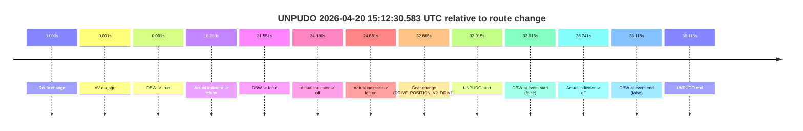
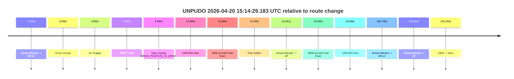
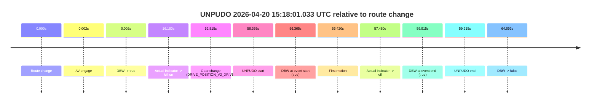

# Run Report: fme10010/2026-04-20--14-56-54--gen2-av-56c79977-1b11-4e16-8203-b7113c52b80b

| Field | Value |
|---|---|
| Run ID | `fme10010/2026-04-20--14-56-54--gen2-av-56c79977-1b11-4e16-8203-b7113c52b80b` |
| Date | `2026-04-20` |
| Model(s) | `eel-teal-outspoken` |
| Author | `zak` |
| Event count | `3` |

## unpudo 2026-04-20 15:12:30.583 UTC

| Field | Value |
|---|---|
| Model | `eel-teal-outspoken` |
| Author | `zak` |
| Run ID | `fme10010/2026-04-20--14-56-54--gen2-av-56c79977-1b11-4e16-8203-b7113c52b80b` |
| Date | `2026-04-20` |
| Time (UTC) | `15:12:30.583` |
| Event type | `unpudo` |
| Disengagement type | `none observed` |
| Route change | `found` |
| Console | [run](https://console.sso.wayve.ai/run/fme10010/2026-04-20--14-56-54--gen2-av-56c79977-1b11-4e16-8203-b7113c52b80b?id=&time-unixus=1776697950583307) |
| Foxglove | [segment](https://app.foxglove.dev/wayve-on-prem/p/prj_0dX18KZdVHg1fmmI/view?ds=foxglove-stream&ds.deviceName=fme10010&ds.start=2026-04-20T15%3A11%3A46.668578Z&ds.end=2026-04-20T15%3A12%3A44.783316Z&layoutId=lay_0e7VD4WIKDQGU73Y&time=2026-04-20T15%3A12%3A30.583307Z) |

### Event card: fail

- Fail: the credited unpudo does not stay AV-owned. The event window starts with DBW false, and the maneuver outcome lands outside a clean AV-owned segment.

| Event | Time (UTC) | Delta from route change |
|---|---:|---:|
| Route change | 2026-04-20 15:11:56.668 | `0.000s` |
| AV engage | 2026-04-20 15:11:56.669 | `0.001s` |
| DBW -> true | 2026-04-20 15:11:56.669 | `0.001s` |
| Actual indicator -> left on | 2026-04-20 15:12:14.948 | `18.280s` |
| DBW -> false | 2026-04-20 15:12:18.219 | `21.551s` |
| Actual indicator -> off | 2026-04-20 15:12:20.848 | `24.180s` |
| Actual indicator -> left on | 2026-04-20 15:12:21.349 | `24.681s` |
| Gear change (DRIVE_POSITION_V2_DRIVE) | 2026-04-20 15:12:29.333 | `32.665s` |
| UNPUDO start | 2026-04-20 15:12:30.583 | `33.915s` |
| DBW at event start (false) | 2026-04-20 15:12:30.583 | `33.915s` |
| Actual indicator -> off | 2026-04-20 15:12:33.409 | `36.741s` |
| DBW at event end (false) | 2026-04-20 15:12:34.783 | `38.115s` |
| UNPUDO end | 2026-04-20 15:12:34.783 | `38.115s` |

| Metric | Value |
|---|---|
| Outcome | `fail` |
| Effective failure type | `not_av_owned` |
| Route change status | `found` |
| DBW at event start | `false` |
| DBW at event end | `false` |
| Predicted gear at AV start | `DRIVE_POSITION_V2_PARK` |
| Actual gear at AV start | `DRIVE_POSITION_V2_PARK` |
| Predicted gear at event start | `DRIVE_POSITION_V2_DRIVE` |
| Actual gear at event start | `DRIVE_POSITION_V2_DRIVE` |
| Planned indicator direction | `INDICATORS_STATE_V2_LEFT_ON` |
| Controller indicator direction | `INDICATORS_STATE_V2_LEFT_ON` |
| Actual indicator direction | `INDICATORS_STATE_V2_LEFT_ON` |
| Actual indicator at maneuver end | `INDICATORS_STATE_V2_OFF` |
| Driver accel help in AV | `false` |
| Driver accel help timestamp | `n/a` |
| Max accel pedal pct in AV | `0.0%` |
| Max brake pedal pct in AV | `8.0%` |
| Max speed mps in AV | `0.000` |
| Success timing baseline | `route change` |
| Route -> AV | `0.001s` |
| AV -> event start | `33.913s` |
| AV -> first motion | `n/a` |
| Success baseline -> event start | `33.915s` |
| Success baseline -> first motion | `n/a` |
| AV duration before disengagement | `21.550s` |
| Trajectory waypoint count | `37` |
| Driving-plan step count | `11` |

The scored portion starts from the AV-owned window, not from the pre-AV setup. Route-change search in the stopped pre-event segment was `found`, with the baseline therefore set to route change. At the event anchor the model predicts `DRIVE_POSITION_V2_DRIVE` and the actual gear is `DRIVE_POSITION_V2_DRIVE`. The effective model outcome is `fail` because `not_av_owned.`

### Resolution

| Field | Value |
|---|---|
| Final outcome | `fail` |
| Do we agree with this label? | `yes` |
| Source disengagement type | `none observed` |
| Resolved effective failure type | `not_av_owned` |
| Confidence | `high` |

## unpudo 2026-04-20 15:14:29.183 UTC

| Field | Value |
|---|---|
| Model | `eel-teal-outspoken` |
| Author | `zak` |
| Run ID | `fme10010/2026-04-20--14-56-54--gen2-av-56c79977-1b11-4e16-8203-b7113c52b80b` |
| Date | `2026-04-20` |
| Time (UTC) | `15:14:29.183` |
| Event type | `unpudo` |
| Disengagement type | `none observed` |
| Route change | `found` |
| Console | [run](https://console.sso.wayve.ai/run/fme10010/2026-04-20--14-56-54--gen2-av-56c79977-1b11-4e16-8203-b7113c52b80b?id=&time-unixus=1776698069183300) |
| Foxglove | [segment](https://app.foxglove.dev/wayve-on-prem/p/prj_0dX18KZdVHg1fmmI/view?ds=foxglove-stream&ds.deviceName=fme10010&ds.start=2026-04-20T15%3A14%3A07.118242Z&ds.end=2026-04-20T15%3A18%3A19.360978Z&layoutId=lay_0e7VD4WIKDQGU73Y&time=2026-04-20T15%3A14%3A29.183300Z) |

### Event card: pass

- Pass: AV owns the credited unpudo from route change through the official unpudo window, the gear state is aligned at the anchor, and the vehicle moves without driver accelerator help in AV.

| Event | Time (UTC) | Delta from route change |
|---|---:|---:|
| Actual indicator -> left on | 2026-04-20 15:14:09.428 | `-7.690s` |
| Route change | 2026-04-20 15:14:17.118 | `0.000s` |
| AV engage | 2026-04-20 15:14:20.779 | `3.662s` |
| DBW -> true | 2026-04-20 15:14:20.779 | `3.662s` |
| Gear change (DRIVE_POSITION_V2_DRIVE) | 2026-04-20 15:14:25.483 | `8.365s` |
| UNPUDO start | 2026-04-20 15:14:29.183 | `12.065s` |
| DBW at event start (true) | 2026-04-20 15:14:29.183 | `12.065s` |
| First motion | 2026-04-20 15:14:29.208 | `12.090s` |
| Actual indicator -> off | 2026-04-20 15:14:30.669 | `13.551s` |
| DBW at event end (true) | 2026-04-20 15:14:33.683 | `16.565s` |
| UNPUDO end | 2026-04-20 15:14:33.683 | `16.565s` |
| Actual indicator -> left on | 2026-04-20 15:17:20.848 | `183.730s` |
| Actual indicator -> off | 2026-04-20 15:18:02.148 | `225.031s` |
| DBW -> false | 2026-04-20 15:18:09.360 | `232.243s` |

| Metric | Value |
|---|---|
| Outcome | `pass` |
| Effective failure type | `none` |
| Route change status | `found` |
| DBW at event start | `true` |
| DBW at event end | `true` |
| Predicted gear at AV start | `DRIVE_POSITION_V2_PARK` |
| Actual gear at AV start | `DRIVE_POSITION_V2_PARK` |
| Predicted gear at event start | `DRIVE_POSITION_V2_DRIVE` |
| Actual gear at event start | `DRIVE_POSITION_V2_DRIVE` |
| Planned indicator direction | `INDICATORS_STATE_V2_LEFT_ON` |
| Controller indicator direction | `INDICATORS_STATE_V2_LEFT_ON` |
| Actual indicator direction | `INDICATORS_STATE_V2_LEFT_ON` |
| Actual indicator at maneuver end | `INDICATORS_STATE_V2_OFF` |
| Driver accel help in AV | `false` |
| Driver accel help timestamp | `n/a` |
| Max accel pedal pct in AV | `0.0%` |
| Max brake pedal pct in AV | `27.6%` |
| Max speed mps in AV | `2.769` |
| Success timing baseline | `route change` |
| Route -> AV | `3.662s` |
| AV -> event start | `8.404s` |
| AV -> first motion | `8.429s` |
| Success baseline -> event start | `12.065s` |
| Success baseline -> first motion | `12.090s` |
| AV duration before disengagement | `228.581s` |
| Trajectory waypoint count | `37` |
| Driving-plan step count | `11` |

The scored portion starts from the AV-owned window, not from the pre-AV setup. Route-change search in the stopped pre-event segment was `found`, with the baseline therefore set to route change. At the event anchor the model predicts `DRIVE_POSITION_V2_DRIVE` and the actual gear is `DRIVE_POSITION_V2_DRIVE`. The effective model outcome is `pass` because `the credited unpudo stays AV-owned through the official unpudo window.`

### Resolution

| Field | Value |
|---|---|
| Final outcome | `pass` |
| Do we agree with this label? | `yes` |
| Source disengagement type | `none observed` |
| Resolved effective failure type | `none` |
| Confidence | `high` |

## unpudo 2026-04-20 15:18:01.033 UTC

| Field | Value |
|---|---|
| Model | `eel-teal-outspoken` |
| Author | `zak` |
| Run ID | `fme10010/2026-04-20--14-56-54--gen2-av-56c79977-1b11-4e16-8203-b7113c52b80b` |
| Date | `2026-04-20` |
| Time (UTC) | `15:18:01.033` |
| Event type | `unpudo` |
| Disengagement type | `none observed` |
| Route change | `found` |
| Console | [run](https://console.sso.wayve.ai/run/fme10010/2026-04-20--14-56-54--gen2-av-56c79977-1b11-4e16-8203-b7113c52b80b?id=&time-unixus=1776698281033299) |
| Foxglove | [segment](https://app.foxglove.dev/wayve-on-prem/p/prj_0dX18KZdVHg1fmmI/view?ds=foxglove-stream&ds.deviceName=fme10010&ds.start=2026-04-20T15%3A16%3A54.668298Z&ds.end=2026-04-20T15%3A18%3A19.360978Z&layoutId=lay_0e7VD4WIKDQGU73Y&time=2026-04-20T15%3A18%3A01.033299Z) |

### Event card: pass

- Pass: AV owns the credited unpudo from route change through the official unpudo window, the gear state is aligned at the anchor, and the vehicle moves without driver accelerator help in AV.

| Event | Time (UTC) | Delta from route change |
|---|---:|---:|
| Route change | 2026-04-20 15:17:04.668 | `0.000s` |
| AV engage | 2026-04-20 15:17:04.669 | `0.002s` |
| DBW -> true | 2026-04-20 15:17:04.669 | `0.002s` |
| Actual indicator -> left on | 2026-04-20 15:17:20.848 | `16.180s` |
| Gear change (DRIVE_POSITION_V2_DRIVE) | 2026-04-20 15:17:57.483 | `52.815s` |
| UNPUDO start | 2026-04-20 15:18:01.033 | `56.365s` |
| DBW at event start (true) | 2026-04-20 15:18:01.033 | `56.365s` |
| First motion | 2026-04-20 15:18:01.088 | `56.420s` |
| Actual indicator -> off | 2026-04-20 15:18:02.148 | `57.480s` |
| DBW at event end (true) | 2026-04-20 15:18:04.583 | `59.915s` |
| UNPUDO end | 2026-04-20 15:18:04.583 | `59.915s` |
| DBW -> false | 2026-04-20 15:18:09.360 | `64.693s` |

| Metric | Value |
|---|---|
| Outcome | `pass` |
| Effective failure type | `none` |
| Route change status | `found` |
| DBW at event start | `true` |
| DBW at event end | `true` |
| Predicted gear at AV start | `DRIVE_POSITION_V2_PARK` |
| Actual gear at AV start | `DRIVE_POSITION_V2_PARK` |
| Predicted gear at event start | `DRIVE_POSITION_V2_DRIVE` |
| Actual gear at event start | `DRIVE_POSITION_V2_DRIVE` |
| Planned indicator direction | `INDICATORS_STATE_V2_LEFT_ON` |
| Controller indicator direction | `INDICATORS_STATE_V2_LEFT_ON` |
| Actual indicator direction | `INDICATORS_STATE_V2_LEFT_ON` |
| Actual indicator at maneuver end | `INDICATORS_STATE_V2_OFF` |
| Driver accel help in AV | `false` |
| Driver accel help timestamp | `n/a` |
| Max accel pedal pct in AV | `0.0%` |
| Max brake pedal pct in AV | `8.4%` |
| Max speed mps in AV | `5.856` |
| Success timing baseline | `route change` |
| Route -> AV | `0.002s` |
| AV -> event start | `56.363s` |
| AV -> first motion | `56.419s` |
| Success baseline -> event start | `56.365s` |
| Success baseline -> first motion | `56.420s` |
| AV duration before disengagement | `64.691s` |
| Trajectory waypoint count | `38` |
| Driving-plan step count | `11` |

The scored portion starts from the AV-owned window, not from the pre-AV setup. Route-change search in the stopped pre-event segment was `found`, with the baseline therefore set to route change. At the event anchor the model predicts `DRIVE_POSITION_V2_DRIVE` and the actual gear is `DRIVE_POSITION_V2_DRIVE`. The effective model outcome is `pass` because `the credited unpudo stays AV-owned through the official unpudo window.`

### Resolution

| Field | Value |
|---|---|
| Final outcome | `pass` |
| Do we agree with this label? | `yes` |
| Source disengagement type | `none observed` |
| Resolved effective failure type | `none` |
| Confidence | `high` |
