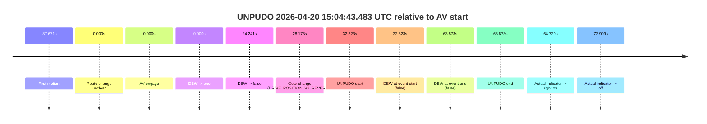
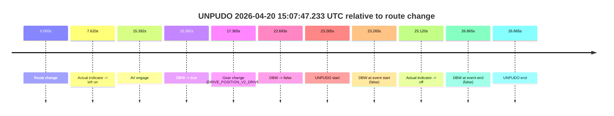

# Run Report: fme10010/2026-04-20--14-56-54--gen2-av-56c79977-1b11-4e16-8203-b7113c52b80b

| Field | Value |
|---|---|
| Run ID | `fme10010/2026-04-20--14-56-54--gen2-av-56c79977-1b11-4e16-8203-b7113c52b80b` |
| Date | `2026-04-20` |
| Model(s) | `pink-manta-ray-smooth` |
| Author | `guy.geva` |
| Event count | `2` |

## unpudo 2026-04-20 15:04:43.483 UTC

| Field | Value |
|---|---|
| Model | `pink-manta-ray-smooth` |
| Author | `guy.geva` |
| Run ID | `fme10010/2026-04-20--14-56-54--gen2-av-56c79977-1b11-4e16-8203-b7113c52b80b` |
| Date | `2026-04-20` |
| Time (UTC) | `15:04:43.483` |
| Event type | `unpudo` |
| Disengagement type | `failed_to_slow` |
| Route change | `unclear` |
| Console | [run](https://console.sso.wayve.ai/run/fme10010/2026-04-20--14-56-54--gen2-av-56c79977-1b11-4e16-8203-b7113c52b80b?id=&time-unixus=1776697483483303) |
| Foxglove | [segment](https://app.foxglove.dev/wayve-on-prem/p/prj_0dX18KZdVHg1fmmI/view?ds=foxglove-stream&ds.deviceName=fme10010&ds.start=2026-04-20T15%3A04%3A01.159856Z&ds.end=2026-04-20T15%3A05%3A25.033307Z&layoutId=lay_0e7VD4WIKDQGU73Y&time=2026-04-20T15%3A04%3A43.483303Z) |

### Event card: fail

- Fail: AV owns part of the segment, but the event still resolves as a model-performance failure under the AV-only scoring rule.

| Event | Time (UTC) | Delta from AV start |
|---|---:|---:|
| First motion | 2026-04-20 15:02:43.488 | `-87.671s` |
| Route change unclear | 2026-04-20 15:04:11.159 | `0.000s` |
| AV engage | 2026-04-20 15:04:11.159 | `0.000s` |
| DBW -> true | 2026-04-20 15:04:11.159 | `0.000s` |
| DBW -> false | 2026-04-20 15:04:35.400 | `24.241s` |
| Gear change (DRIVE_POSITION_V2_REVERSE) | 2026-04-20 15:04:39.333 | `28.173s` |
| UNPUDO start | 2026-04-20 15:04:43.483 | `32.323s` |
| DBW at event start (false) | 2026-04-20 15:04:43.483 | `32.323s` |
| DBW at event end (false) | 2026-04-20 15:05:15.033 | `63.873s` |
| UNPUDO end | 2026-04-20 15:05:15.033 | `63.873s` |
| Actual indicator -> right on | 2026-04-20 15:05:15.888 | `64.729s` |
| Actual indicator -> off | 2026-04-20 15:05:24.069 | `72.909s` |

| Metric | Value |
|---|---|
| Outcome | `fail` |
| Effective failure type | `failed_to_slow` |
| Route change status | `unclear` |
| DBW at event start | `false` |
| DBW at event end | `false` |
| Predicted gear at AV start | `DRIVE_POSITION_V2_DRIVE` |
| Actual gear at AV start | `DRIVE_POSITION_V2_DRIVE` |
| Predicted gear at event start | `DRIVE_POSITION_V2_REVERSE` |
| Actual gear at event start | `DRIVE_POSITION_V2_REVERSE` |
| Planned indicator direction | `INDICATORS_STATE_V2_OFF` |
| Controller indicator direction | `INDICATORS_STATE_V2_OFF` |
| Actual indicator direction | `INDICATORS_STATE_V2_OFF` |
| Actual indicator at maneuver end | `INDICATORS_STATE_V2_OFF` |
| Driver accel help in AV | `false` |
| Driver accel help timestamp | `n/a` |
| Max accel pedal pct in AV | `0.0%` |
| Max brake pedal pct in AV | `0.0%` |
| Max speed mps in AV | `4.044` |
| Success timing baseline | `AV start` |
| Route -> AV | `n/a` |
| AV -> event start | `32.323s` |
| AV -> first motion | `-87.671s` |
| Success baseline -> event start | `32.323s` |
| Success baseline -> first motion | `-87.671s` |
| AV duration before disengagement | `24.241s` |
| Trajectory waypoint count | `37` |
| Driving-plan step count | `11` |

The scored portion starts from the AV-owned window, not from the pre-AV setup. Route-change search in the stopped pre-event segment was `unclear`, with the baseline therefore set to AV start. At the event anchor the model predicts `DRIVE_POSITION_V2_REVERSE` and the actual gear is `DRIVE_POSITION_V2_REVERSE`. The effective model outcome is `fail` because `failed_to_slow.`

### Resolution

| Field | Value |
|---|---|
| Final outcome | `fail` |
| Do we agree with this label? | `yes` |
| Source disengagement type | `failed_to_slow` |
| Resolved effective failure type | `failed_to_slow` |
| Confidence | `medium` |

## unpudo 2026-04-20 15:07:47.233 UTC

| Field | Value |
|---|---|
| Model | `pink-manta-ray-smooth` |
| Author | `guy.geva` |
| Run ID | `fme10010/2026-04-20--14-56-54--gen2-av-56c79977-1b11-4e16-8203-b7113c52b80b` |
| Date | `2026-04-20` |
| Time (UTC) | `15:07:47.233` |
| Event type | `unpudo` |
| Disengagement type | `failed_to_unpudo` |
| Route change | `found` |
| Console | [run](https://console.sso.wayve.ai/run/fme10010/2026-04-20--14-56-54--gen2-av-56c79977-1b11-4e16-8203-b7113c52b80b?id=&time-unixus=1776697667233312) |
| Foxglove | [segment](https://app.foxglove.dev/wayve-on-prem/p/prj_0dX18KZdVHg1fmmI/view?ds=foxglove-stream&ds.deviceName=fme10010&ds.start=2026-04-20T15%3A07%3A13.968280Z&ds.end=2026-04-20T15%3A08%3A00.833308Z&layoutId=lay_0e7VD4WIKDQGU73Y&time=2026-04-20T15%3A07%3A47.233312Z) |

### Event card: fail

- Fail: AV owns part of the segment, but the event still resolves as a model-performance failure under the AV-only scoring rule.

| Event | Time (UTC) | Delta from route change |
|---|---:|---:|
| Route change | 2026-04-20 15:07:23.968 | `0.000s` |
| Actual indicator -> left on | 2026-04-20 15:07:31.588 | `7.620s` |
| AV engage | 2026-04-20 15:07:39.359 | `15.392s` |
| DBW -> true | 2026-04-20 15:07:39.359 | `15.392s` |
| Gear change (DRIVE_POSITION_V2_DRIVE) | 2026-04-20 15:07:41.333 | `17.365s` |
| DBW -> false | 2026-04-20 15:07:46.661 | `22.693s` |
| UNPUDO start | 2026-04-20 15:07:47.233 | `23.265s` |
| DBW at event start (false) | 2026-04-20 15:07:47.233 | `23.265s` |
| Actual indicator -> off | 2026-04-20 15:07:49.088 | `25.120s` |
| DBW at event end (false) | 2026-04-20 15:07:50.833 | `26.865s` |
| UNPUDO end | 2026-04-20 15:07:50.833 | `26.865s` |

| Metric | Value |
|---|---|
| Outcome | `fail` |
| Effective failure type | `failed_to_unpudo` |
| Route change status | `found` |
| DBW at event start | `false` |
| DBW at event end | `false` |
| Predicted gear at AV start | `DRIVE_POSITION_V2_PARK` |
| Actual gear at AV start | `DRIVE_POSITION_V2_PARK` |
| Predicted gear at event start | `DRIVE_POSITION_V2_DRIVE` |
| Actual gear at event start | `DRIVE_POSITION_V2_DRIVE` |
| Planned indicator direction | `INDICATORS_STATE_V2_LEFT_ON` |
| Controller indicator direction | `INDICATORS_STATE_V2_LEFT_ON` |
| Actual indicator direction | `INDICATORS_STATE_V2_LEFT_ON` |
| Actual indicator at maneuver end | `INDICATORS_STATE_V2_OFF` |
| Driver accel help in AV | `false` |
| Driver accel help timestamp | `n/a` |
| Max accel pedal pct in AV | `0.0%` |
| Max brake pedal pct in AV | `27.9%` |
| Max speed mps in AV | `0.000` |
| Success timing baseline | `route change` |
| Route -> AV | `15.392s` |
| AV -> event start | `7.874s` |
| AV -> first motion | `n/a` |
| Success baseline -> event start | `23.265s` |
| Success baseline -> first motion | `n/a` |
| AV duration before disengagement | `7.302s` |
| Trajectory waypoint count | `36` |
| Driving-plan step count | `11` |

The scored portion starts from the AV-owned window, not from the pre-AV setup. Route-change search in the stopped pre-event segment was `found`, with the baseline therefore set to route change. At the event anchor the model predicts `DRIVE_POSITION_V2_DRIVE` and the actual gear is `DRIVE_POSITION_V2_DRIVE`. The effective model outcome is `fail` because `failed_to_unpudo.`

### Resolution

| Field | Value |
|---|---|
| Final outcome | `fail` |
| Do we agree with this label? | `yes` |
| Source disengagement type | `failed_to_unpudo` |
| Resolved effective failure type | `failed_to_unpudo` |
| Confidence | `high` |
