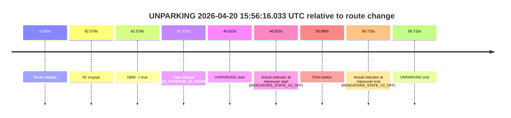

# Run Report: fme10010/2026-04-20--15-42-37--gen2-av-41affc4b-b6f7-46e3-a063-43e2b26da721

| Field | Value |
|---|---|
| Run ID | `fme10010/2026-04-20--15-42-37--gen2-av-41affc4b-b6f7-46e3-a063-43e2b26da721` |
| Date | `2026-04-20` |
| Model(s) | `blue-panther-solid` |
| Author | `guy.geva` |
| Event count | `1` |

## unparking 2026-04-20 15:56:16.033 UTC

| Field | Value |
|---|---|
| Model | `blue-panther-solid` |
| Author | `guy.geva` |
| Run ID | `fme10010/2026-04-20--15-42-37--gen2-av-41affc4b-b6f7-46e3-a063-43e2b26da721` |
| Date | `2026-04-20` |
| Time (UTC) | `15:56:16.033` |
| Event type | `unparking` |
| Disengagement type | `none observed` |
| Route change | `found` |
| Console | [run](https://console.sso.wayve.ai/run/fme10010/2026-04-20--15-42-37--gen2-av-41affc4b-b6f7-46e3-a063-43e2b26da721?id=&time-unixus=1776700576033315) |
| Foxglove | [segment](https://app.foxglove.dev/wayve-on-prem/p/prj_0dX18KZdVHg1fmmI/view?ds=foxglove-stream&ds.deviceName=fme10010&ds.start=2026-04-20T15%3A55%3A19.218269Z&ds.end=2026-04-20T15%3A56%3A35.933325Z&layoutId=lay_0e7VD4WIKDQGU73Y&time=2026-04-20T15%3A56%3A16.033315Z) |

### Event card: non-av

- Non-AV: there is no AV-owned portion anywhere inside the detected unparking timeline, so it is kept for coverage but excluded from model success / failure scoring.

| Event | Time (UTC) | Delta from route change |
|---|---:|---:|
| Route change | 2026-04-20 15:55:29.218 | `0.000s` |
| AV engage | 2026-04-20 15:56:31.796 | `62.578s` |
| DBW -> true | 2026-04-20 15:56:31.796 | `62.578s` |
| Gear change (DRIVE_POSITION_V2_REVERSE) | 2026-04-20 15:56:10.533 | `41.315s` |
| UNPARKING start | 2026-04-20 15:56:16.033 | `46.815s` |
| Actual indicator at maneuver start (INDICATORS_STATE_V2_OFF) | 2026-04-20 15:56:16.033 | `46.815s` |
| First motion | 2026-04-20 15:56:20.108 | `50.890s` |
| Actual indicator at maneuver end (INDICATORS_STATE_V2_OFF) | 2026-04-20 15:56:25.933 | `56.715s` |
| UNPARKING end | 2026-04-20 15:56:25.933 | `56.715s` |

| Metric | Value |
|---|---|
| Outcome | `non-av` |
| Effective failure type | `none` |
| Route change status | `found` |
| DBW at event start | `false` |
| DBW at event end | `false` |
| Predicted gear at AV start | `DRIVE_POSITION_V2_DRIVE` |
| Actual gear at AV start | `DRIVE_POSITION_V2_DRIVE` |
| Predicted gear at event start | `DRIVE_POSITION_V2_REVERSE` |
| Actual gear at event start | `DRIVE_POSITION_V2_REVERSE` |
| Planned indicator direction | `INDICATORS_STATE_V2_LEFT_ON` |
| Controller indicator direction | `INDICATORS_STATE_V2_LEFT_ON` |
| Actual indicator direction | `INDICATORS_STATE_V2_OFF` |
| Actual indicator at maneuver end | `INDICATORS_STATE_V2_OFF` |
| Driver accel help in AV | `false` |
| Driver accel help timestamp | `n/a` |
| Max accel pedal pct in AV | `0.0%` |
| Max brake pedal pct in AV | `0.0%` |
| Max speed mps in AV | `0.000` |
| Route -> AV | `62.578s` |
| AV -> event start | `-15.763s` |
| AV -> first motion | `-11.688s` |
| AV duration before disengagement | `n/a` |
| Trajectory waypoint count | `35` |
| Driving-plan step count | `11` |

The scored portion starts from the AV-owned window, not from the pre-AV setup. Route-change search in the stopped pre-event segment was `found`, with the baseline therefore set to route change. At the event anchor the model predicts `DRIVE_POSITION_V2_REVERSE` and the actual gear is `DRIVE_POSITION_V2_REVERSE`. The effective model outcome is `non-av` because `there is no AV-owned overlap inside the event timeline`.

### Resolution

| Field | Value |
|---|---|
| Final outcome | `non-av` |
| Do we agree with this label? | `yes` |
| Source disengagement type | `none observed` |
| Resolved effective failure type | `none` |
| Confidence | `high` |
