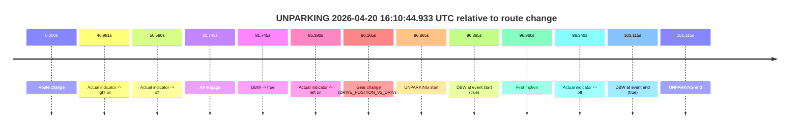

# Run Report: fme10010/2026-04-20--16-07-37--gen2-av-87baf41f-2853-4a03-9b12-7e494fb1bd30

| Field | Value |
|---|---|
| Run ID | `fme10010/2026-04-20--16-07-37--gen2-av-87baf41f-2853-4a03-9b12-7e494fb1bd30` |
| Date | `2026-04-20` |
| Model(s) | `eel-teal-outspoken` |
| Author | `zak` |
| Event count | `1` |

## unparking 2026-04-20 16:10:44.933 UTC

| Field | Value |
|---|---|
| Model | `eel-teal-outspoken` |
| Author | `zak` |
| Run ID | `fme10010/2026-04-20--16-07-37--gen2-av-87baf41f-2853-4a03-9b12-7e494fb1bd30` |
| Date | `2026-04-20` |
| Time (UTC) | `16:10:44.933` |
| Event type | `unparking` |
| Disengagement type | `none observed` |
| Route change | `found` |
| Console | [run](https://console.sso.wayve.ai/run/fme10010/2026-04-20--16-07-37--gen2-av-87baf41f-2853-4a03-9b12-7e494fb1bd30?id=&time-unixus=1776701444933318) |
| Foxglove | [segment](https://app.foxglove.dev/wayve-on-prem/p/prj_0dX18KZdVHg1fmmI/view?ds=foxglove-stream&ds.deviceName=fme10010&ds.start=2026-04-20T16%3A08%3A58.068208Z&ds.end=2026-04-20T16%3A10%3A59.183313Z&layoutId=lay_0e7VD4WIKDQGU73Y&time=2026-04-20T16%3A10%3A44.933318Z) |

### Event card: pass

- Pass: AV owns the credited unparking through the official event window, the gear state is aligned at the anchor, and the vehicle moves without driver accelerator help in AV.

| Event | Time (UTC) | Delta from route change |
|---|---:|---:|
| Route change | 2026-04-20 16:09:08.068 | `0.000s` |
| Actual indicator -> right on | 2026-04-20 16:09:55.049 | `46.981s` |
| Actual indicator -> off | 2026-04-20 16:09:58.648 | `50.580s` |
| AV engage | 2026-04-20 16:10:29.813 | `81.745s` |
| DBW -> true | 2026-04-20 16:10:29.813 | `81.745s` |
| Actual indicator -> left on | 2026-04-20 16:10:33.448 | `85.380s` |
| Gear change (DRIVE_POSITION_V2_DRIVE) | 2026-04-20 16:10:34.233 | `86.165s` |
| UNPARKING start | 2026-04-20 16:10:44.933 | `96.865s` |
| DBW at event start (true) | 2026-04-20 16:10:44.933 | `96.865s` |
| First motion | 2026-04-20 16:10:45.028 | `96.960s` |
| Actual indicator -> off | 2026-04-20 16:10:46.408 | `98.340s` |
| DBW at event end (true) | 2026-04-20 16:10:49.183 | `101.115s` |
| UNPARKING end | 2026-04-20 16:10:49.183 | `101.115s` |

| Metric | Value |
|---|---|
| Outcome | `pass` |
| Effective failure type | `none` |
| Route change status | `found` |
| DBW at event start | `true` |
| DBW at event end | `true` |
| Predicted gear at AV start | `DRIVE_POSITION_V2_PARK` |
| Actual gear at AV start | `DRIVE_POSITION_V2_PARK` |
| Predicted gear at event start | `DRIVE_POSITION_V2_DRIVE` |
| Actual gear at event start | `DRIVE_POSITION_V2_DRIVE` |
| Planned indicator direction | `INDICATORS_STATE_V2_LEFT_ON` |
| Controller indicator direction | `INDICATORS_STATE_V2_LEFT_ON` |
| Actual indicator direction | `INDICATORS_STATE_V2_LEFT_ON` |
| Actual indicator at maneuver end | `INDICATORS_STATE_V2_OFF` |
| Driver accel help in AV | `false` |
| Driver accel help timestamp | `n/a` |
| Max accel pedal pct in AV | `0.0%` |
| Max brake pedal pct in AV | `0.0%` |
| Max speed mps in AV | `4.186` |
| Success timing baseline | `route change` |
| Route -> AV | `81.745s` |
| AV -> event start | `15.120s` |
| AV -> first motion | `15.215s` |
| Success baseline -> event start | `96.865s` |
| Success baseline -> first motion | `96.960s` |
| AV duration before disengagement | `n/a` |
| Trajectory waypoint count | `38` |
| Driving-plan step count | `11` |

The scored portion starts from the AV-owned window, not from the pre-AV setup. Route-change search in the stopped pre-event segment was `found`, with the baseline therefore set to route change. At the event anchor the model predicts `DRIVE_POSITION_V2_DRIVE` and the actual gear is `DRIVE_POSITION_V2_DRIVE`. The effective model outcome is `pass` because `the credited maneuver stays AV-owned through the official event end.`

### Resolution

| Field | Value |
|---|---|
| Final outcome | `pass` |
| Do we agree with this label? | `yes` |
| Source disengagement type | `none observed` |
| Resolved effective failure type | `none` |
| Confidence | `high` |
