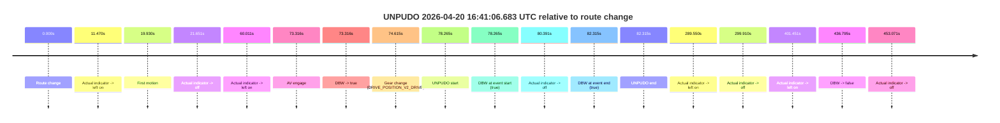
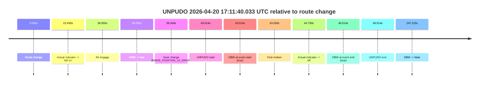
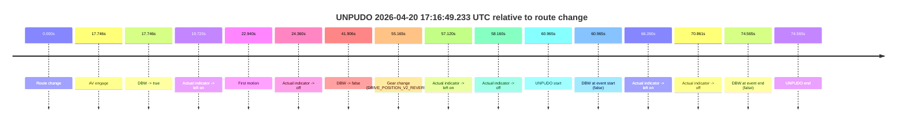
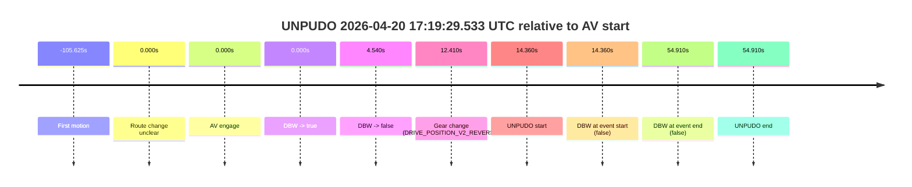

# Run Report: fme10010/2026-04-20--16-20-25--gen2-av-75b07633-7657-4698-bfcc-86dc218eaa10

| Field | Value |
|---|---|
| Run ID | `fme10010/2026-04-20--16-20-25--gen2-av-75b07633-7657-4698-bfcc-86dc218eaa10` |
| Date | `2026-04-20` |
| Model(s) | `eel-teal-outspoken` |
| Author | `zak` |
| Event count | `4` |

## unpudo 2026-04-20 16:41:06.683 UTC

| Field | Value |
|---|---|
| Model | `eel-teal-outspoken` |
| Author | `zak` |
| Run ID | `fme10010/2026-04-20--16-20-25--gen2-av-75b07633-7657-4698-bfcc-86dc218eaa10` |
| Date | `2026-04-20` |
| Time (UTC) | `16:41:06.683` |
| Event type | `unpudo` |
| Disengagement type | `none observed` |
| Route change | `found` |
| Console | [run](https://console.sso.wayve.ai/run/fme10010/2026-04-20--16-20-25--gen2-av-75b07633-7657-4698-bfcc-86dc218eaa10?id=&time-unixus=1776703266683303) |
| Foxglove | [segment](https://app.foxglove.dev/wayve-on-prem/p/prj_0dX18KZdVHg1fmmI/view?ds=foxglove-stream&ds.deviceName=fme10010&ds.start=2026-04-20T16%3A39%3A38.418234Z&ds.end=2026-04-20T16%3A47%3A15.213152Z&layoutId=lay_0e7VD4WIKDQGU73Y&time=2026-04-20T16%3A41%3A06.683303Z) |

### Event card: pass

- Pass: AV owns the credited unpudo from route change through the official unpudo window, the gear state is aligned at the anchor, and the vehicle moves without driver accelerator help in AV.

| Event | Time (UTC) | Delta from route change |
|---|---:|---:|
| Route change | 2026-04-20 16:39:48.418 | `0.000s` |
| Actual indicator -> left on | 2026-04-20 16:39:59.888 | `11.470s` |
| First motion | 2026-04-20 16:40:08.348 | `19.930s` |
| Actual indicator -> off | 2026-04-20 16:40:10.068 | `21.651s` |
| Actual indicator -> left on | 2026-04-20 16:40:48.428 | `60.011s` |
| AV engage | 2026-04-20 16:41:01.734 | `73.316s` |
| DBW -> true | 2026-04-20 16:41:01.734 | `73.316s` |
| Gear change (DRIVE_POSITION_V2_DRIVE) | 2026-04-20 16:41:03.033 | `74.615s` |
| UNPUDO start | 2026-04-20 16:41:06.683 | `78.265s` |
| DBW at event start (true) | 2026-04-20 16:41:06.683 | `78.265s` |
| Actual indicator -> off | 2026-04-20 16:41:08.809 | `80.391s` |
| DBW at event end (true) | 2026-04-20 16:41:10.733 | `82.315s` |
| UNPUDO end | 2026-04-20 16:41:10.733 | `82.315s` |
| Actual indicator -> left on | 2026-04-20 16:44:37.968 | `289.550s` |
| Actual indicator -> off | 2026-04-20 16:44:48.328 | `299.910s` |
| Actual indicator -> left on | 2026-04-20 16:46:29.869 | `401.451s` |
| DBW -> false | 2026-04-20 16:47:05.213 | `436.795s` |
| Actual indicator -> off | 2026-04-20 16:47:21.488 | `453.071s` |

| Metric | Value |
|---|---|
| Outcome | `pass` |
| Effective failure type | `none` |
| Route change status | `found` |
| DBW at event start | `true` |
| DBW at event end | `true` |
| Predicted gear at AV start | `DRIVE_POSITION_V2_PARK` |
| Actual gear at AV start | `DRIVE_POSITION_V2_PARK` |
| Predicted gear at event start | `DRIVE_POSITION_V2_DRIVE` |
| Actual gear at event start | `DRIVE_POSITION_V2_DRIVE` |
| Planned indicator direction | `INDICATORS_STATE_V2_LEFT_ON` |
| Controller indicator direction | `INDICATORS_STATE_V2_LEFT_ON` |
| Actual indicator direction | `INDICATORS_STATE_V2_LEFT_ON` |
| Actual indicator at maneuver end | `INDICATORS_STATE_V2_OFF` |
| Driver accel help in AV | `false` |
| Driver accel help timestamp | `n/a` |
| Max accel pedal pct in AV | `0.0%` |
| Max brake pedal pct in AV | `25.6%` |
| Max speed mps in AV | `3.550` |
| Success timing baseline | `route change` |
| Route -> AV | `73.316s` |
| AV -> event start | `4.949s` |
| AV -> first motion | `-53.386s` |
| Success baseline -> event start | `78.265s` |
| Success baseline -> first motion | `19.930s` |
| AV duration before disengagement | `363.479s` |
| Trajectory waypoint count | `37` |
| Driving-plan step count | `11` |

The scored portion starts from the AV-owned window, not from the pre-AV setup. Route-change search in the stopped pre-event segment was `found`, with the baseline therefore set to route change. At the event anchor the model predicts `DRIVE_POSITION_V2_DRIVE` and the actual gear is `DRIVE_POSITION_V2_DRIVE`. The effective model outcome is `pass` because `the credited unpudo stays AV-owned through the official unpudo window.`

### Resolution

| Field | Value |
|---|---|
| Final outcome | `pass` |
| Do we agree with this label? | `yes` |
| Source disengagement type | `none observed` |
| Resolved effective failure type | `none` |
| Confidence | `high` |

## unpudo 2026-04-20 17:11:40.033 UTC

| Field | Value |
|---|---|
| Model | `eel-teal-outspoken` |
| Author | `zak` |
| Run ID | `fme10010/2026-04-20--16-20-25--gen2-av-75b07633-7657-4698-bfcc-86dc218eaa10` |
| Date | `2026-04-20` |
| Time (UTC) | `17:11:40.033` |
| Event type | `unpudo` |
| Disengagement type | `none observed` |
| Route change | `found` |
| Console | [run](https://console.sso.wayve.ai/run/fme10010/2026-04-20--16-20-25--gen2-av-75b07633-7657-4698-bfcc-86dc218eaa10?id=&time-unixus=1776705100033302) |
| Foxglove | [segment](https://app.foxglove.dev/wayve-on-prem/p/prj_0dX18KZdVHg1fmmI/view?ds=foxglove-stream&ds.deviceName=fme10010&ds.start=2026-04-20T17%3A10%3A47.018938Z&ds.end=2026-04-20T17%3A15%3A14.133691Z&layoutId=lay_0e7VD4WIKDQGU73Y&time=2026-04-20T17%3A11%3A40.033302Z) |

### Event card: pass

- Pass: AV owns the credited unpudo from route change through the official unpudo window, the gear state is aligned at the anchor, and the vehicle moves without driver accelerator help in AV.

| Event | Time (UTC) | Delta from route change |
|---|---:|---:|
| Route change | 2026-04-20 17:10:57.018 | `0.000s` |
| Actual indicator -> left on | 2026-04-20 17:11:19.448 | `22.430s` |
| AV engage | 2026-04-20 17:11:33.073 | `36.055s` |
| DBW -> true | 2026-04-20 17:11:33.073 | `36.055s` |
| Gear change (DRIVE_POSITION_V2_DRIVE) | 2026-04-20 17:11:36.283 | `39.264s` |
| UNPUDO start | 2026-04-20 17:11:40.033 | `43.014s` |
| DBW at event start (true) | 2026-04-20 17:11:40.033 | `43.014s` |
| First motion | 2026-04-20 17:11:40.048 | `43.030s` |
| Actual indicator -> off | 2026-04-20 17:11:41.748 | `44.730s` |
| DBW at event end (true) | 2026-04-20 17:11:43.533 | `46.514s` |
| UNPUDO end | 2026-04-20 17:11:43.533 | `46.514s` |
| DBW -> false | 2026-04-20 17:15:04.133 | `247.115s` |

| Metric | Value |
|---|---|
| Outcome | `pass` |
| Effective failure type | `none` |
| Route change status | `found` |
| DBW at event start | `true` |
| DBW at event end | `true` |
| Predicted gear at AV start | `DRIVE_POSITION_V2_PARK` |
| Actual gear at AV start | `DRIVE_POSITION_V2_PARK` |
| Predicted gear at event start | `DRIVE_POSITION_V2_DRIVE` |
| Actual gear at event start | `DRIVE_POSITION_V2_DRIVE` |
| Planned indicator direction | `INDICATORS_STATE_V2_OFF` |
| Controller indicator direction | `INDICATORS_STATE_V2_OFF` |
| Actual indicator direction | `INDICATORS_STATE_V2_LEFT_ON` |
| Actual indicator at maneuver end | `INDICATORS_STATE_V2_OFF` |
| Driver accel help in AV | `false` |
| Driver accel help timestamp | `n/a` |
| Max accel pedal pct in AV | `0.0%` |
| Max brake pedal pct in AV | `25.5%` |
| Max speed mps in AV | `4.797` |
| Success timing baseline | `route change` |
| Route -> AV | `36.055s` |
| AV -> event start | `6.959s` |
| AV -> first motion | `6.975s` |
| Success baseline -> event start | `43.014s` |
| Success baseline -> first motion | `43.030s` |
| AV duration before disengagement | `211.060s` |
| Trajectory waypoint count | `38` |
| Driving-plan step count | `11` |

The scored portion starts from the AV-owned window, not from the pre-AV setup. Route-change search in the stopped pre-event segment was `found`, with the baseline therefore set to route change. At the event anchor the model predicts `DRIVE_POSITION_V2_DRIVE` and the actual gear is `DRIVE_POSITION_V2_DRIVE`. The effective model outcome is `pass` because `the credited unpudo stays AV-owned through the official unpudo window.`

### Resolution

| Field | Value |
|---|---|
| Final outcome | `pass` |
| Do we agree with this label? | `yes` |
| Source disengagement type | `none observed` |
| Resolved effective failure type | `none` |
| Confidence | `high` |

## unpudo 2026-04-20 17:16:49.233 UTC

| Field | Value |
|---|---|
| Model | `eel-teal-outspoken` |
| Author | `zak` |
| Run ID | `fme10010/2026-04-20--16-20-25--gen2-av-75b07633-7657-4698-bfcc-86dc218eaa10` |
| Date | `2026-04-20` |
| Time (UTC) | `17:16:49.233` |
| Event type | `unpudo` |
| Disengagement type | `none observed` |
| Route change | `found` |
| Console | [run](https://console.sso.wayve.ai/run/fme10010/2026-04-20--16-20-25--gen2-av-75b07633-7657-4698-bfcc-86dc218eaa10?id=&time-unixus=1776705409233307) |
| Foxglove | [segment](https://app.foxglove.dev/wayve-on-prem/p/prj_0dX18KZdVHg1fmmI/view?ds=foxglove-stream&ds.deviceName=fme10010&ds.start=2026-04-20T17%3A15%3A38.268236Z&ds.end=2026-04-20T17%3A17%3A12.833316Z&layoutId=lay_0e7VD4WIKDQGU73Y&time=2026-04-20T17%3A16%3A49.233307Z) |

### Event card: fail

- Fail: the credited unpudo does not stay AV-owned. The event window starts with DBW false, and the maneuver outcome lands outside a clean AV-owned segment.

| Event | Time (UTC) | Delta from route change |
|---|---:|---:|
| Route change | 2026-04-20 17:15:48.268 | `0.000s` |
| AV engage | 2026-04-20 17:16:06.013 | `17.746s` |
| DBW -> true | 2026-04-20 17:16:06.013 | `17.746s` |
| Actual indicator -> left on | 2026-04-20 17:16:07.988 | `19.720s` |
| First motion | 2026-04-20 17:16:11.208 | `22.940s` |
| Actual indicator -> off | 2026-04-20 17:16:12.628 | `24.360s` |
| DBW -> false | 2026-04-20 17:16:30.173 | `41.906s` |
| Gear change (DRIVE_POSITION_V2_REVERSE) | 2026-04-20 17:16:43.433 | `55.165s` |
| Actual indicator -> left on | 2026-04-20 17:16:45.388 | `57.120s` |
| Actual indicator -> off | 2026-04-20 17:16:46.428 | `58.160s` |
| UNPUDO start | 2026-04-20 17:16:49.233 | `60.965s` |
| DBW at event start (false) | 2026-04-20 17:16:49.233 | `60.965s` |
| Actual indicator -> left on | 2026-04-20 17:16:54.528 | `66.260s` |
| Actual indicator -> off | 2026-04-20 17:16:59.129 | `70.861s` |
| DBW at event end (false) | 2026-04-20 17:17:02.833 | `74.565s` |
| UNPUDO end | 2026-04-20 17:17:02.833 | `74.565s` |

| Metric | Value |
|---|---|
| Outcome | `fail` |
| Effective failure type | `not_av_owned` |
| Route change status | `found` |
| DBW at event start | `false` |
| DBW at event end | `false` |
| Predicted gear at AV start | `DRIVE_POSITION_V2_PARK` |
| Actual gear at AV start | `DRIVE_POSITION_V2_PARK` |
| Predicted gear at event start | `DRIVE_POSITION_V2_REVERSE` |
| Actual gear at event start | `DRIVE_POSITION_V2_REVERSE` |
| Planned indicator direction | `INDICATORS_STATE_V2_OFF` |
| Controller indicator direction | `INDICATORS_STATE_V2_OFF` |
| Actual indicator direction | `INDICATORS_STATE_V2_OFF` |
| Actual indicator at maneuver end | `INDICATORS_STATE_V2_OFF` |
| Driver accel help in AV | `false` |
| Driver accel help timestamp | `n/a` |
| Max accel pedal pct in AV | `0.0%` |
| Max brake pedal pct in AV | `17.7%` |
| Max speed mps in AV | `4.500` |
| Success timing baseline | `route change` |
| Route -> AV | `17.746s` |
| AV -> event start | `43.219s` |
| AV -> first motion | `5.195s` |
| Success baseline -> event start | `60.965s` |
| Success baseline -> first motion | `22.940s` |
| AV duration before disengagement | `24.160s` |
| Trajectory waypoint count | `38` |
| Driving-plan step count | `11` |

The scored portion starts from the AV-owned window, not from the pre-AV setup. Route-change search in the stopped pre-event segment was `found`, with the baseline therefore set to route change. At the event anchor the model predicts `DRIVE_POSITION_V2_REVERSE` and the actual gear is `DRIVE_POSITION_V2_REVERSE`. The effective model outcome is `fail` because `not_av_owned.`

### Resolution

| Field | Value |
|---|---|
| Final outcome | `fail` |
| Do we agree with this label? | `yes` |
| Source disengagement type | `none observed` |
| Resolved effective failure type | `not_av_owned` |
| Confidence | `high` |

## unpudo 2026-04-20 17:19:29.533 UTC

| Field | Value |
|---|---|
| Model | `eel-teal-outspoken` |
| Author | `zak` |
| Run ID | `fme10010/2026-04-20--16-20-25--gen2-av-75b07633-7657-4698-bfcc-86dc218eaa10` |
| Date | `2026-04-20` |
| Time (UTC) | `17:19:29.533` |
| Event type | `unpudo` |
| Disengagement type | `failed_to_pudo` |
| Route change | `unclear` |
| Console | [run](https://console.sso.wayve.ai/run/fme10010/2026-04-20--16-20-25--gen2-av-75b07633-7657-4698-bfcc-86dc218eaa10?id=&time-unixus=1776705569533304) |
| Foxglove | [segment](https://app.foxglove.dev/wayve-on-prem/p/prj_0dX18KZdVHg1fmmI/view?ds=foxglove-stream&ds.deviceName=fme10010&ds.start=2026-04-20T17%3A19%3A05.173745Z&ds.end=2026-04-20T17%3A20%3A20.083290Z&layoutId=lay_0e7VD4WIKDQGU73Y&time=2026-04-20T17%3A19%3A29.533304Z) |

### Event card: fail

- Fail: AV owns part of the segment, but the event still resolves as a model-performance failure under the AV-only scoring rule.

| Event | Time (UTC) | Delta from AV start |
|---|---:|---:|
| First motion | 2026-04-20 17:17:29.548 | `-105.625s` |
| Route change unclear | 2026-04-20 17:19:15.173 | `0.000s` |
| AV engage | 2026-04-20 17:19:15.173 | `0.000s` |
| DBW -> true | 2026-04-20 17:19:15.173 | `0.000s` |
| DBW -> false | 2026-04-20 17:19:19.713 | `4.540s` |
| Gear change (DRIVE_POSITION_V2_REVERSE) | 2026-04-20 17:19:27.583 | `12.410s` |
| UNPUDO start | 2026-04-20 17:19:29.533 | `14.360s` |
| DBW at event start (false) | 2026-04-20 17:19:29.533 | `14.360s` |
| DBW at event end (false) | 2026-04-20 17:20:10.083 | `54.910s` |
| UNPUDO end | 2026-04-20 17:20:10.083 | `54.910s` |

| Metric | Value |
|---|---|
| Outcome | `fail` |
| Effective failure type | `failed_to_pudo` |
| Route change status | `unclear` |
| DBW at event start | `false` |
| DBW at event end | `false` |
| Predicted gear at AV start | `DRIVE_POSITION_V2_DRIVE` |
| Actual gear at AV start | `DRIVE_POSITION_V2_DRIVE` |
| Predicted gear at event start | `DRIVE_POSITION_V2_REVERSE` |
| Actual gear at event start | `DRIVE_POSITION_V2_REVERSE` |
| Planned indicator direction | `INDICATORS_STATE_V2_OFF` |
| Controller indicator direction | `INDICATORS_STATE_V2_OFF` |
| Actual indicator direction | `INDICATORS_STATE_V2_OFF` |
| Actual indicator at maneuver end | `INDICATORS_STATE_V2_OFF` |
| Driver accel help in AV | `false` |
| Driver accel help timestamp | `n/a` |
| Max accel pedal pct in AV | `0.0%` |
| Max brake pedal pct in AV | `0.0%` |
| Max speed mps in AV | `6.906` |
| Success timing baseline | `AV start` |
| Route -> AV | `n/a` |
| AV -> event start | `14.360s` |
| AV -> first motion | `-105.625s` |
| Success baseline -> event start | `14.360s` |
| Success baseline -> first motion | `-105.625s` |
| AV duration before disengagement | `4.540s` |
| Trajectory waypoint count | `36` |
| Driving-plan step count | `11` |

The scored portion starts from the AV-owned window, not from the pre-AV setup. Route-change search in the stopped pre-event segment was `unclear`, with the baseline therefore set to AV start. At the event anchor the model predicts `DRIVE_POSITION_V2_REVERSE` and the actual gear is `DRIVE_POSITION_V2_REVERSE`. The effective model outcome is `fail` because `failed_to_pudo.`

### Resolution

| Field | Value |
|---|---|
| Final outcome | `fail` |
| Do we agree with this label? | `yes` |
| Source disengagement type | `failed_to_pudo` |
| Resolved effective failure type | `failed_to_pudo` |
| Confidence | `medium` |
