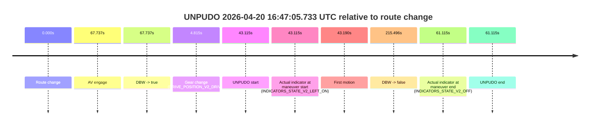
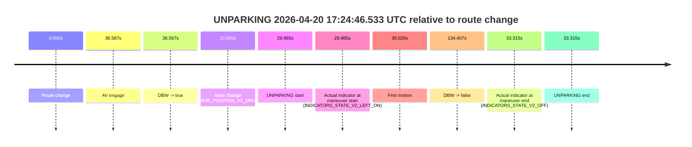
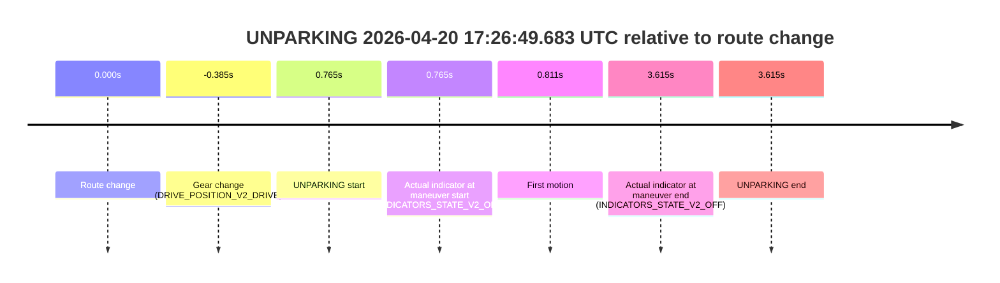

# Run Report: fme10010/2026-04-20--16-20-25--gen2-av-75b07633-7657-4698-bfcc-86dc218eaa10

| Field | Value |
|---|---|
| Run ID | `fme10010/2026-04-20--16-20-25--gen2-av-75b07633-7657-4698-bfcc-86dc218eaa10` |
| Date | `2026-04-20` |
| Model(s) | `blue-panther-solid` |
| Author | `guy.geva` |
| Event count | `5` |

## unpudo 2026-04-20 16:47:05.733 UTC

| Field | Value |
|---|---|
| Model | `blue-panther-solid` |
| Author | `guy.geva` |
| Run ID | `fme10010/2026-04-20--16-20-25--gen2-av-75b07633-7657-4698-bfcc-86dc218eaa10` |
| Date | `2026-04-20` |
| Time (UTC) | `16:47:05.733` |
| Event type | `unpudo` |
| Disengagement type | `failed_to_accelerate` |
| Route change | `found` |
| Console | [run](https://console.sso.wayve.ai/run/fme10010/2026-04-20--16-20-25--gen2-av-75b07633-7657-4698-bfcc-86dc218eaa10?id=&time-unixus=1776703625733310) |
| Foxglove | [segment](https://app.foxglove.dev/wayve-on-prem/p/prj_0dX18KZdVHg1fmmI/view?ds=foxglove-stream&ds.deviceName=fme10010&ds.start=2026-04-20T16%3A46%3A12.618328Z&ds.end=2026-04-20T16%3A50%3A08.114379Z&layoutId=lay_0e7VD4WIKDQGU73Y&time=2026-04-20T16%3A47%3A05.733310Z) |

### Event card: accidental

- Accidental: AV ownership is present for less than `2s`, so this is treated as an accidental brush with the maneuver rather than a meaningful model attempt.

| Event | Time (UTC) | Delta from route change |
|---|---:|---:|
| Route change | 2026-04-20 16:46:22.618 | `0.000s` |
| AV engage | 2026-04-20 16:47:30.355 | `67.737s` |
| DBW -> true | 2026-04-20 16:47:30.355 | `67.737s` |
| Gear change (DRIVE_POSITION_V2_DRIVE) | 2026-04-20 16:46:27.433 | `4.815s` |
| UNPUDO start | 2026-04-20 16:47:05.733 | `43.115s` |
| Actual indicator at maneuver start (INDICATORS_STATE_V2_LEFT_ON) | 2026-04-20 16:47:05.733 | `43.115s` |
| First motion | 2026-04-20 16:47:05.808 | `43.190s` |
| DBW -> false | 2026-04-20 16:49:58.114 | `215.496s` |
| Actual indicator at maneuver end (INDICATORS_STATE_V2_OFF) | 2026-04-20 16:47:23.733 | `61.115s` |
| UNPUDO end | 2026-04-20 16:47:23.733 | `61.115s` |

| Metric | Value |
|---|---|
| Outcome | `accidental` |
| Effective failure type | `none` |
| Route change status | `found` |
| DBW at event start | `false` |
| DBW at event end | `false` |
| Predicted gear at AV start | `DRIVE_POSITION_V2_DRIVE` |
| Actual gear at AV start | `DRIVE_POSITION_V2_DRIVE` |
| Predicted gear at event start | `DRIVE_POSITION_V2_DRIVE` |
| Actual gear at event start | `DRIVE_POSITION_V2_DRIVE` |
| Planned indicator direction | `INDICATORS_STATE_V2_OFF` |
| Controller indicator direction | `INDICATORS_STATE_V2_OFF` |
| Actual indicator direction | `INDICATORS_STATE_V2_LEFT_ON` |
| Actual indicator at maneuver end | `INDICATORS_STATE_V2_OFF` |
| Driver accel help in AV | `false` |
| Driver accel help timestamp | `n/a` |
| Max accel pedal pct in AV | `0.0%` |
| Max brake pedal pct in AV | `0.0%` |
| Max speed mps in AV | `0.000` |
| Route -> AV | `67.737s` |
| AV -> event start | `-24.622s` |
| AV -> first motion | `-24.546s` |
| AV duration before disengagement | `147.759s` |
| Trajectory waypoint count | `38` |
| Driving-plan step count | `11` |

The scored portion starts from the AV-owned window, not from the pre-AV setup. Route-change search in the stopped pre-event segment was `found`, with the baseline therefore set to route change. At the event anchor the model predicts `DRIVE_POSITION_V2_DRIVE` and the actual gear is `DRIVE_POSITION_V2_DRIVE`. The effective model outcome is `accidental` because `the AV-owned portion is shorter than 2s`.

### Resolution

| Field | Value |
|---|---|
| Final outcome | `accidental` |
| Do we agree with this label? | `yes` |
| Source disengagement type | `failed_to_accelerate` |
| Resolved effective failure type | `none` |
| Confidence | `high` |

## unpudo 2026-04-20 16:51:03.483 UTC

| Field | Value |
|---|---|
| Model | `blue-panther-solid` |
| Author | `guy.geva` |
| Run ID | `fme10010/2026-04-20--16-20-25--gen2-av-75b07633-7657-4698-bfcc-86dc218eaa10` |
| Date | `2026-04-20` |
| Time (UTC) | `16:51:03.483` |
| Event type | `unpudo` |
| Disengagement type | `failed_to_unpudo` |
| Route change | `found` |
| Console | [run](https://console.sso.wayve.ai/run/fme10010/2026-04-20--16-20-25--gen2-av-75b07633-7657-4698-bfcc-86dc218eaa10?id=&time-unixus=1776703863483314) |
| Foxglove | [segment](https://app.foxglove.dev/wayve-on-prem/p/prj_0dX18KZdVHg1fmmI/view?ds=foxglove-stream&ds.deviceName=fme10010&ds.start=2026-04-20T16%3A50%3A29.518276Z&ds.end=2026-04-20T16%3A51%3A50.875076Z&layoutId=lay_0e7VD4WIKDQGU73Y&time=2026-04-20T16%3A51%3A03.483314Z) |

### Event card: accidental

- Accidental: AV ownership is present for less than `2s`, so this is treated as an accidental brush with the maneuver rather than a meaningful model attempt.

| Event | Time (UTC) | Delta from route change |
|---|---:|---:|
| Route change | 2026-04-20 16:50:39.518 | `0.000s` |
| AV engage | 2026-04-20 16:51:34.894 | `55.376s` |
| DBW -> true | 2026-04-20 16:51:34.894 | `55.376s` |
| Gear change (DRIVE_POSITION_V2_DRIVE) | 2026-04-20 16:50:56.933 | `17.415s` |
| UNPUDO start | 2026-04-20 16:51:03.483 | `23.965s` |
| Actual indicator at maneuver start (INDICATORS_STATE_V2_LEFT_ON) | 2026-04-20 16:51:03.483 | `23.965s` |
| First motion | 2026-04-20 16:51:03.528 | `24.010s` |
| DBW -> false | 2026-04-20 16:51:40.875 | `61.357s` |
| Actual indicator at maneuver end (INDICATORS_STATE_V2_OFF) | 2026-04-20 16:51:16.083 | `36.565s` |
| UNPUDO end | 2026-04-20 16:51:16.083 | `36.565s` |

| Metric | Value |
|---|---|
| Outcome | `accidental` |
| Effective failure type | `none` |
| Route change status | `found` |
| DBW at event start | `false` |
| DBW at event end | `false` |
| Predicted gear at AV start | `DRIVE_POSITION_V2_DRIVE` |
| Actual gear at AV start | `DRIVE_POSITION_V2_DRIVE` |
| Predicted gear at event start | `DRIVE_POSITION_V2_DRIVE` |
| Actual gear at event start | `DRIVE_POSITION_V2_DRIVE` |
| Planned indicator direction | `INDICATORS_STATE_V2_LEFT_ON` |
| Controller indicator direction | `INDICATORS_STATE_V2_LEFT_ON` |
| Actual indicator direction | `INDICATORS_STATE_V2_LEFT_ON` |
| Actual indicator at maneuver end | `INDICATORS_STATE_V2_OFF` |
| Driver accel help in AV | `false` |
| Driver accel help timestamp | `n/a` |
| Max accel pedal pct in AV | `0.0%` |
| Max brake pedal pct in AV | `0.0%` |
| Max speed mps in AV | `0.000` |
| Route -> AV | `55.376s` |
| AV -> event start | `-31.411s` |
| AV -> first motion | `-31.366s` |
| AV duration before disengagement | `5.981s` |
| Trajectory waypoint count | `37` |
| Driving-plan step count | `11` |

The scored portion starts from the AV-owned window, not from the pre-AV setup. Route-change search in the stopped pre-event segment was `found`, with the baseline therefore set to route change. At the event anchor the model predicts `DRIVE_POSITION_V2_DRIVE` and the actual gear is `DRIVE_POSITION_V2_DRIVE`. The effective model outcome is `accidental` because `the AV-owned portion is shorter than 2s`.

### Resolution

| Field | Value |
|---|---|
| Final outcome | `accidental` |
| Do we agree with this label? | `yes` |
| Source disengagement type | `failed_to_unpudo` |
| Resolved effective failure type | `none` |
| Confidence | `high` |

## unpudo 2026-04-20 17:07:22.533 UTC

| Field | Value |
|---|---|
| Model | `blue-panther-solid` |
| Author | `guy.geva` |
| Run ID | `fme10010/2026-04-20--16-20-25--gen2-av-75b07633-7657-4698-bfcc-86dc218eaa10` |
| Date | `2026-04-20` |
| Time (UTC) | `17:07:22.533` |
| Event type | `unpudo` |
| Disengagement type | `failed_to_unpudo` |
| Route change | `found` |
| Console | [run](https://console.sso.wayve.ai/run/fme10010/2026-04-20--16-20-25--gen2-av-75b07633-7657-4698-bfcc-86dc218eaa10?id=&time-unixus=1776704842533314) |
| Foxglove | [segment](https://app.foxglove.dev/wayve-on-prem/p/prj_0dX18KZdVHg1fmmI/view?ds=foxglove-stream&ds.deviceName=fme10010&ds.start=2026-04-20T17%3A06%3A34.519398Z&ds.end=2026-04-20T17%3A11%3A35.213905Z&layoutId=lay_0e7VD4WIKDQGU73Y&time=2026-04-20T17%3A07%3A22.533314Z) |

### Event card: accidental

- Accidental: AV ownership is present for less than `2s`, so this is treated as an accidental brush with the maneuver rather than a meaningful model attempt.

| Event | Time (UTC) | Delta from route change |
|---|---:|---:|
| Route change | 2026-04-20 17:06:44.519 | `0.000s` |
| AV engage | 2026-04-20 17:07:31.514 | `46.996s` |
| DBW -> true | 2026-04-20 17:07:31.514 | `46.996s` |
| Gear change (DRIVE_POSITION_V2_DRIVE) | 2026-04-20 17:07:16.833 | `32.314s` |
| UNPUDO start | 2026-04-20 17:07:22.533 | `38.014s` |
| Actual indicator at maneuver start (INDICATORS_STATE_V2_LEFT_ON) | 2026-04-20 17:07:22.533 | `38.014s` |
| First motion | 2026-04-20 17:07:22.548 | `38.029s` |
| DBW -> false | 2026-04-20 17:11:25.213 | `280.695s` |
| Actual indicator at maneuver end (INDICATORS_STATE_V2_OFF) | 2026-04-20 17:07:26.083 | `41.564s` |
| UNPUDO end | 2026-04-20 17:07:26.083 | `41.564s` |

| Metric | Value |
|---|---|
| Outcome | `accidental` |
| Effective failure type | `none` |
| Route change status | `found` |
| DBW at event start | `false` |
| DBW at event end | `false` |
| Predicted gear at AV start | `DRIVE_POSITION_V2_DRIVE` |
| Actual gear at AV start | `DRIVE_POSITION_V2_DRIVE` |
| Predicted gear at event start | `DRIVE_POSITION_V2_DRIVE` |
| Actual gear at event start | `DRIVE_POSITION_V2_DRIVE` |
| Planned indicator direction | `INDICATORS_STATE_V2_LEFT_ON` |
| Controller indicator direction | `INDICATORS_STATE_V2_LEFT_ON` |
| Actual indicator direction | `INDICATORS_STATE_V2_LEFT_ON` |
| Actual indicator at maneuver end | `INDICATORS_STATE_V2_OFF` |
| Driver accel help in AV | `false` |
| Driver accel help timestamp | `n/a` |
| Max accel pedal pct in AV | `0.0%` |
| Max brake pedal pct in AV | `0.0%` |
| Max speed mps in AV | `0.000` |
| Route -> AV | `46.996s` |
| AV -> event start | `-8.982s` |
| AV -> first motion | `-8.966s` |
| AV duration before disengagement | `233.699s` |
| Trajectory waypoint count | `36` |
| Driving-plan step count | `11` |

The scored portion starts from the AV-owned window, not from the pre-AV setup. Route-change search in the stopped pre-event segment was `found`, with the baseline therefore set to route change. At the event anchor the model predicts `DRIVE_POSITION_V2_DRIVE` and the actual gear is `DRIVE_POSITION_V2_DRIVE`. The effective model outcome is `accidental` because `the AV-owned portion is shorter than 2s`.

### Resolution

| Field | Value |
|---|---|
| Final outcome | `accidental` |
| Do we agree with this label? | `yes` |
| Source disengagement type | `failed_to_unpudo` |
| Resolved effective failure type | `none` |
| Confidence | `high` |

## unparking 2026-04-20 17:24:46.533 UTC

| Field | Value |
|---|---|
| Model | `blue-panther-solid` |
| Author | `guy.geva` |
| Run ID | `fme10010/2026-04-20--16-20-25--gen2-av-75b07633-7657-4698-bfcc-86dc218eaa10` |
| Date | `2026-04-20` |
| Time (UTC) | `17:24:46.533` |
| Event type | `unparking` |
| Disengagement type | `failed_to_accelerate` |
| Route change | `found` |
| Console | [run](https://console.sso.wayve.ai/run/fme10010/2026-04-20--16-20-25--gen2-av-75b07633-7657-4698-bfcc-86dc218eaa10?id=&time-unixus=1776705886533313) |
| Foxglove | [segment](https://app.foxglove.dev/wayve-on-prem/p/prj_0dX18KZdVHg1fmmI/view?ds=foxglove-stream&ds.deviceName=fme10010&ds.start=2026-04-20T17%3A24%3A06.568329Z&ds.end=2026-04-20T17%3A26%3A40.974972Z&layoutId=lay_0e7VD4WIKDQGU73Y&time=2026-04-20T17%3A24%3A46.533313Z) |

### Event card: accidental

- Accidental: AV ownership is present for less than `2s`, so this is treated as an accidental brush with the maneuver rather than a meaningful model attempt.

| Event | Time (UTC) | Delta from route change |
|---|---:|---:|
| Route change | 2026-04-20 17:24:16.568 | `0.000s` |
| AV engage | 2026-04-20 17:24:53.134 | `36.567s` |
| DBW -> true | 2026-04-20 17:24:53.134 | `36.567s` |
| Gear change (DRIVE_POSITION_V2_DRIVE) | 2026-04-20 17:24:40.133 | `23.565s` |
| UNPARKING start | 2026-04-20 17:24:46.533 | `29.965s` |
| Actual indicator at maneuver start (INDICATORS_STATE_V2_LEFT_ON) | 2026-04-20 17:24:46.533 | `29.965s` |
| First motion | 2026-04-20 17:24:46.588 | `30.020s` |
| DBW -> false | 2026-04-20 17:26:30.974 | `134.407s` |
| Actual indicator at maneuver end (INDICATORS_STATE_V2_OFF) | 2026-04-20 17:24:49.883 | `33.315s` |
| UNPARKING end | 2026-04-20 17:24:49.883 | `33.315s` |

| Metric | Value |
|---|---|
| Outcome | `accidental` |
| Effective failure type | `none` |
| Route change status | `found` |
| DBW at event start | `false` |
| DBW at event end | `false` |
| Predicted gear at AV start | `DRIVE_POSITION_V2_DRIVE` |
| Actual gear at AV start | `DRIVE_POSITION_V2_DRIVE` |
| Predicted gear at event start | `DRIVE_POSITION_V2_DRIVE` |
| Actual gear at event start | `DRIVE_POSITION_V2_DRIVE` |
| Planned indicator direction | `INDICATORS_STATE_V2_LEFT_ON` |
| Controller indicator direction | `INDICATORS_STATE_V2_LEFT_ON` |
| Actual indicator direction | `INDICATORS_STATE_V2_LEFT_ON` |
| Actual indicator at maneuver end | `INDICATORS_STATE_V2_OFF` |
| Driver accel help in AV | `false` |
| Driver accel help timestamp | `n/a` |
| Max accel pedal pct in AV | `0.0%` |
| Max brake pedal pct in AV | `0.0%` |
| Max speed mps in AV | `0.000` |
| Route -> AV | `36.567s` |
| AV -> event start | `-6.602s` |
| AV -> first motion | `-6.546s` |
| AV duration before disengagement | `97.840s` |
| Trajectory waypoint count | `36` |
| Driving-plan step count | `11` |

The scored portion starts from the AV-owned window, not from the pre-AV setup. Route-change search in the stopped pre-event segment was `found`, with the baseline therefore set to route change. At the event anchor the model predicts `DRIVE_POSITION_V2_DRIVE` and the actual gear is `DRIVE_POSITION_V2_DRIVE`. The effective model outcome is `accidental` because `the AV-owned portion is shorter than 2s`.

### Resolution

| Field | Value |
|---|---|
| Final outcome | `accidental` |
| Do we agree with this label? | `yes` |
| Source disengagement type | `failed_to_accelerate` |
| Resolved effective failure type | `none` |
| Confidence | `high` |

## unparking 2026-04-20 17:26:49.683 UTC

| Field | Value |
|---|---|
| Model | `blue-panther-solid` |
| Author | `guy.geva` |
| Run ID | `fme10010/2026-04-20--16-20-25--gen2-av-75b07633-7657-4698-bfcc-86dc218eaa10` |
| Date | `2026-04-20` |
| Time (UTC) | `17:26:49.683` |
| Event type | `unparking` |
| Disengagement type | `none observed` |
| Route change | `found` |
| Console | [run](https://console.sso.wayve.ai/run/fme10010/2026-04-20--16-20-25--gen2-av-75b07633-7657-4698-bfcc-86dc218eaa10?id=&time-unixus=1776706009683324) |
| Foxglove | [segment](https://app.foxglove.dev/wayve-on-prem/p/prj_0dX18KZdVHg1fmmI/view?ds=foxglove-stream&ds.deviceName=fme10010&ds.start=2026-04-20T17%3A26%3A38.533301Z&ds.end=2026-04-20T17%3A27%3A02.533311Z&layoutId=lay_0e7VD4WIKDQGU73Y&time=2026-04-20T17%3A26%3A49.683324Z) |

### Event card: non-av

- Non-AV: the detected unparking starts outside AV ownership, so it is kept for coverage but excluded from model success / failure scoring.

| Event | Time (UTC) | Delta from route change |
|---|---:|---:|
| Route change | 2026-04-20 17:26:48.918 | `0.000s` |
| Gear change (DRIVE_POSITION_V2_DRIVE) | 2026-04-20 17:26:48.533 | `-0.385s` |
| UNPARKING start | 2026-04-20 17:26:49.683 | `0.765s` |
| Actual indicator at maneuver start (INDICATORS_STATE_V2_OFF) | 2026-04-20 17:26:49.683 | `0.765s` |
| First motion | 2026-04-20 17:26:49.729 | `0.811s` |
| Actual indicator at maneuver end (INDICATORS_STATE_V2_OFF) | 2026-04-20 17:26:52.533 | `3.615s` |
| UNPARKING end | 2026-04-20 17:26:52.533 | `3.615s` |

| Metric | Value |
|---|---|
| Outcome | `non-av` |
| Effective failure type | `none` |
| Route change status | `found` |
| DBW at event start | `false` |
| DBW at event end | `false` |
| Predicted gear at AV start | `n/a` |
| Actual gear at AV start | `n/a` |
| Predicted gear at event start | `DRIVE_POSITION_V2_DRIVE` |
| Actual gear at event start | `DRIVE_POSITION_V2_DRIVE` |
| Planned indicator direction | `INDICATORS_STATE_V2_RIGHT_ON` |
| Controller indicator direction | `INDICATORS_STATE_V2_RIGHT_ON` |
| Actual indicator direction | `INDICATORS_STATE_V2_OFF` |
| Actual indicator at maneuver end | `INDICATORS_STATE_V2_OFF` |
| Driver accel help in AV | `false` |
| Driver accel help timestamp | `n/a` |
| Max accel pedal pct in AV | `0.0%` |
| Max brake pedal pct in AV | `0.0%` |
| Max speed mps in AV | `0.000` |
| Route -> AV | `n/a` |
| AV -> event start | `n/a` |
| AV -> first motion | `n/a` |
| AV duration before disengagement | `n/a` |
| Trajectory waypoint count | `37` |
| Driving-plan step count | `11` |

The scored portion starts from the AV-owned window, not from the pre-AV setup. Route-change search in the stopped pre-event segment was `found`, with the baseline therefore set to route change. At the event anchor the model predicts `DRIVE_POSITION_V2_DRIVE` and the actual gear is `DRIVE_POSITION_V2_DRIVE`. The effective model outcome is `non-av` because `the event does not begin in AV ownership`.

### Resolution

| Field | Value |
|---|---|
| Final outcome | `non-av` |
| Do we agree with this label? | `yes` |
| Source disengagement type | `none observed` |
| Resolved effective failure type | `none` |
| Confidence | `high` |
