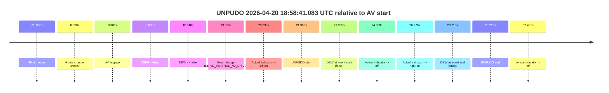
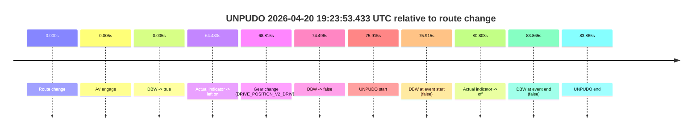

# Run Report: fme10010/2026-04-20--18-49-04--gen2-av-049e0b34-7ed2-4fab-b27d-8fb7726a9c84

| Field | Value |
|---|---|
| Run ID | `fme10010/2026-04-20--18-49-04--gen2-av-049e0b34-7ed2-4fab-b27d-8fb7726a9c84` |
| Date | `2026-04-20` |
| Model(s) | `eel-teal-outspoken` |
| Author | `zak` |
| Event count | `2` |

## unpudo 2026-04-20 18:58:41.083 UTC

| Field | Value |
|---|---|
| Model | `eel-teal-outspoken` |
| Author | `zak` |
| Run ID | `fme10010/2026-04-20--18-49-04--gen2-av-049e0b34-7ed2-4fab-b27d-8fb7726a9c84` |
| Date | `2026-04-20` |
| Time (UTC) | `18:58:41.083` |
| Event type | `unpudo` |
| Disengagement type | `failed_to_pudo` |
| Route change | `unclear` |
| Console | [run](https://console.sso.wayve.ai/run/fme10010/2026-04-20--18-49-04--gen2-av-049e0b34-7ed2-4fab-b27d-8fb7726a9c84?id=&time-unixus=1776711521083310) |
| Foxglove | [segment](https://app.foxglove.dev/wayve-on-prem/p/prj_0dX18KZdVHg1fmmI/view?ds=foxglove-stream&ds.deviceName=fme10010&ds.start=2026-04-20T18%3A58%3A09.118325Z&ds.end=2026-04-20T18%3A58%3A57.333303Z&layoutId=lay_0e7VD4WIKDQGU73Y&time=2026-04-20T18%3A58%3A41.083310Z) |

### Event card: fail

- Fail: AV owns part of the segment, but the event still resolves as a model-performance failure under the AV-only scoring rule.

| Event | Time (UTC) | Delta from AV start |
|---|---:|---:|
| First motion | 2026-04-20 18:56:41.088 | `-98.030s` |
| Route change unclear | 2026-04-20 18:58:19.118 | `0.000s` |
| AV engage | 2026-04-20 18:58:19.118 | `0.000s` |
| DBW -> true | 2026-04-20 18:58:19.118 | `0.000s` |
| DBW -> false | 2026-04-20 18:58:29.458 | `10.340s` |
| Gear change (DRIVE_POSITION_V2_DRIVE) | 2026-04-20 18:58:39.033 | `19.915s` |
| Actual indicator -> left on | 2026-04-20 18:58:39.348 | `20.230s` |
| UNPUDO start | 2026-04-20 18:58:41.083 | `21.965s` |
| DBW at event start (false) | 2026-04-20 18:58:41.083 | `21.965s` |
| Actual indicator -> off | 2026-04-20 18:58:43.768 | `24.650s` |
| Actual indicator -> right on | 2026-04-20 18:58:45.388 | `26.270s` |
| DBW at event end (false) | 2026-04-20 18:58:47.333 | `28.215s` |
| UNPUDO end | 2026-04-20 18:58:47.333 | `28.215s` |
| Actual indicator -> off | 2026-04-20 18:58:51.609 | `32.491s` |

| Metric | Value |
|---|---|
| Outcome | `fail` |
| Effective failure type | `failed_to_pudo` |
| Route change status | `unclear` |
| DBW at event start | `false` |
| DBW at event end | `false` |
| Predicted gear at AV start | `DRIVE_POSITION_V2_DRIVE` |
| Actual gear at AV start | `DRIVE_POSITION_V2_DRIVE` |
| Predicted gear at event start | `DRIVE_POSITION_V2_DRIVE` |
| Actual gear at event start | `DRIVE_POSITION_V2_DRIVE` |
| Planned indicator direction | `INDICATORS_STATE_V2_OFF` |
| Controller indicator direction | `INDICATORS_STATE_V2_OFF` |
| Actual indicator direction | `INDICATORS_STATE_V2_LEFT_ON` |
| Actual indicator at maneuver end | `INDICATORS_STATE_V2_RIGHT_ON` |
| Driver accel help in AV | `false` |
| Driver accel help timestamp | `n/a` |
| Max accel pedal pct in AV | `0.0%` |
| Max brake pedal pct in AV | `4.8%` |
| Max speed mps in AV | `8.017` |
| Success timing baseline | `AV start` |
| Route -> AV | `n/a` |
| AV -> event start | `21.965s` |
| AV -> first motion | `-98.030s` |
| Success baseline -> event start | `21.965s` |
| Success baseline -> first motion | `-98.030s` |
| AV duration before disengagement | `10.340s` |
| Trajectory waypoint count | `37` |
| Driving-plan step count | `11` |

The scored portion starts from the AV-owned window, not from the pre-AV setup. Route-change search in the stopped pre-event segment was `unclear`, with the baseline therefore set to AV start. At the event anchor the model predicts `DRIVE_POSITION_V2_DRIVE` and the actual gear is `DRIVE_POSITION_V2_DRIVE`. The effective model outcome is `fail` because `failed_to_pudo.`

### Resolution

| Field | Value |
|---|---|
| Final outcome | `fail` |
| Do we agree with this label? | `yes` |
| Source disengagement type | `failed_to_pudo` |
| Resolved effective failure type | `failed_to_pudo` |
| Confidence | `medium` |

## unpudo 2026-04-20 19:23:53.433 UTC

| Field | Value |
|---|---|
| Model | `eel-teal-outspoken` |
| Author | `zak` |
| Run ID | `fme10010/2026-04-20--18-49-04--gen2-av-049e0b34-7ed2-4fab-b27d-8fb7726a9c84` |
| Date | `2026-04-20` |
| Time (UTC) | `19:23:53.433` |
| Event type | `unpudo` |
| Disengagement type | `failed_to_unpudo` |
| Route change | `found` |
| Console | [run](https://console.sso.wayve.ai/run/fme10010/2026-04-20--18-49-04--gen2-av-049e0b34-7ed2-4fab-b27d-8fb7726a9c84?id=&time-unixus=1776713033433313) |
| Foxglove | [segment](https://app.foxglove.dev/wayve-on-prem/p/prj_0dX18KZdVHg1fmmI/view?ds=foxglove-stream&ds.deviceName=fme10010&ds.start=2026-04-20T19%3A22%3A27.518250Z&ds.end=2026-04-20T19%3A24%3A11.383293Z&layoutId=lay_0e7VD4WIKDQGU73Y&time=2026-04-20T19%3A23%3A53.433313Z) |

### Event card: fail

- Fail: AV owns part of the segment, but the event still resolves as a model-performance failure under the AV-only scoring rule.

| Event | Time (UTC) | Delta from route change |
|---|---:|---:|
| Route change | 2026-04-20 19:22:37.518 | `0.000s` |
| AV engage | 2026-04-20 19:22:37.522 | `0.005s` |
| DBW -> true | 2026-04-20 19:22:37.522 | `0.005s` |
| Actual indicator -> left on | 2026-04-20 19:23:42.001 | `64.483s` |
| Gear change (DRIVE_POSITION_V2_DRIVE) | 2026-04-20 19:23:46.333 | `68.815s` |
| DBW -> false | 2026-04-20 19:23:52.013 | `74.496s` |
| UNPUDO start | 2026-04-20 19:23:53.433 | `75.915s` |
| DBW at event start (false) | 2026-04-20 19:23:53.433 | `75.915s` |
| Actual indicator -> off | 2026-04-20 19:23:58.321 | `80.803s` |
| DBW at event end (false) | 2026-04-20 19:24:01.383 | `83.865s` |
| UNPUDO end | 2026-04-20 19:24:01.383 | `83.865s` |

| Metric | Value |
|---|---|
| Outcome | `fail` |
| Effective failure type | `failed_to_unpudo` |
| Route change status | `found` |
| DBW at event start | `false` |
| DBW at event end | `false` |
| Predicted gear at AV start | `DRIVE_POSITION_V2_PARK` |
| Actual gear at AV start | `DRIVE_POSITION_V2_PARK` |
| Predicted gear at event start | `DRIVE_POSITION_V2_DRIVE` |
| Actual gear at event start | `DRIVE_POSITION_V2_DRIVE` |
| Planned indicator direction | `INDICATORS_STATE_V2_OFF` |
| Controller indicator direction | `INDICATORS_STATE_V2_OFF` |
| Actual indicator direction | `INDICATORS_STATE_V2_LEFT_ON` |
| Actual indicator at maneuver end | `INDICATORS_STATE_V2_OFF` |
| Driver accel help in AV | `false` |
| Driver accel help timestamp | `n/a` |
| Max accel pedal pct in AV | `0.0%` |
| Max brake pedal pct in AV | `8.0%` |
| Max speed mps in AV | `0.000` |
| Success timing baseline | `route change` |
| Route -> AV | `0.005s` |
| AV -> event start | `75.911s` |
| AV -> first motion | `n/a` |
| Success baseline -> event start | `75.915s` |
| Success baseline -> first motion | `n/a` |
| AV duration before disengagement | `74.491s` |
| Trajectory waypoint count | `38` |
| Driving-plan step count | `11` |

The scored portion starts from the AV-owned window, not from the pre-AV setup. Route-change search in the stopped pre-event segment was `found`, with the baseline therefore set to route change. At the event anchor the model predicts `DRIVE_POSITION_V2_DRIVE` and the actual gear is `DRIVE_POSITION_V2_DRIVE`. The effective model outcome is `fail` because `failed_to_unpudo.`

### Resolution

| Field | Value |
|---|---|
| Final outcome | `fail` |
| Do we agree with this label? | `yes` |
| Source disengagement type | `failed_to_unpudo` |
| Resolved effective failure type | `failed_to_unpudo` |
| Confidence | `high` |
