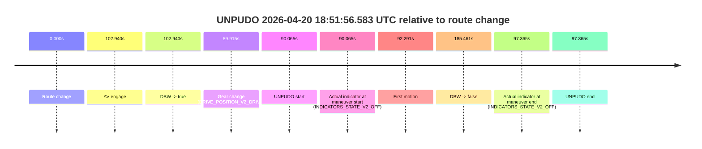
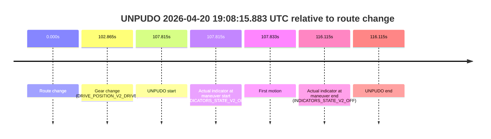

# Run Report: fme10010/2026-04-20--18-49-04--gen2-av-049e0b34-7ed2-4fab-b27d-8fb7726a9c84

| Field | Value |
|---|---|
| Run ID | `fme10010/2026-04-20--18-49-04--gen2-av-049e0b34-7ed2-4fab-b27d-8fb7726a9c84` |
| Date | `2026-04-20` |
| Model(s) | `blue-panther-solid` |
| Author | `guy.geva` |
| Event count | `2` |

## unpudo 2026-04-20 18:51:56.583 UTC

| Field | Value |
|---|---|
| Model | `blue-panther-solid` |
| Author | `guy.geva` |
| Run ID | `fme10010/2026-04-20--18-49-04--gen2-av-049e0b34-7ed2-4fab-b27d-8fb7726a9c84` |
| Date | `2026-04-20` |
| Time (UTC) | `18:51:56.583` |
| Event type | `unpudo` |
| Disengagement type | `none observed` |
| Route change | `found` |
| Console | [run](https://console.sso.wayve.ai/run/fme10010/2026-04-20--18-49-04--gen2-av-049e0b34-7ed2-4fab-b27d-8fb7726a9c84?id=&time-unixus=1776711116583315) |
| Foxglove | [segment](https://app.foxglove.dev/wayve-on-prem/p/prj_0dX18KZdVHg1fmmI/view?ds=foxglove-stream&ds.deviceName=fme10010&ds.start=2026-04-20T18%3A50%3A16.518297Z&ds.end=2026-04-20T18%3A53%3A41.979090Z&layoutId=lay_0e7VD4WIKDQGU73Y&time=2026-04-20T18%3A51%3A56.583315Z) |

### Event card: non-av

- Non-AV: there is no AV-owned portion anywhere inside the detected unpudo timeline, so it is kept for coverage but excluded from model success / failure scoring.

| Event | Time (UTC) | Delta from route change |
|---|---:|---:|
| Route change | 2026-04-20 18:50:26.518 | `0.000s` |
| AV engage | 2026-04-20 18:52:09.458 | `102.940s` |
| DBW -> true | 2026-04-20 18:52:09.458 | `102.940s` |
| Gear change (DRIVE_POSITION_V2_DRIVE) | 2026-04-20 18:51:56.433 | `89.915s` |
| UNPUDO start | 2026-04-20 18:51:56.583 | `90.065s` |
| Actual indicator at maneuver start (INDICATORS_STATE_V2_OFF) | 2026-04-20 18:51:56.583 | `90.065s` |
| First motion | 2026-04-20 18:51:58.808 | `92.291s` |
| DBW -> false | 2026-04-20 18:53:31.979 | `185.461s` |
| Actual indicator at maneuver end (INDICATORS_STATE_V2_OFF) | 2026-04-20 18:52:03.883 | `97.365s` |
| UNPUDO end | 2026-04-20 18:52:03.883 | `97.365s` |

| Metric | Value |
|---|---|
| Outcome | `non-av` |
| Effective failure type | `none` |
| Route change status | `found` |
| DBW at event start | `false` |
| DBW at event end | `false` |
| Predicted gear at AV start | `DRIVE_POSITION_V2_DRIVE` |
| Actual gear at AV start | `DRIVE_POSITION_V2_DRIVE` |
| Predicted gear at event start | `DRIVE_POSITION_V2_DRIVE` |
| Actual gear at event start | `DRIVE_POSITION_V2_DRIVE` |
| Planned indicator direction | `INDICATORS_STATE_V2_OFF` |
| Controller indicator direction | `INDICATORS_STATE_V2_OFF` |
| Actual indicator direction | `INDICATORS_STATE_V2_OFF` |
| Actual indicator at maneuver end | `INDICATORS_STATE_V2_OFF` |
| Driver accel help in AV | `false` |
| Driver accel help timestamp | `n/a` |
| Max accel pedal pct in AV | `0.0%` |
| Max brake pedal pct in AV | `0.0%` |
| Max speed mps in AV | `0.000` |
| Route -> AV | `102.940s` |
| AV -> event start | `-12.875s` |
| AV -> first motion | `-10.649s` |
| AV duration before disengagement | `82.521s` |
| Trajectory waypoint count | `37` |
| Driving-plan step count | `11` |

The scored portion starts from the AV-owned window, not from the pre-AV setup. Route-change search in the stopped pre-event segment was `found`, with the baseline therefore set to route change. At the event anchor the model predicts `DRIVE_POSITION_V2_DRIVE` and the actual gear is `DRIVE_POSITION_V2_DRIVE`. The effective model outcome is `non-av` because `there is no AV-owned overlap inside the event timeline`.

### Resolution

| Field | Value |
|---|---|
| Final outcome | `non-av` |
| Do we agree with this label? | `yes` |
| Source disengagement type | `none observed` |
| Resolved effective failure type | `none` |
| Confidence | `high` |

## unpudo 2026-04-20 19:08:15.883 UTC

| Field | Value |
|---|---|
| Model | `blue-panther-solid` |
| Author | `guy.geva` |
| Run ID | `fme10010/2026-04-20--18-49-04--gen2-av-049e0b34-7ed2-4fab-b27d-8fb7726a9c84` |
| Date | `2026-04-20` |
| Time (UTC) | `19:08:15.883` |
| Event type | `unpudo` |
| Disengagement type | `failed_to_unpudo` |
| Route change | `found` |
| Console | [run](https://console.sso.wayve.ai/run/fme10010/2026-04-20--18-49-04--gen2-av-049e0b34-7ed2-4fab-b27d-8fb7726a9c84?id=&time-unixus=1776712095883301) |
| Foxglove | [segment](https://app.foxglove.dev/wayve-on-prem/p/prj_0dX18KZdVHg1fmmI/view?ds=foxglove-stream&ds.deviceName=fme10010&ds.start=2026-04-20T19%3A06%3A18.068242Z&ds.end=2026-04-20T19%3A08%3A34.183316Z&layoutId=lay_0e7VD4WIKDQGU73Y&time=2026-04-20T19%3A08%3A15.883301Z) |

### Event card: non-av

- Non-AV: there is no AV-owned portion anywhere inside the detected unpudo timeline, so it is kept for coverage but excluded from model success / failure scoring.

| Event | Time (UTC) | Delta from route change |
|---|---:|---:|
| Route change | 2026-04-20 19:06:28.068 | `0.000s` |
| Gear change (DRIVE_POSITION_V2_DRIVE) | 2026-04-20 19:08:10.933 | `102.865s` |
| UNPUDO start | 2026-04-20 19:08:15.883 | `107.815s` |
| Actual indicator at maneuver start (INDICATORS_STATE_V2_OFF) | 2026-04-20 19:08:15.883 | `107.815s` |
| First motion | 2026-04-20 19:08:15.901 | `107.833s` |
| Actual indicator at maneuver end (INDICATORS_STATE_V2_OFF) | 2026-04-20 19:08:24.183 | `116.115s` |
| UNPUDO end | 2026-04-20 19:08:24.183 | `116.115s` |

| Metric | Value |
|---|---|
| Outcome | `non-av` |
| Effective failure type | `none` |
| Route change status | `found` |
| DBW at event start | `false` |
| DBW at event end | `false` |
| Predicted gear at AV start | `n/a` |
| Actual gear at AV start | `n/a` |
| Predicted gear at event start | `DRIVE_POSITION_V2_DRIVE` |
| Actual gear at event start | `DRIVE_POSITION_V2_DRIVE` |
| Planned indicator direction | `INDICATORS_STATE_V2_LEFT_ON` |
| Controller indicator direction | `INDICATORS_STATE_V2_LEFT_ON` |
| Actual indicator direction | `INDICATORS_STATE_V2_OFF` |
| Actual indicator at maneuver end | `INDICATORS_STATE_V2_OFF` |
| Driver accel help in AV | `false` |
| Driver accel help timestamp | `n/a` |
| Max accel pedal pct in AV | `0.0%` |
| Max brake pedal pct in AV | `0.0%` |
| Max speed mps in AV | `0.000` |
| Route -> AV | `n/a` |
| AV -> event start | `n/a` |
| AV -> first motion | `n/a` |
| AV duration before disengagement | `n/a` |
| Trajectory waypoint count | `37` |
| Driving-plan step count | `11` |

The scored portion starts from the AV-owned window, not from the pre-AV setup. Route-change search in the stopped pre-event segment was `found`, with the baseline therefore set to route change. At the event anchor the model predicts `DRIVE_POSITION_V2_DRIVE` and the actual gear is `DRIVE_POSITION_V2_DRIVE`. The effective model outcome is `non-av` because `there is no AV-owned overlap inside the event timeline`.

### Resolution

| Field | Value |
|---|---|
| Final outcome | `non-av` |
| Do we agree with this label? | `yes` |
| Source disengagement type | `failed_to_unpudo` |
| Resolved effective failure type | `none` |
| Confidence | `high` |
