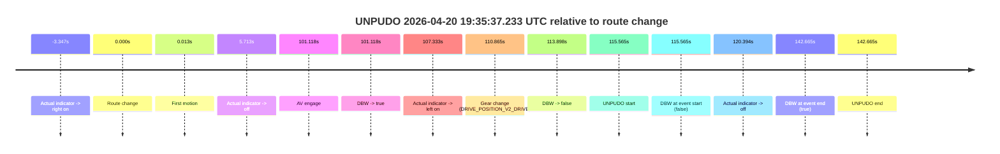

# Run Report: fme10010/2026-04-20--19-33-10--gen2-av-7844ba47-afc0-425a-b5ef-a925c0d2c6bc

| Field | Value |
|---|---|
| Run ID | `fme10010/2026-04-20--19-33-10--gen2-av-7844ba47-afc0-425a-b5ef-a925c0d2c6bc` |
| Date | `2026-04-20` |
| Model(s) | `eel-teal-outspoken` |
| Author | `zak` |
| Event count | `1` |

## unpudo 2026-04-20 19:35:37.233 UTC

| Field | Value |
|---|---|
| Model | `eel-teal-outspoken` |
| Author | `zak` |
| Run ID | `fme10010/2026-04-20--19-33-10--gen2-av-7844ba47-afc0-425a-b5ef-a925c0d2c6bc` |
| Date | `2026-04-20` |
| Time (UTC) | `19:35:37.233` |
| Event type | `unpudo` |
| Disengagement type | `failed_to_unpudo` |
| Route change | `found` |
| Console | [run](https://console.sso.wayve.ai/run/fme10010/2026-04-20--19-33-10--gen2-av-7844ba47-afc0-425a-b5ef-a925c0d2c6bc?id=&time-unixus=1776713737233294) |
| Foxglove | [segment](https://app.foxglove.dev/wayve-on-prem/p/prj_0dX18KZdVHg1fmmI/view?ds=foxglove-stream&ds.deviceName=fme10010&ds.start=2026-04-20T19%3A33%3A31.668231Z&ds.end=2026-04-20T19%3A36%3A14.333290Z&layoutId=lay_0e7VD4WIKDQGU73Y&time=2026-04-20T19%3A35%3A37.233294Z) |

### Event card: fail

- Fail: AV owns part of the segment, but the event still resolves as a model-performance failure under the AV-only scoring rule.

| Event | Time (UTC) | Delta from route change |
|---|---:|---:|
| Actual indicator -> right on | 2026-04-20 19:33:38.321 | `-3.347s` |
| Route change | 2026-04-20 19:33:41.668 | `0.000s` |
| First motion | 2026-04-20 19:33:41.681 | `0.013s` |
| Actual indicator -> off | 2026-04-20 19:33:47.381 | `5.713s` |
| AV engage | 2026-04-20 19:35:22.785 | `101.118s` |
| DBW -> true | 2026-04-20 19:35:22.785 | `101.118s` |
| Actual indicator -> left on | 2026-04-20 19:35:29.001 | `107.333s` |
| Gear change (DRIVE_POSITION_V2_DRIVE) | 2026-04-20 19:35:32.533 | `110.865s` |
| DBW -> false | 2026-04-20 19:35:35.565 | `113.898s` |
| UNPUDO start | 2026-04-20 19:35:37.233 | `115.565s` |
| DBW at event start (false) | 2026-04-20 19:35:37.233 | `115.565s` |
| Actual indicator -> off | 2026-04-20 19:35:42.061 | `120.394s` |
| DBW at event end (true) | 2026-04-20 19:36:04.333 | `142.665s` |
| UNPUDO end | 2026-04-20 19:36:04.333 | `142.665s` |

| Metric | Value |
|---|---|
| Outcome | `fail` |
| Effective failure type | `failed_to_unpudo` |
| Route change status | `found` |
| DBW at event start | `false` |
| DBW at event end | `true` |
| Predicted gear at AV start | `DRIVE_POSITION_V2_PARK` |
| Actual gear at AV start | `DRIVE_POSITION_V2_PARK` |
| Predicted gear at event start | `DRIVE_POSITION_V2_DRIVE` |
| Actual gear at event start | `DRIVE_POSITION_V2_DRIVE` |
| Planned indicator direction | `INDICATORS_STATE_V2_LEFT_ON` |
| Controller indicator direction | `INDICATORS_STATE_V2_LEFT_ON` |
| Actual indicator direction | `INDICATORS_STATE_V2_LEFT_ON` |
| Actual indicator at maneuver end | `INDICATORS_STATE_V2_OFF` |
| Driver accel help in AV | `false` |
| Driver accel help timestamp | `n/a` |
| Max accel pedal pct in AV | `0.0%` |
| Max brake pedal pct in AV | `26.0%` |
| Max speed mps in AV | `0.000` |
| Success timing baseline | `route change` |
| Route -> AV | `101.118s` |
| AV -> event start | `14.447s` |
| AV -> first motion | `-101.105s` |
| Success baseline -> event start | `115.565s` |
| Success baseline -> first motion | `0.013s` |
| AV duration before disengagement | `12.780s` |
| Trajectory waypoint count | `37` |
| Driving-plan step count | `11` |

The scored portion starts from the AV-owned window, not from the pre-AV setup. Route-change search in the stopped pre-event segment was `found`, with the baseline therefore set to route change. At the event anchor the model predicts `DRIVE_POSITION_V2_DRIVE` and the actual gear is `DRIVE_POSITION_V2_DRIVE`. The effective model outcome is `fail` because `failed_to_unpudo.`

### Resolution

| Field | Value |
|---|---|
| Final outcome | `fail` |
| Do we agree with this label? | `yes` |
| Source disengagement type | `failed_to_unpudo` |
| Resolved effective failure type | `failed_to_unpudo` |
| Confidence | `high` |
