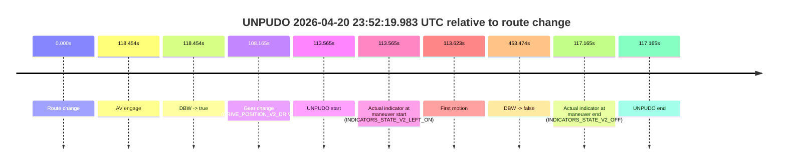
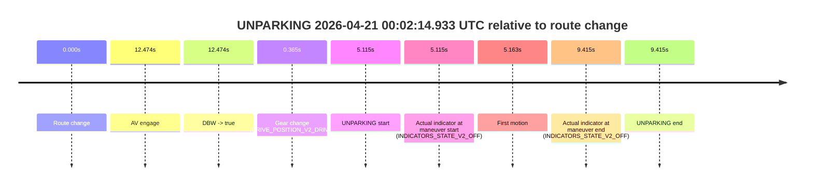

# Run Report: fme10010/2026-04-20--22-24-22--gen2-av-ea132a67-4823-4b83-bf42-8784f70d9b1f

| Field | Value |
|---|---|
| Run ID | `fme10010/2026-04-20--22-24-22--gen2-av-ea132a67-4823-4b83-bf42-8784f70d9b1f` |
| Date | `2026-04-20` |
| Model(s) | `pink-manta-ray-smooth` |
| Author | `guy.geva` |
| Event count | `3` |

## unpudo 2026-04-20 23:31:50.883 UTC

| Field | Value |
|---|---|
| Model | `pink-manta-ray-smooth` |
| Author | `guy.geva` |
| Run ID | `fme10010/2026-04-20--22-24-22--gen2-av-ea132a67-4823-4b83-bf42-8784f70d9b1f` |
| Date | `2026-04-20` |
| Time (UTC) | `23:31:50.883` |
| Event type | `unpudo` |
| Disengagement type | `failed_to_unpudo` |
| Route change | `found` |
| Console | [run](https://console.sso.wayve.ai/run/fme10010/2026-04-20--22-24-22--gen2-av-ea132a67-4823-4b83-bf42-8784f70d9b1f?id=&time-unixus=1776727910883313) |
| Foxglove | [segment](https://app.foxglove.dev/wayve-on-prem/p/prj_0dX18KZdVHg1fmmI/view?ds=foxglove-stream&ds.deviceName=fme10010&ds.start=2026-04-20T23%3A31%3A22.468252Z&ds.end=2026-04-20T23%3A33%3A15.213302Z&layoutId=lay_0e7VD4WIKDQGU73Y&time=2026-04-20T23%3A31%3A50.883313Z) |

### Event card: non-av

- Non-AV: there is no AV-owned portion anywhere inside the detected unpudo timeline, so it is kept for coverage but excluded from model success / failure scoring.

| Event | Time (UTC) | Delta from route change |
|---|---:|---:|
| Route change | 2026-04-20 23:31:32.468 | `0.000s` |
| AV engage | 2026-04-20 23:31:57.852 | `25.384s` |
| DBW -> true | 2026-04-20 23:31:57.852 | `25.384s` |
| Gear change (DRIVE_POSITION_V2_DRIVE) | 2026-04-20 23:31:32.783 | `0.315s` |
| UNPUDO start | 2026-04-20 23:31:50.883 | `18.415s` |
| Actual indicator at maneuver start (INDICATORS_STATE_V2_OFF) | 2026-04-20 23:31:50.883 | `18.415s` |
| First motion | 2026-04-20 23:31:50.921 | `18.453s` |
| DBW -> false | 2026-04-20 23:33:05.213 | `92.745s` |
| Actual indicator at maneuver end (INDICATORS_STATE_V2_OFF) | 2026-04-20 23:31:55.383 | `22.915s` |
| UNPUDO end | 2026-04-20 23:31:55.383 | `22.915s` |

| Metric | Value |
|---|---|
| Outcome | `non-av` |
| Effective failure type | `none` |
| Route change status | `found` |
| DBW at event start | `false` |
| DBW at event end | `false` |
| Predicted gear at AV start | `DRIVE_POSITION_V2_DRIVE` |
| Actual gear at AV start | `DRIVE_POSITION_V2_DRIVE` |
| Predicted gear at event start | `DRIVE_POSITION_V2_DRIVE` |
| Actual gear at event start | `DRIVE_POSITION_V2_DRIVE` |
| Planned indicator direction | `INDICATORS_STATE_V2_LEFT_ON` |
| Controller indicator direction | `INDICATORS_STATE_V2_LEFT_ON` |
| Actual indicator direction | `INDICATORS_STATE_V2_OFF` |
| Actual indicator at maneuver end | `INDICATORS_STATE_V2_OFF` |
| Driver accel help in AV | `false` |
| Driver accel help timestamp | `n/a` |
| Max accel pedal pct in AV | `0.0%` |
| Max brake pedal pct in AV | `0.0%` |
| Max speed mps in AV | `0.000` |
| Route -> AV | `25.384s` |
| AV -> event start | `-6.969s` |
| AV -> first motion | `-6.932s` |
| AV duration before disengagement | `67.361s` |
| Trajectory waypoint count | `37` |
| Driving-plan step count | `11` |

The scored portion starts from the AV-owned window, not from the pre-AV setup. Route-change search in the stopped pre-event segment was `found`, with the baseline therefore set to route change. At the event anchor the model predicts `DRIVE_POSITION_V2_DRIVE` and the actual gear is `DRIVE_POSITION_V2_DRIVE`. The effective model outcome is `non-av` because `there is no AV-owned overlap inside the event timeline`.

### Resolution

| Field | Value |
|---|---|
| Final outcome | `non-av` |
| Do we agree with this label? | `yes` |
| Source disengagement type | `failed_to_unpudo` |
| Resolved effective failure type | `none` |
| Confidence | `high` |

## unpudo 2026-04-20 23:52:19.983 UTC

| Field | Value |
|---|---|
| Model | `pink-manta-ray-smooth` |
| Author | `guy.geva` |
| Run ID | `fme10010/2026-04-20--22-24-22--gen2-av-ea132a67-4823-4b83-bf42-8784f70d9b1f` |
| Date | `2026-04-20` |
| Time (UTC) | `23:52:19.983` |
| Event type | `unpudo` |
| Disengagement type | `failed_to_unpudo` |
| Route change | `found` |
| Console | [run](https://console.sso.wayve.ai/run/fme10010/2026-04-20--22-24-22--gen2-av-ea132a67-4823-4b83-bf42-8784f70d9b1f?id=&time-unixus=1776729139983321) |
| Foxglove | [segment](https://app.foxglove.dev/wayve-on-prem/p/prj_0dX18KZdVHg1fmmI/view?ds=foxglove-stream&ds.deviceName=fme10010&ds.start=2026-04-20T23%3A50%3A16.418338Z&ds.end=2026-04-20T23%3A58%3A09.892437Z&layoutId=lay_0e7VD4WIKDQGU73Y&time=2026-04-20T23%3A52%3A19.983321Z) |

### Event card: non-av

- Non-AV: there is no AV-owned portion anywhere inside the detected unpudo timeline, so it is kept for coverage but excluded from model success / failure scoring.

| Event | Time (UTC) | Delta from route change |
|---|---:|---:|
| Route change | 2026-04-20 23:50:26.418 | `0.000s` |
| AV engage | 2026-04-20 23:52:24.872 | `118.454s` |
| DBW -> true | 2026-04-20 23:52:24.872 | `118.454s` |
| Gear change (DRIVE_POSITION_V2_DRIVE) | 2026-04-20 23:52:14.583 | `108.165s` |
| UNPUDO start | 2026-04-20 23:52:19.983 | `113.565s` |
| Actual indicator at maneuver start (INDICATORS_STATE_V2_LEFT_ON) | 2026-04-20 23:52:19.983 | `113.565s` |
| First motion | 2026-04-20 23:52:20.041 | `113.623s` |
| DBW -> false | 2026-04-20 23:57:59.892 | `453.474s` |
| Actual indicator at maneuver end (INDICATORS_STATE_V2_OFF) | 2026-04-20 23:52:23.583 | `117.165s` |
| UNPUDO end | 2026-04-20 23:52:23.583 | `117.165s` |

| Metric | Value |
|---|---|
| Outcome | `non-av` |
| Effective failure type | `none` |
| Route change status | `found` |
| DBW at event start | `false` |
| DBW at event end | `false` |
| Predicted gear at AV start | `DRIVE_POSITION_V2_DRIVE` |
| Actual gear at AV start | `DRIVE_POSITION_V2_DRIVE` |
| Predicted gear at event start | `DRIVE_POSITION_V2_DRIVE` |
| Actual gear at event start | `DRIVE_POSITION_V2_DRIVE` |
| Planned indicator direction | `INDICATORS_STATE_V2_LEFT_ON` |
| Controller indicator direction | `INDICATORS_STATE_V2_LEFT_ON` |
| Actual indicator direction | `INDICATORS_STATE_V2_LEFT_ON` |
| Actual indicator at maneuver end | `INDICATORS_STATE_V2_OFF` |
| Driver accel help in AV | `false` |
| Driver accel help timestamp | `n/a` |
| Max accel pedal pct in AV | `0.0%` |
| Max brake pedal pct in AV | `0.0%` |
| Max speed mps in AV | `0.000` |
| Route -> AV | `118.454s` |
| AV -> event start | `-4.889s` |
| AV -> first motion | `-4.831s` |
| AV duration before disengagement | `335.020s` |
| Trajectory waypoint count | `37` |
| Driving-plan step count | `11` |

The scored portion starts from the AV-owned window, not from the pre-AV setup. Route-change search in the stopped pre-event segment was `found`, with the baseline therefore set to route change. At the event anchor the model predicts `DRIVE_POSITION_V2_DRIVE` and the actual gear is `DRIVE_POSITION_V2_DRIVE`. The effective model outcome is `non-av` because `there is no AV-owned overlap inside the event timeline`.

### Resolution

| Field | Value |
|---|---|
| Final outcome | `non-av` |
| Do we agree with this label? | `yes` |
| Source disengagement type | `failed_to_unpudo` |
| Resolved effective failure type | `none` |
| Confidence | `high` |

## unparking 2026-04-21 00:02:14.933 UTC

| Field | Value |
|---|---|
| Model | `pink-manta-ray-smooth` |
| Author | `guy.geva` |
| Run ID | `fme10010/2026-04-20--22-24-22--gen2-av-ea132a67-4823-4b83-bf42-8784f70d9b1f` |
| Date | `2026-04-20` |
| Time (UTC) | `00:02:14.933` |
| Event type | `unparking` |
| Disengagement type | `failed_to_pudo` |
| Route change | `found` |
| Console | [run](https://console.sso.wayve.ai/run/fme10010/2026-04-20--22-24-22--gen2-av-ea132a67-4823-4b83-bf42-8784f70d9b1f?id=&time-unixus=1776729734933317) |
| Foxglove | [segment](https://app.foxglove.dev/wayve-on-prem/p/prj_0dX18KZdVHg1fmmI/view?ds=foxglove-stream&ds.deviceName=fme10010&ds.start=2026-04-21T00%3A01%3A59.818275Z&ds.end=2026-04-21T00%3A02%3A29.233313Z&layoutId=lay_0e7VD4WIKDQGU73Y&time=2026-04-21T00%3A02%3A14.933317Z) |

### Event card: non-av

- Non-AV: there is no AV-owned portion anywhere inside the detected unparking timeline, so it is kept for coverage but excluded from model success / failure scoring.

| Event | Time (UTC) | Delta from route change |
|---|---:|---:|
| Route change | 2026-04-21 00:02:09.818 | `0.000s` |
| AV engage | 2026-04-21 00:02:22.292 | `12.474s` |
| DBW -> true | 2026-04-21 00:02:22.292 | `12.474s` |
| Gear change (DRIVE_POSITION_V2_DRIVE) | 2026-04-21 00:02:10.183 | `0.365s` |
| UNPARKING start | 2026-04-21 00:02:14.933 | `5.115s` |
| Actual indicator at maneuver start (INDICATORS_STATE_V2_OFF) | 2026-04-21 00:02:14.933 | `5.115s` |
| First motion | 2026-04-21 00:02:14.981 | `5.163s` |
| Actual indicator at maneuver end (INDICATORS_STATE_V2_OFF) | 2026-04-21 00:02:19.233 | `9.415s` |
| UNPARKING end | 2026-04-21 00:02:19.233 | `9.415s` |

| Metric | Value |
|---|---|
| Outcome | `non-av` |
| Effective failure type | `none` |
| Route change status | `found` |
| DBW at event start | `false` |
| DBW at event end | `false` |
| Predicted gear at AV start | `DRIVE_POSITION_V2_DRIVE` |
| Actual gear at AV start | `DRIVE_POSITION_V2_DRIVE` |
| Predicted gear at event start | `DRIVE_POSITION_V2_DRIVE` |
| Actual gear at event start | `DRIVE_POSITION_V2_DRIVE` |
| Planned indicator direction | `INDICATORS_STATE_V2_LEFT_ON` |
| Controller indicator direction | `INDICATORS_STATE_V2_LEFT_ON` |
| Actual indicator direction | `INDICATORS_STATE_V2_OFF` |
| Actual indicator at maneuver end | `INDICATORS_STATE_V2_OFF` |
| Driver accel help in AV | `false` |
| Driver accel help timestamp | `n/a` |
| Max accel pedal pct in AV | `0.0%` |
| Max brake pedal pct in AV | `0.0%` |
| Max speed mps in AV | `0.000` |
| Route -> AV | `12.474s` |
| AV -> event start | `-7.359s` |
| AV -> first motion | `-7.311s` |
| AV duration before disengagement | `n/a` |
| Trajectory waypoint count | `36` |
| Driving-plan step count | `11` |

The scored portion starts from the AV-owned window, not from the pre-AV setup. Route-change search in the stopped pre-event segment was `found`, with the baseline therefore set to route change. At the event anchor the model predicts `DRIVE_POSITION_V2_DRIVE` and the actual gear is `DRIVE_POSITION_V2_DRIVE`. The effective model outcome is `non-av` because `there is no AV-owned overlap inside the event timeline`.

### Resolution

| Field | Value |
|---|---|
| Final outcome | `non-av` |
| Do we agree with this label? | `yes` |
| Source disengagement type | `failed_to_pudo` |
| Resolved effective failure type | `none` |
| Confidence | `high` |
