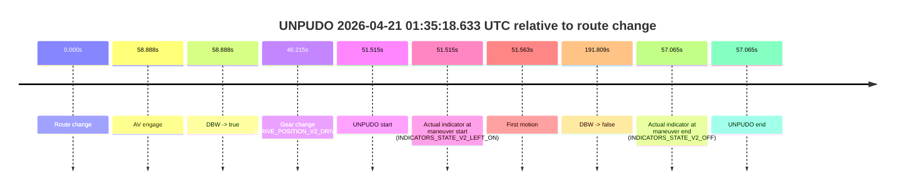
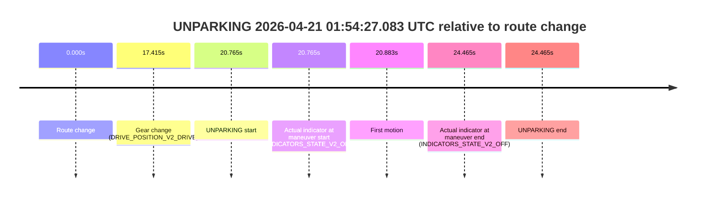

# Run Report: fme10010/2026-04-21--01-22-49--gen2-av-4cb0b774-706b-4a17-bd8c-14fe34e38f51

| Field | Value |
|---|---|
| Run ID | `fme10010/2026-04-21--01-22-49--gen2-av-4cb0b774-706b-4a17-bd8c-14fe34e38f51` |
| Date | `2026-04-21` |
| Model(s) | `blue-panther-solid` |
| Author | `guy.geva` |
| Event count | `5` |

## unpudo 2026-04-21 01:28:56.683 UTC

| Field | Value |
|---|---|
| Model | `blue-panther-solid` |
| Author | `guy.geva` |
| Run ID | `fme10010/2026-04-21--01-22-49--gen2-av-4cb0b774-706b-4a17-bd8c-14fe34e38f51` |
| Date | `2026-04-21` |
| Time (UTC) | `01:28:56.683` |
| Event type | `unpudo` |
| Disengagement type | `failed_to_unpudo` |
| Route change | `found` |
| Console | [run](https://console.sso.wayve.ai/run/fme10010/2026-04-21--01-22-49--gen2-av-4cb0b774-706b-4a17-bd8c-14fe34e38f51?id=&time-unixus=1776734936683328) |
| Foxglove | [segment](https://app.foxglove.dev/wayve-on-prem/p/prj_0dX18KZdVHg1fmmI/view?ds=foxglove-stream&ds.deviceName=fme10010&ds.start=2026-04-21T01%3A28%3A23.868277Z&ds.end=2026-04-21T01%3A32%3A51.090210Z&layoutId=lay_0e7VD4WIKDQGU73Y&time=2026-04-21T01%3A28%3A56.683328Z) |

### Event card: non-av

- Non-AV: there is no AV-owned portion anywhere inside the detected unpudo timeline, so it is kept for coverage but excluded from model success / failure scoring.

| Event | Time (UTC) | Delta from route change |
|---|---:|---:|
| Route change | 2026-04-21 01:28:33.868 | `0.000s` |
| AV engage | 2026-04-21 01:29:03.469 | `29.601s` |
| DBW -> true | 2026-04-21 01:29:03.469 | `29.601s` |
| Gear change (DRIVE_POSITION_V2_DRIVE) | 2026-04-21 01:28:34.133 | `0.265s` |
| UNPUDO start | 2026-04-21 01:28:56.683 | `22.815s` |
| Actual indicator at maneuver start (INDICATORS_STATE_V2_OFF) | 2026-04-21 01:28:56.683 | `22.815s` |
| First motion | 2026-04-21 01:28:56.721 | `22.853s` |
| DBW -> false | 2026-04-21 01:32:41.090 | `247.222s` |
| Actual indicator at maneuver end (INDICATORS_STATE_V2_OFF) | 2026-04-21 01:29:01.583 | `27.715s` |
| UNPUDO end | 2026-04-21 01:29:01.583 | `27.715s` |

| Metric | Value |
|---|---|
| Outcome | `non-av` |
| Effective failure type | `none` |
| Route change status | `found` |
| DBW at event start | `false` |
| DBW at event end | `false` |
| Predicted gear at AV start | `DRIVE_POSITION_V2_DRIVE` |
| Actual gear at AV start | `DRIVE_POSITION_V2_DRIVE` |
| Predicted gear at event start | `DRIVE_POSITION_V2_DRIVE` |
| Actual gear at event start | `DRIVE_POSITION_V2_DRIVE` |
| Planned indicator direction | `INDICATORS_STATE_V2_LEFT_ON` |
| Controller indicator direction | `INDICATORS_STATE_V2_LEFT_ON` |
| Actual indicator direction | `INDICATORS_STATE_V2_OFF` |
| Actual indicator at maneuver end | `INDICATORS_STATE_V2_OFF` |
| Driver accel help in AV | `false` |
| Driver accel help timestamp | `n/a` |
| Max accel pedal pct in AV | `0.0%` |
| Max brake pedal pct in AV | `0.0%` |
| Max speed mps in AV | `0.000` |
| Route -> AV | `29.601s` |
| AV -> event start | `-6.786s` |
| AV -> first motion | `-6.748s` |
| AV duration before disengagement | `217.621s` |
| Trajectory waypoint count | `37` |
| Driving-plan step count | `11` |

The scored portion starts from the AV-owned window, not from the pre-AV setup. Route-change search in the stopped pre-event segment was `found`, with the baseline therefore set to route change. At the event anchor the model predicts `DRIVE_POSITION_V2_DRIVE` and the actual gear is `DRIVE_POSITION_V2_DRIVE`. The effective model outcome is `non-av` because `there is no AV-owned overlap inside the event timeline`.

### Resolution

| Field | Value |
|---|---|
| Final outcome | `non-av` |
| Do we agree with this label? | `yes` |
| Source disengagement type | `failed_to_unpudo` |
| Resolved effective failure type | `none` |
| Confidence | `high` |

## unpudo 2026-04-21 01:32:41.633 UTC

| Field | Value |
|---|---|
| Model | `blue-panther-solid` |
| Author | `guy.geva` |
| Run ID | `fme10010/2026-04-21--01-22-49--gen2-av-4cb0b774-706b-4a17-bd8c-14fe34e38f51` |
| Date | `2026-04-21` |
| Time (UTC) | `01:32:41.633` |
| Event type | `unpudo` |
| Disengagement type | `failed_to_unpudo` |
| Route change | `found` |
| Console | [run](https://console.sso.wayve.ai/run/fme10010/2026-04-21--01-22-49--gen2-av-4cb0b774-706b-4a17-bd8c-14fe34e38f51?id=&time-unixus=1776735161633299) |
| Foxglove | [segment](https://app.foxglove.dev/wayve-on-prem/p/prj_0dX18KZdVHg1fmmI/view?ds=foxglove-stream&ds.deviceName=fme10010&ds.start=2026-04-21T01%3A31%3A48.768227Z&ds.end=2026-04-21T01%3A34%3A22.957209Z&layoutId=lay_0e7VD4WIKDQGU73Y&time=2026-04-21T01%3A32%3A41.633299Z) |

### Event card: non-av

- Non-AV: there is no AV-owned portion anywhere inside the detected unpudo timeline, so it is kept for coverage but excluded from model success / failure scoring.

| Event | Time (UTC) | Delta from route change |
|---|---:|---:|
| Route change | 2026-04-21 01:31:58.768 | `0.000s` |
| AV engage | 2026-04-21 01:32:47.770 | `49.003s` |
| DBW -> true | 2026-04-21 01:32:47.770 | `49.003s` |
| Gear change (DRIVE_POSITION_V2_DRIVE) | 2026-04-21 01:31:59.033 | `0.265s` |
| UNPUDO start | 2026-04-21 01:32:41.633 | `42.865s` |
| Actual indicator at maneuver start (INDICATORS_STATE_V2_OFF) | 2026-04-21 01:32:41.633 | `42.865s` |
| First motion | 2026-04-21 01:32:41.661 | `42.893s` |
| DBW -> false | 2026-04-21 01:34:12.957 | `134.189s` |
| Actual indicator at maneuver end (INDICATORS_STATE_V2_OFF) | 2026-04-21 01:32:44.483 | `45.715s` |
| UNPUDO end | 2026-04-21 01:32:44.483 | `45.715s` |

| Metric | Value |
|---|---|
| Outcome | `non-av` |
| Effective failure type | `none` |
| Route change status | `found` |
| DBW at event start | `false` |
| DBW at event end | `false` |
| Predicted gear at AV start | `DRIVE_POSITION_V2_DRIVE` |
| Actual gear at AV start | `DRIVE_POSITION_V2_DRIVE` |
| Predicted gear at event start | `DRIVE_POSITION_V2_DRIVE` |
| Actual gear at event start | `DRIVE_POSITION_V2_DRIVE` |
| Planned indicator direction | `INDICATORS_STATE_V2_LEFT_ON` |
| Controller indicator direction | `INDICATORS_STATE_V2_LEFT_ON` |
| Actual indicator direction | `INDICATORS_STATE_V2_OFF` |
| Actual indicator at maneuver end | `INDICATORS_STATE_V2_OFF` |
| Driver accel help in AV | `false` |
| Driver accel help timestamp | `n/a` |
| Max accel pedal pct in AV | `0.0%` |
| Max brake pedal pct in AV | `0.0%` |
| Max speed mps in AV | `0.000` |
| Route -> AV | `49.003s` |
| AV -> event start | `-6.138s` |
| AV -> first motion | `-6.110s` |
| AV duration before disengagement | `85.186s` |
| Trajectory waypoint count | `36` |
| Driving-plan step count | `11` |

The scored portion starts from the AV-owned window, not from the pre-AV setup. Route-change search in the stopped pre-event segment was `found`, with the baseline therefore set to route change. At the event anchor the model predicts `DRIVE_POSITION_V2_DRIVE` and the actual gear is `DRIVE_POSITION_V2_DRIVE`. The effective model outcome is `non-av` because `there is no AV-owned overlap inside the event timeline`.

### Resolution

| Field | Value |
|---|---|
| Final outcome | `non-av` |
| Do we agree with this label? | `yes` |
| Source disengagement type | `failed_to_unpudo` |
| Resolved effective failure type | `none` |
| Confidence | `high` |

## unpudo 2026-04-21 01:35:18.633 UTC

| Field | Value |
|---|---|
| Model | `blue-panther-solid` |
| Author | `guy.geva` |
| Run ID | `fme10010/2026-04-21--01-22-49--gen2-av-4cb0b774-706b-4a17-bd8c-14fe34e38f51` |
| Date | `2026-04-21` |
| Time (UTC) | `01:35:18.633` |
| Event type | `unpudo` |
| Disengagement type | `failed_to_unpudo` |
| Route change | `found` |
| Console | [run](https://console.sso.wayve.ai/run/fme10010/2026-04-21--01-22-49--gen2-av-4cb0b774-706b-4a17-bd8c-14fe34e38f51?id=&time-unixus=1776735318633305) |
| Foxglove | [segment](https://app.foxglove.dev/wayve-on-prem/p/prj_0dX18KZdVHg1fmmI/view?ds=foxglove-stream&ds.deviceName=fme10010&ds.start=2026-04-21T01%3A34%3A17.118239Z&ds.end=2026-04-21T01%3A37%3A48.927355Z&layoutId=lay_0e7VD4WIKDQGU73Y&time=2026-04-21T01%3A35%3A18.633305Z) |

### Event card: non-av

- Non-AV: there is no AV-owned portion anywhere inside the detected unpudo timeline, so it is kept for coverage but excluded from model success / failure scoring.

| Event | Time (UTC) | Delta from route change |
|---|---:|---:|
| Route change | 2026-04-21 01:34:27.118 | `0.000s` |
| AV engage | 2026-04-21 01:35:26.006 | `58.888s` |
| DBW -> true | 2026-04-21 01:35:26.006 | `58.888s` |
| Gear change (DRIVE_POSITION_V2_DRIVE) | 2026-04-21 01:35:13.333 | `46.215s` |
| UNPUDO start | 2026-04-21 01:35:18.633 | `51.515s` |
| Actual indicator at maneuver start (INDICATORS_STATE_V2_LEFT_ON) | 2026-04-21 01:35:18.633 | `51.515s` |
| First motion | 2026-04-21 01:35:18.681 | `51.563s` |
| DBW -> false | 2026-04-21 01:37:38.927 | `191.809s` |
| Actual indicator at maneuver end (INDICATORS_STATE_V2_OFF) | 2026-04-21 01:35:24.183 | `57.065s` |
| UNPUDO end | 2026-04-21 01:35:24.183 | `57.065s` |

| Metric | Value |
|---|---|
| Outcome | `non-av` |
| Effective failure type | `none` |
| Route change status | `found` |
| DBW at event start | `false` |
| DBW at event end | `false` |
| Predicted gear at AV start | `DRIVE_POSITION_V2_DRIVE` |
| Actual gear at AV start | `DRIVE_POSITION_V2_DRIVE` |
| Predicted gear at event start | `DRIVE_POSITION_V2_DRIVE` |
| Actual gear at event start | `DRIVE_POSITION_V2_DRIVE` |
| Planned indicator direction | `INDICATORS_STATE_V2_LEFT_ON` |
| Controller indicator direction | `INDICATORS_STATE_V2_LEFT_ON` |
| Actual indicator direction | `INDICATORS_STATE_V2_LEFT_ON` |
| Actual indicator at maneuver end | `INDICATORS_STATE_V2_OFF` |
| Driver accel help in AV | `false` |
| Driver accel help timestamp | `n/a` |
| Max accel pedal pct in AV | `0.0%` |
| Max brake pedal pct in AV | `0.0%` |
| Max speed mps in AV | `0.000` |
| Route -> AV | `58.888s` |
| AV -> event start | `-7.373s` |
| AV -> first motion | `-7.325s` |
| AV duration before disengagement | `132.921s` |
| Trajectory waypoint count | `37` |
| Driving-plan step count | `11` |

The scored portion starts from the AV-owned window, not from the pre-AV setup. Route-change search in the stopped pre-event segment was `found`, with the baseline therefore set to route change. At the event anchor the model predicts `DRIVE_POSITION_V2_DRIVE` and the actual gear is `DRIVE_POSITION_V2_DRIVE`. The effective model outcome is `non-av` because `there is no AV-owned overlap inside the event timeline`.

### Resolution

| Field | Value |
|---|---|
| Final outcome | `non-av` |
| Do we agree with this label? | `yes` |
| Source disengagement type | `failed_to_unpudo` |
| Resolved effective failure type | `none` |
| Confidence | `high` |

## unpudo 2026-04-21 01:49:27.933 UTC

| Field | Value |
|---|---|
| Model | `blue-panther-solid` |
| Author | `guy.geva` |
| Run ID | `fme10010/2026-04-21--01-22-49--gen2-av-4cb0b774-706b-4a17-bd8c-14fe34e38f51` |
| Date | `2026-04-21` |
| Time (UTC) | `01:49:27.933` |
| Event type | `unpudo` |
| Disengagement type | `failed_to_unpudo` |
| Route change | `found` |
| Console | [run](https://console.sso.wayve.ai/run/fme10010/2026-04-21--01-22-49--gen2-av-4cb0b774-706b-4a17-bd8c-14fe34e38f51?id=&time-unixus=1776736167933328) |
| Foxglove | [segment](https://app.foxglove.dev/wayve-on-prem/p/prj_0dX18KZdVHg1fmmI/view?ds=foxglove-stream&ds.deviceName=fme10010&ds.start=2026-04-21T01%3A48%3A20.668624Z&ds.end=2026-04-21T01%3A50%3A43.607375Z&layoutId=lay_0e7VD4WIKDQGU73Y&time=2026-04-21T01%3A49%3A27.933328Z) |

### Event card: accidental

- Accidental: AV ownership is present for less than `2s`, so this is treated as an accidental brush with the maneuver rather than a meaningful model attempt.

| Event | Time (UTC) | Delta from route change |
|---|---:|---:|
| Route change | 2026-04-21 01:48:30.668 | `0.000s` |
| AV engage | 2026-04-21 01:49:30.825 | `60.157s` |
| DBW -> true | 2026-04-21 01:49:30.825 | `60.157s` |
| Gear change (DRIVE_POSITION_V2_DRIVE) | 2026-04-21 01:49:17.783 | `47.115s` |
| UNPUDO start | 2026-04-21 01:49:27.933 | `57.265s` |
| Actual indicator at maneuver start (INDICATORS_STATE_V2_OFF) | 2026-04-21 01:49:27.933 | `57.265s` |
| First motion | 2026-04-21 01:49:27.981 | `57.313s` |
| DBW -> false | 2026-04-21 01:50:33.607 | `122.939s` |
| Actual indicator at maneuver end (INDICATORS_STATE_V2_OFF) | 2026-04-21 01:49:31.083 | `60.415s` |
| UNPUDO end | 2026-04-21 01:49:31.083 | `60.415s` |

| Metric | Value |
|---|---|
| Outcome | `accidental` |
| Effective failure type | `none` |
| Route change status | `found` |
| DBW at event start | `false` |
| DBW at event end | `true` |
| Predicted gear at AV start | `DRIVE_POSITION_V2_DRIVE` |
| Actual gear at AV start | `DRIVE_POSITION_V2_DRIVE` |
| Predicted gear at event start | `DRIVE_POSITION_V2_DRIVE` |
| Actual gear at event start | `DRIVE_POSITION_V2_DRIVE` |
| Planned indicator direction | `INDICATORS_STATE_V2_OFF` |
| Controller indicator direction | `INDICATORS_STATE_V2_OFF` |
| Actual indicator direction | `INDICATORS_STATE_V2_OFF` |
| Actual indicator at maneuver end | `INDICATORS_STATE_V2_OFF` |
| Driver accel help in AV | `false` |
| Driver accel help timestamp | `n/a` |
| Max accel pedal pct in AV | `0.0%` |
| Max brake pedal pct in AV | `0.0%` |
| Max speed mps in AV | `5.167` |
| Route -> AV | `60.157s` |
| AV -> event start | `-2.893s` |
| AV -> first motion | `-2.845s` |
| AV duration before disengagement | `62.781s` |
| Trajectory waypoint count | `37` |
| Driving-plan step count | `11` |

The scored portion starts from the AV-owned window, not from the pre-AV setup. Route-change search in the stopped pre-event segment was `found`, with the baseline therefore set to route change. At the event anchor the model predicts `DRIVE_POSITION_V2_DRIVE` and the actual gear is `DRIVE_POSITION_V2_DRIVE`. The effective model outcome is `accidental` because `the AV-owned portion is shorter than 2s`.

### Resolution

| Field | Value |
|---|---|
| Final outcome | `accidental` |
| Do we agree with this label? | `yes` |
| Source disengagement type | `failed_to_unpudo` |
| Resolved effective failure type | `none` |
| Confidence | `high` |

## unparking 2026-04-21 01:54:27.083 UTC

| Field | Value |
|---|---|
| Model | `blue-panther-solid` |
| Author | `guy.geva` |
| Run ID | `fme10010/2026-04-21--01-22-49--gen2-av-4cb0b774-706b-4a17-bd8c-14fe34e38f51` |
| Date | `2026-04-21` |
| Time (UTC) | `01:54:27.083` |
| Event type | `unparking` |
| Disengagement type | `none observed` |
| Route change | `found` |
| Console | [run](https://console.sso.wayve.ai/run/fme10010/2026-04-21--01-22-49--gen2-av-4cb0b774-706b-4a17-bd8c-14fe34e38f51?id=&time-unixus=1776736467083295) |
| Foxglove | [segment](https://app.foxglove.dev/wayve-on-prem/p/prj_0dX18KZdVHg1fmmI/view?ds=foxglove-stream&ds.deviceName=fme10010&ds.start=2026-04-21T01%3A53%3A56.318266Z&ds.end=2026-04-21T01%3A54%3A40.783310Z&layoutId=lay_0e7VD4WIKDQGU73Y&time=2026-04-21T01%3A54%3A27.083295Z) |

### Event card: non-av

- Non-AV: there is no AV-owned portion anywhere inside the detected unparking timeline, so it is kept for coverage but excluded from model success / failure scoring.

| Event | Time (UTC) | Delta from route change |
|---|---:|---:|
| Route change | 2026-04-21 01:54:06.318 | `0.000s` |
| Gear change (DRIVE_POSITION_V2_DRIVE) | 2026-04-21 01:54:23.733 | `17.415s` |
| UNPARKING start | 2026-04-21 01:54:27.083 | `20.765s` |
| Actual indicator at maneuver start (INDICATORS_STATE_V2_OFF) | 2026-04-21 01:54:27.083 | `20.765s` |
| First motion | 2026-04-21 01:54:27.201 | `20.883s` |
| Actual indicator at maneuver end (INDICATORS_STATE_V2_OFF) | 2026-04-21 01:54:30.783 | `24.465s` |
| UNPARKING end | 2026-04-21 01:54:30.783 | `24.465s` |

| Metric | Value |
|---|---|
| Outcome | `non-av` |
| Effective failure type | `none` |
| Route change status | `found` |
| DBW at event start | `false` |
| DBW at event end | `false` |
| Predicted gear at AV start | `n/a` |
| Actual gear at AV start | `n/a` |
| Predicted gear at event start | `DRIVE_POSITION_V2_DRIVE` |
| Actual gear at event start | `DRIVE_POSITION_V2_DRIVE` |
| Planned indicator direction | `INDICATORS_STATE_V2_LEFT_ON` |
| Controller indicator direction | `INDICATORS_STATE_V2_LEFT_ON` |
| Actual indicator direction | `INDICATORS_STATE_V2_OFF` |
| Actual indicator at maneuver end | `INDICATORS_STATE_V2_OFF` |
| Driver accel help in AV | `false` |
| Driver accel help timestamp | `n/a` |
| Max accel pedal pct in AV | `0.0%` |
| Max brake pedal pct in AV | `0.0%` |
| Max speed mps in AV | `0.000` |
| Route -> AV | `n/a` |
| AV -> event start | `n/a` |
| AV -> first motion | `n/a` |
| AV duration before disengagement | `n/a` |
| Trajectory waypoint count | `36` |
| Driving-plan step count | `11` |

The scored portion starts from the AV-owned window, not from the pre-AV setup. Route-change search in the stopped pre-event segment was `found`, with the baseline therefore set to route change. At the event anchor the model predicts `DRIVE_POSITION_V2_DRIVE` and the actual gear is `DRIVE_POSITION_V2_DRIVE`. The effective model outcome is `non-av` because `there is no AV-owned overlap inside the event timeline`.

### Resolution

| Field | Value |
|---|---|
| Final outcome | `non-av` |
| Do we agree with this label? | `yes` |
| Source disengagement type | `none observed` |
| Resolved effective failure type | `none` |
| Confidence | `high` |
