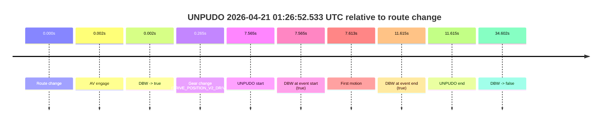
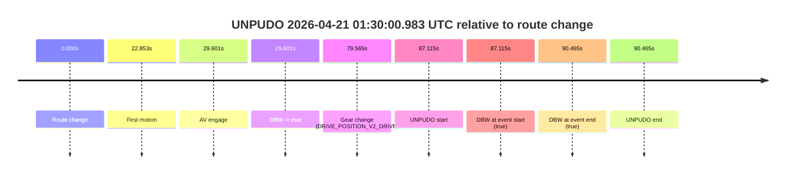

# Run Report: fme10010/2026-04-21--01-22-49--gen2-av-4cb0b774-706b-4a17-bd8c-14fe34e38f51

| Field | Value |
|---|---|
| Run ID | `fme10010/2026-04-21--01-22-49--gen2-av-4cb0b774-706b-4a17-bd8c-14fe34e38f51` |
| Date | `2026-04-21` |
| Model(s) | `eel-teal-outspoken` |
| Author | `zak` |
| Event count | `2` |

## unpudo 2026-04-21 01:26:52.533 UTC

| Field | Value |
|---|---|
| Model | `eel-teal-outspoken` |
| Author | `zak` |
| Run ID | `fme10010/2026-04-21--01-22-49--gen2-av-4cb0b774-706b-4a17-bd8c-14fe34e38f51` |
| Date | `2026-04-21` |
| Time (UTC) | `01:26:52.533` |
| Event type | `unpudo` |
| Disengagement type | `none observed` |
| Route change | `found` |
| Console | [run](https://console.sso.wayve.ai/run/fme10010/2026-04-21--01-22-49--gen2-av-4cb0b774-706b-4a17-bd8c-14fe34e38f51?id=&time-unixus=1776734812533299) |
| Foxglove | [segment](https://app.foxglove.dev/wayve-on-prem/p/prj_0dX18KZdVHg1fmmI/view?ds=foxglove-stream&ds.deviceName=fme10010&ds.start=2026-04-21T01%3A26%3A34.968337Z&ds.end=2026-04-21T01%3A27%3A29.570320Z&layoutId=lay_0e7VD4WIKDQGU73Y&time=2026-04-21T01%3A26%3A52.533299Z) |

### Event card: pass

- Pass: AV owns the credited unpudo from route change through the official unpudo window, the gear state is aligned at the anchor, and the vehicle moves without driver accelerator help in AV.

| Event | Time (UTC) | Delta from route change |
|---|---:|---:|
| Route change | 2026-04-21 01:26:44.968 | `0.000s` |
| AV engage | 2026-04-21 01:26:44.969 | `0.002s` |
| DBW -> true | 2026-04-21 01:26:44.969 | `0.002s` |
| Gear change (DRIVE_POSITION_V2_DRIVE) | 2026-04-21 01:26:45.233 | `0.265s` |
| UNPUDO start | 2026-04-21 01:26:52.533 | `7.565s` |
| DBW at event start (true) | 2026-04-21 01:26:52.533 | `7.565s` |
| First motion | 2026-04-21 01:26:52.581 | `7.613s` |
| DBW at event end (true) | 2026-04-21 01:26:56.583 | `11.615s` |
| UNPUDO end | 2026-04-21 01:26:56.583 | `11.615s` |
| DBW -> false | 2026-04-21 01:27:19.570 | `34.602s` |

| Metric | Value |
|---|---|
| Outcome | `pass` |
| Effective failure type | `none` |
| Route change status | `found` |
| DBW at event start | `true` |
| DBW at event end | `true` |
| Predicted gear at AV start | `DRIVE_POSITION_V2_PARK` |
| Actual gear at AV start | `DRIVE_POSITION_V2_PARK` |
| Predicted gear at event start | `DRIVE_POSITION_V2_DRIVE` |
| Actual gear at event start | `DRIVE_POSITION_V2_DRIVE` |
| Planned indicator direction | `INDICATORS_STATE_V2_OFF` |
| Controller indicator direction | `INDICATORS_STATE_V2_OFF` |
| Actual indicator direction | `INDICATORS_STATE_V2_OFF` |
| Actual indicator at maneuver end | `INDICATORS_STATE_V2_OFF` |
| Driver accel help in AV | `false` |
| Driver accel help timestamp | `n/a` |
| Max accel pedal pct in AV | `0.0%` |
| Max brake pedal pct in AV | `11.2%` |
| Max speed mps in AV | `3.750` |
| Success timing baseline | `route change` |
| Route -> AV | `0.002s` |
| AV -> event start | `7.563s` |
| AV -> first motion | `7.611s` |
| Success baseline -> event start | `7.565s` |
| Success baseline -> first motion | `7.613s` |
| AV duration before disengagement | `34.600s` |
| Trajectory waypoint count | `38` |
| Driving-plan step count | `11` |

The scored portion starts from the AV-owned window, not from the pre-AV setup. Route-change search in the stopped pre-event segment was `found`, with the baseline therefore set to route change. At the event anchor the model predicts `DRIVE_POSITION_V2_DRIVE` and the actual gear is `DRIVE_POSITION_V2_DRIVE`. The effective model outcome is `pass` because `the credited unpudo stays AV-owned through the official unpudo window.`

### Resolution

| Field | Value |
|---|---|
| Final outcome | `pass` |
| Do we agree with this label? | `yes` |
| Source disengagement type | `none observed` |
| Resolved effective failure type | `none` |
| Confidence | `high` |

## unpudo 2026-04-21 01:30:00.983 UTC

| Field | Value |
|---|---|
| Model | `eel-teal-outspoken` |
| Author | `zak` |
| Run ID | `fme10010/2026-04-21--01-22-49--gen2-av-4cb0b774-706b-4a17-bd8c-14fe34e38f51` |
| Date | `2026-04-21` |
| Time (UTC) | `01:30:00.983` |
| Event type | `unpudo` |
| Disengagement type | `none observed` |
| Route change | `found` |
| Console | [run](https://console.sso.wayve.ai/run/fme10010/2026-04-21--01-22-49--gen2-av-4cb0b774-706b-4a17-bd8c-14fe34e38f51?id=&time-unixus=1776735000983326) |
| Foxglove | [segment](https://app.foxglove.dev/wayve-on-prem/p/prj_0dX18KZdVHg1fmmI/view?ds=foxglove-stream&ds.deviceName=fme10010&ds.start=2026-04-21T01%3A28%3A23.868277Z&ds.end=2026-04-21T01%3A30%3A14.333304Z&layoutId=lay_0e7VD4WIKDQGU73Y&time=2026-04-21T01%3A30%3A00.983326Z) |

### Event card: pass

- Pass: AV owns the credited unpudo from route change through the official unpudo window, the gear state is aligned at the anchor, and the vehicle moves without driver accelerator help in AV.

| Event | Time (UTC) | Delta from route change |
|---|---:|---:|
| Route change | 2026-04-21 01:28:33.868 | `0.000s` |
| First motion | 2026-04-21 01:28:56.721 | `22.853s` |
| AV engage | 2026-04-21 01:29:03.469 | `29.601s` |
| DBW -> true | 2026-04-21 01:29:03.469 | `29.601s` |
| Gear change (DRIVE_POSITION_V2_DRIVE) | 2026-04-21 01:29:53.433 | `79.565s` |
| UNPUDO start | 2026-04-21 01:30:00.983 | `87.115s` |
| DBW at event start (true) | 2026-04-21 01:30:00.983 | `87.115s` |
| DBW at event end (true) | 2026-04-21 01:30:04.333 | `90.465s` |
| UNPUDO end | 2026-04-21 01:30:04.333 | `90.465s` |

| Metric | Value |
|---|---|
| Outcome | `pass` |
| Effective failure type | `none` |
| Route change status | `found` |
| DBW at event start | `true` |
| DBW at event end | `true` |
| Predicted gear at AV start | `DRIVE_POSITION_V2_DRIVE` |
| Actual gear at AV start | `DRIVE_POSITION_V2_DRIVE` |
| Predicted gear at event start | `DRIVE_POSITION_V2_DRIVE` |
| Actual gear at event start | `DRIVE_POSITION_V2_DRIVE` |
| Planned indicator direction | `INDICATORS_STATE_V2_OFF` |
| Controller indicator direction | `INDICATORS_STATE_V2_OFF` |
| Actual indicator direction | `INDICATORS_STATE_V2_OFF` |
| Actual indicator at maneuver end | `INDICATORS_STATE_V2_OFF` |
| Driver accel help in AV | `false` |
| Driver accel help timestamp | `n/a` |
| Max accel pedal pct in AV | `0.0%` |
| Max brake pedal pct in AV | `8.2%` |
| Max speed mps in AV | `8.617` |
| Success timing baseline | `route change` |
| Route -> AV | `29.601s` |
| AV -> event start | `57.514s` |
| AV -> first motion | `-6.748s` |
| Success baseline -> event start | `87.115s` |
| Success baseline -> first motion | `22.853s` |
| AV duration before disengagement | `n/a` |
| Trajectory waypoint count | `37` |
| Driving-plan step count | `11` |

The scored portion starts from the AV-owned window, not from the pre-AV setup. Route-change search in the stopped pre-event segment was `found`, with the baseline therefore set to route change. At the event anchor the model predicts `DRIVE_POSITION_V2_DRIVE` and the actual gear is `DRIVE_POSITION_V2_DRIVE`. The effective model outcome is `pass` because `the credited unpudo stays AV-owned through the official unpudo window.`

### Resolution

| Field | Value |
|---|---|
| Final outcome | `pass` |
| Do we agree with this label? | `yes` |
| Source disengagement type | `none observed` |
| Resolved effective failure type | `none` |
| Confidence | `high` |
