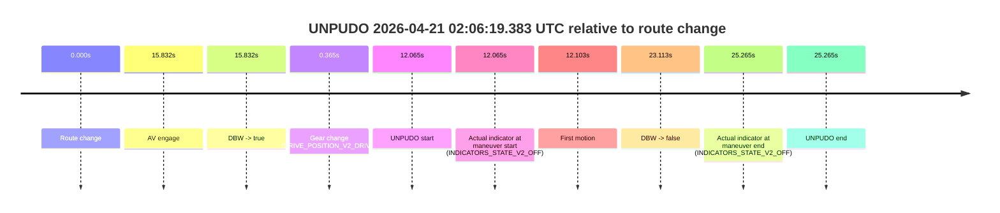
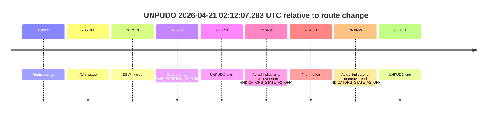

# Run Report: fme10010/2026-04-21--01-56-26--gen2-av-6b80d294-3b4e-4154-9faf-dcb04761709d

| Field | Value |
|---|---|
| Run ID | `fme10010/2026-04-21--01-56-26--gen2-av-6b80d294-3b4e-4154-9faf-dcb04761709d` |
| Date | `2026-04-21` |
| Model(s) | `blue-panther-solid` |
| Author | `guy.geva` |
| Event count | `3` |

## unpudo 2026-04-21 02:04:35.283 UTC

| Field | Value |
|---|---|
| Model | `blue-panther-solid` |
| Author | `guy.geva` |
| Run ID | `fme10010/2026-04-21--01-56-26--gen2-av-6b80d294-3b4e-4154-9faf-dcb04761709d` |
| Date | `2026-04-21` |
| Time (UTC) | `02:04:35.283` |
| Event type | `unpudo` |
| Disengagement type | `failed_to_unpudo` |
| Route change | `found` |
| Console | [run](https://console.sso.wayve.ai/run/fme10010/2026-04-21--01-56-26--gen2-av-6b80d294-3b4e-4154-9faf-dcb04761709d?id=&time-unixus=1776737075283311) |
| Foxglove | [segment](https://app.foxglove.dev/wayve-on-prem/p/prj_0dX18KZdVHg1fmmI/view?ds=foxglove-stream&ds.deviceName=fme10010&ds.start=2026-04-21T02%3A04%3A07.518250Z&ds.end=2026-04-21T02%3A06%3A28.629401Z&layoutId=lay_0e7VD4WIKDQGU73Y&time=2026-04-21T02%3A04%3A35.283311Z) |

### Event card: fail

- Fail: AV owns part of the segment, but the event still resolves as a model-performance failure under the AV-only scoring rule.

| Event | Time (UTC) | Delta from route change |
|---|---:|---:|
| Route change | 2026-04-21 02:04:17.518 | `0.000s` |
| AV engage | 2026-04-21 02:04:40.789 | `23.271s` |
| DBW -> true | 2026-04-21 02:04:40.789 | `23.271s` |
| Gear change (DRIVE_POSITION_V2_DRIVE) | 2026-04-21 02:04:28.183 | `10.665s` |
| UNPUDO start | 2026-04-21 02:04:35.283 | `17.765s` |
| Actual indicator at maneuver start (INDICATORS_STATE_V2_OFF) | 2026-04-21 02:04:35.283 | `17.765s` |
| First motion | 2026-04-21 02:04:35.301 | `17.783s` |
| DBW -> false | 2026-04-21 02:06:18.629 | `121.111s` |
| Actual indicator at maneuver end (INDICATORS_STATE_V2_OFF) | 2026-04-21 02:04:39.533 | `22.015s` |
| UNPUDO end | 2026-04-21 02:04:39.533 | `22.015s` |

| Metric | Value |
|---|---|
| Outcome | `fail` |
| Effective failure type | `failed_to_unpudo` |
| Route change status | `found` |
| DBW at event start | `false` |
| DBW at event end | `false` |
| Predicted gear at AV start | `DRIVE_POSITION_V2_DRIVE` |
| Actual gear at AV start | `DRIVE_POSITION_V2_DRIVE` |
| Predicted gear at event start | `DRIVE_POSITION_V2_DRIVE` |
| Actual gear at event start | `DRIVE_POSITION_V2_DRIVE` |
| Planned indicator direction | `INDICATORS_STATE_V2_OFF` |
| Controller indicator direction | `INDICATORS_STATE_V2_OFF` |
| Actual indicator direction | `INDICATORS_STATE_V2_OFF` |
| Actual indicator at maneuver end | `INDICATORS_STATE_V2_OFF` |
| Driver accel help in AV | `false` |
| Driver accel help timestamp | `n/a` |
| Max accel pedal pct in AV | `0.0%` |
| Max brake pedal pct in AV | `0.0%` |
| Max speed mps in AV | `0.000` |
| Route -> AV | `23.271s` |
| AV -> event start | `-5.506s` |
| AV -> first motion | `-5.488s` |
| AV duration before disengagement | `97.840s` |
| Trajectory waypoint count | `37` |
| Driving-plan step count | `11` |

The scored portion starts from the AV-owned window, not from the pre-AV setup. Route-change search in the stopped pre-event segment was `found`, with the baseline therefore set to route change. At the event anchor the model predicts `DRIVE_POSITION_V2_DRIVE` and the actual gear is `DRIVE_POSITION_V2_DRIVE`. The effective model outcome is `fail` because `failed_to_unpudo`.

### Resolution

| Field | Value |
|---|---|
| Final outcome | `fail` |
| Do we agree with this label? | `yes` |
| Source disengagement type | `failed_to_unpudo` |
| Resolved effective failure type | `failed_to_unpudo` |
| Confidence | `high` |

## unpudo 2026-04-21 02:06:19.383 UTC

| Field | Value |
|---|---|
| Model | `blue-panther-solid` |
| Author | `guy.geva` |
| Run ID | `fme10010/2026-04-21--01-56-26--gen2-av-6b80d294-3b4e-4154-9faf-dcb04761709d` |
| Date | `2026-04-21` |
| Time (UTC) | `02:06:19.383` |
| Event type | `unpudo` |
| Disengagement type | `failed_to_unpudo` |
| Route change | `found` |
| Console | [run](https://console.sso.wayve.ai/run/fme10010/2026-04-21--01-56-26--gen2-av-6b80d294-3b4e-4154-9faf-dcb04761709d?id=&time-unixus=1776737179383295) |
| Foxglove | [segment](https://app.foxglove.dev/wayve-on-prem/p/prj_0dX18KZdVHg1fmmI/view?ds=foxglove-stream&ds.deviceName=fme10010&ds.start=2026-04-21T02%3A05%3A57.318240Z&ds.end=2026-04-21T02%3A06%3A42.583309Z&layoutId=lay_0e7VD4WIKDQGU73Y&time=2026-04-21T02%3A06%3A19.383295Z) |

### Event card: fail

- Fail: AV owns part of the segment, but the event still resolves as a model-performance failure under the AV-only scoring rule.

| Event | Time (UTC) | Delta from route change |
|---|---:|---:|
| Route change | 2026-04-21 02:06:07.318 | `0.000s` |
| AV engage | 2026-04-21 02:06:23.150 | `15.832s` |
| DBW -> true | 2026-04-21 02:06:23.150 | `15.832s` |
| Gear change (DRIVE_POSITION_V2_DRIVE) | 2026-04-21 02:06:07.683 | `0.365s` |
| UNPUDO start | 2026-04-21 02:06:19.383 | `12.065s` |
| Actual indicator at maneuver start (INDICATORS_STATE_V2_OFF) | 2026-04-21 02:06:19.383 | `12.065s` |
| First motion | 2026-04-21 02:06:19.421 | `12.103s` |
| DBW -> false | 2026-04-21 02:06:30.430 | `23.113s` |
| Actual indicator at maneuver end (INDICATORS_STATE_V2_OFF) | 2026-04-21 02:06:32.583 | `25.265s` |
| UNPUDO end | 2026-04-21 02:06:32.583 | `25.265s` |

| Metric | Value |
|---|---|
| Outcome | `fail` |
| Effective failure type | `failed_to_unpudo` |
| Route change status | `found` |
| DBW at event start | `false` |
| DBW at event end | `false` |
| Predicted gear at AV start | `DRIVE_POSITION_V2_DRIVE` |
| Actual gear at AV start | `DRIVE_POSITION_V2_DRIVE` |
| Predicted gear at event start | `DRIVE_POSITION_V2_DRIVE` |
| Actual gear at event start | `DRIVE_POSITION_V2_DRIVE` |
| Planned indicator direction | `INDICATORS_STATE_V2_OFF` |
| Controller indicator direction | `INDICATORS_STATE_V2_OFF` |
| Actual indicator direction | `INDICATORS_STATE_V2_OFF` |
| Actual indicator at maneuver end | `INDICATORS_STATE_V2_OFF` |
| Driver accel help in AV | `false` |
| Driver accel help timestamp | `n/a` |
| Max accel pedal pct in AV | `0.0%` |
| Max brake pedal pct in AV | `27.5%` |
| Max speed mps in AV | `1.156` |
| Route -> AV | `15.832s` |
| AV -> event start | `-3.767s` |
| AV -> first motion | `-3.729s` |
| AV duration before disengagement | `7.280s` |
| Trajectory waypoint count | `37` |
| Driving-plan step count | `11` |

The scored portion starts from the AV-owned window, not from the pre-AV setup. Route-change search in the stopped pre-event segment was `found`, with the baseline therefore set to route change. At the event anchor the model predicts `DRIVE_POSITION_V2_DRIVE` and the actual gear is `DRIVE_POSITION_V2_DRIVE`. The effective model outcome is `fail` because `failed_to_unpudo`.

### Resolution

| Field | Value |
|---|---|
| Final outcome | `fail` |
| Do we agree with this label? | `yes` |
| Source disengagement type | `failed_to_unpudo` |
| Resolved effective failure type | `failed_to_unpudo` |
| Confidence | `high` |

## unpudo 2026-04-21 02:12:07.283 UTC

| Field | Value |
|---|---|
| Model | `blue-panther-solid` |
| Author | `guy.geva` |
| Run ID | `fme10010/2026-04-21--01-56-26--gen2-av-6b80d294-3b4e-4154-9faf-dcb04761709d` |
| Date | `2026-04-21` |
| Time (UTC) | `02:12:07.283` |
| Event type | `unpudo` |
| Disengagement type | `failed_to_unpudo` |
| Route change | `found` |
| Console | [run](https://console.sso.wayve.ai/run/fme10010/2026-04-21--01-56-26--gen2-av-6b80d294-3b4e-4154-9faf-dcb04761709d?id=&time-unixus=1776737527283318) |
| Foxglove | [segment](https://app.foxglove.dev/wayve-on-prem/p/prj_0dX18KZdVHg1fmmI/view?ds=foxglove-stream&ds.deviceName=fme10010&ds.start=2026-04-21T02%3A10%3A44.918273Z&ds.end=2026-04-21T02%3A12%3A21.783310Z&layoutId=lay_0e7VD4WIKDQGU73Y&time=2026-04-21T02%3A12%3A07.283318Z) |

### Event card: fail

- Fail: AV owns part of the segment, but the event still resolves as a model-performance failure under the AV-only scoring rule.

| Event | Time (UTC) | Delta from route change |
|---|---:|---:|
| Route change | 2026-04-21 02:10:54.918 | `0.000s` |
| AV engage | 2026-04-21 02:12:13.709 | `78.791s` |
| DBW -> true | 2026-04-21 02:12:13.709 | `78.791s` |
| Gear change (DRIVE_POSITION_V2_DRIVE) | 2026-04-21 02:11:59.483 | `64.565s` |
| UNPUDO start | 2026-04-21 02:12:07.283 | `72.365s` |
| Actual indicator at maneuver start (INDICATORS_STATE_V2_OFF) | 2026-04-21 02:12:07.283 | `72.365s` |
| First motion | 2026-04-21 02:12:07.321 | `72.403s` |
| Actual indicator at maneuver end (INDICATORS_STATE_V2_OFF) | 2026-04-21 02:12:11.783 | `76.865s` |
| UNPUDO end | 2026-04-21 02:12:11.783 | `76.865s` |

| Metric | Value |
|---|---|
| Outcome | `fail` |
| Effective failure type | `failed_to_unpudo` |
| Route change status | `found` |
| DBW at event start | `false` |
| DBW at event end | `false` |
| Predicted gear at AV start | `DRIVE_POSITION_V2_DRIVE` |
| Actual gear at AV start | `DRIVE_POSITION_V2_DRIVE` |
| Predicted gear at event start | `DRIVE_POSITION_V2_DRIVE` |
| Actual gear at event start | `DRIVE_POSITION_V2_DRIVE` |
| Planned indicator direction | `INDICATORS_STATE_V2_LEFT_ON` |
| Controller indicator direction | `INDICATORS_STATE_V2_LEFT_ON` |
| Actual indicator direction | `INDICATORS_STATE_V2_OFF` |
| Actual indicator at maneuver end | `INDICATORS_STATE_V2_OFF` |
| Driver accel help in AV | `false` |
| Driver accel help timestamp | `n/a` |
| Max accel pedal pct in AV | `0.0%` |
| Max brake pedal pct in AV | `0.0%` |
| Max speed mps in AV | `0.000` |
| Route -> AV | `78.791s` |
| AV -> event start | `-6.426s` |
| AV -> first motion | `-6.388s` |
| AV duration before disengagement | `n/a` |
| Trajectory waypoint count | `37` |
| Driving-plan step count | `11` |

The scored portion starts from the AV-owned window, not from the pre-AV setup. Route-change search in the stopped pre-event segment was `found`, with the baseline therefore set to route change. At the event anchor the model predicts `DRIVE_POSITION_V2_DRIVE` and the actual gear is `DRIVE_POSITION_V2_DRIVE`. The effective model outcome is `fail` because `failed_to_unpudo`.

### Resolution

| Field | Value |
|---|---|
| Final outcome | `fail` |
| Do we agree with this label? | `yes` |
| Source disengagement type | `failed_to_unpudo` |
| Resolved effective failure type | `failed_to_unpudo` |
| Confidence | `high` |
