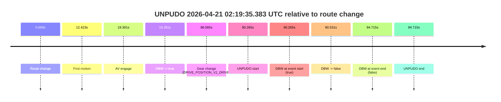
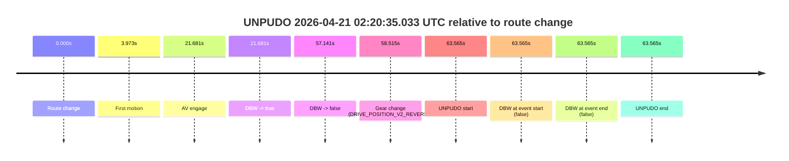

# Run Report: fme10010/2026-04-21--01-56-26--gen2-av-6b80d294-3b4e-4154-9faf-dcb04761709d

| Field | Value |
|---|---|
| Run ID | `fme10010/2026-04-21--01-56-26--gen2-av-6b80d294-3b4e-4154-9faf-dcb04761709d` |
| Date | `2026-04-21` |
| Model(s) | `eel-teal-outspoken` |
| Author | `zak` |
| Event count | `2` |

## unpudo 2026-04-21 02:19:35.383 UTC

| Field | Value |
|---|---|
| Model | `eel-teal-outspoken` |
| Author | `zak` |
| Run ID | `fme10010/2026-04-21--01-56-26--gen2-av-6b80d294-3b4e-4154-9faf-dcb04761709d` |
| Date | `2026-04-21` |
| Time (UTC) | `02:19:35.383` |
| Event type | `unpudo` |
| Disengagement type | `failed_to_unpudo` |
| Route change | `found` |
| Console | [run](https://console.sso.wayve.ai/run/fme10010/2026-04-21--01-56-26--gen2-av-6b80d294-3b4e-4154-9faf-dcb04761709d?id=&time-unixus=1776737975383305) |
| Foxglove | [segment](https://app.foxglove.dev/wayve-on-prem/p/prj_0dX18KZdVHg1fmmI/view?ds=foxglove-stream&ds.deviceName=fme10010&ds.start=2026-04-21T02%3A17%3A55.118218Z&ds.end=2026-04-21T02%3A19%3A49.833302Z&layoutId=lay_0e7VD4WIKDQGU73Y&time=2026-04-21T02%3A19%3A35.383305Z) |

### Event card: fail

- Fail: AV owns part of the segment, but the event still resolves as a model-performance failure under the AV-only scoring rule.

| Event | Time (UTC) | Delta from route change |
|---|---:|---:|
| Route change | 2026-04-21 02:18:05.118 | `0.000s` |
| First motion | 2026-04-21 02:18:17.541 | `12.423s` |
| AV engage | 2026-04-21 02:18:24.509 | `19.391s` |
| DBW -> true | 2026-04-21 02:18:24.509 | `19.391s` |
| Gear change (DRIVE_POSITION_V2_DRIVE) | 2026-04-21 02:19:31.683 | `86.565s` |
| UNPUDO start | 2026-04-21 02:19:35.383 | `90.265s` |
| DBW at event start (true) | 2026-04-21 02:19:35.383 | `90.265s` |
| DBW -> false | 2026-04-21 02:19:35.649 | `90.531s` |
| DBW at event end (false) | 2026-04-21 02:19:39.833 | `94.715s` |
| UNPUDO end | 2026-04-21 02:19:39.833 | `94.715s` |

| Metric | Value |
|---|---|
| Outcome | `fail` |
| Effective failure type | `failed_to_unpudo` |
| Route change status | `found` |
| DBW at event start | `true` |
| DBW at event end | `false` |
| Predicted gear at AV start | `DRIVE_POSITION_V2_DRIVE` |
| Actual gear at AV start | `DRIVE_POSITION_V2_DRIVE` |
| Predicted gear at event start | `DRIVE_POSITION_V2_DRIVE` |
| Actual gear at event start | `DRIVE_POSITION_V2_DRIVE` |
| Planned indicator direction | `INDICATORS_STATE_V2_LEFT_ON` |
| Controller indicator direction | `INDICATORS_STATE_V2_LEFT_ON` |
| Actual indicator direction | `INDICATORS_STATE_V2_OFF` |
| Actual indicator at maneuver end | `INDICATORS_STATE_V2_OFF` |
| Driver accel help in AV | `false` |
| Driver accel help timestamp | `n/a` |
| Max accel pedal pct in AV | `0.0%` |
| Max brake pedal pct in AV | `28.5%` |
| Max speed mps in AV | `8.642` |
| Success timing baseline | `route change` |
| Route -> AV | `19.391s` |
| AV -> event start | `70.874s` |
| AV -> first motion | `-6.968s` |
| Success baseline -> event start | `90.265s` |
| Success baseline -> first motion | `12.423s` |
| AV duration before disengagement | `71.140s` |
| Trajectory waypoint count | `37` |
| Driving-plan step count | `11` |

The scored portion starts from the AV-owned window, not from the pre-AV setup. Route-change search in the stopped pre-event segment was `found`, with the baseline therefore set to route change. At the event anchor the model predicts `DRIVE_POSITION_V2_DRIVE` and the actual gear is `DRIVE_POSITION_V2_DRIVE`. The effective model outcome is `fail` because `failed_to_unpudo.`

### Resolution

| Field | Value |
|---|---|
| Final outcome | `fail` |
| Do we agree with this label? | `yes` |
| Source disengagement type | `failed_to_unpudo` |
| Resolved effective failure type | `failed_to_unpudo` |
| Confidence | `high` |

## unpudo 2026-04-21 02:20:35.033 UTC

| Field | Value |
|---|---|
| Model | `eel-teal-outspoken` |
| Author | `zak` |
| Run ID | `fme10010/2026-04-21--01-56-26--gen2-av-6b80d294-3b4e-4154-9faf-dcb04761709d` |
| Date | `2026-04-21` |
| Time (UTC) | `02:20:35.033` |
| Event type | `unpudo` |
| Disengagement type | `failed_to_pudo` |
| Route change | `found` |
| Console | [run](https://console.sso.wayve.ai/run/fme10010/2026-04-21--01-56-26--gen2-av-6b80d294-3b4e-4154-9faf-dcb04761709d?id=&time-unixus=1776738035033301) |
| Foxglove | [segment](https://app.foxglove.dev/wayve-on-prem/p/prj_0dX18KZdVHg1fmmI/view?ds=foxglove-stream&ds.deviceName=fme10010&ds.start=2026-04-21T02%3A19%3A21.468243Z&ds.end=2026-04-21T02%3A20%3A45.033301Z&layoutId=lay_0e7VD4WIKDQGU73Y&time=2026-04-21T02%3A20%3A35.033301Z) |

### Event card: fail

- Fail: AV owns part of the segment, but the event still resolves as a model-performance failure under the AV-only scoring rule.

| Event | Time (UTC) | Delta from route change |
|---|---:|---:|
| Route change | 2026-04-21 02:19:31.468 | `0.000s` |
| First motion | 2026-04-21 02:19:35.441 | `3.973s` |
| AV engage | 2026-04-21 02:19:53.149 | `21.681s` |
| DBW -> true | 2026-04-21 02:19:53.149 | `21.681s` |
| DBW -> false | 2026-04-21 02:20:28.609 | `57.141s` |
| Gear change (DRIVE_POSITION_V2_REVERSE) | 2026-04-21 02:20:29.983 | `58.515s` |
| UNPUDO start | 2026-04-21 02:20:35.033 | `63.565s` |
| DBW at event start (false) | 2026-04-21 02:20:35.033 | `63.565s` |
| DBW at event end (false) | 2026-04-21 02:20:35.033 | `63.565s` |
| UNPUDO end | 2026-04-21 02:20:35.033 | `63.565s` |

| Metric | Value |
|---|---|
| Outcome | `fail` |
| Effective failure type | `failed_to_pudo` |
| Route change status | `found` |
| DBW at event start | `false` |
| DBW at event end | `false` |
| Predicted gear at AV start | `DRIVE_POSITION_V2_DRIVE` |
| Actual gear at AV start | `DRIVE_POSITION_V2_DRIVE` |
| Predicted gear at event start | `DRIVE_POSITION_V2_REVERSE` |
| Actual gear at event start | `DRIVE_POSITION_V2_REVERSE` |
| Planned indicator direction | `INDICATORS_STATE_V2_OFF` |
| Controller indicator direction | `INDICATORS_STATE_V2_OFF` |
| Actual indicator direction | `INDICATORS_STATE_V2_OFF` |
| Actual indicator at maneuver end | `INDICATORS_STATE_V2_OFF` |
| Driver accel help in AV | `false` |
| Driver accel help timestamp | `n/a` |
| Max accel pedal pct in AV | `0.0%` |
| Max brake pedal pct in AV | `29.8%` |
| Max speed mps in AV | `7.183` |
| Success timing baseline | `route change` |
| Route -> AV | `21.681s` |
| AV -> event start | `41.884s` |
| AV -> first motion | `-17.708s` |
| Success baseline -> event start | `63.565s` |
| Success baseline -> first motion | `3.973s` |
| AV duration before disengagement | `35.460s` |
| Trajectory waypoint count | `38` |
| Driving-plan step count | `11` |

The scored portion starts from the AV-owned window, not from the pre-AV setup. Route-change search in the stopped pre-event segment was `found`, with the baseline therefore set to route change. At the event anchor the model predicts `DRIVE_POSITION_V2_REVERSE` and the actual gear is `DRIVE_POSITION_V2_REVERSE`. The effective model outcome is `fail` because `failed_to_pudo.`

### Resolution

| Field | Value |
|---|---|
| Final outcome | `fail` |
| Do we agree with this label? | `yes` |
| Source disengagement type | `failed_to_pudo` |
| Resolved effective failure type | `failed_to_pudo` |
| Confidence | `high` |
