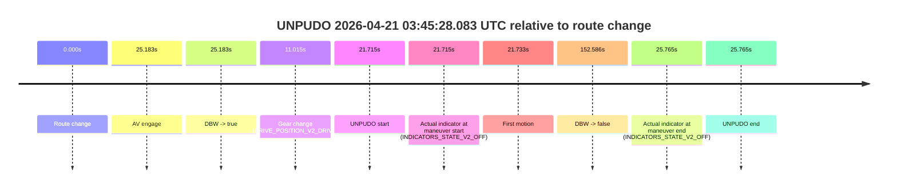
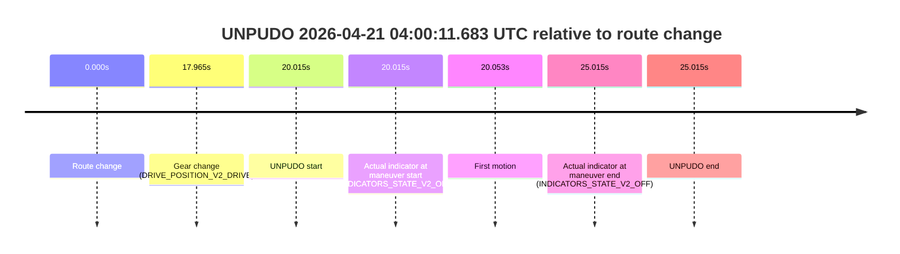

# Run Report: fme10010/2026-04-21--03-12-50--gen2-av-0642139c-72f1-4e7f-b41b-b3132d102280

| Field | Value |
|---|---|
| Run ID | `fme10010/2026-04-21--03-12-50--gen2-av-0642139c-72f1-4e7f-b41b-b3132d102280` |
| Date | `2026-04-21` |
| Model(s) | `blue-panther-solid` |
| Author | `guy.geva` |
| Event count | `4` |

## unpudo 2026-04-21 03:45:28.083 UTC

| Field | Value |
|---|---|
| Model | `blue-panther-solid` |
| Author | `guy.geva` |
| Run ID | `fme10010/2026-04-21--03-12-50--gen2-av-0642139c-72f1-4e7f-b41b-b3132d102280` |
| Date | `2026-04-21` |
| Time (UTC) | `03:45:28.083` |
| Event type | `unpudo` |
| Disengagement type | `failed_to_pudo` |
| Route change | `found` |
| Console | [run](https://console.sso.wayve.ai/run/fme10010/2026-04-21--03-12-50--gen2-av-0642139c-72f1-4e7f-b41b-b3132d102280?id=&time-unixus=1776743128083287) |
| Foxglove | [segment](https://app.foxglove.dev/wayve-on-prem/p/prj_0dX18KZdVHg1fmmI/view?ds=foxglove-stream&ds.deviceName=fme10010&ds.start=2026-04-21T03%3A44%3A56.368343Z&ds.end=2026-04-21T03%3A47%3A48.954000Z&layoutId=lay_0e7VD4WIKDQGU73Y&time=2026-04-21T03%3A45%3A28.083287Z) |

### Event card: accidental

- Accidental: AV ownership is present for less than `2s`, so this is treated as an accidental brush with the maneuver rather than a meaningful model attempt.

| Event | Time (UTC) | Delta from route change |
|---|---:|---:|
| Route change | 2026-04-21 03:45:06.368 | `0.000s` |
| AV engage | 2026-04-21 03:45:31.551 | `25.183s` |
| DBW -> true | 2026-04-21 03:45:31.551 | `25.183s` |
| Gear change (DRIVE_POSITION_V2_DRIVE) | 2026-04-21 03:45:17.383 | `11.015s` |
| UNPUDO start | 2026-04-21 03:45:28.083 | `21.715s` |
| Actual indicator at maneuver start (INDICATORS_STATE_V2_OFF) | 2026-04-21 03:45:28.083 | `21.715s` |
| First motion | 2026-04-21 03:45:28.101 | `21.733s` |
| DBW -> false | 2026-04-21 03:47:38.954 | `152.586s` |
| Actual indicator at maneuver end (INDICATORS_STATE_V2_OFF) | 2026-04-21 03:45:32.133 | `25.765s` |
| UNPUDO end | 2026-04-21 03:45:32.133 | `25.765s` |

| Metric | Value |
|---|---|
| Outcome | `accidental` |
| Effective failure type | `none` |
| Route change status | `found` |
| DBW at event start | `false` |
| DBW at event end | `true` |
| Predicted gear at AV start | `DRIVE_POSITION_V2_DRIVE` |
| Actual gear at AV start | `DRIVE_POSITION_V2_DRIVE` |
| Predicted gear at event start | `DRIVE_POSITION_V2_DRIVE` |
| Actual gear at event start | `DRIVE_POSITION_V2_DRIVE` |
| Planned indicator direction | `INDICATORS_STATE_V2_OFF` |
| Controller indicator direction | `INDICATORS_STATE_V2_OFF` |
| Actual indicator direction | `INDICATORS_STATE_V2_OFF` |
| Actual indicator at maneuver end | `INDICATORS_STATE_V2_OFF` |
| Driver accel help in AV | `false` |
| Driver accel help timestamp | `n/a` |
| Max accel pedal pct in AV | `0.0%` |
| Max brake pedal pct in AV | `0.0%` |
| Max speed mps in AV | `3.747` |
| Route -> AV | `25.183s` |
| AV -> event start | `-3.468s` |
| AV -> first motion | `-3.450s` |
| AV duration before disengagement | `127.403s` |
| Trajectory waypoint count | `37` |
| Driving-plan step count | `11` |

The scored portion starts from the AV-owned window, not from the pre-AV setup. Route-change search in the stopped pre-event segment was `found`, with the baseline therefore set to route change. At the event anchor the model predicts `DRIVE_POSITION_V2_DRIVE` and the actual gear is `DRIVE_POSITION_V2_DRIVE`. The effective model outcome is `accidental` because `the AV-owned portion is shorter than 2s`.

### Resolution

| Field | Value |
|---|---|
| Final outcome | `accidental` |
| Do we agree with this label? | `yes` |
| Source disengagement type | `failed_to_pudo` |
| Resolved effective failure type | `none` |
| Confidence | `high` |

## unpudo 2026-04-21 03:55:05.483 UTC

| Field | Value |
|---|---|
| Model | `blue-panther-solid` |
| Author | `guy.geva` |
| Run ID | `fme10010/2026-04-21--03-12-50--gen2-av-0642139c-72f1-4e7f-b41b-b3132d102280` |
| Date | `2026-04-21` |
| Time (UTC) | `03:55:05.483` |
| Event type | `unpudo` |
| Disengagement type | `failed_to_unpudo` |
| Route change | `found` |
| Console | [run](https://console.sso.wayve.ai/run/fme10010/2026-04-21--03-12-50--gen2-av-0642139c-72f1-4e7f-b41b-b3132d102280?id=&time-unixus=1776743705483318) |
| Foxglove | [segment](https://app.foxglove.dev/wayve-on-prem/p/prj_0dX18KZdVHg1fmmI/view?ds=foxglove-stream&ds.deviceName=fme10010&ds.start=2026-04-21T03%3A54%3A27.668273Z&ds.end=2026-04-21T03%3A58%3A28.091659Z&layoutId=lay_0e7VD4WIKDQGU73Y&time=2026-04-21T03%3A55%3A05.483318Z) |

### Event card: accidental

- Accidental: AV ownership is present for less than `2s`, so this is treated as an accidental brush with the maneuver rather than a meaningful model attempt.

| Event | Time (UTC) | Delta from route change |
|---|---:|---:|
| Route change | 2026-04-21 03:54:37.668 | `0.000s` |
| AV engage | 2026-04-21 03:55:14.712 | `37.044s` |
| DBW -> true | 2026-04-21 03:55:14.712 | `37.044s` |
| Gear change (DRIVE_POSITION_V2_DRIVE) | 2026-04-21 03:54:57.983 | `20.315s` |
| UNPUDO start | 2026-04-21 03:55:05.483 | `27.815s` |
| Actual indicator at maneuver start (INDICATORS_STATE_V2_LEFT_ON) | 2026-04-21 03:55:05.483 | `27.815s` |
| First motion | 2026-04-21 03:55:05.501 | `27.833s` |
| DBW -> false | 2026-04-21 03:58:18.091 | `220.423s` |
| Actual indicator at maneuver end (INDICATORS_STATE_V2_OFF) | 2026-04-21 03:55:09.833 | `32.165s` |
| UNPUDO end | 2026-04-21 03:55:09.833 | `32.165s` |

| Metric | Value |
|---|---|
| Outcome | `accidental` |
| Effective failure type | `none` |
| Route change status | `found` |
| DBW at event start | `false` |
| DBW at event end | `false` |
| Predicted gear at AV start | `DRIVE_POSITION_V2_DRIVE` |
| Actual gear at AV start | `DRIVE_POSITION_V2_DRIVE` |
| Predicted gear at event start | `DRIVE_POSITION_V2_DRIVE` |
| Actual gear at event start | `DRIVE_POSITION_V2_DRIVE` |
| Planned indicator direction | `INDICATORS_STATE_V2_RIGHT_ON` |
| Controller indicator direction | `INDICATORS_STATE_V2_RIGHT_ON` |
| Actual indicator direction | `INDICATORS_STATE_V2_LEFT_ON` |
| Actual indicator at maneuver end | `INDICATORS_STATE_V2_OFF` |
| Driver accel help in AV | `false` |
| Driver accel help timestamp | `n/a` |
| Max accel pedal pct in AV | `0.0%` |
| Max brake pedal pct in AV | `0.0%` |
| Max speed mps in AV | `0.000` |
| Route -> AV | `37.044s` |
| AV -> event start | `-9.229s` |
| AV -> first motion | `-9.211s` |
| AV duration before disengagement | `183.379s` |
| Trajectory waypoint count | `37` |
| Driving-plan step count | `11` |

The scored portion starts from the AV-owned window, not from the pre-AV setup. Route-change search in the stopped pre-event segment was `found`, with the baseline therefore set to route change. At the event anchor the model predicts `DRIVE_POSITION_V2_DRIVE` and the actual gear is `DRIVE_POSITION_V2_DRIVE`. The effective model outcome is `accidental` because `the AV-owned portion is shorter than 2s`.

### Resolution

| Field | Value |
|---|---|
| Final outcome | `accidental` |
| Do we agree with this label? | `yes` |
| Source disengagement type | `failed_to_unpudo` |
| Resolved effective failure type | `none` |
| Confidence | `high` |

## unpudo 2026-04-21 03:58:23.583 UTC

| Field | Value |
|---|---|
| Model | `blue-panther-solid` |
| Author | `guy.geva` |
| Run ID | `fme10010/2026-04-21--03-12-50--gen2-av-0642139c-72f1-4e7f-b41b-b3132d102280` |
| Date | `2026-04-21` |
| Time (UTC) | `03:58:23.583` |
| Event type | `unpudo` |
| Disengagement type | `failed_to_unpudo` |
| Route change | `found` |
| Console | [run](https://console.sso.wayve.ai/run/fme10010/2026-04-21--03-12-50--gen2-av-0642139c-72f1-4e7f-b41b-b3132d102280?id=&time-unixus=1776743903583312) |
| Foxglove | [segment](https://app.foxglove.dev/wayve-on-prem/p/prj_0dX18KZdVHg1fmmI/view?ds=foxglove-stream&ds.deviceName=fme10010&ds.start=2026-04-21T03%3A57%3A43.318246Z&ds.end=2026-04-21T03%3A59%3A43.171549Z&layoutId=lay_0e7VD4WIKDQGU73Y&time=2026-04-21T03%3A58%3A23.583312Z) |

### Event card: accidental

- Accidental: AV ownership is present for less than `2s`, so this is treated as an accidental brush with the maneuver rather than a meaningful model attempt.

| Event | Time (UTC) | Delta from route change |
|---|---:|---:|
| Route change | 2026-04-21 03:57:53.318 | `0.000s` |
| AV engage | 2026-04-21 03:58:33.751 | `40.433s` |
| DBW -> true | 2026-04-21 03:58:33.751 | `40.433s` |
| Gear change (DRIVE_POSITION_V2_REVERSE) | 2026-04-21 03:57:53.633 | `0.315s` |
| UNPUDO start | 2026-04-21 03:58:23.583 | `30.265s` |
| Actual indicator at maneuver start (INDICATORS_STATE_V2_OFF) | 2026-04-21 03:58:23.583 | `30.265s` |
| First motion | 2026-04-21 03:58:26.381 | `33.063s` |
| DBW -> false | 2026-04-21 03:59:33.171 | `99.853s` |
| Actual indicator at maneuver end (INDICATORS_STATE_V2_OFF) | 2026-04-21 03:58:31.383 | `38.065s` |
| UNPUDO end | 2026-04-21 03:58:31.383 | `38.065s` |

| Metric | Value |
|---|---|
| Outcome | `accidental` |
| Effective failure type | `none` |
| Route change status | `found` |
| DBW at event start | `false` |
| DBW at event end | `false` |
| Predicted gear at AV start | `DRIVE_POSITION_V2_DRIVE` |
| Actual gear at AV start | `DRIVE_POSITION_V2_DRIVE` |
| Predicted gear at event start | `DRIVE_POSITION_V2_REVERSE` |
| Actual gear at event start | `DRIVE_POSITION_V2_REVERSE` |
| Planned indicator direction | `INDICATORS_STATE_V2_LEFT_ON` |
| Controller indicator direction | `INDICATORS_STATE_V2_LEFT_ON` |
| Actual indicator direction | `INDICATORS_STATE_V2_OFF` |
| Actual indicator at maneuver end | `INDICATORS_STATE_V2_OFF` |
| Driver accel help in AV | `false` |
| Driver accel help timestamp | `n/a` |
| Max accel pedal pct in AV | `0.0%` |
| Max brake pedal pct in AV | `0.0%` |
| Max speed mps in AV | `0.000` |
| Route -> AV | `40.433s` |
| AV -> event start | `-10.168s` |
| AV -> first motion | `-7.370s` |
| AV duration before disengagement | `59.420s` |
| Trajectory waypoint count | `37` |
| Driving-plan step count | `11` |

The scored portion starts from the AV-owned window, not from the pre-AV setup. Route-change search in the stopped pre-event segment was `found`, with the baseline therefore set to route change. At the event anchor the model predicts `DRIVE_POSITION_V2_REVERSE` and the actual gear is `DRIVE_POSITION_V2_REVERSE`. The effective model outcome is `accidental` because `the AV-owned portion is shorter than 2s`.

### Resolution

| Field | Value |
|---|---|
| Final outcome | `accidental` |
| Do we agree with this label? | `yes` |
| Source disengagement type | `failed_to_unpudo` |
| Resolved effective failure type | `none` |
| Confidence | `high` |

## unpudo 2026-04-21 04:00:11.683 UTC

| Field | Value |
|---|---|
| Model | `blue-panther-solid` |
| Author | `guy.geva` |
| Run ID | `fme10010/2026-04-21--03-12-50--gen2-av-0642139c-72f1-4e7f-b41b-b3132d102280` |
| Date | `2026-04-21` |
| Time (UTC) | `04:00:11.683` |
| Event type | `unpudo` |
| Disengagement type | `none observed` |
| Route change | `found` |
| Console | [run](https://console.sso.wayve.ai/run/fme10010/2026-04-21--03-12-50--gen2-av-0642139c-72f1-4e7f-b41b-b3132d102280?id=&time-unixus=1776744011683305) |
| Foxglove | [segment](https://app.foxglove.dev/wayve-on-prem/p/prj_0dX18KZdVHg1fmmI/view?ds=foxglove-stream&ds.deviceName=fme10010&ds.start=2026-04-21T03%3A59%3A41.668339Z&ds.end=2026-04-21T04%3A00%3A26.683307Z&layoutId=lay_0e7VD4WIKDQGU73Y&time=2026-04-21T04%3A00%3A11.683305Z) |

### Event card: non-av

- Non-AV: the detected unpudo starts outside AV ownership, so it is kept for coverage but excluded from model success / failure scoring.

| Event | Time (UTC) | Delta from route change |
|---|---:|---:|
| Route change | 2026-04-21 03:59:51.668 | `0.000s` |
| Gear change (DRIVE_POSITION_V2_DRIVE) | 2026-04-21 04:00:09.633 | `17.965s` |
| UNPUDO start | 2026-04-21 04:00:11.683 | `20.015s` |
| Actual indicator at maneuver start (INDICATORS_STATE_V2_OFF) | 2026-04-21 04:00:11.683 | `20.015s` |
| First motion | 2026-04-21 04:00:11.721 | `20.053s` |
| Actual indicator at maneuver end (INDICATORS_STATE_V2_OFF) | 2026-04-21 04:00:16.683 | `25.015s` |
| UNPUDO end | 2026-04-21 04:00:16.683 | `25.015s` |

| Metric | Value |
|---|---|
| Outcome | `non-av` |
| Effective failure type | `none` |
| Route change status | `found` |
| DBW at event start | `false` |
| DBW at event end | `false` |
| Predicted gear at AV start | `n/a` |
| Actual gear at AV start | `n/a` |
| Predicted gear at event start | `DRIVE_POSITION_V2_DRIVE` |
| Actual gear at event start | `DRIVE_POSITION_V2_DRIVE` |
| Planned indicator direction | `INDICATORS_STATE_V2_LEFT_ON` |
| Controller indicator direction | `INDICATORS_STATE_V2_LEFT_ON` |
| Actual indicator direction | `INDICATORS_STATE_V2_OFF` |
| Actual indicator at maneuver end | `INDICATORS_STATE_V2_OFF` |
| Driver accel help in AV | `false` |
| Driver accel help timestamp | `n/a` |
| Max accel pedal pct in AV | `0.0%` |
| Max brake pedal pct in AV | `0.0%` |
| Max speed mps in AV | `0.000` |
| Route -> AV | `n/a` |
| AV -> event start | `n/a` |
| AV -> first motion | `n/a` |
| AV duration before disengagement | `n/a` |
| Trajectory waypoint count | `37` |
| Driving-plan step count | `11` |

The scored portion starts from the AV-owned window, not from the pre-AV setup. Route-change search in the stopped pre-event segment was `found`, with the baseline therefore set to route change. At the event anchor the model predicts `DRIVE_POSITION_V2_DRIVE` and the actual gear is `DRIVE_POSITION_V2_DRIVE`. The effective model outcome is `non-av` because `the event does not begin in AV ownership`.

### Resolution

| Field | Value |
|---|---|
| Final outcome | `non-av` |
| Do we agree with this label? | `yes` |
| Source disengagement type | `none observed` |
| Resolved effective failure type | `none` |
| Confidence | `high` |
