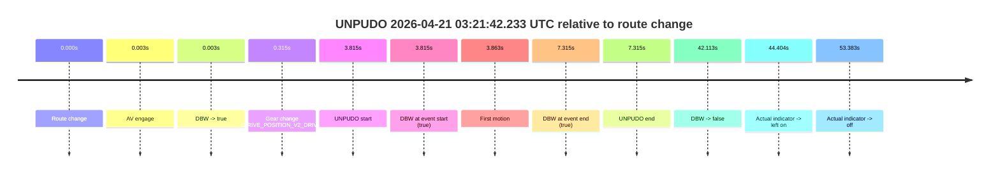
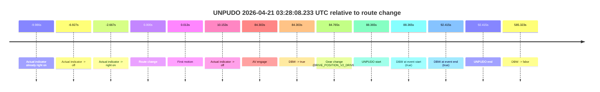
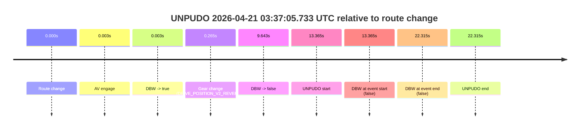
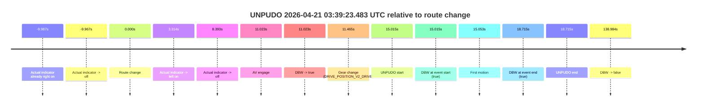
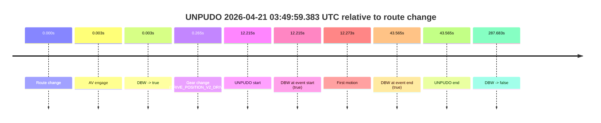
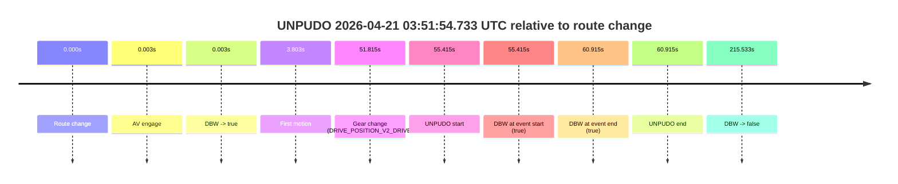

# Run Report: fme10010/2026-04-21--03-12-50--gen2-av-0642139c-72f1-4e7f-b41b-b3132d102280

| Field | Value |
|---|---|
| Run ID | `fme10010/2026-04-21--03-12-50--gen2-av-0642139c-72f1-4e7f-b41b-b3132d102280` |
| Date | `2026-04-21` |
| Model(s) | `eel-teal-outspoken` |
| Author | `zak` |
| Event count | `8` |

## unpudo 2026-04-21 03:21:42.233 UTC

| Field | Value |
|---|---|
| Model | `eel-teal-outspoken` |
| Author | `zak` |
| Run ID | `fme10010/2026-04-21--03-12-50--gen2-av-0642139c-72f1-4e7f-b41b-b3132d102280` |
| Date | `2026-04-21` |
| Time (UTC) | `03:21:42.233` |
| Event type | `unpudo` |
| Disengagement type | `none observed` |
| Route change | `found` |
| Console | [run](https://console.sso.wayve.ai/run/fme10010/2026-04-21--03-12-50--gen2-av-0642139c-72f1-4e7f-b41b-b3132d102280?id=&time-unixus=1776741702233317) |
| Foxglove | [segment](https://app.foxglove.dev/wayve-on-prem/p/prj_0dX18KZdVHg1fmmI/view?ds=foxglove-stream&ds.deviceName=fme10010&ds.start=2026-04-21T03%3A21%3A28.418275Z&ds.end=2026-04-21T03%3A22%3A30.531477Z&layoutId=lay_0e7VD4WIKDQGU73Y&time=2026-04-21T03%3A21%3A42.233317Z) |

### Event card: pass

- Pass: AV owns the credited unpudo from route change through the official unpudo window, the gear state is aligned at the anchor, and the vehicle moves without driver accelerator help in AV.

| Event | Time (UTC) | Delta from route change |
|---|---:|---:|
| Route change | 2026-04-21 03:21:38.418 | `0.000s` |
| AV engage | 2026-04-21 03:21:38.421 | `0.003s` |
| DBW -> true | 2026-04-21 03:21:38.421 | `0.003s` |
| Gear change (DRIVE_POSITION_V2_DRIVE) | 2026-04-21 03:21:38.733 | `0.315s` |
| UNPUDO start | 2026-04-21 03:21:42.233 | `3.815s` |
| DBW at event start (true) | 2026-04-21 03:21:42.233 | `3.815s` |
| First motion | 2026-04-21 03:21:42.281 | `3.863s` |
| DBW at event end (true) | 2026-04-21 03:21:45.733 | `7.315s` |
| UNPUDO end | 2026-04-21 03:21:45.733 | `7.315s` |
| DBW -> false | 2026-04-21 03:22:20.531 | `42.113s` |
| Actual indicator -> left on | 2026-04-21 03:22:22.821 | `44.404s` |
| Actual indicator -> off | 2026-04-21 03:22:31.801 | `53.383s` |

| Metric | Value |
|---|---|
| Outcome | `pass` |
| Effective failure type | `none` |
| Route change status | `found` |
| DBW at event start | `true` |
| DBW at event end | `true` |
| Predicted gear at AV start | `DRIVE_POSITION_V2_PARK` |
| Actual gear at AV start | `DRIVE_POSITION_V2_PARK` |
| Predicted gear at event start | `DRIVE_POSITION_V2_DRIVE` |
| Actual gear at event start | `DRIVE_POSITION_V2_DRIVE` |
| Planned indicator direction | `INDICATORS_STATE_V2_LEFT_ON` |
| Controller indicator direction | `INDICATORS_STATE_V2_LEFT_ON` |
| Actual indicator direction | `INDICATORS_STATE_V2_OFF` |
| Actual indicator at maneuver end | `INDICATORS_STATE_V2_OFF` |
| Driver accel help in AV | `false` |
| Driver accel help timestamp | `n/a` |
| Max accel pedal pct in AV | `0.0%` |
| Max brake pedal pct in AV | `8.0%` |
| Max speed mps in AV | `5.089` |
| Success timing baseline | `route change` |
| Route -> AV | `0.003s` |
| AV -> event start | `3.812s` |
| AV -> first motion | `3.860s` |
| Success baseline -> event start | `3.815s` |
| Success baseline -> first motion | `3.863s` |
| AV duration before disengagement | `42.110s` |
| Trajectory waypoint count | `38` |
| Driving-plan step count | `11` |

The scored portion starts from the AV-owned window, not from the pre-AV setup. Route-change search in the stopped pre-event segment was `found`, with the baseline therefore set to route change. At the event anchor the model predicts `DRIVE_POSITION_V2_DRIVE` and the actual gear is `DRIVE_POSITION_V2_DRIVE`. The effective model outcome is `pass` because `the credited unpudo stays AV-owned through the official unpudo window.`

### Resolution

| Field | Value |
|---|---|
| Final outcome | `pass` |
| Do we agree with this label? | `yes` |
| Source disengagement type | `none observed` |
| Resolved effective failure type | `none` |
| Confidence | `high` |

## unpudo 2026-04-21 03:28:08.233 UTC

| Field | Value |
|---|---|
| Model | `eel-teal-outspoken` |
| Author | `zak` |
| Run ID | `fme10010/2026-04-21--03-12-50--gen2-av-0642139c-72f1-4e7f-b41b-b3132d102280` |
| Date | `2026-04-21` |
| Time (UTC) | `03:28:08.233` |
| Event type | `unpudo` |
| Disengagement type | `none observed` |
| Route change | `found` |
| Console | [run](https://console.sso.wayve.ai/run/fme10010/2026-04-21--03-12-50--gen2-av-0642139c-72f1-4e7f-b41b-b3132d102280?id=&time-unixus=1776742088233293) |
| Foxglove | [segment](https://app.foxglove.dev/wayve-on-prem/p/prj_0dX18KZdVHg1fmmI/view?ds=foxglove-stream&ds.deviceName=fme10010&ds.start=2026-04-21T03%3A26%3A29.868329Z&ds.end=2026-04-21T03%3A36%3A35.190913Z&layoutId=lay_0e7VD4WIKDQGU73Y&time=2026-04-21T03%3A28%3A08.233293Z) |

### Event card: pass

- Pass: AV owns the credited unpudo from route change through the official unpudo window, the gear state is aligned at the anchor, and the vehicle moves without driver accelerator help in AV.

| Event | Time (UTC) | Delta from route change |
|---|---:|---:|
| Actual indicator already right on | 2026-04-21 03:26:29.882 | `-9.986s` |
| Actual indicator -> off | 2026-04-21 03:26:32.941 | `-6.927s` |
| Actual indicator -> right on | 2026-04-21 03:26:37.201 | `-2.667s` |
| Route change | 2026-04-21 03:26:39.868 | `0.000s` |
| First motion | 2026-04-21 03:26:39.881 | `0.013s` |
| Actual indicator -> off | 2026-04-21 03:26:50.021 | `10.153s` |
| AV engage | 2026-04-21 03:28:04.171 | `84.303s` |
| DBW -> true | 2026-04-21 03:28:04.171 | `84.303s` |
| Gear change (DRIVE_POSITION_V2_DRIVE) | 2026-04-21 03:28:04.633 | `84.765s` |
| UNPUDO start | 2026-04-21 03:28:08.233 | `88.365s` |
| DBW at event start (true) | 2026-04-21 03:28:08.233 | `88.365s` |
| DBW at event end (true) | 2026-04-21 03:28:12.283 | `92.415s` |
| UNPUDO end | 2026-04-21 03:28:12.283 | `92.415s` |
| DBW -> false | 2026-04-21 03:36:25.190 | `585.323s` |

| Metric | Value |
|---|---|
| Outcome | `pass` |
| Effective failure type | `none` |
| Route change status | `found` |
| DBW at event start | `true` |
| DBW at event end | `true` |
| Predicted gear at AV start | `DRIVE_POSITION_V2_DRIVE` |
| Actual gear at AV start | `DRIVE_POSITION_V2_PARK` |
| Predicted gear at event start | `DRIVE_POSITION_V2_DRIVE` |
| Actual gear at event start | `DRIVE_POSITION_V2_DRIVE` |
| Planned indicator direction | `INDICATORS_STATE_V2_LEFT_ON` |
| Controller indicator direction | `INDICATORS_STATE_V2_LEFT_ON` |
| Actual indicator direction | `INDICATORS_STATE_V2_OFF` |
| Actual indicator at maneuver end | `INDICATORS_STATE_V2_OFF` |
| Driver accel help in AV | `false` |
| Driver accel help timestamp | `n/a` |
| Max accel pedal pct in AV | `0.0%` |
| Max brake pedal pct in AV | `8.0%` |
| Max speed mps in AV | `4.328` |
| Success timing baseline | `route change` |
| Route -> AV | `84.303s` |
| AV -> event start | `4.062s` |
| AV -> first motion | `-84.291s` |
| Success baseline -> event start | `88.365s` |
| Success baseline -> first motion | `0.013s` |
| AV duration before disengagement | `501.019s` |
| Trajectory waypoint count | `38` |
| Driving-plan step count | `11` |

The scored portion starts from the AV-owned window, not from the pre-AV setup. Route-change search in the stopped pre-event segment was `found`, with the baseline therefore set to route change. At the event anchor the model predicts `DRIVE_POSITION_V2_DRIVE` and the actual gear is `DRIVE_POSITION_V2_DRIVE`. The effective model outcome is `pass` because `the credited unpudo stays AV-owned through the official unpudo window.`

### Resolution

| Field | Value |
|---|---|
| Final outcome | `pass` |
| Do we agree with this label? | `yes` |
| Source disengagement type | `none observed` |
| Resolved effective failure type | `none` |
| Confidence | `high` |

## unpudo 2026-04-21 03:34:17.033 UTC

| Field | Value |
|---|---|
| Model | `eel-teal-outspoken` |
| Author | `zak` |
| Run ID | `fme10010/2026-04-21--03-12-50--gen2-av-0642139c-72f1-4e7f-b41b-b3132d102280` |
| Date | `2026-04-21` |
| Time (UTC) | `03:34:17.033` |
| Event type | `unpudo` |
| Disengagement type | `none observed` |
| Route change | `found` |
| Console | [run](https://console.sso.wayve.ai/run/fme10010/2026-04-21--03-12-50--gen2-av-0642139c-72f1-4e7f-b41b-b3132d102280?id=&time-unixus=1776742457033308) |
| Foxglove | [segment](https://app.foxglove.dev/wayve-on-prem/p/prj_0dX18KZdVHg1fmmI/view?ds=foxglove-stream&ds.deviceName=fme10010&ds.start=2026-04-21T03%3A33%3A57.268268Z&ds.end=2026-04-21T03%3A36%3A35.190913Z&layoutId=lay_0e7VD4WIKDQGU73Y&time=2026-04-21T03%3A34%3A17.033308Z) |

### Event card: pass

- Pass: AV owns the credited unpudo from route change through the official unpudo window, the gear state is aligned at the anchor, and the vehicle moves without driver accelerator help in AV.

| Event | Time (UTC) | Delta from route change |
|---|---:|---:|
| Route change | 2026-04-21 03:34:07.268 | `0.000s` |
| AV engage | 2026-04-21 03:34:07.270 | `0.003s` |
| DBW -> true | 2026-04-21 03:34:07.270 | `0.003s` |
| Gear change (DRIVE_POSITION_V2_DRIVE) | 2026-04-21 03:34:07.533 | `0.265s` |
| UNPUDO start | 2026-04-21 03:34:17.033 | `9.765s` |
| DBW at event start (true) | 2026-04-21 03:34:17.033 | `9.765s` |
| First motion | 2026-04-21 03:34:17.081 | `9.813s` |
| DBW at event end (true) | 2026-04-21 03:34:21.133 | `13.865s` |
| UNPUDO end | 2026-04-21 03:34:21.133 | `13.865s` |
| DBW -> false | 2026-04-21 03:36:25.190 | `137.923s` |

| Metric | Value |
|---|---|
| Outcome | `pass` |
| Effective failure type | `none` |
| Route change status | `found` |
| DBW at event start | `true` |
| DBW at event end | `true` |
| Predicted gear at AV start | `DRIVE_POSITION_V2_PARK` |
| Actual gear at AV start | `DRIVE_POSITION_V2_PARK` |
| Predicted gear at event start | `DRIVE_POSITION_V2_DRIVE` |
| Actual gear at event start | `DRIVE_POSITION_V2_DRIVE` |
| Planned indicator direction | `INDICATORS_STATE_V2_LEFT_ON` |
| Controller indicator direction | `INDICATORS_STATE_V2_LEFT_ON` |
| Actual indicator direction | `INDICATORS_STATE_V2_OFF` |
| Actual indicator at maneuver end | `INDICATORS_STATE_V2_OFF` |
| Driver accel help in AV | `false` |
| Driver accel help timestamp | `n/a` |
| Max accel pedal pct in AV | `0.0%` |
| Max brake pedal pct in AV | `8.0%` |
| Max speed mps in AV | `4.450` |
| Success timing baseline | `route change` |
| Route -> AV | `0.003s` |
| AV -> event start | `9.762s` |
| AV -> first motion | `9.810s` |
| Success baseline -> event start | `9.765s` |
| Success baseline -> first motion | `9.813s` |
| AV duration before disengagement | `137.920s` |
| Trajectory waypoint count | `38` |
| Driving-plan step count | `11` |

The scored portion starts from the AV-owned window, not from the pre-AV setup. Route-change search in the stopped pre-event segment was `found`, with the baseline therefore set to route change. At the event anchor the model predicts `DRIVE_POSITION_V2_DRIVE` and the actual gear is `DRIVE_POSITION_V2_DRIVE`. The effective model outcome is `pass` because `the credited unpudo stays AV-owned through the official unpudo window.`

### Resolution

| Field | Value |
|---|---|
| Final outcome | `pass` |
| Do we agree with this label? | `yes` |
| Source disengagement type | `none observed` |
| Resolved effective failure type | `none` |
| Confidence | `high` |

## unpudo 2026-04-21 03:37:05.733 UTC

| Field | Value |
|---|---|
| Model | `eel-teal-outspoken` |
| Author | `zak` |
| Run ID | `fme10010/2026-04-21--03-12-50--gen2-av-0642139c-72f1-4e7f-b41b-b3132d102280` |
| Date | `2026-04-21` |
| Time (UTC) | `03:37:05.733` |
| Event type | `unpudo` |
| Disengagement type | `failed_to_unpudo` |
| Route change | `found` |
| Console | [run](https://console.sso.wayve.ai/run/fme10010/2026-04-21--03-12-50--gen2-av-0642139c-72f1-4e7f-b41b-b3132d102280?id=&time-unixus=1776742625733301) |
| Foxglove | [segment](https://app.foxglove.dev/wayve-on-prem/p/prj_0dX18KZdVHg1fmmI/view?ds=foxglove-stream&ds.deviceName=fme10010&ds.start=2026-04-21T03%3A36%3A42.368253Z&ds.end=2026-04-21T03%3A37%3A24.683319Z&layoutId=lay_0e7VD4WIKDQGU73Y&time=2026-04-21T03%3A37%3A05.733301Z) |

### Event card: fail

- Fail: AV owns part of the segment, but the event still resolves as a model-performance failure under the AV-only scoring rule.

| Event | Time (UTC) | Delta from route change |
|---|---:|---:|
| Route change | 2026-04-21 03:36:52.368 | `0.000s` |
| AV engage | 2026-04-21 03:36:52.371 | `0.003s` |
| DBW -> true | 2026-04-21 03:36:52.371 | `0.003s` |
| Gear change (DRIVE_POSITION_V2_REVERSE) | 2026-04-21 03:36:52.633 | `0.265s` |
| DBW -> false | 2026-04-21 03:37:02.011 | `9.643s` |
| UNPUDO start | 2026-04-21 03:37:05.733 | `13.365s` |
| DBW at event start (false) | 2026-04-21 03:37:05.733 | `13.365s` |
| DBW at event end (false) | 2026-04-21 03:37:14.683 | `22.315s` |
| UNPUDO end | 2026-04-21 03:37:14.683 | `22.315s` |

| Metric | Value |
|---|---|
| Outcome | `fail` |
| Effective failure type | `failed_to_unpudo` |
| Route change status | `found` |
| DBW at event start | `false` |
| DBW at event end | `false` |
| Predicted gear at AV start | `DRIVE_POSITION_V2_PARK` |
| Actual gear at AV start | `DRIVE_POSITION_V2_PARK` |
| Predicted gear at event start | `DRIVE_POSITION_V2_REVERSE` |
| Actual gear at event start | `DRIVE_POSITION_V2_REVERSE` |
| Planned indicator direction | `INDICATORS_STATE_V2_LEFT_ON` |
| Controller indicator direction | `INDICATORS_STATE_V2_LEFT_ON` |
| Actual indicator direction | `INDICATORS_STATE_V2_OFF` |
| Actual indicator at maneuver end | `INDICATORS_STATE_V2_OFF` |
| Driver accel help in AV | `false` |
| Driver accel help timestamp | `n/a` |
| Max accel pedal pct in AV | `0.0%` |
| Max brake pedal pct in AV | `8.0%` |
| Max speed mps in AV | `0.000` |
| Success timing baseline | `route change` |
| Route -> AV | `0.003s` |
| AV -> event start | `13.362s` |
| AV -> first motion | `n/a` |
| Success baseline -> event start | `13.365s` |
| Success baseline -> first motion | `n/a` |
| AV duration before disengagement | `9.640s` |
| Trajectory waypoint count | `38` |
| Driving-plan step count | `11` |

The scored portion starts from the AV-owned window, not from the pre-AV setup. Route-change search in the stopped pre-event segment was `found`, with the baseline therefore set to route change. At the event anchor the model predicts `DRIVE_POSITION_V2_REVERSE` and the actual gear is `DRIVE_POSITION_V2_REVERSE`. The effective model outcome is `fail` because `failed_to_unpudo.`

### Resolution

| Field | Value |
|---|---|
| Final outcome | `fail` |
| Do we agree with this label? | `yes` |
| Source disengagement type | `failed_to_unpudo` |
| Resolved effective failure type | `failed_to_unpudo` |
| Confidence | `high` |

## unpudo 2026-04-21 03:39:23.483 UTC

| Field | Value |
|---|---|
| Model | `eel-teal-outspoken` |
| Author | `zak` |
| Run ID | `fme10010/2026-04-21--03-12-50--gen2-av-0642139c-72f1-4e7f-b41b-b3132d102280` |
| Date | `2026-04-21` |
| Time (UTC) | `03:39:23.483` |
| Event type | `unpudo` |
| Disengagement type | `none observed` |
| Route change | `found` |
| Console | [run](https://console.sso.wayve.ai/run/fme10010/2026-04-21--03-12-50--gen2-av-0642139c-72f1-4e7f-b41b-b3132d102280?id=&time-unixus=1776742763483308) |
| Foxglove | [segment](https://app.foxglove.dev/wayve-on-prem/p/prj_0dX18KZdVHg1fmmI/view?ds=foxglove-stream&ds.deviceName=fme10010&ds.start=2026-04-21T03%3A38%3A58.468283Z&ds.end=2026-04-21T03%3A41%3A37.452768Z&layoutId=lay_0e7VD4WIKDQGU73Y&time=2026-04-21T03%3A39%3A23.483308Z) |

### Event card: pass

- Pass: AV owns the credited unpudo from route change through the official unpudo window, the gear state is aligned at the anchor, and the vehicle moves without driver accelerator help in AV.

| Event | Time (UTC) | Delta from route change |
|---|---:|---:|
| Actual indicator already right on | 2026-04-21 03:38:58.481 | `-9.987s` |
| Actual indicator -> off | 2026-04-21 03:38:58.501 | `-9.967s` |
| Route change | 2026-04-21 03:39:08.468 | `0.000s` |
| Actual indicator -> left on | 2026-04-21 03:39:11.781 | `3.314s` |
| Actual indicator -> off | 2026-04-21 03:39:16.861 | `8.393s` |
| AV engage | 2026-04-21 03:39:19.491 | `11.023s` |
| DBW -> true | 2026-04-21 03:39:19.491 | `11.023s` |
| Gear change (DRIVE_POSITION_V2_DRIVE) | 2026-04-21 03:39:19.933 | `11.465s` |
| UNPUDO start | 2026-04-21 03:39:23.483 | `15.015s` |
| DBW at event start (true) | 2026-04-21 03:39:23.483 | `15.015s` |
| First motion | 2026-04-21 03:39:23.521 | `15.053s` |
| DBW at event end (true) | 2026-04-21 03:39:27.183 | `18.715s` |
| UNPUDO end | 2026-04-21 03:39:27.183 | `18.715s` |
| DBW -> false | 2026-04-21 03:41:27.452 | `138.984s` |

| Metric | Value |
|---|---|
| Outcome | `pass` |
| Effective failure type | `none` |
| Route change status | `found` |
| DBW at event start | `true` |
| DBW at event end | `true` |
| Predicted gear at AV start | `DRIVE_POSITION_V2_DRIVE` |
| Actual gear at AV start | `DRIVE_POSITION_V2_PARK` |
| Predicted gear at event start | `DRIVE_POSITION_V2_DRIVE` |
| Actual gear at event start | `DRIVE_POSITION_V2_DRIVE` |
| Planned indicator direction | `INDICATORS_STATE_V2_LEFT_ON` |
| Controller indicator direction | `INDICATORS_STATE_V2_LEFT_ON` |
| Actual indicator direction | `INDICATORS_STATE_V2_OFF` |
| Actual indicator at maneuver end | `INDICATORS_STATE_V2_OFF` |
| Driver accel help in AV | `false` |
| Driver accel help timestamp | `n/a` |
| Max accel pedal pct in AV | `0.0%` |
| Max brake pedal pct in AV | `8.4%` |
| Max speed mps in AV | `5.289` |
| Success timing baseline | `route change` |
| Route -> AV | `11.023s` |
| AV -> event start | `3.992s` |
| AV -> first motion | `4.030s` |
| Success baseline -> event start | `15.015s` |
| Success baseline -> first motion | `15.053s` |
| AV duration before disengagement | `127.961s` |
| Trajectory waypoint count | `37` |
| Driving-plan step count | `11` |

The scored portion starts from the AV-owned window, not from the pre-AV setup. Route-change search in the stopped pre-event segment was `found`, with the baseline therefore set to route change. At the event anchor the model predicts `DRIVE_POSITION_V2_DRIVE` and the actual gear is `DRIVE_POSITION_V2_DRIVE`. The effective model outcome is `pass` because `the credited unpudo stays AV-owned through the official unpudo window.`

### Resolution

| Field | Value |
|---|---|
| Final outcome | `pass` |
| Do we agree with this label? | `yes` |
| Source disengagement type | `none observed` |
| Resolved effective failure type | `none` |
| Confidence | `high` |

## unpudo 2026-04-21 03:49:59.383 UTC

| Field | Value |
|---|---|
| Model | `eel-teal-outspoken` |
| Author | `zak` |
| Run ID | `fme10010/2026-04-21--03-12-50--gen2-av-0642139c-72f1-4e7f-b41b-b3132d102280` |
| Date | `2026-04-21` |
| Time (UTC) | `03:49:59.383` |
| Event type | `unpudo` |
| Disengagement type | `none observed` |
| Route change | `found` |
| Console | [run](https://console.sso.wayve.ai/run/fme10010/2026-04-21--03-12-50--gen2-av-0642139c-72f1-4e7f-b41b-b3132d102280?id=&time-unixus=1776743399383304) |
| Foxglove | [segment](https://app.foxglove.dev/wayve-on-prem/p/prj_0dX18KZdVHg1fmmI/view?ds=foxglove-stream&ds.deviceName=fme10010&ds.start=2026-04-21T03%3A49%3A37.168243Z&ds.end=2026-04-21T03%3A54%3A44.851613Z&layoutId=lay_0e7VD4WIKDQGU73Y&time=2026-04-21T03%3A49%3A59.383304Z) |

### Event card: pass

- Pass: AV owns the credited unpudo from route change through the official unpudo window, the gear state is aligned at the anchor, and the vehicle moves without driver accelerator help in AV.

| Event | Time (UTC) | Delta from route change |
|---|---:|---:|
| Route change | 2026-04-21 03:49:47.168 | `0.000s` |
| AV engage | 2026-04-21 03:49:47.170 | `0.003s` |
| DBW -> true | 2026-04-21 03:49:47.170 | `0.003s` |
| Gear change (DRIVE_POSITION_V2_DRIVE) | 2026-04-21 03:49:47.433 | `0.265s` |
| UNPUDO start | 2026-04-21 03:49:59.383 | `12.215s` |
| DBW at event start (true) | 2026-04-21 03:49:59.383 | `12.215s` |
| First motion | 2026-04-21 03:49:59.441 | `12.273s` |
| DBW at event end (true) | 2026-04-21 03:50:30.733 | `43.565s` |
| UNPUDO end | 2026-04-21 03:50:30.733 | `43.565s` |
| DBW -> false | 2026-04-21 03:54:34.851 | `287.683s` |

| Metric | Value |
|---|---|
| Outcome | `pass` |
| Effective failure type | `none` |
| Route change status | `found` |
| DBW at event start | `true` |
| DBW at event end | `true` |
| Predicted gear at AV start | `DRIVE_POSITION_V2_PARK` |
| Actual gear at AV start | `DRIVE_POSITION_V2_PARK` |
| Predicted gear at event start | `DRIVE_POSITION_V2_DRIVE` |
| Actual gear at event start | `DRIVE_POSITION_V2_DRIVE` |
| Planned indicator direction | `INDICATORS_STATE_V2_LEFT_ON` |
| Controller indicator direction | `INDICATORS_STATE_V2_LEFT_ON` |
| Actual indicator direction | `INDICATORS_STATE_V2_OFF` |
| Actual indicator at maneuver end | `INDICATORS_STATE_V2_OFF` |
| Driver accel help in AV | `false` |
| Driver accel help timestamp | `n/a` |
| Max accel pedal pct in AV | `0.0%` |
| Max brake pedal pct in AV | `8.8%` |
| Max speed mps in AV | `2.264` |
| Success timing baseline | `route change` |
| Route -> AV | `0.003s` |
| AV -> event start | `12.212s` |
| AV -> first motion | `12.270s` |
| Success baseline -> event start | `12.215s` |
| Success baseline -> first motion | `12.273s` |
| AV duration before disengagement | `287.681s` |
| Trajectory waypoint count | `37` |
| Driving-plan step count | `11` |

The scored portion starts from the AV-owned window, not from the pre-AV setup. Route-change search in the stopped pre-event segment was `found`, with the baseline therefore set to route change. At the event anchor the model predicts `DRIVE_POSITION_V2_DRIVE` and the actual gear is `DRIVE_POSITION_V2_DRIVE`. The effective model outcome is `pass` because `the credited unpudo stays AV-owned through the official unpudo window.`

### Resolution

| Field | Value |
|---|---|
| Final outcome | `pass` |
| Do we agree with this label? | `yes` |
| Source disengagement type | `none observed` |
| Resolved effective failure type | `none` |
| Confidence | `high` |

## unpudo 2026-04-21 03:51:03.083 UTC

| Field | Value |
|---|---|
| Model | `eel-teal-outspoken` |
| Author | `zak` |
| Run ID | `fme10010/2026-04-21--03-12-50--gen2-av-0642139c-72f1-4e7f-b41b-b3132d102280` |
| Date | `2026-04-21` |
| Time (UTC) | `03:51:03.083` |
| Event type | `unpudo` |
| Disengagement type | `none observed` |
| Route change | `found` |
| Console | [run](https://console.sso.wayve.ai/run/fme10010/2026-04-21--03-12-50--gen2-av-0642139c-72f1-4e7f-b41b-b3132d102280?id=&time-unixus=1776743463083311) |
| Foxglove | [segment](https://app.foxglove.dev/wayve-on-prem/p/prj_0dX18KZdVHg1fmmI/view?ds=foxglove-stream&ds.deviceName=fme10010&ds.start=2026-04-21T03%3A49%3A37.168243Z&ds.end=2026-04-21T03%3A54%3A44.851613Z&layoutId=lay_0e7VD4WIKDQGU73Y&time=2026-04-21T03%3A51%3A03.083311Z) |

### Event card: pass

- Pass: AV owns the credited unpudo from route change through the official unpudo window, the gear state is aligned at the anchor, and the vehicle moves without driver accelerator help in AV.

| Event | Time (UTC) | Delta from route change |
|---|---:|---:|
| Route change | 2026-04-21 03:49:47.168 | `0.000s` |
| AV engage | 2026-04-21 03:49:47.170 | `0.003s` |
| DBW -> true | 2026-04-21 03:49:47.170 | `0.003s` |
| First motion | 2026-04-21 03:49:59.441 | `12.273s` |
| Gear change (DRIVE_POSITION_V2_DRIVE) | 2026-04-21 03:50:59.533 | `72.365s` |
| UNPUDO start | 2026-04-21 03:51:03.083 | `75.915s` |
| DBW at event start (true) | 2026-04-21 03:51:03.083 | `75.915s` |
| DBW at event end (true) | 2026-04-21 03:51:06.733 | `79.565s` |
| UNPUDO end | 2026-04-21 03:51:06.733 | `79.565s` |
| DBW -> false | 2026-04-21 03:54:34.851 | `287.683s` |

| Metric | Value |
|---|---|
| Outcome | `pass` |
| Effective failure type | `none` |
| Route change status | `found` |
| DBW at event start | `true` |
| DBW at event end | `true` |
| Predicted gear at AV start | `DRIVE_POSITION_V2_PARK` |
| Actual gear at AV start | `DRIVE_POSITION_V2_PARK` |
| Predicted gear at event start | `DRIVE_POSITION_V2_DRIVE` |
| Actual gear at event start | `DRIVE_POSITION_V2_DRIVE` |
| Planned indicator direction | `INDICATORS_STATE_V2_LEFT_ON` |
| Controller indicator direction | `INDICATORS_STATE_V2_LEFT_ON` |
| Actual indicator direction | `INDICATORS_STATE_V2_OFF` |
| Actual indicator at maneuver end | `INDICATORS_STATE_V2_OFF` |
| Driver accel help in AV | `false` |
| Driver accel help timestamp | `n/a` |
| Max accel pedal pct in AV | `0.0%` |
| Max brake pedal pct in AV | `14.0%` |
| Max speed mps in AV | `7.008` |
| Success timing baseline | `route change` |
| Route -> AV | `0.003s` |
| AV -> event start | `75.912s` |
| AV -> first motion | `12.270s` |
| Success baseline -> event start | `75.915s` |
| Success baseline -> first motion | `12.273s` |
| AV duration before disengagement | `287.681s` |
| Trajectory waypoint count | `37` |
| Driving-plan step count | `11` |

The scored portion starts from the AV-owned window, not from the pre-AV setup. Route-change search in the stopped pre-event segment was `found`, with the baseline therefore set to route change. At the event anchor the model predicts `DRIVE_POSITION_V2_DRIVE` and the actual gear is `DRIVE_POSITION_V2_DRIVE`. The effective model outcome is `pass` because `the credited unpudo stays AV-owned through the official unpudo window.`

### Resolution

| Field | Value |
|---|---|
| Final outcome | `pass` |
| Do we agree with this label? | `yes` |
| Source disengagement type | `none observed` |
| Resolved effective failure type | `none` |
| Confidence | `high` |

## unpudo 2026-04-21 03:51:54.733 UTC

| Field | Value |
|---|---|
| Model | `eel-teal-outspoken` |
| Author | `zak` |
| Run ID | `fme10010/2026-04-21--03-12-50--gen2-av-0642139c-72f1-4e7f-b41b-b3132d102280` |
| Date | `2026-04-21` |
| Time (UTC) | `03:51:54.733` |
| Event type | `unpudo` |
| Disengagement type | `none observed` |
| Route change | `found` |
| Console | [run](https://console.sso.wayve.ai/run/fme10010/2026-04-21--03-12-50--gen2-av-0642139c-72f1-4e7f-b41b-b3132d102280?id=&time-unixus=1776743514733318) |
| Foxglove | [segment](https://app.foxglove.dev/wayve-on-prem/p/prj_0dX18KZdVHg1fmmI/view?ds=foxglove-stream&ds.deviceName=fme10010&ds.start=2026-04-21T03%3A50%3A49.318246Z&ds.end=2026-04-21T03%3A54%3A44.851613Z&layoutId=lay_0e7VD4WIKDQGU73Y&time=2026-04-21T03%3A51%3A54.733318Z) |

### Event card: pass

- Pass: AV owns the credited unpudo from route change through the official unpudo window, the gear state is aligned at the anchor, and the vehicle moves without driver accelerator help in AV.

| Event | Time (UTC) | Delta from route change |
|---|---:|---:|
| Route change | 2026-04-21 03:50:59.318 | `0.000s` |
| AV engage | 2026-04-21 03:50:59.321 | `0.003s` |
| DBW -> true | 2026-04-21 03:50:59.321 | `0.003s` |
| First motion | 2026-04-21 03:51:03.121 | `3.803s` |
| Gear change (DRIVE_POSITION_V2_DRIVE) | 2026-04-21 03:51:51.133 | `51.815s` |
| UNPUDO start | 2026-04-21 03:51:54.733 | `55.415s` |
| DBW at event start (true) | 2026-04-21 03:51:54.733 | `55.415s` |
| DBW at event end (true) | 2026-04-21 03:52:00.233 | `60.915s` |
| UNPUDO end | 2026-04-21 03:52:00.233 | `60.915s` |
| DBW -> false | 2026-04-21 03:54:34.851 | `215.533s` |

| Metric | Value |
|---|---|
| Outcome | `pass` |
| Effective failure type | `none` |
| Route change status | `found` |
| DBW at event start | `true` |
| DBW at event end | `true` |
| Predicted gear at AV start | `DRIVE_POSITION_V2_PARK` |
| Actual gear at AV start | `DRIVE_POSITION_V2_NEUTRAL` |
| Predicted gear at event start | `DRIVE_POSITION_V2_DRIVE` |
| Actual gear at event start | `DRIVE_POSITION_V2_DRIVE` |
| Planned indicator direction | `INDICATORS_STATE_V2_LEFT_ON` |
| Controller indicator direction | `INDICATORS_STATE_V2_LEFT_ON` |
| Actual indicator direction | `INDICATORS_STATE_V2_OFF` |
| Actual indicator at maneuver end | `INDICATORS_STATE_V2_OFF` |
| Driver accel help in AV | `false` |
| Driver accel help timestamp | `n/a` |
| Max accel pedal pct in AV | `0.0%` |
| Max brake pedal pct in AV | `8.0%` |
| Max speed mps in AV | `10.219` |
| Success timing baseline | `route change` |
| Route -> AV | `0.003s` |
| AV -> event start | `55.412s` |
| AV -> first motion | `3.799s` |
| Success baseline -> event start | `55.415s` |
| Success baseline -> first motion | `3.803s` |
| AV duration before disengagement | `215.530s` |
| Trajectory waypoint count | `38` |
| Driving-plan step count | `11` |

The scored portion starts from the AV-owned window, not from the pre-AV setup. Route-change search in the stopped pre-event segment was `found`, with the baseline therefore set to route change. At the event anchor the model predicts `DRIVE_POSITION_V2_DRIVE` and the actual gear is `DRIVE_POSITION_V2_DRIVE`. The effective model outcome is `pass` because `the credited unpudo stays AV-owned through the official unpudo window.`

### Resolution

| Field | Value |
|---|---|
| Final outcome | `pass` |
| Do we agree with this label? | `yes` |
| Source disengagement type | `none observed` |
| Resolved effective failure type | `none` |
| Confidence | `high` |
