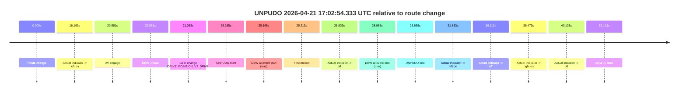
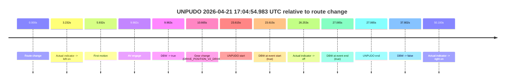
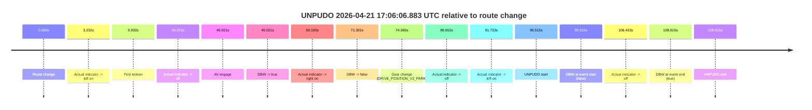
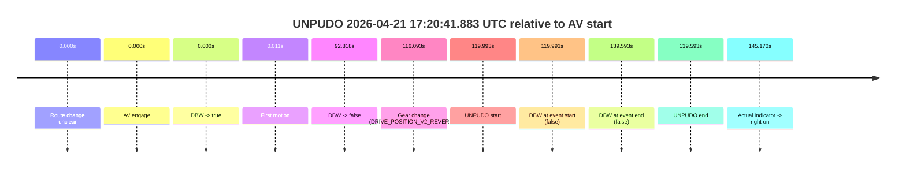
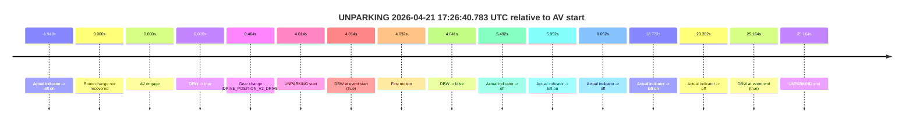
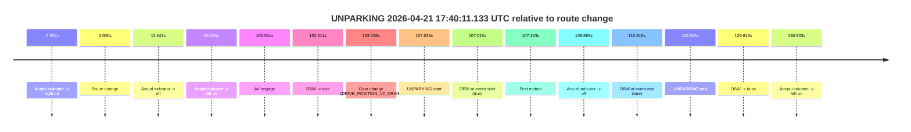

# Run Report: fme10010/2026-04-21--16-40-07--gen2-av-b4954402-a34d-418f-a6ab-e00c4dbd8e29

| Field | Value |
|---|---|
| Run ID | `fme10010/2026-04-21--16-40-07--gen2-av-b4954402-a34d-418f-a6ab-e00c4dbd8e29` |
| Date | `2026-04-21` |
| Model(s) | `eel-teal-outspoken` |
| Author | `zak` |
| Event count | `6` |

## unpudo 2026-04-21 17:02:54.333 UTC

| Field | Value |
|---|---|
| Model | `eel-teal-outspoken` |
| Author | `zak` |
| Run ID | `fme10010/2026-04-21--16-40-07--gen2-av-b4954402-a34d-418f-a6ab-e00c4dbd8e29` |
| Date | `2026-04-21` |
| Time (UTC) | `17:02:54.333` |
| Event type | `unpudo` |
| Disengagement type | `none observed` |
| Route change | `found` |
| Console | [run](https://console.sso.wayve.ai/run/fme10010/2026-04-21--16-40-07--gen2-av-b4954402-a34d-418f-a6ab-e00c4dbd8e29?id=&time-unixus=1776790974333309) |
| Foxglove | [segment](https://app.foxglove.dev/wayve-on-prem/p/prj_0dX18KZdVHg1fmmI/view?ds=foxglove-stream&ds.deviceName=fme10010&ds.start=2026-04-21T17%3A02%3A19.168235Z&ds.end=2026-04-21T17%3A03%3A31.269245Z&layoutId=lay_0e7VD4WIKDQGU73Y&time=2026-04-21T17%3A02%3A54.333309Z) |

### Event card: pass

- Pass: AV owns the credited unpudo from route change through the official unpudo window, the gear state is aligned at the anchor, and the vehicle moves without driver accelerator help in AV.

| Event | Time (UTC) | Delta from route change |
|---|---:|---:|
| Route change | 2026-04-21 17:02:29.168 | `0.000s` |
| Actual indicator -> left on | 2026-04-21 17:02:45.361 | `16.193s` |
| AV engage | 2026-04-21 17:02:50.049 | `20.881s` |
| DBW -> true | 2026-04-21 17:02:50.049 | `20.881s` |
| Gear change (DRIVE_POSITION_V2_DRIVE) | 2026-04-21 17:02:50.533 | `21.365s` |
| UNPUDO start | 2026-04-21 17:02:54.333 | `25.165s` |
| DBW at event start (true) | 2026-04-21 17:02:54.333 | `25.165s` |
| First motion | 2026-04-21 17:02:54.381 | `25.213s` |
| Actual indicator -> off | 2026-04-21 17:02:56.001 | `26.833s` |
| DBW at event end (true) | 2026-04-21 17:02:58.033 | `28.865s` |
| UNPUDO end | 2026-04-21 17:02:58.033 | `28.865s` |
| Actual indicator -> left on | 2026-04-21 17:03:01.021 | `31.853s` |
| Actual indicator -> off | 2026-04-21 17:03:05.281 | `36.113s` |
| Actual indicator -> right on | 2026-04-21 17:03:05.641 | `36.473s` |
| Actual indicator -> off | 2026-04-21 17:03:09.301 | `40.133s` |
| DBW -> false | 2026-04-21 17:03:21.269 | `52.101s` |

| Metric | Value |
|---|---|
| Outcome | `pass` |
| Effective failure type | `none` |
| Route change status | `found` |
| DBW at event start | `true` |
| DBW at event end | `true` |
| Predicted gear at AV start | `DRIVE_POSITION_V2_DRIVE` |
| Actual gear at AV start | `DRIVE_POSITION_V2_PARK` |
| Predicted gear at event start | `DRIVE_POSITION_V2_DRIVE` |
| Actual gear at event start | `DRIVE_POSITION_V2_DRIVE` |
| Planned indicator direction | `INDICATORS_STATE_V2_LEFT_ON` |
| Controller indicator direction | `INDICATORS_STATE_V2_LEFT_ON` |
| Actual indicator direction | `INDICATORS_STATE_V2_LEFT_ON` |
| Actual indicator at maneuver end | `INDICATORS_STATE_V2_OFF` |
| Driver accel help in AV | `false` |
| Driver accel help timestamp | `n/a` |
| Max accel pedal pct in AV | `0.0%` |
| Max brake pedal pct in AV | `26.4%` |
| Max speed mps in AV | `5.231` |
| Success timing baseline | `route change` |
| Route -> AV | `20.881s` |
| AV -> event start | `4.284s` |
| AV -> first motion | `4.332s` |
| Success baseline -> event start | `25.165s` |
| Success baseline -> first motion | `25.213s` |
| AV duration before disengagement | `31.220s` |
| Trajectory waypoint count | `36` |
| Driving-plan step count | `11` |

The scored portion starts from the AV-owned window, not from the pre-AV setup. Route-change search in the stopped pre-event segment was `found`, with the baseline therefore set to route change. At the event anchor the model predicts `DRIVE_POSITION_V2_DRIVE` and the actual gear is `DRIVE_POSITION_V2_DRIVE`. The effective model outcome is `pass` because `the credited unpudo stays AV-owned through the official unpudo window.`

### Resolution

| Field | Value |
|---|---|
| Final outcome | `pass` |
| Do we agree with this label? | `yes` |
| Source disengagement type | `none observed` |
| Resolved effective failure type | `none` |
| Confidence | `high` |

## unpudo 2026-04-21 17:04:54.983 UTC

| Field | Value |
|---|---|
| Model | `eel-teal-outspoken` |
| Author | `zak` |
| Run ID | `fme10010/2026-04-21--16-40-07--gen2-av-b4954402-a34d-418f-a6ab-e00c4dbd8e29` |
| Date | `2026-04-21` |
| Time (UTC) | `17:04:54.983` |
| Event type | `unpudo` |
| Disengagement type | `none observed` |
| Route change | `found` |
| Console | [run](https://console.sso.wayve.ai/run/fme10010/2026-04-21--16-40-07--gen2-av-b4954402-a34d-418f-a6ab-e00c4dbd8e29?id=&time-unixus=1776791094983304) |
| Foxglove | [segment](https://app.foxglove.dev/wayve-on-prem/p/prj_0dX18KZdVHg1fmmI/view?ds=foxglove-stream&ds.deviceName=fme10010&ds.start=2026-04-21T17%3A04%3A21.368649Z&ds.end=2026-04-21T17%3A05%3A19.170261Z&layoutId=lay_0e7VD4WIKDQGU73Y&time=2026-04-21T17%3A04%3A54.983304Z) |

### Event card: pass

- Pass: AV owns the credited unpudo from route change through the official unpudo window, the gear state is aligned at the anchor, and the vehicle moves without driver accelerator help in AV.

| Event | Time (UTC) | Delta from route change |
|---|---:|---:|
| Route change | 2026-04-21 17:04:31.368 | `0.000s` |
| Actual indicator -> left on | 2026-04-21 17:04:34.601 | `3.232s` |
| First motion | 2026-04-21 17:04:37.301 | `5.932s` |
| AV engage | 2026-04-21 17:04:41.350 | `9.982s` |
| DBW -> true | 2026-04-21 17:04:41.350 | `9.982s` |
| Gear change (DRIVE_POSITION_V2_DRIVE) | 2026-04-21 17:04:42.033 | `10.665s` |
| UNPUDO start | 2026-04-21 17:04:54.983 | `23.615s` |
| DBW at event start (true) | 2026-04-21 17:04:54.983 | `23.615s` |
| Actual indicator -> off | 2026-04-21 17:04:57.621 | `26.253s` |
| DBW at event end (true) | 2026-04-21 17:04:58.433 | `27.065s` |
| UNPUDO end | 2026-04-21 17:04:58.433 | `27.065s` |
| DBW -> false | 2026-04-21 17:05:09.170 | `37.802s` |
| Actual indicator -> right on | 2026-04-21 17:05:21.561 | `50.193s` |

| Metric | Value |
|---|---|
| Outcome | `pass` |
| Effective failure type | `none` |
| Route change status | `found` |
| DBW at event start | `true` |
| DBW at event end | `true` |
| Predicted gear at AV start | `DRIVE_POSITION_V2_DRIVE` |
| Actual gear at AV start | `DRIVE_POSITION_V2_PARK` |
| Predicted gear at event start | `DRIVE_POSITION_V2_DRIVE` |
| Actual gear at event start | `DRIVE_POSITION_V2_DRIVE` |
| Planned indicator direction | `INDICATORS_STATE_V2_LEFT_ON` |
| Controller indicator direction | `INDICATORS_STATE_V2_LEFT_ON` |
| Actual indicator direction | `INDICATORS_STATE_V2_LEFT_ON` |
| Actual indicator at maneuver end | `INDICATORS_STATE_V2_OFF` |
| Driver accel help in AV | `false` |
| Driver accel help timestamp | `n/a` |
| Max accel pedal pct in AV | `0.0%` |
| Max brake pedal pct in AV | `16.8%` |
| Max speed mps in AV | `5.325` |
| Success timing baseline | `route change` |
| Route -> AV | `9.982s` |
| AV -> event start | `13.633s` |
| AV -> first motion | `-4.049s` |
| Success baseline -> event start | `23.615s` |
| Success baseline -> first motion | `5.932s` |
| AV duration before disengagement | `27.820s` |
| Trajectory waypoint count | `37` |
| Driving-plan step count | `11` |

The scored portion starts from the AV-owned window, not from the pre-AV setup. Route-change search in the stopped pre-event segment was `found`, with the baseline therefore set to route change. At the event anchor the model predicts `DRIVE_POSITION_V2_DRIVE` and the actual gear is `DRIVE_POSITION_V2_DRIVE`. The effective model outcome is `pass` because `the credited unpudo stays AV-owned through the official unpudo window.`

### Resolution

| Field | Value |
|---|---|
| Final outcome | `pass` |
| Do we agree with this label? | `yes` |
| Source disengagement type | `none observed` |
| Resolved effective failure type | `none` |
| Confidence | `high` |

## unpudo 2026-04-21 17:06:06.883 UTC

| Field | Value |
|---|---|
| Model | `eel-teal-outspoken` |
| Author | `zak` |
| Run ID | `fme10010/2026-04-21--16-40-07--gen2-av-b4954402-a34d-418f-a6ab-e00c4dbd8e29` |
| Date | `2026-04-21` |
| Time (UTC) | `17:06:06.883` |
| Event type | `unpudo` |
| Disengagement type | `none observed` |
| Route change | `found` |
| Console | [run](https://console.sso.wayve.ai/run/fme10010/2026-04-21--16-40-07--gen2-av-b4954402-a34d-418f-a6ab-e00c4dbd8e29?id=&time-unixus=1776791166883306) |
| Foxglove | [segment](https://app.foxglove.dev/wayve-on-prem/p/prj_0dX18KZdVHg1fmmI/view?ds=foxglove-stream&ds.deviceName=fme10010&ds.start=2026-04-21T17%3A04%3A21.368649Z&ds.end=2026-04-21T17%3A06%3A29.983308Z&layoutId=lay_0e7VD4WIKDQGU73Y&time=2026-04-21T17%3A06%3A06.883306Z) |

### Event card: fail

- Fail: the credited unpudo does not stay AV-owned. The event window starts with DBW false, and the maneuver outcome lands outside a clean AV-owned segment.

| Event | Time (UTC) | Delta from route change |
|---|---:|---:|
| Route change | 2026-04-21 17:04:31.368 | `0.000s` |
| Actual indicator -> left on | 2026-04-21 17:04:34.601 | `3.232s` |
| First motion | 2026-04-21 17:04:37.301 | `5.932s` |
| Actual indicator -> off | 2026-04-21 17:04:57.621 | `26.253s` |
| AV engage | 2026-04-21 17:05:16.389 | `45.021s` |
| DBW -> true | 2026-04-21 17:05:16.389 | `45.021s` |
| Actual indicator -> right on | 2026-04-21 17:05:21.561 | `50.193s` |
| DBW -> false | 2026-04-21 17:05:42.669 | `71.301s` |
| Gear change (DRIVE_POSITION_V2_PARK) | 2026-04-21 17:05:45.733 | `74.365s` |
| Actual indicator -> off | 2026-04-21 17:06:01.021 | `89.652s` |
| Actual indicator -> left on | 2026-04-21 17:06:03.101 | `91.733s` |
| UNPUDO start | 2026-04-21 17:06:06.883 | `95.515s` |
| DBW at event start (false) | 2026-04-21 17:06:06.883 | `95.515s` |
| Actual indicator -> off | 2026-04-21 17:06:17.801 | `106.433s` |
| DBW at event end (true) | 2026-04-21 17:06:19.983 | `108.615s` |
| UNPUDO end | 2026-04-21 17:06:19.983 | `108.615s` |

| Metric | Value |
|---|---|
| Outcome | `fail` |
| Effective failure type | `completed_outside_av` |
| Route change status | `found` |
| DBW at event start | `false` |
| DBW at event end | `true` |
| Predicted gear at AV start | `DRIVE_POSITION_V2_DRIVE` |
| Actual gear at AV start | `DRIVE_POSITION_V2_DRIVE` |
| Predicted gear at event start | `DRIVE_POSITION_V2_DRIVE` |
| Actual gear at event start | `DRIVE_POSITION_V2_PARK` |
| Planned indicator direction | `INDICATORS_STATE_V2_OFF` |
| Controller indicator direction | `INDICATORS_STATE_V2_OFF` |
| Actual indicator direction | `INDICATORS_STATE_V2_LEFT_ON` |
| Actual indicator at maneuver end | `INDICATORS_STATE_V2_OFF` |
| Driver accel help in AV | `false` |
| Driver accel help timestamp | `n/a` |
| Max accel pedal pct in AV | `0.0%` |
| Max brake pedal pct in AV | `26.3%` |
| Max speed mps in AV | `7.811` |
| Success timing baseline | `route change` |
| Route -> AV | `45.021s` |
| AV -> event start | `50.494s` |
| AV -> first motion | `-39.088s` |
| Success baseline -> event start | `95.515s` |
| Success baseline -> first motion | `5.932s` |
| AV duration before disengagement | `26.280s` |
| Trajectory waypoint count | `37` |
| Driving-plan step count | `11` |

The scored portion starts from the AV-owned window, not from the pre-AV setup. Route-change search in the stopped pre-event segment was `found`, with the baseline therefore set to route change. At the event anchor the model predicts `DRIVE_POSITION_V2_DRIVE` and the actual gear is `DRIVE_POSITION_V2_PARK`. The effective model outcome is `fail` because `completed_outside_av.`

### Resolution

| Field | Value |
|---|---|
| Final outcome | `fail` |
| Do we agree with this label? | `yes` |
| Source disengagement type | `none observed` |
| Resolved effective failure type | `completed_outside_av` |
| Confidence | `high` |

## unpudo 2026-04-21 17:20:41.883 UTC

| Field | Value |
|---|---|
| Model | `eel-teal-outspoken` |
| Author | `zak` |
| Run ID | `fme10010/2026-04-21--16-40-07--gen2-av-b4954402-a34d-418f-a6ab-e00c4dbd8e29` |
| Date | `2026-04-21` |
| Time (UTC) | `17:20:41.883` |
| Event type | `unpudo` |
| Disengagement type | `none observed` |
| Route change | `unclear` |
| Console | [run](https://console.sso.wayve.ai/run/fme10010/2026-04-21--16-40-07--gen2-av-b4954402-a34d-418f-a6ab-e00c4dbd8e29?id=&time-unixus=1776792041883314) |
| Foxglove | [segment](https://app.foxglove.dev/wayve-on-prem/p/prj_0dX18KZdVHg1fmmI/view?ds=foxglove-stream&ds.deviceName=fme10010&ds.start=2026-04-21T17%3A18%3A31.890800Z&ds.end=2026-04-21T17%3A21%3A11.483300Z&layoutId=lay_0e7VD4WIKDQGU73Y&time=2026-04-21T17%3A20%3A41.883314Z) |

### Event card: fail

- Fail: the credited unpudo does not stay AV-owned. The event window starts with DBW false, and the maneuver outcome lands outside a clean AV-owned segment.

| Event | Time (UTC) | Delta from AV start |
|---|---:|---:|
| Route change unclear | 2026-04-21 17:18:41.890 | `0.000s` |
| AV engage | 2026-04-21 17:18:41.890 | `0.000s` |
| DBW -> true | 2026-04-21 17:18:41.890 | `0.000s` |
| First motion | 2026-04-21 17:18:41.901 | `0.011s` |
| DBW -> false | 2026-04-21 17:20:14.709 | `92.818s` |
| Gear change (DRIVE_POSITION_V2_REVERSE) | 2026-04-21 17:20:37.983 | `116.093s` |
| UNPUDO start | 2026-04-21 17:20:41.883 | `119.993s` |
| DBW at event start (false) | 2026-04-21 17:20:41.883 | `119.993s` |
| DBW at event end (false) | 2026-04-21 17:21:01.483 | `139.593s` |
| UNPUDO end | 2026-04-21 17:21:01.483 | `139.593s` |
| Actual indicator -> right on | 2026-04-21 17:21:07.061 | `145.170s` |

| Metric | Value |
|---|---|
| Outcome | `fail` |
| Effective failure type | `not_av_owned` |
| Route change status | `unclear` |
| DBW at event start | `false` |
| DBW at event end | `false` |
| Predicted gear at AV start | `DRIVE_POSITION_V2_DRIVE` |
| Actual gear at AV start | `DRIVE_POSITION_V2_DRIVE` |
| Predicted gear at event start | `DRIVE_POSITION_V2_REVERSE` |
| Actual gear at event start | `DRIVE_POSITION_V2_REVERSE` |
| Planned indicator direction | `INDICATORS_STATE_V2_OFF` |
| Controller indicator direction | `INDICATORS_STATE_V2_OFF` |
| Actual indicator direction | `INDICATORS_STATE_V2_OFF` |
| Actual indicator at maneuver end | `INDICATORS_STATE_V2_OFF` |
| Driver accel help in AV | `false` |
| Driver accel help timestamp | `n/a` |
| Max accel pedal pct in AV | `0.0%` |
| Max brake pedal pct in AV | `14.7%` |
| Max speed mps in AV | `14.689` |
| Success timing baseline | `AV start` |
| Route -> AV | `n/a` |
| AV -> event start | `119.993s` |
| AV -> first motion | `0.011s` |
| Success baseline -> event start | `119.993s` |
| Success baseline -> first motion | `0.011s` |
| AV duration before disengagement | `92.818s` |
| Trajectory waypoint count | `37` |
| Driving-plan step count | `11` |

The scored portion starts from the AV-owned window, not from the pre-AV setup. Route-change search in the stopped pre-event segment was `unclear`, with the baseline therefore set to AV start. At the event anchor the model predicts `DRIVE_POSITION_V2_REVERSE` and the actual gear is `DRIVE_POSITION_V2_REVERSE`. The effective model outcome is `fail` because `not_av_owned.`

### Resolution

| Field | Value |
|---|---|
| Final outcome | `fail` |
| Do we agree with this label? | `yes` |
| Source disengagement type | `none observed` |
| Resolved effective failure type | `not_av_owned` |
| Confidence | `medium` |

## unparking 2026-04-21 17:26:40.783 UTC

| Field | Value |
|---|---|
| Model | `eel-teal-outspoken` |
| Author | `zak` |
| Run ID | `fme10010/2026-04-21--16-40-07--gen2-av-b4954402-a34d-418f-a6ab-e00c4dbd8e29` |
| Date | `2026-04-21` |
| Time (UTC) | `17:26:40.783` |
| Event type | `unparking` |
| Disengagement type | `none observed` |
| Route change | `not found` |
| Console | [run](https://console.sso.wayve.ai/run/fme10010/2026-04-21--16-40-07--gen2-av-b4954402-a34d-418f-a6ab-e00c4dbd8e29?id=&time-unixus=1776792400783295) |
| Foxglove | [segment](https://app.foxglove.dev/wayve-on-prem/p/prj_0dX18KZdVHg1fmmI/view?ds=foxglove-stream&ds.deviceName=fme10010&ds.start=2026-04-21T17%3A26%3A26.769443Z&ds.end=2026-04-21T17%3A27%3A11.933305Z&layoutId=lay_0e7VD4WIKDQGU73Y&time=2026-04-21T17%3A26%3A40.783295Z) |

### Event card: accidental

- Accidental: AV ownership is present for less than `2s`, so this is treated as an accidental brush with the maneuver rather than a meaningful model attempt.

| Event | Time (UTC) | Delta from AV start |
|---|---:|---:|
| Actual indicator -> left on | 2026-04-21 17:26:34.821 | `-1.948s` |
| Route change not recovered | 2026-04-21 17:26:36.769 | `0.000s` |
| AV engage | 2026-04-21 17:26:36.769 | `0.000s` |
| DBW -> true | 2026-04-21 17:26:36.769 | `0.000s` |
| Gear change (DRIVE_POSITION_V2_DRIVE) | 2026-04-21 17:26:37.233 | `0.464s` |
| UNPARKING start | 2026-04-21 17:26:40.783 | `4.014s` |
| DBW at event start (true) | 2026-04-21 17:26:40.783 | `4.014s` |
| First motion | 2026-04-21 17:26:40.801 | `4.032s` |
| DBW -> false | 2026-04-21 17:26:40.810 | `4.041s` |
| Actual indicator -> off | 2026-04-21 17:26:42.261 | `5.492s` |
| Actual indicator -> left on | 2026-04-21 17:26:42.721 | `5.952s` |
| Actual indicator -> off | 2026-04-21 17:26:45.821 | `9.052s` |
| Actual indicator -> left on | 2026-04-21 17:26:55.541 | `18.772s` |
| Actual indicator -> off | 2026-04-21 17:27:00.121 | `23.352s` |
| DBW at event end (true) | 2026-04-21 17:27:01.933 | `25.164s` |
| UNPARKING end | 2026-04-21 17:27:01.933 | `25.164s` |

| Metric | Value |
|---|---|
| Outcome | `accidental` |
| Effective failure type | `none` |
| Route change status | `not found` |
| DBW at event start | `true` |
| DBW at event end | `true` |
| Predicted gear at AV start | `DRIVE_POSITION_V2_DRIVE` |
| Actual gear at AV start | `DRIVE_POSITION_V2_PARK` |
| Predicted gear at event start | `DRIVE_POSITION_V2_DRIVE` |
| Actual gear at event start | `DRIVE_POSITION_V2_DRIVE` |
| Planned indicator direction | `INDICATORS_STATE_V2_LEFT_ON` |
| Controller indicator direction | `INDICATORS_STATE_V2_LEFT_ON` |
| Actual indicator direction | `INDICATORS_STATE_V2_LEFT_ON` |
| Actual indicator at maneuver end | `INDICATORS_STATE_V2_OFF` |
| Driver accel help in AV | `false` |
| Driver accel help timestamp | `n/a` |
| Max accel pedal pct in AV | `0.0%` |
| Max brake pedal pct in AV | `0.0%` |
| Max speed mps in AV | `0.122` |
| Success timing baseline | `AV start` |
| Route -> AV | `n/a` |
| AV -> event start | `4.014s` |
| AV -> first motion | `4.032s` |
| Success baseline -> event start | `4.014s` |
| Success baseline -> first motion | `4.032s` |
| AV duration before disengagement | `4.041s` |
| Trajectory waypoint count | `37` |
| Driving-plan step count | `11` |

The scored portion starts from the AV-owned window, not from the pre-AV setup. Route-change search in the stopped pre-event segment was `not found`, with the baseline therefore set to AV start. At the event anchor the model predicts `DRIVE_POSITION_V2_DRIVE` and the actual gear is `DRIVE_POSITION_V2_DRIVE`. The effective model outcome is `accidental` because `the AV-owned portion is shorter than 2s.`

### Resolution

| Field | Value |
|---|---|
| Final outcome | `accidental` |
| Do we agree with this label? | `yes` |
| Source disengagement type | `none observed` |
| Resolved effective failure type | `none` |
| Confidence | `high` |

## unparking 2026-04-21 17:40:11.133 UTC

| Field | Value |
|---|---|
| Model | `eel-teal-outspoken` |
| Author | `zak` |
| Run ID | `fme10010/2026-04-21--16-40-07--gen2-av-b4954402-a34d-418f-a6ab-e00c4dbd8e29` |
| Date | `2026-04-21` |
| Time (UTC) | `17:40:11.133` |
| Event type | `unparking` |
| Disengagement type | `none observed` |
| Route change | `found` |
| Console | [run](https://console.sso.wayve.ai/run/fme10010/2026-04-21--16-40-07--gen2-av-b4954402-a34d-418f-a6ab-e00c4dbd8e29?id=&time-unixus=1776793211133290) |
| Foxglove | [segment](https://app.foxglove.dev/wayve-on-prem/p/prj_0dX18KZdVHg1fmmI/view?ds=foxglove-stream&ds.deviceName=fme10010&ds.start=2026-04-21T17%3A38%3A14.118517Z&ds.end=2026-04-21T17%3A40%3A43.930265Z&layoutId=lay_0e7VD4WIKDQGU73Y&time=2026-04-21T17%3A40%3A11.133290Z) |

### Event card: pass

- Pass: AV owns the credited unparking through the official event window, the gear state is aligned at the anchor, and the vehicle moves without driver accelerator help in AV.

| Event | Time (UTC) | Delta from route change |
|---|---:|---:|
| Actual indicator -> right on | 2026-04-21 17:38:20.161 | `-3.957s` |
| Route change | 2026-04-21 17:38:24.118 | `0.000s` |
| Actual indicator -> off | 2026-04-21 17:38:35.561 | `11.443s` |
| Actual indicator -> left on | 2026-04-21 17:40:02.201 | `98.083s` |
| AV engage | 2026-04-21 17:40:06.629 | `102.511s` |
| DBW -> true | 2026-04-21 17:40:06.629 | `102.511s` |
| Gear change (DRIVE_POSITION_V2_DRIVE) | 2026-04-21 17:40:07.133 | `103.015s` |
| UNPARKING start | 2026-04-21 17:40:11.133 | `107.015s` |
| DBW at event start (true) | 2026-04-21 17:40:11.133 | `107.015s` |
| First motion | 2026-04-21 17:40:11.221 | `107.103s` |
| Actual indicator -> off | 2026-04-21 17:40:12.981 | `108.863s` |
| DBW at event end (true) | 2026-04-21 17:40:14.933 | `110.815s` |
| UNPARKING end | 2026-04-21 17:40:14.933 | `110.815s` |
| DBW -> false | 2026-04-21 17:40:33.930 | `129.812s` |
| Actual indicator -> left on | 2026-04-21 17:40:34.621 | `130.503s` |

| Metric | Value |
|---|---|
| Outcome | `pass` |
| Effective failure type | `none` |
| Route change status | `found` |
| DBW at event start | `true` |
| DBW at event end | `true` |
| Predicted gear at AV start | `DRIVE_POSITION_V2_DRIVE` |
| Actual gear at AV start | `DRIVE_POSITION_V2_PARK` |
| Predicted gear at event start | `DRIVE_POSITION_V2_DRIVE` |
| Actual gear at event start | `DRIVE_POSITION_V2_DRIVE` |
| Planned indicator direction | `INDICATORS_STATE_V2_LEFT_ON` |
| Controller indicator direction | `INDICATORS_STATE_V2_LEFT_ON` |
| Actual indicator direction | `INDICATORS_STATE_V2_LEFT_ON` |
| Actual indicator at maneuver end | `INDICATORS_STATE_V2_OFF` |
| Driver accel help in AV | `false` |
| Driver accel help timestamp | `n/a` |
| Max accel pedal pct in AV | `0.0%` |
| Max brake pedal pct in AV | `0.0%` |
| Max speed mps in AV | `5.183` |
| Success timing baseline | `route change` |
| Route -> AV | `102.511s` |
| AV -> event start | `4.504s` |
| AV -> first motion | `4.592s` |
| Success baseline -> event start | `107.015s` |
| Success baseline -> first motion | `107.103s` |
| AV duration before disengagement | `27.301s` |
| Trajectory waypoint count | `36` |
| Driving-plan step count | `11` |

The scored portion starts from the AV-owned window, not from the pre-AV setup. Route-change search in the stopped pre-event segment was `found`, with the baseline therefore set to route change. At the event anchor the model predicts `DRIVE_POSITION_V2_DRIVE` and the actual gear is `DRIVE_POSITION_V2_DRIVE`. The effective model outcome is `pass` because `the credited maneuver stays AV-owned through the official event end.`

### Resolution

| Field | Value |
|---|---|
| Final outcome | `pass` |
| Do we agree with this label? | `yes` |
| Source disengagement type | `none observed` |
| Resolved effective failure type | `none` |
| Confidence | `high` |
