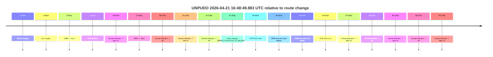
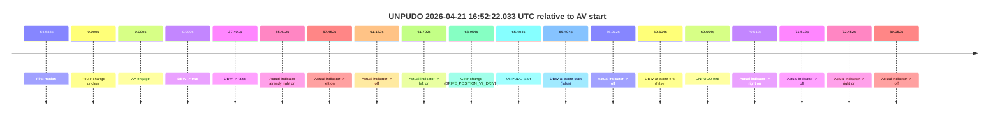
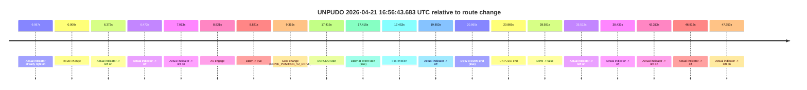
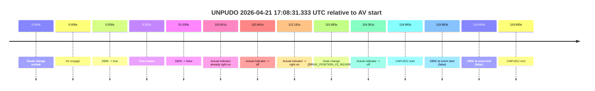
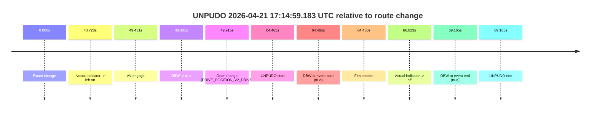

# Run Report: fme10010/2026-04-21--16-40-07--gen2-av-b4954402-a34d-418f-a6ab-e00c4dbd8e29

| Field | Value |
|---|---|
| Run ID | `fme10010/2026-04-21--16-40-07--gen2-av-b4954402-a34d-418f-a6ab-e00c4dbd8e29` |
| Date | `2026-04-21` |
| Model(s) | `pink-manta-ray-smooth` |
| Author | `guy.geva` |
| Event count | `5` |

## unpudo 2026-04-21 16:48:49.883 UTC

| Field | Value |
|---|---|
| Model | `pink-manta-ray-smooth` |
| Author | `guy.geva` |
| Run ID | `fme10010/2026-04-21--16-40-07--gen2-av-b4954402-a34d-418f-a6ab-e00c4dbd8e29` |
| Date | `2026-04-21` |
| Time (UTC) | `16:48:49.883` |
| Event type | `unpudo` |
| Disengagement type | `none observed` |
| Route change | `found` |
| Console | [run](https://console.sso.wayve.ai/run/fme10010/2026-04-21--16-40-07--gen2-av-b4954402-a34d-418f-a6ab-e00c4dbd8e29?id=&time-unixus=1776790129883305) |
| Foxglove | [segment](https://app.foxglove.dev/wayve-on-prem/p/prj_0dX18KZdVHg1fmmI/view?ds=foxglove-stream&ds.deviceName=fme10010&ds.start=2026-04-21T16%3A47%3A55.868436Z&ds.end=2026-04-21T16%3A48%3A59.883305Z&layoutId=lay_0e7VD4WIKDQGU73Y&time=2026-04-21T16%3A48%3A49.883305Z) |

### Event card: fail

- Fail: the credited unpudo does not stay AV-owned. The event window starts with DBW false, and the maneuver outcome lands outside a clean AV-owned segment.

| Event | Time (UTC) | Delta from route change |
|---|---:|---:|
| Route change | 2026-04-21 16:48:05.868 | `0.000s` |
| AV engage | 2026-04-21 16:48:05.869 | `0.001s` |
| DBW -> true | 2026-04-21 16:48:05.869 | `0.001s` |
| First motion | 2026-04-21 16:48:05.881 | `0.013s` |
| Actual indicator -> right on | 2026-04-21 16:48:22.541 | `16.673s` |
| DBW -> false | 2026-04-21 16:48:23.529 | `17.661s` |
| Actual indicator -> off | 2026-04-21 16:48:34.341 | `28.473s` |
| Actual indicator -> left on | 2026-04-21 16:48:37.181 | `31.313s` |
| Actual indicator -> off | 2026-04-21 16:48:43.101 | `37.233s` |
| Gear change (DRIVE_POSITION_V2_REVERSE) | 2026-04-21 16:48:46.883 | `41.015s` |
| UNPUDO start | 2026-04-21 16:48:49.883 | `44.015s` |
| DBW at event start (false) | 2026-04-21 16:48:49.883 | `44.015s` |
| DBW at event end (false) | 2026-04-21 16:48:49.883 | `44.015s` |
| UNPUDO end | 2026-04-21 16:48:49.883 | `44.015s` |
| Actual indicator -> right on | 2026-04-21 16:48:53.421 | `47.553s` |
| Actual indicator -> off | 2026-04-21 16:48:55.301 | `49.433s` |
| Actual indicator -> right on | 2026-04-21 16:49:02.001 | `56.133s` |
| Actual indicator -> off | 2026-04-21 16:49:04.141 | `58.273s` |
| Actual indicator -> right on | 2026-04-21 16:49:09.601 | `63.733s` |

| Metric | Value |
|---|---|
| Outcome | `fail` |
| Effective failure type | `not_av_owned` |
| Route change status | `found` |
| DBW at event start | `false` |
| DBW at event end | `false` |
| Predicted gear at AV start | `DRIVE_POSITION_V2_DRIVE` |
| Actual gear at AV start | `DRIVE_POSITION_V2_DRIVE` |
| Predicted gear at event start | `DRIVE_POSITION_V2_REVERSE` |
| Actual gear at event start | `DRIVE_POSITION_V2_REVERSE` |
| Planned indicator direction | `INDICATORS_STATE_V2_OFF` |
| Controller indicator direction | `INDICATORS_STATE_V2_OFF` |
| Actual indicator direction | `INDICATORS_STATE_V2_OFF` |
| Actual indicator at maneuver end | `INDICATORS_STATE_V2_OFF` |
| Driver accel help in AV | `false` |
| Driver accel help timestamp | `n/a` |
| Max accel pedal pct in AV | `0.0%` |
| Max brake pedal pct in AV | `0.0%` |
| Max speed mps in AV | `7.922` |
| Success timing baseline | `route change` |
| Route -> AV | `0.001s` |
| AV -> event start | `44.014s` |
| AV -> first motion | `0.012s` |
| Success baseline -> event start | `44.015s` |
| Success baseline -> first motion | `0.013s` |
| AV duration before disengagement | `17.660s` |
| Trajectory waypoint count | `37` |
| Driving-plan step count | `11` |

The scored portion starts from the AV-owned window, not from the pre-AV setup. Route-change search in the stopped pre-event segment was `found`, with the baseline therefore set to route change. At the event anchor the model predicts `DRIVE_POSITION_V2_REVERSE` and the actual gear is `DRIVE_POSITION_V2_REVERSE`. The effective model outcome is `fail` because `not_av_owned.`

### Resolution

| Field | Value |
|---|---|
| Final outcome | `fail` |
| Do we agree with this label? | `yes` |
| Source disengagement type | `none observed` |
| Resolved effective failure type | `not_av_owned` |
| Confidence | `high` |

## unpudo 2026-04-21 16:52:22.033 UTC

| Field | Value |
|---|---|
| Model | `pink-manta-ray-smooth` |
| Author | `guy.geva` |
| Run ID | `fme10010/2026-04-21--16-40-07--gen2-av-b4954402-a34d-418f-a6ab-e00c4dbd8e29` |
| Date | `2026-04-21` |
| Time (UTC) | `16:52:22.033` |
| Event type | `unpudo` |
| Disengagement type | `none observed` |
| Route change | `unclear` |
| Console | [run](https://console.sso.wayve.ai/run/fme10010/2026-04-21--16-40-07--gen2-av-b4954402-a34d-418f-a6ab-e00c4dbd8e29?id=&time-unixus=1776790342033323) |
| Foxglove | [segment](https://app.foxglove.dev/wayve-on-prem/p/prj_0dX18KZdVHg1fmmI/view?ds=foxglove-stream&ds.deviceName=fme10010&ds.start=2026-04-21T16%3A51%3A06.629295Z&ds.end=2026-04-21T16%3A52%3A36.233294Z&layoutId=lay_0e7VD4WIKDQGU73Y&time=2026-04-21T16%3A52%3A22.033323Z) |

### Event card: fail

- Fail: the credited unpudo does not stay AV-owned. The event window starts with DBW false, and the maneuver outcome lands outside a clean AV-owned segment.

| Event | Time (UTC) | Delta from AV start |
|---|---:|---:|
| First motion | 2026-04-21 16:50:22.041 | `-54.588s` |
| Route change unclear | 2026-04-21 16:51:16.629 | `0.000s` |
| AV engage | 2026-04-21 16:51:16.629 | `0.000s` |
| DBW -> true | 2026-04-21 16:51:16.629 | `0.000s` |
| DBW -> false | 2026-04-21 16:51:54.030 | `37.401s` |
| Actual indicator already right on | 2026-04-21 16:52:12.041 | `55.412s` |
| Actual indicator -> left on | 2026-04-21 16:52:14.081 | `57.452s` |
| Actual indicator -> off | 2026-04-21 16:52:17.801 | `61.172s` |
| Actual indicator -> left on | 2026-04-21 16:52:18.421 | `61.792s` |
| Gear change (DRIVE_POSITION_V2_DRIVE) | 2026-04-21 16:52:20.583 | `63.954s` |
| UNPUDO start | 2026-04-21 16:52:22.033 | `65.404s` |
| DBW at event start (false) | 2026-04-21 16:52:22.033 | `65.404s` |
| Actual indicator -> off | 2026-04-21 16:52:22.841 | `66.212s` |
| DBW at event end (false) | 2026-04-21 16:52:26.233 | `69.604s` |
| UNPUDO end | 2026-04-21 16:52:26.233 | `69.604s` |
| Actual indicator -> right on | 2026-04-21 16:52:27.141 | `70.512s` |
| Actual indicator -> off | 2026-04-21 16:52:28.141 | `71.512s` |
| Actual indicator -> right on | 2026-04-21 16:52:29.081 | `72.452s` |
| Actual indicator -> off | 2026-04-21 16:52:45.681 | `89.052s` |

| Metric | Value |
|---|---|
| Outcome | `fail` |
| Effective failure type | `completed_outside_av` |
| Route change status | `unclear` |
| DBW at event start | `false` |
| DBW at event end | `false` |
| Predicted gear at AV start | `DRIVE_POSITION_V2_DRIVE` |
| Actual gear at AV start | `DRIVE_POSITION_V2_DRIVE` |
| Predicted gear at event start | `DRIVE_POSITION_V2_DRIVE` |
| Actual gear at event start | `DRIVE_POSITION_V2_DRIVE` |
| Planned indicator direction | `INDICATORS_STATE_V2_LEFT_ON` |
| Controller indicator direction | `INDICATORS_STATE_V2_LEFT_ON` |
| Actual indicator direction | `INDICATORS_STATE_V2_LEFT_ON` |
| Actual indicator at maneuver end | `INDICATORS_STATE_V2_OFF` |
| Driver accel help in AV | `false` |
| Driver accel help timestamp | `n/a` |
| Max accel pedal pct in AV | `0.0%` |
| Max brake pedal pct in AV | `12.3%` |
| Max speed mps in AV | `7.447` |
| Success timing baseline | `AV start` |
| Route -> AV | `n/a` |
| AV -> event start | `65.404s` |
| AV -> first motion | `-54.588s` |
| Success baseline -> event start | `65.404s` |
| Success baseline -> first motion | `-54.588s` |
| AV duration before disengagement | `37.401s` |
| Trajectory waypoint count | `36` |
| Driving-plan step count | `11` |

The scored portion starts from the AV-owned window, not from the pre-AV setup. Route-change search in the stopped pre-event segment was `unclear`, with the baseline therefore set to AV start. At the event anchor the model predicts `DRIVE_POSITION_V2_DRIVE` and the actual gear is `DRIVE_POSITION_V2_DRIVE`. The effective model outcome is `fail` because `completed_outside_av.`

### Resolution

| Field | Value |
|---|---|
| Final outcome | `fail` |
| Do we agree with this label? | `yes` |
| Source disengagement type | `none observed` |
| Resolved effective failure type | `completed_outside_av` |
| Confidence | `medium` |

## unpudo 2026-04-21 16:56:43.683 UTC

| Field | Value |
|---|---|
| Model | `pink-manta-ray-smooth` |
| Author | `guy.geva` |
| Run ID | `fme10010/2026-04-21--16-40-07--gen2-av-b4954402-a34d-418f-a6ab-e00c4dbd8e29` |
| Date | `2026-04-21` |
| Time (UTC) | `16:56:43.683` |
| Event type | `unpudo` |
| Disengagement type | `none observed` |
| Route change | `found` |
| Console | [run](https://console.sso.wayve.ai/run/fme10010/2026-04-21--16-40-07--gen2-av-b4954402-a34d-418f-a6ab-e00c4dbd8e29?id=&time-unixus=1776790603683309) |
| Foxglove | [segment](https://app.foxglove.dev/wayve-on-prem/p/prj_0dX18KZdVHg1fmmI/view?ds=foxglove-stream&ds.deviceName=fme10010&ds.start=2026-04-21T16%3A56%3A16.268313Z&ds.end=2026-04-21T16%3A57%3A04.849293Z&layoutId=lay_0e7VD4WIKDQGU73Y&time=2026-04-21T16%3A56%3A43.683309Z) |

### Event card: pass

- Pass: AV owns the credited unpudo from route change through the official unpudo window, the gear state is aligned at the anchor, and the vehicle moves without driver accelerator help in AV.

| Event | Time (UTC) | Delta from route change |
|---|---:|---:|
| Actual indicator already right on | 2026-04-21 16:56:16.281 | `-9.987s` |
| Route change | 2026-04-21 16:56:26.268 | `0.000s` |
| Actual indicator -> left on | 2026-04-21 16:56:32.641 | `6.373s` |
| Actual indicator -> off | 2026-04-21 16:56:32.741 | `6.473s` |
| Actual indicator -> left on | 2026-04-21 16:56:33.281 | `7.013s` |
| AV engage | 2026-04-21 16:56:35.089 | `8.821s` |
| DBW -> true | 2026-04-21 16:56:35.089 | `8.821s` |
| Gear change (DRIVE_POSITION_V2_DRIVE) | 2026-04-21 16:56:35.583 | `9.315s` |
| UNPUDO start | 2026-04-21 16:56:43.683 | `17.415s` |
| DBW at event start (true) | 2026-04-21 16:56:43.683 | `17.415s` |
| First motion | 2026-04-21 16:56:43.721 | `17.453s` |
| Actual indicator -> off | 2026-04-21 16:56:46.121 | `19.853s` |
| DBW at event end (true) | 2026-04-21 16:56:47.133 | `20.865s` |
| UNPUDO end | 2026-04-21 16:56:47.133 | `20.865s` |
| DBW -> false | 2026-04-21 16:56:54.849 | `28.581s` |
| Actual indicator -> left on | 2026-04-21 16:57:01.781 | `35.513s` |
| Actual indicator -> off | 2026-04-21 16:57:04.701 | `38.433s` |
| Actual indicator -> left on | 2026-04-21 16:57:08.581 | `42.313s` |
| Actual indicator -> off | 2026-04-21 16:57:13.081 | `46.813s` |
| Actual indicator -> left on | 2026-04-21 16:57:13.521 | `47.253s` |

| Metric | Value |
|---|---|
| Outcome | `pass` |
| Effective failure type | `none` |
| Route change status | `found` |
| DBW at event start | `true` |
| DBW at event end | `true` |
| Predicted gear at AV start | `DRIVE_POSITION_V2_DRIVE` |
| Actual gear at AV start | `DRIVE_POSITION_V2_PARK` |
| Predicted gear at event start | `DRIVE_POSITION_V2_DRIVE` |
| Actual gear at event start | `DRIVE_POSITION_V2_DRIVE` |
| Planned indicator direction | `INDICATORS_STATE_V2_LEFT_ON` |
| Controller indicator direction | `INDICATORS_STATE_V2_LEFT_ON` |
| Actual indicator direction | `INDICATORS_STATE_V2_LEFT_ON` |
| Actual indicator at maneuver end | `INDICATORS_STATE_V2_OFF` |
| Driver accel help in AV | `false` |
| Driver accel help timestamp | `n/a` |
| Max accel pedal pct in AV | `0.0%` |
| Max brake pedal pct in AV | `8.0%` |
| Max speed mps in AV | `5.225` |
| Success timing baseline | `route change` |
| Route -> AV | `8.821s` |
| AV -> event start | `8.594s` |
| AV -> first motion | `8.632s` |
| Success baseline -> event start | `17.415s` |
| Success baseline -> first motion | `17.453s` |
| AV duration before disengagement | `19.760s` |
| Trajectory waypoint count | `37` |
| Driving-plan step count | `11` |

The scored portion starts from the AV-owned window, not from the pre-AV setup. Route-change search in the stopped pre-event segment was `found`, with the baseline therefore set to route change. At the event anchor the model predicts `DRIVE_POSITION_V2_DRIVE` and the actual gear is `DRIVE_POSITION_V2_DRIVE`. The effective model outcome is `pass` because `the credited unpudo stays AV-owned through the official unpudo window.`

### Resolution

| Field | Value |
|---|---|
| Final outcome | `pass` |
| Do we agree with this label? | `yes` |
| Source disengagement type | `none observed` |
| Resolved effective failure type | `none` |
| Confidence | `high` |

## unpudo 2026-04-21 17:08:31.333 UTC

| Field | Value |
|---|---|
| Model | `pink-manta-ray-smooth` |
| Author | `guy.geva` |
| Run ID | `fme10010/2026-04-21--16-40-07--gen2-av-b4954402-a34d-418f-a6ab-e00c4dbd8e29` |
| Date | `2026-04-21` |
| Time (UTC) | `17:08:31.333` |
| Event type | `unpudo` |
| Disengagement type | `none observed` |
| Route change | `unclear` |
| Console | [run](https://console.sso.wayve.ai/run/fme10010/2026-04-21--16-40-07--gen2-av-b4954402-a34d-418f-a6ab-e00c4dbd8e29?id=&time-unixus=1776791311333295) |
| Foxglove | [segment](https://app.foxglove.dev/wayve-on-prem/p/prj_0dX18KZdVHg1fmmI/view?ds=foxglove-stream&ds.deviceName=fme10010&ds.start=2026-04-21T17%3A06%3A21.340509Z&ds.end=2026-04-21T17%3A08%3A41.333295Z&layoutId=lay_0e7VD4WIKDQGU73Y&time=2026-04-21T17%3A08%3A31.333295Z) |

### Event card: fail

- Fail: the credited unpudo does not stay AV-owned. The event window starts with DBW false, and the maneuver outcome lands outside a clean AV-owned segment.

| Event | Time (UTC) | Delta from AV start |
|---|---:|---:|
| Route change unclear | 2026-04-21 17:06:31.340 | `0.000s` |
| AV engage | 2026-04-21 17:06:31.340 | `0.000s` |
| DBW -> true | 2026-04-21 17:06:31.340 | `0.000s` |
| First motion | 2026-04-21 17:06:31.341 | `0.001s` |
| DBW -> false | 2026-04-21 17:07:22.370 | `51.030s` |
| Actual indicator already right on | 2026-04-21 17:08:21.341 | `110.001s` |
| Actual indicator -> off | 2026-04-21 17:08:21.981 | `110.641s` |
| Actual indicator -> right on | 2026-04-21 17:08:23.521 | `112.181s` |
| Gear change (DRIVE_POSITION_V2_REVERSE) | 2026-04-21 17:08:27.233 | `115.893s` |
| Actual indicator -> off | 2026-04-21 17:08:30.701 | `119.361s` |
| UNPUDO start | 2026-04-21 17:08:31.333 | `119.993s` |
| DBW at event start (false) | 2026-04-21 17:08:31.333 | `119.993s` |
| DBW at event end (false) | 2026-04-21 17:08:31.333 | `119.993s` |
| UNPUDO end | 2026-04-21 17:08:31.333 | `119.993s` |

| Metric | Value |
|---|---|
| Outcome | `fail` |
| Effective failure type | `not_av_owned` |
| Route change status | `unclear` |
| DBW at event start | `false` |
| DBW at event end | `false` |
| Predicted gear at AV start | `DRIVE_POSITION_V2_DRIVE` |
| Actual gear at AV start | `DRIVE_POSITION_V2_DRIVE` |
| Predicted gear at event start | `DRIVE_POSITION_V2_REVERSE` |
| Actual gear at event start | `DRIVE_POSITION_V2_REVERSE` |
| Planned indicator direction | `INDICATORS_STATE_V2_OFF` |
| Controller indicator direction | `INDICATORS_STATE_V2_OFF` |
| Actual indicator direction | `INDICATORS_STATE_V2_OFF` |
| Actual indicator at maneuver end | `INDICATORS_STATE_V2_OFF` |
| Driver accel help in AV | `false` |
| Driver accel help timestamp | `n/a` |
| Max accel pedal pct in AV | `0.0%` |
| Max brake pedal pct in AV | `24.2%` |
| Max speed mps in AV | `9.344` |
| Success timing baseline | `AV start` |
| Route -> AV | `n/a` |
| AV -> event start | `119.993s` |
| AV -> first motion | `0.001s` |
| Success baseline -> event start | `119.993s` |
| Success baseline -> first motion | `0.001s` |
| AV duration before disengagement | `51.030s` |
| Trajectory waypoint count | `36` |
| Driving-plan step count | `11` |

The scored portion starts from the AV-owned window, not from the pre-AV setup. Route-change search in the stopped pre-event segment was `unclear`, with the baseline therefore set to AV start. At the event anchor the model predicts `DRIVE_POSITION_V2_REVERSE` and the actual gear is `DRIVE_POSITION_V2_REVERSE`. The effective model outcome is `fail` because `not_av_owned.`

### Resolution

| Field | Value |
|---|---|
| Final outcome | `fail` |
| Do we agree with this label? | `yes` |
| Source disengagement type | `none observed` |
| Resolved effective failure type | `not_av_owned` |
| Confidence | `medium` |

## unpudo 2026-04-21 17:14:59.183 UTC

| Field | Value |
|---|---|
| Model | `pink-manta-ray-smooth` |
| Author | `guy.geva` |
| Run ID | `fme10010/2026-04-21--16-40-07--gen2-av-b4954402-a34d-418f-a6ab-e00c4dbd8e29` |
| Date | `2026-04-21` |
| Time (UTC) | `17:14:59.183` |
| Event type | `unpudo` |
| Disengagement type | `none observed` |
| Route change | `found` |
| Console | [run](https://console.sso.wayve.ai/run/fme10010/2026-04-21--16-40-07--gen2-av-b4954402-a34d-418f-a6ab-e00c4dbd8e29?id=&time-unixus=1776791699183306) |
| Foxglove | [segment](https://app.foxglove.dev/wayve-on-prem/p/prj_0dX18KZdVHg1fmmI/view?ds=foxglove-stream&ds.deviceName=fme10010&ds.start=2026-04-21T17%3A13%3A44.718333Z&ds.end=2026-04-21T17%3A15%3A13.883316Z&layoutId=lay_0e7VD4WIKDQGU73Y&time=2026-04-21T17%3A14%3A59.183306Z) |

### Event card: pass

- Pass: AV owns the credited unpudo from route change through the official unpudo window, the gear state is aligned at the anchor, and the vehicle moves without driver accelerator help in AV.

| Event | Time (UTC) | Delta from route change |
|---|---:|---:|
| Route change | 2026-04-21 17:13:54.718 | `0.000s` |
| Actual indicator -> left on | 2026-04-21 17:14:38.441 | `43.723s` |
| AV engage | 2026-04-21 17:14:44.149 | `49.431s` |
| DBW -> true | 2026-04-21 17:14:44.149 | `49.431s` |
| Gear change (DRIVE_POSITION_V2_DRIVE) | 2026-04-21 17:14:44.633 | `49.915s` |
| UNPUDO start | 2026-04-21 17:14:59.183 | `64.465s` |
| DBW at event start (true) | 2026-04-21 17:14:59.183 | `64.465s` |
| First motion | 2026-04-21 17:14:59.201 | `64.483s` |
| Actual indicator -> off | 2026-04-21 17:15:01.541 | `66.823s` |
| DBW at event end (true) | 2026-04-21 17:15:03.883 | `69.165s` |
| UNPUDO end | 2026-04-21 17:15:03.883 | `69.165s` |

| Metric | Value |
|---|---|
| Outcome | `pass` |
| Effective failure type | `none` |
| Route change status | `found` |
| DBW at event start | `true` |
| DBW at event end | `true` |
| Predicted gear at AV start | `DRIVE_POSITION_V2_DRIVE` |
| Actual gear at AV start | `DRIVE_POSITION_V2_PARK` |
| Predicted gear at event start | `DRIVE_POSITION_V2_DRIVE` |
| Actual gear at event start | `DRIVE_POSITION_V2_DRIVE` |
| Planned indicator direction | `INDICATORS_STATE_V2_LEFT_ON` |
| Controller indicator direction | `INDICATORS_STATE_V2_LEFT_ON` |
| Actual indicator direction | `INDICATORS_STATE_V2_LEFT_ON` |
| Actual indicator at maneuver end | `INDICATORS_STATE_V2_OFF` |
| Driver accel help in AV | `false` |
| Driver accel help timestamp | `n/a` |
| Max accel pedal pct in AV | `0.0%` |
| Max brake pedal pct in AV | `28.1%` |
| Max speed mps in AV | `3.386` |
| Success timing baseline | `route change` |
| Route -> AV | `49.431s` |
| AV -> event start | `15.034s` |
| AV -> first motion | `15.052s` |
| Success baseline -> event start | `64.465s` |
| Success baseline -> first motion | `64.483s` |
| AV duration before disengagement | `n/a` |
| Trajectory waypoint count | `37` |
| Driving-plan step count | `11` |

The scored portion starts from the AV-owned window, not from the pre-AV setup. Route-change search in the stopped pre-event segment was `found`, with the baseline therefore set to route change. At the event anchor the model predicts `DRIVE_POSITION_V2_DRIVE` and the actual gear is `DRIVE_POSITION_V2_DRIVE`. The effective model outcome is `pass` because `the credited unpudo stays AV-owned through the official unpudo window.`

### Resolution

| Field | Value |
|---|---|
| Final outcome | `pass` |
| Do we agree with this label? | `yes` |
| Source disengagement type | `none observed` |
| Resolved effective failure type | `none` |
| Confidence | `high` |
