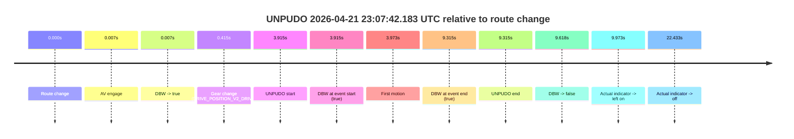
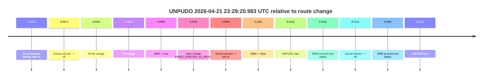
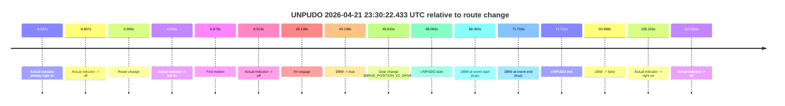

# Run Report: fme10010/2026-04-21--22-57-49--gen2-av-be3ca439-428c-4966-a8b5-449098d20c45

| Field | Value |
|---|---|
| Run ID | `fme10010/2026-04-21--22-57-49--gen2-av-be3ca439-428c-4966-a8b5-449098d20c45` |
| Date | `2026-04-21` |
| Model(s) | `eel-teal-outspoken` |
| Author | `zak` |
| Event count | `3` |

## unpudo 2026-04-21 23:07:42.183 UTC

| Field | Value |
|---|---|
| Model | `eel-teal-outspoken` |
| Author | `zak` |
| Run ID | `fme10010/2026-04-21--22-57-49--gen2-av-be3ca439-428c-4966-a8b5-449098d20c45` |
| Date | `2026-04-21` |
| Time (UTC) | `23:07:42.183` |
| Event type | `unpudo` |
| Disengagement type | `none observed` |
| Route change | `found` |
| Console | [run](https://console.sso.wayve.ai/run/fme10010/2026-04-21--22-57-49--gen2-av-be3ca439-428c-4966-a8b5-449098d20c45?id=&time-unixus=1776812862183294) |
| Foxglove | [segment](https://app.foxglove.dev/wayve-on-prem/p/prj_0dX18KZdVHg1fmmI/view?ds=foxglove-stream&ds.deviceName=fme10010&ds.start=2026-04-21T23%3A07%3A28.268253Z&ds.end=2026-04-21T23%3A07%3A57.886226Z&layoutId=lay_0e7VD4WIKDQGU73Y&time=2026-04-21T23%3A07%3A42.183294Z) |

### Event card: pass

- Pass: AV owns the credited unpudo from route change through the official unpudo window, the gear state is aligned at the anchor, and the vehicle moves without driver accelerator help in AV.

| Event | Time (UTC) | Delta from route change |
|---|---:|---:|
| Route change | 2026-04-21 23:07:38.268 | `0.000s` |
| AV engage | 2026-04-21 23:07:38.275 | `0.007s` |
| DBW -> true | 2026-04-21 23:07:38.275 | `0.007s` |
| Gear change (DRIVE_POSITION_V2_DRIVE) | 2026-04-21 23:07:38.683 | `0.415s` |
| UNPUDO start | 2026-04-21 23:07:42.183 | `3.915s` |
| DBW at event start (true) | 2026-04-21 23:07:42.183 | `3.915s` |
| First motion | 2026-04-21 23:07:42.241 | `3.973s` |
| DBW at event end (true) | 2026-04-21 23:07:47.583 | `9.315s` |
| UNPUDO end | 2026-04-21 23:07:47.583 | `9.315s` |
| DBW -> false | 2026-04-21 23:07:47.886 | `9.618s` |
| Actual indicator -> left on | 2026-04-21 23:07:48.240 | `9.973s` |
| Actual indicator -> off | 2026-04-21 23:08:00.701 | `22.433s` |

| Metric | Value |
|---|---|
| Outcome | `pass` |
| Effective failure type | `none` |
| Route change status | `found` |
| DBW at event start | `true` |
| DBW at event end | `true` |
| Predicted gear at AV start | `DRIVE_POSITION_V2_PARK` |
| Actual gear at AV start | `DRIVE_POSITION_V2_PARK` |
| Predicted gear at event start | `DRIVE_POSITION_V2_DRIVE` |
| Actual gear at event start | `DRIVE_POSITION_V2_DRIVE` |
| Planned indicator direction | `INDICATORS_STATE_V2_OFF` |
| Controller indicator direction | `INDICATORS_STATE_V2_OFF` |
| Actual indicator direction | `INDICATORS_STATE_V2_OFF` |
| Actual indicator at maneuver end | `INDICATORS_STATE_V2_OFF` |
| Driver accel help in AV | `false` |
| Driver accel help timestamp | `n/a` |
| Max accel pedal pct in AV | `0.0%` |
| Max brake pedal pct in AV | `8.0%` |
| Max speed mps in AV | `2.325` |
| Success timing baseline | `route change` |
| Route -> AV | `0.007s` |
| AV -> event start | `3.908s` |
| AV -> first motion | `3.965s` |
| Success baseline -> event start | `3.915s` |
| Success baseline -> first motion | `3.973s` |
| AV duration before disengagement | `9.611s` |
| Trajectory waypoint count | `36` |
| Driving-plan step count | `11` |

The scored portion starts from the AV-owned window, not from the pre-AV setup. Route-change search in the stopped pre-event segment was `found`, with the baseline therefore set to route change. At the event anchor the model predicts `DRIVE_POSITION_V2_DRIVE` and the actual gear is `DRIVE_POSITION_V2_DRIVE`. The effective model outcome is `pass` because `the credited unpudo stays AV-owned through the official unpudo window.`

### Resolution

| Field | Value |
|---|---|
| Final outcome | `pass` |
| Do we agree with this label? | `yes` |
| Source disengagement type | `none observed` |
| Resolved effective failure type | `none` |
| Confidence | `high` |

## unpudo 2026-04-21 23:29:20.983 UTC

| Field | Value |
|---|---|
| Model | `eel-teal-outspoken` |
| Author | `zak` |
| Run ID | `fme10010/2026-04-21--22-57-49--gen2-av-be3ca439-428c-4966-a8b5-449098d20c45` |
| Date | `2026-04-21` |
| Time (UTC) | `23:29:20.983` |
| Event type | `unpudo` |
| Disengagement type | `none observed` |
| Route change | `found` |
| Console | [run](https://console.sso.wayve.ai/run/fme10010/2026-04-21--22-57-49--gen2-av-be3ca439-428c-4966-a8b5-449098d20c45?id=&time-unixus=1776814160983299) |
| Foxglove | [segment](https://app.foxglove.dev/wayve-on-prem/p/prj_0dX18KZdVHg1fmmI/view?ds=foxglove-stream&ds.deviceName=fme10010&ds.start=2026-04-21T23%3A29%3A04.368235Z&ds.end=2026-04-21T23%3A29%3A33.633302Z&layoutId=lay_0e7VD4WIKDQGU73Y&time=2026-04-21T23%3A29%3A20.983299Z) |

### Event card: fail

- Fail: the credited unpudo does not stay AV-owned. The event window starts with DBW false, and the maneuver outcome lands outside a clean AV-owned segment.

| Event | Time (UTC) | Delta from route change |
|---|---:|---:|
| Actual indicator already right on | 2026-04-21 23:29:04.381 | `-9.987s` |
| Actual indicator -> off | 2026-04-21 23:29:04.501 | `-9.867s` |
| Route change | 2026-04-21 23:29:14.368 | `0.000s` |
| AV engage | 2026-04-21 23:29:14.375 | `0.008s` |
| DBW -> true | 2026-04-21 23:29:14.375 | `0.008s` |
| Gear change (DRIVE_POSITION_V2_DRIVE) | 2026-04-21 23:29:14.583 | `0.215s` |
| Actual indicator -> left on | 2026-04-21 23:29:19.321 | `4.954s` |
| DBW -> false | 2026-04-21 23:29:20.506 | `6.139s` |
| UNPUDO start | 2026-04-21 23:29:20.983 | `6.615s` |
| DBW at event start (false) | 2026-04-21 23:29:20.983 | `6.615s` |
| Actual indicator -> off | 2026-04-21 23:29:22.881 | `8.513s` |
| DBW at event end (false) | 2026-04-21 23:29:23.633 | `9.265s` |
| UNPUDO end | 2026-04-21 23:29:23.633 | `9.265s` |

| Metric | Value |
|---|---|
| Outcome | `fail` |
| Effective failure type | `not_av_owned` |
| Route change status | `found` |
| DBW at event start | `false` |
| DBW at event end | `false` |
| Predicted gear at AV start | `DRIVE_POSITION_V2_PARK` |
| Actual gear at AV start | `DRIVE_POSITION_V2_PARK` |
| Predicted gear at event start | `DRIVE_POSITION_V2_DRIVE` |
| Actual gear at event start | `DRIVE_POSITION_V2_DRIVE` |
| Planned indicator direction | `INDICATORS_STATE_V2_OFF` |
| Controller indicator direction | `INDICATORS_STATE_V2_OFF` |
| Actual indicator direction | `INDICATORS_STATE_V2_LEFT_ON` |
| Actual indicator at maneuver end | `INDICATORS_STATE_V2_OFF` |
| Driver accel help in AV | `false` |
| Driver accel help timestamp | `n/a` |
| Max accel pedal pct in AV | `0.0%` |
| Max brake pedal pct in AV | `8.0%` |
| Max speed mps in AV | `0.000` |
| Success timing baseline | `route change` |
| Route -> AV | `0.008s` |
| AV -> event start | `6.608s` |
| AV -> first motion | `n/a` |
| Success baseline -> event start | `6.615s` |
| Success baseline -> first motion | `n/a` |
| AV duration before disengagement | `6.131s` |
| Trajectory waypoint count | `36` |
| Driving-plan step count | `11` |

The scored portion starts from the AV-owned window, not from the pre-AV setup. Route-change search in the stopped pre-event segment was `found`, with the baseline therefore set to route change. At the event anchor the model predicts `DRIVE_POSITION_V2_DRIVE` and the actual gear is `DRIVE_POSITION_V2_DRIVE`. The effective model outcome is `fail` because `not_av_owned.`

### Resolution

| Field | Value |
|---|---|
| Final outcome | `fail` |
| Do we agree with this label? | `yes` |
| Source disengagement type | `none observed` |
| Resolved effective failure type | `not_av_owned` |
| Confidence | `high` |

## unpudo 2026-04-21 23:30:22.433 UTC

| Field | Value |
|---|---|
| Model | `eel-teal-outspoken` |
| Author | `zak` |
| Run ID | `fme10010/2026-04-21--22-57-49--gen2-av-be3ca439-428c-4966-a8b5-449098d20c45` |
| Date | `2026-04-21` |
| Time (UTC) | `23:30:22.433` |
| Event type | `unpudo` |
| Disengagement type | `none observed` |
| Route change | `found` |
| Console | [run](https://console.sso.wayve.ai/run/fme10010/2026-04-21--22-57-49--gen2-av-be3ca439-428c-4966-a8b5-449098d20c45?id=&time-unixus=1776814222433318) |
| Foxglove | [segment](https://app.foxglove.dev/wayve-on-prem/p/prj_0dX18KZdVHg1fmmI/view?ds=foxglove-stream&ds.deviceName=fme10010&ds.start=2026-04-21T23%3A29%3A04.368235Z&ds.end=2026-04-21T23%3A30%3A58.366292Z&layoutId=lay_0e7VD4WIKDQGU73Y&time=2026-04-21T23%3A30%3A22.433318Z) |

### Event card: pass

- Pass: AV owns the credited unpudo from route change through the official unpudo window, the gear state is aligned at the anchor, and the vehicle moves without driver accelerator help in AV.

| Event | Time (UTC) | Delta from route change |
|---|---:|---:|
| Actual indicator already right on | 2026-04-21 23:29:04.381 | `-9.987s` |
| Actual indicator -> off | 2026-04-21 23:29:04.501 | `-9.867s` |
| Route change | 2026-04-21 23:29:14.368 | `0.000s` |
| Actual indicator -> left on | 2026-04-21 23:29:19.321 | `4.954s` |
| First motion | 2026-04-21 23:29:21.041 | `6.673s` |
| Actual indicator -> off | 2026-04-21 23:29:22.881 | `8.513s` |
| AV engage | 2026-04-21 23:30:03.505 | `49.138s` |
| DBW -> true | 2026-04-21 23:30:03.505 | `49.138s` |
| Gear change (DRIVE_POSITION_V2_DRIVE) | 2026-04-21 23:30:03.983 | `49.615s` |
| UNPUDO start | 2026-04-21 23:30:22.433 | `68.065s` |
| DBW at event start (true) | 2026-04-21 23:30:22.433 | `68.065s` |
| DBW at event end (true) | 2026-04-21 23:30:26.083 | `71.715s` |
| UNPUDO end | 2026-04-21 23:30:26.083 | `71.715s` |
| DBW -> false | 2026-04-21 23:30:48.366 | `93.998s` |
| Actual indicator -> right on | 2026-04-21 23:30:59.600 | `105.233s` |
| Actual indicator -> off | 2026-04-21 23:31:08.360 | `113.993s` |

| Metric | Value |
|---|---|
| Outcome | `pass` |
| Effective failure type | `none` |
| Route change status | `found` |
| DBW at event start | `true` |
| DBW at event end | `true` |
| Predicted gear at AV start | `DRIVE_POSITION_V2_DRIVE` |
| Actual gear at AV start | `DRIVE_POSITION_V2_PARK` |
| Predicted gear at event start | `DRIVE_POSITION_V2_DRIVE` |
| Actual gear at event start | `DRIVE_POSITION_V2_DRIVE` |
| Planned indicator direction | `INDICATORS_STATE_V2_OFF` |
| Controller indicator direction | `INDICATORS_STATE_V2_OFF` |
| Actual indicator direction | `INDICATORS_STATE_V2_OFF` |
| Actual indicator at maneuver end | `INDICATORS_STATE_V2_OFF` |
| Driver accel help in AV | `false` |
| Driver accel help timestamp | `n/a` |
| Max accel pedal pct in AV | `0.0%` |
| Max brake pedal pct in AV | `8.0%` |
| Max speed mps in AV | `4.919` |
| Success timing baseline | `route change` |
| Route -> AV | `49.138s` |
| AV -> event start | `18.928s` |
| AV -> first motion | `-42.465s` |
| Success baseline -> event start | `68.065s` |
| Success baseline -> first motion | `6.673s` |
| AV duration before disengagement | `44.861s` |
| Trajectory waypoint count | `37` |
| Driving-plan step count | `11` |

The scored portion starts from the AV-owned window, not from the pre-AV setup. Route-change search in the stopped pre-event segment was `found`, with the baseline therefore set to route change. At the event anchor the model predicts `DRIVE_POSITION_V2_DRIVE` and the actual gear is `DRIVE_POSITION_V2_DRIVE`. The effective model outcome is `pass` because `the credited unpudo stays AV-owned through the official unpudo window.`

### Resolution

| Field | Value |
|---|---|
| Final outcome | `pass` |
| Do we agree with this label? | `yes` |
| Source disengagement type | `none observed` |
| Resolved effective failure type | `none` |
| Confidence | `high` |
