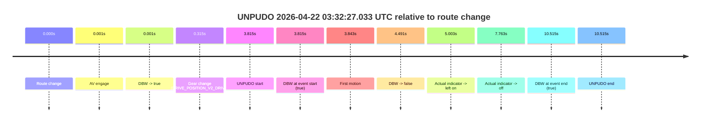
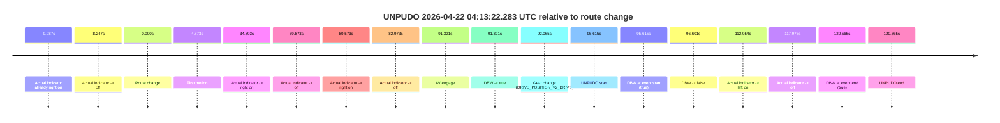
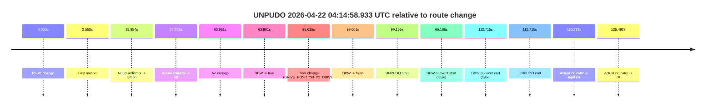
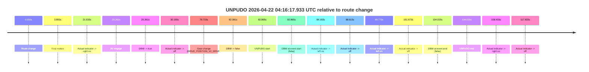
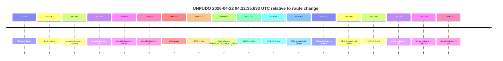

# Run Report: fme10010/2026-04-22--02-39-55--gen2-av-eb435b7c-0065-4b6d-81f5-518fd7e94716

| Field | Value |
|---|---|
| Run ID | `fme10010/2026-04-22--02-39-55--gen2-av-eb435b7c-0065-4b6d-81f5-518fd7e94716` |
| Date | `2026-04-22` |
| Model(s) | `eel-teal-outspoken` |
| Author | `zak` |
| Event count | `5` |

## unpudo 2026-04-22 03:32:27.033 UTC

| Field | Value |
|---|---|
| Model | `eel-teal-outspoken` |
| Author | `zak` |
| Run ID | `fme10010/2026-04-22--02-39-55--gen2-av-eb435b7c-0065-4b6d-81f5-518fd7e94716` |
| Date | `2026-04-22` |
| Time (UTC) | `03:32:27.033` |
| Event type | `unpudo` |
| Disengagement type | `failed_to_unpudo` |
| Route change | `found` |
| Console | [run](https://console.sso.wayve.ai/run/fme10010/2026-04-22--02-39-55--gen2-av-eb435b7c-0065-4b6d-81f5-518fd7e94716?id=&time-unixus=1776828747033305) |
| Foxglove | [segment](https://app.foxglove.dev/wayve-on-prem/p/prj_0dX18KZdVHg1fmmI/view?ds=foxglove-stream&ds.deviceName=fme10010&ds.start=2026-04-22T03%3A32%3A13.218277Z&ds.end=2026-04-22T03%3A32%3A43.733296Z&layoutId=lay_0e7VD4WIKDQGU73Y&time=2026-04-22T03%3A32%3A27.033305Z) |

### Event card: fail

- Fail: AV owns part of the segment, but the event still resolves as a model-performance failure under the AV-only scoring rule.

| Event | Time (UTC) | Delta from route change |
|---|---:|---:|
| Route change | 2026-04-22 03:32:23.218 | `0.000s` |
| AV engage | 2026-04-22 03:32:23.218 | `0.001s` |
| DBW -> true | 2026-04-22 03:32:23.218 | `0.001s` |
| Gear change (DRIVE_POSITION_V2_DRIVE) | 2026-04-22 03:32:23.533 | `0.315s` |
| UNPUDO start | 2026-04-22 03:32:27.033 | `3.815s` |
| DBW at event start (true) | 2026-04-22 03:32:27.033 | `3.815s` |
| First motion | 2026-04-22 03:32:27.061 | `3.843s` |
| DBW -> false | 2026-04-22 03:32:27.709 | `4.491s` |
| Actual indicator -> left on | 2026-04-22 03:32:28.221 | `5.003s` |
| Actual indicator -> off | 2026-04-22 03:32:30.981 | `7.763s` |
| DBW at event end (true) | 2026-04-22 03:32:33.733 | `10.515s` |
| UNPUDO end | 2026-04-22 03:32:33.733 | `10.515s` |

| Metric | Value |
|---|---|
| Outcome | `fail` |
| Effective failure type | `failed_to_unpudo` |
| Route change status | `found` |
| DBW at event start | `true` |
| DBW at event end | `true` |
| Predicted gear at AV start | `DRIVE_POSITION_V2_PARK` |
| Actual gear at AV start | `DRIVE_POSITION_V2_PARK` |
| Predicted gear at event start | `DRIVE_POSITION_V2_DRIVE` |
| Actual gear at event start | `DRIVE_POSITION_V2_DRIVE` |
| Planned indicator direction | `INDICATORS_STATE_V2_OFF` |
| Controller indicator direction | `INDICATORS_STATE_V2_OFF` |
| Actual indicator direction | `INDICATORS_STATE_V2_OFF` |
| Actual indicator at maneuver end | `INDICATORS_STATE_V2_OFF` |
| Driver accel help in AV | `false` |
| Driver accel help timestamp | `n/a` |
| Max accel pedal pct in AV | `0.0%` |
| Max brake pedal pct in AV | `8.0%` |
| Max speed mps in AV | `1.408` |
| Success timing baseline | `route change` |
| Route -> AV | `0.001s` |
| AV -> event start | `3.814s` |
| AV -> first motion | `3.842s` |
| Success baseline -> event start | `3.815s` |
| Success baseline -> first motion | `3.843s` |
| AV duration before disengagement | `4.491s` |
| Trajectory waypoint count | `36` |
| Driving-plan step count | `11` |

The scored portion starts from the AV-owned window, not from the pre-AV setup. Route-change search in the stopped pre-event segment was `found`, with the baseline therefore set to route change. At the event anchor the model predicts `DRIVE_POSITION_V2_DRIVE` and the actual gear is `DRIVE_POSITION_V2_DRIVE`. The effective model outcome is `fail` because `failed_to_unpudo.`

### Resolution

| Field | Value |
|---|---|
| Final outcome | `fail` |
| Do we agree with this label? | `yes` |
| Source disengagement type | `failed_to_unpudo` |
| Resolved effective failure type | `failed_to_unpudo` |
| Confidence | `high` |

## unpudo 2026-04-22 04:13:22.283 UTC

| Field | Value |
|---|---|
| Model | `eel-teal-outspoken` |
| Author | `zak` |
| Run ID | `fme10010/2026-04-22--02-39-55--gen2-av-eb435b7c-0065-4b6d-81f5-518fd7e94716` |
| Date | `2026-04-22` |
| Time (UTC) | `04:13:22.283` |
| Event type | `unpudo` |
| Disengagement type | `failed_to_slow` |
| Route change | `found` |
| Console | [run](https://console.sso.wayve.ai/run/fme10010/2026-04-22--02-39-55--gen2-av-eb435b7c-0065-4b6d-81f5-518fd7e94716?id=&time-unixus=1776831202283290) |
| Foxglove | [segment](https://app.foxglove.dev/wayve-on-prem/p/prj_0dX18KZdVHg1fmmI/view?ds=foxglove-stream&ds.deviceName=fme10010&ds.start=2026-04-22T04%3A11%3A36.668262Z&ds.end=2026-04-22T04%3A13%3A57.233298Z&layoutId=lay_0e7VD4WIKDQGU73Y&time=2026-04-22T04%3A13%3A22.283290Z) |

### Event card: fail

- Fail: AV owns part of the segment, but the event still resolves as a model-performance failure under the AV-only scoring rule.

| Event | Time (UTC) | Delta from route change |
|---|---:|---:|
| Actual indicator already right on | 2026-04-22 04:11:36.680 | `-9.987s` |
| Actual indicator -> off | 2026-04-22 04:11:38.420 | `-8.247s` |
| Route change | 2026-04-22 04:11:46.668 | `0.000s` |
| First motion | 2026-04-22 04:11:51.540 | `4.873s` |
| Actual indicator -> right on | 2026-04-22 04:12:21.560 | `34.893s` |
| Actual indicator -> off | 2026-04-22 04:12:26.540 | `39.873s` |
| Actual indicator -> right on | 2026-04-22 04:13:07.240 | `80.573s` |
| Actual indicator -> off | 2026-04-22 04:13:09.640 | `82.973s` |
| AV engage | 2026-04-22 04:13:17.988 | `91.321s` |
| DBW -> true | 2026-04-22 04:13:17.988 | `91.321s` |
| Gear change (DRIVE_POSITION_V2_DRIVE) | 2026-04-22 04:13:18.733 | `92.065s` |
| UNPUDO start | 2026-04-22 04:13:22.283 | `95.615s` |
| DBW at event start (true) | 2026-04-22 04:13:22.283 | `95.615s` |
| DBW -> false | 2026-04-22 04:13:23.269 | `96.601s` |
| Actual indicator -> left on | 2026-04-22 04:13:39.621 | `112.954s` |
| Actual indicator -> off | 2026-04-22 04:13:44.640 | `117.973s` |
| DBW at event end (true) | 2026-04-22 04:13:47.233 | `120.565s` |
| UNPUDO end | 2026-04-22 04:13:47.233 | `120.565s` |

| Metric | Value |
|---|---|
| Outcome | `fail` |
| Effective failure type | `failed_to_slow` |
| Route change status | `found` |
| DBW at event start | `true` |
| DBW at event end | `true` |
| Predicted gear at AV start | `DRIVE_POSITION_V2_PARK` |
| Actual gear at AV start | `DRIVE_POSITION_V2_PARK` |
| Predicted gear at event start | `DRIVE_POSITION_V2_DRIVE` |
| Actual gear at event start | `DRIVE_POSITION_V2_DRIVE` |
| Planned indicator direction | `INDICATORS_STATE_V2_LEFT_ON` |
| Controller indicator direction | `INDICATORS_STATE_V2_LEFT_ON` |
| Actual indicator direction | `INDICATORS_STATE_V2_OFF` |
| Actual indicator at maneuver end | `INDICATORS_STATE_V2_OFF` |
| Driver accel help in AV | `false` |
| Driver accel help timestamp | `n/a` |
| Max accel pedal pct in AV | `0.0%` |
| Max brake pedal pct in AV | `44.8%` |
| Max speed mps in AV | `0.953` |
| Success timing baseline | `route change` |
| Route -> AV | `91.321s` |
| AV -> event start | `4.294s` |
| AV -> first motion | `-86.448s` |
| Success baseline -> event start | `95.615s` |
| Success baseline -> first motion | `4.873s` |
| AV duration before disengagement | `5.281s` |
| Trajectory waypoint count | `37` |
| Driving-plan step count | `11` |

The scored portion starts from the AV-owned window, not from the pre-AV setup. Route-change search in the stopped pre-event segment was `found`, with the baseline therefore set to route change. At the event anchor the model predicts `DRIVE_POSITION_V2_DRIVE` and the actual gear is `DRIVE_POSITION_V2_DRIVE`. The effective model outcome is `fail` because `failed_to_slow.`

### Resolution

| Field | Value |
|---|---|
| Final outcome | `fail` |
| Do we agree with this label? | `yes` |
| Source disengagement type | `failed_to_slow` |
| Resolved effective failure type | `failed_to_slow` |
| Confidence | `high` |

## unpudo 2026-04-22 04:14:58.933 UTC

| Field | Value |
|---|---|
| Model | `eel-teal-outspoken` |
| Author | `zak` |
| Run ID | `fme10010/2026-04-22--02-39-55--gen2-av-eb435b7c-0065-4b6d-81f5-518fd7e94716` |
| Date | `2026-04-22` |
| Time (UTC) | `04:14:58.933` |
| Event type | `unpudo` |
| Disengagement type | `failed_to_unpudo` |
| Route change | `found` |
| Console | [run](https://console.sso.wayve.ai/run/fme10010/2026-04-22--02-39-55--gen2-av-eb435b7c-0065-4b6d-81f5-518fd7e94716?id=&time-unixus=1776831298933317) |
| Foxglove | [segment](https://app.foxglove.dev/wayve-on-prem/p/prj_0dX18KZdVHg1fmmI/view?ds=foxglove-stream&ds.deviceName=fme10010&ds.start=2026-04-22T04%3A13%3A09.768251Z&ds.end=2026-04-22T04%3A15%3A22.483307Z&layoutId=lay_0e7VD4WIKDQGU73Y&time=2026-04-22T04%3A14%3A58.933317Z) |

### Event card: fail

- Fail: AV owns part of the segment, but the event still resolves as a model-performance failure under the AV-only scoring rule.

| Event | Time (UTC) | Delta from route change |
|---|---:|---:|
| Route change | 2026-04-22 04:13:19.768 | `0.000s` |
| First motion | 2026-04-22 04:13:22.320 | `2.553s` |
| Actual indicator -> left on | 2026-04-22 04:13:39.621 | `19.854s` |
| Actual indicator -> off | 2026-04-22 04:13:44.640 | `24.873s` |
| AV engage | 2026-04-22 04:14:23.729 | `63.961s` |
| DBW -> true | 2026-04-22 04:14:23.729 | `63.961s` |
| Gear change (DRIVE_POSITION_V2_DRIVE) | 2026-04-22 04:14:55.383 | `95.615s` |
| DBW -> false | 2026-04-22 04:14:58.769 | `99.001s` |
| UNPUDO start | 2026-04-22 04:14:58.933 | `99.165s` |
| DBW at event start (false) | 2026-04-22 04:14:58.933 | `99.165s` |
| DBW at event end (false) | 2026-04-22 04:15:12.483 | `112.715s` |
| UNPUDO end | 2026-04-22 04:15:12.483 | `112.715s` |
| Actual indicator -> right on | 2026-04-22 04:15:16.600 | `116.833s` |
| Actual indicator -> off | 2026-04-22 04:15:25.260 | `125.493s` |

| Metric | Value |
|---|---|
| Outcome | `fail` |
| Effective failure type | `failed_to_unpudo` |
| Route change status | `found` |
| DBW at event start | `false` |
| DBW at event end | `false` |
| Predicted gear at AV start | `DRIVE_POSITION_V2_DRIVE` |
| Actual gear at AV start | `DRIVE_POSITION_V2_DRIVE` |
| Predicted gear at event start | `DRIVE_POSITION_V2_DRIVE` |
| Actual gear at event start | `DRIVE_POSITION_V2_DRIVE` |
| Planned indicator direction | `INDICATORS_STATE_V2_LEFT_ON` |
| Controller indicator direction | `INDICATORS_STATE_V2_LEFT_ON` |
| Actual indicator direction | `INDICATORS_STATE_V2_OFF` |
| Actual indicator at maneuver end | `INDICATORS_STATE_V2_OFF` |
| Driver accel help in AV | `false` |
| Driver accel help timestamp | `n/a` |
| Max accel pedal pct in AV | `0.0%` |
| Max brake pedal pct in AV | `19.0%` |
| Max speed mps in AV | `10.458` |
| Success timing baseline | `route change` |
| Route -> AV | `63.961s` |
| AV -> event start | `35.204s` |
| AV -> first motion | `-61.408s` |
| Success baseline -> event start | `99.165s` |
| Success baseline -> first motion | `2.553s` |
| AV duration before disengagement | `35.040s` |
| Trajectory waypoint count | `38` |
| Driving-plan step count | `11` |

The scored portion starts from the AV-owned window, not from the pre-AV setup. Route-change search in the stopped pre-event segment was `found`, with the baseline therefore set to route change. At the event anchor the model predicts `DRIVE_POSITION_V2_DRIVE` and the actual gear is `DRIVE_POSITION_V2_DRIVE`. The effective model outcome is `fail` because `failed_to_unpudo.`

### Resolution

| Field | Value |
|---|---|
| Final outcome | `fail` |
| Do we agree with this label? | `yes` |
| Source disengagement type | `failed_to_unpudo` |
| Resolved effective failure type | `failed_to_unpudo` |
| Confidence | `high` |

## unpudo 2026-04-22 04:16:17.933 UTC

| Field | Value |
|---|---|
| Model | `eel-teal-outspoken` |
| Author | `zak` |
| Run ID | `fme10010/2026-04-22--02-39-55--gen2-av-eb435b7c-0065-4b6d-81f5-518fd7e94716` |
| Date | `2026-04-22` |
| Time (UTC) | `04:16:17.933` |
| Event type | `unpudo` |
| Disengagement type | `failed_to_unpudo` |
| Route change | `found` |
| Console | [run](https://console.sso.wayve.ai/run/fme10010/2026-04-22--02-39-55--gen2-av-eb435b7c-0065-4b6d-81f5-518fd7e94716?id=&time-unixus=1776831377933301) |
| Foxglove | [segment](https://app.foxglove.dev/wayve-on-prem/p/prj_0dX18KZdVHg1fmmI/view?ds=foxglove-stream&ds.deviceName=fme10010&ds.start=2026-04-22T04%3A14%3A45.068257Z&ds.end=2026-04-22T04%3A16%3A49.083292Z&layoutId=lay_0e7VD4WIKDQGU73Y&time=2026-04-22T04%3A16%3A17.933301Z) |

### Event card: fail

- Fail: AV owns part of the segment, but the event still resolves as a model-performance failure under the AV-only scoring rule.

| Event | Time (UTC) | Delta from route change |
|---|---:|---:|
| Route change | 2026-04-22 04:14:55.068 | `0.000s` |
| First motion | 2026-04-22 04:14:58.961 | `3.893s` |
| Actual indicator -> right on | 2026-04-22 04:15:16.600 | `21.533s` |
| AV engage | 2026-04-22 04:15:20.329 | `25.261s` |
| DBW -> true | 2026-04-22 04:15:20.329 | `25.261s` |
| Actual indicator -> off | 2026-04-22 04:15:25.260 | `30.193s` |
| Gear change (DRIVE_POSITION_V2_DRIVE) | 2026-04-22 04:16:14.783 | `79.715s` |
| DBW -> false | 2026-04-22 04:16:17.449 | `82.381s` |
| UNPUDO start | 2026-04-22 04:16:17.933 | `82.865s` |
| DBW at event start (false) | 2026-04-22 04:16:17.933 | `82.865s` |
| Actual indicator -> left on | 2026-04-22 04:16:19.261 | `84.193s` |
| Actual indicator -> off | 2026-04-22 04:16:23.681 | `88.613s` |
| Actual indicator -> left on | 2026-04-22 04:16:34.841 | `99.773s` |
| Actual indicator -> off | 2026-04-22 04:16:36.740 | `101.673s` |
| DBW at event end (false) | 2026-04-22 04:16:39.083 | `104.015s` |
| UNPUDO end | 2026-04-22 04:16:39.083 | `104.015s` |
| Actual indicator -> right on | 2026-04-22 04:16:43.500 | `108.433s` |
| Actual indicator -> off | 2026-04-22 04:16:52.901 | `117.833s` |

| Metric | Value |
|---|---|
| Outcome | `fail` |
| Effective failure type | `failed_to_unpudo` |
| Route change status | `found` |
| DBW at event start | `false` |
| DBW at event end | `false` |
| Predicted gear at AV start | `DRIVE_POSITION_V2_DRIVE` |
| Actual gear at AV start | `DRIVE_POSITION_V2_DRIVE` |
| Predicted gear at event start | `DRIVE_POSITION_V2_DRIVE` |
| Actual gear at event start | `DRIVE_POSITION_V2_DRIVE` |
| Planned indicator direction | `INDICATORS_STATE_V2_LEFT_ON` |
| Controller indicator direction | `INDICATORS_STATE_V2_LEFT_ON` |
| Actual indicator direction | `INDICATORS_STATE_V2_OFF` |
| Actual indicator at maneuver end | `INDICATORS_STATE_V2_OFF` |
| Driver accel help in AV | `false` |
| Driver accel help timestamp | `n/a` |
| Max accel pedal pct in AV | `0.0%` |
| Max brake pedal pct in AV | `8.0%` |
| Max speed mps in AV | `10.347` |
| Success timing baseline | `route change` |
| Route -> AV | `25.261s` |
| AV -> event start | `57.604s` |
| AV -> first motion | `-21.369s` |
| Success baseline -> event start | `82.865s` |
| Success baseline -> first motion | `3.893s` |
| AV duration before disengagement | `57.120s` |
| Trajectory waypoint count | `38` |
| Driving-plan step count | `11` |

The scored portion starts from the AV-owned window, not from the pre-AV setup. Route-change search in the stopped pre-event segment was `found`, with the baseline therefore set to route change. At the event anchor the model predicts `DRIVE_POSITION_V2_DRIVE` and the actual gear is `DRIVE_POSITION_V2_DRIVE`. The effective model outcome is `fail` because `failed_to_unpudo.`

### Resolution

| Field | Value |
|---|---|
| Final outcome | `fail` |
| Do we agree with this label? | `yes` |
| Source disengagement type | `failed_to_unpudo` |
| Resolved effective failure type | `failed_to_unpudo` |
| Confidence | `high` |

## unpudo 2026-04-22 04:22:35.633 UTC

| Field | Value |
|---|---|
| Model | `eel-teal-outspoken` |
| Author | `zak` |
| Run ID | `fme10010/2026-04-22--02-39-55--gen2-av-eb435b7c-0065-4b6d-81f5-518fd7e94716` |
| Date | `2026-04-22` |
| Time (UTC) | `04:22:35.633` |
| Event type | `unpudo` |
| Disengagement type | `failed_to_unpudo` |
| Route change | `found` |
| Console | [run](https://console.sso.wayve.ai/run/fme10010/2026-04-22--02-39-55--gen2-av-eb435b7c-0065-4b6d-81f5-518fd7e94716?id=&time-unixus=1776831755633316) |
| Foxglove | [segment](https://app.foxglove.dev/wayve-on-prem/p/prj_0dX18KZdVHg1fmmI/view?ds=foxglove-stream&ds.deviceName=fme10010&ds.start=2026-04-22T04%3A20%3A51.018271Z&ds.end=2026-04-22T04%3A22%3A52.383303Z&layoutId=lay_0e7VD4WIKDQGU73Y&time=2026-04-22T04%3A22%3A35.633316Z) |

### Event card: accidental

- Accidental: AV ownership is present for less than `2s`, so this is treated as an accidental brush with the maneuver rather than a meaningful model attempt.

| Event | Time (UTC) | Delta from route change |
|---|---:|---:|
| Route change | 2026-04-22 04:21:01.018 | `0.000s` |
| First motion | 2026-04-22 04:21:01.020 | `0.003s` |
| Actual indicator -> right on | 2026-04-22 04:21:54.500 | `53.483s` |
| Actual indicator -> off | 2026-04-22 04:22:00.240 | `59.223s` |
| Actual indicator -> left on | 2026-04-22 04:22:12.821 | `71.803s` |
| Actual indicator -> off | 2026-04-22 04:22:18.481 | `77.464s` |
| AV engage | 2026-04-22 04:22:33.548 | `92.531s` |
| DBW -> true | 2026-04-22 04:22:33.548 | `92.531s` |
| Gear change (DRIVE_POSITION_V2_DRIVE) | 2026-04-22 04:22:33.983 | `92.965s` |
| DBW -> false | 2026-04-22 04:22:35.149 | `94.131s` |
| UNPUDO start | 2026-04-22 04:22:35.633 | `94.615s` |
| DBW at event start (false) | 2026-04-22 04:22:35.633 | `94.615s` |
| Actual indicator -> left on | 2026-04-22 04:22:37.541 | `96.523s` |
| DBW at event end (false) | 2026-04-22 04:22:42.383 | `101.365s` |
| UNPUDO end | 2026-04-22 04:22:42.383 | `101.365s` |
| Actual indicator -> off | 2026-04-22 04:22:44.500 | `103.483s` |
| Actual indicator -> right on | 2026-04-22 04:22:46.340 | `105.323s` |
| Actual indicator -> off | 2026-04-22 04:23:00.081 | `119.063s` |

| Metric | Value |
|---|---|
| Outcome | `accidental` |
| Effective failure type | `none` |
| Route change status | `found` |
| DBW at event start | `false` |
| DBW at event end | `false` |
| Predicted gear at AV start | `DRIVE_POSITION_V2_PARK` |
| Actual gear at AV start | `DRIVE_POSITION_V2_PARK` |
| Predicted gear at event start | `DRIVE_POSITION_V2_DRIVE` |
| Actual gear at event start | `DRIVE_POSITION_V2_DRIVE` |
| Planned indicator direction | `INDICATORS_STATE_V2_OFF` |
| Controller indicator direction | `INDICATORS_STATE_V2_OFF` |
| Actual indicator direction | `INDICATORS_STATE_V2_OFF` |
| Actual indicator at maneuver end | `INDICATORS_STATE_V2_LEFT_ON` |
| Driver accel help in AV | `false` |
| Driver accel help timestamp | `n/a` |
| Max accel pedal pct in AV | `0.0%` |
| Max brake pedal pct in AV | `8.0%` |
| Max speed mps in AV | `0.000` |
| Success timing baseline | `route change` |
| Route -> AV | `92.531s` |
| AV -> event start | `2.085s` |
| AV -> first motion | `-92.528s` |
| Success baseline -> event start | `94.615s` |
| Success baseline -> first motion | `0.003s` |
| AV duration before disengagement | `1.601s` |
| Trajectory waypoint count | `36` |
| Driving-plan step count | `11` |

The scored portion starts from the AV-owned window, not from the pre-AV setup. Route-change search in the stopped pre-event segment was `found`, with the baseline therefore set to route change. At the event anchor the model predicts `DRIVE_POSITION_V2_DRIVE` and the actual gear is `DRIVE_POSITION_V2_DRIVE`. The effective model outcome is `accidental` because `the AV-owned portion is shorter than 2s.`

### Resolution

| Field | Value |
|---|---|
| Final outcome | `accidental` |
| Do we agree with this label? | `yes` |
| Source disengagement type | `failed_to_unpudo` |
| Resolved effective failure type | `none` |
| Confidence | `high` |
