# Run Report: fme10010/2026-04-22--02-39-55--gen2-av-eb435b7c-0065-4b6d-81f5-518fd7e94716

| Field | Value |
|---|---|
| Run ID | `fme10010/2026-04-22--02-39-55--gen2-av-eb435b7c-0065-4b6d-81f5-518fd7e94716` |
| Date | `2026-04-22` |
| Model(s) | `eel-teal-outspoken` |
| Author | `zak` |
| Event count | `17` |

## unpudo 2026-04-22 02:42:13.783 UTC

| Field | Value |
|---|---|
| Model | `eel-teal-outspoken` |
| Author | `zak` |
| Run ID | `fme10010/2026-04-22--02-39-55--gen2-av-eb435b7c-0065-4b6d-81f5-518fd7e94716` |
| Date | `2026-04-22` |
| Time (UTC) | `02:42:13.783` |
| Event type | `unpudo` |
| Disengagement type | `none observed` |
| Route change | `not found` |
| Console | [run](https://console.sso.wayve.ai/run/fme10010/2026-04-22--02-39-55--gen2-av-eb435b7c-0065-4b6d-81f5-518fd7e94716?id=&time-unixus=1776825733783302) |
| Foxglove | [segment](https://app.foxglove.dev/wayve-on-prem/p/prj_0dX18KZdVHg1fmmI/view?ds=foxglove-stream&ds.deviceName=fme10010&ds.start=2026-04-22T02%3A41%3A59.768837Z&ds.end=2026-04-22T02%3A42%3A57.989350Z&layoutId=lay_0e7VD4WIKDQGU73Y&time=2026-04-22T02%3A42%3A13.783302Z) |

### Event card: pass

- Pass: AV owns the credited unpudo from route change through the official unpudo window, the gear state is aligned at the anchor, and the vehicle moves without driver accelerator help in AV.

| Event | Time (UTC) | Delta from AV start |
|---|---:|---:|
| First motion | 2026-04-22 02:42:05.580 | `-4.188s` |
| Route change not recovered | 2026-04-22 02:42:09.768 | `0.000s` |
| AV engage | 2026-04-22 02:42:09.768 | `0.000s` |
| DBW -> true | 2026-04-22 02:42:09.768 | `0.000s` |
| Gear change (DRIVE_POSITION_V2_DRIVE) | 2026-04-22 02:42:10.233 | `0.464s` |
| UNPUDO start | 2026-04-22 02:42:13.783 | `4.014s` |
| DBW at event start (true) | 2026-04-22 02:42:13.783 | `4.014s` |
| DBW at event end (true) | 2026-04-22 02:42:19.383 | `9.614s` |
| UNPUDO end | 2026-04-22 02:42:19.383 | `9.614s` |
| DBW -> false | 2026-04-22 02:42:47.989 | `38.221s` |
| Actual indicator -> right on | 2026-04-22 02:42:49.121 | `39.353s` |
| Actual indicator -> off | 2026-04-22 02:42:54.300 | `44.532s` |
| Actual indicator -> left on | 2026-04-22 02:42:58.741 | `48.972s` |

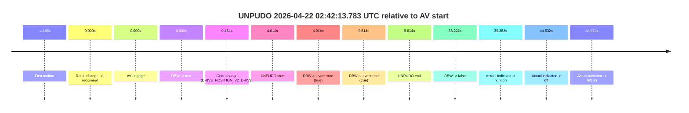

| Metric | Value |
|---|---|
| Outcome | `pass` |
| Effective failure type | `none` |
| Route change status | `not found` |
| DBW at event start | `true` |
| DBW at event end | `true` |
| Predicted gear at AV start | `DRIVE_POSITION_V2_DRIVE` |
| Actual gear at AV start | `DRIVE_POSITION_V2_PARK` |
| Predicted gear at event start | `DRIVE_POSITION_V2_DRIVE` |
| Actual gear at event start | `DRIVE_POSITION_V2_DRIVE` |
| Planned indicator direction | `INDICATORS_STATE_V2_RIGHT_ON` |
| Controller indicator direction | `INDICATORS_STATE_V2_OFF` |
| Actual indicator direction | `INDICATORS_STATE_V2_OFF` |
| Actual indicator at maneuver end | `INDICATORS_STATE_V2_OFF` |
| Driver accel help in AV | `false` |
| Driver accel help timestamp | `n/a` |
| Max accel pedal pct in AV | `0.0%` |
| Max brake pedal pct in AV | `11.1%` |
| Max speed mps in AV | `2.656` |
| Success timing baseline | `AV start` |
| Route -> AV | `n/a` |
| AV -> event start | `4.014s` |
| AV -> first motion | `-4.188s` |
| Success baseline -> event start | `4.014s` |
| Success baseline -> first motion | `-4.188s` |
| AV duration before disengagement | `38.221s` |
| Trajectory waypoint count | `37` |
| Driving-plan step count | `11` |

The scored portion starts from the AV-owned window, not from the pre-AV setup. Route-change search in the stopped pre-event segment was `not found`, with the baseline therefore set to AV start. At the event anchor the model predicts `DRIVE_POSITION_V2_DRIVE` and the actual gear is `DRIVE_POSITION_V2_DRIVE`. The effective model outcome is `pass` because `the credited unpudo stays AV-owned through the official unpudo window.`

### Resolution

| Field | Value |
|---|---|
| Final outcome | `pass` |
| Do we agree with this label? | `yes` |
| Source disengagement type | `none observed` |
| Resolved effective failure type | `none` |
| Confidence | `high` |

## unpudo 2026-04-22 02:51:46.333 UTC

| Field | Value |
|---|---|
| Model | `eel-teal-outspoken` |
| Author | `zak` |
| Run ID | `fme10010/2026-04-22--02-39-55--gen2-av-eb435b7c-0065-4b6d-81f5-518fd7e94716` |
| Date | `2026-04-22` |
| Time (UTC) | `02:51:46.333` |
| Event type | `unpudo` |
| Disengagement type | `none observed` |
| Route change | `found` |
| Console | [run](https://console.sso.wayve.ai/run/fme10010/2026-04-22--02-39-55--gen2-av-eb435b7c-0065-4b6d-81f5-518fd7e94716?id=&time-unixus=1776826306333313) |
| Foxglove | [segment](https://app.foxglove.dev/wayve-on-prem/p/prj_0dX18KZdVHg1fmmI/view?ds=foxglove-stream&ds.deviceName=fme10010&ds.start=2026-04-22T02%3A51%3A32.518277Z&ds.end=2026-04-22T02%3A52%3A37.509426Z&layoutId=lay_0e7VD4WIKDQGU73Y&time=2026-04-22T02%3A51%3A46.333313Z) |

### Event card: pass

- Pass: AV owns the credited unpudo from route change through the official unpudo window, the gear state is aligned at the anchor, and the vehicle moves without driver accelerator help in AV.

| Event | Time (UTC) | Delta from route change |
|---|---:|---:|
| Route change | 2026-04-22 02:51:42.518 | `0.000s` |
| AV engage | 2026-04-22 02:51:42.518 | `0.001s` |
| DBW -> true | 2026-04-22 02:51:42.518 | `0.001s` |
| Gear change (DRIVE_POSITION_V2_DRIVE) | 2026-04-22 02:51:42.783 | `0.265s` |
| UNPUDO start | 2026-04-22 02:51:46.333 | `3.815s` |
| DBW at event start (true) | 2026-04-22 02:51:46.333 | `3.815s` |
| First motion | 2026-04-22 02:51:46.380 | `3.863s` |
| DBW at event end (true) | 2026-04-22 02:51:50.233 | `7.715s` |
| UNPUDO end | 2026-04-22 02:51:50.233 | `7.715s` |
| DBW -> false | 2026-04-22 02:52:27.509 | `44.991s` |
| Actual indicator -> left on | 2026-04-22 02:52:29.660 | `47.143s` |
| Actual indicator -> off | 2026-04-22 02:52:40.700 | `58.183s` |

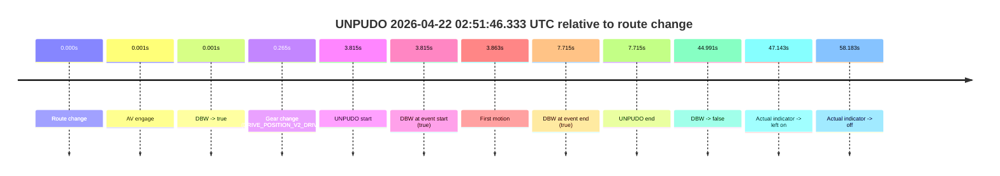

| Metric | Value |
|---|---|
| Outcome | `pass` |
| Effective failure type | `none` |
| Route change status | `found` |
| DBW at event start | `true` |
| DBW at event end | `true` |
| Predicted gear at AV start | `DRIVE_POSITION_V2_PARK` |
| Actual gear at AV start | `DRIVE_POSITION_V2_PARK` |
| Predicted gear at event start | `DRIVE_POSITION_V2_DRIVE` |
| Actual gear at event start | `DRIVE_POSITION_V2_DRIVE` |
| Planned indicator direction | `INDICATORS_STATE_V2_LEFT_ON` |
| Controller indicator direction | `INDICATORS_STATE_V2_LEFT_ON` |
| Actual indicator direction | `INDICATORS_STATE_V2_OFF` |
| Actual indicator at maneuver end | `INDICATORS_STATE_V2_OFF` |
| Driver accel help in AV | `false` |
| Driver accel help timestamp | `n/a` |
| Max accel pedal pct in AV | `0.0%` |
| Max brake pedal pct in AV | `8.0%` |
| Max speed mps in AV | `4.256` |
| Success timing baseline | `route change` |
| Route -> AV | `0.001s` |
| AV -> event start | `3.815s` |
| AV -> first motion | `3.862s` |
| Success baseline -> event start | `3.815s` |
| Success baseline -> first motion | `3.863s` |
| AV duration before disengagement | `44.991s` |
| Trajectory waypoint count | `38` |
| Driving-plan step count | `11` |

The scored portion starts from the AV-owned window, not from the pre-AV setup. Route-change search in the stopped pre-event segment was `found`, with the baseline therefore set to route change. At the event anchor the model predicts `DRIVE_POSITION_V2_DRIVE` and the actual gear is `DRIVE_POSITION_V2_DRIVE`. The effective model outcome is `pass` because `the credited unpudo stays AV-owned through the official unpudo window.`

### Resolution

| Field | Value |
|---|---|
| Final outcome | `pass` |
| Do we agree with this label? | `yes` |
| Source disengagement type | `none observed` |
| Resolved effective failure type | `none` |
| Confidence | `high` |

## unpudo 2026-04-22 02:58:53.533 UTC

| Field | Value |
|---|---|
| Model | `eel-teal-outspoken` |
| Author | `zak` |
| Run ID | `fme10010/2026-04-22--02-39-55--gen2-av-eb435b7c-0065-4b6d-81f5-518fd7e94716` |
| Date | `2026-04-22` |
| Time (UTC) | `02:58:53.533` |
| Event type | `unpudo` |
| Disengagement type | `none observed` |
| Route change | `found` |
| Console | [run](https://console.sso.wayve.ai/run/fme10010/2026-04-22--02-39-55--gen2-av-eb435b7c-0065-4b6d-81f5-518fd7e94716?id=&time-unixus=1776826733533311) |
| Foxglove | [segment](https://app.foxglove.dev/wayve-on-prem/p/prj_0dX18KZdVHg1fmmI/view?ds=foxglove-stream&ds.deviceName=fme10010&ds.start=2026-04-22T02%3A57%3A33.718264Z&ds.end=2026-04-22T02%3A59%3A27.449522Z&layoutId=lay_0e7VD4WIKDQGU73Y&time=2026-04-22T02%3A58%3A53.533311Z) |

### Event card: pass

- Pass: AV owns the credited unpudo from route change through the official unpudo window, the gear state is aligned at the anchor, and the vehicle moves without driver accelerator help in AV.

| Event | Time (UTC) | Delta from route change |
|---|---:|---:|
| Route change | 2026-04-22 02:57:43.718 | `0.000s` |
| First motion | 2026-04-22 02:57:43.720 | `0.003s` |
| Actual indicator -> right on | 2026-04-22 02:57:57.441 | `13.723s` |
| Actual indicator -> off | 2026-04-22 02:58:10.340 | `26.623s` |
| Actual indicator -> right on | 2026-04-22 02:58:14.160 | `30.443s` |
| Actual indicator -> off | 2026-04-22 02:58:14.880 | `31.163s` |
| Actual indicator -> left on | 2026-04-22 02:58:15.060 | `31.343s` |
| Actual indicator -> off | 2026-04-22 02:58:19.441 | `35.723s` |
| AV engage | 2026-04-22 02:58:49.428 | `65.711s` |
| DBW -> true | 2026-04-22 02:58:49.428 | `65.711s` |
| Gear change (DRIVE_POSITION_V2_DRIVE) | 2026-04-22 02:58:50.033 | `66.315s` |
| UNPUDO start | 2026-04-22 02:58:53.533 | `69.815s` |
| DBW at event start (true) | 2026-04-22 02:58:53.533 | `69.815s` |
| DBW at event end (true) | 2026-04-22 02:58:57.183 | `73.465s` |
| UNPUDO end | 2026-04-22 02:58:57.183 | `73.465s` |
| DBW -> false | 2026-04-22 02:59:17.449 | `93.731s` |

| Metric | Value |
|---|---|
| Outcome | `pass` |
| Effective failure type | `none` |
| Route change status | `found` |
| DBW at event start | `true` |
| DBW at event end | `true` |
| Predicted gear at AV start | `DRIVE_POSITION_V2_PARK` |
| Actual gear at AV start | `DRIVE_POSITION_V2_PARK` |
| Predicted gear at event start | `DRIVE_POSITION_V2_DRIVE` |
| Actual gear at event start | `DRIVE_POSITION_V2_DRIVE` |
| Planned indicator direction | `INDICATORS_STATE_V2_LEFT_ON` |
| Controller indicator direction | `INDICATORS_STATE_V2_LEFT_ON` |
| Actual indicator direction | `INDICATORS_STATE_V2_OFF` |
| Actual indicator at maneuver end | `INDICATORS_STATE_V2_OFF` |
| Driver accel help in AV | `false` |
| Driver accel help timestamp | `n/a` |
| Max accel pedal pct in AV | `0.0%` |
| Max brake pedal pct in AV | `8.0%` |
| Max speed mps in AV | `4.661` |
| Success timing baseline | `route change` |
| Route -> AV | `65.711s` |
| AV -> event start | `4.104s` |
| AV -> first motion | `-65.708s` |
| Success baseline -> event start | `69.815s` |
| Success baseline -> first motion | `0.003s` |
| AV duration before disengagement | `28.021s` |
| Trajectory waypoint count | `36` |
| Driving-plan step count | `11` |

The scored portion starts from the AV-owned window, not from the pre-AV setup. Route-change search in the stopped pre-event segment was `found`, with the baseline therefore set to route change. At the event anchor the model predicts `DRIVE_POSITION_V2_DRIVE` and the actual gear is `DRIVE_POSITION_V2_DRIVE`. The effective model outcome is `pass` because `the credited unpudo stays AV-owned through the official unpudo window.`

### Resolution

| Field | Value |
|---|---|
| Final outcome | `pass` |
| Do we agree with this label? | `yes` |
| Source disengagement type | `none observed` |
| Resolved effective failure type | `none` |
| Confidence | `high` |

## unpudo 2026-04-22 02:59:40.383 UTC

| Field | Value |
|---|---|
| Model | `eel-teal-outspoken` |
| Author | `zak` |
| Run ID | `fme10010/2026-04-22--02-39-55--gen2-av-eb435b7c-0065-4b6d-81f5-518fd7e94716` |
| Date | `2026-04-22` |
| Time (UTC) | `02:59:40.383` |
| Event type | `unpudo` |
| Disengagement type | `none observed` |
| Route change | `found` |
| Console | [run](https://console.sso.wayve.ai/run/fme10010/2026-04-22--02-39-55--gen2-av-eb435b7c-0065-4b6d-81f5-518fd7e94716?id=&time-unixus=1776826780383303) |
| Foxglove | [segment](https://app.foxglove.dev/wayve-on-prem/p/prj_0dX18KZdVHg1fmmI/view?ds=foxglove-stream&ds.deviceName=fme10010&ds.start=2026-04-22T02%3A57%3A33.718264Z&ds.end=2026-04-22T03%3A00%3A39.909406Z&layoutId=lay_0e7VD4WIKDQGU73Y&time=2026-04-22T02%3A59%3A40.383303Z) |

### Event card: pass

- Pass: AV owns the credited unpudo from route change through the official unpudo window, the gear state is aligned at the anchor, and the vehicle moves without driver accelerator help in AV.

| Event | Time (UTC) | Delta from route change |
|---|---:|---:|
| Route change | 2026-04-22 02:57:43.718 | `0.000s` |
| First motion | 2026-04-22 02:57:43.720 | `0.003s` |
| Actual indicator -> right on | 2026-04-22 02:57:57.441 | `13.723s` |
| Actual indicator -> off | 2026-04-22 02:58:10.340 | `26.623s` |
| Actual indicator -> right on | 2026-04-22 02:58:14.160 | `30.443s` |
| Actual indicator -> off | 2026-04-22 02:58:14.880 | `31.163s` |
| Actual indicator -> left on | 2026-04-22 02:58:15.060 | `31.343s` |
| Actual indicator -> off | 2026-04-22 02:58:19.441 | `35.723s` |
| AV engage | 2026-04-22 02:59:36.428 | `112.711s` |
| DBW -> true | 2026-04-22 02:59:36.428 | `112.711s` |
| Gear change (DRIVE_POSITION_V2_DRIVE) | 2026-04-22 02:59:36.833 | `113.115s` |
| UNPUDO start | 2026-04-22 02:59:40.383 | `116.665s` |
| DBW at event start (true) | 2026-04-22 02:59:40.383 | `116.665s` |
| DBW at event end (true) | 2026-04-22 02:59:44.483 | `120.765s` |
| UNPUDO end | 2026-04-22 02:59:44.483 | `120.765s` |
| DBW -> false | 2026-04-22 03:00:29.909 | `166.191s` |

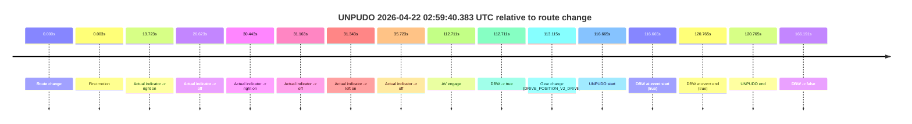

| Metric | Value |
|---|---|
| Outcome | `pass` |
| Effective failure type | `none` |
| Route change status | `found` |
| DBW at event start | `true` |
| DBW at event end | `true` |
| Predicted gear at AV start | `DRIVE_POSITION_V2_DRIVE` |
| Actual gear at AV start | `DRIVE_POSITION_V2_PARK` |
| Predicted gear at event start | `DRIVE_POSITION_V2_DRIVE` |
| Actual gear at event start | `DRIVE_POSITION_V2_DRIVE` |
| Planned indicator direction | `INDICATORS_STATE_V2_LEFT_ON` |
| Controller indicator direction | `INDICATORS_STATE_V2_LEFT_ON` |
| Actual indicator direction | `INDICATORS_STATE_V2_OFF` |
| Actual indicator at maneuver end | `INDICATORS_STATE_V2_OFF` |
| Driver accel help in AV | `false` |
| Driver accel help timestamp | `n/a` |
| Max accel pedal pct in AV | `0.0%` |
| Max brake pedal pct in AV | `10.1%` |
| Max speed mps in AV | `5.008` |
| Success timing baseline | `route change` |
| Route -> AV | `112.711s` |
| AV -> event start | `3.954s` |
| AV -> first motion | `-112.708s` |
| Success baseline -> event start | `116.665s` |
| Success baseline -> first motion | `0.003s` |
| AV duration before disengagement | `53.481s` |
| Trajectory waypoint count | `37` |
| Driving-plan step count | `11` |

The scored portion starts from the AV-owned window, not from the pre-AV setup. Route-change search in the stopped pre-event segment was `found`, with the baseline therefore set to route change. At the event anchor the model predicts `DRIVE_POSITION_V2_DRIVE` and the actual gear is `DRIVE_POSITION_V2_DRIVE`. The effective model outcome is `pass` because `the credited unpudo stays AV-owned through the official unpudo window.`

### Resolution

| Field | Value |
|---|---|
| Final outcome | `pass` |
| Do we agree with this label? | `yes` |
| Source disengagement type | `none observed` |
| Resolved effective failure type | `none` |
| Confidence | `high` |

## unpudo 2026-04-22 03:19:21.433 UTC

| Field | Value |
|---|---|
| Model | `eel-teal-outspoken` |
| Author | `zak` |
| Run ID | `fme10010/2026-04-22--02-39-55--gen2-av-eb435b7c-0065-4b6d-81f5-518fd7e94716` |
| Date | `2026-04-22` |
| Time (UTC) | `03:19:21.433` |
| Event type | `unpudo` |
| Disengagement type | `none observed` |
| Route change | `found` |
| Console | [run](https://console.sso.wayve.ai/run/fme10010/2026-04-22--02-39-55--gen2-av-eb435b7c-0065-4b6d-81f5-518fd7e94716?id=&time-unixus=1776827961433315) |
| Foxglove | [segment](https://app.foxglove.dev/wayve-on-prem/p/prj_0dX18KZdVHg1fmmI/view?ds=foxglove-stream&ds.deviceName=fme10010&ds.start=2026-04-22T03%3A17%3A37.568291Z&ds.end=2026-04-22T03%3A19%3A47.650147Z&layoutId=lay_0e7VD4WIKDQGU73Y&time=2026-04-22T03%3A19%3A21.433315Z) |

### Event card: pass

- Pass: AV owns the credited unpudo from route change through the official unpudo window, the gear state is aligned at the anchor, and the vehicle moves without driver accelerator help in AV.

| Event | Time (UTC) | Delta from route change |
|---|---:|---:|
| Route change | 2026-04-22 03:17:47.568 | `0.000s` |
| First motion | 2026-04-22 03:18:10.640 | `23.073s` |
| Actual indicator -> right on | 2026-04-22 03:18:14.200 | `26.633s` |
| Actual indicator -> off | 2026-04-22 03:18:16.640 | `29.073s` |
| AV engage | 2026-04-22 03:19:17.588 | `90.021s` |
| DBW -> true | 2026-04-22 03:19:17.588 | `90.021s` |
| Gear change (DRIVE_POSITION_V2_DRIVE) | 2026-04-22 03:19:17.933 | `90.365s` |
| UNPUDO start | 2026-04-22 03:19:21.433 | `93.865s` |
| DBW at event start (true) | 2026-04-22 03:19:21.433 | `93.865s` |
| DBW at event end (true) | 2026-04-22 03:19:25.183 | `97.615s` |
| UNPUDO end | 2026-04-22 03:19:25.183 | `97.615s` |
| DBW -> false | 2026-04-22 03:19:37.650 | `110.082s` |

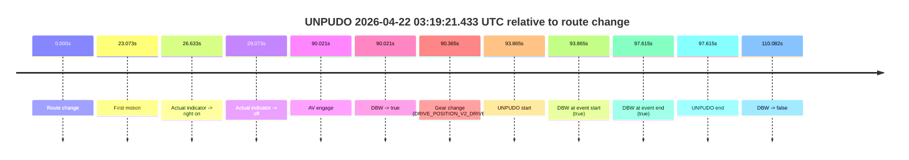

| Metric | Value |
|---|---|
| Outcome | `pass` |
| Effective failure type | `none` |
| Route change status | `found` |
| DBW at event start | `true` |
| DBW at event end | `true` |
| Predicted gear at AV start | `DRIVE_POSITION_V2_PARK` |
| Actual gear at AV start | `DRIVE_POSITION_V2_PARK` |
| Predicted gear at event start | `DRIVE_POSITION_V2_DRIVE` |
| Actual gear at event start | `DRIVE_POSITION_V2_DRIVE` |
| Planned indicator direction | `INDICATORS_STATE_V2_LEFT_ON` |
| Controller indicator direction | `INDICATORS_STATE_V2_LEFT_ON` |
| Actual indicator direction | `INDICATORS_STATE_V2_OFF` |
| Actual indicator at maneuver end | `INDICATORS_STATE_V2_OFF` |
| Driver accel help in AV | `false` |
| Driver accel help timestamp | `n/a` |
| Max accel pedal pct in AV | `0.0%` |
| Max brake pedal pct in AV | `8.0%` |
| Max speed mps in AV | `4.750` |
| Success timing baseline | `route change` |
| Route -> AV | `90.021s` |
| AV -> event start | `3.844s` |
| AV -> first motion | `-66.948s` |
| Success baseline -> event start | `93.865s` |
| Success baseline -> first motion | `23.073s` |
| AV duration before disengagement | `20.061s` |
| Trajectory waypoint count | `38` |
| Driving-plan step count | `11` |

The scored portion starts from the AV-owned window, not from the pre-AV setup. Route-change search in the stopped pre-event segment was `found`, with the baseline therefore set to route change. At the event anchor the model predicts `DRIVE_POSITION_V2_DRIVE` and the actual gear is `DRIVE_POSITION_V2_DRIVE`. The effective model outcome is `pass` because `the credited unpudo stays AV-owned through the official unpudo window.`

### Resolution

| Field | Value |
|---|---|
| Final outcome | `pass` |
| Do we agree with this label? | `yes` |
| Source disengagement type | `none observed` |
| Resolved effective failure type | `none` |
| Confidence | `high` |

## unpudo 2026-04-22 03:28:42.433 UTC

| Field | Value |
|---|---|
| Model | `eel-teal-outspoken` |
| Author | `zak` |
| Run ID | `fme10010/2026-04-22--02-39-55--gen2-av-eb435b7c-0065-4b6d-81f5-518fd7e94716` |
| Date | `2026-04-22` |
| Time (UTC) | `03:28:42.433` |
| Event type | `unpudo` |
| Disengagement type | `none observed` |
| Route change | `found` |
| Console | [run](https://console.sso.wayve.ai/run/fme10010/2026-04-22--02-39-55--gen2-av-eb435b7c-0065-4b6d-81f5-518fd7e94716?id=&time-unixus=1776828522433309) |
| Foxglove | [segment](https://app.foxglove.dev/wayve-on-prem/p/prj_0dX18KZdVHg1fmmI/view?ds=foxglove-stream&ds.deviceName=fme10010&ds.start=2026-04-22T03%3A27%3A35.368272Z&ds.end=2026-04-22T03%3A29%3A34.090006Z&layoutId=lay_0e7VD4WIKDQGU73Y&time=2026-04-22T03%3A28%3A42.433309Z) |

### Event card: pass

- Pass: AV owns the credited unpudo from route change through the official unpudo window, the gear state is aligned at the anchor, and the vehicle moves without driver accelerator help in AV.

| Event | Time (UTC) | Delta from route change |
|---|---:|---:|
| Route change | 2026-04-22 03:27:45.368 | `0.000s` |
| AV engage | 2026-04-22 03:28:38.488 | `53.121s` |
| DBW -> true | 2026-04-22 03:28:38.488 | `53.121s` |
| Gear change (DRIVE_POSITION_V2_DRIVE) | 2026-04-22 03:28:38.933 | `53.565s` |
| UNPUDO start | 2026-04-22 03:28:42.433 | `57.065s` |
| DBW at event start (true) | 2026-04-22 03:28:42.433 | `57.065s` |
| First motion | 2026-04-22 03:28:42.481 | `57.113s` |
| DBW at event end (true) | 2026-04-22 03:28:47.083 | `61.715s` |
| UNPUDO end | 2026-04-22 03:28:47.083 | `61.715s` |
| DBW -> false | 2026-04-22 03:29:24.090 | `98.722s` |
| Actual indicator -> right on | 2026-04-22 03:29:27.280 | `101.913s` |
| Actual indicator -> off | 2026-04-22 03:29:32.720 | `107.353s` |

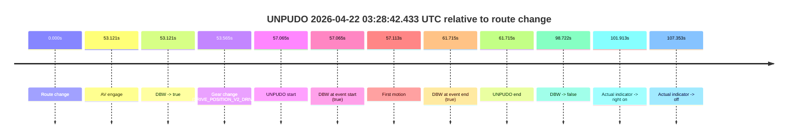

| Metric | Value |
|---|---|
| Outcome | `pass` |
| Effective failure type | `none` |
| Route change status | `found` |
| DBW at event start | `true` |
| DBW at event end | `true` |
| Predicted gear at AV start | `DRIVE_POSITION_V2_DRIVE` |
| Actual gear at AV start | `DRIVE_POSITION_V2_PARK` |
| Predicted gear at event start | `DRIVE_POSITION_V2_DRIVE` |
| Actual gear at event start | `DRIVE_POSITION_V2_DRIVE` |
| Planned indicator direction | `INDICATORS_STATE_V2_LEFT_ON` |
| Controller indicator direction | `INDICATORS_STATE_V2_LEFT_ON` |
| Actual indicator direction | `INDICATORS_STATE_V2_OFF` |
| Actual indicator at maneuver end | `INDICATORS_STATE_V2_OFF` |
| Driver accel help in AV | `false` |
| Driver accel help timestamp | `n/a` |
| Max accel pedal pct in AV | `0.0%` |
| Max brake pedal pct in AV | `11.6%` |
| Max speed mps in AV | `3.986` |
| Success timing baseline | `route change` |
| Route -> AV | `53.121s` |
| AV -> event start | `3.944s` |
| AV -> first motion | `3.993s` |
| Success baseline -> event start | `57.065s` |
| Success baseline -> first motion | `57.113s` |
| AV duration before disengagement | `45.601s` |
| Trajectory waypoint count | `38` |
| Driving-plan step count | `11` |

The scored portion starts from the AV-owned window, not from the pre-AV setup. Route-change search in the stopped pre-event segment was `found`, with the baseline therefore set to route change. At the event anchor the model predicts `DRIVE_POSITION_V2_DRIVE` and the actual gear is `DRIVE_POSITION_V2_DRIVE`. The effective model outcome is `pass` because `the credited unpudo stays AV-owned through the official unpudo window.`

### Resolution

| Field | Value |
|---|---|
| Final outcome | `pass` |
| Do we agree with this label? | `yes` |
| Source disengagement type | `none observed` |
| Resolved effective failure type | `none` |
| Confidence | `high` |

## unpudo 2026-04-22 03:30:30.283 UTC

| Field | Value |
|---|---|
| Model | `eel-teal-outspoken` |
| Author | `zak` |
| Run ID | `fme10010/2026-04-22--02-39-55--gen2-av-eb435b7c-0065-4b6d-81f5-518fd7e94716` |
| Date | `2026-04-22` |
| Time (UTC) | `03:30:30.283` |
| Event type | `unpudo` |
| Disengagement type | `none observed` |
| Route change | `found` |
| Console | [run](https://console.sso.wayve.ai/run/fme10010/2026-04-22--02-39-55--gen2-av-eb435b7c-0065-4b6d-81f5-518fd7e94716?id=&time-unixus=1776828630283299) |
| Foxglove | [segment](https://app.foxglove.dev/wayve-on-prem/p/prj_0dX18KZdVHg1fmmI/view?ds=foxglove-stream&ds.deviceName=fme10010&ds.start=2026-04-22T03%3A29%3A43.268278Z&ds.end=2026-04-22T03%3A30%3A44.389342Z&layoutId=lay_0e7VD4WIKDQGU73Y&time=2026-04-22T03%3A30%3A30.283299Z) |

### Event card: pass

- Pass: AV owns the credited unpudo from route change through the official unpudo window, the gear state is aligned at the anchor, and the vehicle moves without driver accelerator help in AV.

| Event | Time (UTC) | Delta from route change |
|---|---:|---:|
| Route change | 2026-04-22 03:29:53.268 | `0.000s` |
| First motion | 2026-04-22 03:29:58.240 | `4.973s` |
| AV engage | 2026-04-22 03:30:26.288 | `33.021s` |
| DBW -> true | 2026-04-22 03:30:26.288 | `33.021s` |
| Gear change (DRIVE_POSITION_V2_DRIVE) | 2026-04-22 03:30:26.733 | `33.465s` |
| UNPUDO start | 2026-04-22 03:30:30.283 | `37.015s` |
| DBW at event start (true) | 2026-04-22 03:30:30.283 | `37.015s` |
| DBW at event end (true) | 2026-04-22 03:30:33.983 | `40.715s` |
| UNPUDO end | 2026-04-22 03:30:33.983 | `40.715s` |
| DBW -> false | 2026-04-22 03:30:34.389 | `41.121s` |
| Actual indicator -> right on | 2026-04-22 03:30:34.581 | `41.313s` |
| Actual indicator -> off | 2026-04-22 03:30:53.580 | `60.313s` |

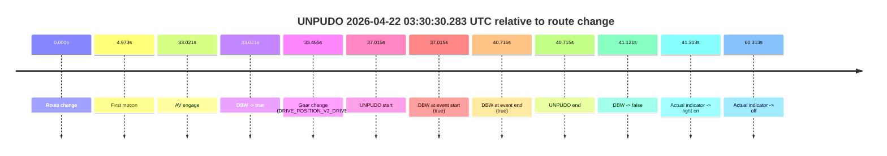

| Metric | Value |
|---|---|
| Outcome | `pass` |
| Effective failure type | `none` |
| Route change status | `found` |
| DBW at event start | `true` |
| DBW at event end | `true` |
| Predicted gear at AV start | `DRIVE_POSITION_V2_DRIVE` |
| Actual gear at AV start | `DRIVE_POSITION_V2_PARK` |
| Predicted gear at event start | `DRIVE_POSITION_V2_DRIVE` |
| Actual gear at event start | `DRIVE_POSITION_V2_DRIVE` |
| Planned indicator direction | `INDICATORS_STATE_V2_OFF` |
| Controller indicator direction | `INDICATORS_STATE_V2_OFF` |
| Actual indicator direction | `INDICATORS_STATE_V2_OFF` |
| Actual indicator at maneuver end | `INDICATORS_STATE_V2_OFF` |
| Driver accel help in AV | `false` |
| Driver accel help timestamp | `n/a` |
| Max accel pedal pct in AV | `0.0%` |
| Max brake pedal pct in AV | `8.0%` |
| Max speed mps in AV | `3.706` |
| Success timing baseline | `route change` |
| Route -> AV | `33.021s` |
| AV -> event start | `3.994s` |
| AV -> first motion | `-28.048s` |
| Success baseline -> event start | `37.015s` |
| Success baseline -> first motion | `4.973s` |
| AV duration before disengagement | `8.100s` |
| Trajectory waypoint count | `37` |
| Driving-plan step count | `11` |

The scored portion starts from the AV-owned window, not from the pre-AV setup. Route-change search in the stopped pre-event segment was `found`, with the baseline therefore set to route change. At the event anchor the model predicts `DRIVE_POSITION_V2_DRIVE` and the actual gear is `DRIVE_POSITION_V2_DRIVE`. The effective model outcome is `pass` because `the credited unpudo stays AV-owned through the official unpudo window.`

### Resolution

| Field | Value |
|---|---|
| Final outcome | `pass` |
| Do we agree with this label? | `yes` |
| Source disengagement type | `none observed` |
| Resolved effective failure type | `none` |
| Confidence | `high` |

## unpudo 2026-04-22 03:32:27.033 UTC

| Field | Value |
|---|---|
| Model | `eel-teal-outspoken` |
| Author | `zak` |
| Run ID | `fme10010/2026-04-22--02-39-55--gen2-av-eb435b7c-0065-4b6d-81f5-518fd7e94716` |
| Date | `2026-04-22` |
| Time (UTC) | `03:32:27.033` |
| Event type | `unpudo` |
| Disengagement type | `failed_to_unpudo` |
| Route change | `found` |
| Console | [run](https://console.sso.wayve.ai/run/fme10010/2026-04-22--02-39-55--gen2-av-eb435b7c-0065-4b6d-81f5-518fd7e94716?id=&time-unixus=1776828747033305) |
| Foxglove | [segment](https://app.foxglove.dev/wayve-on-prem/p/prj_0dX18KZdVHg1fmmI/view?ds=foxglove-stream&ds.deviceName=fme10010&ds.start=2026-04-22T03%3A32%3A13.218277Z&ds.end=2026-04-22T03%3A32%3A43.733296Z&layoutId=lay_0e7VD4WIKDQGU73Y&time=2026-04-22T03%3A32%3A27.033305Z) |

### Event card: fail

- Fail: AV owns part of the segment, but the event still resolves as a model-performance failure under the AV-only scoring rule.

| Event | Time (UTC) | Delta from route change |
|---|---:|---:|
| Route change | 2026-04-22 03:32:23.218 | `0.000s` |
| AV engage | 2026-04-22 03:32:23.218 | `0.001s` |
| DBW -> true | 2026-04-22 03:32:23.218 | `0.001s` |
| Gear change (DRIVE_POSITION_V2_DRIVE) | 2026-04-22 03:32:23.533 | `0.315s` |
| UNPUDO start | 2026-04-22 03:32:27.033 | `3.815s` |
| DBW at event start (true) | 2026-04-22 03:32:27.033 | `3.815s` |
| First motion | 2026-04-22 03:32:27.061 | `3.843s` |
| DBW -> false | 2026-04-22 03:32:27.709 | `4.491s` |
| Actual indicator -> left on | 2026-04-22 03:32:28.221 | `5.003s` |
| Actual indicator -> off | 2026-04-22 03:32:30.981 | `7.763s` |
| DBW at event end (true) | 2026-04-22 03:32:33.733 | `10.515s` |
| UNPUDO end | 2026-04-22 03:32:33.733 | `10.515s` |

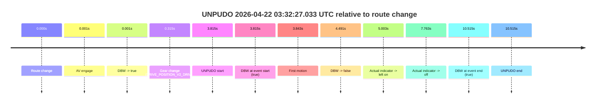

| Metric | Value |
|---|---|
| Outcome | `fail` |
| Effective failure type | `failed_to_unpudo` |
| Route change status | `found` |
| DBW at event start | `true` |
| DBW at event end | `true` |
| Predicted gear at AV start | `DRIVE_POSITION_V2_PARK` |
| Actual gear at AV start | `DRIVE_POSITION_V2_PARK` |
| Predicted gear at event start | `DRIVE_POSITION_V2_DRIVE` |
| Actual gear at event start | `DRIVE_POSITION_V2_DRIVE` |
| Planned indicator direction | `INDICATORS_STATE_V2_OFF` |
| Controller indicator direction | `INDICATORS_STATE_V2_OFF` |
| Actual indicator direction | `INDICATORS_STATE_V2_OFF` |
| Actual indicator at maneuver end | `INDICATORS_STATE_V2_OFF` |
| Driver accel help in AV | `false` |
| Driver accel help timestamp | `n/a` |
| Max accel pedal pct in AV | `0.0%` |
| Max brake pedal pct in AV | `8.0%` |
| Max speed mps in AV | `1.408` |
| Success timing baseline | `route change` |
| Route -> AV | `0.001s` |
| AV -> event start | `3.814s` |
| AV -> first motion | `3.842s` |
| Success baseline -> event start | `3.815s` |
| Success baseline -> first motion | `3.843s` |
| AV duration before disengagement | `4.491s` |
| Trajectory waypoint count | `36` |
| Driving-plan step count | `11` |

The scored portion starts from the AV-owned window, not from the pre-AV setup. Route-change search in the stopped pre-event segment was `found`, with the baseline therefore set to route change. At the event anchor the model predicts `DRIVE_POSITION_V2_DRIVE` and the actual gear is `DRIVE_POSITION_V2_DRIVE`. The effective model outcome is `fail` because `failed_to_unpudo.`

### Resolution

| Field | Value |
|---|---|
| Final outcome | `fail` |
| Do we agree with this label? | `yes` |
| Source disengagement type | `failed_to_unpudo` |
| Resolved effective failure type | `failed_to_unpudo` |
| Confidence | `high` |

## unpudo 2026-04-22 03:37:05.683 UTC

| Field | Value |
|---|---|
| Model | `eel-teal-outspoken` |
| Author | `zak` |
| Run ID | `fme10010/2026-04-22--02-39-55--gen2-av-eb435b7c-0065-4b6d-81f5-518fd7e94716` |
| Date | `2026-04-22` |
| Time (UTC) | `03:37:05.683` |
| Event type | `unpudo` |
| Disengagement type | `none observed` |
| Route change | `found` |
| Console | [run](https://console.sso.wayve.ai/run/fme10010/2026-04-22--02-39-55--gen2-av-eb435b7c-0065-4b6d-81f5-518fd7e94716?id=&time-unixus=1776829025683295) |
| Foxglove | [segment](https://app.foxglove.dev/wayve-on-prem/p/prj_0dX18KZdVHg1fmmI/view?ds=foxglove-stream&ds.deviceName=fme10010&ds.start=2026-04-22T03%3A36%3A27.268252Z&ds.end=2026-04-22T03%3A37%3A19.783313Z&layoutId=lay_0e7VD4WIKDQGU73Y&time=2026-04-22T03%3A37%3A05.683295Z) |

### Event card: fail

- Fail: the credited unpudo does not stay AV-owned. The event window starts with DBW false, and the maneuver outcome lands outside a clean AV-owned segment.

| Event | Time (UTC) | Delta from route change |
|---|---:|---:|
| Route change | 2026-04-22 03:36:37.268 | `0.000s` |
| AV engage | 2026-04-22 03:36:41.048 | `3.781s` |
| DBW -> true | 2026-04-22 03:36:41.048 | `3.781s` |
| Actual indicator -> left on | 2026-04-22 03:36:46.901 | `9.633s` |
| Actual indicator -> off | 2026-04-22 03:36:48.801 | `11.533s` |
| First motion | 2026-04-22 03:36:52.561 | `15.293s` |
| DBW -> false | 2026-04-22 03:36:57.588 | `20.321s` |
| Gear change (DRIVE_POSITION_V2_DRIVE) | 2026-04-22 03:37:05.683 | `28.415s` |
| UNPUDO start | 2026-04-22 03:37:05.683 | `28.415s` |
| DBW at event start (false) | 2026-04-22 03:37:05.683 | `28.415s` |
| DBW at event end (false) | 2026-04-22 03:37:09.783 | `32.515s` |
| UNPUDO end | 2026-04-22 03:37:09.783 | `32.515s` |
| Actual indicator -> left on | 2026-04-22 03:37:16.441 | `39.173s` |
| Actual indicator -> off | 2026-04-22 03:37:18.340 | `41.073s` |

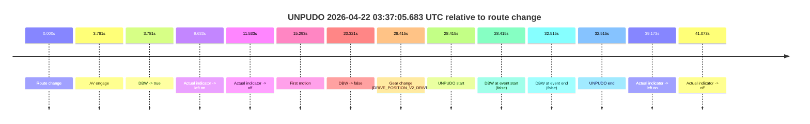

| Metric | Value |
|---|---|
| Outcome | `fail` |
| Effective failure type | `not_av_owned` |
| Route change status | `found` |
| DBW at event start | `false` |
| DBW at event end | `false` |
| Predicted gear at AV start | `DRIVE_POSITION_V2_DRIVE` |
| Actual gear at AV start | `DRIVE_POSITION_V2_PARK` |
| Predicted gear at event start | `DRIVE_POSITION_V2_DRIVE` |
| Actual gear at event start | `DRIVE_POSITION_V2_DRIVE` |
| Planned indicator direction | `INDICATORS_STATE_V2_OFF` |
| Controller indicator direction | `INDICATORS_STATE_V2_OFF` |
| Actual indicator direction | `INDICATORS_STATE_V2_OFF` |
| Actual indicator at maneuver end | `INDICATORS_STATE_V2_OFF` |
| Driver accel help in AV | `false` |
| Driver accel help timestamp | `n/a` |
| Max accel pedal pct in AV | `0.0%` |
| Max brake pedal pct in AV | `8.0%` |
| Max speed mps in AV | `4.064` |
| Success timing baseline | `route change` |
| Route -> AV | `3.781s` |
| AV -> event start | `24.634s` |
| AV -> first motion | `11.512s` |
| Success baseline -> event start | `28.415s` |
| Success baseline -> first motion | `15.293s` |
| AV duration before disengagement | `16.540s` |
| Trajectory waypoint count | `37` |
| Driving-plan step count | `11` |

The scored portion starts from the AV-owned window, not from the pre-AV setup. Route-change search in the stopped pre-event segment was `found`, with the baseline therefore set to route change. At the event anchor the model predicts `DRIVE_POSITION_V2_DRIVE` and the actual gear is `DRIVE_POSITION_V2_DRIVE`. The effective model outcome is `fail` because `not_av_owned.`

### Resolution

| Field | Value |
|---|---|
| Final outcome | `fail` |
| Do we agree with this label? | `yes` |
| Source disengagement type | `none observed` |
| Resolved effective failure type | `not_av_owned` |
| Confidence | `high` |

## unpudo 2026-04-22 03:42:25.633 UTC

| Field | Value |
|---|---|
| Model | `eel-teal-outspoken` |
| Author | `zak` |
| Run ID | `fme10010/2026-04-22--02-39-55--gen2-av-eb435b7c-0065-4b6d-81f5-518fd7e94716` |
| Date | `2026-04-22` |
| Time (UTC) | `03:42:25.633` |
| Event type | `unpudo` |
| Disengagement type | `none observed` |
| Route change | `found` |
| Console | [run](https://console.sso.wayve.ai/run/fme10010/2026-04-22--02-39-55--gen2-av-eb435b7c-0065-4b6d-81f5-518fd7e94716?id=&time-unixus=1776829345633303) |
| Foxglove | [segment](https://app.foxglove.dev/wayve-on-prem/p/prj_0dX18KZdVHg1fmmI/view?ds=foxglove-stream&ds.deviceName=fme10010&ds.start=2026-04-22T03%3A42%3A05.868479Z&ds.end=2026-04-22T03%3A42%3A52.569386Z&layoutId=lay_0e7VD4WIKDQGU73Y&time=2026-04-22T03%3A42%3A25.633303Z) |

### Event card: pass

- Pass: AV owns the credited unpudo from route change through the official unpudo window, the gear state is aligned at the anchor, and the vehicle moves without driver accelerator help in AV.

| Event | Time (UTC) | Delta from route change |
|---|---:|---:|
| Route change | 2026-04-22 03:42:15.868 | `0.000s` |
| AV engage | 2026-04-22 03:42:21.648 | `5.780s` |
| DBW -> true | 2026-04-22 03:42:21.648 | `5.780s` |
| Gear change (DRIVE_POSITION_V2_DRIVE) | 2026-04-22 03:42:22.033 | `6.165s` |
| Actual indicator -> left on | 2026-04-22 03:42:22.600 | `6.732s` |
| Actual indicator -> off | 2026-04-22 03:42:24.500 | `8.632s` |
| UNPUDO start | 2026-04-22 03:42:25.633 | `9.765s` |
| DBW at event start (true) | 2026-04-22 03:42:25.633 | `9.765s` |
| First motion | 2026-04-22 03:42:25.660 | `9.792s` |
| DBW at event end (true) | 2026-04-22 03:42:29.233 | `13.365s` |
| UNPUDO end | 2026-04-22 03:42:29.233 | `13.365s` |
| DBW -> false | 2026-04-22 03:42:42.569 | `26.701s` |
| Actual indicator -> right on | 2026-04-22 03:42:43.081 | `27.213s` |
| Actual indicator -> off | 2026-04-22 03:42:45.500 | `29.632s` |

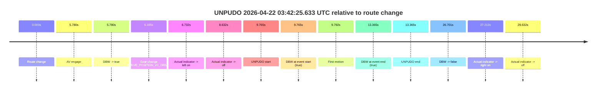

| Metric | Value |
|---|---|
| Outcome | `pass` |
| Effective failure type | `none` |
| Route change status | `found` |
| DBW at event start | `true` |
| DBW at event end | `true` |
| Predicted gear at AV start | `DRIVE_POSITION_V2_PARK` |
| Actual gear at AV start | `DRIVE_POSITION_V2_PARK` |
| Predicted gear at event start | `DRIVE_POSITION_V2_DRIVE` |
| Actual gear at event start | `DRIVE_POSITION_V2_DRIVE` |
| Planned indicator direction | `INDICATORS_STATE_V2_LEFT_ON` |
| Controller indicator direction | `INDICATORS_STATE_V2_LEFT_ON` |
| Actual indicator direction | `INDICATORS_STATE_V2_OFF` |
| Actual indicator at maneuver end | `INDICATORS_STATE_V2_OFF` |
| Driver accel help in AV | `false` |
| Driver accel help timestamp | `n/a` |
| Max accel pedal pct in AV | `0.0%` |
| Max brake pedal pct in AV | `8.0%` |
| Max speed mps in AV | `4.864` |
| Success timing baseline | `route change` |
| Route -> AV | `5.780s` |
| AV -> event start | `3.984s` |
| AV -> first motion | `4.012s` |
| Success baseline -> event start | `9.765s` |
| Success baseline -> first motion | `9.792s` |
| AV duration before disengagement | `20.921s` |
| Trajectory waypoint count | `38` |
| Driving-plan step count | `11` |

The scored portion starts from the AV-owned window, not from the pre-AV setup. Route-change search in the stopped pre-event segment was `found`, with the baseline therefore set to route change. At the event anchor the model predicts `DRIVE_POSITION_V2_DRIVE` and the actual gear is `DRIVE_POSITION_V2_DRIVE`. The effective model outcome is `pass` because `the credited unpudo stays AV-owned through the official unpudo window.`

### Resolution

| Field | Value |
|---|---|
| Final outcome | `pass` |
| Do we agree with this label? | `yes` |
| Source disengagement type | `none observed` |
| Resolved effective failure type | `none` |
| Confidence | `high` |

## unpudo 2026-04-22 04:11:51.483 UTC

| Field | Value |
|---|---|
| Model | `eel-teal-outspoken` |
| Author | `zak` |
| Run ID | `fme10010/2026-04-22--02-39-55--gen2-av-eb435b7c-0065-4b6d-81f5-518fd7e94716` |
| Date | `2026-04-22` |
| Time (UTC) | `04:11:51.483` |
| Event type | `unpudo` |
| Disengagement type | `none observed` |
| Route change | `found` |
| Console | [run](https://console.sso.wayve.ai/run/fme10010/2026-04-22--02-39-55--gen2-av-eb435b7c-0065-4b6d-81f5-518fd7e94716?id=&time-unixus=1776831111483306) |
| Foxglove | [segment](https://app.foxglove.dev/wayve-on-prem/p/prj_0dX18KZdVHg1fmmI/view?ds=foxglove-stream&ds.deviceName=fme10010&ds.start=2026-04-22T04%3A11%3A36.668262Z&ds.end=2026-04-22T04%3A12%3A24.068835Z&layoutId=lay_0e7VD4WIKDQGU73Y&time=2026-04-22T04%3A11%3A51.483306Z) |

### Event card: pass

- Pass: AV owns the credited unpudo from route change through the official unpudo window, the gear state is aligned at the anchor, and the vehicle moves without driver accelerator help in AV.

| Event | Time (UTC) | Delta from route change |
|---|---:|---:|
| Actual indicator already right on | 2026-04-22 04:11:36.680 | `-9.987s` |
| Actual indicator -> off | 2026-04-22 04:11:38.420 | `-8.247s` |
| Route change | 2026-04-22 04:11:46.668 | `0.000s` |
| AV engage | 2026-04-22 04:11:47.588 | `0.921s` |
| DBW -> true | 2026-04-22 04:11:47.588 | `0.921s` |
| Gear change (DRIVE_POSITION_V2_DRIVE) | 2026-04-22 04:11:47.983 | `1.315s` |
| UNPUDO start | 2026-04-22 04:11:51.483 | `4.815s` |
| DBW at event start (true) | 2026-04-22 04:11:51.483 | `4.815s` |
| First motion | 2026-04-22 04:11:51.540 | `4.873s` |
| DBW at event end (true) | 2026-04-22 04:11:55.583 | `8.915s` |
| UNPUDO end | 2026-04-22 04:11:55.583 | `8.915s` |
| DBW -> false | 2026-04-22 04:12:14.068 | `27.401s` |
| Actual indicator -> right on | 2026-04-22 04:12:21.560 | `34.893s` |
| Actual indicator -> off | 2026-04-22 04:12:26.540 | `39.873s` |

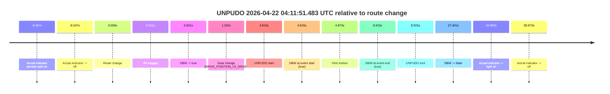

| Metric | Value |
|---|---|
| Outcome | `pass` |
| Effective failure type | `none` |
| Route change status | `found` |
| DBW at event start | `true` |
| DBW at event end | `true` |
| Predicted gear at AV start | `DRIVE_POSITION_V2_DRIVE` |
| Actual gear at AV start | `DRIVE_POSITION_V2_PARK` |
| Predicted gear at event start | `DRIVE_POSITION_V2_DRIVE` |
| Actual gear at event start | `DRIVE_POSITION_V2_DRIVE` |
| Planned indicator direction | `INDICATORS_STATE_V2_LEFT_ON` |
| Controller indicator direction | `INDICATORS_STATE_V2_LEFT_ON` |
| Actual indicator direction | `INDICATORS_STATE_V2_OFF` |
| Actual indicator at maneuver end | `INDICATORS_STATE_V2_OFF` |
| Driver accel help in AV | `false` |
| Driver accel help timestamp | `n/a` |
| Max accel pedal pct in AV | `0.0%` |
| Max brake pedal pct in AV | `8.0%` |
| Max speed mps in AV | `4.575` |
| Success timing baseline | `route change` |
| Route -> AV | `0.921s` |
| AV -> event start | `3.894s` |
| AV -> first motion | `3.952s` |
| Success baseline -> event start | `4.815s` |
| Success baseline -> first motion | `4.873s` |
| AV duration before disengagement | `26.480s` |
| Trajectory waypoint count | `37` |
| Driving-plan step count | `11` |

The scored portion starts from the AV-owned window, not from the pre-AV setup. Route-change search in the stopped pre-event segment was `found`, with the baseline therefore set to route change. At the event anchor the model predicts `DRIVE_POSITION_V2_DRIVE` and the actual gear is `DRIVE_POSITION_V2_DRIVE`. The effective model outcome is `pass` because `the credited unpudo stays AV-owned through the official unpudo window.`

### Resolution

| Field | Value |
|---|---|
| Final outcome | `pass` |
| Do we agree with this label? | `yes` |
| Source disengagement type | `none observed` |
| Resolved effective failure type | `none` |
| Confidence | `high` |

## unpudo 2026-04-22 04:13:22.283 UTC

| Field | Value |
|---|---|
| Model | `eel-teal-outspoken` |
| Author | `zak` |
| Run ID | `fme10010/2026-04-22--02-39-55--gen2-av-eb435b7c-0065-4b6d-81f5-518fd7e94716` |
| Date | `2026-04-22` |
| Time (UTC) | `04:13:22.283` |
| Event type | `unpudo` |
| Disengagement type | `failed_to_slow` |
| Route change | `found` |
| Console | [run](https://console.sso.wayve.ai/run/fme10010/2026-04-22--02-39-55--gen2-av-eb435b7c-0065-4b6d-81f5-518fd7e94716?id=&time-unixus=1776831202283290) |
| Foxglove | [segment](https://app.foxglove.dev/wayve-on-prem/p/prj_0dX18KZdVHg1fmmI/view?ds=foxglove-stream&ds.deviceName=fme10010&ds.start=2026-04-22T04%3A11%3A36.668262Z&ds.end=2026-04-22T04%3A13%3A57.233298Z&layoutId=lay_0e7VD4WIKDQGU73Y&time=2026-04-22T04%3A13%3A22.283290Z) |

### Event card: fail

- Fail: AV owns part of the segment, but the event still resolves as a model-performance failure under the AV-only scoring rule.

| Event | Time (UTC) | Delta from route change |
|---|---:|---:|
| Actual indicator already right on | 2026-04-22 04:11:36.680 | `-9.987s` |
| Actual indicator -> off | 2026-04-22 04:11:38.420 | `-8.247s` |
| Route change | 2026-04-22 04:11:46.668 | `0.000s` |
| First motion | 2026-04-22 04:11:51.540 | `4.873s` |
| Actual indicator -> right on | 2026-04-22 04:12:21.560 | `34.893s` |
| Actual indicator -> off | 2026-04-22 04:12:26.540 | `39.873s` |
| Actual indicator -> right on | 2026-04-22 04:13:07.240 | `80.573s` |
| Actual indicator -> off | 2026-04-22 04:13:09.640 | `82.973s` |
| AV engage | 2026-04-22 04:13:17.988 | `91.321s` |
| DBW -> true | 2026-04-22 04:13:17.988 | `91.321s` |
| Gear change (DRIVE_POSITION_V2_DRIVE) | 2026-04-22 04:13:18.733 | `92.065s` |
| UNPUDO start | 2026-04-22 04:13:22.283 | `95.615s` |
| DBW at event start (true) | 2026-04-22 04:13:22.283 | `95.615s` |
| DBW -> false | 2026-04-22 04:13:23.269 | `96.601s` |
| Actual indicator -> left on | 2026-04-22 04:13:39.621 | `112.954s` |
| Actual indicator -> off | 2026-04-22 04:13:44.640 | `117.973s` |
| DBW at event end (true) | 2026-04-22 04:13:47.233 | `120.565s` |
| UNPUDO end | 2026-04-22 04:13:47.233 | `120.565s` |

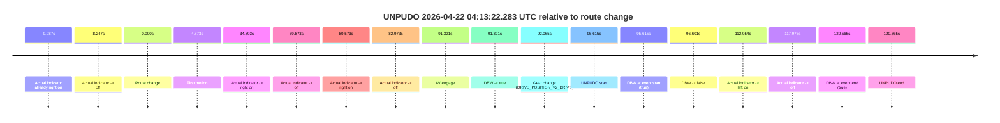

| Metric | Value |
|---|---|
| Outcome | `fail` |
| Effective failure type | `failed_to_slow` |
| Route change status | `found` |
| DBW at event start | `true` |
| DBW at event end | `true` |
| Predicted gear at AV start | `DRIVE_POSITION_V2_PARK` |
| Actual gear at AV start | `DRIVE_POSITION_V2_PARK` |
| Predicted gear at event start | `DRIVE_POSITION_V2_DRIVE` |
| Actual gear at event start | `DRIVE_POSITION_V2_DRIVE` |
| Planned indicator direction | `INDICATORS_STATE_V2_LEFT_ON` |
| Controller indicator direction | `INDICATORS_STATE_V2_LEFT_ON` |
| Actual indicator direction | `INDICATORS_STATE_V2_OFF` |
| Actual indicator at maneuver end | `INDICATORS_STATE_V2_OFF` |
| Driver accel help in AV | `false` |
| Driver accel help timestamp | `n/a` |
| Max accel pedal pct in AV | `0.0%` |
| Max brake pedal pct in AV | `44.8%` |
| Max speed mps in AV | `0.953` |
| Success timing baseline | `route change` |
| Route -> AV | `91.321s` |
| AV -> event start | `4.294s` |
| AV -> first motion | `-86.448s` |
| Success baseline -> event start | `95.615s` |
| Success baseline -> first motion | `4.873s` |
| AV duration before disengagement | `5.281s` |
| Trajectory waypoint count | `37` |
| Driving-plan step count | `11` |

The scored portion starts from the AV-owned window, not from the pre-AV setup. Route-change search in the stopped pre-event segment was `found`, with the baseline therefore set to route change. At the event anchor the model predicts `DRIVE_POSITION_V2_DRIVE` and the actual gear is `DRIVE_POSITION_V2_DRIVE`. The effective model outcome is `fail` because `failed_to_slow.`

### Resolution

| Field | Value |
|---|---|
| Final outcome | `fail` |
| Do we agree with this label? | `yes` |
| Source disengagement type | `failed_to_slow` |
| Resolved effective failure type | `failed_to_slow` |
| Confidence | `high` |

## unpudo 2026-04-22 04:14:58.933 UTC

| Field | Value |
|---|---|
| Model | `eel-teal-outspoken` |
| Author | `zak` |
| Run ID | `fme10010/2026-04-22--02-39-55--gen2-av-eb435b7c-0065-4b6d-81f5-518fd7e94716` |
| Date | `2026-04-22` |
| Time (UTC) | `04:14:58.933` |
| Event type | `unpudo` |
| Disengagement type | `failed_to_unpudo` |
| Route change | `found` |
| Console | [run](https://console.sso.wayve.ai/run/fme10010/2026-04-22--02-39-55--gen2-av-eb435b7c-0065-4b6d-81f5-518fd7e94716?id=&time-unixus=1776831298933317) |
| Foxglove | [segment](https://app.foxglove.dev/wayve-on-prem/p/prj_0dX18KZdVHg1fmmI/view?ds=foxglove-stream&ds.deviceName=fme10010&ds.start=2026-04-22T04%3A13%3A09.768251Z&ds.end=2026-04-22T04%3A15%3A22.483307Z&layoutId=lay_0e7VD4WIKDQGU73Y&time=2026-04-22T04%3A14%3A58.933317Z) |

### Event card: fail

- Fail: AV owns part of the segment, but the event still resolves as a model-performance failure under the AV-only scoring rule.

| Event | Time (UTC) | Delta from route change |
|---|---:|---:|
| Route change | 2026-04-22 04:13:19.768 | `0.000s` |
| First motion | 2026-04-22 04:13:22.320 | `2.553s` |
| Actual indicator -> left on | 2026-04-22 04:13:39.621 | `19.854s` |
| Actual indicator -> off | 2026-04-22 04:13:44.640 | `24.873s` |
| AV engage | 2026-04-22 04:14:23.729 | `63.961s` |
| DBW -> true | 2026-04-22 04:14:23.729 | `63.961s` |
| Gear change (DRIVE_POSITION_V2_DRIVE) | 2026-04-22 04:14:55.383 | `95.615s` |
| DBW -> false | 2026-04-22 04:14:58.769 | `99.001s` |
| UNPUDO start | 2026-04-22 04:14:58.933 | `99.165s` |
| DBW at event start (false) | 2026-04-22 04:14:58.933 | `99.165s` |
| DBW at event end (false) | 2026-04-22 04:15:12.483 | `112.715s` |
| UNPUDO end | 2026-04-22 04:15:12.483 | `112.715s` |
| Actual indicator -> right on | 2026-04-22 04:15:16.600 | `116.833s` |
| Actual indicator -> off | 2026-04-22 04:15:25.260 | `125.493s` |

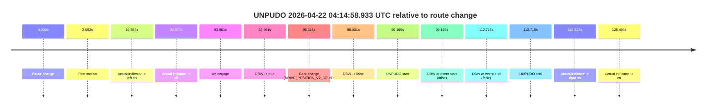

| Metric | Value |
|---|---|
| Outcome | `fail` |
| Effective failure type | `failed_to_unpudo` |
| Route change status | `found` |
| DBW at event start | `false` |
| DBW at event end | `false` |
| Predicted gear at AV start | `DRIVE_POSITION_V2_DRIVE` |
| Actual gear at AV start | `DRIVE_POSITION_V2_DRIVE` |
| Predicted gear at event start | `DRIVE_POSITION_V2_DRIVE` |
| Actual gear at event start | `DRIVE_POSITION_V2_DRIVE` |
| Planned indicator direction | `INDICATORS_STATE_V2_LEFT_ON` |
| Controller indicator direction | `INDICATORS_STATE_V2_LEFT_ON` |
| Actual indicator direction | `INDICATORS_STATE_V2_OFF` |
| Actual indicator at maneuver end | `INDICATORS_STATE_V2_OFF` |
| Driver accel help in AV | `false` |
| Driver accel help timestamp | `n/a` |
| Max accel pedal pct in AV | `0.0%` |
| Max brake pedal pct in AV | `19.0%` |
| Max speed mps in AV | `10.458` |
| Success timing baseline | `route change` |
| Route -> AV | `63.961s` |
| AV -> event start | `35.204s` |
| AV -> first motion | `-61.408s` |
| Success baseline -> event start | `99.165s` |
| Success baseline -> first motion | `2.553s` |
| AV duration before disengagement | `35.040s` |
| Trajectory waypoint count | `38` |
| Driving-plan step count | `11` |

The scored portion starts from the AV-owned window, not from the pre-AV setup. Route-change search in the stopped pre-event segment was `found`, with the baseline therefore set to route change. At the event anchor the model predicts `DRIVE_POSITION_V2_DRIVE` and the actual gear is `DRIVE_POSITION_V2_DRIVE`. The effective model outcome is `fail` because `failed_to_unpudo.`

### Resolution

| Field | Value |
|---|---|
| Final outcome | `fail` |
| Do we agree with this label? | `yes` |
| Source disengagement type | `failed_to_unpudo` |
| Resolved effective failure type | `failed_to_unpudo` |
| Confidence | `high` |

## unpudo 2026-04-22 04:16:17.933 UTC

| Field | Value |
|---|---|
| Model | `eel-teal-outspoken` |
| Author | `zak` |
| Run ID | `fme10010/2026-04-22--02-39-55--gen2-av-eb435b7c-0065-4b6d-81f5-518fd7e94716` |
| Date | `2026-04-22` |
| Time (UTC) | `04:16:17.933` |
| Event type | `unpudo` |
| Disengagement type | `failed_to_unpudo` |
| Route change | `found` |
| Console | [run](https://console.sso.wayve.ai/run/fme10010/2026-04-22--02-39-55--gen2-av-eb435b7c-0065-4b6d-81f5-518fd7e94716?id=&time-unixus=1776831377933301) |
| Foxglove | [segment](https://app.foxglove.dev/wayve-on-prem/p/prj_0dX18KZdVHg1fmmI/view?ds=foxglove-stream&ds.deviceName=fme10010&ds.start=2026-04-22T04%3A14%3A45.068257Z&ds.end=2026-04-22T04%3A16%3A49.083292Z&layoutId=lay_0e7VD4WIKDQGU73Y&time=2026-04-22T04%3A16%3A17.933301Z) |

### Event card: fail

- Fail: AV owns part of the segment, but the event still resolves as a model-performance failure under the AV-only scoring rule.

| Event | Time (UTC) | Delta from route change |
|---|---:|---:|
| Route change | 2026-04-22 04:14:55.068 | `0.000s` |
| First motion | 2026-04-22 04:14:58.961 | `3.893s` |
| Actual indicator -> right on | 2026-04-22 04:15:16.600 | `21.533s` |
| AV engage | 2026-04-22 04:15:20.329 | `25.261s` |
| DBW -> true | 2026-04-22 04:15:20.329 | `25.261s` |
| Actual indicator -> off | 2026-04-22 04:15:25.260 | `30.193s` |
| Gear change (DRIVE_POSITION_V2_DRIVE) | 2026-04-22 04:16:14.783 | `79.715s` |
| DBW -> false | 2026-04-22 04:16:17.449 | `82.381s` |
| UNPUDO start | 2026-04-22 04:16:17.933 | `82.865s` |
| DBW at event start (false) | 2026-04-22 04:16:17.933 | `82.865s` |
| Actual indicator -> left on | 2026-04-22 04:16:19.261 | `84.193s` |
| Actual indicator -> off | 2026-04-22 04:16:23.681 | `88.613s` |
| Actual indicator -> left on | 2026-04-22 04:16:34.841 | `99.773s` |
| Actual indicator -> off | 2026-04-22 04:16:36.740 | `101.673s` |
| DBW at event end (false) | 2026-04-22 04:16:39.083 | `104.015s` |
| UNPUDO end | 2026-04-22 04:16:39.083 | `104.015s` |
| Actual indicator -> right on | 2026-04-22 04:16:43.500 | `108.433s` |
| Actual indicator -> off | 2026-04-22 04:16:52.901 | `117.833s` |

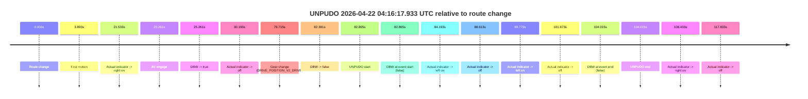

| Metric | Value |
|---|---|
| Outcome | `fail` |
| Effective failure type | `failed_to_unpudo` |
| Route change status | `found` |
| DBW at event start | `false` |
| DBW at event end | `false` |
| Predicted gear at AV start | `DRIVE_POSITION_V2_DRIVE` |
| Actual gear at AV start | `DRIVE_POSITION_V2_DRIVE` |
| Predicted gear at event start | `DRIVE_POSITION_V2_DRIVE` |
| Actual gear at event start | `DRIVE_POSITION_V2_DRIVE` |
| Planned indicator direction | `INDICATORS_STATE_V2_LEFT_ON` |
| Controller indicator direction | `INDICATORS_STATE_V2_LEFT_ON` |
| Actual indicator direction | `INDICATORS_STATE_V2_OFF` |
| Actual indicator at maneuver end | `INDICATORS_STATE_V2_OFF` |
| Driver accel help in AV | `false` |
| Driver accel help timestamp | `n/a` |
| Max accel pedal pct in AV | `0.0%` |
| Max brake pedal pct in AV | `8.0%` |
| Max speed mps in AV | `10.347` |
| Success timing baseline | `route change` |
| Route -> AV | `25.261s` |
| AV -> event start | `57.604s` |
| AV -> first motion | `-21.369s` |
| Success baseline -> event start | `82.865s` |
| Success baseline -> first motion | `3.893s` |
| AV duration before disengagement | `57.120s` |
| Trajectory waypoint count | `38` |
| Driving-plan step count | `11` |

The scored portion starts from the AV-owned window, not from the pre-AV setup. Route-change search in the stopped pre-event segment was `found`, with the baseline therefore set to route change. At the event anchor the model predicts `DRIVE_POSITION_V2_DRIVE` and the actual gear is `DRIVE_POSITION_V2_DRIVE`. The effective model outcome is `fail` because `failed_to_unpudo.`

### Resolution

| Field | Value |
|---|---|
| Final outcome | `fail` |
| Do we agree with this label? | `yes` |
| Source disengagement type | `failed_to_unpudo` |
| Resolved effective failure type | `failed_to_unpudo` |
| Confidence | `high` |

## unpudo 2026-04-22 04:19:23.683 UTC

| Field | Value |
|---|---|
| Model | `eel-teal-outspoken` |
| Author | `zak` |
| Run ID | `fme10010/2026-04-22--02-39-55--gen2-av-eb435b7c-0065-4b6d-81f5-518fd7e94716` |
| Date | `2026-04-22` |
| Time (UTC) | `04:19:23.683` |
| Event type | `unpudo` |
| Disengagement type | `none observed` |
| Route change | `found` |
| Console | [run](https://console.sso.wayve.ai/run/fme10010/2026-04-22--02-39-55--gen2-av-eb435b7c-0065-4b6d-81f5-518fd7e94716?id=&time-unixus=1776831563683306) |
| Foxglove | [segment](https://app.foxglove.dev/wayve-on-prem/p/prj_0dX18KZdVHg1fmmI/view?ds=foxglove-stream&ds.deviceName=fme10010&ds.start=2026-04-22T04%3A19%3A09.818257Z&ds.end=2026-04-22T04%3A20%3A18.229395Z&layoutId=lay_0e7VD4WIKDQGU73Y&time=2026-04-22T04%3A19%3A23.683306Z) |

### Event card: pass

- Pass: AV owns the credited unpudo from route change through the official unpudo window, the gear state is aligned at the anchor, and the vehicle moves without driver accelerator help in AV.

| Event | Time (UTC) | Delta from route change |
|---|---:|---:|
| Actual indicator already left on | 2026-04-22 04:19:09.821 | `-9.997s` |
| Route change | 2026-04-22 04:19:19.818 | `0.000s` |
| AV engage | 2026-04-22 04:19:19.818 | `0.001s` |
| DBW -> true | 2026-04-22 04:19:19.818 | `0.001s` |
| Gear change (DRIVE_POSITION_V2_DRIVE) | 2026-04-22 04:19:20.133 | `0.315s` |
| Actual indicator -> off | 2026-04-22 04:19:21.860 | `2.043s` |
| UNPUDO start | 2026-04-22 04:19:23.683 | `3.865s` |
| DBW at event start (true) | 2026-04-22 04:19:23.683 | `3.865s` |
| First motion | 2026-04-22 04:19:23.700 | `3.883s` |
| DBW at event end (true) | 2026-04-22 04:19:27.383 | `7.565s` |
| UNPUDO end | 2026-04-22 04:19:27.383 | `7.565s` |
| DBW -> false | 2026-04-22 04:20:08.229 | `48.411s` |

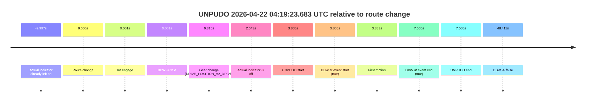

| Metric | Value |
|---|---|
| Outcome | `pass` |
| Effective failure type | `none` |
| Route change status | `found` |
| DBW at event start | `true` |
| DBW at event end | `true` |
| Predicted gear at AV start | `DRIVE_POSITION_V2_PARK` |
| Actual gear at AV start | `DRIVE_POSITION_V2_PARK` |
| Predicted gear at event start | `DRIVE_POSITION_V2_DRIVE` |
| Actual gear at event start | `DRIVE_POSITION_V2_DRIVE` |
| Planned indicator direction | `INDICATORS_STATE_V2_OFF` |
| Controller indicator direction | `INDICATORS_STATE_V2_OFF` |
| Actual indicator direction | `INDICATORS_STATE_V2_OFF` |
| Actual indicator at maneuver end | `INDICATORS_STATE_V2_OFF` |
| Driver accel help in AV | `false` |
| Driver accel help timestamp | `n/a` |
| Max accel pedal pct in AV | `0.0%` |
| Max brake pedal pct in AV | `8.0%` |
| Max speed mps in AV | `3.644` |
| Success timing baseline | `route change` |
| Route -> AV | `0.001s` |
| AV -> event start | `3.864s` |
| AV -> first motion | `3.882s` |
| Success baseline -> event start | `3.865s` |
| Success baseline -> first motion | `3.883s` |
| AV duration before disengagement | `48.411s` |
| Trajectory waypoint count | `37` |
| Driving-plan step count | `11` |

The scored portion starts from the AV-owned window, not from the pre-AV setup. Route-change search in the stopped pre-event segment was `found`, with the baseline therefore set to route change. At the event anchor the model predicts `DRIVE_POSITION_V2_DRIVE` and the actual gear is `DRIVE_POSITION_V2_DRIVE`. The effective model outcome is `pass` because `the credited unpudo stays AV-owned through the official unpudo window.`

### Resolution

| Field | Value |
|---|---|
| Final outcome | `pass` |
| Do we agree with this label? | `yes` |
| Source disengagement type | `none observed` |
| Resolved effective failure type | `none` |
| Confidence | `high` |

## unpudo 2026-04-22 04:21:43.983 UTC

| Field | Value |
|---|---|
| Model | `eel-teal-outspoken` |
| Author | `zak` |
| Run ID | `fme10010/2026-04-22--02-39-55--gen2-av-eb435b7c-0065-4b6d-81f5-518fd7e94716` |
| Date | `2026-04-22` |
| Time (UTC) | `04:21:43.983` |
| Event type | `unpudo` |
| Disengagement type | `none observed` |
| Route change | `found` |
| Console | [run](https://console.sso.wayve.ai/run/fme10010/2026-04-22--02-39-55--gen2-av-eb435b7c-0065-4b6d-81f5-518fd7e94716?id=&time-unixus=1776831703983318) |
| Foxglove | [segment](https://app.foxglove.dev/wayve-on-prem/p/prj_0dX18KZdVHg1fmmI/view?ds=foxglove-stream&ds.deviceName=fme10010&ds.start=2026-04-22T04%3A20%3A51.018271Z&ds.end=2026-04-22T04%3A21%3A57.683299Z&layoutId=lay_0e7VD4WIKDQGU73Y&time=2026-04-22T04%3A21%3A43.983318Z) |

### Event card: fail

- Fail: the credited unpudo does not stay AV-owned. The event window starts with DBW false, and the maneuver outcome lands outside a clean AV-owned segment.

| Event | Time (UTC) | Delta from route change |
|---|---:|---:|
| Route change | 2026-04-22 04:21:01.018 | `0.000s` |
| AV engage | 2026-04-22 04:21:01.019 | `0.001s` |
| DBW -> true | 2026-04-22 04:21:01.019 | `0.001s` |
| First motion | 2026-04-22 04:21:01.020 | `0.003s` |
| DBW -> false | 2026-04-22 04:21:27.370 | `26.352s` |
| Gear change (DRIVE_POSITION_V2_REVERSE) | 2026-04-22 04:21:41.133 | `40.115s` |
| UNPUDO start | 2026-04-22 04:21:43.983 | `42.965s` |
| DBW at event start (false) | 2026-04-22 04:21:43.983 | `42.965s` |
| DBW at event end (false) | 2026-04-22 04:21:47.683 | `46.665s` |
| UNPUDO end | 2026-04-22 04:21:47.683 | `46.665s` |
| Actual indicator -> right on | 2026-04-22 04:21:54.500 | `53.483s` |
| Actual indicator -> off | 2026-04-22 04:22:00.240 | `59.223s` |

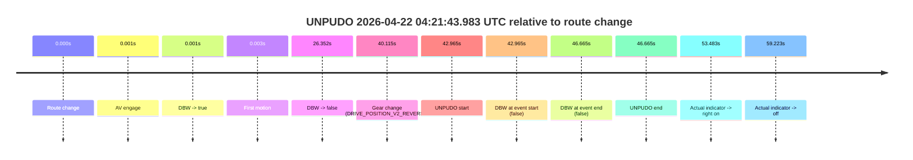

| Metric | Value |
|---|---|
| Outcome | `fail` |
| Effective failure type | `not_av_owned` |
| Route change status | `found` |
| DBW at event start | `false` |
| DBW at event end | `false` |
| Predicted gear at AV start | `DRIVE_POSITION_V2_DRIVE` |
| Actual gear at AV start | `DRIVE_POSITION_V2_DRIVE` |
| Predicted gear at event start | `DRIVE_POSITION_V2_REVERSE` |
| Actual gear at event start | `DRIVE_POSITION_V2_REVERSE` |
| Planned indicator direction | `INDICATORS_STATE_V2_OFF` |
| Controller indicator direction | `INDICATORS_STATE_V2_OFF` |
| Actual indicator direction | `INDICATORS_STATE_V2_OFF` |
| Actual indicator at maneuver end | `INDICATORS_STATE_V2_OFF` |
| Driver accel help in AV | `false` |
| Driver accel help timestamp | `n/a` |
| Max accel pedal pct in AV | `0.0%` |
| Max brake pedal pct in AV | `8.2%` |
| Max speed mps in AV | `6.517` |
| Success timing baseline | `route change` |
| Route -> AV | `0.001s` |
| AV -> event start | `42.964s` |
| AV -> first motion | `0.002s` |
| Success baseline -> event start | `42.965s` |
| Success baseline -> first motion | `0.003s` |
| AV duration before disengagement | `26.351s` |
| Trajectory waypoint count | `37` |
| Driving-plan step count | `11` |

The scored portion starts from the AV-owned window, not from the pre-AV setup. Route-change search in the stopped pre-event segment was `found`, with the baseline therefore set to route change. At the event anchor the model predicts `DRIVE_POSITION_V2_REVERSE` and the actual gear is `DRIVE_POSITION_V2_REVERSE`. The effective model outcome is `fail` because `not_av_owned.`

### Resolution

| Field | Value |
|---|---|
| Final outcome | `fail` |
| Do we agree with this label? | `yes` |
| Source disengagement type | `none observed` |
| Resolved effective failure type | `not_av_owned` |
| Confidence | `high` |

## unpudo 2026-04-22 04:22:35.633 UTC

| Field | Value |
|---|---|
| Model | `eel-teal-outspoken` |
| Author | `zak` |
| Run ID | `fme10010/2026-04-22--02-39-55--gen2-av-eb435b7c-0065-4b6d-81f5-518fd7e94716` |
| Date | `2026-04-22` |
| Time (UTC) | `04:22:35.633` |
| Event type | `unpudo` |
| Disengagement type | `failed_to_unpudo` |
| Route change | `found` |
| Console | [run](https://console.sso.wayve.ai/run/fme10010/2026-04-22--02-39-55--gen2-av-eb435b7c-0065-4b6d-81f5-518fd7e94716?id=&time-unixus=1776831755633316) |
| Foxglove | [segment](https://app.foxglove.dev/wayve-on-prem/p/prj_0dX18KZdVHg1fmmI/view?ds=foxglove-stream&ds.deviceName=fme10010&ds.start=2026-04-22T04%3A20%3A51.018271Z&ds.end=2026-04-22T04%3A22%3A52.383303Z&layoutId=lay_0e7VD4WIKDQGU73Y&time=2026-04-22T04%3A22%3A35.633316Z) |

### Event card: accidental

- Accidental: AV ownership is present for less than `2s`, so this is treated as an accidental brush with the maneuver rather than a meaningful model attempt.

| Event | Time (UTC) | Delta from route change |
|---|---:|---:|
| Route change | 2026-04-22 04:21:01.018 | `0.000s` |
| First motion | 2026-04-22 04:21:01.020 | `0.003s` |
| Actual indicator -> right on | 2026-04-22 04:21:54.500 | `53.483s` |
| Actual indicator -> off | 2026-04-22 04:22:00.240 | `59.223s` |
| Actual indicator -> left on | 2026-04-22 04:22:12.821 | `71.803s` |
| Actual indicator -> off | 2026-04-22 04:22:18.481 | `77.464s` |
| AV engage | 2026-04-22 04:22:33.548 | `92.531s` |
| DBW -> true | 2026-04-22 04:22:33.548 | `92.531s` |
| Gear change (DRIVE_POSITION_V2_DRIVE) | 2026-04-22 04:22:33.983 | `92.965s` |
| DBW -> false | 2026-04-22 04:22:35.149 | `94.131s` |
| UNPUDO start | 2026-04-22 04:22:35.633 | `94.615s` |
| DBW at event start (false) | 2026-04-22 04:22:35.633 | `94.615s` |
| Actual indicator -> left on | 2026-04-22 04:22:37.541 | `96.523s` |
| DBW at event end (false) | 2026-04-22 04:22:42.383 | `101.365s` |
| UNPUDO end | 2026-04-22 04:22:42.383 | `101.365s` |
| Actual indicator -> off | 2026-04-22 04:22:44.500 | `103.483s` |
| Actual indicator -> right on | 2026-04-22 04:22:46.340 | `105.323s` |
| Actual indicator -> off | 2026-04-22 04:23:00.081 | `119.063s` |

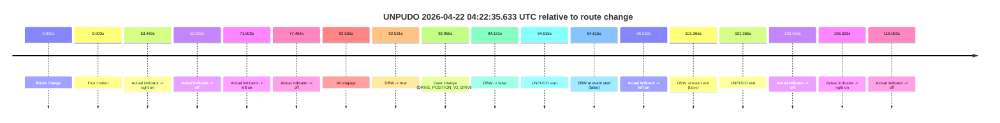

| Metric | Value |
|---|---|
| Outcome | `accidental` |
| Effective failure type | `none` |
| Route change status | `found` |
| DBW at event start | `false` |
| DBW at event end | `false` |
| Predicted gear at AV start | `DRIVE_POSITION_V2_PARK` |
| Actual gear at AV start | `DRIVE_POSITION_V2_PARK` |
| Predicted gear at event start | `DRIVE_POSITION_V2_DRIVE` |
| Actual gear at event start | `DRIVE_POSITION_V2_DRIVE` |
| Planned indicator direction | `INDICATORS_STATE_V2_OFF` |
| Controller indicator direction | `INDICATORS_STATE_V2_OFF` |
| Actual indicator direction | `INDICATORS_STATE_V2_OFF` |
| Actual indicator at maneuver end | `INDICATORS_STATE_V2_LEFT_ON` |
| Driver accel help in AV | `false` |
| Driver accel help timestamp | `n/a` |
| Max accel pedal pct in AV | `0.0%` |
| Max brake pedal pct in AV | `8.0%` |
| Max speed mps in AV | `0.000` |
| Success timing baseline | `route change` |
| Route -> AV | `92.531s` |
| AV -> event start | `2.085s` |
| AV -> first motion | `-92.528s` |
| Success baseline -> event start | `94.615s` |
| Success baseline -> first motion | `0.003s` |
| AV duration before disengagement | `1.601s` |
| Trajectory waypoint count | `36` |
| Driving-plan step count | `11` |

The scored portion starts from the AV-owned window, not from the pre-AV setup. Route-change search in the stopped pre-event segment was `found`, with the baseline therefore set to route change. At the event anchor the model predicts `DRIVE_POSITION_V2_DRIVE` and the actual gear is `DRIVE_POSITION_V2_DRIVE`. The effective model outcome is `accidental` because `the AV-owned portion is shorter than 2s.`

### Resolution

| Field | Value |
|---|---|
| Final outcome | `accidental` |
| Do we agree with this label? | `yes` |
| Source disengagement type | `failed_to_unpudo` |
| Resolved effective failure type | `none` |
| Confidence | `high` |
