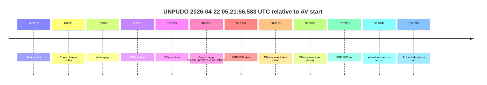
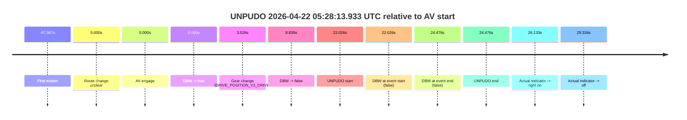
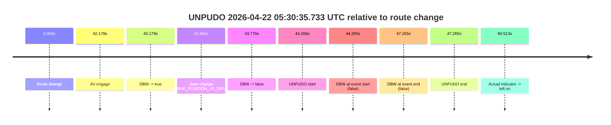

# Run Report: fme10010/2026-04-22--05-00-59--gen2-av-bdd143eb-5b0c-4060-9e69-a3ba4145b13f

| Field | Value |
|---|---|
| Run ID | `fme10010/2026-04-22--05-00-59--gen2-av-bdd143eb-5b0c-4060-9e69-a3ba4145b13f` |
| Date | `2026-04-22` |
| Model(s) | `eel-teal-outspoken` |
| Author | `zak` |
| Event count | `3` |

## unpudo 2026-04-22 05:21:56.583 UTC

| Field | Value |
|---|---|
| Model | `eel-teal-outspoken` |
| Author | `zak` |
| Run ID | `fme10010/2026-04-22--05-00-59--gen2-av-bdd143eb-5b0c-4060-9e69-a3ba4145b13f` |
| Date | `2026-04-22` |
| Time (UTC) | `05:21:56.583` |
| Event type | `unpudo` |
| Disengagement type | `failed_to_unpudo` |
| Route change | `unclear` |
| Console | [run](https://console.sso.wayve.ai/run/fme10010/2026-04-22--05-00-59--gen2-av-bdd143eb-5b0c-4060-9e69-a3ba4145b13f?id=&time-unixus=1776835316583311) |
| Foxglove | [segment](https://app.foxglove.dev/wayve-on-prem/p/prj_0dX18KZdVHg1fmmI/view?ds=foxglove-stream&ds.deviceName=fme10010&ds.start=2026-04-22T05%3A20%3A56.488033Z&ds.end=2026-04-22T05%3A22%3A49.083295Z&layoutId=lay_0e7VD4WIKDQGU73Y&time=2026-04-22T05%3A21%3A56.583311Z) |

### Event card: fail

- Fail: AV owns part of the segment, but the event still resolves as a model-performance failure under the AV-only scoring rule.

| Event | Time (UTC) | Delta from AV start |
|---|---:|---:|
| First motion | 2026-04-22 05:19:56.600 | `-69.887s` |
| Route change unclear | 2026-04-22 05:21:06.488 | `0.000s` |
| AV engage | 2026-04-22 05:21:06.488 | `0.000s` |
| DBW -> true | 2026-04-22 05:21:06.488 | `0.000s` |
| DBW -> false | 2026-04-22 05:21:24.307 | `17.820s` |
| Gear change (DRIVE_POSITION_V2_DRIVE) | 2026-04-22 05:21:55.083 | `48.595s` |
| UNPUDO start | 2026-04-22 05:21:56.583 | `50.095s` |
| DBW at event start (false) | 2026-04-22 05:21:56.583 | `50.095s` |
| DBW at event end (false) | 2026-04-22 05:22:39.083 | `92.595s` |
| UNPUDO end | 2026-04-22 05:22:39.083 | `92.595s` |
| Actual indicator -> left on | 2026-04-22 05:22:43.001 | `96.513s` |
| Actual indicator -> off | 2026-04-22 05:22:49.720 | `103.233s` |

| Metric | Value |
|---|---|
| Outcome | `fail` |
| Effective failure type | `failed_to_unpudo` |
| Route change status | `unclear` |
| DBW at event start | `false` |
| DBW at event end | `false` |
| Predicted gear at AV start | `DRIVE_POSITION_V2_DRIVE` |
| Actual gear at AV start | `DRIVE_POSITION_V2_DRIVE` |
| Predicted gear at event start | `DRIVE_POSITION_V2_DRIVE` |
| Actual gear at event start | `DRIVE_POSITION_V2_DRIVE` |
| Planned indicator direction | `INDICATORS_STATE_V2_OFF` |
| Controller indicator direction | `INDICATORS_STATE_V2_OFF` |
| Actual indicator direction | `INDICATORS_STATE_V2_OFF` |
| Actual indicator at maneuver end | `INDICATORS_STATE_V2_OFF` |
| Driver accel help in AV | `false` |
| Driver accel help timestamp | `n/a` |
| Max accel pedal pct in AV | `0.0%` |
| Max brake pedal pct in AV | `8.0%` |
| Max speed mps in AV | `6.808` |
| Success timing baseline | `AV start` |
| Route -> AV | `n/a` |
| AV -> event start | `50.095s` |
| AV -> first motion | `-69.887s` |
| Success baseline -> event start | `50.095s` |
| Success baseline -> first motion | `-69.887s` |
| AV duration before disengagement | `17.820s` |
| Trajectory waypoint count | `36` |
| Driving-plan step count | `11` |

The scored portion starts from the AV-owned window, not from the pre-AV setup. Route-change search in the stopped pre-event segment was `unclear`, with the baseline therefore set to AV start. At the event anchor the model predicts `DRIVE_POSITION_V2_DRIVE` and the actual gear is `DRIVE_POSITION_V2_DRIVE`. The effective model outcome is `fail` because `failed_to_unpudo.`

### Resolution

| Field | Value |
|---|---|
| Final outcome | `fail` |
| Do we agree with this label? | `yes` |
| Source disengagement type | `failed_to_unpudo` |
| Resolved effective failure type | `failed_to_unpudo` |
| Confidence | `medium` |

## unpudo 2026-04-22 05:28:13.933 UTC

| Field | Value |
|---|---|
| Model | `eel-teal-outspoken` |
| Author | `zak` |
| Run ID | `fme10010/2026-04-22--05-00-59--gen2-av-bdd143eb-5b0c-4060-9e69-a3ba4145b13f` |
| Date | `2026-04-22` |
| Time (UTC) | `05:28:13.933` |
| Event type | `unpudo` |
| Disengagement type | `failed_to_pudo` |
| Route change | `unclear` |
| Console | [run](https://console.sso.wayve.ai/run/fme10010/2026-04-22--05-00-59--gen2-av-bdd143eb-5b0c-4060-9e69-a3ba4145b13f?id=&time-unixus=1776835693933320) |
| Foxglove | [segment](https://app.foxglove.dev/wayve-on-prem/p/prj_0dX18KZdVHg1fmmI/view?ds=foxglove-stream&ds.deviceName=fme10010&ds.start=2026-04-22T05%3A27%3A41.907750Z&ds.end=2026-04-22T05%3A28%3A26.383292Z&layoutId=lay_0e7VD4WIKDQGU73Y&time=2026-04-22T05%3A28%3A13.933320Z) |

### Event card: fail

- Fail: AV owns part of the segment, but the event still resolves as a model-performance failure under the AV-only scoring rule.

| Event | Time (UTC) | Delta from AV start |
|---|---:|---:|
| First motion | 2026-04-22 05:26:13.940 | `-97.967s` |
| Route change unclear | 2026-04-22 05:27:51.907 | `0.000s` |
| AV engage | 2026-04-22 05:27:51.907 | `0.000s` |
| DBW -> true | 2026-04-22 05:27:51.907 | `0.000s` |
| Gear change (DRIVE_POSITION_V2_DRIVE) | 2026-04-22 05:27:55.433 | `3.526s` |
| DBW -> false | 2026-04-22 05:28:00.746 | `8.839s` |
| UNPUDO start | 2026-04-22 05:28:13.933 | `22.026s` |
| DBW at event start (false) | 2026-04-22 05:28:13.933 | `22.026s` |
| DBW at event end (false) | 2026-04-22 05:28:16.383 | `24.476s` |
| UNPUDO end | 2026-04-22 05:28:16.383 | `24.476s` |
| Actual indicator -> right on | 2026-04-22 05:28:18.040 | `26.133s` |
| Actual indicator -> off | 2026-04-22 05:28:21.241 | `29.334s` |

| Metric | Value |
|---|---|
| Outcome | `fail` |
| Effective failure type | `failed_to_pudo` |
| Route change status | `unclear` |
| DBW at event start | `false` |
| DBW at event end | `false` |
| Predicted gear at AV start | `DRIVE_POSITION_V2_DRIVE` |
| Actual gear at AV start | `DRIVE_POSITION_V2_DRIVE` |
| Predicted gear at event start | `DRIVE_POSITION_V2_DRIVE` |
| Actual gear at event start | `DRIVE_POSITION_V2_DRIVE` |
| Planned indicator direction | `INDICATORS_STATE_V2_OFF` |
| Controller indicator direction | `INDICATORS_STATE_V2_OFF` |
| Actual indicator direction | `INDICATORS_STATE_V2_OFF` |
| Actual indicator at maneuver end | `INDICATORS_STATE_V2_OFF` |
| Driver accel help in AV | `false` |
| Driver accel help timestamp | `n/a` |
| Max accel pedal pct in AV | `0.0%` |
| Max brake pedal pct in AV | `8.0%` |
| Max speed mps in AV | `0.000` |
| Success timing baseline | `AV start` |
| Route -> AV | `n/a` |
| AV -> event start | `22.026s` |
| AV -> first motion | `-97.967s` |
| Success baseline -> event start | `22.026s` |
| Success baseline -> first motion | `-97.967s` |
| AV duration before disengagement | `8.839s` |
| Trajectory waypoint count | `37` |
| Driving-plan step count | `11` |

The scored portion starts from the AV-owned window, not from the pre-AV setup. Route-change search in the stopped pre-event segment was `unclear`, with the baseline therefore set to AV start. At the event anchor the model predicts `DRIVE_POSITION_V2_DRIVE` and the actual gear is `DRIVE_POSITION_V2_DRIVE`. The effective model outcome is `fail` because `failed_to_pudo.`

### Resolution

| Field | Value |
|---|---|
| Final outcome | `fail` |
| Do we agree with this label? | `yes` |
| Source disengagement type | `failed_to_pudo` |
| Resolved effective failure type | `failed_to_pudo` |
| Confidence | `medium` |

## unpudo 2026-04-22 05:30:35.733 UTC

| Field | Value |
|---|---|
| Model | `eel-teal-outspoken` |
| Author | `zak` |
| Run ID | `fme10010/2026-04-22--05-00-59--gen2-av-bdd143eb-5b0c-4060-9e69-a3ba4145b13f` |
| Date | `2026-04-22` |
| Time (UTC) | `05:30:35.733` |
| Event type | `unpudo` |
| Disengagement type | `failed_to_accelerate` |
| Route change | `found` |
| Console | [run](https://console.sso.wayve.ai/run/fme10010/2026-04-22--05-00-59--gen2-av-bdd143eb-5b0c-4060-9e69-a3ba4145b13f?id=&time-unixus=1776835835733318) |
| Foxglove | [segment](https://app.foxglove.dev/wayve-on-prem/p/prj_0dX18KZdVHg1fmmI/view?ds=foxglove-stream&ds.deviceName=fme10010&ds.start=2026-04-22T05%3A29%3A41.468296Z&ds.end=2026-04-22T05%3A30%3A48.733299Z&layoutId=lay_0e7VD4WIKDQGU73Y&time=2026-04-22T05%3A30%3A35.733318Z) |

### Event card: accidental

- Accidental: AV ownership is present for less than `2s`, so this is treated as an accidental brush with the maneuver rather than a meaningful model attempt.

| Event | Time (UTC) | Delta from route change |
|---|---:|---:|
| Route change | 2026-04-22 05:29:51.468 | `0.000s` |
| AV engage | 2026-04-22 05:30:33.647 | `42.179s` |
| DBW -> true | 2026-04-22 05:30:33.647 | `42.179s` |
| Gear change (DRIVE_POSITION_V2_DRIVE) | 2026-04-22 05:30:34.133 | `42.665s` |
| DBW -> false | 2026-04-22 05:30:35.247 | `43.779s` |
| UNPUDO start | 2026-04-22 05:30:35.733 | `44.265s` |
| DBW at event start (false) | 2026-04-22 05:30:35.733 | `44.265s` |
| DBW at event end (false) | 2026-04-22 05:30:38.733 | `47.265s` |
| UNPUDO end | 2026-04-22 05:30:38.733 | `47.265s` |
| Actual indicator -> left on | 2026-04-22 05:30:51.981 | `60.513s` |

| Metric | Value |
|---|---|
| Outcome | `accidental` |
| Effective failure type | `none` |
| Route change status | `found` |
| DBW at event start | `false` |
| DBW at event end | `false` |
| Predicted gear at AV start | `DRIVE_POSITION_V2_DRIVE` |
| Actual gear at AV start | `DRIVE_POSITION_V2_PARK` |
| Predicted gear at event start | `DRIVE_POSITION_V2_DRIVE` |
| Actual gear at event start | `DRIVE_POSITION_V2_DRIVE` |
| Planned indicator direction | `INDICATORS_STATE_V2_LEFT_ON` |
| Controller indicator direction | `INDICATORS_STATE_V2_LEFT_ON` |
| Actual indicator direction | `INDICATORS_STATE_V2_OFF` |
| Actual indicator at maneuver end | `INDICATORS_STATE_V2_OFF` |
| Driver accel help in AV | `false` |
| Driver accel help timestamp | `n/a` |
| Max accel pedal pct in AV | `0.0%` |
| Max brake pedal pct in AV | `8.0%` |
| Max speed mps in AV | `0.000` |
| Success timing baseline | `route change` |
| Route -> AV | `42.179s` |
| AV -> event start | `2.086s` |
| AV -> first motion | `n/a` |
| Success baseline -> event start | `44.265s` |
| Success baseline -> first motion | `n/a` |
| AV duration before disengagement | `1.600s` |
| Trajectory waypoint count | `38` |
| Driving-plan step count | `11` |

The scored portion starts from the AV-owned window, not from the pre-AV setup. Route-change search in the stopped pre-event segment was `found`, with the baseline therefore set to route change. At the event anchor the model predicts `DRIVE_POSITION_V2_DRIVE` and the actual gear is `DRIVE_POSITION_V2_DRIVE`. The effective model outcome is `accidental` because `the AV-owned portion is shorter than 2s.`

### Resolution

| Field | Value |
|---|---|
| Final outcome | `accidental` |
| Do we agree with this label? | `yes` |
| Source disengagement type | `failed_to_accelerate` |
| Resolved effective failure type | `none` |
| Confidence | `high` |
