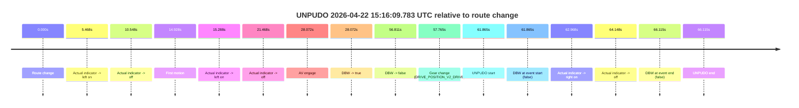
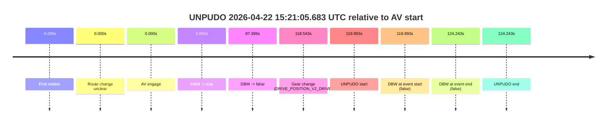
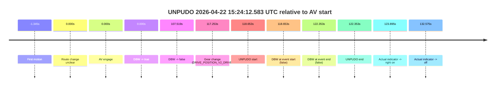
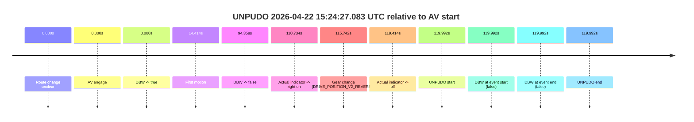
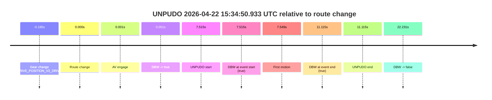
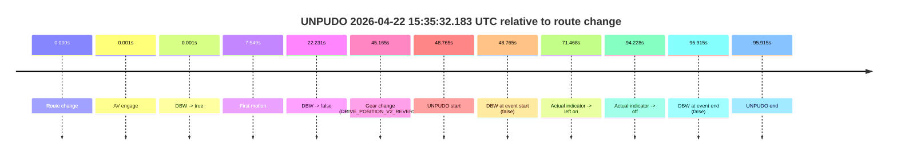
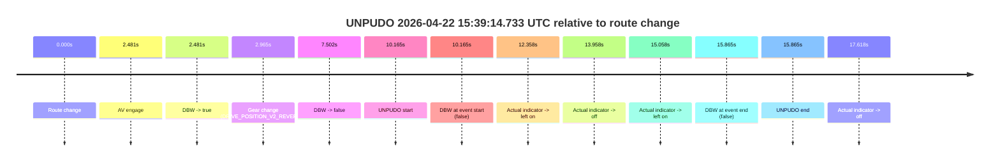
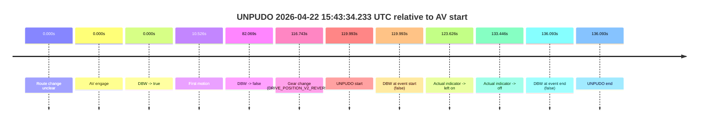

# Run Report: fme10010/2026-04-22--13-54-22--gen2-av-776e6413-6cfd-4985-8a89-a423678c808d

| Field | Value |
|---|---|
| Run ID | `fme10010/2026-04-22--13-54-22--gen2-av-776e6413-6cfd-4985-8a89-a423678c808d` |
| Date | `2026-04-22` |
| Model(s) | `mallard-plum-mysterious` |
| Author | `guy.geva` |
| Event count | `9` |

## unpudo 2026-04-22 15:16:09.783 UTC

| Field | Value |
|---|---|
| Model | `mallard-plum-mysterious` |
| Author | `guy.geva` |
| Run ID | `fme10010/2026-04-22--13-54-22--gen2-av-776e6413-6cfd-4985-8a89-a423678c808d` |
| Date | `2026-04-22` |
| Time (UTC) | `15:16:09.783` |
| Event type | `unpudo` |
| Disengagement type | `none observed` |
| Route change | `found` |
| Console | [run](https://console.sso.wayve.ai/run/fme10010/2026-04-22--13-54-22--gen2-av-776e6413-6cfd-4985-8a89-a423678c808d?id=&time-unixus=1776870969783316) |
| Foxglove | [segment](https://app.foxglove.dev/wayve-on-prem/p/prj_0dX18KZdVHg1fmmI/view?ds=foxglove-stream&ds.deviceName=fme10010&ds.start=2026-04-22T15%3A14%3A57.918254Z&ds.end=2026-04-22T15%3A16%3A24.033302Z&layoutId=lay_0e7VD4WIKDQGU73Y&time=2026-04-22T15%3A16%3A09.783316Z) |

### Event card: fail

- Fail: the credited unpudo does not stay AV-owned. The event window starts with DBW false, and the maneuver outcome lands outside a clean AV-owned segment.

| Event | Time (UTC) | Delta from route change |
|---|---:|---:|
| Route change | 2026-04-22 15:15:07.918 | `0.000s` |
| Actual indicator -> left on | 2026-04-22 15:15:13.385 | `5.468s` |
| Actual indicator -> off | 2026-04-22 15:15:18.465 | `10.548s` |
| First motion | 2026-04-22 15:15:22.846 | `14.928s` |
| Actual indicator -> left on | 2026-04-22 15:15:23.205 | `15.288s` |
| Actual indicator -> off | 2026-04-22 15:15:29.385 | `21.468s` |
| AV engage | 2026-04-22 15:15:35.989 | `28.072s` |
| DBW -> true | 2026-04-22 15:15:35.989 | `28.072s` |
| DBW -> false | 2026-04-22 15:16:04.729 | `56.811s` |
| Gear change (DRIVE_POSITION_V2_DRIVE) | 2026-04-22 15:16:05.683 | `57.765s` |
| UNPUDO start | 2026-04-22 15:16:09.783 | `61.865s` |
| DBW at event start (false) | 2026-04-22 15:16:09.783 | `61.865s` |
| Actual indicator -> right on | 2026-04-22 15:16:10.886 | `62.968s` |
| Actual indicator -> off | 2026-04-22 15:16:12.066 | `64.148s` |
| DBW at event end (false) | 2026-04-22 15:16:14.033 | `66.115s` |
| UNPUDO end | 2026-04-22 15:16:14.033 | `66.115s` |

| Metric | Value |
|---|---|
| Outcome | `fail` |
| Effective failure type | `completed_outside_av` |
| Route change status | `found` |
| DBW at event start | `false` |
| DBW at event end | `false` |
| Predicted gear at AV start | `DRIVE_POSITION_V2_DRIVE` |
| Actual gear at AV start | `DRIVE_POSITION_V2_DRIVE` |
| Predicted gear at event start | `DRIVE_POSITION_V2_DRIVE` |
| Actual gear at event start | `DRIVE_POSITION_V2_DRIVE` |
| Planned indicator direction | `INDICATORS_STATE_V2_RIGHT_ON` |
| Controller indicator direction | `INDICATORS_STATE_V2_RIGHT_ON` |
| Actual indicator direction | `INDICATORS_STATE_V2_OFF` |
| Actual indicator at maneuver end | `INDICATORS_STATE_V2_OFF` |
| Driver accel help in AV | `false` |
| Driver accel help timestamp | `n/a` |
| Max accel pedal pct in AV | `0.0%` |
| Max brake pedal pct in AV | `23.1%` |
| Max speed mps in AV | `7.664` |
| Success timing baseline | `route change` |
| Route -> AV | `28.072s` |
| AV -> event start | `33.793s` |
| AV -> first motion | `-13.144s` |
| Success baseline -> event start | `61.865s` |
| Success baseline -> first motion | `14.928s` |
| AV duration before disengagement | `28.740s` |
| Trajectory waypoint count | `37` |
| Driving-plan step count | `11` |

The scored portion starts from the AV-owned window, not from the pre-AV setup. Route-change search in the stopped pre-event segment was `found`, with the baseline therefore set to route change. At the event anchor the model predicts `DRIVE_POSITION_V2_DRIVE` and the actual gear is `DRIVE_POSITION_V2_DRIVE`. The effective model outcome is `fail` because `completed_outside_av.`

### Resolution

| Field | Value |
|---|---|
| Final outcome | `fail` |
| Do we agree with this label? | `yes` |
| Source disengagement type | `none observed` |
| Resolved effective failure type | `completed_outside_av` |
| Confidence | `high` |

## unpudo 2026-04-22 15:21:05.683 UTC

| Field | Value |
|---|---|
| Model | `mallard-plum-mysterious` |
| Author | `guy.geva` |
| Run ID | `fme10010/2026-04-22--13-54-22--gen2-av-776e6413-6cfd-4985-8a89-a423678c808d` |
| Date | `2026-04-22` |
| Time (UTC) | `15:21:05.683` |
| Event type | `unpudo` |
| Disengagement type | `none observed` |
| Route change | `unclear` |
| Console | [run](https://console.sso.wayve.ai/run/fme10010/2026-04-22--13-54-22--gen2-av-776e6413-6cfd-4985-8a89-a423678c808d?id=&time-unixus=1776871265683296) |
| Foxglove | [segment](https://app.foxglove.dev/wayve-on-prem/p/prj_0dX18KZdVHg1fmmI/view?ds=foxglove-stream&ds.deviceName=fme10010&ds.start=2026-04-22T15%3A18%3A55.690500Z&ds.end=2026-04-22T15%3A21%3A19.933312Z&layoutId=lay_0e7VD4WIKDQGU73Y&time=2026-04-22T15%3A21%3A05.683296Z) |

### Event card: fail

- Fail: the credited unpudo does not stay AV-owned. The event window starts with DBW false, and the maneuver outcome lands outside a clean AV-owned segment.

| Event | Time (UTC) | Delta from AV start |
|---|---:|---:|
| First motion | 2026-04-22 15:19:05.685 | `-0.005s` |
| Route change unclear | 2026-04-22 15:19:05.690 | `0.000s` |
| AV engage | 2026-04-22 15:19:05.690 | `0.000s` |
| DBW -> true | 2026-04-22 15:19:05.690 | `0.000s` |
| DBW -> false | 2026-04-22 15:20:33.089 | `87.399s` |
| Gear change (DRIVE_POSITION_V2_DRIVE) | 2026-04-22 15:21:04.233 | `118.543s` |
| UNPUDO start | 2026-04-22 15:21:05.683 | `119.993s` |
| DBW at event start (false) | 2026-04-22 15:21:05.683 | `119.993s` |
| DBW at event end (false) | 2026-04-22 15:21:09.933 | `124.243s` |
| UNPUDO end | 2026-04-22 15:21:09.933 | `124.243s` |

| Metric | Value |
|---|---|
| Outcome | `fail` |
| Effective failure type | `completed_outside_av` |
| Route change status | `unclear` |
| DBW at event start | `false` |
| DBW at event end | `false` |
| Predicted gear at AV start | `DRIVE_POSITION_V2_DRIVE` |
| Actual gear at AV start | `DRIVE_POSITION_V2_DRIVE` |
| Predicted gear at event start | `DRIVE_POSITION_V2_DRIVE` |
| Actual gear at event start | `DRIVE_POSITION_V2_DRIVE` |
| Planned indicator direction | `INDICATORS_STATE_V2_LEFT_ON` |
| Controller indicator direction | `INDICATORS_STATE_V2_LEFT_ON` |
| Actual indicator direction | `INDICATORS_STATE_V2_OFF` |
| Actual indicator at maneuver end | `INDICATORS_STATE_V2_OFF` |
| Driver accel help in AV | `false` |
| Driver accel help timestamp | `n/a` |
| Max accel pedal pct in AV | `0.0%` |
| Max brake pedal pct in AV | `26.3%` |
| Max speed mps in AV | `10.267` |
| Success timing baseline | `AV start` |
| Route -> AV | `n/a` |
| AV -> event start | `119.993s` |
| AV -> first motion | `-0.005s` |
| Success baseline -> event start | `119.993s` |
| Success baseline -> first motion | `-0.005s` |
| AV duration before disengagement | `87.399s` |
| Trajectory waypoint count | `37` |
| Driving-plan step count | `11` |

The scored portion starts from the AV-owned window, not from the pre-AV setup. Route-change search in the stopped pre-event segment was `unclear`, with the baseline therefore set to AV start. At the event anchor the model predicts `DRIVE_POSITION_V2_DRIVE` and the actual gear is `DRIVE_POSITION_V2_DRIVE`. The effective model outcome is `fail` because `completed_outside_av.`

### Resolution

| Field | Value |
|---|---|
| Final outcome | `fail` |
| Do we agree with this label? | `yes` |
| Source disengagement type | `none observed` |
| Resolved effective failure type | `completed_outside_av` |
| Confidence | `medium` |

## unpudo 2026-04-22 15:24:12.583 UTC

| Field | Value |
|---|---|
| Model | `mallard-plum-mysterious` |
| Author | `guy.geva` |
| Run ID | `fme10010/2026-04-22--13-54-22--gen2-av-776e6413-6cfd-4985-8a89-a423678c808d` |
| Date | `2026-04-22` |
| Time (UTC) | `15:24:12.583` |
| Event type | `unpudo` |
| Disengagement type | `none observed` |
| Route change | `unclear` |
| Console | [run](https://console.sso.wayve.ai/run/fme10010/2026-04-22--13-54-22--gen2-av-776e6413-6cfd-4985-8a89-a423678c808d?id=&time-unixus=1776871452583305) |
| Foxglove | [segment](https://app.foxglove.dev/wayve-on-prem/p/prj_0dX18KZdVHg1fmmI/view?ds=foxglove-stream&ds.deviceName=fme10010&ds.start=2026-04-22T15%3A22%3A03.930556Z&ds.end=2026-04-22T15%3A24%3A26.283322Z&layoutId=lay_0e7VD4WIKDQGU73Y&time=2026-04-22T15%3A24%3A12.583305Z) |

### Event card: fail

- Fail: the credited unpudo does not stay AV-owned. The event window starts with DBW false, and the maneuver outcome lands outside a clean AV-owned segment.

| Event | Time (UTC) | Delta from AV start |
|---|---:|---:|
| First motion | 2026-04-22 15:22:12.585 | `-1.345s` |
| Route change unclear | 2026-04-22 15:22:13.930 | `0.000s` |
| AV engage | 2026-04-22 15:22:13.930 | `0.000s` |
| DBW -> true | 2026-04-22 15:22:13.930 | `0.000s` |
| DBW -> false | 2026-04-22 15:24:01.449 | `107.519s` |
| Gear change (DRIVE_POSITION_V2_DRIVE) | 2026-04-22 15:24:11.183 | `117.253s` |
| UNPUDO start | 2026-04-22 15:24:12.583 | `118.653s` |
| DBW at event start (false) | 2026-04-22 15:24:12.583 | `118.653s` |
| DBW at event end (false) | 2026-04-22 15:24:16.283 | `122.353s` |
| UNPUDO end | 2026-04-22 15:24:16.283 | `122.353s` |
| Actual indicator -> right on | 2026-04-22 15:24:17.825 | `123.895s` |
| Actual indicator -> off | 2026-04-22 15:24:26.505 | `132.575s` |

| Metric | Value |
|---|---|
| Outcome | `fail` |
| Effective failure type | `completed_outside_av` |
| Route change status | `unclear` |
| DBW at event start | `false` |
| DBW at event end | `false` |
| Predicted gear at AV start | `DRIVE_POSITION_V2_DRIVE` |
| Actual gear at AV start | `DRIVE_POSITION_V2_DRIVE` |
| Predicted gear at event start | `DRIVE_POSITION_V2_DRIVE` |
| Actual gear at event start | `DRIVE_POSITION_V2_DRIVE` |
| Planned indicator direction | `INDICATORS_STATE_V2_OFF` |
| Controller indicator direction | `INDICATORS_STATE_V2_OFF` |
| Actual indicator direction | `INDICATORS_STATE_V2_OFF` |
| Actual indicator at maneuver end | `INDICATORS_STATE_V2_OFF` |
| Driver accel help in AV | `false` |
| Driver accel help timestamp | `n/a` |
| Max accel pedal pct in AV | `0.0%` |
| Max brake pedal pct in AV | `15.0%` |
| Max speed mps in AV | `10.164` |
| Success timing baseline | `AV start` |
| Route -> AV | `n/a` |
| AV -> event start | `118.653s` |
| AV -> first motion | `-1.345s` |
| Success baseline -> event start | `118.653s` |
| Success baseline -> first motion | `-1.345s` |
| AV duration before disengagement | `107.519s` |
| Trajectory waypoint count | `37` |
| Driving-plan step count | `11` |

The scored portion starts from the AV-owned window, not from the pre-AV setup. Route-change search in the stopped pre-event segment was `unclear`, with the baseline therefore set to AV start. At the event anchor the model predicts `DRIVE_POSITION_V2_DRIVE` and the actual gear is `DRIVE_POSITION_V2_DRIVE`. The effective model outcome is `fail` because `completed_outside_av.`

### Resolution

| Field | Value |
|---|---|
| Final outcome | `fail` |
| Do we agree with this label? | `yes` |
| Source disengagement type | `none observed` |
| Resolved effective failure type | `completed_outside_av` |
| Confidence | `medium` |

## unpudo 2026-04-22 15:24:27.083 UTC

| Field | Value |
|---|---|
| Model | `mallard-plum-mysterious` |
| Author | `guy.geva` |
| Run ID | `fme10010/2026-04-22--13-54-22--gen2-av-776e6413-6cfd-4985-8a89-a423678c808d` |
| Date | `2026-04-22` |
| Time (UTC) | `15:24:27.083` |
| Event type | `unpudo` |
| Disengagement type | `none observed` |
| Route change | `unclear` |
| Console | [run](https://console.sso.wayve.ai/run/fme10010/2026-04-22--13-54-22--gen2-av-776e6413-6cfd-4985-8a89-a423678c808d?id=&time-unixus=1776871467083314) |
| Foxglove | [segment](https://app.foxglove.dev/wayve-on-prem/p/prj_0dX18KZdVHg1fmmI/view?ds=foxglove-stream&ds.deviceName=fme10010&ds.start=2026-04-22T15%3A22%3A17.091587Z&ds.end=2026-04-22T15%3A24%3A37.083314Z&layoutId=lay_0e7VD4WIKDQGU73Y&time=2026-04-22T15%3A24%3A27.083314Z) |

### Event card: fail

- Fail: the credited unpudo does not stay AV-owned. The event window starts with DBW false, and the maneuver outcome lands outside a clean AV-owned segment.

| Event | Time (UTC) | Delta from AV start |
|---|---:|---:|
| Route change unclear | 2026-04-22 15:22:27.091 | `0.000s` |
| AV engage | 2026-04-22 15:22:27.091 | `0.000s` |
| DBW -> true | 2026-04-22 15:22:27.091 | `0.000s` |
| First motion | 2026-04-22 15:22:41.505 | `14.414s` |
| DBW -> false | 2026-04-22 15:24:01.449 | `94.358s` |
| Actual indicator -> right on | 2026-04-22 15:24:17.825 | `110.734s` |
| Gear change (DRIVE_POSITION_V2_REVERSE) | 2026-04-22 15:24:22.833 | `115.742s` |
| Actual indicator -> off | 2026-04-22 15:24:26.505 | `119.414s` |
| UNPUDO start | 2026-04-22 15:24:27.083 | `119.992s` |
| DBW at event start (false) | 2026-04-22 15:24:27.083 | `119.992s` |
| DBW at event end (false) | 2026-04-22 15:24:27.083 | `119.992s` |
| UNPUDO end | 2026-04-22 15:24:27.083 | `119.992s` |

| Metric | Value |
|---|---|
| Outcome | `fail` |
| Effective failure type | `not_av_owned` |
| Route change status | `unclear` |
| DBW at event start | `false` |
| DBW at event end | `false` |
| Predicted gear at AV start | `DRIVE_POSITION_V2_DRIVE` |
| Actual gear at AV start | `DRIVE_POSITION_V2_DRIVE` |
| Predicted gear at event start | `DRIVE_POSITION_V2_REVERSE` |
| Actual gear at event start | `DRIVE_POSITION_V2_REVERSE` |
| Planned indicator direction | `INDICATORS_STATE_V2_OFF` |
| Controller indicator direction | `INDICATORS_STATE_V2_OFF` |
| Actual indicator direction | `INDICATORS_STATE_V2_OFF` |
| Actual indicator at maneuver end | `INDICATORS_STATE_V2_OFF` |
| Driver accel help in AV | `false` |
| Driver accel help timestamp | `n/a` |
| Max accel pedal pct in AV | `0.0%` |
| Max brake pedal pct in AV | `15.0%` |
| Max speed mps in AV | `10.164` |
| Success timing baseline | `AV start` |
| Route -> AV | `n/a` |
| AV -> event start | `119.992s` |
| AV -> first motion | `14.414s` |
| Success baseline -> event start | `119.992s` |
| Success baseline -> first motion | `14.414s` |
| AV duration before disengagement | `94.358s` |
| Trajectory waypoint count | `37` |
| Driving-plan step count | `11` |

The scored portion starts from the AV-owned window, not from the pre-AV setup. Route-change search in the stopped pre-event segment was `unclear`, with the baseline therefore set to AV start. At the event anchor the model predicts `DRIVE_POSITION_V2_REVERSE` and the actual gear is `DRIVE_POSITION_V2_REVERSE`. The effective model outcome is `fail` because `not_av_owned.`

### Resolution

| Field | Value |
|---|---|
| Final outcome | `fail` |
| Do we agree with this label? | `yes` |
| Source disengagement type | `none observed` |
| Resolved effective failure type | `not_av_owned` |
| Confidence | `medium` |

## unpudo 2026-04-22 15:34:50.933 UTC

| Field | Value |
|---|---|
| Model | `mallard-plum-mysterious` |
| Author | `guy.geva` |
| Run ID | `fme10010/2026-04-22--13-54-22--gen2-av-776e6413-6cfd-4985-8a89-a423678c808d` |
| Date | `2026-04-22` |
| Time (UTC) | `15:34:50.933` |
| Event type | `unpudo` |
| Disengagement type | `none observed` |
| Route change | `found` |
| Console | [run](https://console.sso.wayve.ai/run/fme10010/2026-04-22--13-54-22--gen2-av-776e6413-6cfd-4985-8a89-a423678c808d?id=&time-unixus=1776872090933306) |
| Foxglove | [segment](https://app.foxglove.dev/wayve-on-prem/p/prj_0dX18KZdVHg1fmmI/view?ds=foxglove-stream&ds.deviceName=fme10010&ds.start=2026-04-22T15%3A34%3A33.233299Z&ds.end=2026-04-22T15%3A35%3A15.649378Z&layoutId=lay_0e7VD4WIKDQGU73Y&time=2026-04-22T15%3A34%3A50.933306Z) |

### Event card: pass

- Pass: AV owns the credited unpudo from route change through the official unpudo window, the gear state is aligned at the anchor, and the vehicle moves without driver accelerator help in AV.

| Event | Time (UTC) | Delta from route change |
|---|---:|---:|
| Gear change (DRIVE_POSITION_V2_DRIVE) | 2026-04-22 15:34:43.233 | `-0.185s` |
| Route change | 2026-04-22 15:34:43.418 | `0.000s` |
| AV engage | 2026-04-22 15:34:43.419 | `0.001s` |
| DBW -> true | 2026-04-22 15:34:43.419 | `0.001s` |
| UNPUDO start | 2026-04-22 15:34:50.933 | `7.515s` |
| DBW at event start (true) | 2026-04-22 15:34:50.933 | `7.515s` |
| First motion | 2026-04-22 15:34:50.966 | `7.549s` |
| DBW at event end (true) | 2026-04-22 15:34:54.533 | `11.115s` |
| UNPUDO end | 2026-04-22 15:34:54.533 | `11.115s` |
| DBW -> false | 2026-04-22 15:35:05.649 | `22.231s` |

| Metric | Value |
|---|---|
| Outcome | `pass` |
| Effective failure type | `none` |
| Route change status | `found` |
| DBW at event start | `true` |
| DBW at event end | `true` |
| Predicted gear at AV start | `DRIVE_POSITION_V2_REVERSE` |
| Actual gear at AV start | `DRIVE_POSITION_V2_REVERSE` |
| Predicted gear at event start | `DRIVE_POSITION_V2_DRIVE` |
| Actual gear at event start | `DRIVE_POSITION_V2_DRIVE` |
| Planned indicator direction | `INDICATORS_STATE_V2_RIGHT_ON` |
| Controller indicator direction | `INDICATORS_STATE_V2_RIGHT_ON` |
| Actual indicator direction | `INDICATORS_STATE_V2_OFF` |
| Actual indicator at maneuver end | `INDICATORS_STATE_V2_OFF` |
| Driver accel help in AV | `false` |
| Driver accel help timestamp | `n/a` |
| Max accel pedal pct in AV | `0.0%` |
| Max brake pedal pct in AV | `8.0%` |
| Max speed mps in AV | `4.092` |
| Success timing baseline | `route change` |
| Route -> AV | `0.001s` |
| AV -> event start | `7.514s` |
| AV -> first motion | `7.547s` |
| Success baseline -> event start | `7.515s` |
| Success baseline -> first motion | `7.549s` |
| AV duration before disengagement | `22.230s` |
| Trajectory waypoint count | `36` |
| Driving-plan step count | `11` |

The scored portion starts from the AV-owned window, not from the pre-AV setup. Route-change search in the stopped pre-event segment was `found`, with the baseline therefore set to route change. At the event anchor the model predicts `DRIVE_POSITION_V2_DRIVE` and the actual gear is `DRIVE_POSITION_V2_DRIVE`. The effective model outcome is `pass` because `the credited unpudo stays AV-owned through the official unpudo window.`

### Resolution

| Field | Value |
|---|---|
| Final outcome | `pass` |
| Do we agree with this label? | `yes` |
| Source disengagement type | `none observed` |
| Resolved effective failure type | `none` |
| Confidence | `high` |

## unpudo 2026-04-22 15:35:32.183 UTC

| Field | Value |
|---|---|
| Model | `mallard-plum-mysterious` |
| Author | `guy.geva` |
| Run ID | `fme10010/2026-04-22--13-54-22--gen2-av-776e6413-6cfd-4985-8a89-a423678c808d` |
| Date | `2026-04-22` |
| Time (UTC) | `15:35:32.183` |
| Event type | `unpudo` |
| Disengagement type | `none observed` |
| Route change | `found` |
| Console | [run](https://console.sso.wayve.ai/run/fme10010/2026-04-22--13-54-22--gen2-av-776e6413-6cfd-4985-8a89-a423678c808d?id=&time-unixus=1776872132183291) |
| Foxglove | [segment](https://app.foxglove.dev/wayve-on-prem/p/prj_0dX18KZdVHg1fmmI/view?ds=foxglove-stream&ds.deviceName=fme10010&ds.start=2026-04-22T15%3A34%3A33.418255Z&ds.end=2026-04-22T15%3A36%3A29.333291Z&layoutId=lay_0e7VD4WIKDQGU73Y&time=2026-04-22T15%3A35%3A32.183291Z) |

### Event card: fail

- Fail: the credited unpudo does not stay AV-owned. The event window starts with DBW false, and the maneuver outcome lands outside a clean AV-owned segment.

| Event | Time (UTC) | Delta from route change |
|---|---:|---:|
| Route change | 2026-04-22 15:34:43.418 | `0.000s` |
| AV engage | 2026-04-22 15:34:43.419 | `0.001s` |
| DBW -> true | 2026-04-22 15:34:43.419 | `0.001s` |
| First motion | 2026-04-22 15:34:50.966 | `7.549s` |
| DBW -> false | 2026-04-22 15:35:05.649 | `22.231s` |
| Gear change (DRIVE_POSITION_V2_REVERSE) | 2026-04-22 15:35:28.583 | `45.165s` |
| UNPUDO start | 2026-04-22 15:35:32.183 | `48.765s` |
| DBW at event start (false) | 2026-04-22 15:35:32.183 | `48.765s` |
| Actual indicator -> left on | 2026-04-22 15:35:54.885 | `71.468s` |
| Actual indicator -> off | 2026-04-22 15:36:17.646 | `94.228s` |
| DBW at event end (false) | 2026-04-22 15:36:19.333 | `95.915s` |
| UNPUDO end | 2026-04-22 15:36:19.333 | `95.915s` |

| Metric | Value |
|---|---|
| Outcome | `fail` |
| Effective failure type | `not_av_owned` |
| Route change status | `found` |
| DBW at event start | `false` |
| DBW at event end | `false` |
| Predicted gear at AV start | `DRIVE_POSITION_V2_REVERSE` |
| Actual gear at AV start | `DRIVE_POSITION_V2_REVERSE` |
| Predicted gear at event start | `DRIVE_POSITION_V2_REVERSE` |
| Actual gear at event start | `DRIVE_POSITION_V2_REVERSE` |
| Planned indicator direction | `INDICATORS_STATE_V2_LEFT_ON` |
| Controller indicator direction | `INDICATORS_STATE_V2_LEFT_ON` |
| Actual indicator direction | `INDICATORS_STATE_V2_OFF` |
| Actual indicator at maneuver end | `INDICATORS_STATE_V2_OFF` |
| Driver accel help in AV | `false` |
| Driver accel help timestamp | `n/a` |
| Max accel pedal pct in AV | `0.0%` |
| Max brake pedal pct in AV | `18.2%` |
| Max speed mps in AV | `4.092` |
| Success timing baseline | `route change` |
| Route -> AV | `0.001s` |
| AV -> event start | `48.764s` |
| AV -> first motion | `7.547s` |
| Success baseline -> event start | `48.765s` |
| Success baseline -> first motion | `7.549s` |
| AV duration before disengagement | `22.230s` |
| Trajectory waypoint count | `37` |
| Driving-plan step count | `11` |

The scored portion starts from the AV-owned window, not from the pre-AV setup. Route-change search in the stopped pre-event segment was `found`, with the baseline therefore set to route change. At the event anchor the model predicts `DRIVE_POSITION_V2_REVERSE` and the actual gear is `DRIVE_POSITION_V2_REVERSE`. The effective model outcome is `fail` because `not_av_owned.`

### Resolution

| Field | Value |
|---|---|
| Final outcome | `fail` |
| Do we agree with this label? | `yes` |
| Source disengagement type | `none observed` |
| Resolved effective failure type | `not_av_owned` |
| Confidence | `high` |

## unpudo 2026-04-22 15:39:14.733 UTC

| Field | Value |
|---|---|
| Model | `mallard-plum-mysterious` |
| Author | `guy.geva` |
| Run ID | `fme10010/2026-04-22--13-54-22--gen2-av-776e6413-6cfd-4985-8a89-a423678c808d` |
| Date | `2026-04-22` |
| Time (UTC) | `15:39:14.733` |
| Event type | `unpudo` |
| Disengagement type | `none observed` |
| Route change | `found` |
| Console | [run](https://console.sso.wayve.ai/run/fme10010/2026-04-22--13-54-22--gen2-av-776e6413-6cfd-4985-8a89-a423678c808d?id=&time-unixus=1776872354733317) |
| Foxglove | [segment](https://app.foxglove.dev/wayve-on-prem/p/prj_0dX18KZdVHg1fmmI/view?ds=foxglove-stream&ds.deviceName=fme10010&ds.start=2026-04-22T15%3A38%3A54.568258Z&ds.end=2026-04-22T15%3A39%3A30.433299Z&layoutId=lay_0e7VD4WIKDQGU73Y&time=2026-04-22T15%3A39%3A14.733317Z) |

### Event card: fail

- Fail: the credited unpudo does not stay AV-owned. The event window starts with DBW false, and the maneuver outcome lands outside a clean AV-owned segment.

| Event | Time (UTC) | Delta from route change |
|---|---:|---:|
| Route change | 2026-04-22 15:39:04.568 | `0.000s` |
| AV engage | 2026-04-22 15:39:07.049 | `2.481s` |
| DBW -> true | 2026-04-22 15:39:07.049 | `2.481s` |
| Gear change (DRIVE_POSITION_V2_REVERSE) | 2026-04-22 15:39:07.533 | `2.965s` |
| DBW -> false | 2026-04-22 15:39:12.070 | `7.502s` |
| UNPUDO start | 2026-04-22 15:39:14.733 | `10.165s` |
| DBW at event start (false) | 2026-04-22 15:39:14.733 | `10.165s` |
| Actual indicator -> left on | 2026-04-22 15:39:16.926 | `12.358s` |
| Actual indicator -> off | 2026-04-22 15:39:18.526 | `13.958s` |
| Actual indicator -> left on | 2026-04-22 15:39:19.626 | `15.058s` |
| DBW at event end (false) | 2026-04-22 15:39:20.433 | `15.865s` |
| UNPUDO end | 2026-04-22 15:39:20.433 | `15.865s` |
| Actual indicator -> off | 2026-04-22 15:39:22.185 | `17.618s` |

| Metric | Value |
|---|---|
| Outcome | `fail` |
| Effective failure type | `not_av_owned` |
| Route change status | `found` |
| DBW at event start | `false` |
| DBW at event end | `false` |
| Predicted gear at AV start | `DRIVE_POSITION_V2_REVERSE` |
| Actual gear at AV start | `DRIVE_POSITION_V2_PARK` |
| Predicted gear at event start | `DRIVE_POSITION_V2_REVERSE` |
| Actual gear at event start | `DRIVE_POSITION_V2_REVERSE` |
| Planned indicator direction | `INDICATORS_STATE_V2_LEFT_ON` |
| Controller indicator direction | `INDICATORS_STATE_V2_LEFT_ON` |
| Actual indicator direction | `INDICATORS_STATE_V2_OFF` |
| Actual indicator at maneuver end | `INDICATORS_STATE_V2_LEFT_ON` |
| Driver accel help in AV | `false` |
| Driver accel help timestamp | `n/a` |
| Max accel pedal pct in AV | `0.0%` |
| Max brake pedal pct in AV | `8.4%` |
| Max speed mps in AV | `0.000` |
| Success timing baseline | `route change` |
| Route -> AV | `2.481s` |
| AV -> event start | `7.684s` |
| AV -> first motion | `n/a` |
| Success baseline -> event start | `10.165s` |
| Success baseline -> first motion | `n/a` |
| AV duration before disengagement | `5.021s` |
| Trajectory waypoint count | `36` |
| Driving-plan step count | `11` |

The scored portion starts from the AV-owned window, not from the pre-AV setup. Route-change search in the stopped pre-event segment was `found`, with the baseline therefore set to route change. At the event anchor the model predicts `DRIVE_POSITION_V2_REVERSE` and the actual gear is `DRIVE_POSITION_V2_REVERSE`. The effective model outcome is `fail` because `not_av_owned.`

### Resolution

| Field | Value |
|---|---|
| Final outcome | `fail` |
| Do we agree with this label? | `yes` |
| Source disengagement type | `none observed` |
| Resolved effective failure type | `not_av_owned` |
| Confidence | `high` |

## unpudo 2026-04-22 15:41:44.733 UTC

| Field | Value |
|---|---|
| Model | `mallard-plum-mysterious` |
| Author | `guy.geva` |
| Run ID | `fme10010/2026-04-22--13-54-22--gen2-av-776e6413-6cfd-4985-8a89-a423678c808d` |
| Date | `2026-04-22` |
| Time (UTC) | `15:41:44.733` |
| Event type | `unpudo` |
| Disengagement type | `none observed` |
| Route change | `found` |
| Console | [run](https://console.sso.wayve.ai/run/fme10010/2026-04-22--13-54-22--gen2-av-776e6413-6cfd-4985-8a89-a423678c808d?id=&time-unixus=1776872504733298) |
| Foxglove | [segment](https://app.foxglove.dev/wayve-on-prem/p/prj_0dX18KZdVHg1fmmI/view?ds=foxglove-stream&ds.deviceName=fme10010&ds.start=2026-04-22T15%3A41%3A23.868228Z&ds.end=2026-04-22T15%3A43%3A06.309372Z&layoutId=lay_0e7VD4WIKDQGU73Y&time=2026-04-22T15%3A41%3A44.733298Z) |

### Event card: pass

- Pass: AV owns the credited unpudo from route change through the official unpudo window, the gear state is aligned at the anchor, and the vehicle moves without driver accelerator help in AV.

| Event | Time (UTC) | Delta from route change |
|---|---:|---:|
| Route change | 2026-04-22 15:41:33.868 | `0.000s` |
| AV engage | 2026-04-22 15:41:33.869 | `0.001s` |
| DBW -> true | 2026-04-22 15:41:33.869 | `0.001s` |
| Gear change (DRIVE_POSITION_V2_DRIVE) | 2026-04-22 15:41:34.233 | `0.365s` |
| UNPUDO start | 2026-04-22 15:41:44.733 | `10.865s` |
| DBW at event start (true) | 2026-04-22 15:41:44.733 | `10.865s` |
| First motion | 2026-04-22 15:41:44.765 | `10.898s` |
| DBW at event end (true) | 2026-04-22 15:41:48.233 | `14.365s` |
| UNPUDO end | 2026-04-22 15:41:48.233 | `14.365s` |
| DBW -> false | 2026-04-22 15:42:56.309 | `82.441s` |

| Metric | Value |
|---|---|
| Outcome | `pass` |
| Effective failure type | `none` |
| Route change status | `found` |
| DBW at event start | `true` |
| DBW at event end | `true` |
| Predicted gear at AV start | `DRIVE_POSITION_V2_PARK` |
| Actual gear at AV start | `DRIVE_POSITION_V2_PARK` |
| Predicted gear at event start | `DRIVE_POSITION_V2_DRIVE` |
| Actual gear at event start | `DRIVE_POSITION_V2_DRIVE` |
| Planned indicator direction | `INDICATORS_STATE_V2_LEFT_ON` |
| Controller indicator direction | `INDICATORS_STATE_V2_LEFT_ON` |
| Actual indicator direction | `INDICATORS_STATE_V2_OFF` |
| Actual indicator at maneuver end | `INDICATORS_STATE_V2_OFF` |
| Driver accel help in AV | `false` |
| Driver accel help timestamp | `n/a` |
| Max accel pedal pct in AV | `0.0%` |
| Max brake pedal pct in AV | `10.3%` |
| Max speed mps in AV | `5.147` |
| Success timing baseline | `route change` |
| Route -> AV | `0.001s` |
| AV -> event start | `10.864s` |
| AV -> first motion | `10.897s` |
| Success baseline -> event start | `10.865s` |
| Success baseline -> first motion | `10.898s` |
| AV duration before disengagement | `82.440s` |
| Trajectory waypoint count | `36` |
| Driving-plan step count | `11` |

The scored portion starts from the AV-owned window, not from the pre-AV setup. Route-change search in the stopped pre-event segment was `found`, with the baseline therefore set to route change. At the event anchor the model predicts `DRIVE_POSITION_V2_DRIVE` and the actual gear is `DRIVE_POSITION_V2_DRIVE`. The effective model outcome is `pass` because `the credited unpudo stays AV-owned through the official unpudo window.`

### Resolution

| Field | Value |
|---|---|
| Final outcome | `pass` |
| Do we agree with this label? | `yes` |
| Source disengagement type | `none observed` |
| Resolved effective failure type | `none` |
| Confidence | `high` |

## unpudo 2026-04-22 15:43:34.233 UTC

| Field | Value |
|---|---|
| Model | `mallard-plum-mysterious` |
| Author | `guy.geva` |
| Run ID | `fme10010/2026-04-22--13-54-22--gen2-av-776e6413-6cfd-4985-8a89-a423678c808d` |
| Date | `2026-04-22` |
| Time (UTC) | `15:43:34.233` |
| Event type | `unpudo` |
| Disengagement type | `none observed` |
| Route change | `unclear` |
| Console | [run](https://console.sso.wayve.ai/run/fme10010/2026-04-22--13-54-22--gen2-av-776e6413-6cfd-4985-8a89-a423678c808d?id=&time-unixus=1776872614233299) |
| Foxglove | [segment](https://app.foxglove.dev/wayve-on-prem/p/prj_0dX18KZdVHg1fmmI/view?ds=foxglove-stream&ds.deviceName=fme10010&ds.start=2026-04-22T15%3A41%3A24.240178Z&ds.end=2026-04-22T15%3A44%3A00.333295Z&layoutId=lay_0e7VD4WIKDQGU73Y&time=2026-04-22T15%3A43%3A34.233299Z) |

### Event card: fail

- Fail: the credited unpudo does not stay AV-owned. The event window starts with DBW false, and the maneuver outcome lands outside a clean AV-owned segment.

| Event | Time (UTC) | Delta from AV start |
|---|---:|---:|
| Route change unclear | 2026-04-22 15:41:34.240 | `0.000s` |
| AV engage | 2026-04-22 15:41:34.240 | `0.000s` |
| DBW -> true | 2026-04-22 15:41:34.240 | `0.000s` |
| First motion | 2026-04-22 15:41:44.765 | `10.526s` |
| DBW -> false | 2026-04-22 15:42:56.309 | `82.069s` |
| Gear change (DRIVE_POSITION_V2_REVERSE) | 2026-04-22 15:43:30.983 | `116.743s` |
| UNPUDO start | 2026-04-22 15:43:34.233 | `119.993s` |
| DBW at event start (false) | 2026-04-22 15:43:34.233 | `119.993s` |
| Actual indicator -> left on | 2026-04-22 15:43:37.865 | `123.626s` |
| Actual indicator -> off | 2026-04-22 15:43:47.686 | `133.446s` |
| DBW at event end (false) | 2026-04-22 15:43:50.333 | `136.093s` |
| UNPUDO end | 2026-04-22 15:43:50.333 | `136.093s` |

| Metric | Value |
|---|---|
| Outcome | `fail` |
| Effective failure type | `not_av_owned` |
| Route change status | `unclear` |
| DBW at event start | `false` |
| DBW at event end | `false` |
| Predicted gear at AV start | `DRIVE_POSITION_V2_DRIVE` |
| Actual gear at AV start | `DRIVE_POSITION_V2_DRIVE` |
| Predicted gear at event start | `DRIVE_POSITION_V2_REVERSE` |
| Actual gear at event start | `DRIVE_POSITION_V2_REVERSE` |
| Planned indicator direction | `INDICATORS_STATE_V2_OFF` |
| Controller indicator direction | `INDICATORS_STATE_V2_OFF` |
| Actual indicator direction | `INDICATORS_STATE_V2_OFF` |
| Actual indicator at maneuver end | `INDICATORS_STATE_V2_OFF` |
| Driver accel help in AV | `false` |
| Driver accel help timestamp | `n/a` |
| Max accel pedal pct in AV | `0.0%` |
| Max brake pedal pct in AV | `10.3%` |
| Max speed mps in AV | `10.167` |
| Success timing baseline | `AV start` |
| Route -> AV | `n/a` |
| AV -> event start | `119.993s` |
| AV -> first motion | `10.526s` |
| Success baseline -> event start | `119.993s` |
| Success baseline -> first motion | `10.526s` |
| AV duration before disengagement | `82.069s` |
| Trajectory waypoint count | `36` |
| Driving-plan step count | `11` |

The scored portion starts from the AV-owned window, not from the pre-AV setup. Route-change search in the stopped pre-event segment was `unclear`, with the baseline therefore set to AV start. At the event anchor the model predicts `DRIVE_POSITION_V2_REVERSE` and the actual gear is `DRIVE_POSITION_V2_REVERSE`. The effective model outcome is `fail` because `not_av_owned.`

### Resolution

| Field | Value |
|---|---|
| Final outcome | `fail` |
| Do we agree with this label? | `yes` |
| Source disengagement type | `none observed` |
| Resolved effective failure type | `not_av_owned` |
| Confidence | `medium` |
