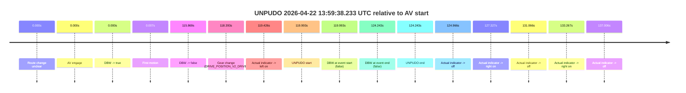
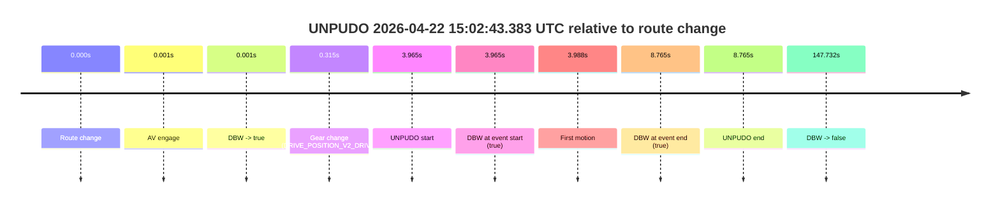
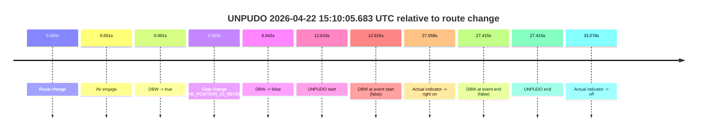

# Run Report: fme10010/2026-04-22--13-54-22--gen2-av-776e6413-6cfd-4985-8a89-a423678c808d

| Field | Value |
|---|---|
| Run ID | `fme10010/2026-04-22--13-54-22--gen2-av-776e6413-6cfd-4985-8a89-a423678c808d` |
| Date | `2026-04-22` |
| Model(s) | `eel-teal-outspoken` |
| Author | `zak` |
| Event count | `3` |

## unpudo 2026-04-22 13:59:38.233 UTC

| Field | Value |
|---|---|
| Model | `eel-teal-outspoken` |
| Author | `zak` |
| Run ID | `fme10010/2026-04-22--13-54-22--gen2-av-776e6413-6cfd-4985-8a89-a423678c808d` |
| Date | `2026-04-22` |
| Time (UTC) | `13:59:38.233` |
| Event type | `unpudo` |
| Disengagement type | `none observed` |
| Route change | `unclear` |
| Console | [run](https://console.sso.wayve.ai/run/fme10010/2026-04-22--13-54-22--gen2-av-776e6413-6cfd-4985-8a89-a423678c808d?id=&time-unixus=1776866378233311) |
| Foxglove | [segment](https://app.foxglove.dev/wayve-on-prem/p/prj_0dX18KZdVHg1fmmI/view?ds=foxglove-stream&ds.deviceName=fme10010&ds.start=2026-04-22T13%3A57%3A28.239936Z&ds.end=2026-04-22T13%3A59%3A52.483323Z&layoutId=lay_0e7VD4WIKDQGU73Y&time=2026-04-22T13%3A59%3A38.233311Z) |

### Event card: fail

- Fail: the credited unpudo does not stay AV-owned. The event window starts with DBW false, and the maneuver outcome lands outside a clean AV-owned segment.

| Event | Time (UTC) | Delta from AV start |
|---|---:|---:|
| Route change unclear | 2026-04-22 13:57:38.239 | `0.000s` |
| AV engage | 2026-04-22 13:57:38.239 | `0.000s` |
| DBW -> true | 2026-04-22 13:57:38.239 | `0.000s` |
| First motion | 2026-04-22 13:57:38.246 | `0.007s` |
| DBW -> false | 2026-04-22 13:59:34.109 | `115.869s` |
| Gear change (DRIVE_POSITION_V2_DRIVE) | 2026-04-22 13:59:36.633 | `118.393s` |
| Actual indicator -> left on | 2026-04-22 13:59:37.665 | `119.426s` |
| UNPUDO start | 2026-04-22 13:59:38.233 | `119.993s` |
| DBW at event start (false) | 2026-04-22 13:59:38.233 | `119.993s` |
| DBW at event end (false) | 2026-04-22 13:59:42.483 | `124.243s` |
| UNPUDO end | 2026-04-22 13:59:42.483 | `124.243s` |
| Actual indicator -> off | 2026-04-22 13:59:43.205 | `124.966s` |
| Actual indicator -> right on | 2026-04-22 13:59:45.566 | `127.327s` |
| Actual indicator -> off | 2026-04-22 13:59:49.305 | `131.066s` |
| Actual indicator -> right on | 2026-04-22 13:59:51.506 | `133.267s` |
| Actual indicator -> off | 2026-04-22 13:59:55.245 | `137.006s` |

| Metric | Value |
|---|---|
| Outcome | `fail` |
| Effective failure type | `not_av_owned` |
| Route change status | `unclear` |
| DBW at event start | `false` |
| DBW at event end | `false` |
| Predicted gear at AV start | `DRIVE_POSITION_V2_DRIVE` |
| Actual gear at AV start | `DRIVE_POSITION_V2_DRIVE` |
| Predicted gear at event start | `DRIVE_POSITION_V2_DRIVE` |
| Actual gear at event start | `DRIVE_POSITION_V2_DRIVE` |
| Planned indicator direction | `INDICATORS_STATE_V2_OFF` |
| Controller indicator direction | `INDICATORS_STATE_V2_OFF` |
| Actual indicator direction | `INDICATORS_STATE_V2_LEFT_ON` |
| Actual indicator at maneuver end | `INDICATORS_STATE_V2_LEFT_ON` |
| Driver accel help in AV | `false` |
| Driver accel help timestamp | `n/a` |
| Max accel pedal pct in AV | `0.0%` |
| Max brake pedal pct in AV | `8.0%` |
| Max speed mps in AV | `10.278` |
| Success timing baseline | `AV start` |
| Route -> AV | `n/a` |
| AV -> event start | `119.993s` |
| AV -> first motion | `0.007s` |
| Success baseline -> event start | `119.993s` |
| Success baseline -> first motion | `0.007s` |
| AV duration before disengagement | `115.869s` |
| Trajectory waypoint count | `38` |
| Driving-plan step count | `11` |

The scored portion starts from the AV-owned window, not from the pre-AV setup. Route-change search in the stopped pre-event segment was `unclear`, with the baseline therefore set to AV start. At the event anchor the model predicts `DRIVE_POSITION_V2_DRIVE` and the actual gear is `DRIVE_POSITION_V2_DRIVE`. The effective model outcome is `fail` because `not_av_owned.`

### Resolution

| Field | Value |
|---|---|
| Final outcome | `fail` |
| Do we agree with this label? | `yes` |
| Source disengagement type | `none observed` |
| Resolved effective failure type | `not_av_owned` |
| Confidence | `medium` |

## unpudo 2026-04-22 15:02:43.383 UTC

| Field | Value |
|---|---|
| Model | `eel-teal-outspoken` |
| Author | `zak` |
| Run ID | `fme10010/2026-04-22--13-54-22--gen2-av-776e6413-6cfd-4985-8a89-a423678c808d` |
| Date | `2026-04-22` |
| Time (UTC) | `15:02:43.383` |
| Event type | `unpudo` |
| Disengagement type | `none observed` |
| Route change | `found` |
| Console | [run](https://console.sso.wayve.ai/run/fme10010/2026-04-22--13-54-22--gen2-av-776e6413-6cfd-4985-8a89-a423678c808d?id=&time-unixus=1776870163383293) |
| Foxglove | [segment](https://app.foxglove.dev/wayve-on-prem/p/prj_0dX18KZdVHg1fmmI/view?ds=foxglove-stream&ds.deviceName=fme10010&ds.start=2026-04-22T15%3A02%3A29.418245Z&ds.end=2026-04-22T15%3A05%3A17.150129Z&layoutId=lay_0e7VD4WIKDQGU73Y&time=2026-04-22T15%3A02%3A43.383293Z) |

### Event card: pass

- Pass: AV owns the credited unpudo from route change through the official unpudo window, the gear state is aligned at the anchor, and the vehicle moves without driver accelerator help in AV.

| Event | Time (UTC) | Delta from route change |
|---|---:|---:|
| Route change | 2026-04-22 15:02:39.418 | `0.000s` |
| AV engage | 2026-04-22 15:02:39.419 | `0.001s` |
| DBW -> true | 2026-04-22 15:02:39.419 | `0.001s` |
| Gear change (DRIVE_POSITION_V2_DRIVE) | 2026-04-22 15:02:39.733 | `0.315s` |
| UNPUDO start | 2026-04-22 15:02:43.383 | `3.965s` |
| DBW at event start (true) | 2026-04-22 15:02:43.383 | `3.965s` |
| First motion | 2026-04-22 15:02:43.406 | `3.988s` |
| DBW at event end (true) | 2026-04-22 15:02:48.183 | `8.765s` |
| UNPUDO end | 2026-04-22 15:02:48.183 | `8.765s` |
| DBW -> false | 2026-04-22 15:05:07.150 | `147.732s` |

| Metric | Value |
|---|---|
| Outcome | `pass` |
| Effective failure type | `none` |
| Route change status | `found` |
| DBW at event start | `true` |
| DBW at event end | `true` |
| Predicted gear at AV start | `DRIVE_POSITION_V2_PARK` |
| Actual gear at AV start | `DRIVE_POSITION_V2_PARK` |
| Predicted gear at event start | `DRIVE_POSITION_V2_DRIVE` |
| Actual gear at event start | `DRIVE_POSITION_V2_DRIVE` |
| Planned indicator direction | `INDICATORS_STATE_V2_LEFT_ON` |
| Controller indicator direction | `INDICATORS_STATE_V2_LEFT_ON` |
| Actual indicator direction | `INDICATORS_STATE_V2_OFF` |
| Actual indicator at maneuver end | `INDICATORS_STATE_V2_OFF` |
| Driver accel help in AV | `false` |
| Driver accel help timestamp | `n/a` |
| Max accel pedal pct in AV | `0.0%` |
| Max brake pedal pct in AV | `27.5%` |
| Max speed mps in AV | `3.453` |
| Success timing baseline | `route change` |
| Route -> AV | `0.001s` |
| AV -> event start | `3.964s` |
| AV -> first motion | `3.987s` |
| Success baseline -> event start | `3.965s` |
| Success baseline -> first motion | `3.988s` |
| AV duration before disengagement | `147.731s` |
| Trajectory waypoint count | `37` |
| Driving-plan step count | `11` |

The scored portion starts from the AV-owned window, not from the pre-AV setup. Route-change search in the stopped pre-event segment was `found`, with the baseline therefore set to route change. At the event anchor the model predicts `DRIVE_POSITION_V2_DRIVE` and the actual gear is `DRIVE_POSITION_V2_DRIVE`. The effective model outcome is `pass` because `the credited unpudo stays AV-owned through the official unpudo window.`

### Resolution

| Field | Value |
|---|---|
| Final outcome | `pass` |
| Do we agree with this label? | `yes` |
| Source disengagement type | `none observed` |
| Resolved effective failure type | `none` |
| Confidence | `high` |

## unpudo 2026-04-22 15:10:05.683 UTC

| Field | Value |
|---|---|
| Model | `eel-teal-outspoken` |
| Author | `zak` |
| Run ID | `fme10010/2026-04-22--13-54-22--gen2-av-776e6413-6cfd-4985-8a89-a423678c808d` |
| Date | `2026-04-22` |
| Time (UTC) | `15:10:05.683` |
| Event type | `unpudo` |
| Disengagement type | `none observed` |
| Route change | `found` |
| Console | [run](https://console.sso.wayve.ai/run/fme10010/2026-04-22--13-54-22--gen2-av-776e6413-6cfd-4985-8a89-a423678c808d?id=&time-unixus=1776870605683292) |
| Foxglove | [segment](https://app.foxglove.dev/wayve-on-prem/p/prj_0dX18KZdVHg1fmmI/view?ds=foxglove-stream&ds.deviceName=fme10010&ds.start=2026-04-22T15%3A09%3A43.068265Z&ds.end=2026-04-22T15%3A10%3A30.483299Z&layoutId=lay_0e7VD4WIKDQGU73Y&time=2026-04-22T15%3A10%3A05.683292Z) |

### Event card: fail

- Fail: the credited unpudo does not stay AV-owned. The event window starts with DBW false, and the maneuver outcome lands outside a clean AV-owned segment.

| Event | Time (UTC) | Delta from route change |
|---|---:|---:|
| Route change | 2026-04-22 15:09:53.068 | `0.000s` |
| AV engage | 2026-04-22 15:09:53.069 | `0.001s` |
| DBW -> true | 2026-04-22 15:09:53.069 | `0.001s` |
| Gear change (DRIVE_POSITION_V2_REVERSE) | 2026-04-22 15:09:53.333 | `0.265s` |
| DBW -> false | 2026-04-22 15:10:00.009 | `6.942s` |
| UNPUDO start | 2026-04-22 15:10:05.683 | `12.615s` |
| DBW at event start (false) | 2026-04-22 15:10:05.683 | `12.615s` |
| Actual indicator -> right on | 2026-04-22 15:10:20.125 | `27.058s` |
| DBW at event end (false) | 2026-04-22 15:10:20.483 | `27.415s` |
| UNPUDO end | 2026-04-22 15:10:20.483 | `27.415s` |
| Actual indicator -> off | 2026-04-22 15:10:26.145 | `33.078s` |

| Metric | Value |
|---|---|
| Outcome | `fail` |
| Effective failure type | `not_av_owned` |
| Route change status | `found` |
| DBW at event start | `false` |
| DBW at event end | `false` |
| Predicted gear at AV start | `DRIVE_POSITION_V2_PARK` |
| Actual gear at AV start | `DRIVE_POSITION_V2_PARK` |
| Predicted gear at event start | `DRIVE_POSITION_V2_REVERSE` |
| Actual gear at event start | `DRIVE_POSITION_V2_REVERSE` |
| Planned indicator direction | `INDICATORS_STATE_V2_OFF` |
| Controller indicator direction | `INDICATORS_STATE_V2_OFF` |
| Actual indicator direction | `INDICATORS_STATE_V2_OFF` |
| Actual indicator at maneuver end | `INDICATORS_STATE_V2_RIGHT_ON` |
| Driver accel help in AV | `false` |
| Driver accel help timestamp | `n/a` |
| Max accel pedal pct in AV | `0.0%` |
| Max brake pedal pct in AV | `10.1%` |
| Max speed mps in AV | `0.000` |
| Success timing baseline | `route change` |
| Route -> AV | `0.001s` |
| AV -> event start | `12.614s` |
| AV -> first motion | `n/a` |
| Success baseline -> event start | `12.615s` |
| Success baseline -> first motion | `n/a` |
| AV duration before disengagement | `6.941s` |
| Trajectory waypoint count | `37` |
| Driving-plan step count | `11` |

The scored portion starts from the AV-owned window, not from the pre-AV setup. Route-change search in the stopped pre-event segment was `found`, with the baseline therefore set to route change. At the event anchor the model predicts `DRIVE_POSITION_V2_REVERSE` and the actual gear is `DRIVE_POSITION_V2_REVERSE`. The effective model outcome is `fail` because `not_av_owned.`

### Resolution

| Field | Value |
|---|---|
| Final outcome | `fail` |
| Do we agree with this label? | `yes` |
| Source disengagement type | `none observed` |
| Resolved effective failure type | `not_av_owned` |
| Confidence | `high` |
