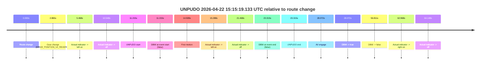
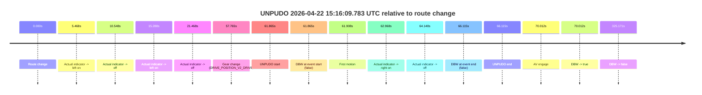
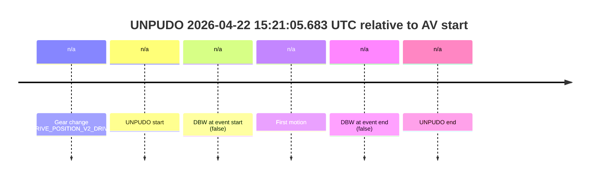
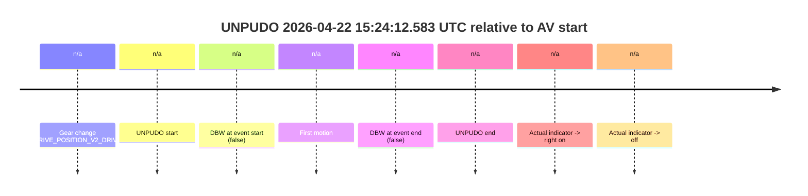
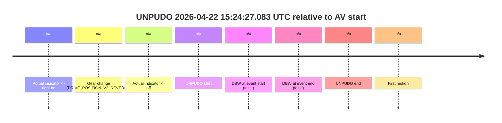
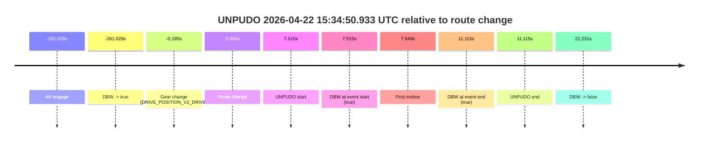
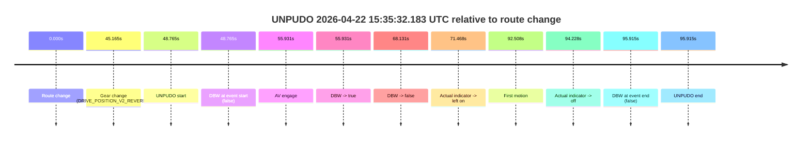
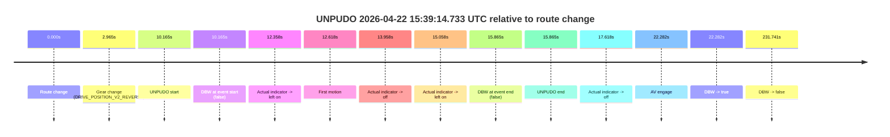
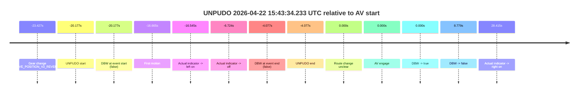
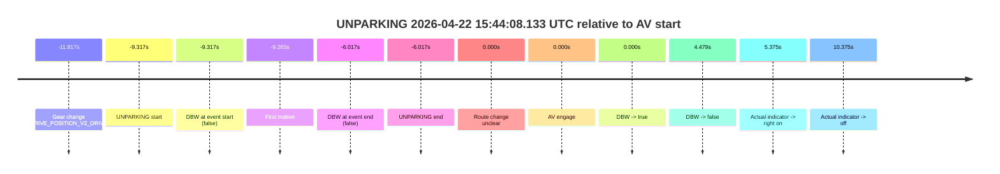

# Run Report: fme10010/2026-04-22--13-54-22--gen2-av-776e6413-6cfd-4985-8a89-a423678c808d

| Field | Value |
|---|---|
| Run ID | `fme10010/2026-04-22--13-54-22--gen2-av-776e6413-6cfd-4985-8a89-a423678c808d` |
| Date | `2026-04-22` |
| Model(s) | `mallard-plum-mysterious` |
| Author | `guy.geva` |
| Event count | `11` |

## unpudo 2026-04-22 15:15:19.133 UTC

| Field | Value |
|---|---|
| Model | `mallard-plum-mysterious` |
| Author | `guy.geva` |
| Run ID | `fme10010/2026-04-22--13-54-22--gen2-av-776e6413-6cfd-4985-8a89-a423678c808d` |
| Date | `2026-04-22` |
| Time (UTC) | `15:15:19.133` |
| Event type | `unpudo` |
| Disengagement type | `none observed` |
| Route change | `found` |
| Console | [run](https://console.sso.wayve.ai/run/fme10010/2026-04-22--13-54-22--gen2-av-776e6413-6cfd-4985-8a89-a423678c808d?id=&time-unixus=1776870919133311) |
| Foxglove | [segment](https://app.foxglove.dev/wayve-on-prem/p/prj_0dX18KZdVHg1fmmI/view?ds=foxglove-stream&ds.deviceName=fme10010&ds.start=2026-04-22T15%3A14%3A57.918254Z&ds.end=2026-04-22T15%3A16%3A14.729456Z&layoutId=lay_0e7VD4WIKDQGU73Y&time=2026-04-22T15%3A15%3A19.133311Z) |

### Event card: non-av

- Non-AV: there is no AV-owned portion anywhere inside the detected unpudo timeline, so it is kept for coverage but excluded from model success / failure scoring.

| Event | Time (UTC) | Delta from route change |
|---|---:|---:|
| Route change | 2026-04-22 15:15:07.918 | `0.000s` |
| Gear change (DRIVE_POSITION_V2_REVERSE) | 2026-04-22 15:15:10.783 | `2.865s` |
| Actual indicator -> left on | 2026-04-22 15:15:13.385 | `5.468s` |
| Actual indicator -> off | 2026-04-22 15:15:18.465 | `10.548s` |
| UNPUDO start | 2026-04-22 15:15:19.133 | `11.215s` |
| DBW at event start (false) | 2026-04-22 15:15:19.133 | `11.215s` |
| First motion | 2026-04-22 15:15:22.846 | `14.928s` |
| Actual indicator -> left on | 2026-04-22 15:15:23.205 | `15.288s` |
| Actual indicator -> off | 2026-04-22 15:15:29.385 | `21.468s` |
| DBW at event end (false) | 2026-04-22 15:15:31.233 | `23.315s` |
| UNPUDO end | 2026-04-22 15:15:31.233 | `23.315s` |
| AV engage | 2026-04-22 15:15:35.989 | `28.072s` |
| DBW -> true | 2026-04-22 15:15:35.989 | `28.072s` |
| DBW -> false | 2026-04-22 15:16:04.729 | `56.811s` |
| Actual indicator -> right on | 2026-04-22 15:16:10.886 | `62.968s` |
| Actual indicator -> off | 2026-04-22 15:16:12.066 | `64.148s` |

| Metric | Value |
|---|---|
| Outcome | `non-av` |
| Effective failure type | `none` |
| Route change status | `found` |
| DBW at event start | `false` |
| DBW at event end | `false` |
| Predicted gear at AV start | `DRIVE_POSITION_V2_DRIVE` |
| Actual gear at AV start | `DRIVE_POSITION_V2_DRIVE` |
| Predicted gear at event start | `DRIVE_POSITION_V2_REVERSE` |
| Actual gear at event start | `DRIVE_POSITION_V2_REVERSE` |
| Planned indicator direction | `INDICATORS_STATE_V2_LEFT_ON` |
| Controller indicator direction | `INDICATORS_STATE_V2_LEFT_ON` |
| Actual indicator direction | `INDICATORS_STATE_V2_OFF` |
| Actual indicator at maneuver end | `INDICATORS_STATE_V2_OFF` |
| Driver accel help in AV | `false` |
| Driver accel help timestamp | `n/a` |
| Max accel pedal pct in AV | `0.0%` |
| Max brake pedal pct in AV | `0.0%` |
| Max speed mps in AV | `0.000` |
| Route -> AV | `28.072s` |
| AV -> event start | `-16.857s` |
| AV -> first motion | `-13.144s` |
| AV duration before disengagement | `28.740s` |
| Trajectory waypoint count | `36` |
| Driving-plan step count | `11` |

The scored portion starts from the AV-owned window, not from the pre-AV setup. Route-change search in the stopped pre-event segment was `found`, with the baseline therefore set to route change. At the event anchor the model predicts `DRIVE_POSITION_V2_REVERSE` and the actual gear is `DRIVE_POSITION_V2_REVERSE`. The effective model outcome is `non-av` because `there is no AV-owned overlap inside the event timeline`.

### Resolution

| Field | Value |
|---|---|
| Final outcome | `non-av` |
| Do we agree with this label? | `yes` |
| Source disengagement type | `none observed` |
| Resolved effective failure type | `none` |
| Confidence | `high` |

## unpudo 2026-04-22 15:16:09.783 UTC

| Field | Value |
|---|---|
| Model | `mallard-plum-mysterious` |
| Author | `guy.geva` |
| Run ID | `fme10010/2026-04-22--13-54-22--gen2-av-776e6413-6cfd-4985-8a89-a423678c808d` |
| Date | `2026-04-22` |
| Time (UTC) | `15:16:09.783` |
| Event type | `unpudo` |
| Disengagement type | `none observed` |
| Route change | `found` |
| Console | [run](https://console.sso.wayve.ai/run/fme10010/2026-04-22--13-54-22--gen2-av-776e6413-6cfd-4985-8a89-a423678c808d?id=&time-unixus=1776870969783316) |
| Foxglove | [segment](https://app.foxglove.dev/wayve-on-prem/p/prj_0dX18KZdVHg1fmmI/view?ds=foxglove-stream&ds.deviceName=fme10010&ds.start=2026-04-22T15%3A14%3A57.918254Z&ds.end=2026-04-22T15%3A20%3A43.089419Z&layoutId=lay_0e7VD4WIKDQGU73Y&time=2026-04-22T15%3A16%3A09.783316Z) |

### Event card: non-av

- Non-AV: there is no AV-owned portion anywhere inside the detected unpudo timeline, so it is kept for coverage but excluded from model success / failure scoring.

| Event | Time (UTC) | Delta from route change |
|---|---:|---:|
| Route change | 2026-04-22 15:15:07.918 | `0.000s` |
| Actual indicator -> left on | 2026-04-22 15:15:13.385 | `5.468s` |
| Actual indicator -> off | 2026-04-22 15:15:18.465 | `10.548s` |
| Actual indicator -> left on | 2026-04-22 15:15:23.205 | `15.288s` |
| Actual indicator -> off | 2026-04-22 15:15:29.385 | `21.468s` |
| Gear change (DRIVE_POSITION_V2_DRIVE) | 2026-04-22 15:16:05.683 | `57.765s` |
| UNPUDO start | 2026-04-22 15:16:09.783 | `61.865s` |
| DBW at event start (false) | 2026-04-22 15:16:09.783 | `61.865s` |
| First motion | 2026-04-22 15:16:09.826 | `61.908s` |
| Actual indicator -> right on | 2026-04-22 15:16:10.886 | `62.968s` |
| Actual indicator -> off | 2026-04-22 15:16:12.066 | `64.148s` |
| DBW at event end (false) | 2026-04-22 15:16:14.033 | `66.115s` |
| UNPUDO end | 2026-04-22 15:16:14.033 | `66.115s` |
| AV engage | 2026-04-22 15:16:17.929 | `70.012s` |
| DBW -> true | 2026-04-22 15:16:17.929 | `70.012s` |
| DBW -> false | 2026-04-22 15:20:33.089 | `325.171s` |

| Metric | Value |
|---|---|
| Outcome | `non-av` |
| Effective failure type | `none` |
| Route change status | `found` |
| DBW at event start | `false` |
| DBW at event end | `false` |
| Predicted gear at AV start | `DRIVE_POSITION_V2_DRIVE` |
| Actual gear at AV start | `DRIVE_POSITION_V2_DRIVE` |
| Predicted gear at event start | `DRIVE_POSITION_V2_DRIVE` |
| Actual gear at event start | `DRIVE_POSITION_V2_DRIVE` |
| Planned indicator direction | `INDICATORS_STATE_V2_RIGHT_ON` |
| Controller indicator direction | `INDICATORS_STATE_V2_RIGHT_ON` |
| Actual indicator direction | `INDICATORS_STATE_V2_OFF` |
| Actual indicator at maneuver end | `INDICATORS_STATE_V2_OFF` |
| Driver accel help in AV | `false` |
| Driver accel help timestamp | `n/a` |
| Max accel pedal pct in AV | `0.0%` |
| Max brake pedal pct in AV | `0.0%` |
| Max speed mps in AV | `0.000` |
| Route -> AV | `70.012s` |
| AV -> event start | `-8.147s` |
| AV -> first motion | `-8.104s` |
| AV duration before disengagement | `255.159s` |
| Trajectory waypoint count | `37` |
| Driving-plan step count | `11` |

The scored portion starts from the AV-owned window, not from the pre-AV setup. Route-change search in the stopped pre-event segment was `found`, with the baseline therefore set to route change. At the event anchor the model predicts `DRIVE_POSITION_V2_DRIVE` and the actual gear is `DRIVE_POSITION_V2_DRIVE`. The effective model outcome is `non-av` because `there is no AV-owned overlap inside the event timeline`.

### Resolution

| Field | Value |
|---|---|
| Final outcome | `non-av` |
| Do we agree with this label? | `yes` |
| Source disengagement type | `none observed` |
| Resolved effective failure type | `none` |
| Confidence | `high` |

## unpudo 2026-04-22 15:21:05.683 UTC

| Field | Value |
|---|---|
| Model | `mallard-plum-mysterious` |
| Author | `guy.geva` |
| Run ID | `fme10010/2026-04-22--13-54-22--gen2-av-776e6413-6cfd-4985-8a89-a423678c808d` |
| Date | `2026-04-22` |
| Time (UTC) | `15:21:05.683` |
| Event type | `unpudo` |
| Disengagement type | `none observed` |
| Route change | `unclear` |
| Console | [run](https://console.sso.wayve.ai/run/fme10010/2026-04-22--13-54-22--gen2-av-776e6413-6cfd-4985-8a89-a423678c808d?id=&time-unixus=1776871265683296) |
| Foxglove | [segment](https://app.foxglove.dev/wayve-on-prem/p/prj_0dX18KZdVHg1fmmI/view?ds=foxglove-stream&ds.deviceName=fme10010&ds.start=2026-04-22T15%3A20%3A54.233316Z&ds.end=2026-04-22T15%3A21%3A19.933312Z&layoutId=lay_0e7VD4WIKDQGU73Y&time=2026-04-22T15%3A21%3A05.683296Z) |

### Event card: non-av

- Non-AV: there is no AV-owned portion anywhere inside the detected unpudo timeline, so it is kept for coverage but excluded from model success / failure scoring.

| Event | Time (UTC) | Delta from AV start |
|---|---:|---:|
| Gear change (DRIVE_POSITION_V2_DRIVE) | 2026-04-22 15:21:04.233 | `n/a` |
| UNPUDO start | 2026-04-22 15:21:05.683 | `n/a` |
| DBW at event start (false) | 2026-04-22 15:21:05.683 | `n/a` |
| First motion | 2026-04-22 15:21:05.706 | `n/a` |
| DBW at event end (false) | 2026-04-22 15:21:09.933 | `n/a` |
| UNPUDO end | 2026-04-22 15:21:09.933 | `n/a` |

| Metric | Value |
|---|---|
| Outcome | `non-av` |
| Effective failure type | `none` |
| Route change status | `unclear` |
| DBW at event start | `false` |
| DBW at event end | `false` |
| Predicted gear at AV start | `n/a` |
| Actual gear at AV start | `n/a` |
| Predicted gear at event start | `DRIVE_POSITION_V2_DRIVE` |
| Actual gear at event start | `DRIVE_POSITION_V2_DRIVE` |
| Planned indicator direction | `INDICATORS_STATE_V2_LEFT_ON` |
| Controller indicator direction | `INDICATORS_STATE_V2_LEFT_ON` |
| Actual indicator direction | `INDICATORS_STATE_V2_OFF` |
| Actual indicator at maneuver end | `INDICATORS_STATE_V2_OFF` |
| Driver accel help in AV | `false` |
| Driver accel help timestamp | `n/a` |
| Max accel pedal pct in AV | `0.0%` |
| Max brake pedal pct in AV | `0.0%` |
| Max speed mps in AV | `0.000` |
| Route -> AV | `n/a` |
| AV -> event start | `n/a` |
| AV -> first motion | `n/a` |
| AV duration before disengagement | `n/a` |
| Trajectory waypoint count | `37` |
| Driving-plan step count | `11` |

The scored portion starts from the AV-owned window, not from the pre-AV setup. Route-change search in the stopped pre-event segment was `unclear`, with the baseline therefore set to AV start. At the event anchor the model predicts `DRIVE_POSITION_V2_DRIVE` and the actual gear is `DRIVE_POSITION_V2_DRIVE`. The effective model outcome is `non-av` because `there is no AV-owned overlap inside the event timeline`.

### Resolution

| Field | Value |
|---|---|
| Final outcome | `non-av` |
| Do we agree with this label? | `yes` |
| Source disengagement type | `none observed` |
| Resolved effective failure type | `none` |
| Confidence | `medium` |

## unpudo 2026-04-22 15:24:12.583 UTC

| Field | Value |
|---|---|
| Model | `mallard-plum-mysterious` |
| Author | `guy.geva` |
| Run ID | `fme10010/2026-04-22--13-54-22--gen2-av-776e6413-6cfd-4985-8a89-a423678c808d` |
| Date | `2026-04-22` |
| Time (UTC) | `15:24:12.583` |
| Event type | `unpudo` |
| Disengagement type | `none observed` |
| Route change | `unclear` |
| Console | [run](https://console.sso.wayve.ai/run/fme10010/2026-04-22--13-54-22--gen2-av-776e6413-6cfd-4985-8a89-a423678c808d?id=&time-unixus=1776871452583305) |
| Foxglove | [segment](https://app.foxglove.dev/wayve-on-prem/p/prj_0dX18KZdVHg1fmmI/view?ds=foxglove-stream&ds.deviceName=fme10010&ds.start=2026-04-22T15%3A24%3A01.183292Z&ds.end=2026-04-22T15%3A24%3A26.283322Z&layoutId=lay_0e7VD4WIKDQGU73Y&time=2026-04-22T15%3A24%3A12.583305Z) |

### Event card: non-av

- Non-AV: there is no AV-owned portion anywhere inside the detected unpudo timeline, so it is kept for coverage but excluded from model success / failure scoring.

| Event | Time (UTC) | Delta from AV start |
|---|---:|---:|
| Gear change (DRIVE_POSITION_V2_DRIVE) | 2026-04-22 15:24:11.183 | `n/a` |
| UNPUDO start | 2026-04-22 15:24:12.583 | `n/a` |
| DBW at event start (false) | 2026-04-22 15:24:12.583 | `n/a` |
| First motion | 2026-04-22 15:24:12.605 | `n/a` |
| DBW at event end (false) | 2026-04-22 15:24:16.283 | `n/a` |
| UNPUDO end | 2026-04-22 15:24:16.283 | `n/a` |
| Actual indicator -> right on | 2026-04-22 15:24:17.825 | `n/a` |
| Actual indicator -> off | 2026-04-22 15:24:26.505 | `n/a` |

| Metric | Value |
|---|---|
| Outcome | `non-av` |
| Effective failure type | `none` |
| Route change status | `unclear` |
| DBW at event start | `false` |
| DBW at event end | `false` |
| Predicted gear at AV start | `n/a` |
| Actual gear at AV start | `n/a` |
| Predicted gear at event start | `DRIVE_POSITION_V2_DRIVE` |
| Actual gear at event start | `DRIVE_POSITION_V2_DRIVE` |
| Planned indicator direction | `INDICATORS_STATE_V2_OFF` |
| Controller indicator direction | `INDICATORS_STATE_V2_OFF` |
| Actual indicator direction | `INDICATORS_STATE_V2_OFF` |
| Actual indicator at maneuver end | `INDICATORS_STATE_V2_OFF` |
| Driver accel help in AV | `false` |
| Driver accel help timestamp | `n/a` |
| Max accel pedal pct in AV | `0.0%` |
| Max brake pedal pct in AV | `0.0%` |
| Max speed mps in AV | `0.000` |
| Route -> AV | `n/a` |
| AV -> event start | `n/a` |
| AV -> first motion | `n/a` |
| AV duration before disengagement | `n/a` |
| Trajectory waypoint count | `37` |
| Driving-plan step count | `11` |

The scored portion starts from the AV-owned window, not from the pre-AV setup. Route-change search in the stopped pre-event segment was `unclear`, with the baseline therefore set to AV start. At the event anchor the model predicts `DRIVE_POSITION_V2_DRIVE` and the actual gear is `DRIVE_POSITION_V2_DRIVE`. The effective model outcome is `non-av` because `there is no AV-owned overlap inside the event timeline`.

### Resolution

| Field | Value |
|---|---|
| Final outcome | `non-av` |
| Do we agree with this label? | `yes` |
| Source disengagement type | `none observed` |
| Resolved effective failure type | `none` |
| Confidence | `medium` |

## unpudo 2026-04-22 15:24:27.083 UTC

| Field | Value |
|---|---|
| Model | `mallard-plum-mysterious` |
| Author | `guy.geva` |
| Run ID | `fme10010/2026-04-22--13-54-22--gen2-av-776e6413-6cfd-4985-8a89-a423678c808d` |
| Date | `2026-04-22` |
| Time (UTC) | `15:24:27.083` |
| Event type | `unpudo` |
| Disengagement type | `none observed` |
| Route change | `unclear` |
| Console | [run](https://console.sso.wayve.ai/run/fme10010/2026-04-22--13-54-22--gen2-av-776e6413-6cfd-4985-8a89-a423678c808d?id=&time-unixus=1776871467083314) |
| Foxglove | [segment](https://app.foxglove.dev/wayve-on-prem/p/prj_0dX18KZdVHg1fmmI/view?ds=foxglove-stream&ds.deviceName=fme10010&ds.start=2026-04-22T15%3A24%3A12.833302Z&ds.end=2026-04-22T15%3A24%3A37.083314Z&layoutId=lay_0e7VD4WIKDQGU73Y&time=2026-04-22T15%3A24%3A27.083314Z) |

### Event card: non-av

- Non-AV: there is no AV-owned portion anywhere inside the detected unpudo timeline, so it is kept for coverage but excluded from model success / failure scoring.

| Event | Time (UTC) | Delta from AV start |
|---|---:|---:|
| Actual indicator -> right on | 2026-04-22 15:24:17.825 | `n/a` |
| Gear change (DRIVE_POSITION_V2_REVERSE) | 2026-04-22 15:24:22.833 | `n/a` |
| Actual indicator -> off | 2026-04-22 15:24:26.505 | `n/a` |
| UNPUDO start | 2026-04-22 15:24:27.083 | `n/a` |
| DBW at event start (false) | 2026-04-22 15:24:27.083 | `n/a` |
| DBW at event end (false) | 2026-04-22 15:24:27.083 | `n/a` |
| UNPUDO end | 2026-04-22 15:24:27.083 | `n/a` |
| First motion | 2026-04-22 15:24:32.305 | `n/a` |

| Metric | Value |
|---|---|
| Outcome | `non-av` |
| Effective failure type | `none` |
| Route change status | `unclear` |
| DBW at event start | `false` |
| DBW at event end | `false` |
| Predicted gear at AV start | `n/a` |
| Actual gear at AV start | `n/a` |
| Predicted gear at event start | `DRIVE_POSITION_V2_REVERSE` |
| Actual gear at event start | `DRIVE_POSITION_V2_REVERSE` |
| Planned indicator direction | `INDICATORS_STATE_V2_OFF` |
| Controller indicator direction | `INDICATORS_STATE_V2_OFF` |
| Actual indicator direction | `INDICATORS_STATE_V2_OFF` |
| Actual indicator at maneuver end | `INDICATORS_STATE_V2_OFF` |
| Driver accel help in AV | `false` |
| Driver accel help timestamp | `n/a` |
| Max accel pedal pct in AV | `0.0%` |
| Max brake pedal pct in AV | `0.0%` |
| Max speed mps in AV | `0.000` |
| Route -> AV | `n/a` |
| AV -> event start | `n/a` |
| AV -> first motion | `n/a` |
| AV duration before disengagement | `n/a` |
| Trajectory waypoint count | `37` |
| Driving-plan step count | `11` |

The scored portion starts from the AV-owned window, not from the pre-AV setup. Route-change search in the stopped pre-event segment was `unclear`, with the baseline therefore set to AV start. At the event anchor the model predicts `DRIVE_POSITION_V2_REVERSE` and the actual gear is `DRIVE_POSITION_V2_REVERSE`. The effective model outcome is `non-av` because `there is no AV-owned overlap inside the event timeline`.

### Resolution

| Field | Value |
|---|---|
| Final outcome | `non-av` |
| Do we agree with this label? | `yes` |
| Source disengagement type | `none observed` |
| Resolved effective failure type | `none` |
| Confidence | `medium` |

## unpudo 2026-04-22 15:34:50.933 UTC

| Field | Value |
|---|---|
| Model | `mallard-plum-mysterious` |
| Author | `guy.geva` |
| Run ID | `fme10010/2026-04-22--13-54-22--gen2-av-776e6413-6cfd-4985-8a89-a423678c808d` |
| Date | `2026-04-22` |
| Time (UTC) | `15:34:50.933` |
| Event type | `unpudo` |
| Disengagement type | `none observed` |
| Route change | `found` |
| Console | [run](https://console.sso.wayve.ai/run/fme10010/2026-04-22--13-54-22--gen2-av-776e6413-6cfd-4985-8a89-a423678c808d?id=&time-unixus=1776872090933306) |
| Foxglove | [segment](https://app.foxglove.dev/wayve-on-prem/p/prj_0dX18KZdVHg1fmmI/view?ds=foxglove-stream&ds.deviceName=fme10010&ds.start=2026-04-22T15%3A30%3A12.389948Z&ds.end=2026-04-22T15%3A35%3A15.649378Z&layoutId=lay_0e7VD4WIKDQGU73Y&time=2026-04-22T15%3A34%3A50.933306Z) |

### Event card: pass

- Pass: AV owns the credited unpudo through the official event window, the gear state is aligned at the anchor, and the vehicle moves without driver accelerator help in AV.

| Event | Time (UTC) | Delta from route change |
|---|---:|---:|
| AV engage | 2026-04-22 15:30:22.389 | `-261.028s` |
| DBW -> true | 2026-04-22 15:30:22.389 | `-261.028s` |
| Gear change (DRIVE_POSITION_V2_DRIVE) | 2026-04-22 15:34:43.233 | `-0.185s` |
| Route change | 2026-04-22 15:34:43.418 | `0.000s` |
| UNPUDO start | 2026-04-22 15:34:50.933 | `7.515s` |
| DBW at event start (true) | 2026-04-22 15:34:50.933 | `7.515s` |
| First motion | 2026-04-22 15:34:50.966 | `7.549s` |
| DBW at event end (true) | 2026-04-22 15:34:54.533 | `11.115s` |
| UNPUDO end | 2026-04-22 15:34:54.533 | `11.115s` |
| DBW -> false | 2026-04-22 15:35:05.649 | `22.231s` |

| Metric | Value |
|---|---|
| Outcome | `pass` |
| Effective failure type | `none` |
| Route change status | `found` |
| DBW at event start | `true` |
| DBW at event end | `true` |
| Predicted gear at AV start | `DRIVE_POSITION_V2_DRIVE` |
| Actual gear at AV start | `DRIVE_POSITION_V2_DRIVE` |
| Predicted gear at event start | `DRIVE_POSITION_V2_DRIVE` |
| Actual gear at event start | `DRIVE_POSITION_V2_DRIVE` |
| Planned indicator direction | `INDICATORS_STATE_V2_RIGHT_ON` |
| Controller indicator direction | `INDICATORS_STATE_V2_RIGHT_ON` |
| Actual indicator direction | `INDICATORS_STATE_V2_OFF` |
| Actual indicator at maneuver end | `INDICATORS_STATE_V2_OFF` |
| Driver accel help in AV | `false` |
| Driver accel help timestamp | `n/a` |
| Max accel pedal pct in AV | `0.0%` |
| Max brake pedal pct in AV | `0.0%` |
| Max speed mps in AV | `4.092` |
| Route -> AV | `-261.028s` |
| AV -> event start | `268.543s` |
| AV -> first motion | `268.577s` |
| AV duration before disengagement | `283.259s` |
| Trajectory waypoint count | `36` |
| Driving-plan step count | `11` |

The scored portion starts from the AV-owned window, not from the pre-AV setup. Route-change search in the stopped pre-event segment was `found`, with the baseline therefore set to route change. At the event anchor the model predicts `DRIVE_POSITION_V2_DRIVE` and the actual gear is `DRIVE_POSITION_V2_DRIVE`. The effective model outcome is `pass` because `the credited maneuver stays AV-owned through the official event end`.

### Resolution

| Field | Value |
|---|---|
| Final outcome | `pass` |
| Do we agree with this label? | `yes` |
| Source disengagement type | `none observed` |
| Resolved effective failure type | `none` |
| Confidence | `high` |

## unpudo 2026-04-22 15:35:32.183 UTC

| Field | Value |
|---|---|
| Model | `mallard-plum-mysterious` |
| Author | `guy.geva` |
| Run ID | `fme10010/2026-04-22--13-54-22--gen2-av-776e6413-6cfd-4985-8a89-a423678c808d` |
| Date | `2026-04-22` |
| Time (UTC) | `15:35:32.183` |
| Event type | `unpudo` |
| Disengagement type | `none observed` |
| Route change | `found` |
| Console | [run](https://console.sso.wayve.ai/run/fme10010/2026-04-22--13-54-22--gen2-av-776e6413-6cfd-4985-8a89-a423678c808d?id=&time-unixus=1776872132183291) |
| Foxglove | [segment](https://app.foxglove.dev/wayve-on-prem/p/prj_0dX18KZdVHg1fmmI/view?ds=foxglove-stream&ds.deviceName=fme10010&ds.start=2026-04-22T15%3A34%3A33.418255Z&ds.end=2026-04-22T15%3A36%3A29.333291Z&layoutId=lay_0e7VD4WIKDQGU73Y&time=2026-04-22T15%3A35%3A32.183291Z) |

### Event card: fail

- Fail: the credited unpudo does not stay AV-owned. The event window starts with DBW false, and the maneuver outcome lands outside a clean AV-owned segment.

| Event | Time (UTC) | Delta from route change |
|---|---:|---:|
| Route change | 2026-04-22 15:34:43.418 | `0.000s` |
| Gear change (DRIVE_POSITION_V2_REVERSE) | 2026-04-22 15:35:28.583 | `45.165s` |
| UNPUDO start | 2026-04-22 15:35:32.183 | `48.765s` |
| DBW at event start (false) | 2026-04-22 15:35:32.183 | `48.765s` |
| AV engage | 2026-04-22 15:35:39.349 | `55.931s` |
| DBW -> true | 2026-04-22 15:35:39.349 | `55.931s` |
| DBW -> false | 2026-04-22 15:35:51.549 | `68.131s` |
| Actual indicator -> left on | 2026-04-22 15:35:54.885 | `71.468s` |
| First motion | 2026-04-22 15:36:15.926 | `92.508s` |
| Actual indicator -> off | 2026-04-22 15:36:17.646 | `94.228s` |
| DBW at event end (false) | 2026-04-22 15:36:19.333 | `95.915s` |
| UNPUDO end | 2026-04-22 15:36:19.333 | `95.915s` |

| Metric | Value |
|---|---|
| Outcome | `fail` |
| Effective failure type | `not_av_owned` |
| Route change status | `found` |
| DBW at event start | `false` |
| DBW at event end | `false` |
| Predicted gear at AV start | `DRIVE_POSITION_V2_REVERSE` |
| Actual gear at AV start | `DRIVE_POSITION_V2_DRIVE` |
| Predicted gear at event start | `DRIVE_POSITION_V2_REVERSE` |
| Actual gear at event start | `DRIVE_POSITION_V2_REVERSE` |
| Planned indicator direction | `INDICATORS_STATE_V2_LEFT_ON` |
| Controller indicator direction | `INDICATORS_STATE_V2_LEFT_ON` |
| Actual indicator direction | `INDICATORS_STATE_V2_OFF` |
| Actual indicator at maneuver end | `INDICATORS_STATE_V2_OFF` |
| Driver accel help in AV | `false` |
| Driver accel help timestamp | `n/a` |
| Max accel pedal pct in AV | `0.0%` |
| Max brake pedal pct in AV | `8.0%` |
| Max speed mps in AV | `0.000` |
| Route -> AV | `55.931s` |
| AV -> event start | `-7.166s` |
| AV -> first motion | `36.577s` |
| AV duration before disengagement | `12.200s` |
| Trajectory waypoint count | `37` |
| Driving-plan step count | `11` |

The scored portion starts from the AV-owned window, not from the pre-AV setup. Route-change search in the stopped pre-event segment was `found`, with the baseline therefore set to route change. At the event anchor the model predicts `DRIVE_POSITION_V2_REVERSE` and the actual gear is `DRIVE_POSITION_V2_REVERSE`. The effective model outcome is `fail` because `not_av_owned`.

### Resolution

| Field | Value |
|---|---|
| Final outcome | `fail` |
| Do we agree with this label? | `yes` |
| Source disengagement type | `none observed` |
| Resolved effective failure type | `not_av_owned` |
| Confidence | `high` |

## unpudo 2026-04-22 15:39:14.733 UTC

| Field | Value |
|---|---|
| Model | `mallard-plum-mysterious` |
| Author | `guy.geva` |
| Run ID | `fme10010/2026-04-22--13-54-22--gen2-av-776e6413-6cfd-4985-8a89-a423678c808d` |
| Date | `2026-04-22` |
| Time (UTC) | `15:39:14.733` |
| Event type | `unpudo` |
| Disengagement type | `none observed` |
| Route change | `found` |
| Console | [run](https://console.sso.wayve.ai/run/fme10010/2026-04-22--13-54-22--gen2-av-776e6413-6cfd-4985-8a89-a423678c808d?id=&time-unixus=1776872354733317) |
| Foxglove | [segment](https://app.foxglove.dev/wayve-on-prem/p/prj_0dX18KZdVHg1fmmI/view?ds=foxglove-stream&ds.deviceName=fme10010&ds.start=2026-04-22T15%3A38%3A54.568258Z&ds.end=2026-04-22T15%3A43%3A06.309372Z&layoutId=lay_0e7VD4WIKDQGU73Y&time=2026-04-22T15%3A39%3A14.733317Z) |

### Event card: non-av

- Non-AV: there is no AV-owned portion anywhere inside the detected unpudo timeline, so it is kept for coverage but excluded from model success / failure scoring.

| Event | Time (UTC) | Delta from route change |
|---|---:|---:|
| Route change | 2026-04-22 15:39:04.568 | `0.000s` |
| Gear change (DRIVE_POSITION_V2_REVERSE) | 2026-04-22 15:39:07.533 | `2.965s` |
| UNPUDO start | 2026-04-22 15:39:14.733 | `10.165s` |
| DBW at event start (false) | 2026-04-22 15:39:14.733 | `10.165s` |
| Actual indicator -> left on | 2026-04-22 15:39:16.926 | `12.358s` |
| First motion | 2026-04-22 15:39:17.186 | `12.618s` |
| Actual indicator -> off | 2026-04-22 15:39:18.526 | `13.958s` |
| Actual indicator -> left on | 2026-04-22 15:39:19.626 | `15.058s` |
| DBW at event end (false) | 2026-04-22 15:39:20.433 | `15.865s` |
| UNPUDO end | 2026-04-22 15:39:20.433 | `15.865s` |
| Actual indicator -> off | 2026-04-22 15:39:22.185 | `17.618s` |
| AV engage | 2026-04-22 15:39:26.850 | `22.282s` |
| DBW -> true | 2026-04-22 15:39:26.850 | `22.282s` |
| DBW -> false | 2026-04-22 15:42:56.309 | `231.741s` |

| Metric | Value |
|---|---|
| Outcome | `non-av` |
| Effective failure type | `none` |
| Route change status | `found` |
| DBW at event start | `false` |
| DBW at event end | `false` |
| Predicted gear at AV start | `DRIVE_POSITION_V2_DRIVE` |
| Actual gear at AV start | `DRIVE_POSITION_V2_DRIVE` |
| Predicted gear at event start | `DRIVE_POSITION_V2_REVERSE` |
| Actual gear at event start | `DRIVE_POSITION_V2_REVERSE` |
| Planned indicator direction | `INDICATORS_STATE_V2_LEFT_ON` |
| Controller indicator direction | `INDICATORS_STATE_V2_LEFT_ON` |
| Actual indicator direction | `INDICATORS_STATE_V2_OFF` |
| Actual indicator at maneuver end | `INDICATORS_STATE_V2_LEFT_ON` |
| Driver accel help in AV | `false` |
| Driver accel help timestamp | `n/a` |
| Max accel pedal pct in AV | `0.0%` |
| Max brake pedal pct in AV | `0.0%` |
| Max speed mps in AV | `0.000` |
| Route -> AV | `22.282s` |
| AV -> event start | `-12.117s` |
| AV -> first motion | `-9.664s` |
| AV duration before disengagement | `209.459s` |
| Trajectory waypoint count | `36` |
| Driving-plan step count | `11` |

The scored portion starts from the AV-owned window, not from the pre-AV setup. Route-change search in the stopped pre-event segment was `found`, with the baseline therefore set to route change. At the event anchor the model predicts `DRIVE_POSITION_V2_REVERSE` and the actual gear is `DRIVE_POSITION_V2_REVERSE`. The effective model outcome is `non-av` because `there is no AV-owned overlap inside the event timeline`.

### Resolution

| Field | Value |
|---|---|
| Final outcome | `non-av` |
| Do we agree with this label? | `yes` |
| Source disengagement type | `none observed` |
| Resolved effective failure type | `none` |
| Confidence | `high` |

## unpudo 2026-04-22 15:41:44.733 UTC

| Field | Value |
|---|---|
| Model | `mallard-plum-mysterious` |
| Author | `guy.geva` |
| Run ID | `fme10010/2026-04-22--13-54-22--gen2-av-776e6413-6cfd-4985-8a89-a423678c808d` |
| Date | `2026-04-22` |
| Time (UTC) | `15:41:44.733` |
| Event type | `unpudo` |
| Disengagement type | `none observed` |
| Route change | `found` |
| Console | [run](https://console.sso.wayve.ai/run/fme10010/2026-04-22--13-54-22--gen2-av-776e6413-6cfd-4985-8a89-a423678c808d?id=&time-unixus=1776872504733298) |
| Foxglove | [segment](https://app.foxglove.dev/wayve-on-prem/p/prj_0dX18KZdVHg1fmmI/view?ds=foxglove-stream&ds.deviceName=fme10010&ds.start=2026-04-22T15%3A39%3A16.850722Z&ds.end=2026-04-22T15%3A43%3A06.309372Z&layoutId=lay_0e7VD4WIKDQGU73Y&time=2026-04-22T15%3A41%3A44.733298Z) |

### Event card: pass

- Pass: AV owns the credited unpudo through the official event window, the gear state is aligned at the anchor, and the vehicle moves without driver accelerator help in AV.

| Event | Time (UTC) | Delta from route change |
|---|---:|---:|
| AV engage | 2026-04-22 15:39:26.850 | `-127.018s` |
| DBW -> true | 2026-04-22 15:39:26.850 | `-127.018s` |
| Route change | 2026-04-22 15:41:33.868 | `0.000s` |
| Gear change (DRIVE_POSITION_V2_DRIVE) | 2026-04-22 15:41:34.233 | `0.365s` |
| UNPUDO start | 2026-04-22 15:41:44.733 | `10.865s` |
| DBW at event start (true) | 2026-04-22 15:41:44.733 | `10.865s` |
| First motion | 2026-04-22 15:41:44.765 | `10.898s` |
| DBW at event end (true) | 2026-04-22 15:41:48.233 | `14.365s` |
| UNPUDO end | 2026-04-22 15:41:48.233 | `14.365s` |
| DBW -> false | 2026-04-22 15:42:56.309 | `82.441s` |

| Metric | Value |
|---|---|
| Outcome | `pass` |
| Effective failure type | `none` |
| Route change status | `found` |
| DBW at event start | `true` |
| DBW at event end | `true` |
| Predicted gear at AV start | `DRIVE_POSITION_V2_DRIVE` |
| Actual gear at AV start | `DRIVE_POSITION_V2_DRIVE` |
| Predicted gear at event start | `DRIVE_POSITION_V2_DRIVE` |
| Actual gear at event start | `DRIVE_POSITION_V2_DRIVE` |
| Planned indicator direction | `INDICATORS_STATE_V2_LEFT_ON` |
| Controller indicator direction | `INDICATORS_STATE_V2_LEFT_ON` |
| Actual indicator direction | `INDICATORS_STATE_V2_OFF` |
| Actual indicator at maneuver end | `INDICATORS_STATE_V2_OFF` |
| Driver accel help in AV | `false` |
| Driver accel help timestamp | `n/a` |
| Max accel pedal pct in AV | `0.0%` |
| Max brake pedal pct in AV | `0.0%` |
| Max speed mps in AV | `5.147` |
| Route -> AV | `-127.018s` |
| AV -> event start | `137.883s` |
| AV -> first motion | `137.915s` |
| AV duration before disengagement | `209.459s` |
| Trajectory waypoint count | `36` |
| Driving-plan step count | `11` |

The scored portion starts from the AV-owned window, not from the pre-AV setup. Route-change search in the stopped pre-event segment was `found`, with the baseline therefore set to route change. At the event anchor the model predicts `DRIVE_POSITION_V2_DRIVE` and the actual gear is `DRIVE_POSITION_V2_DRIVE`. The effective model outcome is `pass` because `the credited maneuver stays AV-owned through the official event end`.

### Resolution

| Field | Value |
|---|---|
| Final outcome | `pass` |
| Do we agree with this label? | `yes` |
| Source disengagement type | `none observed` |
| Resolved effective failure type | `none` |
| Confidence | `high` |

## unpudo 2026-04-22 15:43:34.233 UTC

| Field | Value |
|---|---|
| Model | `mallard-plum-mysterious` |
| Author | `guy.geva` |
| Run ID | `fme10010/2026-04-22--13-54-22--gen2-av-776e6413-6cfd-4985-8a89-a423678c808d` |
| Date | `2026-04-22` |
| Time (UTC) | `15:43:34.233` |
| Event type | `unpudo` |
| Disengagement type | `none observed` |
| Route change | `unclear` |
| Console | [run](https://console.sso.wayve.ai/run/fme10010/2026-04-22--13-54-22--gen2-av-776e6413-6cfd-4985-8a89-a423678c808d?id=&time-unixus=1776872614233299) |
| Foxglove | [segment](https://app.foxglove.dev/wayve-on-prem/p/prj_0dX18KZdVHg1fmmI/view?ds=foxglove-stream&ds.deviceName=fme10010&ds.start=2026-04-22T15%3A43%3A20.983317Z&ds.end=2026-04-22T15%3A44%3A13.189420Z&layoutId=lay_0e7VD4WIKDQGU73Y&time=2026-04-22T15%3A43%3A34.233299Z) |

### Event card: non-av

- Non-AV: there is no AV-owned portion anywhere inside the detected unpudo timeline, so it is kept for coverage but excluded from model success / failure scoring.

| Event | Time (UTC) | Delta from AV start |
|---|---:|---:|
| Gear change (DRIVE_POSITION_V2_REVERSE) | 2026-04-22 15:43:30.983 | `-23.427s` |
| UNPUDO start | 2026-04-22 15:43:34.233 | `-20.177s` |
| DBW at event start (false) | 2026-04-22 15:43:34.233 | `-20.177s` |
| First motion | 2026-04-22 15:43:37.745 | `-16.665s` |
| Actual indicator -> left on | 2026-04-22 15:43:37.865 | `-16.545s` |
| Actual indicator -> off | 2026-04-22 15:43:47.686 | `-6.724s` |
| DBW at event end (false) | 2026-04-22 15:43:50.333 | `-4.077s` |
| UNPUDO end | 2026-04-22 15:43:50.333 | `-4.077s` |
| Route change unclear | 2026-04-22 15:43:54.410 | `0.000s` |
| AV engage | 2026-04-22 15:43:54.410 | `0.000s` |
| DBW -> true | 2026-04-22 15:43:54.410 | `0.000s` |
| DBW -> false | 2026-04-22 15:44:03.189 | `8.779s` |
| Actual indicator -> right on | 2026-04-22 15:44:22.825 | `28.415s` |

| Metric | Value |
|---|---|
| Outcome | `non-av` |
| Effective failure type | `none` |
| Route change status | `unclear` |
| DBW at event start | `false` |
| DBW at event end | `false` |
| Predicted gear at AV start | `DRIVE_POSITION_V2_DRIVE` |
| Actual gear at AV start | `DRIVE_POSITION_V2_DRIVE` |
| Predicted gear at event start | `DRIVE_POSITION_V2_REVERSE` |
| Actual gear at event start | `DRIVE_POSITION_V2_REVERSE` |
| Planned indicator direction | `INDICATORS_STATE_V2_OFF` |
| Controller indicator direction | `INDICATORS_STATE_V2_OFF` |
| Actual indicator direction | `INDICATORS_STATE_V2_OFF` |
| Actual indicator at maneuver end | `INDICATORS_STATE_V2_OFF` |
| Driver accel help in AV | `false` |
| Driver accel help timestamp | `n/a` |
| Max accel pedal pct in AV | `0.0%` |
| Max brake pedal pct in AV | `0.0%` |
| Max speed mps in AV | `0.000` |
| Route -> AV | `n/a` |
| AV -> event start | `-20.177s` |
| AV -> first motion | `-16.665s` |
| AV duration before disengagement | `8.779s` |
| Trajectory waypoint count | `36` |
| Driving-plan step count | `11` |

The scored portion starts from the AV-owned window, not from the pre-AV setup. Route-change search in the stopped pre-event segment was `unclear`, with the baseline therefore set to AV start. At the event anchor the model predicts `DRIVE_POSITION_V2_REVERSE` and the actual gear is `DRIVE_POSITION_V2_REVERSE`. The effective model outcome is `non-av` because `there is no AV-owned overlap inside the event timeline`.

### Resolution

| Field | Value |
|---|---|
| Final outcome | `non-av` |
| Do we agree with this label? | `yes` |
| Source disengagement type | `none observed` |
| Resolved effective failure type | `none` |
| Confidence | `medium` |

## unparking 2026-04-22 15:44:08.133 UTC

| Field | Value |
|---|---|
| Model | `mallard-plum-mysterious` |
| Author | `guy.geva` |
| Run ID | `fme10010/2026-04-22--13-54-22--gen2-av-776e6413-6cfd-4985-8a89-a423678c808d` |
| Date | `2026-04-22` |
| Time (UTC) | `15:44:08.133` |
| Event type | `unparking` |
| Disengagement type | `none observed` |
| Route change | `unclear` |
| Console | [run](https://console.sso.wayve.ai/run/fme10010/2026-04-22--13-54-22--gen2-av-776e6413-6cfd-4985-8a89-a423678c808d?id=&time-unixus=1776872648133318) |
| Foxglove | [segment](https://app.foxglove.dev/wayve-on-prem/p/prj_0dX18KZdVHg1fmmI/view?ds=foxglove-stream&ds.deviceName=fme10010&ds.start=2026-04-22T15%3A43%3A55.633311Z&ds.end=2026-04-22T15%3A44%3A31.929962Z&layoutId=lay_0e7VD4WIKDQGU73Y&time=2026-04-22T15%3A44%3A08.133318Z) |

### Event card: non-av

- Non-AV: there is no AV-owned portion anywhere inside the detected unparking timeline, so it is kept for coverage but excluded from model success / failure scoring.

| Event | Time (UTC) | Delta from AV start |
|---|---:|---:|
| Gear change (DRIVE_POSITION_V2_DRIVE) | 2026-04-22 15:44:05.633 | `-11.817s` |
| UNPARKING start | 2026-04-22 15:44:08.133 | `-9.317s` |
| DBW at event start (false) | 2026-04-22 15:44:08.133 | `-9.317s` |
| First motion | 2026-04-22 15:44:08.185 | `-9.265s` |
| DBW at event end (false) | 2026-04-22 15:44:11.433 | `-6.017s` |
| UNPARKING end | 2026-04-22 15:44:11.433 | `-6.017s` |
| Route change unclear | 2026-04-22 15:44:17.450 | `0.000s` |
| AV engage | 2026-04-22 15:44:17.450 | `0.000s` |
| DBW -> true | 2026-04-22 15:44:17.450 | `0.000s` |
| DBW -> false | 2026-04-22 15:44:21.929 | `4.479s` |
| Actual indicator -> right on | 2026-04-22 15:44:22.825 | `5.375s` |
| Actual indicator -> off | 2026-04-22 15:44:27.825 | `10.375s` |

| Metric | Value |
|---|---|
| Outcome | `non-av` |
| Effective failure type | `none` |
| Route change status | `unclear` |
| DBW at event start | `false` |
| DBW at event end | `false` |
| Predicted gear at AV start | `DRIVE_POSITION_V2_DRIVE` |
| Actual gear at AV start | `DRIVE_POSITION_V2_DRIVE` |
| Predicted gear at event start | `DRIVE_POSITION_V2_DRIVE` |
| Actual gear at event start | `DRIVE_POSITION_V2_DRIVE` |
| Planned indicator direction | `INDICATORS_STATE_V2_OFF` |
| Controller indicator direction | `INDICATORS_STATE_V2_OFF` |
| Actual indicator direction | `INDICATORS_STATE_V2_OFF` |
| Actual indicator at maneuver end | `INDICATORS_STATE_V2_OFF` |
| Driver accel help in AV | `false` |
| Driver accel help timestamp | `n/a` |
| Max accel pedal pct in AV | `0.0%` |
| Max brake pedal pct in AV | `0.0%` |
| Max speed mps in AV | `0.000` |
| Route -> AV | `n/a` |
| AV -> event start | `-9.317s` |
| AV -> first motion | `-9.265s` |
| AV duration before disengagement | `4.479s` |
| Trajectory waypoint count | `38` |
| Driving-plan step count | `11` |

The scored portion starts from the AV-owned window, not from the pre-AV setup. Route-change search in the stopped pre-event segment was `unclear`, with the baseline therefore set to AV start. At the event anchor the model predicts `DRIVE_POSITION_V2_DRIVE` and the actual gear is `DRIVE_POSITION_V2_DRIVE`. The effective model outcome is `non-av` because `there is no AV-owned overlap inside the event timeline`.

### Resolution

| Field | Value |
|---|---|
| Final outcome | `non-av` |
| Do we agree with this label? | `yes` |
| Source disengagement type | `none observed` |
| Resolved effective failure type | `none` |
| Confidence | `medium` |
