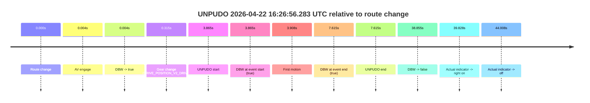
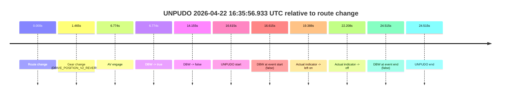
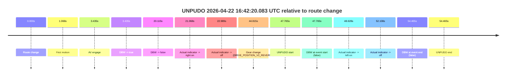
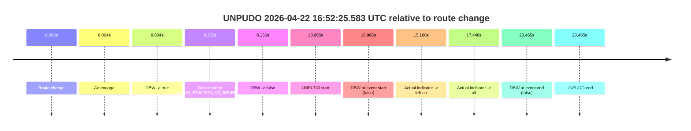
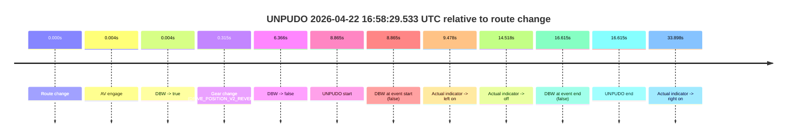
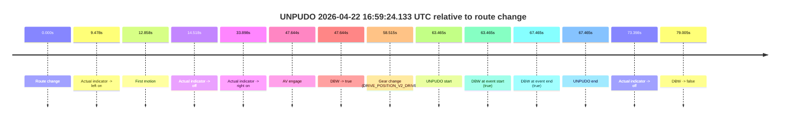
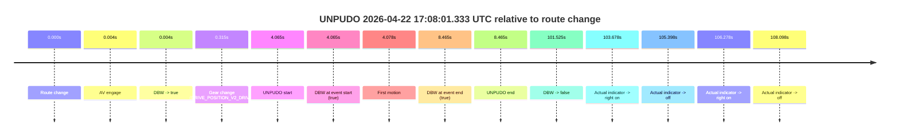
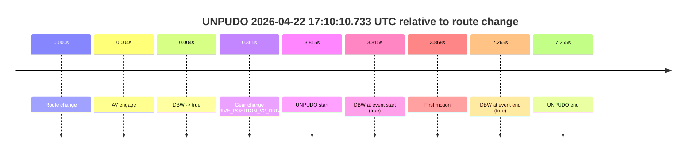

# Run Report: fme10010/2026-04-22--16-09-57--gen2-av-97310301-a8d4-4bb7-87aa-6bf157ad09e8

| Field | Value |
|---|---|
| Run ID | `fme10010/2026-04-22--16-09-57--gen2-av-97310301-a8d4-4bb7-87aa-6bf157ad09e8` |
| Date | `2026-04-22` |
| Model(s) | `eel-teal-outspoken` |
| Author | `zak` |
| Event count | `8` |

## unpudo 2026-04-22 16:26:56.283 UTC

| Field | Value |
|---|---|
| Model | `eel-teal-outspoken` |
| Author | `zak` |
| Run ID | `fme10010/2026-04-22--16-09-57--gen2-av-97310301-a8d4-4bb7-87aa-6bf157ad09e8` |
| Date | `2026-04-22` |
| Time (UTC) | `16:26:56.283` |
| Event type | `unpudo` |
| Disengagement type | `none observed` |
| Route change | `found` |
| Console | [run](https://console.sso.wayve.ai/run/fme10010/2026-04-22--16-09-57--gen2-av-97310301-a8d4-4bb7-87aa-6bf157ad09e8?id=&time-unixus=1776875216283319) |
| Foxglove | [segment](https://app.foxglove.dev/wayve-on-prem/p/prj_0dX18KZdVHg1fmmI/view?ds=foxglove-stream&ds.deviceName=fme10010&ds.start=2026-04-22T16%3A26%3A42.418245Z&ds.end=2026-04-22T16%3A27%3A41.273721Z&layoutId=lay_0e7VD4WIKDQGU73Y&time=2026-04-22T16%3A26%3A56.283319Z) |

### Event card: pass

- Pass: AV owns the credited unpudo from route change through the official unpudo window, the gear state is aligned at the anchor, and the vehicle moves without driver accelerator help in AV.

| Event | Time (UTC) | Delta from route change |
|---|---:|---:|
| Route change | 2026-04-22 16:26:52.418 | `0.000s` |
| AV engage | 2026-04-22 16:26:52.422 | `0.004s` |
| DBW -> true | 2026-04-22 16:26:52.422 | `0.004s` |
| Gear change (DRIVE_POSITION_V2_DRIVE) | 2026-04-22 16:26:52.733 | `0.315s` |
| UNPUDO start | 2026-04-22 16:26:56.283 | `3.865s` |
| DBW at event start (true) | 2026-04-22 16:26:56.283 | `3.865s` |
| First motion | 2026-04-22 16:26:56.325 | `3.908s` |
| DBW at event end (true) | 2026-04-22 16:27:00.033 | `7.615s` |
| UNPUDO end | 2026-04-22 16:27:00.033 | `7.615s` |
| DBW -> false | 2026-04-22 16:27:31.273 | `38.855s` |
| Actual indicator -> right on | 2026-04-22 16:27:32.246 | `39.828s` |
| Actual indicator -> off | 2026-04-22 16:27:36.425 | `44.008s` |

| Metric | Value |
|---|---|
| Outcome | `pass` |
| Effective failure type | `none` |
| Route change status | `found` |
| DBW at event start | `true` |
| DBW at event end | `true` |
| Predicted gear at AV start | `DRIVE_POSITION_V2_PARK` |
| Actual gear at AV start | `DRIVE_POSITION_V2_PARK` |
| Predicted gear at event start | `DRIVE_POSITION_V2_DRIVE` |
| Actual gear at event start | `DRIVE_POSITION_V2_DRIVE` |
| Planned indicator direction | `INDICATORS_STATE_V2_LEFT_ON` |
| Controller indicator direction | `INDICATORS_STATE_V2_LEFT_ON` |
| Actual indicator direction | `INDICATORS_STATE_V2_OFF` |
| Actual indicator at maneuver end | `INDICATORS_STATE_V2_OFF` |
| Driver accel help in AV | `false` |
| Driver accel help timestamp | `n/a` |
| Max accel pedal pct in AV | `0.0%` |
| Max brake pedal pct in AV | `8.0%` |
| Max speed mps in AV | `4.303` |
| Success timing baseline | `route change` |
| Route -> AV | `0.004s` |
| AV -> event start | `3.861s` |
| AV -> first motion | `3.903s` |
| Success baseline -> event start | `3.865s` |
| Success baseline -> first motion | `3.908s` |
| AV duration before disengagement | `38.851s` |
| Trajectory waypoint count | `37` |
| Driving-plan step count | `11` |

The scored portion starts from the AV-owned window, not from the pre-AV setup. Route-change search in the stopped pre-event segment was `found`, with the baseline therefore set to route change. At the event anchor the model predicts `DRIVE_POSITION_V2_DRIVE` and the actual gear is `DRIVE_POSITION_V2_DRIVE`. The effective model outcome is `pass` because `the credited unpudo stays AV-owned through the official unpudo window.`

### Resolution

| Field | Value |
|---|---|
| Final outcome | `pass` |
| Do we agree with this label? | `yes` |
| Source disengagement type | `none observed` |
| Resolved effective failure type | `none` |
| Confidence | `high` |

## unpudo 2026-04-22 16:35:56.933 UTC

| Field | Value |
|---|---|
| Model | `eel-teal-outspoken` |
| Author | `zak` |
| Run ID | `fme10010/2026-04-22--16-09-57--gen2-av-97310301-a8d4-4bb7-87aa-6bf157ad09e8` |
| Date | `2026-04-22` |
| Time (UTC) | `16:35:56.933` |
| Event type | `unpudo` |
| Disengagement type | `none observed` |
| Route change | `found` |
| Console | [run](https://console.sso.wayve.ai/run/fme10010/2026-04-22--16-09-57--gen2-av-97310301-a8d4-4bb7-87aa-6bf157ad09e8?id=&time-unixus=1776875756933299) |
| Foxglove | [segment](https://app.foxglove.dev/wayve-on-prem/p/prj_0dX18KZdVHg1fmmI/view?ds=foxglove-stream&ds.deviceName=fme10010&ds.start=2026-04-22T16%3A35%3A30.318248Z&ds.end=2026-04-22T16%3A36%3A14.833303Z&layoutId=lay_0e7VD4WIKDQGU73Y&time=2026-04-22T16%3A35%3A56.933299Z) |

### Event card: fail

- Fail: the credited unpudo does not stay AV-owned. The event window starts with DBW false, and the maneuver outcome lands outside a clean AV-owned segment.

| Event | Time (UTC) | Delta from route change |
|---|---:|---:|
| Route change | 2026-04-22 16:35:40.318 | `0.000s` |
| Gear change (DRIVE_POSITION_V2_REVERSE) | 2026-04-22 16:35:41.783 | `1.465s` |
| AV engage | 2026-04-22 16:35:47.092 | `6.774s` |
| DBW -> true | 2026-04-22 16:35:47.092 | `6.774s` |
| DBW -> false | 2026-04-22 16:35:54.473 | `14.155s` |
| UNPUDO start | 2026-04-22 16:35:56.933 | `16.615s` |
| DBW at event start (false) | 2026-04-22 16:35:56.933 | `16.615s` |
| Actual indicator -> left on | 2026-04-22 16:35:59.706 | `19.388s` |
| Actual indicator -> off | 2026-04-22 16:36:02.525 | `22.208s` |
| DBW at event end (false) | 2026-04-22 16:36:04.833 | `24.515s` |
| UNPUDO end | 2026-04-22 16:36:04.833 | `24.515s` |

| Metric | Value |
|---|---|
| Outcome | `fail` |
| Effective failure type | `not_av_owned` |
| Route change status | `found` |
| DBW at event start | `false` |
| DBW at event end | `false` |
| Predicted gear at AV start | `DRIVE_POSITION_V2_DRIVE` |
| Actual gear at AV start | `DRIVE_POSITION_V2_DRIVE` |
| Predicted gear at event start | `DRIVE_POSITION_V2_REVERSE` |
| Actual gear at event start | `DRIVE_POSITION_V2_REVERSE` |
| Planned indicator direction | `INDICATORS_STATE_V2_OFF` |
| Controller indicator direction | `INDICATORS_STATE_V2_OFF` |
| Actual indicator direction | `INDICATORS_STATE_V2_OFF` |
| Actual indicator at maneuver end | `INDICATORS_STATE_V2_OFF` |
| Driver accel help in AV | `false` |
| Driver accel help timestamp | `n/a` |
| Max accel pedal pct in AV | `0.0%` |
| Max brake pedal pct in AV | `8.0%` |
| Max speed mps in AV | `0.000` |
| Success timing baseline | `route change` |
| Route -> AV | `6.774s` |
| AV -> event start | `9.841s` |
| AV -> first motion | `n/a` |
| Success baseline -> event start | `16.615s` |
| Success baseline -> first motion | `n/a` |
| AV duration before disengagement | `7.381s` |
| Trajectory waypoint count | `38` |
| Driving-plan step count | `11` |

The scored portion starts from the AV-owned window, not from the pre-AV setup. Route-change search in the stopped pre-event segment was `found`, with the baseline therefore set to route change. At the event anchor the model predicts `DRIVE_POSITION_V2_REVERSE` and the actual gear is `DRIVE_POSITION_V2_REVERSE`. The effective model outcome is `fail` because `not_av_owned.`

### Resolution

| Field | Value |
|---|---|
| Final outcome | `fail` |
| Do we agree with this label? | `yes` |
| Source disengagement type | `none observed` |
| Resolved effective failure type | `not_av_owned` |
| Confidence | `high` |

## unpudo 2026-04-22 16:42:20.083 UTC

| Field | Value |
|---|---|
| Model | `eel-teal-outspoken` |
| Author | `zak` |
| Run ID | `fme10010/2026-04-22--16-09-57--gen2-av-97310301-a8d4-4bb7-87aa-6bf157ad09e8` |
| Date | `2026-04-22` |
| Time (UTC) | `16:42:20.083` |
| Event type | `unpudo` |
| Disengagement type | `none observed` |
| Route change | `found` |
| Console | [run](https://console.sso.wayve.ai/run/fme10010/2026-04-22--16-09-57--gen2-av-97310301-a8d4-4bb7-87aa-6bf157ad09e8?id=&time-unixus=1776876140083311) |
| Foxglove | [segment](https://app.foxglove.dev/wayve-on-prem/p/prj_0dX18KZdVHg1fmmI/view?ds=foxglove-stream&ds.deviceName=fme10010&ds.start=2026-04-22T16%3A41%3A22.318240Z&ds.end=2026-04-22T16%3A42%3A36.783300Z&layoutId=lay_0e7VD4WIKDQGU73Y&time=2026-04-22T16%3A42%3A20.083311Z) |

### Event card: fail

- Fail: the credited unpudo does not stay AV-owned. The event window starts with DBW false, and the maneuver outcome lands outside a clean AV-owned segment.

| Event | Time (UTC) | Delta from route change |
|---|---:|---:|
| Route change | 2026-04-22 16:41:32.318 | `0.000s` |
| First motion | 2026-04-22 16:41:33.385 | `1.068s` |
| AV engage | 2026-04-22 16:41:35.752 | `3.435s` |
| DBW -> true | 2026-04-22 16:41:35.752 | `3.435s` |
| DBW -> false | 2026-04-22 16:41:52.432 | `20.115s` |
| Actual indicator -> right on | 2026-04-22 16:41:53.386 | `21.068s` |
| Actual indicator -> off | 2026-04-22 16:41:55.306 | `22.989s` |
| Gear change (DRIVE_POSITION_V2_REVERSE) | 2026-04-22 16:42:17.133 | `44.815s` |
| UNPUDO start | 2026-04-22 16:42:20.083 | `47.765s` |
| DBW at event start (false) | 2026-04-22 16:42:20.083 | `47.765s` |
| Actual indicator -> left on | 2026-04-22 16:42:20.945 | `48.628s` |
| Actual indicator -> off | 2026-04-22 16:42:24.425 | `52.108s` |
| DBW at event end (false) | 2026-04-22 16:42:26.783 | `54.465s` |
| UNPUDO end | 2026-04-22 16:42:26.783 | `54.465s` |

| Metric | Value |
|---|---|
| Outcome | `fail` |
| Effective failure type | `completed_outside_av` |
| Route change status | `found` |
| DBW at event start | `false` |
| DBW at event end | `false` |
| Predicted gear at AV start | `DRIVE_POSITION_V2_DRIVE` |
| Actual gear at AV start | `DRIVE_POSITION_V2_DRIVE` |
| Predicted gear at event start | `DRIVE_POSITION_V2_REVERSE` |
| Actual gear at event start | `DRIVE_POSITION_V2_REVERSE` |
| Planned indicator direction | `INDICATORS_STATE_V2_OFF` |
| Controller indicator direction | `INDICATORS_STATE_V2_OFF` |
| Actual indicator direction | `INDICATORS_STATE_V2_OFF` |
| Actual indicator at maneuver end | `INDICATORS_STATE_V2_OFF` |
| Driver accel help in AV | `false` |
| Driver accel help timestamp | `n/a` |
| Max accel pedal pct in AV | `0.0%` |
| Max brake pedal pct in AV | `0.0%` |
| Max speed mps in AV | `7.911` |
| Success timing baseline | `route change` |
| Route -> AV | `3.435s` |
| AV -> event start | `44.330s` |
| AV -> first motion | `-2.367s` |
| Success baseline -> event start | `47.765s` |
| Success baseline -> first motion | `1.068s` |
| AV duration before disengagement | `16.680s` |
| Trajectory waypoint count | `37` |
| Driving-plan step count | `11` |

The scored portion starts from the AV-owned window, not from the pre-AV setup. Route-change search in the stopped pre-event segment was `found`, with the baseline therefore set to route change. At the event anchor the model predicts `DRIVE_POSITION_V2_REVERSE` and the actual gear is `DRIVE_POSITION_V2_REVERSE`. The effective model outcome is `fail` because `completed_outside_av.`

### Resolution

| Field | Value |
|---|---|
| Final outcome | `fail` |
| Do we agree with this label? | `yes` |
| Source disengagement type | `none observed` |
| Resolved effective failure type | `completed_outside_av` |
| Confidence | `high` |

## unpudo 2026-04-22 16:52:25.583 UTC

| Field | Value |
|---|---|
| Model | `eel-teal-outspoken` |
| Author | `zak` |
| Run ID | `fme10010/2026-04-22--16-09-57--gen2-av-97310301-a8d4-4bb7-87aa-6bf157ad09e8` |
| Date | `2026-04-22` |
| Time (UTC) | `16:52:25.583` |
| Event type | `unpudo` |
| Disengagement type | `none observed` |
| Route change | `found` |
| Console | [run](https://console.sso.wayve.ai/run/fme10010/2026-04-22--16-09-57--gen2-av-97310301-a8d4-4bb7-87aa-6bf157ad09e8?id=&time-unixus=1776876745583302) |
| Foxglove | [segment](https://app.foxglove.dev/wayve-on-prem/p/prj_0dX18KZdVHg1fmmI/view?ds=foxglove-stream&ds.deviceName=fme10010&ds.start=2026-04-22T16%3A52%3A04.618256Z&ds.end=2026-04-22T16%3A52%3A45.083296Z&layoutId=lay_0e7VD4WIKDQGU73Y&time=2026-04-22T16%3A52%3A25.583302Z) |

### Event card: fail

- Fail: the credited unpudo does not stay AV-owned. The event window starts with DBW false, and the maneuver outcome lands outside a clean AV-owned segment.

| Event | Time (UTC) | Delta from route change |
|---|---:|---:|
| Route change | 2026-04-22 16:52:14.618 | `0.000s` |
| AV engage | 2026-04-22 16:52:14.622 | `0.004s` |
| DBW -> true | 2026-04-22 16:52:14.622 | `0.004s` |
| Gear change (DRIVE_POSITION_V2_REVERSE) | 2026-04-22 16:52:14.983 | `0.365s` |
| DBW -> false | 2026-04-22 16:52:22.774 | `8.156s` |
| UNPUDO start | 2026-04-22 16:52:25.583 | `10.965s` |
| DBW at event start (false) | 2026-04-22 16:52:25.583 | `10.965s` |
| Actual indicator -> left on | 2026-04-22 16:52:29.785 | `15.168s` |
| Actual indicator -> off | 2026-04-22 16:52:32.065 | `17.448s` |
| DBW at event end (false) | 2026-04-22 16:52:35.083 | `20.465s` |
| UNPUDO end | 2026-04-22 16:52:35.083 | `20.465s` |

| Metric | Value |
|---|---|
| Outcome | `fail` |
| Effective failure type | `not_av_owned` |
| Route change status | `found` |
| DBW at event start | `false` |
| DBW at event end | `false` |
| Predicted gear at AV start | `DRIVE_POSITION_V2_PARK` |
| Actual gear at AV start | `DRIVE_POSITION_V2_PARK` |
| Predicted gear at event start | `DRIVE_POSITION_V2_REVERSE` |
| Actual gear at event start | `DRIVE_POSITION_V2_REVERSE` |
| Planned indicator direction | `INDICATORS_STATE_V2_OFF` |
| Controller indicator direction | `INDICATORS_STATE_V2_OFF` |
| Actual indicator direction | `INDICATORS_STATE_V2_OFF` |
| Actual indicator at maneuver end | `INDICATORS_STATE_V2_OFF` |
| Driver accel help in AV | `false` |
| Driver accel help timestamp | `n/a` |
| Max accel pedal pct in AV | `0.0%` |
| Max brake pedal pct in AV | `30.0%` |
| Max speed mps in AV | `0.000` |
| Success timing baseline | `route change` |
| Route -> AV | `0.004s` |
| AV -> event start | `10.961s` |
| AV -> first motion | `n/a` |
| Success baseline -> event start | `10.965s` |
| Success baseline -> first motion | `n/a` |
| AV duration before disengagement | `8.152s` |
| Trajectory waypoint count | `37` |
| Driving-plan step count | `11` |

The scored portion starts from the AV-owned window, not from the pre-AV setup. Route-change search in the stopped pre-event segment was `found`, with the baseline therefore set to route change. At the event anchor the model predicts `DRIVE_POSITION_V2_REVERSE` and the actual gear is `DRIVE_POSITION_V2_REVERSE`. The effective model outcome is `fail` because `not_av_owned.`

### Resolution

| Field | Value |
|---|---|
| Final outcome | `fail` |
| Do we agree with this label? | `yes` |
| Source disengagement type | `none observed` |
| Resolved effective failure type | `not_av_owned` |
| Confidence | `high` |

## unpudo 2026-04-22 16:58:29.533 UTC

| Field | Value |
|---|---|
| Model | `eel-teal-outspoken` |
| Author | `zak` |
| Run ID | `fme10010/2026-04-22--16-09-57--gen2-av-97310301-a8d4-4bb7-87aa-6bf157ad09e8` |
| Date | `2026-04-22` |
| Time (UTC) | `16:58:29.533` |
| Event type | `unpudo` |
| Disengagement type | `none observed` |
| Route change | `found` |
| Console | [run](https://console.sso.wayve.ai/run/fme10010/2026-04-22--16-09-57--gen2-av-97310301-a8d4-4bb7-87aa-6bf157ad09e8?id=&time-unixus=1776877109533293) |
| Foxglove | [segment](https://app.foxglove.dev/wayve-on-prem/p/prj_0dX18KZdVHg1fmmI/view?ds=foxglove-stream&ds.deviceName=fme10010&ds.start=2026-04-22T16%3A58%3A10.668233Z&ds.end=2026-04-22T16%3A58%3A47.283302Z&layoutId=lay_0e7VD4WIKDQGU73Y&time=2026-04-22T16%3A58%3A29.533293Z) |

### Event card: fail

- Fail: the credited unpudo does not stay AV-owned. The event window starts with DBW false, and the maneuver outcome lands outside a clean AV-owned segment.

| Event | Time (UTC) | Delta from route change |
|---|---:|---:|
| Route change | 2026-04-22 16:58:20.668 | `0.000s` |
| AV engage | 2026-04-22 16:58:20.672 | `0.004s` |
| DBW -> true | 2026-04-22 16:58:20.672 | `0.004s` |
| Gear change (DRIVE_POSITION_V2_REVERSE) | 2026-04-22 16:58:20.983 | `0.315s` |
| DBW -> false | 2026-04-22 16:58:27.034 | `6.366s` |
| UNPUDO start | 2026-04-22 16:58:29.533 | `8.865s` |
| DBW at event start (false) | 2026-04-22 16:58:29.533 | `8.865s` |
| Actual indicator -> left on | 2026-04-22 16:58:30.146 | `9.478s` |
| Actual indicator -> off | 2026-04-22 16:58:35.185 | `14.518s` |
| DBW at event end (false) | 2026-04-22 16:58:37.283 | `16.615s` |
| UNPUDO end | 2026-04-22 16:58:37.283 | `16.615s` |
| Actual indicator -> right on | 2026-04-22 16:58:54.565 | `33.898s` |

| Metric | Value |
|---|---|
| Outcome | `fail` |
| Effective failure type | `not_av_owned` |
| Route change status | `found` |
| DBW at event start | `false` |
| DBW at event end | `false` |
| Predicted gear at AV start | `DRIVE_POSITION_V2_PARK` |
| Actual gear at AV start | `DRIVE_POSITION_V2_PARK` |
| Predicted gear at event start | `DRIVE_POSITION_V2_REVERSE` |
| Actual gear at event start | `DRIVE_POSITION_V2_REVERSE` |
| Planned indicator direction | `INDICATORS_STATE_V2_OFF` |
| Controller indicator direction | `INDICATORS_STATE_V2_OFF` |
| Actual indicator direction | `INDICATORS_STATE_V2_OFF` |
| Actual indicator at maneuver end | `INDICATORS_STATE_V2_OFF` |
| Driver accel help in AV | `false` |
| Driver accel help timestamp | `n/a` |
| Max accel pedal pct in AV | `0.0%` |
| Max brake pedal pct in AV | `27.5%` |
| Max speed mps in AV | `0.000` |
| Success timing baseline | `route change` |
| Route -> AV | `0.004s` |
| AV -> event start | `8.861s` |
| AV -> first motion | `n/a` |
| Success baseline -> event start | `8.865s` |
| Success baseline -> first motion | `n/a` |
| AV duration before disengagement | `6.362s` |
| Trajectory waypoint count | `38` |
| Driving-plan step count | `11` |

The scored portion starts from the AV-owned window, not from the pre-AV setup. Route-change search in the stopped pre-event segment was `found`, with the baseline therefore set to route change. At the event anchor the model predicts `DRIVE_POSITION_V2_REVERSE` and the actual gear is `DRIVE_POSITION_V2_REVERSE`. The effective model outcome is `fail` because `not_av_owned.`

### Resolution

| Field | Value |
|---|---|
| Final outcome | `fail` |
| Do we agree with this label? | `yes` |
| Source disengagement type | `none observed` |
| Resolved effective failure type | `not_av_owned` |
| Confidence | `high` |

## unpudo 2026-04-22 16:59:24.133 UTC

| Field | Value |
|---|---|
| Model | `eel-teal-outspoken` |
| Author | `zak` |
| Run ID | `fme10010/2026-04-22--16-09-57--gen2-av-97310301-a8d4-4bb7-87aa-6bf157ad09e8` |
| Date | `2026-04-22` |
| Time (UTC) | `16:59:24.133` |
| Event type | `unpudo` |
| Disengagement type | `none observed` |
| Route change | `found` |
| Console | [run](https://console.sso.wayve.ai/run/fme10010/2026-04-22--16-09-57--gen2-av-97310301-a8d4-4bb7-87aa-6bf157ad09e8?id=&time-unixus=1776877164133315) |
| Foxglove | [segment](https://app.foxglove.dev/wayve-on-prem/p/prj_0dX18KZdVHg1fmmI/view?ds=foxglove-stream&ds.deviceName=fme10010&ds.start=2026-04-22T16%3A58%3A10.668233Z&ds.end=2026-04-22T16%3A59%3A49.673583Z&layoutId=lay_0e7VD4WIKDQGU73Y&time=2026-04-22T16%3A59%3A24.133315Z) |

### Event card: pass

- Pass: AV owns the credited unpudo from route change through the official unpudo window, the gear state is aligned at the anchor, and the vehicle moves without driver accelerator help in AV.

| Event | Time (UTC) | Delta from route change |
|---|---:|---:|
| Route change | 2026-04-22 16:58:20.668 | `0.000s` |
| Actual indicator -> left on | 2026-04-22 16:58:30.146 | `9.478s` |
| First motion | 2026-04-22 16:58:33.525 | `12.858s` |
| Actual indicator -> off | 2026-04-22 16:58:35.185 | `14.518s` |
| Actual indicator -> right on | 2026-04-22 16:58:54.565 | `33.898s` |
| AV engage | 2026-04-22 16:59:08.312 | `47.644s` |
| DBW -> true | 2026-04-22 16:59:08.312 | `47.644s` |
| Gear change (DRIVE_POSITION_V2_DRIVE) | 2026-04-22 16:59:19.183 | `58.515s` |
| UNPUDO start | 2026-04-22 16:59:24.133 | `63.465s` |
| DBW at event start (true) | 2026-04-22 16:59:24.133 | `63.465s` |
| DBW at event end (true) | 2026-04-22 16:59:28.133 | `67.465s` |
| UNPUDO end | 2026-04-22 16:59:28.133 | `67.465s` |
| Actual indicator -> off | 2026-04-22 16:59:34.065 | `73.398s` |
| DBW -> false | 2026-04-22 16:59:39.673 | `79.005s` |

| Metric | Value |
|---|---|
| Outcome | `pass` |
| Effective failure type | `none` |
| Route change status | `found` |
| DBW at event start | `true` |
| DBW at event end | `true` |
| Predicted gear at AV start | `DRIVE_POSITION_V2_PARK` |
| Actual gear at AV start | `DRIVE_POSITION_V2_PARK` |
| Predicted gear at event start | `DRIVE_POSITION_V2_DRIVE` |
| Actual gear at event start | `DRIVE_POSITION_V2_DRIVE` |
| Planned indicator direction | `INDICATORS_STATE_V2_OFF` |
| Controller indicator direction | `INDICATORS_STATE_V2_OFF` |
| Actual indicator direction | `INDICATORS_STATE_V2_RIGHT_ON` |
| Actual indicator at maneuver end | `INDICATORS_STATE_V2_RIGHT_ON` |
| Driver accel help in AV | `false` |
| Driver accel help timestamp | `n/a` |
| Max accel pedal pct in AV | `0.0%` |
| Max brake pedal pct in AV | `29.6%` |
| Max speed mps in AV | `4.200` |
| Success timing baseline | `route change` |
| Route -> AV | `47.644s` |
| AV -> event start | `15.821s` |
| AV -> first motion | `-34.786s` |
| Success baseline -> event start | `63.465s` |
| Success baseline -> first motion | `12.858s` |
| AV duration before disengagement | `31.361s` |
| Trajectory waypoint count | `38` |
| Driving-plan step count | `11` |

The scored portion starts from the AV-owned window, not from the pre-AV setup. Route-change search in the stopped pre-event segment was `found`, with the baseline therefore set to route change. At the event anchor the model predicts `DRIVE_POSITION_V2_DRIVE` and the actual gear is `DRIVE_POSITION_V2_DRIVE`. The effective model outcome is `pass` because `the credited unpudo stays AV-owned through the official unpudo window.`

### Resolution

| Field | Value |
|---|---|
| Final outcome | `pass` |
| Do we agree with this label? | `yes` |
| Source disengagement type | `none observed` |
| Resolved effective failure type | `none` |
| Confidence | `high` |

## unpudo 2026-04-22 17:08:01.333 UTC

| Field | Value |
|---|---|
| Model | `eel-teal-outspoken` |
| Author | `zak` |
| Run ID | `fme10010/2026-04-22--16-09-57--gen2-av-97310301-a8d4-4bb7-87aa-6bf157ad09e8` |
| Date | `2026-04-22` |
| Time (UTC) | `17:08:01.333` |
| Event type | `unpudo` |
| Disengagement type | `none observed` |
| Route change | `found` |
| Console | [run](https://console.sso.wayve.ai/run/fme10010/2026-04-22--16-09-57--gen2-av-97310301-a8d4-4bb7-87aa-6bf157ad09e8?id=&time-unixus=1776877681333291) |
| Foxglove | [segment](https://app.foxglove.dev/wayve-on-prem/p/prj_0dX18KZdVHg1fmmI/view?ds=foxglove-stream&ds.deviceName=fme10010&ds.start=2026-04-22T17%3A07%3A47.268251Z&ds.end=2026-04-22T17%3A09%3A48.792970Z&layoutId=lay_0e7VD4WIKDQGU73Y&time=2026-04-22T17%3A08%3A01.333291Z) |

### Event card: pass

- Pass: AV owns the credited unpudo from route change through the official unpudo window, the gear state is aligned at the anchor, and the vehicle moves without driver accelerator help in AV.

| Event | Time (UTC) | Delta from route change |
|---|---:|---:|
| Route change | 2026-04-22 17:07:57.268 | `0.000s` |
| AV engage | 2026-04-22 17:07:57.272 | `0.004s` |
| DBW -> true | 2026-04-22 17:07:57.272 | `0.004s` |
| Gear change (DRIVE_POSITION_V2_DRIVE) | 2026-04-22 17:07:57.583 | `0.315s` |
| UNPUDO start | 2026-04-22 17:08:01.333 | `4.065s` |
| DBW at event start (true) | 2026-04-22 17:08:01.333 | `4.065s` |
| First motion | 2026-04-22 17:08:01.346 | `4.078s` |
| DBW at event end (true) | 2026-04-22 17:08:05.733 | `8.465s` |
| UNPUDO end | 2026-04-22 17:08:05.733 | `8.465s` |
| DBW -> false | 2026-04-22 17:09:38.792 | `101.525s` |
| Actual indicator -> right on | 2026-04-22 17:09:40.946 | `103.678s` |
| Actual indicator -> off | 2026-04-22 17:09:42.666 | `105.398s` |
| Actual indicator -> right on | 2026-04-22 17:09:43.545 | `106.278s` |
| Actual indicator -> off | 2026-04-22 17:09:45.365 | `108.098s` |

| Metric | Value |
|---|---|
| Outcome | `pass` |
| Effective failure type | `none` |
| Route change status | `found` |
| DBW at event start | `true` |
| DBW at event end | `true` |
| Predicted gear at AV start | `DRIVE_POSITION_V2_PARK` |
| Actual gear at AV start | `DRIVE_POSITION_V2_PARK` |
| Predicted gear at event start | `DRIVE_POSITION_V2_DRIVE` |
| Actual gear at event start | `DRIVE_POSITION_V2_DRIVE` |
| Planned indicator direction | `INDICATORS_STATE_V2_LEFT_ON` |
| Controller indicator direction | `INDICATORS_STATE_V2_LEFT_ON` |
| Actual indicator direction | `INDICATORS_STATE_V2_OFF` |
| Actual indicator at maneuver end | `INDICATORS_STATE_V2_OFF` |
| Driver accel help in AV | `false` |
| Driver accel help timestamp | `n/a` |
| Max accel pedal pct in AV | `0.0%` |
| Max brake pedal pct in AV | `9.5%` |
| Max speed mps in AV | `4.669` |
| Success timing baseline | `route change` |
| Route -> AV | `0.004s` |
| AV -> event start | `4.061s` |
| AV -> first motion | `4.074s` |
| Success baseline -> event start | `4.065s` |
| Success baseline -> first motion | `4.078s` |
| AV duration before disengagement | `101.521s` |
| Trajectory waypoint count | `38` |
| Driving-plan step count | `11` |

The scored portion starts from the AV-owned window, not from the pre-AV setup. Route-change search in the stopped pre-event segment was `found`, with the baseline therefore set to route change. At the event anchor the model predicts `DRIVE_POSITION_V2_DRIVE` and the actual gear is `DRIVE_POSITION_V2_DRIVE`. The effective model outcome is `pass` because `the credited unpudo stays AV-owned through the official unpudo window.`

### Resolution

| Field | Value |
|---|---|
| Final outcome | `pass` |
| Do we agree with this label? | `yes` |
| Source disengagement type | `none observed` |
| Resolved effective failure type | `none` |
| Confidence | `high` |

## unpudo 2026-04-22 17:10:10.733 UTC

| Field | Value |
|---|---|
| Model | `eel-teal-outspoken` |
| Author | `zak` |
| Run ID | `fme10010/2026-04-22--16-09-57--gen2-av-97310301-a8d4-4bb7-87aa-6bf157ad09e8` |
| Date | `2026-04-22` |
| Time (UTC) | `17:10:10.733` |
| Event type | `unpudo` |
| Disengagement type | `none observed` |
| Route change | `found` |
| Console | [run](https://console.sso.wayve.ai/run/fme10010/2026-04-22--16-09-57--gen2-av-97310301-a8d4-4bb7-87aa-6bf157ad09e8?id=&time-unixus=1776877810733305) |
| Foxglove | [segment](https://app.foxglove.dev/wayve-on-prem/p/prj_0dX18KZdVHg1fmmI/view?ds=foxglove-stream&ds.deviceName=fme10010&ds.start=2026-04-22T17%3A09%3A56.918263Z&ds.end=2026-04-22T17%3A10%3A24.183314Z&layoutId=lay_0e7VD4WIKDQGU73Y&time=2026-04-22T17%3A10%3A10.733305Z) |

### Event card: pass

- Pass: AV owns the credited unpudo from route change through the official unpudo window, the gear state is aligned at the anchor, and the vehicle moves without driver accelerator help in AV.

| Event | Time (UTC) | Delta from route change |
|---|---:|---:|
| Route change | 2026-04-22 17:10:06.918 | `0.000s` |
| AV engage | 2026-04-22 17:10:06.922 | `0.004s` |
| DBW -> true | 2026-04-22 17:10:06.922 | `0.004s` |
| Gear change (DRIVE_POSITION_V2_DRIVE) | 2026-04-22 17:10:07.283 | `0.365s` |
| UNPUDO start | 2026-04-22 17:10:10.733 | `3.815s` |
| DBW at event start (true) | 2026-04-22 17:10:10.733 | `3.815s` |
| First motion | 2026-04-22 17:10:10.785 | `3.868s` |
| DBW at event end (true) | 2026-04-22 17:10:14.183 | `7.265s` |
| UNPUDO end | 2026-04-22 17:10:14.183 | `7.265s` |

| Metric | Value |
|---|---|
| Outcome | `pass` |
| Effective failure type | `none` |
| Route change status | `found` |
| DBW at event start | `true` |
| DBW at event end | `true` |
| Predicted gear at AV start | `DRIVE_POSITION_V2_PARK` |
| Actual gear at AV start | `DRIVE_POSITION_V2_PARK` |
| Predicted gear at event start | `DRIVE_POSITION_V2_DRIVE` |
| Actual gear at event start | `DRIVE_POSITION_V2_DRIVE` |
| Planned indicator direction | `INDICATORS_STATE_V2_LEFT_ON` |
| Controller indicator direction | `INDICATORS_STATE_V2_LEFT_ON` |
| Actual indicator direction | `INDICATORS_STATE_V2_OFF` |
| Actual indicator at maneuver end | `INDICATORS_STATE_V2_OFF` |
| Driver accel help in AV | `false` |
| Driver accel help timestamp | `n/a` |
| Max accel pedal pct in AV | `0.0%` |
| Max brake pedal pct in AV | `8.4%` |
| Max speed mps in AV | `5.192` |
| Success timing baseline | `route change` |
| Route -> AV | `0.004s` |
| AV -> event start | `3.811s` |
| AV -> first motion | `3.863s` |
| Success baseline -> event start | `3.815s` |
| Success baseline -> first motion | `3.868s` |
| AV duration before disengagement | `n/a` |
| Trajectory waypoint count | `38` |
| Driving-plan step count | `11` |

The scored portion starts from the AV-owned window, not from the pre-AV setup. Route-change search in the stopped pre-event segment was `found`, with the baseline therefore set to route change. At the event anchor the model predicts `DRIVE_POSITION_V2_DRIVE` and the actual gear is `DRIVE_POSITION_V2_DRIVE`. The effective model outcome is `pass` because `the credited unpudo stays AV-owned through the official unpudo window.`

### Resolution

| Field | Value |
|---|---|
| Final outcome | `pass` |
| Do we agree with this label? | `yes` |
| Source disengagement type | `none observed` |
| Resolved effective failure type | `none` |
| Confidence | `high` |
