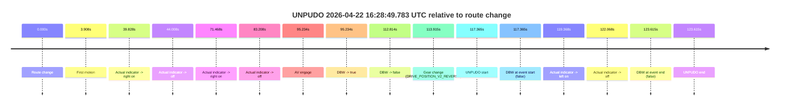
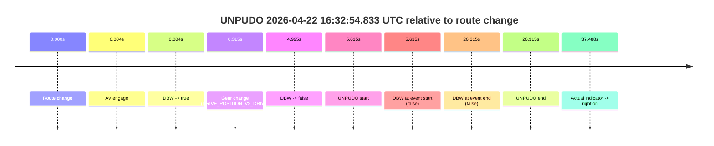
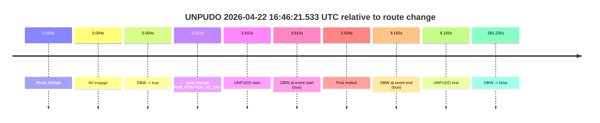
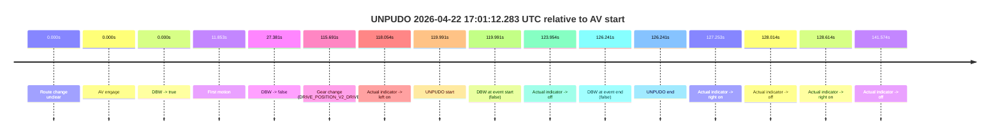

# Run Report: fme10010/2026-04-22--16-09-57--gen2-av-97310301-a8d4-4bb7-87aa-6bf157ad09e8

| Field | Value |
|---|---|
| Run ID | `fme10010/2026-04-22--16-09-57--gen2-av-97310301-a8d4-4bb7-87aa-6bf157ad09e8` |
| Date | `2026-04-22` |
| Model(s) | `sea-cucumber-spectacular-orange` |
| Author | `guy.geva` |
| Event count | `5` |

## unpudo 2026-04-22 16:28:49.783 UTC

| Field | Value |
|---|---|
| Model | `sea-cucumber-spectacular-orange` |
| Author | `guy.geva` |
| Run ID | `fme10010/2026-04-22--16-09-57--gen2-av-97310301-a8d4-4bb7-87aa-6bf157ad09e8` |
| Date | `2026-04-22` |
| Time (UTC) | `16:28:49.783` |
| Event type | `unpudo` |
| Disengagement type | `none observed` |
| Route change | `found` |
| Console | [run](https://console.sso.wayve.ai/run/fme10010/2026-04-22--16-09-57--gen2-av-97310301-a8d4-4bb7-87aa-6bf157ad09e8?id=&time-unixus=1776875329783318) |
| Foxglove | [segment](https://app.foxglove.dev/wayve-on-prem/p/prj_0dX18KZdVHg1fmmI/view?ds=foxglove-stream&ds.deviceName=fme10010&ds.start=2026-04-22T16%3A26%3A42.418245Z&ds.end=2026-04-22T16%3A29%3A06.033307Z&layoutId=lay_0e7VD4WIKDQGU73Y&time=2026-04-22T16%3A28%3A49.783318Z) |

### Event card: fail

- Fail: the credited unpudo does not stay AV-owned. The event window starts with DBW false, and the maneuver outcome lands outside a clean AV-owned segment.

| Event | Time (UTC) | Delta from route change |
|---|---:|---:|
| Route change | 2026-04-22 16:26:52.418 | `0.000s` |
| First motion | 2026-04-22 16:26:56.325 | `3.908s` |
| Actual indicator -> right on | 2026-04-22 16:27:32.246 | `39.828s` |
| Actual indicator -> off | 2026-04-22 16:27:36.425 | `44.008s` |
| Actual indicator -> right on | 2026-04-22 16:28:03.885 | `71.468s` |
| Actual indicator -> off | 2026-04-22 16:28:15.625 | `83.208s` |
| AV engage | 2026-04-22 16:28:27.652 | `95.234s` |
| DBW -> true | 2026-04-22 16:28:27.652 | `95.234s` |
| DBW -> false | 2026-04-22 16:28:45.232 | `112.814s` |
| Gear change (DRIVE_POSITION_V2_REVERSE) | 2026-04-22 16:28:46.333 | `113.915s` |
| UNPUDO start | 2026-04-22 16:28:49.783 | `117.365s` |
| DBW at event start (false) | 2026-04-22 16:28:49.783 | `117.365s` |
| Actual indicator -> left on | 2026-04-22 16:28:51.785 | `119.368s` |
| Actual indicator -> off | 2026-04-22 16:28:54.485 | `122.068s` |
| DBW at event end (false) | 2026-04-22 16:28:56.033 | `123.615s` |
| UNPUDO end | 2026-04-22 16:28:56.033 | `123.615s` |

| Metric | Value |
|---|---|
| Outcome | `fail` |
| Effective failure type | `completed_outside_av` |
| Route change status | `found` |
| DBW at event start | `false` |
| DBW at event end | `false` |
| Predicted gear at AV start | `DRIVE_POSITION_V2_PARK` |
| Actual gear at AV start | `DRIVE_POSITION_V2_PARK` |
| Predicted gear at event start | `DRIVE_POSITION_V2_REVERSE` |
| Actual gear at event start | `DRIVE_POSITION_V2_REVERSE` |
| Planned indicator direction | `INDICATORS_STATE_V2_LEFT_ON` |
| Controller indicator direction | `INDICATORS_STATE_V2_LEFT_ON` |
| Actual indicator direction | `INDICATORS_STATE_V2_OFF` |
| Actual indicator at maneuver end | `INDICATORS_STATE_V2_OFF` |
| Driver accel help in AV | `false` |
| Driver accel help timestamp | `n/a` |
| Max accel pedal pct in AV | `0.0%` |
| Max brake pedal pct in AV | `8.0%` |
| Max speed mps in AV | `0.000` |
| Success timing baseline | `route change` |
| Route -> AV | `95.234s` |
| AV -> event start | `22.131s` |
| AV -> first motion | `-91.327s` |
| Success baseline -> event start | `117.365s` |
| Success baseline -> first motion | `3.908s` |
| AV duration before disengagement | `17.580s` |
| Trajectory waypoint count | `37` |
| Driving-plan step count | `11` |

The scored portion starts from the AV-owned window, not from the pre-AV setup. Route-change search in the stopped pre-event segment was `found`, with the baseline therefore set to route change. At the event anchor the model predicts `DRIVE_POSITION_V2_REVERSE` and the actual gear is `DRIVE_POSITION_V2_REVERSE`. The effective model outcome is `fail` because `completed_outside_av.`

### Resolution

| Field | Value |
|---|---|
| Final outcome | `fail` |
| Do we agree with this label? | `yes` |
| Source disengagement type | `none observed` |
| Resolved effective failure type | `completed_outside_av` |
| Confidence | `high` |

## unpudo 2026-04-22 16:32:54.833 UTC

| Field | Value |
|---|---|
| Model | `sea-cucumber-spectacular-orange` |
| Author | `guy.geva` |
| Run ID | `fme10010/2026-04-22--16-09-57--gen2-av-97310301-a8d4-4bb7-87aa-6bf157ad09e8` |
| Date | `2026-04-22` |
| Time (UTC) | `16:32:54.833` |
| Event type | `unpudo` |
| Disengagement type | `none observed` |
| Route change | `found` |
| Console | [run](https://console.sso.wayve.ai/run/fme10010/2026-04-22--16-09-57--gen2-av-97310301-a8d4-4bb7-87aa-6bf157ad09e8?id=&time-unixus=1776875574833310) |
| Foxglove | [segment](https://app.foxglove.dev/wayve-on-prem/p/prj_0dX18KZdVHg1fmmI/view?ds=foxglove-stream&ds.deviceName=fme10010&ds.start=2026-04-22T16%3A32%3A39.218238Z&ds.end=2026-04-22T16%3A33%3A25.533327Z&layoutId=lay_0e7VD4WIKDQGU73Y&time=2026-04-22T16%3A32%3A54.833310Z) |

### Event card: fail

- Fail: the credited unpudo does not stay AV-owned. The event window starts with DBW false, and the maneuver outcome lands outside a clean AV-owned segment.

| Event | Time (UTC) | Delta from route change |
|---|---:|---:|
| Route change | 2026-04-22 16:32:49.218 | `0.000s` |
| AV engage | 2026-04-22 16:32:49.222 | `0.004s` |
| DBW -> true | 2026-04-22 16:32:49.222 | `0.004s` |
| Gear change (DRIVE_POSITION_V2_DRIVE) | 2026-04-22 16:32:49.533 | `0.315s` |
| DBW -> false | 2026-04-22 16:32:54.213 | `4.995s` |
| UNPUDO start | 2026-04-22 16:32:54.833 | `5.615s` |
| DBW at event start (false) | 2026-04-22 16:32:54.833 | `5.615s` |
| DBW at event end (false) | 2026-04-22 16:33:15.533 | `26.315s` |
| UNPUDO end | 2026-04-22 16:33:15.533 | `26.315s` |
| Actual indicator -> right on | 2026-04-22 16:33:26.705 | `37.488s` |

| Metric | Value |
|---|---|
| Outcome | `fail` |
| Effective failure type | `not_av_owned` |
| Route change status | `found` |
| DBW at event start | `false` |
| DBW at event end | `false` |
| Predicted gear at AV start | `DRIVE_POSITION_V2_PARK` |
| Actual gear at AV start | `DRIVE_POSITION_V2_PARK` |
| Predicted gear at event start | `DRIVE_POSITION_V2_DRIVE` |
| Actual gear at event start | `DRIVE_POSITION_V2_DRIVE` |
| Planned indicator direction | `INDICATORS_STATE_V2_OFF` |
| Controller indicator direction | `INDICATORS_STATE_V2_OFF` |
| Actual indicator direction | `INDICATORS_STATE_V2_OFF` |
| Actual indicator at maneuver end | `INDICATORS_STATE_V2_OFF` |
| Driver accel help in AV | `false` |
| Driver accel help timestamp | `n/a` |
| Max accel pedal pct in AV | `0.0%` |
| Max brake pedal pct in AV | `8.0%` |
| Max speed mps in AV | `0.000` |
| Success timing baseline | `route change` |
| Route -> AV | `0.004s` |
| AV -> event start | `5.611s` |
| AV -> first motion | `n/a` |
| Success baseline -> event start | `5.615s` |
| Success baseline -> first motion | `n/a` |
| AV duration before disengagement | `4.991s` |
| Trajectory waypoint count | `38` |
| Driving-plan step count | `11` |

The scored portion starts from the AV-owned window, not from the pre-AV setup. Route-change search in the stopped pre-event segment was `found`, with the baseline therefore set to route change. At the event anchor the model predicts `DRIVE_POSITION_V2_DRIVE` and the actual gear is `DRIVE_POSITION_V2_DRIVE`. The effective model outcome is `fail` because `not_av_owned.`

### Resolution

| Field | Value |
|---|---|
| Final outcome | `fail` |
| Do we agree with this label? | `yes` |
| Source disengagement type | `none observed` |
| Resolved effective failure type | `not_av_owned` |
| Confidence | `high` |

## unpudo 2026-04-22 16:39:23.283 UTC

| Field | Value |
|---|---|
| Model | `sea-cucumber-spectacular-orange` |
| Author | `guy.geva` |
| Run ID | `fme10010/2026-04-22--16-09-57--gen2-av-97310301-a8d4-4bb7-87aa-6bf157ad09e8` |
| Date | `2026-04-22` |
| Time (UTC) | `16:39:23.283` |
| Event type | `unpudo` |
| Disengagement type | `none observed` |
| Route change | `found` |
| Console | [run](https://console.sso.wayve.ai/run/fme10010/2026-04-22--16-09-57--gen2-av-97310301-a8d4-4bb7-87aa-6bf157ad09e8?id=&time-unixus=1776875963283290) |
| Foxglove | [segment](https://app.foxglove.dev/wayve-on-prem/p/prj_0dX18KZdVHg1fmmI/view?ds=foxglove-stream&ds.deviceName=fme10010&ds.start=2026-04-22T16%3A39%3A09.018269Z&ds.end=2026-04-22T16%3A41%3A32.673117Z&layoutId=lay_0e7VD4WIKDQGU73Y&time=2026-04-22T16%3A39%3A23.283290Z) |

### Event card: pass

- Pass: AV owns the credited unpudo from route change through the official unpudo window, the gear state is aligned at the anchor, and the vehicle moves without driver accelerator help in AV.

| Event | Time (UTC) | Delta from route change |
|---|---:|---:|
| Route change | 2026-04-22 16:39:19.018 | `0.000s` |
| AV engage | 2026-04-22 16:39:19.022 | `0.004s` |
| DBW -> true | 2026-04-22 16:39:19.022 | `0.004s` |
| Gear change (DRIVE_POSITION_V2_DRIVE) | 2026-04-22 16:39:19.333 | `0.315s` |
| UNPUDO start | 2026-04-22 16:39:23.283 | `4.265s` |
| DBW at event start (true) | 2026-04-22 16:39:23.283 | `4.265s` |
| First motion | 2026-04-22 16:39:23.385 | `4.368s` |
| DBW at event end (true) | 2026-04-22 16:39:27.033 | `8.015s` |
| UNPUDO end | 2026-04-22 16:39:27.033 | `8.015s` |
| DBW -> false | 2026-04-22 16:41:22.673 | `123.655s` |

| Metric | Value |
|---|---|
| Outcome | `pass` |
| Effective failure type | `none` |
| Route change status | `found` |
| DBW at event start | `true` |
| DBW at event end | `true` |
| Predicted gear at AV start | `DRIVE_POSITION_V2_PARK` |
| Actual gear at AV start | `DRIVE_POSITION_V2_PARK` |
| Predicted gear at event start | `DRIVE_POSITION_V2_DRIVE` |
| Actual gear at event start | `DRIVE_POSITION_V2_DRIVE` |
| Planned indicator direction | `INDICATORS_STATE_V2_LEFT_ON` |
| Controller indicator direction | `INDICATORS_STATE_V2_LEFT_ON` |
| Actual indicator direction | `INDICATORS_STATE_V2_OFF` |
| Actual indicator at maneuver end | `INDICATORS_STATE_V2_OFF` |
| Driver accel help in AV | `false` |
| Driver accel help timestamp | `n/a` |
| Max accel pedal pct in AV | `0.0%` |
| Max brake pedal pct in AV | `8.0%` |
| Max speed mps in AV | `4.842` |
| Success timing baseline | `route change` |
| Route -> AV | `0.004s` |
| AV -> event start | `4.261s` |
| AV -> first motion | `4.363s` |
| Success baseline -> event start | `4.265s` |
| Success baseline -> first motion | `4.368s` |
| AV duration before disengagement | `123.651s` |
| Trajectory waypoint count | `37` |
| Driving-plan step count | `11` |

The scored portion starts from the AV-owned window, not from the pre-AV setup. Route-change search in the stopped pre-event segment was `found`, with the baseline therefore set to route change. At the event anchor the model predicts `DRIVE_POSITION_V2_DRIVE` and the actual gear is `DRIVE_POSITION_V2_DRIVE`. The effective model outcome is `pass` because `the credited unpudo stays AV-owned through the official unpudo window.`

### Resolution

| Field | Value |
|---|---|
| Final outcome | `pass` |
| Do we agree with this label? | `yes` |
| Source disengagement type | `none observed` |
| Resolved effective failure type | `none` |
| Confidence | `high` |

## unpudo 2026-04-22 16:46:21.533 UTC

| Field | Value |
|---|---|
| Model | `sea-cucumber-spectacular-orange` |
| Author | `guy.geva` |
| Run ID | `fme10010/2026-04-22--16-09-57--gen2-av-97310301-a8d4-4bb7-87aa-6bf157ad09e8` |
| Date | `2026-04-22` |
| Time (UTC) | `16:46:21.533` |
| Event type | `unpudo` |
| Disengagement type | `none observed` |
| Route change | `found` |
| Console | [run](https://console.sso.wayve.ai/run/fme10010/2026-04-22--16-09-57--gen2-av-97310301-a8d4-4bb7-87aa-6bf157ad09e8?id=&time-unixus=1776876381533306) |
| Foxglove | [segment](https://app.foxglove.dev/wayve-on-prem/p/prj_0dX18KZdVHg1fmmI/view?ds=foxglove-stream&ds.deviceName=fme10010&ds.start=2026-04-22T16%3A46%3A07.618280Z&ds.end=2026-04-22T16%3A51%3A08.852988Z&layoutId=lay_0e7VD4WIKDQGU73Y&time=2026-04-22T16%3A46%3A21.533306Z) |

### Event card: pass

- Pass: AV owns the credited unpudo from route change through the official unpudo window, the gear state is aligned at the anchor, and the vehicle moves without driver accelerator help in AV.

| Event | Time (UTC) | Delta from route change |
|---|---:|---:|
| Route change | 2026-04-22 16:46:17.618 | `0.000s` |
| AV engage | 2026-04-22 16:46:17.622 | `0.004s` |
| DBW -> true | 2026-04-22 16:46:17.622 | `0.004s` |
| Gear change (DRIVE_POSITION_V2_DRIVE) | 2026-04-22 16:46:17.933 | `0.315s` |
| UNPUDO start | 2026-04-22 16:46:21.533 | `3.915s` |
| DBW at event start (true) | 2026-04-22 16:46:21.533 | `3.915s` |
| First motion | 2026-04-22 16:46:21.546 | `3.928s` |
| DBW at event end (true) | 2026-04-22 16:46:25.783 | `8.165s` |
| UNPUDO end | 2026-04-22 16:46:25.783 | `8.165s` |
| DBW -> false | 2026-04-22 16:50:58.852 | `281.235s` |

| Metric | Value |
|---|---|
| Outcome | `pass` |
| Effective failure type | `none` |
| Route change status | `found` |
| DBW at event start | `true` |
| DBW at event end | `true` |
| Predicted gear at AV start | `DRIVE_POSITION_V2_PARK` |
| Actual gear at AV start | `DRIVE_POSITION_V2_PARK` |
| Predicted gear at event start | `DRIVE_POSITION_V2_DRIVE` |
| Actual gear at event start | `DRIVE_POSITION_V2_DRIVE` |
| Planned indicator direction | `INDICATORS_STATE_V2_OFF` |
| Controller indicator direction | `INDICATORS_STATE_V2_OFF` |
| Actual indicator direction | `INDICATORS_STATE_V2_OFF` |
| Actual indicator at maneuver end | `INDICATORS_STATE_V2_OFF` |
| Driver accel help in AV | `false` |
| Driver accel help timestamp | `n/a` |
| Max accel pedal pct in AV | `0.0%` |
| Max brake pedal pct in AV | `8.9%` |
| Max speed mps in AV | `3.406` |
| Success timing baseline | `route change` |
| Route -> AV | `0.004s` |
| AV -> event start | `3.911s` |
| AV -> first motion | `3.924s` |
| Success baseline -> event start | `3.915s` |
| Success baseline -> first motion | `3.928s` |
| AV duration before disengagement | `281.231s` |
| Trajectory waypoint count | `38` |
| Driving-plan step count | `11` |

The scored portion starts from the AV-owned window, not from the pre-AV setup. Route-change search in the stopped pre-event segment was `found`, with the baseline therefore set to route change. At the event anchor the model predicts `DRIVE_POSITION_V2_DRIVE` and the actual gear is `DRIVE_POSITION_V2_DRIVE`. The effective model outcome is `pass` because `the credited unpudo stays AV-owned through the official unpudo window.`

### Resolution

| Field | Value |
|---|---|
| Final outcome | `pass` |
| Do we agree with this label? | `yes` |
| Source disengagement type | `none observed` |
| Resolved effective failure type | `none` |
| Confidence | `high` |

## unpudo 2026-04-22 17:01:12.283 UTC

| Field | Value |
|---|---|
| Model | `sea-cucumber-spectacular-orange` |
| Author | `guy.geva` |
| Run ID | `fme10010/2026-04-22--16-09-57--gen2-av-97310301-a8d4-4bb7-87aa-6bf157ad09e8` |
| Date | `2026-04-22` |
| Time (UTC) | `17:01:12.283` |
| Event type | `unpudo` |
| Disengagement type | `none observed` |
| Route change | `unclear` |
| Console | [run](https://console.sso.wayve.ai/run/fme10010/2026-04-22--16-09-57--gen2-av-97310301-a8d4-4bb7-87aa-6bf157ad09e8?id=&time-unixus=1776877272283300) |
| Foxglove | [segment](https://app.foxglove.dev/wayve-on-prem/p/prj_0dX18KZdVHg1fmmI/view?ds=foxglove-stream&ds.deviceName=fme10010&ds.start=2026-04-22T16%3A59%3A02.292356Z&ds.end=2026-04-22T17%3A01%3A28.533312Z&layoutId=lay_0e7VD4WIKDQGU73Y&time=2026-04-22T17%3A01%3A12.283300Z) |

### Event card: fail

- Fail: the credited unpudo does not stay AV-owned. The event window starts with DBW false, and the maneuver outcome lands outside a clean AV-owned segment.

| Event | Time (UTC) | Delta from AV start |
|---|---:|---:|
| Route change unclear | 2026-04-22 16:59:12.292 | `0.000s` |
| AV engage | 2026-04-22 16:59:12.292 | `0.000s` |
| DBW -> true | 2026-04-22 16:59:12.292 | `0.000s` |
| First motion | 2026-04-22 16:59:24.145 | `11.853s` |
| DBW -> false | 2026-04-22 16:59:39.673 | `27.381s` |
| Gear change (DRIVE_POSITION_V2_DRIVE) | 2026-04-22 17:01:07.983 | `115.691s` |
| Actual indicator -> left on | 2026-04-22 17:01:10.345 | `118.054s` |
| UNPUDO start | 2026-04-22 17:01:12.283 | `119.991s` |
| DBW at event start (false) | 2026-04-22 17:01:12.283 | `119.991s` |
| Actual indicator -> off | 2026-04-22 17:01:16.246 | `123.954s` |
| DBW at event end (false) | 2026-04-22 17:01:18.533 | `126.241s` |
| UNPUDO end | 2026-04-22 17:01:18.533 | `126.241s` |
| Actual indicator -> right on | 2026-04-22 17:01:19.545 | `127.253s` |
| Actual indicator -> off | 2026-04-22 17:01:20.306 | `128.014s` |
| Actual indicator -> right on | 2026-04-22 17:01:20.905 | `128.614s` |
| Actual indicator -> off | 2026-04-22 17:01:33.865 | `141.574s` |

| Metric | Value |
|---|---|
| Outcome | `fail` |
| Effective failure type | `not_av_owned` |
| Route change status | `unclear` |
| DBW at event start | `false` |
| DBW at event end | `false` |
| Predicted gear at AV start | `DRIVE_POSITION_V2_PARK` |
| Actual gear at AV start | `DRIVE_POSITION_V2_PARK` |
| Predicted gear at event start | `DRIVE_POSITION_V2_DRIVE` |
| Actual gear at event start | `DRIVE_POSITION_V2_DRIVE` |
| Planned indicator direction | `INDICATORS_STATE_V2_OFF` |
| Controller indicator direction | `INDICATORS_STATE_V2_OFF` |
| Actual indicator direction | `INDICATORS_STATE_V2_LEFT_ON` |
| Actual indicator at maneuver end | `INDICATORS_STATE_V2_OFF` |
| Driver accel help in AV | `false` |
| Driver accel help timestamp | `n/a` |
| Max accel pedal pct in AV | `0.0%` |
| Max brake pedal pct in AV | `29.6%` |
| Max speed mps in AV | `5.850` |
| Success timing baseline | `AV start` |
| Route -> AV | `n/a` |
| AV -> event start | `119.991s` |
| AV -> first motion | `11.853s` |
| Success baseline -> event start | `119.991s` |
| Success baseline -> first motion | `11.853s` |
| AV duration before disengagement | `27.381s` |
| Trajectory waypoint count | `37` |
| Driving-plan step count | `11` |

The scored portion starts from the AV-owned window, not from the pre-AV setup. Route-change search in the stopped pre-event segment was `unclear`, with the baseline therefore set to AV start. At the event anchor the model predicts `DRIVE_POSITION_V2_DRIVE` and the actual gear is `DRIVE_POSITION_V2_DRIVE`. The effective model outcome is `fail` because `not_av_owned.`

### Resolution

| Field | Value |
|---|---|
| Final outcome | `fail` |
| Do we agree with this label? | `yes` |
| Source disengagement type | `none observed` |
| Resolved effective failure type | `not_av_owned` |
| Confidence | `medium` |
