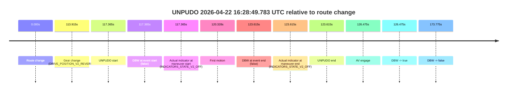
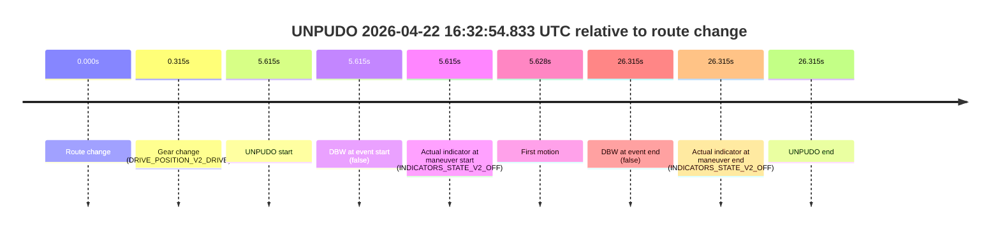
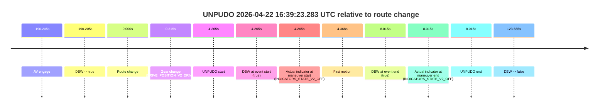
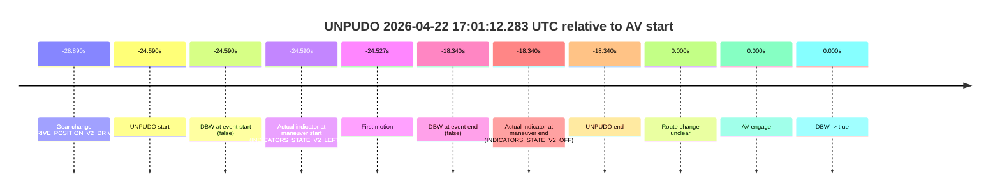

# Run Report: fme10010/2026-04-22--16-09-57--gen2-av-97310301-a8d4-4bb7-87aa-6bf157ad09e8

| Field | Value |
|---|---|
| Run ID | `fme10010/2026-04-22--16-09-57--gen2-av-97310301-a8d4-4bb7-87aa-6bf157ad09e8` |
| Date | `2026-04-22` |
| Model(s) | `sea-cucumber-spectacular-orange` |
| Author | `guy.geva` |
| Event count | `5` |

## unpudo 2026-04-22 16:28:49.783 UTC

| Field | Value |
|---|---|
| Model | `sea-cucumber-spectacular-orange` |
| Author | `guy.geva` |
| Run ID | `fme10010/2026-04-22--16-09-57--gen2-av-97310301-a8d4-4bb7-87aa-6bf157ad09e8` |
| Date | `2026-04-22` |
| Time (UTC) | `16:28:49.783` |
| Event type | `unpudo` |
| Disengagement type | `none observed` |
| Route change | `found` |
| Console | [run](https://console.sso.wayve.ai/run/fme10010/2026-04-22--16-09-57--gen2-av-97310301-a8d4-4bb7-87aa-6bf157ad09e8?id=&time-unixus=1776875329783318) |
| Foxglove | [segment](https://app.foxglove.dev/wayve-on-prem/p/prj_0dX18KZdVHg1fmmI/view?ds=foxglove-stream&ds.deviceName=fme10010&ds.start=2026-04-22T16%3A26%3A42.418245Z&ds.end=2026-04-22T16%3A29%3A56.193470Z&layoutId=lay_0e7VD4WIKDQGU73Y&time=2026-04-22T16%3A28%3A49.783318Z) |

### Event card: non-av

- Non-AV: there is no AV-owned portion anywhere inside the detected unpudo timeline, so it is kept for coverage but excluded from model success / failure scoring.

| Event | Time (UTC) | Delta from route change |
|---|---:|---:|
| Route change | 2026-04-22 16:26:52.418 | `0.000s` |
| Gear change (DRIVE_POSITION_V2_REVERSE) | 2026-04-22 16:28:46.333 | `113.915s` |
| UNPUDO start | 2026-04-22 16:28:49.783 | `117.365s` |
| DBW at event start (false) | 2026-04-22 16:28:49.783 | `117.365s` |
| Actual indicator at maneuver start (INDICATORS_STATE_V2_OFF) | 2026-04-22 16:28:49.783 | `117.365s` |
| First motion | 2026-04-22 16:28:52.745 | `120.328s` |
| DBW at event end (false) | 2026-04-22 16:28:56.033 | `123.615s` |
| Actual indicator at maneuver end (INDICATORS_STATE_V2_OFF) | 2026-04-22 16:28:56.033 | `123.615s` |
| UNPUDO end | 2026-04-22 16:28:56.033 | `123.615s` |
| AV engage | 2026-04-22 16:28:58.893 | `126.475s` |
| DBW -> true | 2026-04-22 16:28:58.893 | `126.475s` |
| DBW -> false | 2026-04-22 16:29:46.193 | `173.775s` |

| Metric | Value |
|---|---|
| Outcome | `non-av` |
| Effective failure type | `none` |
| Route change status | `found` |
| DBW at event start | `false` |
| DBW at event end | `false` |
| Predicted gear at AV start | `DRIVE_POSITION_V2_DRIVE` |
| Actual gear at AV start | `DRIVE_POSITION_V2_DRIVE` |
| Predicted gear at event start | `DRIVE_POSITION_V2_REVERSE` |
| Actual gear at event start | `DRIVE_POSITION_V2_REVERSE` |
| Planned indicator direction | `INDICATORS_STATE_V2_LEFT_ON` |
| Controller indicator direction | `INDICATORS_STATE_V2_LEFT_ON` |
| Actual indicator direction | `INDICATORS_STATE_V2_OFF` |
| Actual indicator at maneuver end | `INDICATORS_STATE_V2_OFF` |
| Driver accel help in AV | `false` |
| Driver accel help timestamp | `n/a` |
| Max accel pedal pct in AV | `0.0%` |
| Max brake pedal pct in AV | `0.0%` |
| Max speed mps in AV | `0.000` |
| Route -> AV | `126.475s` |
| AV -> event start | `-9.110s` |
| AV -> first motion | `-6.148s` |
| AV duration before disengagement | `47.300s` |
| Trajectory waypoint count | `37` |
| Driving-plan step count | `11` |

The scored portion starts from the AV-owned window, not from the pre-AV setup. Route-change search in the stopped pre-event segment was `found`, with the baseline therefore set to route change. At the event anchor the model predicts `DRIVE_POSITION_V2_REVERSE` and the actual gear is `DRIVE_POSITION_V2_REVERSE`. The effective model outcome is `non-av` because `there is no AV-owned overlap inside the event timeline`.

### Resolution

| Field | Value |
|---|---|
| Final outcome | `non-av` |
| Do we agree with this label? | `yes` |
| Source disengagement type | `none observed` |
| Resolved effective failure type | `none` |
| Confidence | `high` |

## unpudo 2026-04-22 16:32:54.833 UTC

| Field | Value |
|---|---|
| Model | `sea-cucumber-spectacular-orange` |
| Author | `guy.geva` |
| Run ID | `fme10010/2026-04-22--16-09-57--gen2-av-97310301-a8d4-4bb7-87aa-6bf157ad09e8` |
| Date | `2026-04-22` |
| Time (UTC) | `16:32:54.833` |
| Event type | `unpudo` |
| Disengagement type | `none observed` |
| Route change | `found` |
| Console | [run](https://console.sso.wayve.ai/run/fme10010/2026-04-22--16-09-57--gen2-av-97310301-a8d4-4bb7-87aa-6bf157ad09e8?id=&time-unixus=1776875574833310) |
| Foxglove | [segment](https://app.foxglove.dev/wayve-on-prem/p/prj_0dX18KZdVHg1fmmI/view?ds=foxglove-stream&ds.deviceName=fme10010&ds.start=2026-04-22T16%3A32%3A39.218238Z&ds.end=2026-04-22T16%3A33%3A25.533327Z&layoutId=lay_0e7VD4WIKDQGU73Y&time=2026-04-22T16%3A32%3A54.833310Z) |

### Event card: non-av

- Non-AV: there is no AV-owned portion anywhere inside the detected unpudo timeline, so it is kept for coverage but excluded from model success / failure scoring.

| Event | Time (UTC) | Delta from route change |
|---|---:|---:|
| Route change | 2026-04-22 16:32:49.218 | `0.000s` |
| Gear change (DRIVE_POSITION_V2_DRIVE) | 2026-04-22 16:32:49.533 | `0.315s` |
| UNPUDO start | 2026-04-22 16:32:54.833 | `5.615s` |
| DBW at event start (false) | 2026-04-22 16:32:54.833 | `5.615s` |
| Actual indicator at maneuver start (INDICATORS_STATE_V2_OFF) | 2026-04-22 16:32:54.833 | `5.615s` |
| First motion | 2026-04-22 16:32:54.846 | `5.628s` |
| DBW at event end (false) | 2026-04-22 16:33:15.533 | `26.315s` |
| Actual indicator at maneuver end (INDICATORS_STATE_V2_OFF) | 2026-04-22 16:33:15.533 | `26.315s` |
| UNPUDO end | 2026-04-22 16:33:15.533 | `26.315s` |

| Metric | Value |
|---|---|
| Outcome | `non-av` |
| Effective failure type | `none` |
| Route change status | `found` |
| DBW at event start | `false` |
| DBW at event end | `false` |
| Predicted gear at AV start | `n/a` |
| Actual gear at AV start | `n/a` |
| Predicted gear at event start | `DRIVE_POSITION_V2_DRIVE` |
| Actual gear at event start | `DRIVE_POSITION_V2_DRIVE` |
| Planned indicator direction | `INDICATORS_STATE_V2_OFF` |
| Controller indicator direction | `INDICATORS_STATE_V2_OFF` |
| Actual indicator direction | `INDICATORS_STATE_V2_OFF` |
| Actual indicator at maneuver end | `INDICATORS_STATE_V2_OFF` |
| Driver accel help in AV | `false` |
| Driver accel help timestamp | `n/a` |
| Max accel pedal pct in AV | `0.0%` |
| Max brake pedal pct in AV | `0.0%` |
| Max speed mps in AV | `0.000` |
| Route -> AV | `n/a` |
| AV -> event start | `n/a` |
| AV -> first motion | `n/a` |
| AV duration before disengagement | `n/a` |
| Trajectory waypoint count | `38` |
| Driving-plan step count | `11` |

The scored portion starts from the AV-owned window, not from the pre-AV setup. Route-change search in the stopped pre-event segment was `found`, with the baseline therefore set to route change. At the event anchor the model predicts `DRIVE_POSITION_V2_DRIVE` and the actual gear is `DRIVE_POSITION_V2_DRIVE`. The effective model outcome is `non-av` because `there is no AV-owned overlap inside the event timeline`.

### Resolution

| Field | Value |
|---|---|
| Final outcome | `non-av` |
| Do we agree with this label? | `yes` |
| Source disengagement type | `none observed` |
| Resolved effective failure type | `none` |
| Confidence | `high` |

## unpudo 2026-04-22 16:39:23.283 UTC

| Field | Value |
|---|---|
| Model | `sea-cucumber-spectacular-orange` |
| Author | `guy.geva` |
| Run ID | `fme10010/2026-04-22--16-09-57--gen2-av-97310301-a8d4-4bb7-87aa-6bf157ad09e8` |
| Date | `2026-04-22` |
| Time (UTC) | `16:39:23.283` |
| Event type | `unpudo` |
| Disengagement type | `none observed` |
| Route change | `found` |
| Console | [run](https://console.sso.wayve.ai/run/fme10010/2026-04-22--16-09-57--gen2-av-97310301-a8d4-4bb7-87aa-6bf157ad09e8?id=&time-unixus=1776875963283290) |
| Foxglove | [segment](https://app.foxglove.dev/wayve-on-prem/p/prj_0dX18KZdVHg1fmmI/view?ds=foxglove-stream&ds.deviceName=fme10010&ds.start=2026-04-22T16%3A35%3A58.812858Z&ds.end=2026-04-22T16%3A41%3A32.673117Z&layoutId=lay_0e7VD4WIKDQGU73Y&time=2026-04-22T16%3A39%3A23.283290Z) |

### Event card: pass

- Pass: AV owns the credited unpudo through the official event window, the gear state is aligned at the anchor, and the vehicle moves without driver accelerator help in AV.

| Event | Time (UTC) | Delta from route change |
|---|---:|---:|
| AV engage | 2026-04-22 16:36:08.812 | `-190.205s` |
| DBW -> true | 2026-04-22 16:36:08.812 | `-190.205s` |
| Route change | 2026-04-22 16:39:19.018 | `0.000s` |
| Gear change (DRIVE_POSITION_V2_DRIVE) | 2026-04-22 16:39:19.333 | `0.315s` |
| UNPUDO start | 2026-04-22 16:39:23.283 | `4.265s` |
| DBW at event start (true) | 2026-04-22 16:39:23.283 | `4.265s` |
| Actual indicator at maneuver start (INDICATORS_STATE_V2_OFF) | 2026-04-22 16:39:23.283 | `4.265s` |
| First motion | 2026-04-22 16:39:23.385 | `4.368s` |
| DBW at event end (true) | 2026-04-22 16:39:27.033 | `8.015s` |
| Actual indicator at maneuver end (INDICATORS_STATE_V2_OFF) | 2026-04-22 16:39:27.033 | `8.015s` |
| UNPUDO end | 2026-04-22 16:39:27.033 | `8.015s` |
| DBW -> false | 2026-04-22 16:41:22.673 | `123.655s` |

| Metric | Value |
|---|---|
| Outcome | `pass` |
| Effective failure type | `none` |
| Route change status | `found` |
| DBW at event start | `true` |
| DBW at event end | `true` |
| Predicted gear at AV start | `DRIVE_POSITION_V2_DRIVE` |
| Actual gear at AV start | `DRIVE_POSITION_V2_DRIVE` |
| Predicted gear at event start | `DRIVE_POSITION_V2_DRIVE` |
| Actual gear at event start | `DRIVE_POSITION_V2_DRIVE` |
| Planned indicator direction | `INDICATORS_STATE_V2_LEFT_ON` |
| Controller indicator direction | `INDICATORS_STATE_V2_LEFT_ON` |
| Actual indicator direction | `INDICATORS_STATE_V2_OFF` |
| Actual indicator at maneuver end | `INDICATORS_STATE_V2_OFF` |
| Driver accel help in AV | `false` |
| Driver accel help timestamp | `n/a` |
| Max accel pedal pct in AV | `0.0%` |
| Max brake pedal pct in AV | `0.0%` |
| Max speed mps in AV | `4.842` |
| Route -> AV | `-190.205s` |
| AV -> event start | `194.470s` |
| AV -> first motion | `194.573s` |
| AV duration before disengagement | `313.860s` |
| Trajectory waypoint count | `37` |
| Driving-plan step count | `11` |

The scored portion starts from the AV-owned window, not from the pre-AV setup. Route-change search in the stopped pre-event segment was `found`, with the baseline therefore set to route change. At the event anchor the model predicts `DRIVE_POSITION_V2_DRIVE` and the actual gear is `DRIVE_POSITION_V2_DRIVE`. The effective model outcome is `pass` because `the credited maneuver stays AV-owned through the official event end`.

### Resolution

| Field | Value |
|---|---|
| Final outcome | `pass` |
| Do we agree with this label? | `yes` |
| Source disengagement type | `none observed` |
| Resolved effective failure type | `none` |
| Confidence | `high` |

## unpudo 2026-04-22 16:46:21.533 UTC

| Field | Value |
|---|---|
| Model | `sea-cucumber-spectacular-orange` |
| Author | `guy.geva` |
| Run ID | `fme10010/2026-04-22--16-09-57--gen2-av-97310301-a8d4-4bb7-87aa-6bf157ad09e8` |
| Date | `2026-04-22` |
| Time (UTC) | `16:46:21.533` |
| Event type | `unpudo` |
| Disengagement type | `none observed` |
| Route change | `found` |
| Console | [run](https://console.sso.wayve.ai/run/fme10010/2026-04-22--16-09-57--gen2-av-97310301-a8d4-4bb7-87aa-6bf157ad09e8?id=&time-unixus=1776876381533306) |
| Foxglove | [segment](https://app.foxglove.dev/wayve-on-prem/p/prj_0dX18KZdVHg1fmmI/view?ds=foxglove-stream&ds.deviceName=fme10010&ds.start=2026-04-22T16%3A45%3A55.052418Z&ds.end=2026-04-22T16%3A51%3A08.852988Z&layoutId=lay_0e7VD4WIKDQGU73Y&time=2026-04-22T16%3A46%3A21.533306Z) |

### Event card: pass

- Pass: AV owns the credited unpudo through the official event window, the gear state is aligned at the anchor, and the vehicle moves without driver accelerator help in AV.

| Event | Time (UTC) | Delta from route change |
|---|---:|---:|
| AV engage | 2026-04-22 16:46:05.052 | `-12.566s` |
| DBW -> true | 2026-04-22 16:46:05.052 | `-12.566s` |
| Route change | 2026-04-22 16:46:17.618 | `0.000s` |
| Gear change (DRIVE_POSITION_V2_DRIVE) | 2026-04-22 16:46:17.933 | `0.315s` |
| UNPUDO start | 2026-04-22 16:46:21.533 | `3.915s` |
| DBW at event start (true) | 2026-04-22 16:46:21.533 | `3.915s` |
| Actual indicator at maneuver start (INDICATORS_STATE_V2_OFF) | 2026-04-22 16:46:21.533 | `3.915s` |
| First motion | 2026-04-22 16:46:21.546 | `3.928s` |
| DBW at event end (true) | 2026-04-22 16:46:25.783 | `8.165s` |
| Actual indicator at maneuver end (INDICATORS_STATE_V2_OFF) | 2026-04-22 16:46:25.783 | `8.165s` |
| UNPUDO end | 2026-04-22 16:46:25.783 | `8.165s` |
| DBW -> false | 2026-04-22 16:50:58.852 | `281.235s` |

| Metric | Value |
|---|---|
| Outcome | `pass` |
| Effective failure type | `none` |
| Route change status | `found` |
| DBW at event start | `true` |
| DBW at event end | `true` |
| Predicted gear at AV start | `DRIVE_POSITION_V2_PARK` |
| Actual gear at AV start | `DRIVE_POSITION_V2_PARK` |
| Predicted gear at event start | `DRIVE_POSITION_V2_DRIVE` |
| Actual gear at event start | `DRIVE_POSITION_V2_DRIVE` |
| Planned indicator direction | `INDICATORS_STATE_V2_OFF` |
| Controller indicator direction | `INDICATORS_STATE_V2_OFF` |
| Actual indicator direction | `INDICATORS_STATE_V2_OFF` |
| Actual indicator at maneuver end | `INDICATORS_STATE_V2_OFF` |
| Driver accel help in AV | `false` |
| Driver accel help timestamp | `n/a` |
| Max accel pedal pct in AV | `0.0%` |
| Max brake pedal pct in AV | `0.0%` |
| Max speed mps in AV | `3.406` |
| Route -> AV | `-12.566s` |
| AV -> event start | `16.481s` |
| AV -> first motion | `16.494s` |
| AV duration before disengagement | `293.801s` |
| Trajectory waypoint count | `38` |
| Driving-plan step count | `11` |

The scored portion starts from the AV-owned window, not from the pre-AV setup. Route-change search in the stopped pre-event segment was `found`, with the baseline therefore set to route change. At the event anchor the model predicts `DRIVE_POSITION_V2_DRIVE` and the actual gear is `DRIVE_POSITION_V2_DRIVE`. The effective model outcome is `pass` because `the credited maneuver stays AV-owned through the official event end`.

### Resolution

| Field | Value |
|---|---|
| Final outcome | `pass` |
| Do we agree with this label? | `yes` |
| Source disengagement type | `none observed` |
| Resolved effective failure type | `none` |
| Confidence | `high` |

## unpudo 2026-04-22 17:01:12.283 UTC

| Field | Value |
|---|---|
| Model | `sea-cucumber-spectacular-orange` |
| Author | `guy.geva` |
| Run ID | `fme10010/2026-04-22--16-09-57--gen2-av-97310301-a8d4-4bb7-87aa-6bf157ad09e8` |
| Date | `2026-04-22` |
| Time (UTC) | `17:01:12.283` |
| Event type | `unpudo` |
| Disengagement type | `none observed` |
| Route change | `unclear` |
| Console | [run](https://console.sso.wayve.ai/run/fme10010/2026-04-22--16-09-57--gen2-av-97310301-a8d4-4bb7-87aa-6bf157ad09e8?id=&time-unixus=1776877272283300) |
| Foxglove | [segment](https://app.foxglove.dev/wayve-on-prem/p/prj_0dX18KZdVHg1fmmI/view?ds=foxglove-stream&ds.deviceName=fme10010&ds.start=2026-04-22T17%3A00%3A57.983302Z&ds.end=2026-04-22T17%3A01%3A28.533312Z&layoutId=lay_0e7VD4WIKDQGU73Y&time=2026-04-22T17%3A01%3A12.283300Z) |

### Event card: non-av

- Non-AV: there is no AV-owned portion anywhere inside the detected unpudo timeline, so it is kept for coverage but excluded from model success / failure scoring.

| Event | Time (UTC) | Delta from AV start |
|---|---:|---:|
| Gear change (DRIVE_POSITION_V2_DRIVE) | 2026-04-22 17:01:07.983 | `-28.890s` |
| UNPUDO start | 2026-04-22 17:01:12.283 | `-24.590s` |
| DBW at event start (false) | 2026-04-22 17:01:12.283 | `-24.590s` |
| Actual indicator at maneuver start (INDICATORS_STATE_V2_LEFT_ON) | 2026-04-22 17:01:12.283 | `-24.590s` |
| First motion | 2026-04-22 17:01:12.346 | `-24.527s` |
| DBW at event end (false) | 2026-04-22 17:01:18.533 | `-18.340s` |
| Actual indicator at maneuver end (INDICATORS_STATE_V2_OFF) | 2026-04-22 17:01:18.533 | `-18.340s` |
| UNPUDO end | 2026-04-22 17:01:18.533 | `-18.340s` |
| Route change unclear | 2026-04-22 17:01:36.873 | `0.000s` |
| AV engage | 2026-04-22 17:01:36.873 | `0.000s` |
| DBW -> true | 2026-04-22 17:01:36.873 | `0.000s` |

| Metric | Value |
|---|---|
| Outcome | `non-av` |
| Effective failure type | `none` |
| Route change status | `unclear` |
| DBW at event start | `false` |
| DBW at event end | `false` |
| Predicted gear at AV start | `DRIVE_POSITION_V2_DRIVE` |
| Actual gear at AV start | `DRIVE_POSITION_V2_DRIVE` |
| Predicted gear at event start | `DRIVE_POSITION_V2_DRIVE` |
| Actual gear at event start | `DRIVE_POSITION_V2_DRIVE` |
| Planned indicator direction | `INDICATORS_STATE_V2_OFF` |
| Controller indicator direction | `INDICATORS_STATE_V2_OFF` |
| Actual indicator direction | `INDICATORS_STATE_V2_LEFT_ON` |
| Actual indicator at maneuver end | `INDICATORS_STATE_V2_OFF` |
| Driver accel help in AV | `false` |
| Driver accel help timestamp | `n/a` |
| Max accel pedal pct in AV | `0.0%` |
| Max brake pedal pct in AV | `0.0%` |
| Max speed mps in AV | `0.000` |
| Route -> AV | `n/a` |
| AV -> event start | `-24.590s` |
| AV -> first motion | `-24.527s` |
| AV duration before disengagement | `n/a` |
| Trajectory waypoint count | `37` |
| Driving-plan step count | `11` |

The scored portion starts from the AV-owned window, not from the pre-AV setup. Route-change search in the stopped pre-event segment was `unclear`, with the baseline therefore set to AV start. At the event anchor the model predicts `DRIVE_POSITION_V2_DRIVE` and the actual gear is `DRIVE_POSITION_V2_DRIVE`. The effective model outcome is `non-av` because `there is no AV-owned overlap inside the event timeline`.

### Resolution

| Field | Value |
|---|---|
| Final outcome | `non-av` |
| Do we agree with this label? | `yes` |
| Source disengagement type | `none observed` |
| Resolved effective failure type | `none` |
| Confidence | `medium` |
