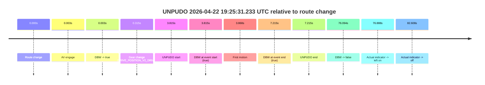
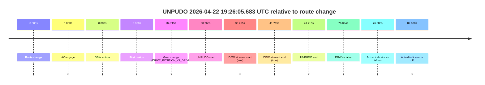
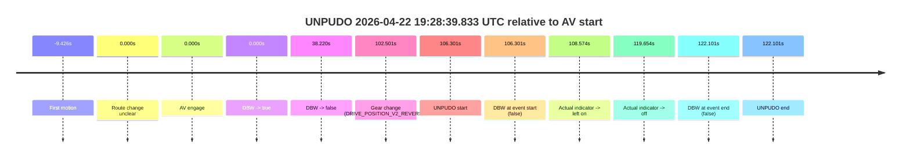
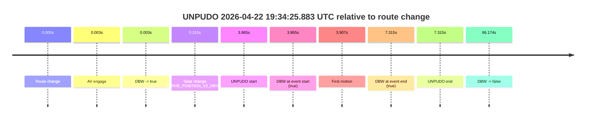
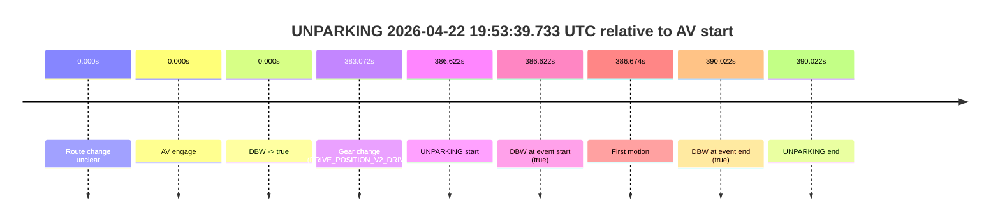

# Run Report: fme10010/2026-04-22--18-59-27--gen2-av-8d981601-d7a8-46ca-9700-9be8e1fb583d

| Field | Value |
|---|---|
| Run ID | `fme10010/2026-04-22--18-59-27--gen2-av-8d981601-d7a8-46ca-9700-9be8e1fb583d` |
| Date | `2026-04-22` |
| Model(s) | `eel-teal-outspoken` |
| Author | `zak` |
| Event count | `5` |

## unpudo 2026-04-22 19:25:31.233 UTC

| Field | Value |
|---|---|
| Model | `eel-teal-outspoken` |
| Author | `zak` |
| Run ID | `fme10010/2026-04-22--18-59-27--gen2-av-8d981601-d7a8-46ca-9700-9be8e1fb583d` |
| Date | `2026-04-22` |
| Time (UTC) | `19:25:31.233` |
| Event type | `unpudo` |
| Disengagement type | `none observed` |
| Route change | `found` |
| Console | [run](https://console.sso.wayve.ai/run/fme10010/2026-04-22--18-59-27--gen2-av-8d981601-d7a8-46ca-9700-9be8e1fb583d?id=&time-unixus=1776885931233297) |
| Foxglove | [segment](https://app.foxglove.dev/wayve-on-prem/p/prj_0dX18KZdVHg1fmmI/view?ds=foxglove-stream&ds.deviceName=fme10010&ds.start=2026-04-22T19%3A25%3A17.418232Z&ds.end=2026-04-22T19%3A26%3A53.512499Z&layoutId=lay_0e7VD4WIKDQGU73Y&time=2026-04-22T19%3A25%3A31.233297Z) |

### Event card: pass

- Pass: AV owns the credited unpudo from route change through the official unpudo window, the gear state is aligned at the anchor, and the vehicle moves without driver accelerator help in AV.

| Event | Time (UTC) | Delta from route change |
|---|---:|---:|
| Route change | 2026-04-22 19:25:27.418 | `0.000s` |
| AV engage | 2026-04-22 19:25:27.421 | `0.003s` |
| DBW -> true | 2026-04-22 19:25:27.421 | `0.003s` |
| Gear change (DRIVE_POSITION_V2_DRIVE) | 2026-04-22 19:25:27.733 | `0.315s` |
| UNPUDO start | 2026-04-22 19:25:31.233 | `3.815s` |
| DBW at event start (true) | 2026-04-22 19:25:31.233 | `3.815s` |
| First motion | 2026-04-22 19:25:31.285 | `3.868s` |
| DBW at event end (true) | 2026-04-22 19:25:34.633 | `7.215s` |
| UNPUDO end | 2026-04-22 19:25:34.633 | `7.215s` |
| DBW -> false | 2026-04-22 19:26:43.512 | `76.094s` |
| Actual indicator -> left on | 2026-04-22 19:26:44.305 | `76.888s` |
| Actual indicator -> off | 2026-04-22 19:26:50.025 | `82.608s` |

| Metric | Value |
|---|---|
| Outcome | `pass` |
| Effective failure type | `none` |
| Route change status | `found` |
| DBW at event start | `true` |
| DBW at event end | `true` |
| Predicted gear at AV start | `DRIVE_POSITION_V2_PARK` |
| Actual gear at AV start | `DRIVE_POSITION_V2_PARK` |
| Predicted gear at event start | `DRIVE_POSITION_V2_DRIVE` |
| Actual gear at event start | `DRIVE_POSITION_V2_DRIVE` |
| Planned indicator direction | `INDICATORS_STATE_V2_LEFT_ON` |
| Controller indicator direction | `INDICATORS_STATE_V2_LEFT_ON` |
| Actual indicator direction | `INDICATORS_STATE_V2_OFF` |
| Actual indicator at maneuver end | `INDICATORS_STATE_V2_OFF` |
| Driver accel help in AV | `false` |
| Driver accel help timestamp | `n/a` |
| Max accel pedal pct in AV | `0.0%` |
| Max brake pedal pct in AV | `8.0%` |
| Max speed mps in AV | `5.431` |
| Success timing baseline | `route change` |
| Route -> AV | `0.003s` |
| AV -> event start | `3.812s` |
| AV -> first motion | `3.865s` |
| Success baseline -> event start | `3.815s` |
| Success baseline -> first motion | `3.868s` |
| AV duration before disengagement | `76.091s` |
| Trajectory waypoint count | `38` |
| Driving-plan step count | `11` |

The scored portion starts from the AV-owned window, not from the pre-AV setup. Route-change search in the stopped pre-event segment was `found`, with the baseline therefore set to route change. At the event anchor the model predicts `DRIVE_POSITION_V2_DRIVE` and the actual gear is `DRIVE_POSITION_V2_DRIVE`. The effective model outcome is `pass` because `the credited unpudo stays AV-owned through the official unpudo window.`

### Resolution

| Field | Value |
|---|---|
| Final outcome | `pass` |
| Do we agree with this label? | `yes` |
| Source disengagement type | `none observed` |
| Resolved effective failure type | `none` |
| Confidence | `high` |

## unpudo 2026-04-22 19:26:05.683 UTC

| Field | Value |
|---|---|
| Model | `eel-teal-outspoken` |
| Author | `zak` |
| Run ID | `fme10010/2026-04-22--18-59-27--gen2-av-8d981601-d7a8-46ca-9700-9be8e1fb583d` |
| Date | `2026-04-22` |
| Time (UTC) | `19:26:05.683` |
| Event type | `unpudo` |
| Disengagement type | `none observed` |
| Route change | `found` |
| Console | [run](https://console.sso.wayve.ai/run/fme10010/2026-04-22--18-59-27--gen2-av-8d981601-d7a8-46ca-9700-9be8e1fb583d?id=&time-unixus=1776885965683319) |
| Foxglove | [segment](https://app.foxglove.dev/wayve-on-prem/p/prj_0dX18KZdVHg1fmmI/view?ds=foxglove-stream&ds.deviceName=fme10010&ds.start=2026-04-22T19%3A25%3A17.418232Z&ds.end=2026-04-22T19%3A26%3A53.512499Z&layoutId=lay_0e7VD4WIKDQGU73Y&time=2026-04-22T19%3A26%3A05.683319Z) |

### Event card: pass

- Pass: AV owns the credited unpudo from route change through the official unpudo window, the gear state is aligned at the anchor, and the vehicle moves without driver accelerator help in AV.

| Event | Time (UTC) | Delta from route change |
|---|---:|---:|
| Route change | 2026-04-22 19:25:27.418 | `0.000s` |
| AV engage | 2026-04-22 19:25:27.421 | `0.003s` |
| DBW -> true | 2026-04-22 19:25:27.421 | `0.003s` |
| First motion | 2026-04-22 19:25:31.285 | `3.868s` |
| Gear change (DRIVE_POSITION_V2_DRIVE) | 2026-04-22 19:26:02.133 | `34.715s` |
| UNPUDO start | 2026-04-22 19:26:05.683 | `38.265s` |
| DBW at event start (true) | 2026-04-22 19:26:05.683 | `38.265s` |
| DBW at event end (true) | 2026-04-22 19:26:09.133 | `41.715s` |
| UNPUDO end | 2026-04-22 19:26:09.133 | `41.715s` |
| DBW -> false | 2026-04-22 19:26:43.512 | `76.094s` |
| Actual indicator -> left on | 2026-04-22 19:26:44.305 | `76.888s` |
| Actual indicator -> off | 2026-04-22 19:26:50.025 | `82.608s` |

| Metric | Value |
|---|---|
| Outcome | `pass` |
| Effective failure type | `none` |
| Route change status | `found` |
| DBW at event start | `true` |
| DBW at event end | `true` |
| Predicted gear at AV start | `DRIVE_POSITION_V2_PARK` |
| Actual gear at AV start | `DRIVE_POSITION_V2_PARK` |
| Predicted gear at event start | `DRIVE_POSITION_V2_DRIVE` |
| Actual gear at event start | `DRIVE_POSITION_V2_DRIVE` |
| Planned indicator direction | `INDICATORS_STATE_V2_LEFT_ON` |
| Controller indicator direction | `INDICATORS_STATE_V2_LEFT_ON` |
| Actual indicator direction | `INDICATORS_STATE_V2_OFF` |
| Actual indicator at maneuver end | `INDICATORS_STATE_V2_OFF` |
| Driver accel help in AV | `false` |
| Driver accel help timestamp | `n/a` |
| Max accel pedal pct in AV | `0.0%` |
| Max brake pedal pct in AV | `12.1%` |
| Max speed mps in AV | `7.025` |
| Success timing baseline | `route change` |
| Route -> AV | `0.003s` |
| AV -> event start | `38.262s` |
| AV -> first motion | `3.865s` |
| Success baseline -> event start | `38.265s` |
| Success baseline -> first motion | `3.868s` |
| AV duration before disengagement | `76.091s` |
| Trajectory waypoint count | `37` |
| Driving-plan step count | `11` |

The scored portion starts from the AV-owned window, not from the pre-AV setup. Route-change search in the stopped pre-event segment was `found`, with the baseline therefore set to route change. At the event anchor the model predicts `DRIVE_POSITION_V2_DRIVE` and the actual gear is `DRIVE_POSITION_V2_DRIVE`. The effective model outcome is `pass` because `the credited unpudo stays AV-owned through the official unpudo window.`

### Resolution

| Field | Value |
|---|---|
| Final outcome | `pass` |
| Do we agree with this label? | `yes` |
| Source disengagement type | `none observed` |
| Resolved effective failure type | `none` |
| Confidence | `high` |

## unpudo 2026-04-22 19:28:39.833 UTC

| Field | Value |
|---|---|
| Model | `eel-teal-outspoken` |
| Author | `zak` |
| Run ID | `fme10010/2026-04-22--18-59-27--gen2-av-8d981601-d7a8-46ca-9700-9be8e1fb583d` |
| Date | `2026-04-22` |
| Time (UTC) | `19:28:39.833` |
| Event type | `unpudo` |
| Disengagement type | `none observed` |
| Route change | `unclear` |
| Console | [run](https://console.sso.wayve.ai/run/fme10010/2026-04-22--18-59-27--gen2-av-8d981601-d7a8-46ca-9700-9be8e1fb583d?id=&time-unixus=1776886119833315) |
| Foxglove | [segment](https://app.foxglove.dev/wayve-on-prem/p/prj_0dX18KZdVHg1fmmI/view?ds=foxglove-stream&ds.deviceName=fme10010&ds.start=2026-04-22T19%3A26%3A43.531951Z&ds.end=2026-04-22T19%3A29%3A05.633305Z&layoutId=lay_0e7VD4WIKDQGU73Y&time=2026-04-22T19%3A28%3A39.833315Z) |

### Event card: fail

- Fail: the credited unpudo does not stay AV-owned. The event window starts with DBW false, and the maneuver outcome lands outside a clean AV-owned segment.

| Event | Time (UTC) | Delta from AV start |
|---|---:|---:|
| First motion | 2026-04-22 19:26:44.105 | `-9.426s` |
| Route change unclear | 2026-04-22 19:26:53.531 | `0.000s` |
| AV engage | 2026-04-22 19:26:53.531 | `0.000s` |
| DBW -> true | 2026-04-22 19:26:53.531 | `0.000s` |
| DBW -> false | 2026-04-22 19:27:31.751 | `38.220s` |
| Gear change (DRIVE_POSITION_V2_REVERSE) | 2026-04-22 19:28:36.033 | `102.501s` |
| UNPUDO start | 2026-04-22 19:28:39.833 | `106.301s` |
| DBW at event start (false) | 2026-04-22 19:28:39.833 | `106.301s` |
| Actual indicator -> left on | 2026-04-22 19:28:42.105 | `108.574s` |
| Actual indicator -> off | 2026-04-22 19:28:53.185 | `119.654s` |
| DBW at event end (false) | 2026-04-22 19:28:55.633 | `122.101s` |
| UNPUDO end | 2026-04-22 19:28:55.633 | `122.101s` |

| Metric | Value |
|---|---|
| Outcome | `fail` |
| Effective failure type | `completed_outside_av` |
| Route change status | `unclear` |
| DBW at event start | `false` |
| DBW at event end | `false` |
| Predicted gear at AV start | `DRIVE_POSITION_V2_DRIVE` |
| Actual gear at AV start | `DRIVE_POSITION_V2_DRIVE` |
| Predicted gear at event start | `DRIVE_POSITION_V2_REVERSE` |
| Actual gear at event start | `DRIVE_POSITION_V2_REVERSE` |
| Planned indicator direction | `INDICATORS_STATE_V2_OFF` |
| Controller indicator direction | `INDICATORS_STATE_V2_OFF` |
| Actual indicator direction | `INDICATORS_STATE_V2_OFF` |
| Actual indicator at maneuver end | `INDICATORS_STATE_V2_OFF` |
| Driver accel help in AV | `false` |
| Driver accel help timestamp | `n/a` |
| Max accel pedal pct in AV | `0.0%` |
| Max brake pedal pct in AV | `8.0%` |
| Max speed mps in AV | `10.231` |
| Success timing baseline | `AV start` |
| Route -> AV | `n/a` |
| AV -> event start | `106.301s` |
| AV -> first motion | `-9.426s` |
| Success baseline -> event start | `106.301s` |
| Success baseline -> first motion | `-9.426s` |
| AV duration before disengagement | `38.220s` |
| Trajectory waypoint count | `38` |
| Driving-plan step count | `11` |

The scored portion starts from the AV-owned window, not from the pre-AV setup. Route-change search in the stopped pre-event segment was `unclear`, with the baseline therefore set to AV start. At the event anchor the model predicts `DRIVE_POSITION_V2_REVERSE` and the actual gear is `DRIVE_POSITION_V2_REVERSE`. The effective model outcome is `fail` because `completed_outside_av.`

### Resolution

| Field | Value |
|---|---|
| Final outcome | `fail` |
| Do we agree with this label? | `yes` |
| Source disengagement type | `none observed` |
| Resolved effective failure type | `completed_outside_av` |
| Confidence | `medium` |

## unpudo 2026-04-22 19:34:25.883 UTC

| Field | Value |
|---|---|
| Model | `eel-teal-outspoken` |
| Author | `zak` |
| Run ID | `fme10010/2026-04-22--18-59-27--gen2-av-8d981601-d7a8-46ca-9700-9be8e1fb583d` |
| Date | `2026-04-22` |
| Time (UTC) | `19:34:25.883` |
| Event type | `unpudo` |
| Disengagement type | `none observed` |
| Route change | `found` |
| Console | [run](https://console.sso.wayve.ai/run/fme10010/2026-04-22--18-59-27--gen2-av-8d981601-d7a8-46ca-9700-9be8e1fb583d?id=&time-unixus=1776886465883318) |
| Foxglove | [segment](https://app.foxglove.dev/wayve-on-prem/p/prj_0dX18KZdVHg1fmmI/view?ds=foxglove-stream&ds.deviceName=fme10010&ds.start=2026-04-22T19%3A34%3A12.018449Z&ds.end=2026-04-22T19%3A35%3A38.192351Z&layoutId=lay_0e7VD4WIKDQGU73Y&time=2026-04-22T19%3A34%3A25.883318Z) |

### Event card: pass

- Pass: AV owns the credited unpudo from route change through the official unpudo window, the gear state is aligned at the anchor, and the vehicle moves without driver accelerator help in AV.

| Event | Time (UTC) | Delta from route change |
|---|---:|---:|
| Route change | 2026-04-22 19:34:22.018 | `0.000s` |
| AV engage | 2026-04-22 19:34:22.021 | `0.003s` |
| DBW -> true | 2026-04-22 19:34:22.021 | `0.003s` |
| Gear change (DRIVE_POSITION_V2_DRIVE) | 2026-04-22 19:34:22.333 | `0.315s` |
| UNPUDO start | 2026-04-22 19:34:25.883 | `3.865s` |
| DBW at event start (true) | 2026-04-22 19:34:25.883 | `3.865s` |
| First motion | 2026-04-22 19:34:25.925 | `3.907s` |
| DBW at event end (true) | 2026-04-22 19:34:29.333 | `7.315s` |
| UNPUDO end | 2026-04-22 19:34:29.333 | `7.315s` |
| DBW -> false | 2026-04-22 19:35:28.192 | `66.174s` |

| Metric | Value |
|---|---|
| Outcome | `pass` |
| Effective failure type | `none` |
| Route change status | `found` |
| DBW at event start | `true` |
| DBW at event end | `true` |
| Predicted gear at AV start | `DRIVE_POSITION_V2_PARK` |
| Actual gear at AV start | `DRIVE_POSITION_V2_PARK` |
| Predicted gear at event start | `DRIVE_POSITION_V2_DRIVE` |
| Actual gear at event start | `DRIVE_POSITION_V2_DRIVE` |
| Planned indicator direction | `INDICATORS_STATE_V2_LEFT_ON` |
| Controller indicator direction | `INDICATORS_STATE_V2_LEFT_ON` |
| Actual indicator direction | `INDICATORS_STATE_V2_OFF` |
| Actual indicator at maneuver end | `INDICATORS_STATE_V2_OFF` |
| Driver accel help in AV | `false` |
| Driver accel help timestamp | `n/a` |
| Max accel pedal pct in AV | `0.0%` |
| Max brake pedal pct in AV | `8.0%` |
| Max speed mps in AV | `5.108` |
| Success timing baseline | `route change` |
| Route -> AV | `0.003s` |
| AV -> event start | `3.862s` |
| AV -> first motion | `3.905s` |
| Success baseline -> event start | `3.865s` |
| Success baseline -> first motion | `3.907s` |
| AV duration before disengagement | `66.171s` |
| Trajectory waypoint count | `37` |
| Driving-plan step count | `11` |

The scored portion starts from the AV-owned window, not from the pre-AV setup. Route-change search in the stopped pre-event segment was `found`, with the baseline therefore set to route change. At the event anchor the model predicts `DRIVE_POSITION_V2_DRIVE` and the actual gear is `DRIVE_POSITION_V2_DRIVE`. The effective model outcome is `pass` because `the credited unpudo stays AV-owned through the official unpudo window.`

### Resolution

| Field | Value |
|---|---|
| Final outcome | `pass` |
| Do we agree with this label? | `yes` |
| Source disengagement type | `none observed` |
| Resolved effective failure type | `none` |
| Confidence | `high` |

## unparking 2026-04-22 19:53:39.733 UTC

| Field | Value |
|---|---|
| Model | `eel-teal-outspoken` |
| Author | `zak` |
| Run ID | `fme10010/2026-04-22--18-59-27--gen2-av-8d981601-d7a8-46ca-9700-9be8e1fb583d` |
| Date | `2026-04-22` |
| Time (UTC) | `19:53:39.733` |
| Event type | `unparking` |
| Disengagement type | `none observed` |
| Route change | `unclear` |
| Console | [run](https://console.sso.wayve.ai/run/fme10010/2026-04-22--18-59-27--gen2-av-8d981601-d7a8-46ca-9700-9be8e1fb583d?id=&time-unixus=1776887619733320) |
| Foxglove | [segment](https://app.foxglove.dev/wayve-on-prem/p/prj_0dX18KZdVHg1fmmI/view?ds=foxglove-stream&ds.deviceName=fme10010&ds.start=2026-04-22T19%3A47%3A03.111786Z&ds.end=2026-04-22T19%3A53%3A53.133295Z&layoutId=lay_0e7VD4WIKDQGU73Y&time=2026-04-22T19%3A53%3A39.733320Z) |

### Event card: pass

- Pass: AV owns the credited unparking through the official event window, the gear state is aligned at the anchor, and the vehicle moves without driver accelerator help in AV.

| Event | Time (UTC) | Delta from AV start |
|---|---:|---:|
| Route change unclear | 2026-04-22 19:47:13.111 | `0.000s` |
| AV engage | 2026-04-22 19:47:13.111 | `0.000s` |
| DBW -> true | 2026-04-22 19:47:13.111 | `0.000s` |
| Gear change (DRIVE_POSITION_V2_DRIVE) | 2026-04-22 19:53:36.183 | `383.072s` |
| UNPARKING start | 2026-04-22 19:53:39.733 | `386.622s` |
| DBW at event start (true) | 2026-04-22 19:53:39.733 | `386.622s` |
| First motion | 2026-04-22 19:53:39.785 | `386.674s` |
| DBW at event end (true) | 2026-04-22 19:53:43.133 | `390.022s` |
| UNPARKING end | 2026-04-22 19:53:43.133 | `390.022s` |

| Metric | Value |
|---|---|
| Outcome | `pass` |
| Effective failure type | `none` |
| Route change status | `unclear` |
| DBW at event start | `true` |
| DBW at event end | `true` |
| Predicted gear at AV start | `DRIVE_POSITION_V2_DRIVE` |
| Actual gear at AV start | `DRIVE_POSITION_V2_DRIVE` |
| Predicted gear at event start | `DRIVE_POSITION_V2_DRIVE` |
| Actual gear at event start | `DRIVE_POSITION_V2_DRIVE` |
| Planned indicator direction | `INDICATORS_STATE_V2_LEFT_ON` |
| Controller indicator direction | `INDICATORS_STATE_V2_LEFT_ON` |
| Actual indicator direction | `INDICATORS_STATE_V2_OFF` |
| Actual indicator at maneuver end | `INDICATORS_STATE_V2_OFF` |
| Driver accel help in AV | `false` |
| Driver accel help timestamp | `n/a` |
| Max accel pedal pct in AV | `0.0%` |
| Max brake pedal pct in AV | `0.0%` |
| Max speed mps in AV | `5.478` |
| Success timing baseline | `AV start` |
| Route -> AV | `n/a` |
| AV -> event start | `386.622s` |
| AV -> first motion | `386.674s` |
| Success baseline -> event start | `386.622s` |
| Success baseline -> first motion | `386.674s` |
| AV duration before disengagement | `n/a` |
| Trajectory waypoint count | `38` |
| Driving-plan step count | `11` |

The scored portion starts from the AV-owned window, not from the pre-AV setup. Route-change search in the stopped pre-event segment was `unclear`, with the baseline therefore set to AV start. At the event anchor the model predicts `DRIVE_POSITION_V2_DRIVE` and the actual gear is `DRIVE_POSITION_V2_DRIVE`. The effective model outcome is `pass` because `the credited maneuver stays AV-owned through the official event end.`

### Resolution

| Field | Value |
|---|---|
| Final outcome | `pass` |
| Do we agree with this label? | `yes` |
| Source disengagement type | `none observed` |
| Resolved effective failure type | `none` |
| Confidence | `medium` |
