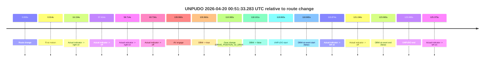
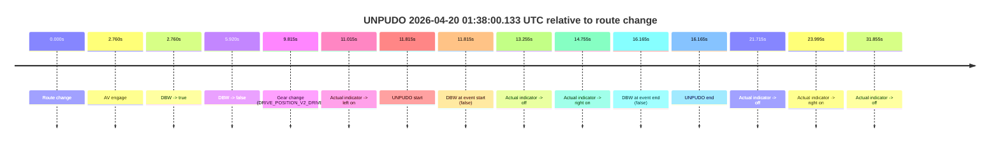
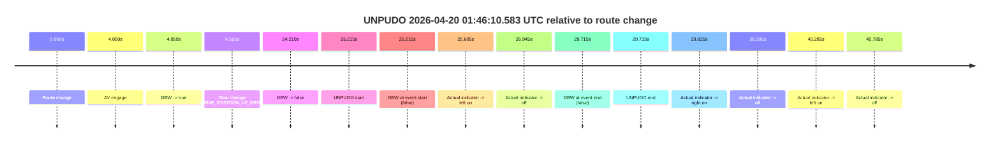
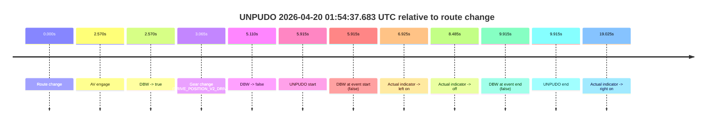
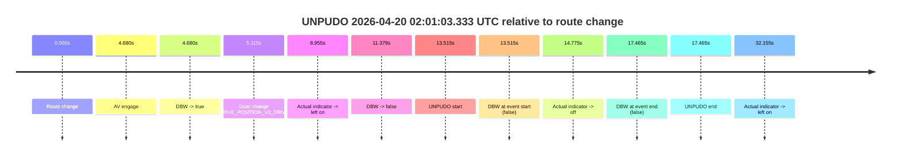
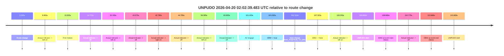

# Run Report: fme10011/2026-04-20--00-29-23--gen2-av-1baf6607-6545-4bd8-bb68-9244ef94cc2a

| Field | Value |
|---|---|
| Run ID | `fme10011/2026-04-20--00-29-23--gen2-av-1baf6607-6545-4bd8-bb68-9244ef94cc2a` |
| Date | `2026-04-20` |
| Model(s) | `pink-manta-ray-smooth` |
| Author | `guy.geva` |
| Event count | `6` |

## unpudo 2026-04-20 00:51:33.283 UTC

| Field | Value |
|---|---|
| Model | `pink-manta-ray-smooth` |
| Author | `guy.geva` |
| Run ID | `fme10011/2026-04-20--00-29-23--gen2-av-1baf6607-6545-4bd8-bb68-9244ef94cc2a` |
| Date | `2026-04-20` |
| Time (UTC) | `00:51:33.283` |
| Event type | `unpudo` |
| Disengagement type | `none observed` |
| Route change | `found` |
| Console | [run](https://console.sso.wayve.ai/run/fme10011/2026-04-20--00-29-23--gen2-av-1baf6607-6545-4bd8-bb68-9244ef94cc2a?id=&time-unixus=1776646293283298) |
| Foxglove | [segment](https://app.foxglove.dev/wayve-on-prem/p/prj_0dX18KZdVHg1fmmI/view?ds=foxglove-stream&ds.deviceName=fme10011&ds.start=2026-04-20T00%3A49%3A24.418641Z&ds.end=2026-04-20T00%3A51%3A47.483304Z&layoutId=lay_0e7VD4WIKDQGU73Y&time=2026-04-20T00%3A51%3A33.283298Z) |

### Event card: fail

- Fail: the credited unpudo does not stay AV-owned. The event window starts with DBW false, and the maneuver outcome lands outside a clean AV-owned segment.

| Event | Time (UTC) | Delta from route change |
|---|---:|---:|
| Route change | 2026-04-20 00:49:34.418 | `0.000s` |
| First motion | 2026-04-20 00:49:34.432 | `0.014s` |
| Actual indicator -> right on | 2026-04-20 00:49:50.552 | `16.134s` |
| Actual indicator -> off | 2026-04-20 00:50:31.832 | `57.414s` |
| Actual indicator -> right on | 2026-04-20 00:50:33.133 | `58.714s` |
| Actual indicator -> off | 2026-04-20 00:50:35.153 | `60.734s` |
| AV engage | 2026-04-20 00:51:24.378 | `109.960s` |
| DBW -> true | 2026-04-20 00:51:24.378 | `109.960s` |
| Gear change (DRIVE_POSITION_V2_DRIVE) | 2026-04-20 00:51:24.783 | `110.365s` |
| DBW -> false | 2026-04-20 00:51:32.519 | `118.101s` |
| UNPUDO start | 2026-04-20 00:51:33.283 | `118.865s` |
| DBW at event start (false) | 2026-04-20 00:51:33.283 | `118.865s` |
| Actual indicator -> left on | 2026-04-20 00:51:34.292 | `119.874s` |
| Actual indicator -> off | 2026-04-20 00:51:35.613 | `121.194s` |
| DBW at event end (false) | 2026-04-20 00:51:37.483 | `123.065s` |
| UNPUDO end | 2026-04-20 00:51:37.483 | `123.065s` |
| Actual indicator -> left on | 2026-04-20 00:51:39.793 | `125.375s` |

| Metric | Value |
|---|---|
| Outcome | `fail` |
| Effective failure type | `completed_outside_av` |
| Route change status | `found` |
| DBW at event start | `false` |
| DBW at event end | `false` |
| Predicted gear at AV start | `DRIVE_POSITION_V2_DRIVE` |
| Actual gear at AV start | `DRIVE_POSITION_V2_PARK` |
| Predicted gear at event start | `DRIVE_POSITION_V2_DRIVE` |
| Actual gear at event start | `DRIVE_POSITION_V2_DRIVE` |
| Planned indicator direction | `INDICATORS_STATE_V2_LEFT_ON` |
| Controller indicator direction | `INDICATORS_STATE_V2_LEFT_ON` |
| Actual indicator direction | `INDICATORS_STATE_V2_OFF` |
| Actual indicator at maneuver end | `INDICATORS_STATE_V2_OFF` |
| Driver accel help in AV | `false` |
| Driver accel help timestamp | `n/a` |
| Max accel pedal pct in AV | `0.0%` |
| Max brake pedal pct in AV | `11.8%` |
| Max speed mps in AV | `0.000` |
| Success timing baseline | `route change` |
| Route -> AV | `109.960s` |
| AV -> event start | `8.905s` |
| AV -> first motion | `-109.945s` |
| Success baseline -> event start | `118.865s` |
| Success baseline -> first motion | `0.014s` |
| AV duration before disengagement | `8.141s` |
| Trajectory waypoint count | `36` |
| Driving-plan step count | `11` |

The scored portion starts from the AV-owned window, not from the pre-AV setup. Route-change search in the stopped pre-event segment was `found`, with the baseline therefore set to route change. At the event anchor the model predicts `DRIVE_POSITION_V2_DRIVE` and the actual gear is `DRIVE_POSITION_V2_DRIVE`. The effective model outcome is `fail` because `completed_outside_av.`

### Resolution

| Field | Value |
|---|---|
| Final outcome | `fail` |
| Do we agree with this label? | `yes` |
| Source disengagement type | `none observed` |
| Resolved effective failure type | `completed_outside_av` |
| Confidence | `high` |

## unpudo 2026-04-20 01:38:00.133 UTC

| Field | Value |
|---|---|
| Model | `pink-manta-ray-smooth` |
| Author | `guy.geva` |
| Run ID | `fme10011/2026-04-20--00-29-23--gen2-av-1baf6607-6545-4bd8-bb68-9244ef94cc2a` |
| Date | `2026-04-20` |
| Time (UTC) | `01:38:00.133` |
| Event type | `unpudo` |
| Disengagement type | `none observed` |
| Route change | `found` |
| Console | [run](https://console.sso.wayve.ai/run/fme10011/2026-04-20--00-29-23--gen2-av-1baf6607-6545-4bd8-bb68-9244ef94cc2a?id=&time-unixus=1776649080133293) |
| Foxglove | [segment](https://app.foxglove.dev/wayve-on-prem/p/prj_0dX18KZdVHg1fmmI/view?ds=foxglove-stream&ds.deviceName=fme10011&ds.start=2026-04-20T01%3A37%3A38.318286Z&ds.end=2026-04-20T01%3A38%3A14.483305Z&layoutId=lay_0e7VD4WIKDQGU73Y&time=2026-04-20T01%3A38%3A00.133293Z) |

### Event card: fail

- Fail: the credited unpudo does not stay AV-owned. The event window starts with DBW false, and the maneuver outcome lands outside a clean AV-owned segment.

| Event | Time (UTC) | Delta from route change |
|---|---:|---:|
| Route change | 2026-04-20 01:37:48.318 | `0.000s` |
| AV engage | 2026-04-20 01:37:51.078 | `2.760s` |
| DBW -> true | 2026-04-20 01:37:51.078 | `2.760s` |
| DBW -> false | 2026-04-20 01:37:54.238 | `5.920s` |
| Gear change (DRIVE_POSITION_V2_DRIVE) | 2026-04-20 01:37:58.133 | `9.815s` |
| Actual indicator -> left on | 2026-04-20 01:37:59.332 | `11.015s` |
| UNPUDO start | 2026-04-20 01:38:00.133 | `11.815s` |
| DBW at event start (false) | 2026-04-20 01:38:00.133 | `11.815s` |
| Actual indicator -> off | 2026-04-20 01:38:01.572 | `13.255s` |
| Actual indicator -> right on | 2026-04-20 01:38:03.072 | `14.755s` |
| DBW at event end (false) | 2026-04-20 01:38:04.483 | `16.165s` |
| UNPUDO end | 2026-04-20 01:38:04.483 | `16.165s` |
| Actual indicator -> off | 2026-04-20 01:38:10.033 | `21.715s` |
| Actual indicator -> right on | 2026-04-20 01:38:12.312 | `23.995s` |
| Actual indicator -> off | 2026-04-20 01:38:20.173 | `31.855s` |

| Metric | Value |
|---|---|
| Outcome | `fail` |
| Effective failure type | `not_av_owned` |
| Route change status | `found` |
| DBW at event start | `false` |
| DBW at event end | `false` |
| Predicted gear at AV start | `DRIVE_POSITION_V2_REVERSE` |
| Actual gear at AV start | `DRIVE_POSITION_V2_PARK` |
| Predicted gear at event start | `DRIVE_POSITION_V2_DRIVE` |
| Actual gear at event start | `DRIVE_POSITION_V2_DRIVE` |
| Planned indicator direction | `INDICATORS_STATE_V2_OFF` |
| Controller indicator direction | `INDICATORS_STATE_V2_OFF` |
| Actual indicator direction | `INDICATORS_STATE_V2_LEFT_ON` |
| Actual indicator at maneuver end | `INDICATORS_STATE_V2_RIGHT_ON` |
| Driver accel help in AV | `false` |
| Driver accel help timestamp | `n/a` |
| Max accel pedal pct in AV | `0.0%` |
| Max brake pedal pct in AV | `11.0%` |
| Max speed mps in AV | `0.000` |
| Success timing baseline | `route change` |
| Route -> AV | `2.760s` |
| AV -> event start | `9.055s` |
| AV -> first motion | `n/a` |
| Success baseline -> event start | `11.815s` |
| Success baseline -> first motion | `n/a` |
| AV duration before disengagement | `3.160s` |
| Trajectory waypoint count | `36` |
| Driving-plan step count | `11` |

The scored portion starts from the AV-owned window, not from the pre-AV setup. Route-change search in the stopped pre-event segment was `found`, with the baseline therefore set to route change. At the event anchor the model predicts `DRIVE_POSITION_V2_DRIVE` and the actual gear is `DRIVE_POSITION_V2_DRIVE`. The effective model outcome is `fail` because `not_av_owned.`

### Resolution

| Field | Value |
|---|---|
| Final outcome | `fail` |
| Do we agree with this label? | `yes` |
| Source disengagement type | `none observed` |
| Resolved effective failure type | `not_av_owned` |
| Confidence | `high` |

## unpudo 2026-04-20 01:46:10.583 UTC

| Field | Value |
|---|---|
| Model | `pink-manta-ray-smooth` |
| Author | `guy.geva` |
| Run ID | `fme10011/2026-04-20--00-29-23--gen2-av-1baf6607-6545-4bd8-bb68-9244ef94cc2a` |
| Date | `2026-04-20` |
| Time (UTC) | `01:46:10.583` |
| Event type | `unpudo` |
| Disengagement type | `none observed` |
| Route change | `found` |
| Console | [run](https://console.sso.wayve.ai/run/fme10011/2026-04-20--00-29-23--gen2-av-1baf6607-6545-4bd8-bb68-9244ef94cc2a?id=&time-unixus=1776649570583297) |
| Foxglove | [segment](https://app.foxglove.dev/wayve-on-prem/p/prj_0dX18KZdVHg1fmmI/view?ds=foxglove-stream&ds.deviceName=fme10011&ds.start=2026-04-20T01%3A45%3A35.368251Z&ds.end=2026-04-20T01%3A46%3A25.083309Z&layoutId=lay_0e7VD4WIKDQGU73Y&time=2026-04-20T01%3A46%3A10.583297Z) |

### Event card: fail

- Fail: the credited unpudo does not stay AV-owned. The event window starts with DBW false, and the maneuver outcome lands outside a clean AV-owned segment.

| Event | Time (UTC) | Delta from route change |
|---|---:|---:|
| Route change | 2026-04-20 01:45:45.368 | `0.000s` |
| AV engage | 2026-04-20 01:45:49.418 | `4.050s` |
| DBW -> true | 2026-04-20 01:45:49.418 | `4.050s` |
| Gear change (DRIVE_POSITION_V2_DRIVE) | 2026-04-20 01:45:49.933 | `4.565s` |
| DBW -> false | 2026-04-20 01:46:09.578 | `24.210s` |
| UNPUDO start | 2026-04-20 01:46:10.583 | `25.215s` |
| DBW at event start (false) | 2026-04-20 01:46:10.583 | `25.215s` |
| Actual indicator -> left on | 2026-04-20 01:46:10.973 | `25.605s` |
| Actual indicator -> off | 2026-04-20 01:46:12.312 | `26.945s` |
| DBW at event end (false) | 2026-04-20 01:46:15.083 | `29.715s` |
| UNPUDO end | 2026-04-20 01:46:15.083 | `29.715s` |
| Actual indicator -> right on | 2026-04-20 01:46:15.193 | `29.825s` |
| Actual indicator -> off | 2026-04-20 01:46:23.572 | `38.205s` |
| Actual indicator -> left on | 2026-04-20 01:46:25.652 | `40.285s` |
| Actual indicator -> off | 2026-04-20 01:46:31.153 | `45.785s` |

| Metric | Value |
|---|---|
| Outcome | `fail` |
| Effective failure type | `not_av_owned` |
| Route change status | `found` |
| DBW at event start | `false` |
| DBW at event end | `false` |
| Predicted gear at AV start | `DRIVE_POSITION_V2_DRIVE` |
| Actual gear at AV start | `DRIVE_POSITION_V2_PARK` |
| Predicted gear at event start | `DRIVE_POSITION_V2_DRIVE` |
| Actual gear at event start | `DRIVE_POSITION_V2_DRIVE` |
| Planned indicator direction | `INDICATORS_STATE_V2_LEFT_ON` |
| Controller indicator direction | `INDICATORS_STATE_V2_LEFT_ON` |
| Actual indicator direction | `INDICATORS_STATE_V2_OFF` |
| Actual indicator at maneuver end | `INDICATORS_STATE_V2_OFF` |
| Driver accel help in AV | `false` |
| Driver accel help timestamp | `n/a` |
| Max accel pedal pct in AV | `0.0%` |
| Max brake pedal pct in AV | `8.0%` |
| Max speed mps in AV | `0.000` |
| Success timing baseline | `route change` |
| Route -> AV | `4.050s` |
| AV -> event start | `21.165s` |
| AV -> first motion | `n/a` |
| Success baseline -> event start | `25.215s` |
| Success baseline -> first motion | `n/a` |
| AV duration before disengagement | `20.161s` |
| Trajectory waypoint count | `37` |
| Driving-plan step count | `11` |

The scored portion starts from the AV-owned window, not from the pre-AV setup. Route-change search in the stopped pre-event segment was `found`, with the baseline therefore set to route change. At the event anchor the model predicts `DRIVE_POSITION_V2_DRIVE` and the actual gear is `DRIVE_POSITION_V2_DRIVE`. The effective model outcome is `fail` because `not_av_owned.`

### Resolution

| Field | Value |
|---|---|
| Final outcome | `fail` |
| Do we agree with this label? | `yes` |
| Source disengagement type | `none observed` |
| Resolved effective failure type | `not_av_owned` |
| Confidence | `high` |

## unpudo 2026-04-20 01:54:37.683 UTC

| Field | Value |
|---|---|
| Model | `pink-manta-ray-smooth` |
| Author | `guy.geva` |
| Run ID | `fme10011/2026-04-20--00-29-23--gen2-av-1baf6607-6545-4bd8-bb68-9244ef94cc2a` |
| Date | `2026-04-20` |
| Time (UTC) | `01:54:37.683` |
| Event type | `unpudo` |
| Disengagement type | `none observed` |
| Route change | `found` |
| Console | [run](https://console.sso.wayve.ai/run/fme10011/2026-04-20--00-29-23--gen2-av-1baf6607-6545-4bd8-bb68-9244ef94cc2a?id=&time-unixus=1776650077683305) |
| Foxglove | [segment](https://app.foxglove.dev/wayve-on-prem/p/prj_0dX18KZdVHg1fmmI/view?ds=foxglove-stream&ds.deviceName=fme10011&ds.start=2026-04-20T01%3A54%3A21.768297Z&ds.end=2026-04-20T01%3A54%3A51.683305Z&layoutId=lay_0e7VD4WIKDQGU73Y&time=2026-04-20T01%3A54%3A37.683305Z) |

### Event card: fail

- Fail: the credited unpudo does not stay AV-owned. The event window starts with DBW false, and the maneuver outcome lands outside a clean AV-owned segment.

| Event | Time (UTC) | Delta from route change |
|---|---:|---:|
| Route change | 2026-04-20 01:54:31.768 | `0.000s` |
| AV engage | 2026-04-20 01:54:34.338 | `2.570s` |
| DBW -> true | 2026-04-20 01:54:34.338 | `2.570s` |
| Gear change (DRIVE_POSITION_V2_DRIVE) | 2026-04-20 01:54:34.833 | `3.065s` |
| DBW -> false | 2026-04-20 01:54:36.878 | `5.110s` |
| UNPUDO start | 2026-04-20 01:54:37.683 | `5.915s` |
| DBW at event start (false) | 2026-04-20 01:54:37.683 | `5.915s` |
| Actual indicator -> left on | 2026-04-20 01:54:38.693 | `6.925s` |
| Actual indicator -> off | 2026-04-20 01:54:40.253 | `8.485s` |
| DBW at event end (false) | 2026-04-20 01:54:41.683 | `9.915s` |
| UNPUDO end | 2026-04-20 01:54:41.683 | `9.915s` |
| Actual indicator -> right on | 2026-04-20 01:54:50.793 | `19.025s` |

| Metric | Value |
|---|---|
| Outcome | `fail` |
| Effective failure type | `not_av_owned` |
| Route change status | `found` |
| DBW at event start | `false` |
| DBW at event end | `false` |
| Predicted gear at AV start | `DRIVE_POSITION_V2_DRIVE` |
| Actual gear at AV start | `DRIVE_POSITION_V2_PARK` |
| Predicted gear at event start | `DRIVE_POSITION_V2_DRIVE` |
| Actual gear at event start | `DRIVE_POSITION_V2_DRIVE` |
| Planned indicator direction | `INDICATORS_STATE_V2_RIGHT_ON` |
| Controller indicator direction | `INDICATORS_STATE_V2_RIGHT_ON` |
| Actual indicator direction | `INDICATORS_STATE_V2_OFF` |
| Actual indicator at maneuver end | `INDICATORS_STATE_V2_OFF` |
| Driver accel help in AV | `false` |
| Driver accel help timestamp | `n/a` |
| Max accel pedal pct in AV | `0.0%` |
| Max brake pedal pct in AV | `8.5%` |
| Max speed mps in AV | `0.000` |
| Success timing baseline | `route change` |
| Route -> AV | `2.570s` |
| AV -> event start | `3.345s` |
| AV -> first motion | `n/a` |
| Success baseline -> event start | `5.915s` |
| Success baseline -> first motion | `n/a` |
| AV duration before disengagement | `2.541s` |
| Trajectory waypoint count | `36` |
| Driving-plan step count | `11` |

The scored portion starts from the AV-owned window, not from the pre-AV setup. Route-change search in the stopped pre-event segment was `found`, with the baseline therefore set to route change. At the event anchor the model predicts `DRIVE_POSITION_V2_DRIVE` and the actual gear is `DRIVE_POSITION_V2_DRIVE`. The effective model outcome is `fail` because `not_av_owned.`

### Resolution

| Field | Value |
|---|---|
| Final outcome | `fail` |
| Do we agree with this label? | `yes` |
| Source disengagement type | `none observed` |
| Resolved effective failure type | `not_av_owned` |
| Confidence | `high` |

## unpudo 2026-04-20 02:01:03.333 UTC

| Field | Value |
|---|---|
| Model | `pink-manta-ray-smooth` |
| Author | `guy.geva` |
| Run ID | `fme10011/2026-04-20--00-29-23--gen2-av-1baf6607-6545-4bd8-bb68-9244ef94cc2a` |
| Date | `2026-04-20` |
| Time (UTC) | `02:01:03.333` |
| Event type | `unpudo` |
| Disengagement type | `none observed` |
| Route change | `found` |
| Console | [run](https://console.sso.wayve.ai/run/fme10011/2026-04-20--00-29-23--gen2-av-1baf6607-6545-4bd8-bb68-9244ef94cc2a?id=&time-unixus=1776650463333311) |
| Foxglove | [segment](https://app.foxglove.dev/wayve-on-prem/p/prj_0dX18KZdVHg1fmmI/view?ds=foxglove-stream&ds.deviceName=fme10011&ds.start=2026-04-20T02%3A00%3A39.818259Z&ds.end=2026-04-20T02%3A01%3A17.283313Z&layoutId=lay_0e7VD4WIKDQGU73Y&time=2026-04-20T02%3A01%3A03.333311Z) |

### Event card: fail

- Fail: the credited unpudo does not stay AV-owned. The event window starts with DBW false, and the maneuver outcome lands outside a clean AV-owned segment.

| Event | Time (UTC) | Delta from route change |
|---|---:|---:|
| Route change | 2026-04-20 02:00:49.818 | `0.000s` |
| AV engage | 2026-04-20 02:00:54.498 | `4.680s` |
| DBW -> true | 2026-04-20 02:00:54.498 | `4.680s` |
| Gear change (DRIVE_POSITION_V2_DRIVE) | 2026-04-20 02:00:54.933 | `5.115s` |
| Actual indicator -> left on | 2026-04-20 02:00:58.773 | `8.955s` |
| DBW -> false | 2026-04-20 02:01:01.197 | `11.379s` |
| UNPUDO start | 2026-04-20 02:01:03.333 | `13.515s` |
| DBW at event start (false) | 2026-04-20 02:01:03.333 | `13.515s` |
| Actual indicator -> off | 2026-04-20 02:01:04.592 | `14.775s` |
| DBW at event end (false) | 2026-04-20 02:01:07.283 | `17.465s` |
| UNPUDO end | 2026-04-20 02:01:07.283 | `17.465s` |
| Actual indicator -> left on | 2026-04-20 02:01:21.972 | `32.155s` |

| Metric | Value |
|---|---|
| Outcome | `fail` |
| Effective failure type | `not_av_owned` |
| Route change status | `found` |
| DBW at event start | `false` |
| DBW at event end | `false` |
| Predicted gear at AV start | `DRIVE_POSITION_V2_DRIVE` |
| Actual gear at AV start | `DRIVE_POSITION_V2_PARK` |
| Predicted gear at event start | `DRIVE_POSITION_V2_DRIVE` |
| Actual gear at event start | `DRIVE_POSITION_V2_DRIVE` |
| Planned indicator direction | `INDICATORS_STATE_V2_OFF` |
| Controller indicator direction | `INDICATORS_STATE_V2_OFF` |
| Actual indicator direction | `INDICATORS_STATE_V2_LEFT_ON` |
| Actual indicator at maneuver end | `INDICATORS_STATE_V2_OFF` |
| Driver accel help in AV | `false` |
| Driver accel help timestamp | `n/a` |
| Max accel pedal pct in AV | `0.0%` |
| Max brake pedal pct in AV | `8.9%` |
| Max speed mps in AV | `0.000` |
| Success timing baseline | `route change` |
| Route -> AV | `4.680s` |
| AV -> event start | `8.835s` |
| AV -> first motion | `n/a` |
| Success baseline -> event start | `13.515s` |
| Success baseline -> first motion | `n/a` |
| AV duration before disengagement | `6.699s` |
| Trajectory waypoint count | `37` |
| Driving-plan step count | `11` |

The scored portion starts from the AV-owned window, not from the pre-AV setup. Route-change search in the stopped pre-event segment was `found`, with the baseline therefore set to route change. At the event anchor the model predicts `DRIVE_POSITION_V2_DRIVE` and the actual gear is `DRIVE_POSITION_V2_DRIVE`. The effective model outcome is `fail` because `not_av_owned.`

### Resolution

| Field | Value |
|---|---|
| Final outcome | `fail` |
| Do we agree with this label? | `yes` |
| Source disengagement type | `none observed` |
| Resolved effective failure type | `not_av_owned` |
| Confidence | `high` |

## unpudo 2026-04-20 02:02:39.483 UTC

| Field | Value |
|---|---|
| Model | `pink-manta-ray-smooth` |
| Author | `guy.geva` |
| Run ID | `fme10011/2026-04-20--00-29-23--gen2-av-1baf6607-6545-4bd8-bb68-9244ef94cc2a` |
| Date | `2026-04-20` |
| Time (UTC) | `02:02:39.483` |
| Event type | `unpudo` |
| Disengagement type | `none observed` |
| Route change | `found` |
| Console | [run](https://console.sso.wayve.ai/run/fme10011/2026-04-20--00-29-23--gen2-av-1baf6607-6545-4bd8-bb68-9244ef94cc2a?id=&time-unixus=1776650559483320) |
| Foxglove | [segment](https://app.foxglove.dev/wayve-on-prem/p/prj_0dX18KZdVHg1fmmI/view?ds=foxglove-stream&ds.deviceName=fme10011&ds.start=2026-04-20T02%3A00%3A39.818259Z&ds.end=2026-04-20T02%3A02%3A53.483300Z&layoutId=lay_0e7VD4WIKDQGU73Y&time=2026-04-20T02%3A02%3A39.483320Z) |

### Event card: fail

- Fail: the credited unpudo does not stay AV-owned. The event window starts with DBW false, and the maneuver outcome lands outside a clean AV-owned segment.

| Event | Time (UTC) | Delta from route change |
|---|---:|---:|
| Route change | 2026-04-20 02:00:49.818 | `0.000s` |
| Actual indicator -> left on | 2026-04-20 02:00:58.773 | `8.955s` |
| First motion | 2026-04-20 02:01:03.372 | `13.555s` |
| Actual indicator -> off | 2026-04-20 02:01:04.592 | `14.775s` |
| Actual indicator -> left on | 2026-04-20 02:01:21.972 | `32.155s` |
| Actual indicator -> off | 2026-04-20 02:01:31.892 | `42.075s` |
| Actual indicator -> right on | 2026-04-20 02:01:32.613 | `42.795s` |
| Actual indicator -> off | 2026-04-20 02:01:34.613 | `44.795s` |
| Actual indicator -> left on | 2026-04-20 02:01:49.213 | `59.395s` |
| Actual indicator -> off | 2026-04-20 02:01:50.773 | `60.955s` |
| AV engage | 2026-04-20 02:02:30.838 | `101.020s` |
| DBW -> true | 2026-04-20 02:02:30.838 | `101.020s` |
| Gear change (DRIVE_POSITION_V2_DRIVE) | 2026-04-20 02:02:31.333 | `101.515s` |
| DBW -> false | 2026-04-20 02:02:37.138 | `107.320s` |
| Actual indicator -> left on | 2026-04-20 02:02:38.072 | `108.255s` |
| UNPUDO start | 2026-04-20 02:02:39.483 | `109.665s` |
| DBW at event start (false) | 2026-04-20 02:02:39.483 | `109.665s` |
| Actual indicator -> off | 2026-04-20 02:02:40.592 | `110.775s` |
| DBW at event end (false) | 2026-04-20 02:02:43.483 | `113.665s` |
| UNPUDO end | 2026-04-20 02:02:43.483 | `113.665s` |

| Metric | Value |
|---|---|
| Outcome | `fail` |
| Effective failure type | `completed_outside_av` |
| Route change status | `found` |
| DBW at event start | `false` |
| DBW at event end | `false` |
| Predicted gear at AV start | `DRIVE_POSITION_V2_DRIVE` |
| Actual gear at AV start | `DRIVE_POSITION_V2_PARK` |
| Predicted gear at event start | `DRIVE_POSITION_V2_DRIVE` |
| Actual gear at event start | `DRIVE_POSITION_V2_DRIVE` |
| Planned indicator direction | `INDICATORS_STATE_V2_LEFT_ON` |
| Controller indicator direction | `INDICATORS_STATE_V2_LEFT_ON` |
| Actual indicator direction | `INDICATORS_STATE_V2_LEFT_ON` |
| Actual indicator at maneuver end | `INDICATORS_STATE_V2_OFF` |
| Driver accel help in AV | `false` |
| Driver accel help timestamp | `n/a` |
| Max accel pedal pct in AV | `0.0%` |
| Max brake pedal pct in AV | `18.5%` |
| Max speed mps in AV | `0.000` |
| Success timing baseline | `route change` |
| Route -> AV | `101.020s` |
| AV -> event start | `8.645s` |
| AV -> first motion | `-87.465s` |
| Success baseline -> event start | `109.665s` |
| Success baseline -> first motion | `13.555s` |
| AV duration before disengagement | `6.300s` |
| Trajectory waypoint count | `37` |
| Driving-plan step count | `11` |

The scored portion starts from the AV-owned window, not from the pre-AV setup. Route-change search in the stopped pre-event segment was `found`, with the baseline therefore set to route change. At the event anchor the model predicts `DRIVE_POSITION_V2_DRIVE` and the actual gear is `DRIVE_POSITION_V2_DRIVE`. The effective model outcome is `fail` because `completed_outside_av.`

### Resolution

| Field | Value |
|---|---|
| Final outcome | `fail` |
| Do we agree with this label? | `yes` |
| Source disengagement type | `none observed` |
| Resolved effective failure type | `completed_outside_av` |
| Confidence | `high` |
