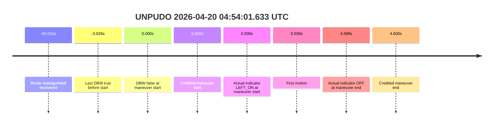
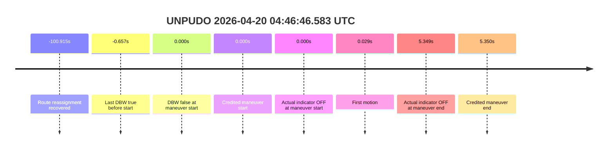

# Run Report: fme10011/2026-04-20--03-53-04--gen2-av-850e5b7c-de73-4684-be82-3d23281dc919

| Field | Value |
|---|---|
| Run ID | `fme10011/2026-04-20--03-53-04--gen2-av-850e5b7c-de73-4684-be82-3d23281dc919` |
| Date | `2026-04-20` |
| Model(s) | `satisfied-amber-moose` |
| Author | `guy.geva` |
| Event count | `5` |
| Outcome summary | `0 pass / 5 fail` |

## unparking 2026-04-20 05:01:48.133 UTC

| Field | Value |
|---|---|
| Model | `satisfied-amber-moose` |
| Author | `guy.geva` |
| Run ID | `fme10011/2026-04-20--03-53-04--gen2-av-850e5b7c-de73-4684-be82-3d23281dc919` |
| Date | `2026-04-20` |
| Time (UTC) | `2026-04-20 05:01:48.133` |
| Event type | `unparking` |
| Disengagement type | `none observed` |
| Console | [run](https://console.sso.wayve.ai/run/fme10011/2026-04-20--03-53-04--gen2-av-850e5b7c-de73-4684-be82-3d23281dc919?id=&time-unixus=1776661308133296) |
| Foxglove | [segment](https://app.foxglove.dev/wayve-on-prem/p/prj_0dX18KZdVHg1fmmI/view?ds=foxglove-stream&ds.deviceName=fme10011&ds.end=2026-04-20T05%3A02%3A14.033Z&ds.start=2026-04-20T05%3A00%3A48.133Z&layoutId=lay_0e7VD4WIKDQGU73Y&time=2026-04-20T05%3A01%3A48.133Z) |

- Fail: the credited unparking starts outside AV. The last local DBW true ends `28.566s` before the anchor, the official start is DBW-false, and the vehicle begins moving `0.020s` later with no pedal help. Route reassignment was recovered in the stopped pre-event segment.

| Event | Time (UTC) | Delta from event start | Note |
|---|---|---:|---|
| Route reassignment recovered | 2026-04-20 05:00:28.668 | `-79.465s` | searched in the stopped pre-event segment |
| Last DBW true before start | 2026-04-20 05:01:19.567 | `-28.566s` | `controller_is_dbw=true` |
| DBW false at maneuver start | 2026-04-20 05:01:48.133 | `0.000s` | `controller_is_dbw=false` |
| Credited maneuver start | 2026-04-20 05:01:48.133 | `0.000s` | `event anchor` |
| Actual indicator at maneuver start | 2026-04-20 05:01:48.133 | `0.000s` | `OFF` |
| First motion | 2026-04-20 05:01:48.153 | `0.020s` | `0.119 m/s` |
| Actual indicator at maneuver end | 2026-04-20 05:01:54.032 | `5.899s` | `OFF` |
| Credited maneuver end | 2026-04-20 05:01:54.033 | `5.900s` | `event boundary` |

| Metric | Value |
|---|---|
| Validated route reassignment | `true` |
| Controller DBW at event start | `false` |
| Predicted gear at event start | `DRIVE_POSITION_V2_DRIVE` |
| Actual gear at event start | `DRIVE_POSITION_V2_DRIVE` |
| Planned indicator at event start | `INDICATORS_STATE_V2_OFF` |
| Actual indicator at event start | `INDICATORS_STATE_V2_OFF` |
| Actual indicator at event end | `INDICATORS_STATE_V2_OFF` |
| Driver accel help in maneuver window | `false` |
| Max accel pedal | `0.0%` |
| Max brake pedal | `0.0%` |
| Max speed | `2.675 m/s` |
| Trajectory waypoint count at anchor | `36` |
| Trajectory driving-plan step count at anchor | `11` |
| Main disengagement flag | `0` |
| Gear-to-start disengagement | `0` |
| Before-gearchange-10s disengagement | `0` |

The route change is present, but it does not rescue ownership. The motion that counts for scoring begins after DBW has already dropped false, so this is a completed-outside-AV fail even though the vehicle keeps moving and the route search succeeded.

### Resolution

| Field | Value |
|---|---|
| Final outcome | `fail` |
| Do we agree with this label? | `yes` |
| Source disengagement type | `none observed` |
| Resolved effective failure type | `completed_outside_av` |
| Confidence | `high` |

## unpudo 2026-04-20 04:54:01.633 UTC

| Field | Value |
|---|---|
| Model | `satisfied-amber-moose` |
| Author | `guy.geva` |
| Run ID | `fme10011/2026-04-20--03-53-04--gen2-av-850e5b7c-de73-4684-be82-3d23281dc919` |
| Date | `2026-04-20` |
| Time (UTC) | `2026-04-20 04:54:01.633` |
| Event type | `unpudo` |
| Disengagement type | `none observed` |
| Console | [run](https://console.sso.wayve.ai/run/fme10011/2026-04-20--03-53-04--gen2-av-850e5b7c-de73-4684-be82-3d23281dc919?id=&time-unixus=1776660841633318) |
| Foxglove | [segment](https://app.foxglove.dev/wayve-on-prem/p/prj_0dX18KZdVHg1fmmI/view?ds=foxglove-stream&ds.deviceName=fme10011&ds.end=2026-04-20T04%3A54%3A26.233Z&ds.start=2026-04-20T04%3A53%3A01.633Z&layoutId=lay_0e7VD4WIKDQGU73Y&time=2026-04-20T04%3A54%3A01.633Z) |

- Fail: the credited UNPUDO is outside AV. DBW is false at the anchor, the last local DBW true ended `3.026s` earlier, and the vehicle starts rolling `0.039s` later with no pedal help. The stopped pre-event segment does contain the expected route reassignment.

| Event | Time (UTC) | Delta from event start | Note |
|---|---|---:|---|
| Route reassignment recovered | 2026-04-20 04:52:38.618 | `-83.015s` | searched in the stopped pre-event segment |
| Last DBW true before start | 2026-04-20 04:53:58.607 | `-3.026s` | `controller_is_dbw=true` |
| DBW false at maneuver start | 2026-04-20 04:54:01.633 | `0.000s` | `controller_is_dbw=false` |
| Credited maneuver start | 2026-04-20 04:54:01.633 | `0.000s` | `event anchor` |
| Actual indicator at maneuver start | 2026-04-20 04:54:01.633 | `0.000s` | `LEFT_ON` |
| First motion | 2026-04-20 04:54:01.672 | `0.039s` | `0.117 m/s` |
| Actual indicator at maneuver end | 2026-04-20 04:54:06.232 | `4.599s` | `OFF` |
| Credited maneuver end | 2026-04-20 04:54:06.233 | `4.600s` | `event boundary` |

| Metric | Value |
|---|---|
| Validated route reassignment | `true` |
| Controller DBW at event start | `false` |
| Predicted gear at event start | `DRIVE_POSITION_V2_DRIVE` |
| Actual gear at event start | `DRIVE_POSITION_V2_DRIVE` |
| Planned indicator at event start | `INDICATORS_STATE_V2_LEFT_ON` |
| Actual indicator at event start | `INDICATORS_STATE_V2_LEFT_ON` |
| Actual indicator at event end | `INDICATORS_STATE_V2_OFF` |
| Driver accel help in maneuver window | `false` |
| Max accel pedal | `0.0%` |
| Max brake pedal | `0.0%` |
| Max speed | `5.094 m/s` |
| Trajectory waypoint count at anchor | `36` |
| Trajectory driving-plan step count at anchor | `11` |
| Main disengagement flag | `0` |
| Gear-to-start disengagement | `0` |
| Before-gearchange-10s disengagement | `0` |

The indicator plan happens to line up at the anchor, but that is not enough. The credited UNPUDO is already manual at the start, so the model does not own the maneuver and the correct report-card label is fail.

### Resolution

| Field | Value |
|---|---|
| Final outcome | `fail` |
| Do we agree with this label? | `yes` |
| Source disengagement type | `none observed` |
| Resolved effective failure type | `completed_outside_av` |
| Confidence | `high` |

## unpudo 2026-04-20 04:52:51.233 UTC

| Field | Value |
|---|---|
| Model | `satisfied-amber-moose` |
| Author | `guy.geva` |
| Run ID | `fme10011/2026-04-20--03-53-04--gen2-av-850e5b7c-de73-4684-be82-3d23281dc919` |
| Date | `2026-04-20` |
| Time (UTC) | `2026-04-20 04:52:51.233` |
| Event type | `unpudo` |
| Disengagement type | `none observed` |
| Console | [run](https://console.sso.wayve.ai/run/fme10011/2026-04-20--03-53-04--gen2-av-850e5b7c-de73-4684-be82-3d23281dc919?id=&time-unixus=1776660771233308) |
| Foxglove | [segment](https://app.foxglove.dev/wayve-on-prem/p/prj_0dX18KZdVHg1fmmI/view?ds=foxglove-stream&ds.deviceName=fme10011&ds.end=2026-04-20T04%3A53%3A14.333Z&ds.start=2026-04-20T04%3A51%3A51.233Z&layoutId=lay_0e7VD4WIKDQGU73Y&time=2026-04-20T04%3A52%3A51.233Z) |

- Fail: the credited UNPUDO starts after DBW has already dropped false, so the maneuver is not AV-owned. Motion begins `0.059s` later in manual, there is no accelerator help, and the route change was recovered earlier in the stopped segment.

| Event | Time (UTC) | Delta from event start | Note |
|---|---|---:|---|
| Route reassignment recovered | 2026-04-20 04:51:19.968 | `-91.265s` | searched in the stopped pre-event segment |
| Last DBW true before start | 2026-04-20 04:52:50.585 | `-0.648s` | `controller_is_dbw=true` |
| DBW false at maneuver start | 2026-04-20 04:52:51.233 | `0.000s` | `controller_is_dbw=false` |
| Credited maneuver start | 2026-04-20 04:52:51.233 | `0.000s` | `event anchor` |
| Actual indicator at maneuver start | 2026-04-20 04:52:51.233 | `0.000s` | `OFF` |
| First motion | 2026-04-20 04:52:51.292 | `0.059s` | `0.239 m/s` |
| Actual indicator at maneuver end | 2026-04-20 04:52:54.332 | `3.099s` | `OFF` |
| Credited maneuver end | 2026-04-20 04:52:54.333 | `3.100s` | `event boundary` |

| Metric | Value |
|---|---|
| Validated route reassignment | `true` |
| Controller DBW at event start | `false` |
| Predicted gear at event start | `DRIVE_POSITION_V2_DRIVE` |
| Actual gear at event start | `DRIVE_POSITION_V2_DRIVE` |
| Planned indicator at event start | `INDICATORS_STATE_V2_OFF` |
| Actual indicator at event start | `INDICATORS_STATE_V2_OFF` |
| Actual indicator at event end | `INDICATORS_STATE_V2_OFF` |
| Driver accel help in maneuver window | `false` |
| Max accel pedal | `0.0%` |
| Max brake pedal | `0.0%` |
| Max speed | `6.489 m/s` |
| Trajectory waypoint count at anchor | `36` |
| Trajectory driving-plan step count at anchor | `11` |
| Main disengagement flag | `0` |
| Gear-to-start disengagement | `0` |
| Before-gearchange-10s disengagement | `0` |

The model gets the gear prediction right and the route search is recoverable, but the owned segment never includes the official start. The maneuver is therefore scored as a fail because the credited UNPUDO begins after DBW is already false.

### Resolution

| Field | Value |
|---|---|
| Final outcome | `fail` |
| Do we agree with this label? | `yes` |
| Source disengagement type | `none observed` |
| Resolved effective failure type | `completed_outside_av` |
| Confidence | `high` |

## unpudo 2026-04-20 04:46:46.583 UTC

| Field | Value |
|---|---|
| Model | `satisfied-amber-moose` |
| Author | `guy.geva` |
| Run ID | `fme10011/2026-04-20--03-53-04--gen2-av-850e5b7c-de73-4684-be82-3d23281dc919` |
| Date | `2026-04-20` |
| Time (UTC) | `2026-04-20 04:46:46.583` |
| Event type | `unpudo` |
| Disengagement type | `failed_to_unpudo` |
| Console | [run](https://console.sso.wayve.ai/run/fme10011/2026-04-20--03-53-04--gen2-av-850e5b7c-de73-4684-be82-3d23281dc919?id=&time-unixus=1776660406583312) |
| Foxglove | [segment](https://app.foxglove.dev/wayve-on-prem/p/prj_0dX18KZdVHg1fmmI/view?ds=foxglove-stream&ds.deviceName=fme10011&ds.end=2026-04-20T04%3A47%3A11.933Z&ds.start=2026-04-20T04%3A45%3A46.583Z&layoutId=lay_0e7VD4WIKDQGU73Y&time=2026-04-20T04%3A46%3A46.583Z) |

- Fail: the packet recovered a route reassignment, but the credited UNPUDO still starts after DBW has gone false. The vehicle rolls almost immediately in manual, so the model does not own the maneuver even though the event was flagged as `failed_to_unpudo` in the source row.

| Event | Time (UTC) | Delta from event start | Note |
|---|---|---:|---|
| Route reassignment recovered | 2026-04-20 04:45:05.668 | `-100.915s` | searched in the stopped pre-event segment |
| Last DBW true before start | 2026-04-20 04:46:45.926 | `-0.657s` | `controller_is_dbw=true` |
| DBW false at maneuver start | 2026-04-20 04:46:46.583 | `0.000s` | `controller_is_dbw=false` |
| Credited maneuver start | 2026-04-20 04:46:46.583 | `0.000s` | `event anchor` |
| Actual indicator at maneuver start | 2026-04-20 04:46:46.583 | `0.000s` | `OFF` |
| First motion | 2026-04-20 04:46:46.612 | `0.029s` | `0.103 m/s` |
| Actual indicator at maneuver end | 2026-04-20 04:46:51.932 | `5.349s` | `OFF` |
| Credited maneuver end | 2026-04-20 04:46:51.933 | `5.350s` | `event boundary` |

| Metric | Value |
|---|---|
| Validated route reassignment | `true` |
| Controller DBW at event start | `false` |
| Predicted gear at event start | `DRIVE_POSITION_V2_DRIVE` |
| Actual gear at event start | `DRIVE_POSITION_V2_DRIVE` |
| Planned indicator at event start | `INDICATORS_STATE_V2_OFF` |
| Actual indicator at event start | `INDICATORS_STATE_V2_OFF` |
| Actual indicator at event end | `INDICATORS_STATE_V2_OFF` |
| Driver accel help in maneuver window | `false` |
| Max accel pedal | `0.0%` |
| Max brake pedal | `0.0%` |
| Max speed | `3.086 m/s` |
| Trajectory waypoint count at anchor | `37` |
| Trajectory driving-plan step count at anchor | `11` |
| Main disengagement flag | `0` |
| Gear-to-start disengagement | `1` |
| Before-gearchange-10s disengagement | `0` |

The source row calls this `failed_to_unpudo`, but the ownership verdict is the same: DBW is already false at the official start, so the maneuver being credited to the model is not AV-owned. That makes it a fail for model-performance reporting.

### Resolution

| Field | Value |
|---|---|
| Final outcome | `fail` |
| Do we agree with this label? | `yes` |
| Source disengagement type | `failed_to_unpudo` |
| Resolved effective failure type | `completed_outside_av` |
| Confidence | `high` |

## unpudo 2026-04-20 04:25:56.633 UTC

| Field | Value |
|---|---|
| Model | `satisfied-amber-moose` |
| Author | `guy.geva` |
| Run ID | `fme10011/2026-04-20--03-53-04--gen2-av-850e5b7c-de73-4684-be82-3d23281dc919` |
| Date | `2026-04-20` |
| Time (UTC) | `2026-04-20 04:25:56.633` |
| Event type | `unpudo` |
| Disengagement type | `failed_to_pudo` |
| Console | [run](https://console.sso.wayve.ai/run/fme10011/2026-04-20--03-53-04--gen2-av-850e5b7c-de73-4684-be82-3d23281dc919?id=&time-unixus=1776659156633296) |
| Foxglove | [segment](https://app.foxglove.dev/wayve-on-prem/p/prj_0dX18KZdVHg1fmmI/view?ds=foxglove-stream&ds.deviceName=fme10011&ds.end=2026-04-20T04%3A26%3A22.633Z&ds.start=2026-04-20T04%3A24%3A56.633Z&layoutId=lay_0e7VD4WIKDQGU73Y&time=2026-04-20T04%3A25%3A56.633Z) |

- Fail: the credited UNPUDO is not AV-owned at the anchor. DBW falls false `0.626s` before the event starts, the vehicle is already in manual when the anchor fires, and the maneuver completes entirely outside AV despite the route reassignment being recoverable.

| Event | Time (UTC) | Delta from event start | Note |
|---|---|---:|---|
| Route reassignment recovered | 2026-04-20 04:24:09.968 | `-106.665s` | searched in the stopped pre-event segment |
| Last DBW true before start | 2026-04-20 04:25:56.007 | `-0.626s` | `controller_is_dbw=true` |
| DBW false at maneuver start | 2026-04-20 04:25:56.633 | `0.000s` | `controller_is_dbw=false` |
| Credited maneuver start | 2026-04-20 04:25:56.633 | `0.000s` | `event anchor` |
| Actual indicator at maneuver start | 2026-04-20 04:25:56.633 | `0.000s` | `OFF` |
| First motion | 2026-04-20 04:25:56.652 | `0.019s` | `0.103 m/s` |
| Actual indicator at maneuver end | 2026-04-20 04:26:22.613 | `25.980s` | `OFF` |
| Credited maneuver end | 2026-04-20 04:26:22.633 | `26.000s` | `event boundary` |

| Metric | Value |
|---|---|
| Validated route reassignment | `true` |
| Controller DBW at event start | `false` |
| Predicted gear at event start | `DRIVE_POSITION_V2_DRIVE` |
| Actual gear at event start | `DRIVE_POSITION_V2_DRIVE` |
| Planned indicator at event start | `INDICATORS_STATE_V2_OFF` |
| Actual indicator at event start | `INDICATORS_STATE_V2_OFF` |
| Actual indicator at event end | `INDICATORS_STATE_V2_OFF` |
| Driver accel help in maneuver window | `false` |
| Max accel pedal | `0.0%` |
| Max brake pedal | `0.0%` |
| Max speed | `2.236 m/s` |
| Trajectory waypoint count at anchor | `36` |
| Trajectory driving-plan step count at anchor | `11` |
| Main disengagement flag | `0` |
| Gear-to-start disengagement | `1` |
| Before-gearchange-10s disengagement | `0` |

The stopped-segment route search succeeds, but it does not change the scoring. The maneuver is already manual when the official start fires, so the model does not own the credited UNPUDO and the correct outcome is fail.

### Resolution

| Field | Value |
|---|---|
| Final outcome | `fail` |
| Do we agree with this label? | `yes` |
| Source disengagement type | `failed_to_pudo` |
| Resolved effective failure type | `completed_outside_av` |
| Confidence | `high` |
