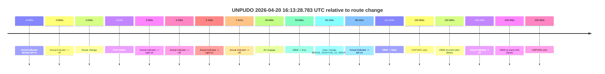
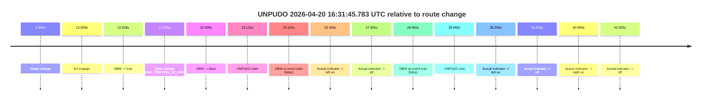

# Run Report: fme10011/2026-04-20--15-59-30--gen2-av-d1704755-7ef1-4aa6-9913-01cbad087acb

| Field | Value |
|---|---|
| Run ID | `fme10011/2026-04-20--15-59-30--gen2-av-d1704755-7ef1-4aa6-9913-01cbad087acb` |
| Date | `2026-04-20` |
| Model(s) | `pink-manta-ray-smooth` |
| Author | `guy.geva` |
| Event count | `2` |

## unpudo 2026-04-20 16:13:28.783 UTC

| Field | Value |
|---|---|
| Model | `pink-manta-ray-smooth` |
| Author | `guy.geva` |
| Run ID | `fme10011/2026-04-20--15-59-30--gen2-av-d1704755-7ef1-4aa6-9913-01cbad087acb` |
| Date | `2026-04-20` |
| Time (UTC) | `16:13:28.783` |
| Event type | `unpudo` |
| Disengagement type | `none observed` |
| Route change | `found` |
| Console | [run](https://console.sso.wayve.ai/run/fme10011/2026-04-20--15-59-30--gen2-av-d1704755-7ef1-4aa6-9913-01cbad087acb?id=&time-unixus=1776701608783311) |
| Foxglove | [segment](https://app.foxglove.dev/wayve-on-prem/p/prj_0dX18KZdVHg1fmmI/view?ds=foxglove-stream&ds.deviceName=fme10011&ds.start=2026-04-20T16%3A11%3A35.918279Z&ds.end=2026-04-20T16%3A13%3A45.183290Z&layoutId=lay_0e7VD4WIKDQGU73Y&time=2026-04-20T16%3A13%3A28.783311Z) |

### Event card: fail

- Fail: the credited unpudo does not stay AV-owned. The event window starts with DBW false, and the maneuver outcome lands outside a clean AV-owned segment.

| Event | Time (UTC) | Delta from route change |
|---|---:|---:|
| Actual indicator already left on | 2026-04-20 16:11:35.932 | `-9.985s` |
| Actual indicator -> off | 2026-04-20 16:11:45.352 | `-0.565s` |
| Route change | 2026-04-20 16:11:45.918 | `0.000s` |
| First motion | 2026-04-20 16:11:45.932 | `0.015s` |
| Actual indicator -> right on | 2026-04-20 16:11:49.012 | `3.095s` |
| Actual indicator -> off | 2026-04-20 16:11:50.152 | `4.235s` |
| Actual indicator -> right on | 2026-04-20 16:11:51.112 | `5.195s` |
| Actual indicator -> off | 2026-04-20 16:11:53.332 | `7.415s` |
| AV engage | 2026-04-20 16:13:19.616 | `93.698s` |
| DBW -> true | 2026-04-20 16:13:19.616 | `93.698s` |
| Gear change (DRIVE_POSITION_V2_DRIVE) | 2026-04-20 16:13:20.083 | `94.165s` |
| Actual indicator -> left on | 2026-04-20 16:13:21.933 | `96.015s` |
| DBW -> false | 2026-04-20 16:13:27.837 | `101.919s` |
| UNPUDO start | 2026-04-20 16:13:28.783 | `102.865s` |
| DBW at event start (false) | 2026-04-20 16:13:28.783 | `102.865s` |
| Actual indicator -> off | 2026-04-20 16:13:32.353 | `106.435s` |
| DBW at event end (false) | 2026-04-20 16:13:35.183 | `109.265s` |
| UNPUDO end | 2026-04-20 16:13:35.183 | `109.265s` |

| Metric | Value |
|---|---|
| Outcome | `fail` |
| Effective failure type | `completed_outside_av` |
| Route change status | `found` |
| DBW at event start | `false` |
| DBW at event end | `false` |
| Predicted gear at AV start | `DRIVE_POSITION_V2_DRIVE` |
| Actual gear at AV start | `DRIVE_POSITION_V2_PARK` |
| Predicted gear at event start | `DRIVE_POSITION_V2_DRIVE` |
| Actual gear at event start | `DRIVE_POSITION_V2_DRIVE` |
| Planned indicator direction | `INDICATORS_STATE_V2_LEFT_ON` |
| Controller indicator direction | `INDICATORS_STATE_V2_LEFT_ON` |
| Actual indicator direction | `INDICATORS_STATE_V2_LEFT_ON` |
| Actual indicator at maneuver end | `INDICATORS_STATE_V2_OFF` |
| Driver accel help in AV | `false` |
| Driver accel help timestamp | `n/a` |
| Max accel pedal pct in AV | `0.0%` |
| Max brake pedal pct in AV | `8.0%` |
| Max speed mps in AV | `0.000` |
| Success timing baseline | `route change` |
| Route -> AV | `93.698s` |
| AV -> event start | `9.167s` |
| AV -> first motion | `-93.684s` |
| Success baseline -> event start | `102.865s` |
| Success baseline -> first motion | `0.015s` |
| AV duration before disengagement | `8.221s` |
| Trajectory waypoint count | `36` |
| Driving-plan step count | `11` |

The scored portion starts from the AV-owned window, not from the pre-AV setup. Route-change search in the stopped pre-event segment was `found`, with the baseline therefore set to route change. At the event anchor the model predicts `DRIVE_POSITION_V2_DRIVE` and the actual gear is `DRIVE_POSITION_V2_DRIVE`. The effective model outcome is `fail` because `completed_outside_av.`

### Resolution

| Field | Value |
|---|---|
| Final outcome | `fail` |
| Do we agree with this label? | `yes` |
| Source disengagement type | `none observed` |
| Resolved effective failure type | `completed_outside_av` |
| Confidence | `high` |

## unpudo 2026-04-20 16:31:45.783 UTC

| Field | Value |
|---|---|
| Model | `pink-manta-ray-smooth` |
| Author | `guy.geva` |
| Run ID | `fme10011/2026-04-20--15-59-30--gen2-av-d1704755-7ef1-4aa6-9913-01cbad087acb` |
| Date | `2026-04-20` |
| Time (UTC) | `16:31:45.783` |
| Event type | `unpudo` |
| Disengagement type | `none observed` |
| Route change | `found` |
| Console | [run](https://console.sso.wayve.ai/run/fme10011/2026-04-20--15-59-30--gen2-av-d1704755-7ef1-4aa6-9913-01cbad087acb?id=&time-unixus=1776702705783310) |
| Foxglove | [segment](https://app.foxglove.dev/wayve-on-prem/p/prj_0dX18KZdVHg1fmmI/view?ds=foxglove-stream&ds.deviceName=fme10011&ds.start=2026-04-20T16%3A31%3A12.668250Z&ds.end=2026-04-20T16%3A32%3A01.633313Z&layoutId=lay_0e7VD4WIKDQGU73Y&time=2026-04-20T16%3A31%3A45.783310Z) |

### Event card: fail

- Fail: the credited unpudo does not stay AV-owned. The event window starts with DBW false, and the maneuver outcome lands outside a clean AV-owned segment.

| Event | Time (UTC) | Delta from route change |
|---|---:|---:|
| Route change | 2026-04-20 16:31:22.668 | `0.000s` |
| AV engage | 2026-04-20 16:31:35.596 | `12.928s` |
| DBW -> true | 2026-04-20 16:31:35.596 | `12.928s` |
| Gear change (DRIVE_POSITION_V2_DRIVE) | 2026-04-20 16:31:35.933 | `13.265s` |
| DBW -> false | 2026-04-20 16:31:45.077 | `22.409s` |
| UNPUDO start | 2026-04-20 16:31:45.783 | `23.115s` |
| DBW at event start (false) | 2026-04-20 16:31:45.783 | `23.115s` |
| Actual indicator -> left on | 2026-04-20 16:31:45.972 | `23.305s` |
| Actual indicator -> off | 2026-04-20 16:31:50.472 | `27.805s` |
| DBW at event end (false) | 2026-04-20 16:31:51.633 | `28.965s` |
| UNPUDO end | 2026-04-20 16:31:51.633 | `28.965s` |
| Actual indicator -> left on | 2026-04-20 16:31:57.872 | `35.205s` |
| Actual indicator -> off | 2026-04-20 16:32:03.192 | `40.525s` |
| Actual indicator -> right on | 2026-04-20 16:32:03.613 | `40.945s` |
| Actual indicator -> off | 2026-04-20 16:32:05.172 | `42.505s` |

| Metric | Value |
|---|---|
| Outcome | `fail` |
| Effective failure type | `not_av_owned` |
| Route change status | `found` |
| DBW at event start | `false` |
| DBW at event end | `false` |
| Predicted gear at AV start | `DRIVE_POSITION_V2_DRIVE` |
| Actual gear at AV start | `DRIVE_POSITION_V2_PARK` |
| Predicted gear at event start | `DRIVE_POSITION_V2_DRIVE` |
| Actual gear at event start | `DRIVE_POSITION_V2_DRIVE` |
| Planned indicator direction | `INDICATORS_STATE_V2_LEFT_ON` |
| Controller indicator direction | `INDICATORS_STATE_V2_LEFT_ON` |
| Actual indicator direction | `INDICATORS_STATE_V2_OFF` |
| Actual indicator at maneuver end | `INDICATORS_STATE_V2_OFF` |
| Driver accel help in AV | `false` |
| Driver accel help timestamp | `n/a` |
| Max accel pedal pct in AV | `0.0%` |
| Max brake pedal pct in AV | `28.3%` |
| Max speed mps in AV | `0.000` |
| Success timing baseline | `route change` |
| Route -> AV | `12.928s` |
| AV -> event start | `10.187s` |
| AV -> first motion | `n/a` |
| Success baseline -> event start | `23.115s` |
| Success baseline -> first motion | `n/a` |
| AV duration before disengagement | `9.481s` |
| Trajectory waypoint count | `36` |
| Driving-plan step count | `11` |

The scored portion starts from the AV-owned window, not from the pre-AV setup. Route-change search in the stopped pre-event segment was `found`, with the baseline therefore set to route change. At the event anchor the model predicts `DRIVE_POSITION_V2_DRIVE` and the actual gear is `DRIVE_POSITION_V2_DRIVE`. The effective model outcome is `fail` because `not_av_owned.`

### Resolution

| Field | Value |
|---|---|
| Final outcome | `fail` |
| Do we agree with this label? | `yes` |
| Source disengagement type | `none observed` |
| Resolved effective failure type | `not_av_owned` |
| Confidence | `high` |
