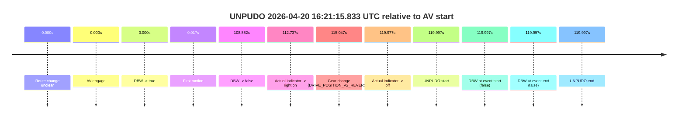
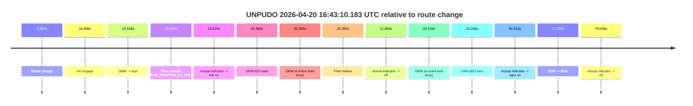

# Run Report: fme10011/2026-04-20--15-59-30--gen2-av-d1704755-7ef1-4aa6-9913-01cbad087acb

| Field | Value |
|---|---|
| Run ID | `fme10011/2026-04-20--15-59-30--gen2-av-d1704755-7ef1-4aa6-9913-01cbad087acb` |
| Date | `2026-04-20` |
| Model(s) | `eel-teal-outspoken` |
| Author | `zak` |
| Event count | `2` |

## unpudo 2026-04-20 16:21:15.833 UTC

| Field | Value |
|---|---|
| Model | `eel-teal-outspoken` |
| Author | `zak` |
| Run ID | `fme10011/2026-04-20--15-59-30--gen2-av-d1704755-7ef1-4aa6-9913-01cbad087acb` |
| Date | `2026-04-20` |
| Time (UTC) | `16:21:15.833` |
| Event type | `unpudo` |
| Disengagement type | `none observed` |
| Route change | `unclear` |
| Console | [run](https://console.sso.wayve.ai/run/fme10011/2026-04-20--15-59-30--gen2-av-d1704755-7ef1-4aa6-9913-01cbad087acb?id=&time-unixus=1776702075833316) |
| Foxglove | [segment](https://app.foxglove.dev/wayve-on-prem/p/prj_0dX18KZdVHg1fmmI/view?ds=foxglove-stream&ds.deviceName=fme10011&ds.start=2026-04-20T16%3A19%3A05.835899Z&ds.end=2026-04-20T16%3A21%3A25.833316Z&layoutId=lay_0e7VD4WIKDQGU73Y&time=2026-04-20T16%3A21%3A15.833316Z) |

### Event card: fail

- Fail: the credited unpudo does not stay AV-owned. The event window starts with DBW false, and the maneuver outcome lands outside a clean AV-owned segment.

| Event | Time (UTC) | Delta from AV start |
|---|---:|---:|
| Route change unclear | 2026-04-20 16:19:15.835 | `0.000s` |
| AV engage | 2026-04-20 16:19:15.835 | `0.000s` |
| DBW -> true | 2026-04-20 16:19:15.835 | `0.000s` |
| First motion | 2026-04-20 16:19:15.853 | `0.017s` |
| DBW -> false | 2026-04-20 16:21:04.717 | `108.882s` |
| Actual indicator -> right on | 2026-04-20 16:21:08.572 | `112.737s` |
| Gear change (DRIVE_POSITION_V2_REVERSE) | 2026-04-20 16:21:10.883 | `115.047s` |
| Actual indicator -> off | 2026-04-20 16:21:15.813 | `119.977s` |
| UNPUDO start | 2026-04-20 16:21:15.833 | `119.997s` |
| DBW at event start (false) | 2026-04-20 16:21:15.833 | `119.997s` |
| DBW at event end (false) | 2026-04-20 16:21:15.833 | `119.997s` |
| UNPUDO end | 2026-04-20 16:21:15.833 | `119.997s` |

| Metric | Value |
|---|---|
| Outcome | `fail` |
| Effective failure type | `not_av_owned` |
| Route change status | `unclear` |
| DBW at event start | `false` |
| DBW at event end | `false` |
| Predicted gear at AV start | `DRIVE_POSITION_V2_DRIVE` |
| Actual gear at AV start | `DRIVE_POSITION_V2_DRIVE` |
| Predicted gear at event start | `DRIVE_POSITION_V2_REVERSE` |
| Actual gear at event start | `DRIVE_POSITION_V2_REVERSE` |
| Planned indicator direction | `INDICATORS_STATE_V2_OFF` |
| Controller indicator direction | `INDICATORS_STATE_V2_OFF` |
| Actual indicator direction | `INDICATORS_STATE_V2_OFF` |
| Actual indicator at maneuver end | `INDICATORS_STATE_V2_OFF` |
| Driver accel help in AV | `false` |
| Driver accel help timestamp | `n/a` |
| Max accel pedal pct in AV | `0.0%` |
| Max brake pedal pct in AV | `29.2%` |
| Max speed mps in AV | `6.719` |
| Success timing baseline | `AV start` |
| Route -> AV | `n/a` |
| AV -> event start | `119.997s` |
| AV -> first motion | `0.017s` |
| Success baseline -> event start | `119.997s` |
| Success baseline -> first motion | `0.017s` |
| AV duration before disengagement | `108.882s` |
| Trajectory waypoint count | `37` |
| Driving-plan step count | `11` |

The scored portion starts from the AV-owned window, not from the pre-AV setup. Route-change search in the stopped pre-event segment was `unclear`, with the baseline therefore set to AV start. At the event anchor the model predicts `DRIVE_POSITION_V2_REVERSE` and the actual gear is `DRIVE_POSITION_V2_REVERSE`. The effective model outcome is `fail` because `not_av_owned.`

### Resolution

| Field | Value |
|---|---|
| Final outcome | `fail` |
| Do we agree with this label? | `yes` |
| Source disengagement type | `none observed` |
| Resolved effective failure type | `not_av_owned` |
| Confidence | `medium` |

## unpudo 2026-04-20 16:43:10.183 UTC

| Field | Value |
|---|---|
| Model | `eel-teal-outspoken` |
| Author | `zak` |
| Run ID | `fme10011/2026-04-20--15-59-30--gen2-av-d1704755-7ef1-4aa6-9913-01cbad087acb` |
| Date | `2026-04-20` |
| Time (UTC) | `16:43:10.183` |
| Event type | `unpudo` |
| Disengagement type | `none observed` |
| Route change | `found` |
| Console | [run](https://console.sso.wayve.ai/run/fme10011/2026-04-20--15-59-30--gen2-av-d1704755-7ef1-4aa6-9913-01cbad087acb?id=&time-unixus=1776703390183306) |
| Foxglove | [segment](https://app.foxglove.dev/wayve-on-prem/p/prj_0dX18KZdVHg1fmmI/view?ds=foxglove-stream&ds.deviceName=fme10011&ds.start=2026-04-20T16%3A42%3A39.818252Z&ds.end=2026-04-20T16%3A44%3A11.037888Z&layoutId=lay_0e7VD4WIKDQGU73Y&time=2026-04-20T16%3A43%3A10.183306Z) |

### Event card: pass

- Pass: AV owns the credited unpudo from route change through the official unpudo window, the gear state is aligned at the anchor, and the vehicle moves without driver accelerator help in AV.

| Event | Time (UTC) | Delta from route change |
|---|---:|---:|
| Route change | 2026-04-20 16:42:49.818 | `0.000s` |
| AV engage | 2026-04-20 16:43:06.256 | `16.438s` |
| DBW -> true | 2026-04-20 16:43:06.256 | `16.438s` |
| Gear change (DRIVE_POSITION_V2_DRIVE) | 2026-04-20 16:43:06.633 | `16.815s` |
| Actual indicator -> left on | 2026-04-20 16:43:09.332 | `19.515s` |
| UNPUDO start | 2026-04-20 16:43:10.183 | `20.365s` |
| DBW at event start (true) | 2026-04-20 16:43:10.183 | `20.365s` |
| First motion | 2026-04-20 16:43:10.213 | `20.395s` |
| Actual indicator -> off | 2026-04-20 16:43:11.672 | `21.855s` |
| DBW at event end (true) | 2026-04-20 16:43:13.983 | `24.165s` |
| UNPUDO end | 2026-04-20 16:43:13.983 | `24.165s` |
| Actual indicator -> right on | 2026-04-20 16:43:55.732 | `65.915s` |
| DBW -> false | 2026-04-20 16:44:01.037 | `71.220s` |
| Actual indicator -> off | 2026-04-20 16:44:08.853 | `79.036s` |

| Metric | Value |
|---|---|
| Outcome | `pass` |
| Effective failure type | `none` |
| Route change status | `found` |
| DBW at event start | `true` |
| DBW at event end | `true` |
| Predicted gear at AV start | `DRIVE_POSITION_V2_DRIVE` |
| Actual gear at AV start | `DRIVE_POSITION_V2_PARK` |
| Predicted gear at event start | `DRIVE_POSITION_V2_DRIVE` |
| Actual gear at event start | `DRIVE_POSITION_V2_DRIVE` |
| Planned indicator direction | `INDICATORS_STATE_V2_LEFT_ON` |
| Controller indicator direction | `INDICATORS_STATE_V2_LEFT_ON` |
| Actual indicator direction | `INDICATORS_STATE_V2_LEFT_ON` |
| Actual indicator at maneuver end | `INDICATORS_STATE_V2_OFF` |
| Driver accel help in AV | `false` |
| Driver accel help timestamp | `n/a` |
| Max accel pedal pct in AV | `0.0%` |
| Max brake pedal pct in AV | `8.0%` |
| Max speed mps in AV | `4.292` |
| Success timing baseline | `route change` |
| Route -> AV | `16.438s` |
| AV -> event start | `3.927s` |
| AV -> first motion | `3.956s` |
| Success baseline -> event start | `20.365s` |
| Success baseline -> first motion | `20.395s` |
| AV duration before disengagement | `54.781s` |
| Trajectory waypoint count | `36` |
| Driving-plan step count | `11` |

The scored portion starts from the AV-owned window, not from the pre-AV setup. Route-change search in the stopped pre-event segment was `found`, with the baseline therefore set to route change. At the event anchor the model predicts `DRIVE_POSITION_V2_DRIVE` and the actual gear is `DRIVE_POSITION_V2_DRIVE`. The effective model outcome is `pass` because `the credited unpudo stays AV-owned through the official unpudo window.`

### Resolution

| Field | Value |
|---|---|
| Final outcome | `pass` |
| Do we agree with this label? | `yes` |
| Source disengagement type | `none observed` |
| Resolved effective failure type | `none` |
| Confidence | `high` |
