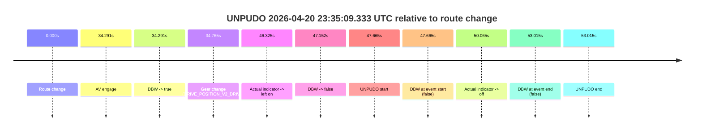
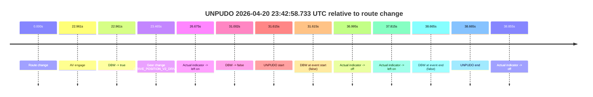
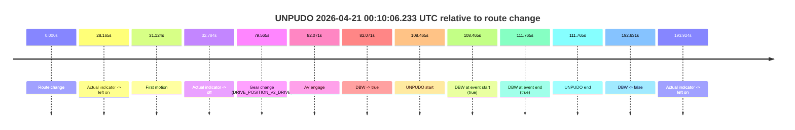

# Run Report: fme10011/2026-04-20--22-18-52--gen2-av-bac8f62f-b45e-47ee-bf04-6ab5482424a3

| Field | Value |
|---|---|
| Run ID | `fme10011/2026-04-20--22-18-52--gen2-av-bac8f62f-b45e-47ee-bf04-6ab5482424a3` |
| Date | `2026-04-20` |
| Model(s) | `pink-manta-ray-smooth` |
| Author | `guy.geva` |
| Event count | `3` |

## unpudo 2026-04-20 23:35:09.333 UTC

| Field | Value |
|---|---|
| Model | `pink-manta-ray-smooth` |
| Author | `guy.geva` |
| Run ID | `fme10011/2026-04-20--22-18-52--gen2-av-bac8f62f-b45e-47ee-bf04-6ab5482424a3` |
| Date | `2026-04-20` |
| Time (UTC) | `23:35:09.333` |
| Event type | `unpudo` |
| Disengagement type | `none observed` |
| Route change | `found` |
| Console | [run](https://console.sso.wayve.ai/run/fme10011/2026-04-20--22-18-52--gen2-av-bac8f62f-b45e-47ee-bf04-6ab5482424a3?id=&time-unixus=1776728109333292) |
| Foxglove | [segment](https://app.foxglove.dev/wayve-on-prem/p/prj_0dX18KZdVHg1fmmI/view?ds=foxglove-stream&ds.deviceName=fme10011&ds.start=2026-04-20T23%3A34%3A11.668249Z&ds.end=2026-04-20T23%3A35%3A24.683302Z&layoutId=lay_0e7VD4WIKDQGU73Y&time=2026-04-20T23%3A35%3A09.333292Z) |

### Event card: fail

- Fail: the credited unpudo does not stay AV-owned. The event window starts with DBW false, and the maneuver outcome lands outside a clean AV-owned segment.

| Event | Time (UTC) | Delta from route change |
|---|---:|---:|
| Route change | 2026-04-20 23:34:21.668 | `0.000s` |
| AV engage | 2026-04-20 23:34:55.959 | `34.291s` |
| DBW -> true | 2026-04-20 23:34:55.959 | `34.291s` |
| Gear change (DRIVE_POSITION_V2_DRIVE) | 2026-04-20 23:34:56.433 | `34.765s` |
| Actual indicator -> left on | 2026-04-20 23:35:07.992 | `46.325s` |
| DBW -> false | 2026-04-20 23:35:08.820 | `47.152s` |
| UNPUDO start | 2026-04-20 23:35:09.333 | `47.665s` |
| DBW at event start (false) | 2026-04-20 23:35:09.333 | `47.665s` |
| Actual indicator -> off | 2026-04-20 23:35:11.732 | `50.065s` |
| DBW at event end (false) | 2026-04-20 23:35:14.683 | `53.015s` |
| UNPUDO end | 2026-04-20 23:35:14.683 | `53.015s` |

| Metric | Value |
|---|---|
| Outcome | `fail` |
| Effective failure type | `not_av_owned` |
| Route change status | `found` |
| DBW at event start | `false` |
| DBW at event end | `false` |
| Predicted gear at AV start | `DRIVE_POSITION_V2_DRIVE` |
| Actual gear at AV start | `DRIVE_POSITION_V2_PARK` |
| Predicted gear at event start | `DRIVE_POSITION_V2_DRIVE` |
| Actual gear at event start | `DRIVE_POSITION_V2_DRIVE` |
| Planned indicator direction | `INDICATORS_STATE_V2_LEFT_ON` |
| Controller indicator direction | `INDICATORS_STATE_V2_LEFT_ON` |
| Actual indicator direction | `INDICATORS_STATE_V2_LEFT_ON` |
| Actual indicator at maneuver end | `INDICATORS_STATE_V2_OFF` |
| Driver accel help in AV | `false` |
| Driver accel help timestamp | `n/a` |
| Max accel pedal pct in AV | `0.0%` |
| Max brake pedal pct in AV | `8.1%` |
| Max speed mps in AV | `0.000` |
| Success timing baseline | `route change` |
| Route -> AV | `34.291s` |
| AV -> event start | `13.374s` |
| AV -> first motion | `n/a` |
| Success baseline -> event start | `47.665s` |
| Success baseline -> first motion | `n/a` |
| AV duration before disengagement | `12.861s` |
| Trajectory waypoint count | `36` |
| Driving-plan step count | `11` |

The scored portion starts from the AV-owned window, not from the pre-AV setup. Route-change search in the stopped pre-event segment was `found`, with the baseline therefore set to route change. At the event anchor the model predicts `DRIVE_POSITION_V2_DRIVE` and the actual gear is `DRIVE_POSITION_V2_DRIVE`. The effective model outcome is `fail` because `not_av_owned.`

### Resolution

| Field | Value |
|---|---|
| Final outcome | `fail` |
| Do we agree with this label? | `yes` |
| Source disengagement type | `none observed` |
| Resolved effective failure type | `not_av_owned` |
| Confidence | `high` |

## unpudo 2026-04-20 23:42:58.733 UTC

| Field | Value |
|---|---|
| Model | `pink-manta-ray-smooth` |
| Author | `guy.geva` |
| Run ID | `fme10011/2026-04-20--22-18-52--gen2-av-bac8f62f-b45e-47ee-bf04-6ab5482424a3` |
| Date | `2026-04-20` |
| Time (UTC) | `23:42:58.733` |
| Event type | `unpudo` |
| Disengagement type | `none observed` |
| Route change | `found` |
| Console | [run](https://console.sso.wayve.ai/run/fme10011/2026-04-20--22-18-52--gen2-av-bac8f62f-b45e-47ee-bf04-6ab5482424a3?id=&time-unixus=1776728578733318) |
| Foxglove | [segment](https://app.foxglove.dev/wayve-on-prem/p/prj_0dX18KZdVHg1fmmI/view?ds=foxglove-stream&ds.deviceName=fme10011&ds.start=2026-04-20T23%3A42%3A17.118263Z&ds.end=2026-04-20T23%3A43%3A15.783324Z&layoutId=lay_0e7VD4WIKDQGU73Y&time=2026-04-20T23%3A42%3A58.733318Z) |

### Event card: fail

- Fail: the credited unpudo does not stay AV-owned. The event window starts with DBW false, and the maneuver outcome lands outside a clean AV-owned segment.

| Event | Time (UTC) | Delta from route change |
|---|---:|---:|
| Route change | 2026-04-20 23:42:27.118 | `0.000s` |
| AV engage | 2026-04-20 23:42:50.079 | `22.961s` |
| DBW -> true | 2026-04-20 23:42:50.079 | `22.961s` |
| Gear change (DRIVE_POSITION_V2_DRIVE) | 2026-04-20 23:42:50.583 | `23.465s` |
| Actual indicator -> left on | 2026-04-20 23:42:53.793 | `26.675s` |
| DBW -> false | 2026-04-20 23:42:58.119 | `31.002s` |
| UNPUDO start | 2026-04-20 23:42:58.733 | `31.615s` |
| DBW at event start (false) | 2026-04-20 23:42:58.733 | `31.615s` |
| Actual indicator -> off | 2026-04-20 23:43:04.113 | `36.995s` |
| Actual indicator -> left on | 2026-04-20 23:43:04.933 | `37.815s` |
| DBW at event end (false) | 2026-04-20 23:43:05.783 | `38.665s` |
| UNPUDO end | 2026-04-20 23:43:05.783 | `38.665s` |
| Actual indicator -> off | 2026-04-20 23:43:05.972 | `38.855s` |

| Metric | Value |
|---|---|
| Outcome | `fail` |
| Effective failure type | `not_av_owned` |
| Route change status | `found` |
| DBW at event start | `false` |
| DBW at event end | `false` |
| Predicted gear at AV start | `DRIVE_POSITION_V2_DRIVE` |
| Actual gear at AV start | `DRIVE_POSITION_V2_PARK` |
| Predicted gear at event start | `DRIVE_POSITION_V2_DRIVE` |
| Actual gear at event start | `DRIVE_POSITION_V2_DRIVE` |
| Planned indicator direction | `INDICATORS_STATE_V2_LEFT_ON` |
| Controller indicator direction | `INDICATORS_STATE_V2_LEFT_ON` |
| Actual indicator direction | `INDICATORS_STATE_V2_LEFT_ON` |
| Actual indicator at maneuver end | `INDICATORS_STATE_V2_LEFT_ON` |
| Driver accel help in AV | `false` |
| Driver accel help timestamp | `n/a` |
| Max accel pedal pct in AV | `0.0%` |
| Max brake pedal pct in AV | `8.0%` |
| Max speed mps in AV | `0.000` |
| Success timing baseline | `route change` |
| Route -> AV | `22.961s` |
| AV -> event start | `8.654s` |
| AV -> first motion | `n/a` |
| Success baseline -> event start | `31.615s` |
| Success baseline -> first motion | `n/a` |
| AV duration before disengagement | `8.040s` |
| Trajectory waypoint count | `38` |
| Driving-plan step count | `11` |

The scored portion starts from the AV-owned window, not from the pre-AV setup. Route-change search in the stopped pre-event segment was `found`, with the baseline therefore set to route change. At the event anchor the model predicts `DRIVE_POSITION_V2_DRIVE` and the actual gear is `DRIVE_POSITION_V2_DRIVE`. The effective model outcome is `fail` because `not_av_owned.`

### Resolution

| Field | Value |
|---|---|
| Final outcome | `fail` |
| Do we agree with this label? | `yes` |
| Source disengagement type | `none observed` |
| Resolved effective failure type | `not_av_owned` |
| Confidence | `high` |

## unpudo 2026-04-21 00:10:06.233 UTC

| Field | Value |
|---|---|
| Model | `pink-manta-ray-smooth` |
| Author | `guy.geva` |
| Run ID | `fme10011/2026-04-20--22-18-52--gen2-av-bac8f62f-b45e-47ee-bf04-6ab5482424a3` |
| Date | `2026-04-20` |
| Time (UTC) | `00:10:06.233` |
| Event type | `unpudo` |
| Disengagement type | `none observed` |
| Route change | `found` |
| Console | [run](https://console.sso.wayve.ai/run/fme10011/2026-04-20--22-18-52--gen2-av-bac8f62f-b45e-47ee-bf04-6ab5482424a3?id=&time-unixus=1776730206233297) |
| Foxglove | [segment](https://app.foxglove.dev/wayve-on-prem/p/prj_0dX18KZdVHg1fmmI/view?ds=foxglove-stream&ds.deviceName=fme10011&ds.start=2026-04-21T00%3A08%3A07.768544Z&ds.end=2026-04-21T00%3A11%3A40.399320Z&layoutId=lay_0e7VD4WIKDQGU73Y&time=2026-04-21T00%3A10%3A06.233297Z) |

### Event card: pass

- Pass: AV owns the credited unpudo from route change through the official unpudo window, the gear state is aligned at the anchor, and the vehicle moves without driver accelerator help in AV.

| Event | Time (UTC) | Delta from route change |
|---|---:|---:|
| Route change | 2026-04-21 00:08:17.768 | `0.000s` |
| Actual indicator -> left on | 2026-04-21 00:08:45.933 | `28.165s` |
| First motion | 2026-04-21 00:08:48.892 | `31.124s` |
| Actual indicator -> off | 2026-04-21 00:08:50.552 | `32.784s` |
| Gear change (DRIVE_POSITION_V2_DRIVE) | 2026-04-21 00:09:37.333 | `79.565s` |
| AV engage | 2026-04-21 00:09:39.839 | `82.071s` |
| DBW -> true | 2026-04-21 00:09:39.839 | `82.071s` |
| UNPUDO start | 2026-04-21 00:10:06.233 | `108.465s` |
| DBW at event start (true) | 2026-04-21 00:10:06.233 | `108.465s` |
| DBW at event end (true) | 2026-04-21 00:10:09.533 | `111.765s` |
| UNPUDO end | 2026-04-21 00:10:09.533 | `111.765s` |
| DBW -> false | 2026-04-21 00:11:30.399 | `192.631s` |
| Actual indicator -> left on | 2026-04-21 00:11:31.692 | `193.924s` |

| Metric | Value |
|---|---|
| Outcome | `pass` |
| Effective failure type | `none` |
| Route change status | `found` |
| DBW at event start | `true` |
| DBW at event end | `true` |
| Predicted gear at AV start | `DRIVE_POSITION_V2_DRIVE` |
| Actual gear at AV start | `DRIVE_POSITION_V2_DRIVE` |
| Predicted gear at event start | `DRIVE_POSITION_V2_DRIVE` |
| Actual gear at event start | `DRIVE_POSITION_V2_DRIVE` |
| Planned indicator direction | `INDICATORS_STATE_V2_OFF` |
| Controller indicator direction | `INDICATORS_STATE_V2_OFF` |
| Actual indicator direction | `INDICATORS_STATE_V2_OFF` |
| Actual indicator at maneuver end | `INDICATORS_STATE_V2_OFF` |
| Driver accel help in AV | `false` |
| Driver accel help timestamp | `n/a` |
| Max accel pedal pct in AV | `0.0%` |
| Max brake pedal pct in AV | `13.4%` |
| Max speed mps in AV | `5.497` |
| Success timing baseline | `route change` |
| Route -> AV | `82.071s` |
| AV -> event start | `26.393s` |
| AV -> first motion | `-50.947s` |
| Success baseline -> event start | `108.465s` |
| Success baseline -> first motion | `31.124s` |
| AV duration before disengagement | `110.560s` |
| Trajectory waypoint count | `36` |
| Driving-plan step count | `11` |

The scored portion starts from the AV-owned window, not from the pre-AV setup. Route-change search in the stopped pre-event segment was `found`, with the baseline therefore set to route change. At the event anchor the model predicts `DRIVE_POSITION_V2_DRIVE` and the actual gear is `DRIVE_POSITION_V2_DRIVE`. The effective model outcome is `pass` because `the credited unpudo stays AV-owned through the official unpudo window.`

### Resolution

| Field | Value |
|---|---|
| Final outcome | `pass` |
| Do we agree with this label? | `yes` |
| Source disengagement type | `none observed` |
| Resolved effective failure type | `none` |
| Confidence | `high` |
