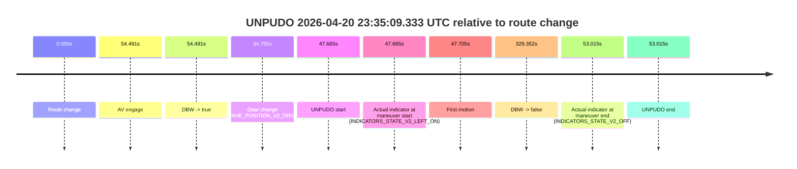
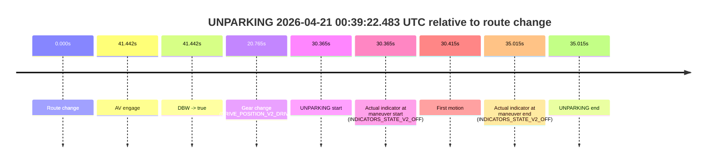

# Run Report: fme10011/2026-04-20--22-18-52--gen2-av-bac8f62f-b45e-47ee-bf04-6ab5482424a3

| Field | Value |
|---|---|
| Run ID | `fme10011/2026-04-20--22-18-52--gen2-av-bac8f62f-b45e-47ee-bf04-6ab5482424a3` |
| Date | `2026-04-20` |
| Model(s) | `pink-manta-ray-smooth` |
| Author | `guy.geva` |
| Event count | `6` |

## unpudo 2026-04-20 22:23:22.683 UTC

| Field | Value |
|---|---|
| Model | `pink-manta-ray-smooth` |
| Author | `guy.geva` |
| Run ID | `fme10011/2026-04-20--22-18-52--gen2-av-bac8f62f-b45e-47ee-bf04-6ab5482424a3` |
| Date | `2026-04-20` |
| Time (UTC) | `22:23:22.683` |
| Event type | `unpudo` |
| Disengagement type | `none observed` |
| Route change | `found` |
| Console | [run](https://console.sso.wayve.ai/run/fme10011/2026-04-20--22-18-52--gen2-av-bac8f62f-b45e-47ee-bf04-6ab5482424a3?id=&time-unixus=1776723802683295) |
| Foxglove | [segment](https://app.foxglove.dev/wayve-on-prem/p/prj_0dX18KZdVHg1fmmI/view?ds=foxglove-stream&ds.deviceName=fme10011&ds.start=2026-04-20T22%3A21%3A49.418347Z&ds.end=2026-04-20T22%3A25%3A49.280647Z&layoutId=lay_0e7VD4WIKDQGU73Y&time=2026-04-20T22%3A23%3A22.683295Z) |

### Event card: non-av

- Non-AV: there is no AV-owned portion anywhere inside the detected unpudo timeline, so it is kept for coverage but excluded from model success / failure scoring.

| Event | Time (UTC) | Delta from route change |
|---|---:|---:|
| Route change | 2026-04-20 22:21:59.418 | `0.000s` |
| AV engage | 2026-04-20 22:24:09.899 | `130.481s` |
| DBW -> true | 2026-04-20 22:24:09.899 | `130.481s` |
| Gear change (DRIVE_POSITION_V2_REVERSE) | 2026-04-20 22:23:18.633 | `79.215s` |
| UNPUDO start | 2026-04-20 22:23:22.683 | `83.265s` |
| Actual indicator at maneuver start (INDICATORS_STATE_V2_OFF) | 2026-04-20 22:23:22.683 | `83.265s` |
| First motion | 2026-04-20 22:24:02.973 | `123.555s` |
| DBW -> false | 2026-04-20 22:25:39.280 | `219.862s` |
| Actual indicator at maneuver end (INDICATORS_STATE_V2_OFF) | 2026-04-20 22:24:06.483 | `127.065s` |
| UNPUDO end | 2026-04-20 22:24:06.483 | `127.065s` |

| Metric | Value |
|---|---|
| Outcome | `non-av` |
| Effective failure type | `none` |
| Route change status | `found` |
| DBW at event start | `false` |
| DBW at event end | `false` |
| Predicted gear at AV start | `DRIVE_POSITION_V2_DRIVE` |
| Actual gear at AV start | `DRIVE_POSITION_V2_DRIVE` |
| Predicted gear at event start | `DRIVE_POSITION_V2_REVERSE` |
| Actual gear at event start | `DRIVE_POSITION_V2_REVERSE` |
| Planned indicator direction | `INDICATORS_STATE_V2_OFF` |
| Controller indicator direction | `INDICATORS_STATE_V2_OFF` |
| Actual indicator direction | `INDICATORS_STATE_V2_OFF` |
| Actual indicator at maneuver end | `INDICATORS_STATE_V2_OFF` |
| Driver accel help in AV | `false` |
| Driver accel help timestamp | `n/a` |
| Max accel pedal pct in AV | `0.0%` |
| Max brake pedal pct in AV | `0.0%` |
| Max speed mps in AV | `0.000` |
| Route -> AV | `130.481s` |
| AV -> event start | `-47.216s` |
| AV -> first motion | `-6.926s` |
| AV duration before disengagement | `89.381s` |
| Trajectory waypoint count | `37` |
| Driving-plan step count | `11` |

The scored portion starts from the AV-owned window, not from the pre-AV setup. Route-change search in the stopped pre-event segment was `found`, with the baseline therefore set to route change. At the event anchor the model predicts `DRIVE_POSITION_V2_REVERSE` and the actual gear is `DRIVE_POSITION_V2_REVERSE`. The effective model outcome is `non-av` because `there is no AV-owned overlap inside the event timeline`.

### Resolution

| Field | Value |
|---|---|
| Final outcome | `non-av` |
| Do we agree with this label? | `yes` |
| Source disengagement type | `none observed` |
| Resolved effective failure type | `none` |
| Confidence | `high` |

## unpudo 2026-04-20 23:35:09.333 UTC

| Field | Value |
|---|---|
| Model | `pink-manta-ray-smooth` |
| Author | `guy.geva` |
| Run ID | `fme10011/2026-04-20--22-18-52--gen2-av-bac8f62f-b45e-47ee-bf04-6ab5482424a3` |
| Date | `2026-04-20` |
| Time (UTC) | `23:35:09.333` |
| Event type | `unpudo` |
| Disengagement type | `none observed` |
| Route change | `found` |
| Console | [run](https://console.sso.wayve.ai/run/fme10011/2026-04-20--22-18-52--gen2-av-bac8f62f-b45e-47ee-bf04-6ab5482424a3?id=&time-unixus=1776728109333292) |
| Foxglove | [segment](https://app.foxglove.dev/wayve-on-prem/p/prj_0dX18KZdVHg1fmmI/view?ds=foxglove-stream&ds.deviceName=fme10011&ds.start=2026-04-20T23%3A34%3A11.668249Z&ds.end=2026-04-20T23%3A40%3A01.020553Z&layoutId=lay_0e7VD4WIKDQGU73Y&time=2026-04-20T23%3A35%3A09.333292Z) |

### Event card: non-av

- Non-AV: there is no AV-owned portion anywhere inside the detected unpudo timeline, so it is kept for coverage but excluded from model success / failure scoring.

| Event | Time (UTC) | Delta from route change |
|---|---:|---:|
| Route change | 2026-04-20 23:34:21.668 | `0.000s` |
| AV engage | 2026-04-20 23:35:16.159 | `54.491s` |
| DBW -> true | 2026-04-20 23:35:16.159 | `54.491s` |
| Gear change (DRIVE_POSITION_V2_DRIVE) | 2026-04-20 23:34:56.433 | `34.765s` |
| UNPUDO start | 2026-04-20 23:35:09.333 | `47.665s` |
| Actual indicator at maneuver start (INDICATORS_STATE_V2_LEFT_ON) | 2026-04-20 23:35:09.333 | `47.665s` |
| First motion | 2026-04-20 23:35:09.372 | `47.705s` |
| DBW -> false | 2026-04-20 23:39:51.020 | `329.352s` |
| Actual indicator at maneuver end (INDICATORS_STATE_V2_OFF) | 2026-04-20 23:35:14.683 | `53.015s` |
| UNPUDO end | 2026-04-20 23:35:14.683 | `53.015s` |

| Metric | Value |
|---|---|
| Outcome | `non-av` |
| Effective failure type | `none` |
| Route change status | `found` |
| DBW at event start | `false` |
| DBW at event end | `false` |
| Predicted gear at AV start | `DRIVE_POSITION_V2_DRIVE` |
| Actual gear at AV start | `DRIVE_POSITION_V2_DRIVE` |
| Predicted gear at event start | `DRIVE_POSITION_V2_DRIVE` |
| Actual gear at event start | `DRIVE_POSITION_V2_DRIVE` |
| Planned indicator direction | `INDICATORS_STATE_V2_LEFT_ON` |
| Controller indicator direction | `INDICATORS_STATE_V2_LEFT_ON` |
| Actual indicator direction | `INDICATORS_STATE_V2_LEFT_ON` |
| Actual indicator at maneuver end | `INDICATORS_STATE_V2_OFF` |
| Driver accel help in AV | `false` |
| Driver accel help timestamp | `n/a` |
| Max accel pedal pct in AV | `0.0%` |
| Max brake pedal pct in AV | `0.0%` |
| Max speed mps in AV | `0.000` |
| Route -> AV | `54.491s` |
| AV -> event start | `-6.826s` |
| AV -> first motion | `-6.786s` |
| AV duration before disengagement | `274.861s` |
| Trajectory waypoint count | `36` |
| Driving-plan step count | `11` |

The scored portion starts from the AV-owned window, not from the pre-AV setup. Route-change search in the stopped pre-event segment was `found`, with the baseline therefore set to route change. At the event anchor the model predicts `DRIVE_POSITION_V2_DRIVE` and the actual gear is `DRIVE_POSITION_V2_DRIVE`. The effective model outcome is `non-av` because `there is no AV-owned overlap inside the event timeline`.

### Resolution

| Field | Value |
|---|---|
| Final outcome | `non-av` |
| Do we agree with this label? | `yes` |
| Source disengagement type | `none observed` |
| Resolved effective failure type | `none` |
| Confidence | `high` |

## unpudo 2026-04-20 23:42:58.733 UTC

| Field | Value |
|---|---|
| Model | `pink-manta-ray-smooth` |
| Author | `guy.geva` |
| Run ID | `fme10011/2026-04-20--22-18-52--gen2-av-bac8f62f-b45e-47ee-bf04-6ab5482424a3` |
| Date | `2026-04-20` |
| Time (UTC) | `23:42:58.733` |
| Event type | `unpudo` |
| Disengagement type | `none observed` |
| Route change | `found` |
| Console | [run](https://console.sso.wayve.ai/run/fme10011/2026-04-20--22-18-52--gen2-av-bac8f62f-b45e-47ee-bf04-6ab5482424a3?id=&time-unixus=1776728578733318) |
| Foxglove | [segment](https://app.foxglove.dev/wayve-on-prem/p/prj_0dX18KZdVHg1fmmI/view?ds=foxglove-stream&ds.deviceName=fme10011&ds.start=2026-04-20T23%3A42%3A17.118263Z&ds.end=2026-04-20T23%3A49%3A38.939411Z&layoutId=lay_0e7VD4WIKDQGU73Y&time=2026-04-20T23%3A42%3A58.733318Z) |

### Event card: non-av

- Non-AV: there is no AV-owned portion anywhere inside the detected unpudo timeline, so it is kept for coverage but excluded from model success / failure scoring.

| Event | Time (UTC) | Delta from route change |
|---|---:|---:|
| Route change | 2026-04-20 23:42:27.118 | `0.000s` |
| AV engage | 2026-04-20 23:43:10.180 | `43.062s` |
| DBW -> true | 2026-04-20 23:43:10.180 | `43.062s` |
| Gear change (DRIVE_POSITION_V2_DRIVE) | 2026-04-20 23:42:50.583 | `23.465s` |
| UNPUDO start | 2026-04-20 23:42:58.733 | `31.615s` |
| Actual indicator at maneuver start (INDICATORS_STATE_V2_LEFT_ON) | 2026-04-20 23:42:58.733 | `31.615s` |
| First motion | 2026-04-20 23:42:58.752 | `31.635s` |
| DBW -> false | 2026-04-20 23:49:28.939 | `421.821s` |
| Actual indicator at maneuver end (INDICATORS_STATE_V2_LEFT_ON) | 2026-04-20 23:43:05.783 | `38.665s` |
| UNPUDO end | 2026-04-20 23:43:05.783 | `38.665s` |

| Metric | Value |
|---|---|
| Outcome | `non-av` |
| Effective failure type | `none` |
| Route change status | `found` |
| DBW at event start | `false` |
| DBW at event end | `false` |
| Predicted gear at AV start | `DRIVE_POSITION_V2_DRIVE` |
| Actual gear at AV start | `DRIVE_POSITION_V2_DRIVE` |
| Predicted gear at event start | `DRIVE_POSITION_V2_DRIVE` |
| Actual gear at event start | `DRIVE_POSITION_V2_DRIVE` |
| Planned indicator direction | `INDICATORS_STATE_V2_LEFT_ON` |
| Controller indicator direction | `INDICATORS_STATE_V2_LEFT_ON` |
| Actual indicator direction | `INDICATORS_STATE_V2_LEFT_ON` |
| Actual indicator at maneuver end | `INDICATORS_STATE_V2_LEFT_ON` |
| Driver accel help in AV | `false` |
| Driver accel help timestamp | `n/a` |
| Max accel pedal pct in AV | `0.0%` |
| Max brake pedal pct in AV | `0.0%` |
| Max speed mps in AV | `0.000` |
| Route -> AV | `43.062s` |
| AV -> event start | `-11.447s` |
| AV -> first motion | `-11.428s` |
| AV duration before disengagement | `378.759s` |
| Trajectory waypoint count | `38` |
| Driving-plan step count | `11` |

The scored portion starts from the AV-owned window, not from the pre-AV setup. Route-change search in the stopped pre-event segment was `found`, with the baseline therefore set to route change. At the event anchor the model predicts `DRIVE_POSITION_V2_DRIVE` and the actual gear is `DRIVE_POSITION_V2_DRIVE`. The effective model outcome is `non-av` because `there is no AV-owned overlap inside the event timeline`.

### Resolution

| Field | Value |
|---|---|
| Final outcome | `non-av` |
| Do we agree with this label? | `yes` |
| Source disengagement type | `none observed` |
| Resolved effective failure type | `none` |
| Confidence | `high` |

## unpudo 2026-04-20 23:52:37.783 UTC

| Field | Value |
|---|---|
| Model | `pink-manta-ray-smooth` |
| Author | `guy.geva` |
| Run ID | `fme10011/2026-04-20--22-18-52--gen2-av-bac8f62f-b45e-47ee-bf04-6ab5482424a3` |
| Date | `2026-04-20` |
| Time (UTC) | `23:52:37.783` |
| Event type | `unpudo` |
| Disengagement type | `none observed` |
| Route change | `found` |
| Console | [run](https://console.sso.wayve.ai/run/fme10011/2026-04-20--22-18-52--gen2-av-bac8f62f-b45e-47ee-bf04-6ab5482424a3?id=&time-unixus=1776729157783295) |
| Foxglove | [segment](https://app.foxglove.dev/wayve-on-prem/p/prj_0dX18KZdVHg1fmmI/view?ds=foxglove-stream&ds.deviceName=fme10011&ds.start=2026-04-20T23%3A51%3A46.918493Z&ds.end=2026-04-20T23%3A54%3A39.380224Z&layoutId=lay_0e7VD4WIKDQGU73Y&time=2026-04-20T23%3A52%3A37.783295Z) |

### Event card: non-av

- Non-AV: there is no AV-owned portion anywhere inside the detected unpudo timeline, so it is kept for coverage but excluded from model success / failure scoring.

| Event | Time (UTC) | Delta from route change |
|---|---:|---:|
| Route change | 2026-04-20 23:51:56.918 | `0.000s` |
| AV engage | 2026-04-20 23:53:33.539 | `96.621s` |
| DBW -> true | 2026-04-20 23:53:33.539 | `96.621s` |
| Gear change (DRIVE_POSITION_V2_DRIVE) | 2026-04-20 23:52:28.033 | `31.115s` |
| UNPUDO start | 2026-04-20 23:52:37.783 | `40.865s` |
| Actual indicator at maneuver start (INDICATORS_STATE_V2_LEFT_ON) | 2026-04-20 23:52:37.783 | `40.865s` |
| First motion | 2026-04-20 23:52:38.312 | `41.394s` |
| DBW -> false | 2026-04-20 23:54:29.380 | `152.462s` |
| Actual indicator at maneuver end (INDICATORS_STATE_V2_LEFT_ON) | 2026-04-20 23:53:24.883 | `87.965s` |
| UNPUDO end | 2026-04-20 23:53:24.883 | `87.965s` |

| Metric | Value |
|---|---|
| Outcome | `non-av` |
| Effective failure type | `none` |
| Route change status | `found` |
| DBW at event start | `false` |
| DBW at event end | `false` |
| Predicted gear at AV start | `DRIVE_POSITION_V2_DRIVE` |
| Actual gear at AV start | `DRIVE_POSITION_V2_DRIVE` |
| Predicted gear at event start | `DRIVE_POSITION_V2_DRIVE` |
| Actual gear at event start | `DRIVE_POSITION_V2_DRIVE` |
| Planned indicator direction | `INDICATORS_STATE_V2_LEFT_ON` |
| Controller indicator direction | `INDICATORS_STATE_V2_LEFT_ON` |
| Actual indicator direction | `INDICATORS_STATE_V2_LEFT_ON` |
| Actual indicator at maneuver end | `INDICATORS_STATE_V2_LEFT_ON` |
| Driver accel help in AV | `false` |
| Driver accel help timestamp | `n/a` |
| Max accel pedal pct in AV | `0.0%` |
| Max brake pedal pct in AV | `0.0%` |
| Max speed mps in AV | `0.000` |
| Route -> AV | `96.621s` |
| AV -> event start | `-55.756s` |
| AV -> first motion | `-55.226s` |
| AV duration before disengagement | `55.841s` |
| Trajectory waypoint count | `37` |
| Driving-plan step count | `11` |

The scored portion starts from the AV-owned window, not from the pre-AV setup. Route-change search in the stopped pre-event segment was `found`, with the baseline therefore set to route change. At the event anchor the model predicts `DRIVE_POSITION_V2_DRIVE` and the actual gear is `DRIVE_POSITION_V2_DRIVE`. The effective model outcome is `non-av` because `there is no AV-owned overlap inside the event timeline`.

### Resolution

| Field | Value |
|---|---|
| Final outcome | `non-av` |
| Do we agree with this label? | `yes` |
| Source disengagement type | `none observed` |
| Resolved effective failure type | `none` |
| Confidence | `high` |

## unpudo 2026-04-21 00:10:06.233 UTC

| Field | Value |
|---|---|
| Model | `pink-manta-ray-smooth` |
| Author | `guy.geva` |
| Run ID | `fme10011/2026-04-20--22-18-52--gen2-av-bac8f62f-b45e-47ee-bf04-6ab5482424a3` |
| Date | `2026-04-20` |
| Time (UTC) | `00:10:06.233` |
| Event type | `unpudo` |
| Disengagement type | `none observed` |
| Route change | `found` |
| Console | [run](https://console.sso.wayve.ai/run/fme10011/2026-04-20--22-18-52--gen2-av-bac8f62f-b45e-47ee-bf04-6ab5482424a3?id=&time-unixus=1776730206233297) |
| Foxglove | [segment](https://app.foxglove.dev/wayve-on-prem/p/prj_0dX18KZdVHg1fmmI/view?ds=foxglove-stream&ds.deviceName=fme10011&ds.start=2026-04-21T00%3A08%3A07.768544Z&ds.end=2026-04-21T00%3A11%3A40.399320Z&layoutId=lay_0e7VD4WIKDQGU73Y&time=2026-04-21T00%3A10%3A06.233297Z) |

### Event card: pass

- Pass: AV owns the credited unpudo through the official event window, the gear state is aligned at the anchor, and the vehicle moves without driver accelerator help in AV.

| Event | Time (UTC) | Delta from route change |
|---|---:|---:|
| Route change | 2026-04-21 00:08:17.768 | `0.000s` |
| AV engage | 2026-04-21 00:09:39.839 | `82.071s` |
| DBW -> true | 2026-04-21 00:09:39.839 | `82.071s` |
| Gear change (DRIVE_POSITION_V2_DRIVE) | 2026-04-21 00:09:37.333 | `79.565s` |
| UNPUDO start | 2026-04-21 00:10:06.233 | `108.465s` |
| Actual indicator at maneuver start (INDICATORS_STATE_V2_OFF) | 2026-04-21 00:10:06.233 | `108.465s` |
| First motion | 2026-04-21 00:10:06.293 | `108.524s` |
| DBW -> false | 2026-04-21 00:11:30.399 | `192.631s` |
| Actual indicator at maneuver end (INDICATORS_STATE_V2_OFF) | 2026-04-21 00:10:09.533 | `111.765s` |
| UNPUDO end | 2026-04-21 00:10:09.533 | `111.765s` |

| Metric | Value |
|---|---|
| Outcome | `pass` |
| Effective failure type | `none` |
| Route change status | `found` |
| DBW at event start | `true` |
| DBW at event end | `true` |
| Predicted gear at AV start | `DRIVE_POSITION_V2_DRIVE` |
| Actual gear at AV start | `DRIVE_POSITION_V2_DRIVE` |
| Predicted gear at event start | `DRIVE_POSITION_V2_DRIVE` |
| Actual gear at event start | `DRIVE_POSITION_V2_DRIVE` |
| Planned indicator direction | `INDICATORS_STATE_V2_OFF` |
| Controller indicator direction | `INDICATORS_STATE_V2_OFF` |
| Actual indicator direction | `INDICATORS_STATE_V2_OFF` |
| Actual indicator at maneuver end | `INDICATORS_STATE_V2_OFF` |
| Driver accel help in AV | `false` |
| Driver accel help timestamp | `n/a` |
| Max accel pedal pct in AV | `0.0%` |
| Max brake pedal pct in AV | `0.0%` |
| Max speed mps in AV | `5.497` |
| Route -> AV | `82.071s` |
| AV -> event start | `26.393s` |
| AV -> first motion | `26.453s` |
| AV duration before disengagement | `110.560s` |
| Trajectory waypoint count | `36` |
| Driving-plan step count | `11` |

The scored portion starts from the AV-owned window, not from the pre-AV setup. Route-change search in the stopped pre-event segment was `found`, with the baseline therefore set to route change. At the event anchor the model predicts `DRIVE_POSITION_V2_DRIVE` and the actual gear is `DRIVE_POSITION_V2_DRIVE`. The effective model outcome is `pass` because `the credited maneuver stays AV-owned through the official event end`.

### Resolution

| Field | Value |
|---|---|
| Final outcome | `pass` |
| Do we agree with this label? | `yes` |
| Source disengagement type | `none observed` |
| Resolved effective failure type | `none` |
| Confidence | `high` |

## unparking 2026-04-21 00:39:22.483 UTC

| Field | Value |
|---|---|
| Model | `pink-manta-ray-smooth` |
| Author | `guy.geva` |
| Run ID | `fme10011/2026-04-20--22-18-52--gen2-av-bac8f62f-b45e-47ee-bf04-6ab5482424a3` |
| Date | `2026-04-20` |
| Time (UTC) | `00:39:22.483` |
| Event type | `unparking` |
| Disengagement type | `none observed` |
| Route change | `found` |
| Console | [run](https://console.sso.wayve.ai/run/fme10011/2026-04-20--22-18-52--gen2-av-bac8f62f-b45e-47ee-bf04-6ab5482424a3?id=&time-unixus=1776731962483315) |
| Foxglove | [segment](https://app.foxglove.dev/wayve-on-prem/p/prj_0dX18KZdVHg1fmmI/view?ds=foxglove-stream&ds.deviceName=fme10011&ds.start=2026-04-21T00%3A38%3A42.118258Z&ds.end=2026-04-21T00%3A39%3A37.133310Z&layoutId=lay_0e7VD4WIKDQGU73Y&time=2026-04-21T00%3A39%3A22.483315Z) |

### Event card: non-av

- Non-AV: there is no AV-owned portion anywhere inside the detected unparking timeline, so it is kept for coverage but excluded from model success / failure scoring.

| Event | Time (UTC) | Delta from route change |
|---|---:|---:|
| Route change | 2026-04-21 00:38:52.118 | `0.000s` |
| AV engage | 2026-04-21 00:39:33.560 | `41.442s` |
| DBW -> true | 2026-04-21 00:39:33.560 | `41.442s` |
| Gear change (DRIVE_POSITION_V2_DRIVE) | 2026-04-21 00:39:12.883 | `20.765s` |
| UNPARKING start | 2026-04-21 00:39:22.483 | `30.365s` |
| Actual indicator at maneuver start (INDICATORS_STATE_V2_OFF) | 2026-04-21 00:39:22.483 | `30.365s` |
| First motion | 2026-04-21 00:39:22.532 | `30.415s` |
| Actual indicator at maneuver end (INDICATORS_STATE_V2_OFF) | 2026-04-21 00:39:27.133 | `35.015s` |
| UNPARKING end | 2026-04-21 00:39:27.133 | `35.015s` |

| Metric | Value |
|---|---|
| Outcome | `non-av` |
| Effective failure type | `none` |
| Route change status | `found` |
| DBW at event start | `false` |
| DBW at event end | `false` |
| Predicted gear at AV start | `DRIVE_POSITION_V2_DRIVE` |
| Actual gear at AV start | `DRIVE_POSITION_V2_DRIVE` |
| Predicted gear at event start | `DRIVE_POSITION_V2_DRIVE` |
| Actual gear at event start | `DRIVE_POSITION_V2_DRIVE` |
| Planned indicator direction | `INDICATORS_STATE_V2_LEFT_ON` |
| Controller indicator direction | `INDICATORS_STATE_V2_LEFT_ON` |
| Actual indicator direction | `INDICATORS_STATE_V2_OFF` |
| Actual indicator at maneuver end | `INDICATORS_STATE_V2_OFF` |
| Driver accel help in AV | `false` |
| Driver accel help timestamp | `n/a` |
| Max accel pedal pct in AV | `0.0%` |
| Max brake pedal pct in AV | `0.0%` |
| Max speed mps in AV | `0.000` |
| Route -> AV | `41.442s` |
| AV -> event start | `-11.077s` |
| AV -> first motion | `-11.028s` |
| AV duration before disengagement | `n/a` |
| Trajectory waypoint count | `37` |
| Driving-plan step count | `11` |

The scored portion starts from the AV-owned window, not from the pre-AV setup. Route-change search in the stopped pre-event segment was `found`, with the baseline therefore set to route change. At the event anchor the model predicts `DRIVE_POSITION_V2_DRIVE` and the actual gear is `DRIVE_POSITION_V2_DRIVE`. The effective model outcome is `non-av` because `there is no AV-owned overlap inside the event timeline`.

### Resolution

| Field | Value |
|---|---|
| Final outcome | `non-av` |
| Do we agree with this label? | `yes` |
| Source disengagement type | `none observed` |
| Resolved effective failure type | `none` |
| Confidence | `high` |
