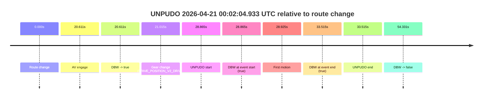
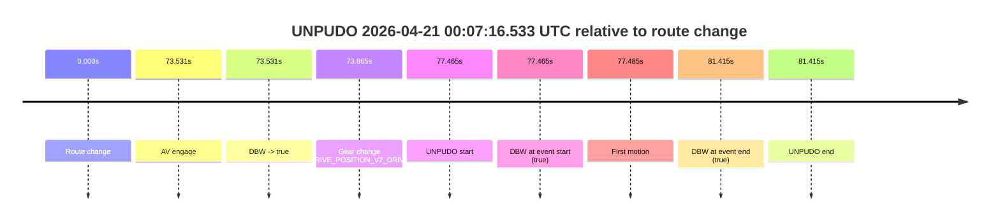

# Run Report: fme10011/2026-04-20--22-18-52--gen2-av-bac8f62f-b45e-47ee-bf04-6ab5482424a3

| Field | Value |
|---|---|
| Run ID | `fme10011/2026-04-20--22-18-52--gen2-av-bac8f62f-b45e-47ee-bf04-6ab5482424a3` |
| Date | `2026-04-20` |
| Model(s) | `eel-teal-outspoken` |
| Author | `zak` |
| Event count | `2` |

## unpudo 2026-04-21 00:02:04.933 UTC

| Field | Value |
|---|---|
| Model | `eel-teal-outspoken` |
| Author | `zak` |
| Run ID | `fme10011/2026-04-20--22-18-52--gen2-av-bac8f62f-b45e-47ee-bf04-6ab5482424a3` |
| Date | `2026-04-20` |
| Time (UTC) | `00:02:04.933` |
| Event type | `unpudo` |
| Disengagement type | `none observed` |
| Route change | `found` |
| Console | [run](https://console.sso.wayve.ai/run/fme10011/2026-04-20--22-18-52--gen2-av-bac8f62f-b45e-47ee-bf04-6ab5482424a3?id=&time-unixus=1776729724933318) |
| Foxglove | [segment](https://app.foxglove.dev/wayve-on-prem/p/prj_0dX18KZdVHg1fmmI/view?ds=foxglove-stream&ds.deviceName=fme10011&ds.start=2026-04-21T00%3A01%3A26.068258Z&ds.end=2026-04-21T00%3A02%3A40.399258Z&layoutId=lay_0e7VD4WIKDQGU73Y&time=2026-04-21T00%3A02%3A04.933318Z) |

### Event card: pass

- Pass: AV owns the credited unpudo from route change through the official unpudo window, the gear state is aligned at the anchor, and the vehicle moves without driver accelerator help in AV.

| Event | Time (UTC) | Delta from route change |
|---|---:|---:|
| Route change | 2026-04-21 00:01:36.068 | `0.000s` |
| AV engage | 2026-04-21 00:01:56.679 | `20.611s` |
| DBW -> true | 2026-04-21 00:01:56.679 | `20.611s` |
| Gear change (DRIVE_POSITION_V2_DRIVE) | 2026-04-21 00:01:57.083 | `21.015s` |
| UNPUDO start | 2026-04-21 00:02:04.933 | `28.865s` |
| DBW at event start (true) | 2026-04-21 00:02:04.933 | `28.865s` |
| First motion | 2026-04-21 00:02:04.993 | `28.925s` |
| DBW at event end (true) | 2026-04-21 00:02:09.583 | `33.515s` |
| UNPUDO end | 2026-04-21 00:02:09.583 | `33.515s` |
| DBW -> false | 2026-04-21 00:02:30.399 | `54.331s` |

| Metric | Value |
|---|---|
| Outcome | `pass` |
| Effective failure type | `none` |
| Route change status | `found` |
| DBW at event start | `true` |
| DBW at event end | `true` |
| Predicted gear at AV start | `DRIVE_POSITION_V2_DRIVE` |
| Actual gear at AV start | `DRIVE_POSITION_V2_PARK` |
| Predicted gear at event start | `DRIVE_POSITION_V2_DRIVE` |
| Actual gear at event start | `DRIVE_POSITION_V2_DRIVE` |
| Planned indicator direction | `INDICATORS_STATE_V2_LEFT_ON` |
| Controller indicator direction | `INDICATORS_STATE_V2_LEFT_ON` |
| Actual indicator direction | `INDICATORS_STATE_V2_OFF` |
| Actual indicator at maneuver end | `INDICATORS_STATE_V2_OFF` |
| Driver accel help in AV | `false` |
| Driver accel help timestamp | `n/a` |
| Max accel pedal pct in AV | `0.0%` |
| Max brake pedal pct in AV | `9.1%` |
| Max speed mps in AV | `4.089` |
| Success timing baseline | `route change` |
| Route -> AV | `20.611s` |
| AV -> event start | `8.254s` |
| AV -> first motion | `8.314s` |
| Success baseline -> event start | `28.865s` |
| Success baseline -> first motion | `28.925s` |
| AV duration before disengagement | `33.720s` |
| Trajectory waypoint count | `38` |
| Driving-plan step count | `11` |

The scored portion starts from the AV-owned window, not from the pre-AV setup. Route-change search in the stopped pre-event segment was `found`, with the baseline therefore set to route change. At the event anchor the model predicts `DRIVE_POSITION_V2_DRIVE` and the actual gear is `DRIVE_POSITION_V2_DRIVE`. The effective model outcome is `pass` because `the credited unpudo stays AV-owned through the official unpudo window.`

### Resolution

| Field | Value |
|---|---|
| Final outcome | `pass` |
| Do we agree with this label? | `yes` |
| Source disengagement type | `none observed` |
| Resolved effective failure type | `none` |
| Confidence | `high` |

## unpudo 2026-04-21 00:07:16.533 UTC

| Field | Value |
|---|---|
| Model | `eel-teal-outspoken` |
| Author | `zak` |
| Run ID | `fme10011/2026-04-20--22-18-52--gen2-av-bac8f62f-b45e-47ee-bf04-6ab5482424a3` |
| Date | `2026-04-20` |
| Time (UTC) | `00:07:16.533` |
| Event type | `unpudo` |
| Disengagement type | `none observed` |
| Route change | `found` |
| Console | [run](https://console.sso.wayve.ai/run/fme10011/2026-04-20--22-18-52--gen2-av-bac8f62f-b45e-47ee-bf04-6ab5482424a3?id=&time-unixus=1776730036533312) |
| Foxglove | [segment](https://app.foxglove.dev/wayve-on-prem/p/prj_0dX18KZdVHg1fmmI/view?ds=foxglove-stream&ds.deviceName=fme10011&ds.start=2026-04-21T00%3A05%3A49.068693Z&ds.end=2026-04-21T00%3A07%3A30.483303Z&layoutId=lay_0e7VD4WIKDQGU73Y&time=2026-04-21T00%3A07%3A16.533312Z) |

### Event card: pass

- Pass: AV owns the credited unpudo from route change through the official unpudo window, the gear state is aligned at the anchor, and the vehicle moves without driver accelerator help in AV.

| Event | Time (UTC) | Delta from route change |
|---|---:|---:|
| Route change | 2026-04-21 00:05:59.068 | `0.000s` |
| AV engage | 2026-04-21 00:07:12.599 | `73.531s` |
| DBW -> true | 2026-04-21 00:07:12.599 | `73.531s` |
| Gear change (DRIVE_POSITION_V2_DRIVE) | 2026-04-21 00:07:12.933 | `73.865s` |
| UNPUDO start | 2026-04-21 00:07:16.533 | `77.465s` |
| DBW at event start (true) | 2026-04-21 00:07:16.533 | `77.465s` |
| First motion | 2026-04-21 00:07:16.553 | `77.485s` |
| DBW at event end (true) | 2026-04-21 00:07:20.483 | `81.415s` |
| UNPUDO end | 2026-04-21 00:07:20.483 | `81.415s` |

| Metric | Value |
|---|---|
| Outcome | `pass` |
| Effective failure type | `none` |
| Route change status | `found` |
| DBW at event start | `true` |
| DBW at event end | `true` |
| Predicted gear at AV start | `DRIVE_POSITION_V2_DRIVE` |
| Actual gear at AV start | `DRIVE_POSITION_V2_PARK` |
| Predicted gear at event start | `DRIVE_POSITION_V2_DRIVE` |
| Actual gear at event start | `DRIVE_POSITION_V2_DRIVE` |
| Planned indicator direction | `INDICATORS_STATE_V2_LEFT_ON` |
| Controller indicator direction | `INDICATORS_STATE_V2_LEFT_ON` |
| Actual indicator direction | `INDICATORS_STATE_V2_OFF` |
| Actual indicator at maneuver end | `INDICATORS_STATE_V2_OFF` |
| Driver accel help in AV | `false` |
| Driver accel help timestamp | `n/a` |
| Max accel pedal pct in AV | `0.0%` |
| Max brake pedal pct in AV | `8.0%` |
| Max speed mps in AV | `3.842` |
| Success timing baseline | `route change` |
| Route -> AV | `73.531s` |
| AV -> event start | `3.934s` |
| AV -> first motion | `3.954s` |
| Success baseline -> event start | `77.465s` |
| Success baseline -> first motion | `77.485s` |
| AV duration before disengagement | `n/a` |
| Trajectory waypoint count | `38` |
| Driving-plan step count | `11` |

The scored portion starts from the AV-owned window, not from the pre-AV setup. Route-change search in the stopped pre-event segment was `found`, with the baseline therefore set to route change. At the event anchor the model predicts `DRIVE_POSITION_V2_DRIVE` and the actual gear is `DRIVE_POSITION_V2_DRIVE`. The effective model outcome is `pass` because `the credited unpudo stays AV-owned through the official unpudo window.`

### Resolution

| Field | Value |
|---|---|
| Final outcome | `pass` |
| Do we agree with this label? | `yes` |
| Source disengagement type | `none observed` |
| Resolved effective failure type | `none` |
| Confidence | `high` |
