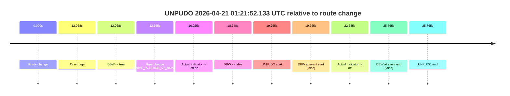
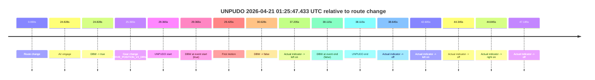
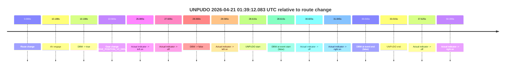
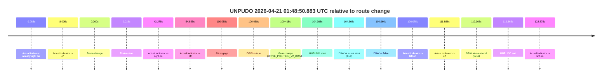

# Run Report: fme10011/2026-04-21--01-10-42--gen2-av-3f95039e-2222-4793-9f52-a3b2598d6c84

| Field | Value |
|---|---|
| Run ID | `fme10011/2026-04-21--01-10-42--gen2-av-3f95039e-2222-4793-9f52-a3b2598d6c84` |
| Date | `2026-04-21` |
| Model(s) | `pink-manta-ray-smooth` |
| Author | `guy.geva` |
| Event count | `4` |

## unpudo 2026-04-21 01:21:52.133 UTC

| Field | Value |
|---|---|
| Model | `pink-manta-ray-smooth` |
| Author | `guy.geva` |
| Run ID | `fme10011/2026-04-21--01-10-42--gen2-av-3f95039e-2222-4793-9f52-a3b2598d6c84` |
| Date | `2026-04-21` |
| Time (UTC) | `01:21:52.133` |
| Event type | `unpudo` |
| Disengagement type | `none observed` |
| Route change | `found` |
| Console | [run](https://console.sso.wayve.ai/run/fme10011/2026-04-21--01-10-42--gen2-av-3f95039e-2222-4793-9f52-a3b2598d6c84?id=&time-unixus=1776734512133301) |
| Foxglove | [segment](https://app.foxglove.dev/wayve-on-prem/p/prj_0dX18KZdVHg1fmmI/view?ds=foxglove-stream&ds.deviceName=fme10011&ds.start=2026-04-21T01%3A21%3A22.368265Z&ds.end=2026-04-21T01%3A22%3A08.133297Z&layoutId=lay_0e7VD4WIKDQGU73Y&time=2026-04-21T01%3A21%3A52.133301Z) |

### Event card: fail

- Fail: the credited unpudo does not stay AV-owned. The event window starts with DBW false, and the maneuver outcome lands outside a clean AV-owned segment.

| Event | Time (UTC) | Delta from route change |
|---|---:|---:|
| Route change | 2026-04-21 01:21:32.368 | `0.000s` |
| AV engage | 2026-04-21 01:21:44.436 | `12.068s` |
| DBW -> true | 2026-04-21 01:21:44.436 | `12.068s` |
| Gear change (DRIVE_POSITION_V2_DRIVE) | 2026-04-21 01:21:44.933 | `12.565s` |
| Actual indicator -> left on | 2026-04-21 01:21:49.292 | `16.925s` |
| DBW -> false | 2026-04-21 01:21:51.116 | `18.748s` |
| UNPUDO start | 2026-04-21 01:21:52.133 | `19.765s` |
| DBW at event start (false) | 2026-04-21 01:21:52.133 | `19.765s` |
| Actual indicator -> off | 2026-04-21 01:21:55.053 | `22.685s` |
| DBW at event end (false) | 2026-04-21 01:21:58.133 | `25.765s` |
| UNPUDO end | 2026-04-21 01:21:58.133 | `25.765s` |

| Metric | Value |
|---|---|
| Outcome | `fail` |
| Effective failure type | `not_av_owned` |
| Route change status | `found` |
| DBW at event start | `false` |
| DBW at event end | `false` |
| Predicted gear at AV start | `DRIVE_POSITION_V2_DRIVE` |
| Actual gear at AV start | `DRIVE_POSITION_V2_PARK` |
| Predicted gear at event start | `DRIVE_POSITION_V2_DRIVE` |
| Actual gear at event start | `DRIVE_POSITION_V2_DRIVE` |
| Planned indicator direction | `INDICATORS_STATE_V2_LEFT_ON` |
| Controller indicator direction | `INDICATORS_STATE_V2_LEFT_ON` |
| Actual indicator direction | `INDICATORS_STATE_V2_LEFT_ON` |
| Actual indicator at maneuver end | `INDICATORS_STATE_V2_OFF` |
| Driver accel help in AV | `false` |
| Driver accel help timestamp | `n/a` |
| Max accel pedal pct in AV | `0.0%` |
| Max brake pedal pct in AV | `8.0%` |
| Max speed mps in AV | `0.000` |
| Success timing baseline | `route change` |
| Route -> AV | `12.068s` |
| AV -> event start | `7.697s` |
| AV -> first motion | `n/a` |
| Success baseline -> event start | `19.765s` |
| Success baseline -> first motion | `n/a` |
| AV duration before disengagement | `6.680s` |
| Trajectory waypoint count | `37` |
| Driving-plan step count | `11` |

The scored portion starts from the AV-owned window, not from the pre-AV setup. Route-change search in the stopped pre-event segment was `found`, with the baseline therefore set to route change. At the event anchor the model predicts `DRIVE_POSITION_V2_DRIVE` and the actual gear is `DRIVE_POSITION_V2_DRIVE`. The effective model outcome is `fail` because `not_av_owned.`

### Resolution

| Field | Value |
|---|---|
| Final outcome | `fail` |
| Do we agree with this label? | `yes` |
| Source disengagement type | `none observed` |
| Resolved effective failure type | `not_av_owned` |
| Confidence | `high` |

## unpudo 2026-04-21 01:25:47.433 UTC

| Field | Value |
|---|---|
| Model | `pink-manta-ray-smooth` |
| Author | `guy.geva` |
| Run ID | `fme10011/2026-04-21--01-10-42--gen2-av-3f95039e-2222-4793-9f52-a3b2598d6c84` |
| Date | `2026-04-21` |
| Time (UTC) | `01:25:47.433` |
| Event type | `unpudo` |
| Disengagement type | `failed_to_slow` |
| Route change | `found` |
| Console | [run](https://console.sso.wayve.ai/run/fme10011/2026-04-21--01-10-42--gen2-av-3f95039e-2222-4793-9f52-a3b2598d6c84?id=&time-unixus=1776734747433319) |
| Foxglove | [segment](https://app.foxglove.dev/wayve-on-prem/p/prj_0dX18KZdVHg1fmmI/view?ds=foxglove-stream&ds.deviceName=fme10011&ds.start=2026-04-21T01%3A25%3A08.068272Z&ds.end=2026-04-21T01%3A26%3A06.183309Z&layoutId=lay_0e7VD4WIKDQGU73Y&time=2026-04-21T01%3A25%3A47.433319Z) |

### Event card: fail

- Fail: AV owns part of the segment, but the event still resolves as a model-performance failure under the AV-only scoring rule.

| Event | Time (UTC) | Delta from route change |
|---|---:|---:|
| Route change | 2026-04-21 01:25:18.068 | `0.000s` |
| AV engage | 2026-04-21 01:25:42.896 | `24.828s` |
| DBW -> true | 2026-04-21 01:25:42.896 | `24.828s` |
| Gear change (DRIVE_POSITION_V2_DRIVE) | 2026-04-21 01:25:43.433 | `25.365s` |
| UNPUDO start | 2026-04-21 01:25:47.433 | `29.365s` |
| DBW at event start (true) | 2026-04-21 01:25:47.433 | `29.365s` |
| First motion | 2026-04-21 01:25:47.492 | `29.425s` |
| DBW -> false | 2026-04-21 01:25:48.696 | `30.628s` |
| Actual indicator -> left on | 2026-04-21 01:25:55.272 | `37.205s` |
| DBW at event end (false) | 2026-04-21 01:25:56.183 | `38.115s` |
| UNPUDO end | 2026-04-21 01:25:56.183 | `38.115s` |
| Actual indicator -> off | 2026-04-21 01:25:56.713 | `38.645s` |
| Actual indicator -> left on | 2026-04-21 01:26:00.672 | `42.605s` |
| Actual indicator -> off | 2026-04-21 01:26:02.413 | `44.345s` |
| Actual indicator -> right on | 2026-04-21 01:26:02.913 | `44.845s` |
| Actual indicator -> off | 2026-04-21 01:26:05.253 | `47.185s` |

| Metric | Value |
|---|---|
| Outcome | `fail` |
| Effective failure type | `failed_to_slow` |
| Route change status | `found` |
| DBW at event start | `true` |
| DBW at event end | `false` |
| Predicted gear at AV start | `DRIVE_POSITION_V2_DRIVE` |
| Actual gear at AV start | `DRIVE_POSITION_V2_PARK` |
| Predicted gear at event start | `DRIVE_POSITION_V2_DRIVE` |
| Actual gear at event start | `DRIVE_POSITION_V2_DRIVE` |
| Planned indicator direction | `INDICATORS_STATE_V2_LEFT_ON` |
| Controller indicator direction | `INDICATORS_STATE_V2_LEFT_ON` |
| Actual indicator direction | `INDICATORS_STATE_V2_OFF` |
| Actual indicator at maneuver end | `INDICATORS_STATE_V2_LEFT_ON` |
| Driver accel help in AV | `false` |
| Driver accel help timestamp | `n/a` |
| Max accel pedal pct in AV | `0.0%` |
| Max brake pedal pct in AV | `8.0%` |
| Max speed mps in AV | `1.797` |
| Success timing baseline | `route change` |
| Route -> AV | `24.828s` |
| AV -> event start | `4.537s` |
| AV -> first motion | `4.596s` |
| Success baseline -> event start | `29.365s` |
| Success baseline -> first motion | `29.425s` |
| AV duration before disengagement | `5.800s` |
| Trajectory waypoint count | `37` |
| Driving-plan step count | `11` |

The scored portion starts from the AV-owned window, not from the pre-AV setup. Route-change search in the stopped pre-event segment was `found`, with the baseline therefore set to route change. At the event anchor the model predicts `DRIVE_POSITION_V2_DRIVE` and the actual gear is `DRIVE_POSITION_V2_DRIVE`. The effective model outcome is `fail` because `failed_to_slow.`

### Resolution

| Field | Value |
|---|---|
| Final outcome | `fail` |
| Do we agree with this label? | `yes` |
| Source disengagement type | `failed_to_slow` |
| Resolved effective failure type | `failed_to_slow` |
| Confidence | `high` |

## unpudo 2026-04-21 01:39:12.083 UTC

| Field | Value |
|---|---|
| Model | `pink-manta-ray-smooth` |
| Author | `guy.geva` |
| Run ID | `fme10011/2026-04-21--01-10-42--gen2-av-3f95039e-2222-4793-9f52-a3b2598d6c84` |
| Date | `2026-04-21` |
| Time (UTC) | `01:39:12.083` |
| Event type | `unpudo` |
| Disengagement type | `none observed` |
| Route change | `found` |
| Console | [run](https://console.sso.wayve.ai/run/fme10011/2026-04-21--01-10-42--gen2-av-3f95039e-2222-4793-9f52-a3b2598d6c84?id=&time-unixus=1776735552083290) |
| Foxglove | [segment](https://app.foxglove.dev/wayve-on-prem/p/prj_0dX18KZdVHg1fmmI/view?ds=foxglove-stream&ds.deviceName=fme10011&ds.start=2026-04-21T01%3A38%3A33.468245Z&ds.end=2026-04-21T01%3A39%3A26.483314Z&layoutId=lay_0e7VD4WIKDQGU73Y&time=2026-04-21T01%3A39%3A12.083290Z) |

### Event card: fail

- Fail: the credited unpudo does not stay AV-owned. The event window starts with DBW false, and the maneuver outcome lands outside a clean AV-owned segment.

| Event | Time (UTC) | Delta from route change |
|---|---:|---:|
| Route change | 2026-04-21 01:38:43.468 | `0.000s` |
| AV engage | 2026-04-21 01:38:53.656 | `10.188s` |
| DBW -> true | 2026-04-21 01:38:53.656 | `10.188s` |
| Gear change (DRIVE_POSITION_V2_DRIVE) | 2026-04-21 01:38:54.033 | `10.565s` |
| Actual indicator -> left on | 2026-04-21 01:39:10.353 | `26.885s` |
| Actual indicator -> off | 2026-04-21 01:39:11.073 | `27.605s` |
| DBW -> false | 2026-04-21 01:39:11.537 | `28.069s` |
| Actual indicator -> left on | 2026-04-21 01:39:12.053 | `28.585s` |
| UNPUDO start | 2026-04-21 01:39:12.083 | `28.615s` |
| DBW at event start (false) | 2026-04-21 01:39:12.083 | `28.615s` |
| Actual indicator -> off | 2026-04-21 01:39:14.293 | `30.825s` |
| Actual indicator -> right on | 2026-04-21 01:39:15.312 | `31.845s` |
| DBW at event end (false) | 2026-04-21 01:39:16.483 | `33.015s` |
| UNPUDO end | 2026-04-21 01:39:16.483 | `33.015s` |
| Actual indicator -> off | 2026-04-21 01:39:21.093 | `37.625s` |
| Actual indicator -> right on | 2026-04-21 01:39:33.773 | `50.305s` |

| Metric | Value |
|---|---|
| Outcome | `fail` |
| Effective failure type | `not_av_owned` |
| Route change status | `found` |
| DBW at event start | `false` |
| DBW at event end | `false` |
| Predicted gear at AV start | `DRIVE_POSITION_V2_DRIVE` |
| Actual gear at AV start | `DRIVE_POSITION_V2_PARK` |
| Predicted gear at event start | `DRIVE_POSITION_V2_DRIVE` |
| Actual gear at event start | `DRIVE_POSITION_V2_DRIVE` |
| Planned indicator direction | `INDICATORS_STATE_V2_LEFT_ON` |
| Controller indicator direction | `INDICATORS_STATE_V2_LEFT_ON` |
| Actual indicator direction | `INDICATORS_STATE_V2_LEFT_ON` |
| Actual indicator at maneuver end | `INDICATORS_STATE_V2_RIGHT_ON` |
| Driver accel help in AV | `false` |
| Driver accel help timestamp | `n/a` |
| Max accel pedal pct in AV | `0.0%` |
| Max brake pedal pct in AV | `11.7%` |
| Max speed mps in AV | `0.000` |
| Success timing baseline | `route change` |
| Route -> AV | `10.188s` |
| AV -> event start | `18.427s` |
| AV -> first motion | `n/a` |
| Success baseline -> event start | `28.615s` |
| Success baseline -> first motion | `n/a` |
| AV duration before disengagement | `17.881s` |
| Trajectory waypoint count | `36` |
| Driving-plan step count | `11` |

The scored portion starts from the AV-owned window, not from the pre-AV setup. Route-change search in the stopped pre-event segment was `found`, with the baseline therefore set to route change. At the event anchor the model predicts `DRIVE_POSITION_V2_DRIVE` and the actual gear is `DRIVE_POSITION_V2_DRIVE`. The effective model outcome is `fail` because `not_av_owned.`

### Resolution

| Field | Value |
|---|---|
| Final outcome | `fail` |
| Do we agree with this label? | `yes` |
| Source disengagement type | `none observed` |
| Resolved effective failure type | `not_av_owned` |
| Confidence | `high` |

## unpudo 2026-04-21 01:48:50.883 UTC

| Field | Value |
|---|---|
| Model | `pink-manta-ray-smooth` |
| Author | `guy.geva` |
| Run ID | `fme10011/2026-04-21--01-10-42--gen2-av-3f95039e-2222-4793-9f52-a3b2598d6c84` |
| Date | `2026-04-21` |
| Time (UTC) | `01:48:50.883` |
| Event type | `unpudo` |
| Disengagement type | `none observed` |
| Route change | `found` |
| Console | [run](https://console.sso.wayve.ai/run/fme10011/2026-04-21--01-10-42--gen2-av-3f95039e-2222-4793-9f52-a3b2598d6c84?id=&time-unixus=1776736130883319) |
| Foxglove | [segment](https://app.foxglove.dev/wayve-on-prem/p/prj_0dX18KZdVHg1fmmI/view?ds=foxglove-stream&ds.deviceName=fme10011&ds.start=2026-04-21T01%3A46%3A56.518236Z&ds.end=2026-04-21T01%3A49%3A08.883298Z&layoutId=lay_0e7VD4WIKDQGU73Y&time=2026-04-21T01%3A48%3A50.883319Z) |

### Event card: fail

- Fail: this is a short AV stint rather than a durable model-owned maneuver. The vehicle never settles into a long enough AV-owned attempt to credit the model.

| Event | Time (UTC) | Delta from route change |
|---|---:|---:|
| Actual indicator already right on | 2026-04-21 01:46:56.532 | `-9.985s` |
| Actual indicator -> off | 2026-04-21 01:46:58.512 | `-8.005s` |
| Route change | 2026-04-21 01:47:06.518 | `0.000s` |
| First motion | 2026-04-21 01:47:06.533 | `0.015s` |
| Actual indicator -> right on | 2026-04-21 01:47:49.792 | `43.275s` |
| Actual indicator -> off | 2026-04-21 01:48:01.373 | `54.855s` |
| AV engage | 2026-04-21 01:48:46.576 | `100.058s` |
| DBW -> true | 2026-04-21 01:48:46.576 | `100.058s` |
| Gear change (DRIVE_POSITION_V2_DRIVE) | 2026-04-21 01:48:46.933 | `100.415s` |
| UNPUDO start | 2026-04-21 01:48:50.883 | `104.365s` |
| DBW at event start (true) | 2026-04-21 01:48:50.883 | `104.365s` |
| DBW -> false | 2026-04-21 01:48:51.478 | `104.960s` |
| Actual indicator -> left on | 2026-04-21 01:48:52.593 | `106.075s` |
| Actual indicator -> off | 2026-04-21 01:48:58.373 | `111.856s` |
| DBW at event end (false) | 2026-04-21 01:48:58.883 | `112.365s` |
| UNPUDO end | 2026-04-21 01:48:58.883 | `112.365s` |
| Actual indicator -> left on | 2026-04-21 01:49:09.092 | `122.575s` |

| Metric | Value |
|---|---|
| Outcome | `fail` |
| Effective failure type | `interrupted_handover` |
| Route change status | `found` |
| DBW at event start | `true` |
| DBW at event end | `false` |
| Predicted gear at AV start | `DRIVE_POSITION_V2_DRIVE` |
| Actual gear at AV start | `DRIVE_POSITION_V2_PARK` |
| Predicted gear at event start | `DRIVE_POSITION_V2_DRIVE` |
| Actual gear at event start | `DRIVE_POSITION_V2_DRIVE` |
| Planned indicator direction | `INDICATORS_STATE_V2_LEFT_ON` |
| Controller indicator direction | `INDICATORS_STATE_V2_LEFT_ON` |
| Actual indicator direction | `INDICATORS_STATE_V2_OFF` |
| Actual indicator at maneuver end | `INDICATORS_STATE_V2_OFF` |
| Driver accel help in AV | `false` |
| Driver accel help timestamp | `n/a` |
| Max accel pedal pct in AV | `0.0%` |
| Max brake pedal pct in AV | `8.4%` |
| Max speed mps in AV | `0.864` |
| Success timing baseline | `route change` |
| Route -> AV | `100.058s` |
| AV -> event start | `4.307s` |
| AV -> first motion | `-100.043s` |
| Success baseline -> event start | `104.365s` |
| Success baseline -> first motion | `0.015s` |
| AV duration before disengagement | `4.902s` |
| Trajectory waypoint count | `36` |
| Driving-plan step count | `11` |

The scored portion starts from the AV-owned window, not from the pre-AV setup. Route-change search in the stopped pre-event segment was `found`, with the baseline therefore set to route change. At the event anchor the model predicts `DRIVE_POSITION_V2_DRIVE` and the actual gear is `DRIVE_POSITION_V2_DRIVE`. The effective model outcome is `fail` because `interrupted_handover.`

### Resolution

| Field | Value |
|---|---|
| Final outcome | `fail` |
| Do we agree with this label? | `yes` |
| Source disengagement type | `none observed` |
| Resolved effective failure type | `interrupted_handover` |
| Confidence | `high` |
