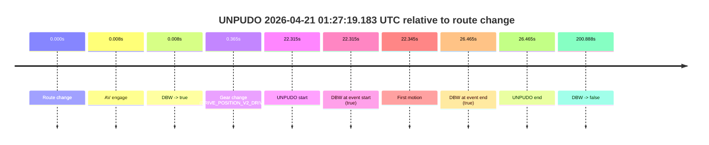
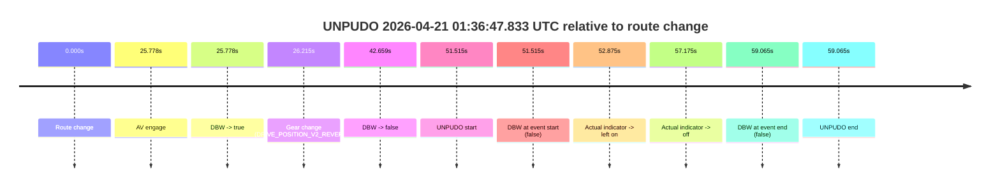
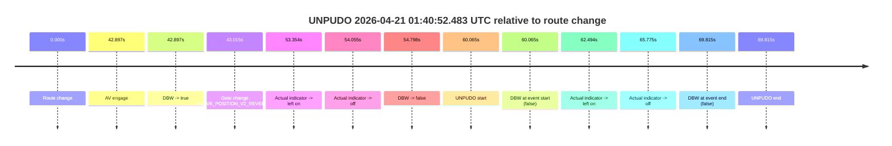
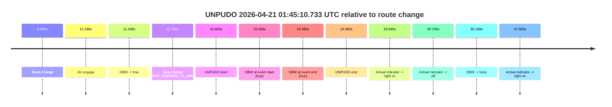

# Run Report: fme10011/2026-04-21--01-10-42--gen2-av-3f95039e-2222-4793-9f52-a3b2598d6c84

| Field | Value |
|---|---|
| Run ID | `fme10011/2026-04-21--01-10-42--gen2-av-3f95039e-2222-4793-9f52-a3b2598d6c84` |
| Date | `2026-04-21` |
| Model(s) | `eel-teal-outspoken` |
| Author | `zak` |
| Event count | `5` |

## unpudo 2026-04-21 01:27:19.183 UTC

| Field | Value |
|---|---|
| Model | `eel-teal-outspoken` |
| Author | `zak` |
| Run ID | `fme10011/2026-04-21--01-10-42--gen2-av-3f95039e-2222-4793-9f52-a3b2598d6c84` |
| Date | `2026-04-21` |
| Time (UTC) | `01:27:19.183` |
| Event type | `unpudo` |
| Disengagement type | `none observed` |
| Route change | `found` |
| Console | [run](https://console.sso.wayve.ai/run/fme10011/2026-04-21--01-10-42--gen2-av-3f95039e-2222-4793-9f52-a3b2598d6c84?id=&time-unixus=1776734839183309) |
| Foxglove | [segment](https://app.foxglove.dev/wayve-on-prem/p/prj_0dX18KZdVHg1fmmI/view?ds=foxglove-stream&ds.deviceName=fme10011&ds.start=2026-04-21T01%3A26%3A46.868277Z&ds.end=2026-04-21T01%3A30%3A27.756347Z&layoutId=lay_0e7VD4WIKDQGU73Y&time=2026-04-21T01%3A27%3A19.183309Z) |

### Event card: pass

- Pass: AV owns the credited unpudo from route change through the official unpudo window, the gear state is aligned at the anchor, and the vehicle moves without driver accelerator help in AV.

| Event | Time (UTC) | Delta from route change |
|---|---:|---:|
| Route change | 2026-04-21 01:26:56.868 | `0.000s` |
| AV engage | 2026-04-21 01:26:56.876 | `0.008s` |
| DBW -> true | 2026-04-21 01:26:56.876 | `0.008s` |
| Gear change (DRIVE_POSITION_V2_DRIVE) | 2026-04-21 01:26:57.233 | `0.365s` |
| UNPUDO start | 2026-04-21 01:27:19.183 | `22.315s` |
| DBW at event start (true) | 2026-04-21 01:27:19.183 | `22.315s` |
| First motion | 2026-04-21 01:27:19.213 | `22.345s` |
| DBW at event end (true) | 2026-04-21 01:27:23.333 | `26.465s` |
| UNPUDO end | 2026-04-21 01:27:23.333 | `26.465s` |
| DBW -> false | 2026-04-21 01:30:17.756 | `200.888s` |

| Metric | Value |
|---|---|
| Outcome | `pass` |
| Effective failure type | `none` |
| Route change status | `found` |
| DBW at event start | `true` |
| DBW at event end | `true` |
| Predicted gear at AV start | `DRIVE_POSITION_V2_PARK` |
| Actual gear at AV start | `DRIVE_POSITION_V2_PARK` |
| Predicted gear at event start | `DRIVE_POSITION_V2_DRIVE` |
| Actual gear at event start | `DRIVE_POSITION_V2_DRIVE` |
| Planned indicator direction | `INDICATORS_STATE_V2_LEFT_ON` |
| Controller indicator direction | `INDICATORS_STATE_V2_LEFT_ON` |
| Actual indicator direction | `INDICATORS_STATE_V2_OFF` |
| Actual indicator at maneuver end | `INDICATORS_STATE_V2_OFF` |
| Driver accel help in AV | `false` |
| Driver accel help timestamp | `n/a` |
| Max accel pedal pct in AV | `0.0%` |
| Max brake pedal pct in AV | `8.0%` |
| Max speed mps in AV | `4.378` |
| Success timing baseline | `route change` |
| Route -> AV | `0.008s` |
| AV -> event start | `22.307s` |
| AV -> first motion | `22.336s` |
| Success baseline -> event start | `22.315s` |
| Success baseline -> first motion | `22.345s` |
| AV duration before disengagement | `200.880s` |
| Trajectory waypoint count | `36` |
| Driving-plan step count | `11` |

The scored portion starts from the AV-owned window, not from the pre-AV setup. Route-change search in the stopped pre-event segment was `found`, with the baseline therefore set to route change. At the event anchor the model predicts `DRIVE_POSITION_V2_DRIVE` and the actual gear is `DRIVE_POSITION_V2_DRIVE`. The effective model outcome is `pass` because `the credited unpudo stays AV-owned through the official unpudo window.`

### Resolution

| Field | Value |
|---|---|
| Final outcome | `pass` |
| Do we agree with this label? | `yes` |
| Source disengagement type | `none observed` |
| Resolved effective failure type | `none` |
| Confidence | `high` |

## unpudo 2026-04-21 01:32:50.933 UTC

| Field | Value |
|---|---|
| Model | `eel-teal-outspoken` |
| Author | `zak` |
| Run ID | `fme10011/2026-04-21--01-10-42--gen2-av-3f95039e-2222-4793-9f52-a3b2598d6c84` |
| Date | `2026-04-21` |
| Time (UTC) | `01:32:50.933` |
| Event type | `unpudo` |
| Disengagement type | `uncategorised` |
| Route change | `found` |
| Console | [run](https://console.sso.wayve.ai/run/fme10011/2026-04-21--01-10-42--gen2-av-3f95039e-2222-4793-9f52-a3b2598d6c84?id=&time-unixus=1776735170933321) |
| Foxglove | [segment](https://app.foxglove.dev/wayve-on-prem/p/prj_0dX18KZdVHg1fmmI/view?ds=foxglove-stream&ds.deviceName=fme10011&ds.start=2026-04-21T01%3A32%3A06.518245Z&ds.end=2026-04-21T01%3A33%3A11.883311Z&layoutId=lay_0e7VD4WIKDQGU73Y&time=2026-04-21T01%3A32%3A50.933321Z) |

### Event card: fail

- Fail: AV owns part of the segment, but the event still resolves as a model-performance failure under the AV-only scoring rule.

| Event | Time (UTC) | Delta from route change |
|---|---:|---:|
| Route change | 2026-04-21 01:32:16.518 | `0.000s` |
| AV engage | 2026-04-21 01:32:27.156 | `10.638s` |
| DBW -> true | 2026-04-21 01:32:27.156 | `10.638s` |
| Gear change (DRIVE_POSITION_V2_REVERSE) | 2026-04-21 01:32:27.533 | `11.015s` |
| DBW -> false | 2026-04-21 01:32:29.796 | `13.278s` |
| UNPUDO start | 2026-04-21 01:32:50.933 | `34.415s` |
| DBW at event start (false) | 2026-04-21 01:32:50.933 | `34.415s` |
| Actual indicator -> left on | 2026-04-21 01:32:52.292 | `35.775s` |
| Actual indicator -> off | 2026-04-21 01:32:57.933 | `41.415s` |
| DBW at event end (false) | 2026-04-21 01:33:01.883 | `45.365s` |
| UNPUDO end | 2026-04-21 01:33:01.883 | `45.365s` |

| Metric | Value |
|---|---|
| Outcome | `fail` |
| Effective failure type | `uncategorised` |
| Route change status | `found` |
| DBW at event start | `false` |
| DBW at event end | `false` |
| Predicted gear at AV start | `DRIVE_POSITION_V2_PARK` |
| Actual gear at AV start | `DRIVE_POSITION_V2_PARK` |
| Predicted gear at event start | `DRIVE_POSITION_V2_REVERSE` |
| Actual gear at event start | `DRIVE_POSITION_V2_REVERSE` |
| Planned indicator direction | `INDICATORS_STATE_V2_OFF` |
| Controller indicator direction | `INDICATORS_STATE_V2_OFF` |
| Actual indicator direction | `INDICATORS_STATE_V2_OFF` |
| Actual indicator at maneuver end | `INDICATORS_STATE_V2_OFF` |
| Driver accel help in AV | `false` |
| Driver accel help timestamp | `n/a` |
| Max accel pedal pct in AV | `0.0%` |
| Max brake pedal pct in AV | `8.0%` |
| Max speed mps in AV | `0.000` |
| Success timing baseline | `route change` |
| Route -> AV | `10.638s` |
| AV -> event start | `23.777s` |
| AV -> first motion | `n/a` |
| Success baseline -> event start | `34.415s` |
| Success baseline -> first motion | `n/a` |
| AV duration before disengagement | `2.640s` |
| Trajectory waypoint count | `37` |
| Driving-plan step count | `11` |

The scored portion starts from the AV-owned window, not from the pre-AV setup. Route-change search in the stopped pre-event segment was `found`, with the baseline therefore set to route change. At the event anchor the model predicts `DRIVE_POSITION_V2_REVERSE` and the actual gear is `DRIVE_POSITION_V2_REVERSE`. The effective model outcome is `fail` because `uncategorised.`

### Resolution

| Field | Value |
|---|---|
| Final outcome | `fail` |
| Do we agree with this label? | `yes` |
| Source disengagement type | `uncategorised` |
| Resolved effective failure type | `uncategorised` |
| Confidence | `high` |

## unpudo 2026-04-21 01:36:47.833 UTC

| Field | Value |
|---|---|
| Model | `eel-teal-outspoken` |
| Author | `zak` |
| Run ID | `fme10011/2026-04-21--01-10-42--gen2-av-3f95039e-2222-4793-9f52-a3b2598d6c84` |
| Date | `2026-04-21` |
| Time (UTC) | `01:36:47.833` |
| Event type | `unpudo` |
| Disengagement type | `none observed` |
| Route change | `found` |
| Console | [run](https://console.sso.wayve.ai/run/fme10011/2026-04-21--01-10-42--gen2-av-3f95039e-2222-4793-9f52-a3b2598d6c84?id=&time-unixus=1776735407833313) |
| Foxglove | [segment](https://app.foxglove.dev/wayve-on-prem/p/prj_0dX18KZdVHg1fmmI/view?ds=foxglove-stream&ds.deviceName=fme10011&ds.start=2026-04-21T01%3A35%3A46.318234Z&ds.end=2026-04-21T01%3A37%3A05.383317Z&layoutId=lay_0e7VD4WIKDQGU73Y&time=2026-04-21T01%3A36%3A47.833313Z) |

### Event card: fail

- Fail: the credited unpudo does not stay AV-owned. The event window starts with DBW false, and the maneuver outcome lands outside a clean AV-owned segment.

| Event | Time (UTC) | Delta from route change |
|---|---:|---:|
| Route change | 2026-04-21 01:35:56.318 | `0.000s` |
| AV engage | 2026-04-21 01:36:22.095 | `25.778s` |
| DBW -> true | 2026-04-21 01:36:22.095 | `25.778s` |
| Gear change (DRIVE_POSITION_V2_REVERSE) | 2026-04-21 01:36:22.533 | `26.215s` |
| DBW -> false | 2026-04-21 01:36:38.977 | `42.659s` |
| UNPUDO start | 2026-04-21 01:36:47.833 | `51.515s` |
| DBW at event start (false) | 2026-04-21 01:36:47.833 | `51.515s` |
| Actual indicator -> left on | 2026-04-21 01:36:49.193 | `52.875s` |
| Actual indicator -> off | 2026-04-21 01:36:53.492 | `57.175s` |
| DBW at event end (false) | 2026-04-21 01:36:55.383 | `59.065s` |
| UNPUDO end | 2026-04-21 01:36:55.383 | `59.065s` |

| Metric | Value |
|---|---|
| Outcome | `fail` |
| Effective failure type | `not_av_owned` |
| Route change status | `found` |
| DBW at event start | `false` |
| DBW at event end | `false` |
| Predicted gear at AV start | `DRIVE_POSITION_V2_REVERSE` |
| Actual gear at AV start | `DRIVE_POSITION_V2_PARK` |
| Predicted gear at event start | `DRIVE_POSITION_V2_REVERSE` |
| Actual gear at event start | `DRIVE_POSITION_V2_REVERSE` |
| Planned indicator direction | `INDICATORS_STATE_V2_OFF` |
| Controller indicator direction | `INDICATORS_STATE_V2_OFF` |
| Actual indicator direction | `INDICATORS_STATE_V2_OFF` |
| Actual indicator at maneuver end | `INDICATORS_STATE_V2_OFF` |
| Driver accel help in AV | `false` |
| Driver accel help timestamp | `n/a` |
| Max accel pedal pct in AV | `0.0%` |
| Max brake pedal pct in AV | `9.1%` |
| Max speed mps in AV | `0.000` |
| Success timing baseline | `route change` |
| Route -> AV | `25.778s` |
| AV -> event start | `25.738s` |
| AV -> first motion | `n/a` |
| Success baseline -> event start | `51.515s` |
| Success baseline -> first motion | `n/a` |
| AV duration before disengagement | `16.882s` |
| Trajectory waypoint count | `37` |
| Driving-plan step count | `11` |

The scored portion starts from the AV-owned window, not from the pre-AV setup. Route-change search in the stopped pre-event segment was `found`, with the baseline therefore set to route change. At the event anchor the model predicts `DRIVE_POSITION_V2_REVERSE` and the actual gear is `DRIVE_POSITION_V2_REVERSE`. The effective model outcome is `fail` because `not_av_owned.`

### Resolution

| Field | Value |
|---|---|
| Final outcome | `fail` |
| Do we agree with this label? | `yes` |
| Source disengagement type | `none observed` |
| Resolved effective failure type | `not_av_owned` |
| Confidence | `high` |

## unpudo 2026-04-21 01:40:52.483 UTC

| Field | Value |
|---|---|
| Model | `eel-teal-outspoken` |
| Author | `zak` |
| Run ID | `fme10011/2026-04-21--01-10-42--gen2-av-3f95039e-2222-4793-9f52-a3b2598d6c84` |
| Date | `2026-04-21` |
| Time (UTC) | `01:40:52.483` |
| Event type | `unpudo` |
| Disengagement type | `none observed` |
| Route change | `found` |
| Console | [run](https://console.sso.wayve.ai/run/fme10011/2026-04-21--01-10-42--gen2-av-3f95039e-2222-4793-9f52-a3b2598d6c84?id=&time-unixus=1776735652483313) |
| Foxglove | [segment](https://app.foxglove.dev/wayve-on-prem/p/prj_0dX18KZdVHg1fmmI/view?ds=foxglove-stream&ds.deviceName=fme10011&ds.start=2026-04-21T01%3A39%3A42.418539Z&ds.end=2026-04-21T01%3A41%3A12.233308Z&layoutId=lay_0e7VD4WIKDQGU73Y&time=2026-04-21T01%3A40%3A52.483313Z) |

### Event card: fail

- Fail: the credited unpudo does not stay AV-owned. The event window starts with DBW false, and the maneuver outcome lands outside a clean AV-owned segment.

| Event | Time (UTC) | Delta from route change |
|---|---:|---:|
| Route change | 2026-04-21 01:39:52.418 | `0.000s` |
| AV engage | 2026-04-21 01:40:35.315 | `42.897s` |
| DBW -> true | 2026-04-21 01:40:35.315 | `42.897s` |
| Gear change (DRIVE_POSITION_V2_REVERSE) | 2026-04-21 01:40:35.433 | `43.015s` |
| Actual indicator -> left on | 2026-04-21 01:40:45.773 | `53.354s` |
| Actual indicator -> off | 2026-04-21 01:40:46.473 | `54.055s` |
| DBW -> false | 2026-04-21 01:40:47.217 | `54.798s` |
| UNPUDO start | 2026-04-21 01:40:52.483 | `60.065s` |
| DBW at event start (false) | 2026-04-21 01:40:52.483 | `60.065s` |
| Actual indicator -> left on | 2026-04-21 01:40:54.912 | `62.494s` |
| Actual indicator -> off | 2026-04-21 01:40:58.193 | `65.775s` |
| DBW at event end (false) | 2026-04-21 01:41:02.233 | `69.815s` |
| UNPUDO end | 2026-04-21 01:41:02.233 | `69.815s` |

| Metric | Value |
|---|---|
| Outcome | `fail` |
| Effective failure type | `not_av_owned` |
| Route change status | `found` |
| DBW at event start | `false` |
| DBW at event end | `false` |
| Predicted gear at AV start | `DRIVE_POSITION_V2_REVERSE` |
| Actual gear at AV start | `DRIVE_POSITION_V2_PARK` |
| Predicted gear at event start | `DRIVE_POSITION_V2_REVERSE` |
| Actual gear at event start | `DRIVE_POSITION_V2_REVERSE` |
| Planned indicator direction | `INDICATORS_STATE_V2_OFF` |
| Controller indicator direction | `INDICATORS_STATE_V2_OFF` |
| Actual indicator direction | `INDICATORS_STATE_V2_OFF` |
| Actual indicator at maneuver end | `INDICATORS_STATE_V2_OFF` |
| Driver accel help in AV | `false` |
| Driver accel help timestamp | `n/a` |
| Max accel pedal pct in AV | `0.0%` |
| Max brake pedal pct in AV | `10.0%` |
| Max speed mps in AV | `0.000` |
| Success timing baseline | `route change` |
| Route -> AV | `42.897s` |
| AV -> event start | `17.168s` |
| AV -> first motion | `n/a` |
| Success baseline -> event start | `60.065s` |
| Success baseline -> first motion | `n/a` |
| AV duration before disengagement | `11.901s` |
| Trajectory waypoint count | `36` |
| Driving-plan step count | `11` |

The scored portion starts from the AV-owned window, not from the pre-AV setup. Route-change search in the stopped pre-event segment was `found`, with the baseline therefore set to route change. At the event anchor the model predicts `DRIVE_POSITION_V2_REVERSE` and the actual gear is `DRIVE_POSITION_V2_REVERSE`. The effective model outcome is `fail` because `not_av_owned.`

### Resolution

| Field | Value |
|---|---|
| Final outcome | `fail` |
| Do we agree with this label? | `yes` |
| Source disengagement type | `none observed` |
| Resolved effective failure type | `not_av_owned` |
| Confidence | `high` |

## unpudo 2026-04-21 01:45:10.733 UTC

| Field | Value |
|---|---|
| Model | `eel-teal-outspoken` |
| Author | `zak` |
| Run ID | `fme10011/2026-04-21--01-10-42--gen2-av-3f95039e-2222-4793-9f52-a3b2598d6c84` |
| Date | `2026-04-21` |
| Time (UTC) | `01:45:10.733` |
| Event type | `unpudo` |
| Disengagement type | `none observed` |
| Route change | `found` |
| Console | [run](https://console.sso.wayve.ai/run/fme10011/2026-04-21--01-10-42--gen2-av-3f95039e-2222-4793-9f52-a3b2598d6c84?id=&time-unixus=1776735910733319) |
| Foxglove | [segment](https://app.foxglove.dev/wayve-on-prem/p/prj_0dX18KZdVHg1fmmI/view?ds=foxglove-stream&ds.deviceName=fme10011&ds.start=2026-04-21T01%3A44%3A44.268273Z&ds.end=2026-04-21T01%3A45%3A40.436743Z&layoutId=lay_0e7VD4WIKDQGU73Y&time=2026-04-21T01%3A45%3A10.733319Z) |

### Event card: fail

- Fail: AV owns part of the segment, but the event still resolves as a model-performance failure under the AV-only scoring rule.

| Event | Time (UTC) | Delta from route change |
|---|---:|---:|
| Route change | 2026-04-21 01:44:54.268 | `0.000s` |
| AV engage | 2026-04-21 01:45:05.516 | `11.248s` |
| DBW -> true | 2026-04-21 01:45:05.516 | `11.248s` |
| Gear change (DRIVE_POSITION_V2_DRIVE) | 2026-04-21 01:45:06.033 | `11.765s` |
| UNPUDO start | 2026-04-21 01:45:10.733 | `16.465s` |
| DBW at event start (true) | 2026-04-21 01:45:10.733 | `16.465s` |
| DBW at event end (true) | 2026-04-21 01:45:10.733 | `16.465s` |
| UNPUDO end | 2026-04-21 01:45:10.733 | `16.465s` |
| Actual indicator -> right on | 2026-04-21 01:45:23.113 | `28.845s` |
| Actual indicator -> off | 2026-04-21 01:45:25.013 | `30.745s` |
| DBW -> false | 2026-04-21 01:45:30.436 | `36.168s` |
| Actual indicator -> right on | 2026-04-21 01:45:32.173 | `37.905s` |

| Metric | Value |
|---|---|
| Outcome | `fail` |
| Effective failure type | `unknown_needs_review` |
| Route change status | `found` |
| DBW at event start | `true` |
| DBW at event end | `true` |
| Predicted gear at AV start | `DRIVE_POSITION_V2_DRIVE` |
| Actual gear at AV start | `DRIVE_POSITION_V2_PARK` |
| Predicted gear at event start | `DRIVE_POSITION_V2_DRIVE` |
| Actual gear at event start | `DRIVE_POSITION_V2_DRIVE` |
| Planned indicator direction | `INDICATORS_STATE_V2_OFF` |
| Controller indicator direction | `INDICATORS_STATE_V2_OFF` |
| Actual indicator direction | `INDICATORS_STATE_V2_OFF` |
| Actual indicator at maneuver end | `INDICATORS_STATE_V2_OFF` |
| Driver accel help in AV | `false` |
| Driver accel help timestamp | `n/a` |
| Max accel pedal pct in AV | `0.0%` |
| Max brake pedal pct in AV | `26.6%` |
| Max speed mps in AV | `0.000` |
| Success timing baseline | `route change` |
| Route -> AV | `11.248s` |
| AV -> event start | `5.217s` |
| AV -> first motion | `n/a` |
| Success baseline -> event start | `16.465s` |
| Success baseline -> first motion | `n/a` |
| AV duration before disengagement | `24.920s` |
| Trajectory waypoint count | `37` |
| Driving-plan step count | `11` |

The scored portion starts from the AV-owned window, not from the pre-AV setup. Route-change search in the stopped pre-event segment was `found`, with the baseline therefore set to route change. At the event anchor the model predicts `DRIVE_POSITION_V2_DRIVE` and the actual gear is `DRIVE_POSITION_V2_DRIVE`. The effective model outcome is `fail` because `unknown_needs_review.`

### Resolution

| Field | Value |
|---|---|
| Final outcome | `fail` |
| Do we agree with this label? | `yes` |
| Source disengagement type | `none observed` |
| Resolved effective failure type | `unknown_needs_review` |
| Confidence | `high` |
