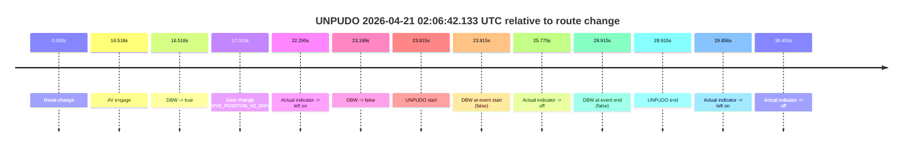
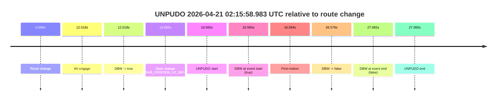
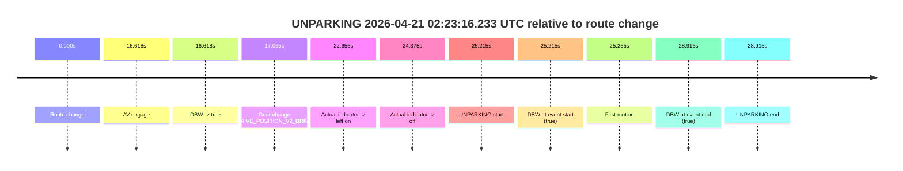

# Run Report: fme10011/2026-04-21--01-57-37--gen2-av-a88efe8f-e30d-48f7-917f-6b5f2e5fd4ea

| Field | Value |
|---|---|
| Run ID | `fme10011/2026-04-21--01-57-37--gen2-av-a88efe8f-e30d-48f7-917f-6b5f2e5fd4ea` |
| Date | `2026-04-21` |
| Model(s) | `pink-manta-ray-smooth` |
| Author | `guy.geva` |
| Event count | `3` |

## unpudo 2026-04-21 02:06:42.133 UTC

| Field | Value |
|---|---|
| Model | `pink-manta-ray-smooth` |
| Author | `guy.geva` |
| Run ID | `fme10011/2026-04-21--01-57-37--gen2-av-a88efe8f-e30d-48f7-917f-6b5f2e5fd4ea` |
| Date | `2026-04-21` |
| Time (UTC) | `02:06:42.133` |
| Event type | `unpudo` |
| Disengagement type | `none observed` |
| Route change | `found` |
| Console | [run](https://console.sso.wayve.ai/run/fme10011/2026-04-21--01-57-37--gen2-av-a88efe8f-e30d-48f7-917f-6b5f2e5fd4ea?id=&time-unixus=1776737202133301) |
| Foxglove | [segment](https://app.foxglove.dev/wayve-on-prem/p/prj_0dX18KZdVHg1fmmI/view?ds=foxglove-stream&ds.deviceName=fme10011&ds.start=2026-04-21T02%3A06%3A08.318305Z&ds.end=2026-04-21T02%3A06%3A57.233299Z&layoutId=lay_0e7VD4WIKDQGU73Y&time=2026-04-21T02%3A06%3A42.133301Z) |

### Event card: fail

- Fail: the credited unpudo does not stay AV-owned. The event window starts with DBW false, and the maneuver outcome lands outside a clean AV-owned segment.

| Event | Time (UTC) | Delta from route change |
|---|---:|---:|
| Route change | 2026-04-21 02:06:18.318 | `0.000s` |
| AV engage | 2026-04-21 02:06:34.836 | `16.518s` |
| DBW -> true | 2026-04-21 02:06:34.836 | `16.518s` |
| Gear change (DRIVE_POSITION_V2_DRIVE) | 2026-04-21 02:06:35.333 | `17.015s` |
| Actual indicator -> left on | 2026-04-21 02:06:40.613 | `22.295s` |
| DBW -> false | 2026-04-21 02:06:41.516 | `23.199s` |
| UNPUDO start | 2026-04-21 02:06:42.133 | `23.815s` |
| DBW at event start (false) | 2026-04-21 02:06:42.133 | `23.815s` |
| Actual indicator -> off | 2026-04-21 02:06:44.092 | `25.775s` |
| DBW at event end (false) | 2026-04-21 02:06:47.233 | `28.915s` |
| UNPUDO end | 2026-04-21 02:06:47.233 | `28.915s` |
| Actual indicator -> left on | 2026-04-21 02:06:48.173 | `29.856s` |
| Actual indicator -> off | 2026-04-21 02:06:56.773 | `38.455s` |

| Metric | Value |
|---|---|
| Outcome | `fail` |
| Effective failure type | `not_av_owned` |
| Route change status | `found` |
| DBW at event start | `false` |
| DBW at event end | `false` |
| Predicted gear at AV start | `DRIVE_POSITION_V2_DRIVE` |
| Actual gear at AV start | `DRIVE_POSITION_V2_PARK` |
| Predicted gear at event start | `DRIVE_POSITION_V2_DRIVE` |
| Actual gear at event start | `DRIVE_POSITION_V2_DRIVE` |
| Planned indicator direction | `INDICATORS_STATE_V2_LEFT_ON` |
| Controller indicator direction | `INDICATORS_STATE_V2_LEFT_ON` |
| Actual indicator direction | `INDICATORS_STATE_V2_LEFT_ON` |
| Actual indicator at maneuver end | `INDICATORS_STATE_V2_OFF` |
| Driver accel help in AV | `false` |
| Driver accel help timestamp | `n/a` |
| Max accel pedal pct in AV | `0.0%` |
| Max brake pedal pct in AV | `30.0%` |
| Max speed mps in AV | `0.000` |
| Success timing baseline | `route change` |
| Route -> AV | `16.518s` |
| AV -> event start | `7.297s` |
| AV -> first motion | `n/a` |
| Success baseline -> event start | `23.815s` |
| Success baseline -> first motion | `n/a` |
| AV duration before disengagement | `6.681s` |
| Trajectory waypoint count | `35` |
| Driving-plan step count | `11` |

The scored portion starts from the AV-owned window, not from the pre-AV setup. Route-change search in the stopped pre-event segment was `found`, with the baseline therefore set to route change. At the event anchor the model predicts `DRIVE_POSITION_V2_DRIVE` and the actual gear is `DRIVE_POSITION_V2_DRIVE`. The effective model outcome is `fail` because `not_av_owned.`

### Resolution

| Field | Value |
|---|---|
| Final outcome | `fail` |
| Do we agree with this label? | `yes` |
| Source disengagement type | `none observed` |
| Resolved effective failure type | `not_av_owned` |
| Confidence | `high` |

## unpudo 2026-04-21 02:15:58.983 UTC

| Field | Value |
|---|---|
| Model | `pink-manta-ray-smooth` |
| Author | `guy.geva` |
| Run ID | `fme10011/2026-04-21--01-57-37--gen2-av-a88efe8f-e30d-48f7-917f-6b5f2e5fd4ea` |
| Date | `2026-04-21` |
| Time (UTC) | `02:15:58.983` |
| Event type | `unpudo` |
| Disengagement type | `none observed` |
| Route change | `found` |
| Console | [run](https://console.sso.wayve.ai/run/fme10011/2026-04-21--01-57-37--gen2-av-a88efe8f-e30d-48f7-917f-6b5f2e5fd4ea?id=&time-unixus=1776737758983313) |
| Foxglove | [segment](https://app.foxglove.dev/wayve-on-prem/p/prj_0dX18KZdVHg1fmmI/view?ds=foxglove-stream&ds.deviceName=fme10011&ds.start=2026-04-21T02%3A15%3A32.418464Z&ds.end=2026-04-21T02%3A16%3A19.483316Z&layoutId=lay_0e7VD4WIKDQGU73Y&time=2026-04-21T02%3A15%3A58.983313Z) |

### Event card: fail

- Fail: the credited unpudo does not stay AV-owned. The event window starts with DBW true, and the maneuver outcome lands outside a clean AV-owned segment.

| Event | Time (UTC) | Delta from route change |
|---|---:|---:|
| Route change | 2026-04-21 02:15:42.418 | `0.000s` |
| AV engage | 2026-04-21 02:15:54.936 | `12.518s` |
| DBW -> true | 2026-04-21 02:15:54.936 | `12.518s` |
| Gear change (DRIVE_POSITION_V2_DRIVE) | 2026-04-21 02:15:55.483 | `13.065s` |
| UNPUDO start | 2026-04-21 02:15:58.983 | `16.565s` |
| DBW at event start (true) | 2026-04-21 02:15:58.983 | `16.565s` |
| First motion | 2026-04-21 02:15:59.012 | `16.594s` |
| DBW -> false | 2026-04-21 02:16:08.997 | `26.579s` |
| DBW at event end (false) | 2026-04-21 02:16:09.483 | `27.065s` |
| UNPUDO end | 2026-04-21 02:16:09.483 | `27.065s` |

| Metric | Value |
|---|---|
| Outcome | `fail` |
| Effective failure type | `driver_completed_maneuver` |
| Route change status | `found` |
| DBW at event start | `true` |
| DBW at event end | `false` |
| Predicted gear at AV start | `DRIVE_POSITION_V2_DRIVE` |
| Actual gear at AV start | `DRIVE_POSITION_V2_PARK` |
| Predicted gear at event start | `DRIVE_POSITION_V2_DRIVE` |
| Actual gear at event start | `DRIVE_POSITION_V2_DRIVE` |
| Planned indicator direction | `INDICATORS_STATE_V2_RIGHT_ON` |
| Controller indicator direction | `INDICATORS_STATE_V2_RIGHT_ON` |
| Actual indicator direction | `INDICATORS_STATE_V2_OFF` |
| Actual indicator at maneuver end | `INDICATORS_STATE_V2_OFF` |
| Driver accel help in AV | `false` |
| Driver accel help timestamp | `n/a` |
| Max accel pedal pct in AV | `0.0%` |
| Max brake pedal pct in AV | `8.0%` |
| Max speed mps in AV | `2.992` |
| Success timing baseline | `route change` |
| Route -> AV | `12.518s` |
| AV -> event start | `4.047s` |
| AV -> first motion | `4.077s` |
| Success baseline -> event start | `16.565s` |
| Success baseline -> first motion | `16.594s` |
| AV duration before disengagement | `14.061s` |
| Trajectory waypoint count | `36` |
| Driving-plan step count | `11` |

The scored portion starts from the AV-owned window, not from the pre-AV setup. Route-change search in the stopped pre-event segment was `found`, with the baseline therefore set to route change. At the event anchor the model predicts `DRIVE_POSITION_V2_DRIVE` and the actual gear is `DRIVE_POSITION_V2_DRIVE`. The effective model outcome is `fail` because `driver_completed_maneuver.`

### Resolution

| Field | Value |
|---|---|
| Final outcome | `fail` |
| Do we agree with this label? | `yes` |
| Source disengagement type | `none observed` |
| Resolved effective failure type | `driver_completed_maneuver` |
| Confidence | `high` |

## unparking 2026-04-21 02:23:16.233 UTC

| Field | Value |
|---|---|
| Model | `pink-manta-ray-smooth` |
| Author | `guy.geva` |
| Run ID | `fme10011/2026-04-21--01-57-37--gen2-av-a88efe8f-e30d-48f7-917f-6b5f2e5fd4ea` |
| Date | `2026-04-21` |
| Time (UTC) | `02:23:16.233` |
| Event type | `unparking` |
| Disengagement type | `none observed` |
| Route change | `found` |
| Console | [run](https://console.sso.wayve.ai/run/fme10011/2026-04-21--01-57-37--gen2-av-a88efe8f-e30d-48f7-917f-6b5f2e5fd4ea?id=&time-unixus=1776738196233302) |
| Foxglove | [segment](https://app.foxglove.dev/wayve-on-prem/p/prj_0dX18KZdVHg1fmmI/view?ds=foxglove-stream&ds.deviceName=fme10011&ds.start=2026-04-21T02%3A22%3A41.018250Z&ds.end=2026-04-21T02%3A23%3A29.933313Z&layoutId=lay_0e7VD4WIKDQGU73Y&time=2026-04-21T02%3A23%3A16.233302Z) |

### Event card: pass

- Pass: AV owns the credited unparking through the official event window, the gear state is aligned at the anchor, and the vehicle moves without driver accelerator help in AV.

| Event | Time (UTC) | Delta from route change |
|---|---:|---:|
| Route change | 2026-04-21 02:22:51.018 | `0.000s` |
| AV engage | 2026-04-21 02:23:07.636 | `16.618s` |
| DBW -> true | 2026-04-21 02:23:07.636 | `16.618s` |
| Gear change (DRIVE_POSITION_V2_DRIVE) | 2026-04-21 02:23:08.083 | `17.065s` |
| Actual indicator -> left on | 2026-04-21 02:23:13.673 | `22.655s` |
| Actual indicator -> off | 2026-04-21 02:23:15.393 | `24.375s` |
| UNPARKING start | 2026-04-21 02:23:16.233 | `25.215s` |
| DBW at event start (true) | 2026-04-21 02:23:16.233 | `25.215s` |
| First motion | 2026-04-21 02:23:16.273 | `25.255s` |
| DBW at event end (true) | 2026-04-21 02:23:19.933 | `28.915s` |
| UNPARKING end | 2026-04-21 02:23:19.933 | `28.915s` |

| Metric | Value |
|---|---|
| Outcome | `pass` |
| Effective failure type | `none` |
| Route change status | `found` |
| DBW at event start | `true` |
| DBW at event end | `true` |
| Predicted gear at AV start | `DRIVE_POSITION_V2_DRIVE` |
| Actual gear at AV start | `DRIVE_POSITION_V2_PARK` |
| Predicted gear at event start | `DRIVE_POSITION_V2_DRIVE` |
| Actual gear at event start | `DRIVE_POSITION_V2_DRIVE` |
| Planned indicator direction | `INDICATORS_STATE_V2_LEFT_ON` |
| Controller indicator direction | `INDICATORS_STATE_V2_LEFT_ON` |
| Actual indicator direction | `INDICATORS_STATE_V2_OFF` |
| Actual indicator at maneuver end | `INDICATORS_STATE_V2_OFF` |
| Driver accel help in AV | `false` |
| Driver accel help timestamp | `n/a` |
| Max accel pedal pct in AV | `0.0%` |
| Max brake pedal pct in AV | `0.0%` |
| Max speed mps in AV | `4.078` |
| Success timing baseline | `route change` |
| Route -> AV | `16.618s` |
| AV -> event start | `8.597s` |
| AV -> first motion | `8.637s` |
| Success baseline -> event start | `25.215s` |
| Success baseline -> first motion | `25.255s` |
| AV duration before disengagement | `n/a` |
| Trajectory waypoint count | `37` |
| Driving-plan step count | `11` |

The scored portion starts from the AV-owned window, not from the pre-AV setup. Route-change search in the stopped pre-event segment was `found`, with the baseline therefore set to route change. At the event anchor the model predicts `DRIVE_POSITION_V2_DRIVE` and the actual gear is `DRIVE_POSITION_V2_DRIVE`. The effective model outcome is `pass` because `the credited maneuver stays AV-owned through the official event end.`

### Resolution

| Field | Value |
|---|---|
| Final outcome | `pass` |
| Do we agree with this label? | `yes` |
| Source disengagement type | `none observed` |
| Resolved effective failure type | `none` |
| Confidence | `high` |
