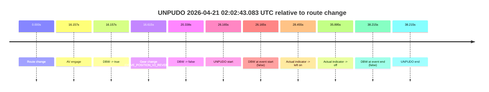
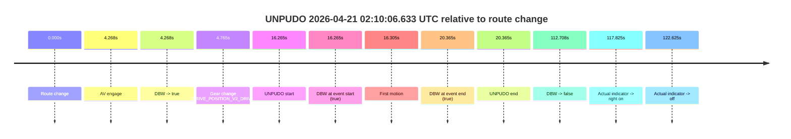
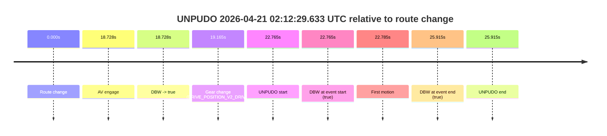

# Run Report: fme10011/2026-04-21--01-57-37--gen2-av-a88efe8f-e30d-48f7-917f-6b5f2e5fd4ea

| Field | Value |
|---|---|
| Run ID | `fme10011/2026-04-21--01-57-37--gen2-av-a88efe8f-e30d-48f7-917f-6b5f2e5fd4ea` |
| Date | `2026-04-21` |
| Model(s) | `eel-teal-outspoken` |
| Author | `zak` |
| Event count | `3` |

## unpudo 2026-04-21 02:02:43.083 UTC

| Field | Value |
|---|---|
| Model | `eel-teal-outspoken` |
| Author | `zak` |
| Run ID | `fme10011/2026-04-21--01-57-37--gen2-av-a88efe8f-e30d-48f7-917f-6b5f2e5fd4ea` |
| Date | `2026-04-21` |
| Time (UTC) | `02:02:43.083` |
| Event type | `unpudo` |
| Disengagement type | `none observed` |
| Route change | `found` |
| Console | [run](https://console.sso.wayve.ai/run/fme10011/2026-04-21--01-57-37--gen2-av-a88efe8f-e30d-48f7-917f-6b5f2e5fd4ea?id=&time-unixus=1776736963083301) |
| Foxglove | [segment](https://app.foxglove.dev/wayve-on-prem/p/prj_0dX18KZdVHg1fmmI/view?ds=foxglove-stream&ds.deviceName=fme10011&ds.start=2026-04-21T02%3A02%3A06.918255Z&ds.end=2026-04-21T02%3A03%3A05.133296Z&layoutId=lay_0e7VD4WIKDQGU73Y&time=2026-04-21T02%3A02%3A43.083301Z) |

### Event card: fail

- Fail: the credited unpudo does not stay AV-owned. The event window starts with DBW false, and the maneuver outcome lands outside a clean AV-owned segment.

| Event | Time (UTC) | Delta from route change |
|---|---:|---:|
| Route change | 2026-04-21 02:02:16.918 | `0.000s` |
| AV engage | 2026-04-21 02:02:33.075 | `16.157s` |
| DBW -> true | 2026-04-21 02:02:33.075 | `16.157s` |
| Gear change (DRIVE_POSITION_V2_REVERSE) | 2026-04-21 02:02:33.533 | `16.615s` |
| DBW -> false | 2026-04-21 02:02:37.256 | `20.338s` |
| UNPUDO start | 2026-04-21 02:02:43.083 | `26.165s` |
| DBW at event start (false) | 2026-04-21 02:02:43.083 | `26.165s` |
| Actual indicator -> left on | 2026-04-21 02:02:45.372 | `28.455s` |
| Actual indicator -> off | 2026-04-21 02:02:52.812 | `35.895s` |
| DBW at event end (false) | 2026-04-21 02:02:55.133 | `38.215s` |
| UNPUDO end | 2026-04-21 02:02:55.133 | `38.215s` |

| Metric | Value |
|---|---|
| Outcome | `fail` |
| Effective failure type | `not_av_owned` |
| Route change status | `found` |
| DBW at event start | `false` |
| DBW at event end | `false` |
| Predicted gear at AV start | `DRIVE_POSITION_V2_REVERSE` |
| Actual gear at AV start | `DRIVE_POSITION_V2_PARK` |
| Predicted gear at event start | `DRIVE_POSITION_V2_REVERSE` |
| Actual gear at event start | `DRIVE_POSITION_V2_REVERSE` |
| Planned indicator direction | `INDICATORS_STATE_V2_OFF` |
| Controller indicator direction | `INDICATORS_STATE_V2_OFF` |
| Actual indicator direction | `INDICATORS_STATE_V2_OFF` |
| Actual indicator at maneuver end | `INDICATORS_STATE_V2_OFF` |
| Driver accel help in AV | `false` |
| Driver accel help timestamp | `n/a` |
| Max accel pedal pct in AV | `0.0%` |
| Max brake pedal pct in AV | `10.9%` |
| Max speed mps in AV | `0.000` |
| Success timing baseline | `route change` |
| Route -> AV | `16.157s` |
| AV -> event start | `10.008s` |
| AV -> first motion | `n/a` |
| Success baseline -> event start | `26.165s` |
| Success baseline -> first motion | `n/a` |
| AV duration before disengagement | `4.181s` |
| Trajectory waypoint count | `36` |
| Driving-plan step count | `11` |

The scored portion starts from the AV-owned window, not from the pre-AV setup. Route-change search in the stopped pre-event segment was `found`, with the baseline therefore set to route change. At the event anchor the model predicts `DRIVE_POSITION_V2_REVERSE` and the actual gear is `DRIVE_POSITION_V2_REVERSE`. The effective model outcome is `fail` because `not_av_owned.`

### Resolution

| Field | Value |
|---|---|
| Final outcome | `fail` |
| Do we agree with this label? | `yes` |
| Source disengagement type | `none observed` |
| Resolved effective failure type | `not_av_owned` |
| Confidence | `high` |

## unpudo 2026-04-21 02:10:06.633 UTC

| Field | Value |
|---|---|
| Model | `eel-teal-outspoken` |
| Author | `zak` |
| Run ID | `fme10011/2026-04-21--01-57-37--gen2-av-a88efe8f-e30d-48f7-917f-6b5f2e5fd4ea` |
| Date | `2026-04-21` |
| Time (UTC) | `02:10:06.633` |
| Event type | `unpudo` |
| Disengagement type | `none observed` |
| Route change | `found` |
| Console | [run](https://console.sso.wayve.ai/run/fme10011/2026-04-21--01-57-37--gen2-av-a88efe8f-e30d-48f7-917f-6b5f2e5fd4ea?id=&time-unixus=1776737406633303) |
| Foxglove | [segment](https://app.foxglove.dev/wayve-on-prem/p/prj_0dX18KZdVHg1fmmI/view?ds=foxglove-stream&ds.deviceName=fme10011&ds.start=2026-04-21T02%3A09%3A40.368253Z&ds.end=2026-04-21T02%3A11%3A53.076057Z&layoutId=lay_0e7VD4WIKDQGU73Y&time=2026-04-21T02%3A10%3A06.633303Z) |

### Event card: pass

- Pass: AV owns the credited unpudo from route change through the official unpudo window, the gear state is aligned at the anchor, and the vehicle moves without driver accelerator help in AV.

| Event | Time (UTC) | Delta from route change |
|---|---:|---:|
| Route change | 2026-04-21 02:09:50.368 | `0.000s` |
| AV engage | 2026-04-21 02:09:54.636 | `4.268s` |
| DBW -> true | 2026-04-21 02:09:54.636 | `4.268s` |
| Gear change (DRIVE_POSITION_V2_DRIVE) | 2026-04-21 02:09:55.133 | `4.765s` |
| UNPUDO start | 2026-04-21 02:10:06.633 | `16.265s` |
| DBW at event start (true) | 2026-04-21 02:10:06.633 | `16.265s` |
| First motion | 2026-04-21 02:10:06.673 | `16.305s` |
| DBW at event end (true) | 2026-04-21 02:10:10.733 | `20.365s` |
| UNPUDO end | 2026-04-21 02:10:10.733 | `20.365s` |
| DBW -> false | 2026-04-21 02:11:43.076 | `112.708s` |
| Actual indicator -> right on | 2026-04-21 02:11:48.192 | `117.825s` |
| Actual indicator -> off | 2026-04-21 02:11:52.992 | `122.625s` |

| Metric | Value |
|---|---|
| Outcome | `pass` |
| Effective failure type | `none` |
| Route change status | `found` |
| DBW at event start | `true` |
| DBW at event end | `true` |
| Predicted gear at AV start | `DRIVE_POSITION_V2_DRIVE` |
| Actual gear at AV start | `DRIVE_POSITION_V2_PARK` |
| Predicted gear at event start | `DRIVE_POSITION_V2_DRIVE` |
| Actual gear at event start | `DRIVE_POSITION_V2_DRIVE` |
| Planned indicator direction | `INDICATORS_STATE_V2_LEFT_ON` |
| Controller indicator direction | `INDICATORS_STATE_V2_LEFT_ON` |
| Actual indicator direction | `INDICATORS_STATE_V2_OFF` |
| Actual indicator at maneuver end | `INDICATORS_STATE_V2_OFF` |
| Driver accel help in AV | `false` |
| Driver accel help timestamp | `n/a` |
| Max accel pedal pct in AV | `0.0%` |
| Max brake pedal pct in AV | `8.3%` |
| Max speed mps in AV | `5.089` |
| Success timing baseline | `route change` |
| Route -> AV | `4.268s` |
| AV -> event start | `11.997s` |
| AV -> first motion | `12.037s` |
| Success baseline -> event start | `16.265s` |
| Success baseline -> first motion | `16.305s` |
| AV duration before disengagement | `108.440s` |
| Trajectory waypoint count | `37` |
| Driving-plan step count | `11` |

The scored portion starts from the AV-owned window, not from the pre-AV setup. Route-change search in the stopped pre-event segment was `found`, with the baseline therefore set to route change. At the event anchor the model predicts `DRIVE_POSITION_V2_DRIVE` and the actual gear is `DRIVE_POSITION_V2_DRIVE`. The effective model outcome is `pass` because `the credited unpudo stays AV-owned through the official unpudo window.`

### Resolution

| Field | Value |
|---|---|
| Final outcome | `pass` |
| Do we agree with this label? | `yes` |
| Source disengagement type | `none observed` |
| Resolved effective failure type | `none` |
| Confidence | `high` |

## unpudo 2026-04-21 02:12:29.633 UTC

| Field | Value |
|---|---|
| Model | `eel-teal-outspoken` |
| Author | `zak` |
| Run ID | `fme10011/2026-04-21--01-57-37--gen2-av-a88efe8f-e30d-48f7-917f-6b5f2e5fd4ea` |
| Date | `2026-04-21` |
| Time (UTC) | `02:12:29.633` |
| Event type | `unpudo` |
| Disengagement type | `none observed` |
| Route change | `found` |
| Console | [run](https://console.sso.wayve.ai/run/fme10011/2026-04-21--01-57-37--gen2-av-a88efe8f-e30d-48f7-917f-6b5f2e5fd4ea?id=&time-unixus=1776737549633300) |
| Foxglove | [segment](https://app.foxglove.dev/wayve-on-prem/p/prj_0dX18KZdVHg1fmmI/view?ds=foxglove-stream&ds.deviceName=fme10011&ds.start=2026-04-21T02%3A11%3A56.868272Z&ds.end=2026-04-21T02%3A12%3A42.783306Z&layoutId=lay_0e7VD4WIKDQGU73Y&time=2026-04-21T02%3A12%3A29.633300Z) |

### Event card: pass

- Pass: AV owns the credited unpudo from route change through the official unpudo window, the gear state is aligned at the anchor, and the vehicle moves without driver accelerator help in AV.

| Event | Time (UTC) | Delta from route change |
|---|---:|---:|
| Route change | 2026-04-21 02:12:06.868 | `0.000s` |
| AV engage | 2026-04-21 02:12:25.596 | `18.728s` |
| DBW -> true | 2026-04-21 02:12:25.596 | `18.728s` |
| Gear change (DRIVE_POSITION_V2_DRIVE) | 2026-04-21 02:12:26.033 | `19.165s` |
| UNPUDO start | 2026-04-21 02:12:29.633 | `22.765s` |
| DBW at event start (true) | 2026-04-21 02:12:29.633 | `22.765s` |
| First motion | 2026-04-21 02:12:29.652 | `22.785s` |
| DBW at event end (true) | 2026-04-21 02:12:32.783 | `25.915s` |
| UNPUDO end | 2026-04-21 02:12:32.783 | `25.915s` |

| Metric | Value |
|---|---|
| Outcome | `pass` |
| Effective failure type | `none` |
| Route change status | `found` |
| DBW at event start | `true` |
| DBW at event end | `true` |
| Predicted gear at AV start | `DRIVE_POSITION_V2_DRIVE` |
| Actual gear at AV start | `DRIVE_POSITION_V2_PARK` |
| Predicted gear at event start | `DRIVE_POSITION_V2_DRIVE` |
| Actual gear at event start | `DRIVE_POSITION_V2_DRIVE` |
| Planned indicator direction | `INDICATORS_STATE_V2_LEFT_ON` |
| Controller indicator direction | `INDICATORS_STATE_V2_LEFT_ON` |
| Actual indicator direction | `INDICATORS_STATE_V2_OFF` |
| Actual indicator at maneuver end | `INDICATORS_STATE_V2_OFF` |
| Driver accel help in AV | `false` |
| Driver accel help timestamp | `n/a` |
| Max accel pedal pct in AV | `0.0%` |
| Max brake pedal pct in AV | `25.8%` |
| Max speed mps in AV | `5.750` |
| Success timing baseline | `route change` |
| Route -> AV | `18.728s` |
| AV -> event start | `4.037s` |
| AV -> first motion | `4.057s` |
| Success baseline -> event start | `22.765s` |
| Success baseline -> first motion | `22.785s` |
| AV duration before disengagement | `n/a` |
| Trajectory waypoint count | `37` |
| Driving-plan step count | `11` |

The scored portion starts from the AV-owned window, not from the pre-AV setup. Route-change search in the stopped pre-event segment was `found`, with the baseline therefore set to route change. At the event anchor the model predicts `DRIVE_POSITION_V2_DRIVE` and the actual gear is `DRIVE_POSITION_V2_DRIVE`. The effective model outcome is `pass` because `the credited unpudo stays AV-owned through the official unpudo window.`

### Resolution

| Field | Value |
|---|---|
| Final outcome | `pass` |
| Do we agree with this label? | `yes` |
| Source disengagement type | `none observed` |
| Resolved effective failure type | `none` |
| Confidence | `high` |
