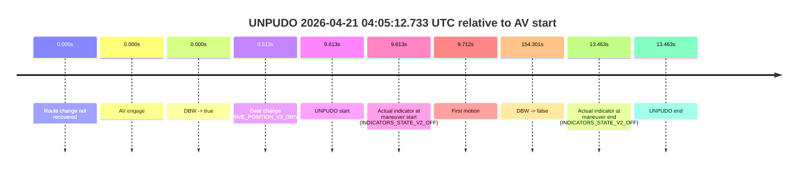
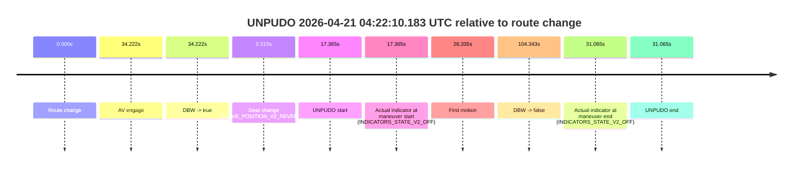
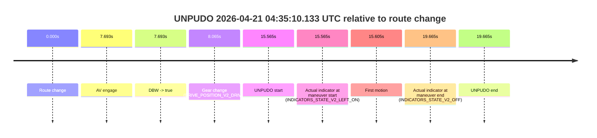

# Run Report: fme10011/2026-04-21--03-43-39--gen2-av-b428b172-abef-437f-9f20-d7e41dc7c203

| Field | Value |
|---|---|
| Run ID | `fme10011/2026-04-21--03-43-39--gen2-av-b428b172-abef-437f-9f20-d7e41dc7c203` |
| Date | `2026-04-21` |
| Model(s) | `blue-panther-solid` |
| Author | `guy.geva` |
| Event count | `8` |

## unpudo 2026-04-21 03:47:32.033 UTC

| Field | Value |
|---|---|
| Model | `blue-panther-solid` |
| Author | `guy.geva` |
| Run ID | `fme10011/2026-04-21--03-43-39--gen2-av-b428b172-abef-437f-9f20-d7e41dc7c203` |
| Date | `2026-04-21` |
| Time (UTC) | `03:47:32.033` |
| Event type | `unpudo` |
| Disengagement type | `none observed` |
| Route change | `found` |
| Console | [run](https://console.sso.wayve.ai/run/fme10011/2026-04-21--03-43-39--gen2-av-b428b172-abef-437f-9f20-d7e41dc7c203?id=&time-unixus=1776743252033297) |
| Foxglove | [segment](https://app.foxglove.dev/wayve-on-prem/p/prj_0dX18KZdVHg1fmmI/view?ds=foxglove-stream&ds.deviceName=fme10011&ds.start=2026-04-21T03%3A46%3A00.118293Z&ds.end=2026-04-21T03%3A52%3A14.401666Z&layoutId=lay_0e7VD4WIKDQGU73Y&time=2026-04-21T03%3A47%3A32.033297Z) |

### Event card: non-av

- Non-AV: there is no AV-owned portion anywhere inside the detected unpudo timeline, so it is kept for coverage but excluded from model success / failure scoring.

| Event | Time (UTC) | Delta from route change |
|---|---:|---:|
| Route change | 2026-04-21 03:46:10.118 | `0.000s` |
| AV engage | 2026-04-21 03:47:47.121 | `97.003s` |
| DBW -> true | 2026-04-21 03:47:47.121 | `97.003s` |
| Gear change (DRIVE_POSITION_V2_DRIVE) | 2026-04-21 03:47:30.783 | `80.665s` |
| UNPUDO start | 2026-04-21 03:47:32.033 | `81.915s` |
| Actual indicator at maneuver start (INDICATORS_STATE_V2_OFF) | 2026-04-21 03:47:32.033 | `81.915s` |
| First motion | 2026-04-21 03:47:32.053 | `81.935s` |
| DBW -> false | 2026-04-21 03:52:04.401 | `354.283s` |
| Actual indicator at maneuver end (INDICATORS_STATE_V2_LEFT_ON) | 2026-04-21 03:47:37.033 | `86.915s` |
| UNPUDO end | 2026-04-21 03:47:37.033 | `86.915s` |

| Metric | Value |
|---|---|
| Outcome | `non-av` |
| Effective failure type | `none` |
| Route change status | `found` |
| DBW at event start | `false` |
| DBW at event end | `false` |
| Predicted gear at AV start | `DRIVE_POSITION_V2_DRIVE` |
| Actual gear at AV start | `DRIVE_POSITION_V2_DRIVE` |
| Predicted gear at event start | `DRIVE_POSITION_V2_DRIVE` |
| Actual gear at event start | `DRIVE_POSITION_V2_DRIVE` |
| Planned indicator direction | `INDICATORS_STATE_V2_OFF` |
| Controller indicator direction | `INDICATORS_STATE_V2_OFF` |
| Actual indicator direction | `INDICATORS_STATE_V2_OFF` |
| Actual indicator at maneuver end | `INDICATORS_STATE_V2_LEFT_ON` |
| Driver accel help in AV | `false` |
| Driver accel help timestamp | `n/a` |
| Max accel pedal pct in AV | `0.0%` |
| Max brake pedal pct in AV | `0.0%` |
| Max speed mps in AV | `0.000` |
| Route -> AV | `97.003s` |
| AV -> event start | `-15.088s` |
| AV -> first motion | `-15.068s` |
| AV duration before disengagement | `257.280s` |
| Trajectory waypoint count | `36` |
| Driving-plan step count | `11` |

The scored portion starts from the AV-owned window, not from the pre-AV setup. Route-change search in the stopped pre-event segment was `found`, with the baseline therefore set to route change. At the event anchor the model predicts `DRIVE_POSITION_V2_DRIVE` and the actual gear is `DRIVE_POSITION_V2_DRIVE`. The effective model outcome is `non-av` because `there is no AV-owned overlap inside the event timeline`.

### Resolution

| Field | Value |
|---|---|
| Final outcome | `non-av` |
| Do we agree with this label? | `yes` |
| Source disengagement type | `none observed` |
| Resolved effective failure type | `none` |
| Confidence | `high` |

## unpudo 2026-04-21 03:55:01.333 UTC

| Field | Value |
|---|---|
| Model | `blue-panther-solid` |
| Author | `guy.geva` |
| Run ID | `fme10011/2026-04-21--03-43-39--gen2-av-b428b172-abef-437f-9f20-d7e41dc7c203` |
| Date | `2026-04-21` |
| Time (UTC) | `03:55:01.333` |
| Event type | `unpudo` |
| Disengagement type | `none observed` |
| Route change | `found` |
| Console | [run](https://console.sso.wayve.ai/run/fme10011/2026-04-21--03-43-39--gen2-av-b428b172-abef-437f-9f20-d7e41dc7c203?id=&time-unixus=1776743701333296) |
| Foxglove | [segment](https://app.foxglove.dev/wayve-on-prem/p/prj_0dX18KZdVHg1fmmI/view?ds=foxglove-stream&ds.deviceName=fme10011&ds.start=2026-04-21T03%3A53%3A16.218261Z&ds.end=2026-04-21T03%3A55%3A29.720484Z&layoutId=lay_0e7VD4WIKDQGU73Y&time=2026-04-21T03%3A55%3A01.333296Z) |

### Event card: non-av

- Non-AV: there is no AV-owned portion anywhere inside the detected unpudo timeline, so it is kept for coverage but excluded from model success / failure scoring.

| Event | Time (UTC) | Delta from route change |
|---|---:|---:|
| Route change | 2026-04-21 03:53:26.218 | `0.000s` |
| AV engage | 2026-04-21 03:55:08.101 | `101.883s` |
| DBW -> true | 2026-04-21 03:55:08.101 | `101.883s` |
| Gear change (DRIVE_POSITION_V2_DRIVE) | 2026-04-21 03:54:49.183 | `82.965s` |
| UNPUDO start | 2026-04-21 03:55:01.333 | `95.115s` |
| Actual indicator at maneuver start (INDICATORS_STATE_V2_OFF) | 2026-04-21 03:55:01.333 | `95.115s` |
| First motion | 2026-04-21 03:55:01.472 | `95.255s` |
| DBW -> false | 2026-04-21 03:55:19.720 | `113.502s` |
| Actual indicator at maneuver end (INDICATORS_STATE_V2_OFF) | 2026-04-21 03:55:05.433 | `99.215s` |
| UNPUDO end | 2026-04-21 03:55:05.433 | `99.215s` |

| Metric | Value |
|---|---|
| Outcome | `non-av` |
| Effective failure type | `none` |
| Route change status | `found` |
| DBW at event start | `false` |
| DBW at event end | `false` |
| Predicted gear at AV start | `DRIVE_POSITION_V2_DRIVE` |
| Actual gear at AV start | `DRIVE_POSITION_V2_DRIVE` |
| Predicted gear at event start | `DRIVE_POSITION_V2_DRIVE` |
| Actual gear at event start | `DRIVE_POSITION_V2_DRIVE` |
| Planned indicator direction | `INDICATORS_STATE_V2_LEFT_ON` |
| Controller indicator direction | `INDICATORS_STATE_V2_LEFT_ON` |
| Actual indicator direction | `INDICATORS_STATE_V2_OFF` |
| Actual indicator at maneuver end | `INDICATORS_STATE_V2_OFF` |
| Driver accel help in AV | `false` |
| Driver accel help timestamp | `n/a` |
| Max accel pedal pct in AV | `0.0%` |
| Max brake pedal pct in AV | `0.0%` |
| Max speed mps in AV | `0.000` |
| Route -> AV | `101.883s` |
| AV -> event start | `-6.768s` |
| AV -> first motion | `-6.629s` |
| AV duration before disengagement | `11.619s` |
| Trajectory waypoint count | `36` |
| Driving-plan step count | `11` |

The scored portion starts from the AV-owned window, not from the pre-AV setup. Route-change search in the stopped pre-event segment was `found`, with the baseline therefore set to route change. At the event anchor the model predicts `DRIVE_POSITION_V2_DRIVE` and the actual gear is `DRIVE_POSITION_V2_DRIVE`. The effective model outcome is `non-av` because `there is no AV-owned overlap inside the event timeline`.

### Resolution

| Field | Value |
|---|---|
| Final outcome | `non-av` |
| Do we agree with this label? | `yes` |
| Source disengagement type | `none observed` |
| Resolved effective failure type | `none` |
| Confidence | `high` |

## unpudo 2026-04-21 03:58:19.833 UTC

| Field | Value |
|---|---|
| Model | `blue-panther-solid` |
| Author | `guy.geva` |
| Run ID | `fme10011/2026-04-21--03-43-39--gen2-av-b428b172-abef-437f-9f20-d7e41dc7c203` |
| Date | `2026-04-21` |
| Time (UTC) | `03:58:19.833` |
| Event type | `unpudo` |
| Disengagement type | `none observed` |
| Route change | `found` |
| Console | [run](https://console.sso.wayve.ai/run/fme10011/2026-04-21--03-43-39--gen2-av-b428b172-abef-437f-9f20-d7e41dc7c203?id=&time-unixus=1776743899833298) |
| Foxglove | [segment](https://app.foxglove.dev/wayve-on-prem/p/prj_0dX18KZdVHg1fmmI/view?ds=foxglove-stream&ds.deviceName=fme10011&ds.start=2026-04-21T03%3A57%3A50.868456Z&ds.end=2026-04-21T03%3A58%3A37.283289Z&layoutId=lay_0e7VD4WIKDQGU73Y&time=2026-04-21T03%3A58%3A19.833298Z) |

### Event card: accidental

- Accidental: AV ownership is present for less than `2s`, so this is treated as an accidental brush with the maneuver rather than a meaningful model attempt.

| Event | Time (UTC) | Delta from route change |
|---|---:|---:|
| Route change | 2026-04-21 03:58:00.868 | `0.000s` |
| AV engage | 2026-04-21 03:58:15.780 | `14.912s` |
| DBW -> true | 2026-04-21 03:58:15.780 | `14.912s` |
| Gear change (DRIVE_POSITION_V2_DRIVE) | 2026-04-21 03:58:16.133 | `15.265s` |
| UNPUDO start | 2026-04-21 03:58:19.833 | `18.965s` |
| Actual indicator at maneuver start (INDICATORS_STATE_V2_OFF) | 2026-04-21 03:58:19.833 | `18.965s` |
| First motion | 2026-04-21 03:58:19.873 | `19.005s` |
| DBW -> false | 2026-04-21 03:58:21.501 | `20.633s` |
| Actual indicator at maneuver end (INDICATORS_STATE_V2_RIGHT_ON) | 2026-04-21 03:58:27.283 | `26.415s` |
| UNPUDO end | 2026-04-21 03:58:27.283 | `26.415s` |

| Metric | Value |
|---|---|
| Outcome | `accidental` |
| Effective failure type | `none` |
| Route change status | `found` |
| DBW at event start | `true` |
| DBW at event end | `false` |
| Predicted gear at AV start | `DRIVE_POSITION_V2_DRIVE` |
| Actual gear at AV start | `DRIVE_POSITION_V2_PARK` |
| Predicted gear at event start | `DRIVE_POSITION_V2_DRIVE` |
| Actual gear at event start | `DRIVE_POSITION_V2_DRIVE` |
| Planned indicator direction | `INDICATORS_STATE_V2_RIGHT_ON` |
| Controller indicator direction | `INDICATORS_STATE_V2_RIGHT_ON` |
| Actual indicator direction | `INDICATORS_STATE_V2_OFF` |
| Actual indicator at maneuver end | `INDICATORS_STATE_V2_RIGHT_ON` |
| Driver accel help in AV | `false` |
| Driver accel help timestamp | `n/a` |
| Max accel pedal pct in AV | `0.0%` |
| Max brake pedal pct in AV | `0.0%` |
| Max speed mps in AV | `2.586` |
| Route -> AV | `14.912s` |
| AV -> event start | `4.053s` |
| AV -> first motion | `4.092s` |
| AV duration before disengagement | `5.721s` |
| Trajectory waypoint count | `36` |
| Driving-plan step count | `11` |

The scored portion starts from the AV-owned window, not from the pre-AV setup. Route-change search in the stopped pre-event segment was `found`, with the baseline therefore set to route change. At the event anchor the model predicts `DRIVE_POSITION_V2_DRIVE` and the actual gear is `DRIVE_POSITION_V2_DRIVE`. The effective model outcome is `accidental` because `the AV-owned portion is shorter than 2s`.

### Resolution

| Field | Value |
|---|---|
| Final outcome | `accidental` |
| Do we agree with this label? | `yes` |
| Source disengagement type | `none observed` |
| Resolved effective failure type | `none` |
| Confidence | `high` |

## unpudo 2026-04-21 04:05:12.733 UTC

| Field | Value |
|---|---|
| Model | `blue-panther-solid` |
| Author | `guy.geva` |
| Run ID | `fme10011/2026-04-21--03-43-39--gen2-av-b428b172-abef-437f-9f20-d7e41dc7c203` |
| Date | `2026-04-21` |
| Time (UTC) | `04:05:12.733` |
| Event type | `unpudo` |
| Disengagement type | `none observed` |
| Route change | `not found` |
| Console | [run](https://console.sso.wayve.ai/run/fme10011/2026-04-21--03-43-39--gen2-av-b428b172-abef-437f-9f20-d7e41dc7c203?id=&time-unixus=1776744312733305) |
| Foxglove | [segment](https://app.foxglove.dev/wayve-on-prem/p/prj_0dX18KZdVHg1fmmI/view?ds=foxglove-stream&ds.deviceName=fme10011&ds.start=2026-04-21T04%3A04%3A53.120710Z&ds.end=2026-04-21T04%3A07%3A47.421820Z&layoutId=lay_0e7VD4WIKDQGU73Y&time=2026-04-21T04%3A05%3A12.733305Z) |

### Event card: pass

- Pass: AV owns the credited unpudo through the official event window, the gear state is aligned at the anchor, and the vehicle moves without driver accelerator help in AV.

| Event | Time (UTC) | Delta from AV start |
|---|---:|---:|
| Route change not recovered | 2026-04-21 04:05:03.120 | `0.000s` |
| AV engage | 2026-04-21 04:05:03.120 | `0.000s` |
| DBW -> true | 2026-04-21 04:05:03.120 | `0.000s` |
| Gear change (DRIVE_POSITION_V2_DRIVE) | 2026-04-21 04:05:03.633 | `0.513s` |
| UNPUDO start | 2026-04-21 04:05:12.733 | `9.613s` |
| Actual indicator at maneuver start (INDICATORS_STATE_V2_OFF) | 2026-04-21 04:05:12.733 | `9.613s` |
| First motion | 2026-04-21 04:05:12.832 | `9.712s` |
| DBW -> false | 2026-04-21 04:07:37.421 | `154.301s` |
| Actual indicator at maneuver end (INDICATORS_STATE_V2_OFF) | 2026-04-21 04:05:16.583 | `13.463s` |
| UNPUDO end | 2026-04-21 04:05:16.583 | `13.463s` |

| Metric | Value |
|---|---|
| Outcome | `pass` |
| Effective failure type | `none` |
| Route change status | `not found` |
| DBW at event start | `true` |
| DBW at event end | `true` |
| Predicted gear at AV start | `DRIVE_POSITION_V2_DRIVE` |
| Actual gear at AV start | `DRIVE_POSITION_V2_PARK` |
| Predicted gear at event start | `DRIVE_POSITION_V2_DRIVE` |
| Actual gear at event start | `DRIVE_POSITION_V2_DRIVE` |
| Planned indicator direction | `INDICATORS_STATE_V2_LEFT_ON` |
| Controller indicator direction | `INDICATORS_STATE_V2_LEFT_ON` |
| Actual indicator direction | `INDICATORS_STATE_V2_OFF` |
| Actual indicator at maneuver end | `INDICATORS_STATE_V2_OFF` |
| Driver accel help in AV | `false` |
| Driver accel help timestamp | `n/a` |
| Max accel pedal pct in AV | `0.0%` |
| Max brake pedal pct in AV | `0.0%` |
| Max speed mps in AV | `5.164` |
| Route -> AV | `n/a` |
| AV -> event start | `9.613s` |
| AV -> first motion | `9.712s` |
| AV duration before disengagement | `154.301s` |
| Trajectory waypoint count | `36` |
| Driving-plan step count | `11` |

The scored portion starts from the AV-owned window, not from the pre-AV setup. Route-change search in the stopped pre-event segment was `not found`, with the baseline therefore set to AV start. At the event anchor the model predicts `DRIVE_POSITION_V2_DRIVE` and the actual gear is `DRIVE_POSITION_V2_DRIVE`. The effective model outcome is `pass` because `the credited maneuver stays AV-owned through the official event end`.

### Resolution

| Field | Value |
|---|---|
| Final outcome | `pass` |
| Do we agree with this label? | `yes` |
| Source disengagement type | `none observed` |
| Resolved effective failure type | `none` |
| Confidence | `high` |

## unpudo 2026-04-21 04:13:11.733 UTC

| Field | Value |
|---|---|
| Model | `blue-panther-solid` |
| Author | `guy.geva` |
| Run ID | `fme10011/2026-04-21--03-43-39--gen2-av-b428b172-abef-437f-9f20-d7e41dc7c203` |
| Date | `2026-04-21` |
| Time (UTC) | `04:13:11.733` |
| Event type | `unpudo` |
| Disengagement type | `none observed` |
| Route change | `found` |
| Console | [run](https://console.sso.wayve.ai/run/fme10011/2026-04-21--03-43-39--gen2-av-b428b172-abef-437f-9f20-d7e41dc7c203?id=&time-unixus=1776744791733315) |
| Foxglove | [segment](https://app.foxglove.dev/wayve-on-prem/p/prj_0dX18KZdVHg1fmmI/view?ds=foxglove-stream&ds.deviceName=fme10011&ds.start=2026-04-21T04%3A12%3A40.018266Z&ds.end=2026-04-21T04%3A13%3A53.501587Z&layoutId=lay_0e7VD4WIKDQGU73Y&time=2026-04-21T04%3A13%3A11.733315Z) |

### Event card: pass

- Pass: AV owns the credited unpudo through the official event window, the gear state is aligned at the anchor, and the vehicle moves without driver accelerator help in AV.

| Event | Time (UTC) | Delta from route change |
|---|---:|---:|
| Route change | 2026-04-21 04:12:50.018 | `0.000s` |
| AV engage | 2026-04-21 04:13:02.880 | `12.862s` |
| DBW -> true | 2026-04-21 04:13:02.880 | `12.862s` |
| Gear change (DRIVE_POSITION_V2_DRIVE) | 2026-04-21 04:13:03.333 | `13.315s` |
| UNPUDO start | 2026-04-21 04:13:11.733 | `21.715s` |
| Actual indicator at maneuver start (INDICATORS_STATE_V2_LEFT_ON) | 2026-04-21 04:13:11.733 | `21.715s` |
| First motion | 2026-04-21 04:13:11.792 | `21.775s` |
| DBW -> false | 2026-04-21 04:13:43.501 | `53.483s` |
| Actual indicator at maneuver end (INDICATORS_STATE_V2_OFF) | 2026-04-21 04:13:15.133 | `25.115s` |
| UNPUDO end | 2026-04-21 04:13:15.133 | `25.115s` |

| Metric | Value |
|---|---|
| Outcome | `pass` |
| Effective failure type | `none` |
| Route change status | `found` |
| DBW at event start | `true` |
| DBW at event end | `true` |
| Predicted gear at AV start | `DRIVE_POSITION_V2_DRIVE` |
| Actual gear at AV start | `DRIVE_POSITION_V2_PARK` |
| Predicted gear at event start | `DRIVE_POSITION_V2_DRIVE` |
| Actual gear at event start | `DRIVE_POSITION_V2_DRIVE` |
| Planned indicator direction | `INDICATORS_STATE_V2_LEFT_ON` |
| Controller indicator direction | `INDICATORS_STATE_V2_LEFT_ON` |
| Actual indicator direction | `INDICATORS_STATE_V2_LEFT_ON` |
| Actual indicator at maneuver end | `INDICATORS_STATE_V2_OFF` |
| Driver accel help in AV | `false` |
| Driver accel help timestamp | `n/a` |
| Max accel pedal pct in AV | `0.0%` |
| Max brake pedal pct in AV | `0.0%` |
| Max speed mps in AV | `5.714` |
| Route -> AV | `12.862s` |
| AV -> event start | `8.853s` |
| AV -> first motion | `8.912s` |
| AV duration before disengagement | `40.621s` |
| Trajectory waypoint count | `36` |
| Driving-plan step count | `11` |

The scored portion starts from the AV-owned window, not from the pre-AV setup. Route-change search in the stopped pre-event segment was `found`, with the baseline therefore set to route change. At the event anchor the model predicts `DRIVE_POSITION_V2_DRIVE` and the actual gear is `DRIVE_POSITION_V2_DRIVE`. The effective model outcome is `pass` because `the credited maneuver stays AV-owned through the official event end`.

### Resolution

| Field | Value |
|---|---|
| Final outcome | `pass` |
| Do we agree with this label? | `yes` |
| Source disengagement type | `none observed` |
| Resolved effective failure type | `none` |
| Confidence | `high` |

## unpudo 2026-04-21 04:20:02.083 UTC

| Field | Value |
|---|---|
| Model | `blue-panther-solid` |
| Author | `guy.geva` |
| Run ID | `fme10011/2026-04-21--03-43-39--gen2-av-b428b172-abef-437f-9f20-d7e41dc7c203` |
| Date | `2026-04-21` |
| Time (UTC) | `04:20:02.083` |
| Event type | `unpudo` |
| Disengagement type | `none observed` |
| Route change | `found` |
| Console | [run](https://console.sso.wayve.ai/run/fme10011/2026-04-21--03-43-39--gen2-av-b428b172-abef-437f-9f20-d7e41dc7c203?id=&time-unixus=1776745202083289) |
| Foxglove | [segment](https://app.foxglove.dev/wayve-on-prem/p/prj_0dX18KZdVHg1fmmI/view?ds=foxglove-stream&ds.deviceName=fme10011&ds.start=2026-04-21T04%3A18%3A24.268675Z&ds.end=2026-04-21T04%3A20%3A30.381773Z&layoutId=lay_0e7VD4WIKDQGU73Y&time=2026-04-21T04%3A20%3A02.083289Z) |

### Event card: non-av

- Non-AV: there is no AV-owned portion anywhere inside the detected unpudo timeline, so it is kept for coverage but excluded from model success / failure scoring.

| Event | Time (UTC) | Delta from route change |
|---|---:|---:|
| Route change | 2026-04-21 04:18:34.268 | `0.000s` |
| AV engage | 2026-04-21 04:20:09.821 | `95.553s` |
| DBW -> true | 2026-04-21 04:20:09.821 | `95.553s` |
| Gear change (DRIVE_POSITION_V2_DRIVE) | 2026-04-21 04:20:00.533 | `86.265s` |
| UNPUDO start | 2026-04-21 04:20:02.083 | `87.815s` |
| Actual indicator at maneuver start (INDICATORS_STATE_V2_OFF) | 2026-04-21 04:20:02.083 | `87.815s` |
| First motion | 2026-04-21 04:20:02.132 | `87.864s` |
| DBW -> false | 2026-04-21 04:20:20.381 | `106.113s` |
| Actual indicator at maneuver end (INDICATORS_STATE_V2_OFF) | 2026-04-21 04:20:05.933 | `91.665s` |
| UNPUDO end | 2026-04-21 04:20:05.933 | `91.665s` |

| Metric | Value |
|---|---|
| Outcome | `non-av` |
| Effective failure type | `none` |
| Route change status | `found` |
| DBW at event start | `false` |
| DBW at event end | `false` |
| Predicted gear at AV start | `DRIVE_POSITION_V2_DRIVE` |
| Actual gear at AV start | `DRIVE_POSITION_V2_DRIVE` |
| Predicted gear at event start | `DRIVE_POSITION_V2_DRIVE` |
| Actual gear at event start | `DRIVE_POSITION_V2_DRIVE` |
| Planned indicator direction | `INDICATORS_STATE_V2_LEFT_ON` |
| Controller indicator direction | `INDICATORS_STATE_V2_LEFT_ON` |
| Actual indicator direction | `INDICATORS_STATE_V2_OFF` |
| Actual indicator at maneuver end | `INDICATORS_STATE_V2_OFF` |
| Driver accel help in AV | `false` |
| Driver accel help timestamp | `n/a` |
| Max accel pedal pct in AV | `0.0%` |
| Max brake pedal pct in AV | `0.0%` |
| Max speed mps in AV | `0.000` |
| Route -> AV | `95.553s` |
| AV -> event start | `-7.738s` |
| AV -> first motion | `-7.689s` |
| AV duration before disengagement | `10.560s` |
| Trajectory waypoint count | `37` |
| Driving-plan step count | `11` |

The scored portion starts from the AV-owned window, not from the pre-AV setup. Route-change search in the stopped pre-event segment was `found`, with the baseline therefore set to route change. At the event anchor the model predicts `DRIVE_POSITION_V2_DRIVE` and the actual gear is `DRIVE_POSITION_V2_DRIVE`. The effective model outcome is `non-av` because `there is no AV-owned overlap inside the event timeline`.

### Resolution

| Field | Value |
|---|---|
| Final outcome | `non-av` |
| Do we agree with this label? | `yes` |
| Source disengagement type | `none observed` |
| Resolved effective failure type | `none` |
| Confidence | `high` |

## unpudo 2026-04-21 04:22:10.183 UTC

| Field | Value |
|---|---|
| Model | `blue-panther-solid` |
| Author | `guy.geva` |
| Run ID | `fme10011/2026-04-21--03-43-39--gen2-av-b428b172-abef-437f-9f20-d7e41dc7c203` |
| Date | `2026-04-21` |
| Time (UTC) | `04:22:10.183` |
| Event type | `unpudo` |
| Disengagement type | `none observed` |
| Route change | `found` |
| Console | [run](https://console.sso.wayve.ai/run/fme10011/2026-04-21--03-43-39--gen2-av-b428b172-abef-437f-9f20-d7e41dc7c203?id=&time-unixus=1776745330183301) |
| Foxglove | [segment](https://app.foxglove.dev/wayve-on-prem/p/prj_0dX18KZdVHg1fmmI/view?ds=foxglove-stream&ds.deviceName=fme10011&ds.start=2026-04-21T04%3A21%3A42.818486Z&ds.end=2026-04-21T04%3A23%3A47.161824Z&layoutId=lay_0e7VD4WIKDQGU73Y&time=2026-04-21T04%3A22%3A10.183301Z) |

### Event card: non-av

- Non-AV: there is no AV-owned portion anywhere inside the detected unpudo timeline, so it is kept for coverage but excluded from model success / failure scoring.

| Event | Time (UTC) | Delta from route change |
|---|---:|---:|
| Route change | 2026-04-21 04:21:52.818 | `0.000s` |
| AV engage | 2026-04-21 04:22:27.040 | `34.222s` |
| DBW -> true | 2026-04-21 04:22:27.040 | `34.222s` |
| Gear change (DRIVE_POSITION_V2_REVERSE) | 2026-04-21 04:21:53.133 | `0.315s` |
| UNPUDO start | 2026-04-21 04:22:10.183 | `17.365s` |
| Actual indicator at maneuver start (INDICATORS_STATE_V2_OFF) | 2026-04-21 04:22:10.183 | `17.365s` |
| First motion | 2026-04-21 04:22:19.153 | `26.335s` |
| DBW -> false | 2026-04-21 04:23:37.161 | `104.343s` |
| Actual indicator at maneuver end (INDICATORS_STATE_V2_OFF) | 2026-04-21 04:22:23.883 | `31.065s` |
| UNPUDO end | 2026-04-21 04:22:23.883 | `31.065s` |

| Metric | Value |
|---|---|
| Outcome | `non-av` |
| Effective failure type | `none` |
| Route change status | `found` |
| DBW at event start | `false` |
| DBW at event end | `false` |
| Predicted gear at AV start | `DRIVE_POSITION_V2_DRIVE` |
| Actual gear at AV start | `DRIVE_POSITION_V2_DRIVE` |
| Predicted gear at event start | `DRIVE_POSITION_V2_REVERSE` |
| Actual gear at event start | `DRIVE_POSITION_V2_REVERSE` |
| Planned indicator direction | `INDICATORS_STATE_V2_LEFT_ON` |
| Controller indicator direction | `INDICATORS_STATE_V2_LEFT_ON` |
| Actual indicator direction | `INDICATORS_STATE_V2_OFF` |
| Actual indicator at maneuver end | `INDICATORS_STATE_V2_OFF` |
| Driver accel help in AV | `false` |
| Driver accel help timestamp | `n/a` |
| Max accel pedal pct in AV | `0.0%` |
| Max brake pedal pct in AV | `0.0%` |
| Max speed mps in AV | `0.000` |
| Route -> AV | `34.222s` |
| AV -> event start | `-16.857s` |
| AV -> first motion | `-7.887s` |
| AV duration before disengagement | `70.121s` |
| Trajectory waypoint count | `37` |
| Driving-plan step count | `11` |

The scored portion starts from the AV-owned window, not from the pre-AV setup. Route-change search in the stopped pre-event segment was `found`, with the baseline therefore set to route change. At the event anchor the model predicts `DRIVE_POSITION_V2_REVERSE` and the actual gear is `DRIVE_POSITION_V2_REVERSE`. The effective model outcome is `non-av` because `there is no AV-owned overlap inside the event timeline`.

### Resolution

| Field | Value |
|---|---|
| Final outcome | `non-av` |
| Do we agree with this label? | `yes` |
| Source disengagement type | `none observed` |
| Resolved effective failure type | `none` |
| Confidence | `high` |

## unpudo 2026-04-21 04:35:10.133 UTC

| Field | Value |
|---|---|
| Model | `blue-panther-solid` |
| Author | `guy.geva` |
| Run ID | `fme10011/2026-04-21--03-43-39--gen2-av-b428b172-abef-437f-9f20-d7e41dc7c203` |
| Date | `2026-04-21` |
| Time (UTC) | `04:35:10.133` |
| Event type | `unpudo` |
| Disengagement type | `none observed` |
| Route change | `found` |
| Console | [run](https://console.sso.wayve.ai/run/fme10011/2026-04-21--03-43-39--gen2-av-b428b172-abef-437f-9f20-d7e41dc7c203?id=&time-unixus=1776746110133302) |
| Foxglove | [segment](https://app.foxglove.dev/wayve-on-prem/p/prj_0dX18KZdVHg1fmmI/view?ds=foxglove-stream&ds.deviceName=fme10011&ds.start=2026-04-21T04%3A34%3A44.568251Z&ds.end=2026-04-21T04%3A35%3A24.233312Z&layoutId=lay_0e7VD4WIKDQGU73Y&time=2026-04-21T04%3A35%3A10.133302Z) |

### Event card: pass

- Pass: AV owns the credited unpudo through the official event window, the gear state is aligned at the anchor, and the vehicle moves without driver accelerator help in AV.

| Event | Time (UTC) | Delta from route change |
|---|---:|---:|
| Route change | 2026-04-21 04:34:54.568 | `0.000s` |
| AV engage | 2026-04-21 04:35:02.260 | `7.693s` |
| DBW -> true | 2026-04-21 04:35:02.260 | `7.693s` |
| Gear change (DRIVE_POSITION_V2_DRIVE) | 2026-04-21 04:35:02.633 | `8.065s` |
| UNPUDO start | 2026-04-21 04:35:10.133 | `15.565s` |
| Actual indicator at maneuver start (INDICATORS_STATE_V2_LEFT_ON) | 2026-04-21 04:35:10.133 | `15.565s` |
| First motion | 2026-04-21 04:35:10.172 | `15.605s` |
| Actual indicator at maneuver end (INDICATORS_STATE_V2_OFF) | 2026-04-21 04:35:14.233 | `19.665s` |
| UNPUDO end | 2026-04-21 04:35:14.233 | `19.665s` |

| Metric | Value |
|---|---|
| Outcome | `pass` |
| Effective failure type | `none` |
| Route change status | `found` |
| DBW at event start | `true` |
| DBW at event end | `true` |
| Predicted gear at AV start | `DRIVE_POSITION_V2_DRIVE` |
| Actual gear at AV start | `DRIVE_POSITION_V2_PARK` |
| Predicted gear at event start | `DRIVE_POSITION_V2_DRIVE` |
| Actual gear at event start | `DRIVE_POSITION_V2_DRIVE` |
| Planned indicator direction | `INDICATORS_STATE_V2_LEFT_ON` |
| Controller indicator direction | `INDICATORS_STATE_V2_LEFT_ON` |
| Actual indicator direction | `INDICATORS_STATE_V2_LEFT_ON` |
| Actual indicator at maneuver end | `INDICATORS_STATE_V2_OFF` |
| Driver accel help in AV | `false` |
| Driver accel help timestamp | `n/a` |
| Max accel pedal pct in AV | `0.0%` |
| Max brake pedal pct in AV | `0.0%` |
| Max speed mps in AV | `4.331` |
| Route -> AV | `7.693s` |
| AV -> event start | `7.873s` |
| AV -> first motion | `7.912s` |
| AV duration before disengagement | `n/a` |
| Trajectory waypoint count | `38` |
| Driving-plan step count | `11` |

The scored portion starts from the AV-owned window, not from the pre-AV setup. Route-change search in the stopped pre-event segment was `found`, with the baseline therefore set to route change. At the event anchor the model predicts `DRIVE_POSITION_V2_DRIVE` and the actual gear is `DRIVE_POSITION_V2_DRIVE`. The effective model outcome is `pass` because `the credited maneuver stays AV-owned through the official event end`.

### Resolution

| Field | Value |
|---|---|
| Final outcome | `pass` |
| Do we agree with this label? | `yes` |
| Source disengagement type | `none observed` |
| Resolved effective failure type | `none` |
| Confidence | `high` |
