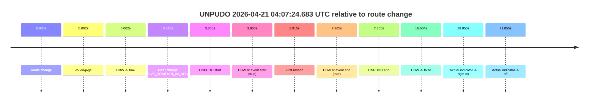
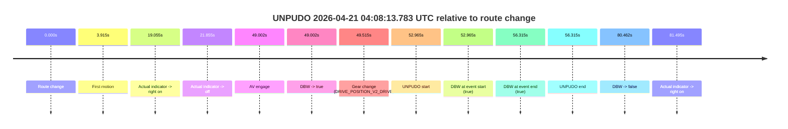
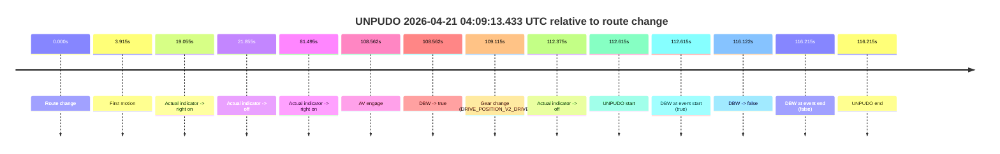
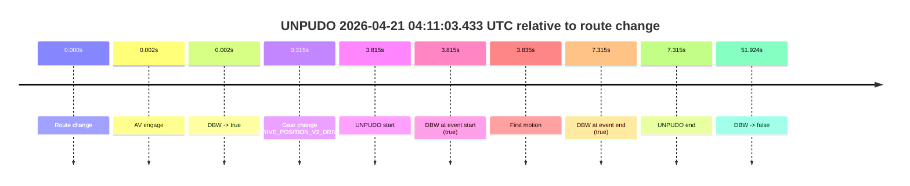
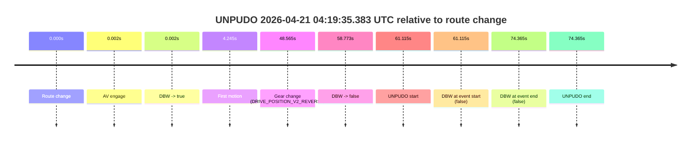
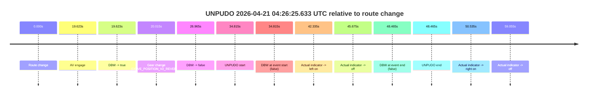
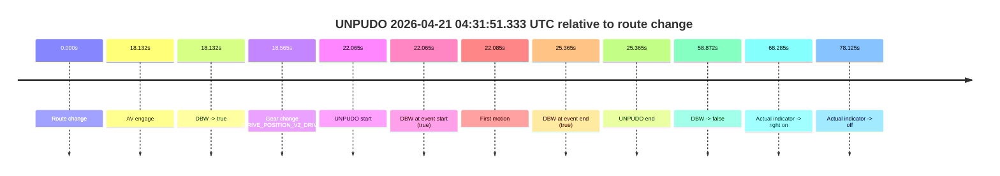
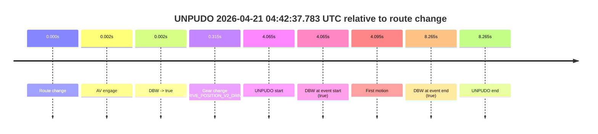
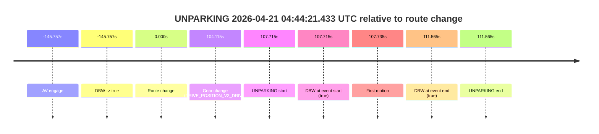

# Run Report: fme10011/2026-04-21--03-43-39--gen2-av-b428b172-abef-437f-9f20-d7e41dc7c203

| Field | Value |
|---|---|
| Run ID | `fme10011/2026-04-21--03-43-39--gen2-av-b428b172-abef-437f-9f20-d7e41dc7c203` |
| Date | `2026-04-21` |
| Model(s) | `eel-teal-outspoken` |
| Author | `zak` |
| Event count | `11` |

## unpudo 2026-04-21 04:07:24.683 UTC

| Field | Value |
|---|---|
| Model | `eel-teal-outspoken` |
| Author | `zak` |
| Run ID | `fme10011/2026-04-21--03-43-39--gen2-av-b428b172-abef-437f-9f20-d7e41dc7c203` |
| Date | `2026-04-21` |
| Time (UTC) | `04:07:24.683` |
| Event type | `unpudo` |
| Disengagement type | `none observed` |
| Route change | `found` |
| Console | [run](https://console.sso.wayve.ai/run/fme10011/2026-04-21--03-43-39--gen2-av-b428b172-abef-437f-9f20-d7e41dc7c203?id=&time-unixus=1776744444683307) |
| Foxglove | [segment](https://app.foxglove.dev/wayve-on-prem/p/prj_0dX18KZdVHg1fmmI/view?ds=foxglove-stream&ds.deviceName=fme10011&ds.start=2026-04-21T04%3A07%3A10.818229Z&ds.end=2026-04-21T04%3A07%3A47.421820Z&layoutId=lay_0e7VD4WIKDQGU73Y&time=2026-04-21T04%3A07%3A24.683307Z) |

### Event card: pass

- Pass: AV owns the credited unpudo from route change through the official unpudo window, the gear state is aligned at the anchor, and the vehicle moves without driver accelerator help in AV.

| Event | Time (UTC) | Delta from route change |
|---|---:|---:|
| Route change | 2026-04-21 04:07:20.818 | `0.000s` |
| AV engage | 2026-04-21 04:07:20.820 | `0.002s` |
| DBW -> true | 2026-04-21 04:07:20.820 | `0.002s` |
| Gear change (DRIVE_POSITION_V2_DRIVE) | 2026-04-21 04:07:21.133 | `0.315s` |
| UNPUDO start | 2026-04-21 04:07:24.683 | `3.865s` |
| DBW at event start (true) | 2026-04-21 04:07:24.683 | `3.865s` |
| First motion | 2026-04-21 04:07:24.733 | `3.915s` |
| DBW at event end (true) | 2026-04-21 04:07:28.183 | `7.365s` |
| UNPUDO end | 2026-04-21 04:07:28.183 | `7.365s` |
| DBW -> false | 2026-04-21 04:07:37.421 | `16.604s` |
| Actual indicator -> right on | 2026-04-21 04:07:39.873 | `19.055s` |
| Actual indicator -> off | 2026-04-21 04:07:42.672 | `21.855s` |

| Metric | Value |
|---|---|
| Outcome | `pass` |
| Effective failure type | `none` |
| Route change status | `found` |
| DBW at event start | `true` |
| DBW at event end | `true` |
| Predicted gear at AV start | `DRIVE_POSITION_V2_PARK` |
| Actual gear at AV start | `DRIVE_POSITION_V2_PARK` |
| Predicted gear at event start | `DRIVE_POSITION_V2_DRIVE` |
| Actual gear at event start | `DRIVE_POSITION_V2_DRIVE` |
| Planned indicator direction | `INDICATORS_STATE_V2_LEFT_ON` |
| Controller indicator direction | `INDICATORS_STATE_V2_OFF` |
| Actual indicator direction | `INDICATORS_STATE_V2_OFF` |
| Actual indicator at maneuver end | `INDICATORS_STATE_V2_OFF` |
| Driver accel help in AV | `false` |
| Driver accel help timestamp | `n/a` |
| Max accel pedal pct in AV | `0.0%` |
| Max brake pedal pct in AV | `8.0%` |
| Max speed mps in AV | `4.778` |
| Success timing baseline | `route change` |
| Route -> AV | `0.002s` |
| AV -> event start | `3.863s` |
| AV -> first motion | `3.912s` |
| Success baseline -> event start | `3.865s` |
| Success baseline -> first motion | `3.915s` |
| AV duration before disengagement | `16.601s` |
| Trajectory waypoint count | `37` |
| Driving-plan step count | `11` |

The scored portion starts from the AV-owned window, not from the pre-AV setup. Route-change search in the stopped pre-event segment was `found`, with the baseline therefore set to route change. At the event anchor the model predicts `DRIVE_POSITION_V2_DRIVE` and the actual gear is `DRIVE_POSITION_V2_DRIVE`. The effective model outcome is `pass` because `the credited unpudo stays AV-owned through the official unpudo window.`

### Resolution

| Field | Value |
|---|---|
| Final outcome | `pass` |
| Do we agree with this label? | `yes` |
| Source disengagement type | `none observed` |
| Resolved effective failure type | `none` |
| Confidence | `high` |

## unpudo 2026-04-21 04:08:13.783 UTC

| Field | Value |
|---|---|
| Model | `eel-teal-outspoken` |
| Author | `zak` |
| Run ID | `fme10011/2026-04-21--03-43-39--gen2-av-b428b172-abef-437f-9f20-d7e41dc7c203` |
| Date | `2026-04-21` |
| Time (UTC) | `04:08:13.783` |
| Event type | `unpudo` |
| Disengagement type | `none observed` |
| Route change | `found` |
| Console | [run](https://console.sso.wayve.ai/run/fme10011/2026-04-21--03-43-39--gen2-av-b428b172-abef-437f-9f20-d7e41dc7c203?id=&time-unixus=1776744493783311) |
| Foxglove | [segment](https://app.foxglove.dev/wayve-on-prem/p/prj_0dX18KZdVHg1fmmI/view?ds=foxglove-stream&ds.deviceName=fme10011&ds.start=2026-04-21T04%3A07%3A10.818229Z&ds.end=2026-04-21T04%3A08%3A51.280572Z&layoutId=lay_0e7VD4WIKDQGU73Y&time=2026-04-21T04%3A08%3A13.783311Z) |

### Event card: pass

- Pass: AV owns the credited unpudo from route change through the official unpudo window, the gear state is aligned at the anchor, and the vehicle moves without driver accelerator help in AV.

| Event | Time (UTC) | Delta from route change |
|---|---:|---:|
| Route change | 2026-04-21 04:07:20.818 | `0.000s` |
| First motion | 2026-04-21 04:07:24.733 | `3.915s` |
| Actual indicator -> right on | 2026-04-21 04:07:39.873 | `19.055s` |
| Actual indicator -> off | 2026-04-21 04:07:42.672 | `21.855s` |
| AV engage | 2026-04-21 04:08:09.820 | `49.002s` |
| DBW -> true | 2026-04-21 04:08:09.820 | `49.002s` |
| Gear change (DRIVE_POSITION_V2_DRIVE) | 2026-04-21 04:08:10.333 | `49.515s` |
| UNPUDO start | 2026-04-21 04:08:13.783 | `52.965s` |
| DBW at event start (true) | 2026-04-21 04:08:13.783 | `52.965s` |
| DBW at event end (true) | 2026-04-21 04:08:17.133 | `56.315s` |
| UNPUDO end | 2026-04-21 04:08:17.133 | `56.315s` |
| DBW -> false | 2026-04-21 04:08:41.280 | `80.462s` |
| Actual indicator -> right on | 2026-04-21 04:08:42.312 | `81.495s` |

| Metric | Value |
|---|---|
| Outcome | `pass` |
| Effective failure type | `none` |
| Route change status | `found` |
| DBW at event start | `true` |
| DBW at event end | `true` |
| Predicted gear at AV start | `DRIVE_POSITION_V2_DRIVE` |
| Actual gear at AV start | `DRIVE_POSITION_V2_PARK` |
| Predicted gear at event start | `DRIVE_POSITION_V2_DRIVE` |
| Actual gear at event start | `DRIVE_POSITION_V2_DRIVE` |
| Planned indicator direction | `INDICATORS_STATE_V2_LEFT_ON` |
| Controller indicator direction | `INDICATORS_STATE_V2_LEFT_ON` |
| Actual indicator direction | `INDICATORS_STATE_V2_OFF` |
| Actual indicator at maneuver end | `INDICATORS_STATE_V2_OFF` |
| Driver accel help in AV | `false` |
| Driver accel help timestamp | `n/a` |
| Max accel pedal pct in AV | `0.0%` |
| Max brake pedal pct in AV | `11.0%` |
| Max speed mps in AV | `5.383` |
| Success timing baseline | `route change` |
| Route -> AV | `49.002s` |
| AV -> event start | `3.963s` |
| AV -> first motion | `-45.088s` |
| Success baseline -> event start | `52.965s` |
| Success baseline -> first motion | `3.915s` |
| AV duration before disengagement | `31.460s` |
| Trajectory waypoint count | `37` |
| Driving-plan step count | `11` |

The scored portion starts from the AV-owned window, not from the pre-AV setup. Route-change search in the stopped pre-event segment was `found`, with the baseline therefore set to route change. At the event anchor the model predicts `DRIVE_POSITION_V2_DRIVE` and the actual gear is `DRIVE_POSITION_V2_DRIVE`. The effective model outcome is `pass` because `the credited unpudo stays AV-owned through the official unpudo window.`

### Resolution

| Field | Value |
|---|---|
| Final outcome | `pass` |
| Do we agree with this label? | `yes` |
| Source disengagement type | `none observed` |
| Resolved effective failure type | `none` |
| Confidence | `high` |

## unpudo 2026-04-21 04:09:13.433 UTC

| Field | Value |
|---|---|
| Model | `eel-teal-outspoken` |
| Author | `zak` |
| Run ID | `fme10011/2026-04-21--03-43-39--gen2-av-b428b172-abef-437f-9f20-d7e41dc7c203` |
| Date | `2026-04-21` |
| Time (UTC) | `04:09:13.433` |
| Event type | `unpudo` |
| Disengagement type | `none observed` |
| Route change | `found` |
| Console | [run](https://console.sso.wayve.ai/run/fme10011/2026-04-21--03-43-39--gen2-av-b428b172-abef-437f-9f20-d7e41dc7c203?id=&time-unixus=1776744553433303) |
| Foxglove | [segment](https://app.foxglove.dev/wayve-on-prem/p/prj_0dX18KZdVHg1fmmI/view?ds=foxglove-stream&ds.deviceName=fme10011&ds.start=2026-04-21T04%3A07%3A10.818229Z&ds.end=2026-04-21T04%3A09%3A27.033310Z&layoutId=lay_0e7VD4WIKDQGU73Y&time=2026-04-21T04%3A09%3A13.433303Z) |

### Event card: fail

- Fail: this is a short AV stint rather than a durable model-owned maneuver. The vehicle never settles into a long enough AV-owned attempt to credit the model.

| Event | Time (UTC) | Delta from route change |
|---|---:|---:|
| Route change | 2026-04-21 04:07:20.818 | `0.000s` |
| First motion | 2026-04-21 04:07:24.733 | `3.915s` |
| Actual indicator -> right on | 2026-04-21 04:07:39.873 | `19.055s` |
| Actual indicator -> off | 2026-04-21 04:07:42.672 | `21.855s` |
| Actual indicator -> right on | 2026-04-21 04:08:42.312 | `81.495s` |
| AV engage | 2026-04-21 04:09:09.380 | `108.562s` |
| DBW -> true | 2026-04-21 04:09:09.380 | `108.562s` |
| Gear change (DRIVE_POSITION_V2_DRIVE) | 2026-04-21 04:09:09.933 | `109.115s` |
| Actual indicator -> off | 2026-04-21 04:09:13.192 | `112.375s` |
| UNPUDO start | 2026-04-21 04:09:13.433 | `112.615s` |
| DBW at event start (true) | 2026-04-21 04:09:13.433 | `112.615s` |
| DBW -> false | 2026-04-21 04:09:16.940 | `116.122s` |
| DBW at event end (false) | 2026-04-21 04:09:17.033 | `116.215s` |
| UNPUDO end | 2026-04-21 04:09:17.033 | `116.215s` |

| Metric | Value |
|---|---|
| Outcome | `fail` |
| Effective failure type | `interrupted_handover` |
| Route change status | `found` |
| DBW at event start | `true` |
| DBW at event end | `false` |
| Predicted gear at AV start | `DRIVE_POSITION_V2_DRIVE` |
| Actual gear at AV start | `DRIVE_POSITION_V2_PARK` |
| Predicted gear at event start | `DRIVE_POSITION_V2_DRIVE` |
| Actual gear at event start | `DRIVE_POSITION_V2_DRIVE` |
| Planned indicator direction | `INDICATORS_STATE_V2_LEFT_ON` |
| Controller indicator direction | `INDICATORS_STATE_V2_LEFT_ON` |
| Actual indicator direction | `INDICATORS_STATE_V2_OFF` |
| Actual indicator at maneuver end | `INDICATORS_STATE_V2_OFF` |
| Driver accel help in AV | `false` |
| Driver accel help timestamp | `n/a` |
| Max accel pedal pct in AV | `0.0%` |
| Max brake pedal pct in AV | `9.1%` |
| Max speed mps in AV | `4.217` |
| Success timing baseline | `route change` |
| Route -> AV | `108.562s` |
| AV -> event start | `4.053s` |
| AV -> first motion | `-104.648s` |
| Success baseline -> event start | `112.615s` |
| Success baseline -> first motion | `3.915s` |
| AV duration before disengagement | `7.560s` |
| Trajectory waypoint count | `38` |
| Driving-plan step count | `11` |

The scored portion starts from the AV-owned window, not from the pre-AV setup. Route-change search in the stopped pre-event segment was `found`, with the baseline therefore set to route change. At the event anchor the model predicts `DRIVE_POSITION_V2_DRIVE` and the actual gear is `DRIVE_POSITION_V2_DRIVE`. The effective model outcome is `fail` because `interrupted_handover.`

### Resolution

| Field | Value |
|---|---|
| Final outcome | `fail` |
| Do we agree with this label? | `yes` |
| Source disengagement type | `none observed` |
| Resolved effective failure type | `interrupted_handover` |
| Confidence | `high` |

## unpudo 2026-04-21 04:11:03.433 UTC

| Field | Value |
|---|---|
| Model | `eel-teal-outspoken` |
| Author | `zak` |
| Run ID | `fme10011/2026-04-21--03-43-39--gen2-av-b428b172-abef-437f-9f20-d7e41dc7c203` |
| Date | `2026-04-21` |
| Time (UTC) | `04:11:03.433` |
| Event type | `unpudo` |
| Disengagement type | `none observed` |
| Route change | `found` |
| Console | [run](https://console.sso.wayve.ai/run/fme10011/2026-04-21--03-43-39--gen2-av-b428b172-abef-437f-9f20-d7e41dc7c203?id=&time-unixus=1776744663433307) |
| Foxglove | [segment](https://app.foxglove.dev/wayve-on-prem/p/prj_0dX18KZdVHg1fmmI/view?ds=foxglove-stream&ds.deviceName=fme10011&ds.start=2026-04-21T04%3A10%3A49.618234Z&ds.end=2026-04-21T04%3A12%3A01.541874Z&layoutId=lay_0e7VD4WIKDQGU73Y&time=2026-04-21T04%3A11%3A03.433307Z) |

### Event card: pass

- Pass: AV owns the credited unpudo from route change through the official unpudo window, the gear state is aligned at the anchor, and the vehicle moves without driver accelerator help in AV.

| Event | Time (UTC) | Delta from route change |
|---|---:|---:|
| Route change | 2026-04-21 04:10:59.618 | `0.000s` |
| AV engage | 2026-04-21 04:10:59.620 | `0.002s` |
| DBW -> true | 2026-04-21 04:10:59.620 | `0.002s` |
| Gear change (DRIVE_POSITION_V2_DRIVE) | 2026-04-21 04:10:59.933 | `0.315s` |
| UNPUDO start | 2026-04-21 04:11:03.433 | `3.815s` |
| DBW at event start (true) | 2026-04-21 04:11:03.433 | `3.815s` |
| First motion | 2026-04-21 04:11:03.453 | `3.835s` |
| DBW at event end (true) | 2026-04-21 04:11:06.933 | `7.315s` |
| UNPUDO end | 2026-04-21 04:11:06.933 | `7.315s` |
| DBW -> false | 2026-04-21 04:11:51.541 | `51.924s` |

| Metric | Value |
|---|---|
| Outcome | `pass` |
| Effective failure type | `none` |
| Route change status | `found` |
| DBW at event start | `true` |
| DBW at event end | `true` |
| Predicted gear at AV start | `DRIVE_POSITION_V2_PARK` |
| Actual gear at AV start | `DRIVE_POSITION_V2_PARK` |
| Predicted gear at event start | `DRIVE_POSITION_V2_DRIVE` |
| Actual gear at event start | `DRIVE_POSITION_V2_DRIVE` |
| Planned indicator direction | `INDICATORS_STATE_V2_LEFT_ON` |
| Controller indicator direction | `INDICATORS_STATE_V2_LEFT_ON` |
| Actual indicator direction | `INDICATORS_STATE_V2_OFF` |
| Actual indicator at maneuver end | `INDICATORS_STATE_V2_OFF` |
| Driver accel help in AV | `false` |
| Driver accel help timestamp | `n/a` |
| Max accel pedal pct in AV | `0.0%` |
| Max brake pedal pct in AV | `8.0%` |
| Max speed mps in AV | `4.786` |
| Success timing baseline | `route change` |
| Route -> AV | `0.002s` |
| AV -> event start | `3.813s` |
| AV -> first motion | `3.833s` |
| Success baseline -> event start | `3.815s` |
| Success baseline -> first motion | `3.835s` |
| AV duration before disengagement | `51.921s` |
| Trajectory waypoint count | `38` |
| Driving-plan step count | `11` |

The scored portion starts from the AV-owned window, not from the pre-AV setup. Route-change search in the stopped pre-event segment was `found`, with the baseline therefore set to route change. At the event anchor the model predicts `DRIVE_POSITION_V2_DRIVE` and the actual gear is `DRIVE_POSITION_V2_DRIVE`. The effective model outcome is `pass` because `the credited unpudo stays AV-owned through the official unpudo window.`

### Resolution

| Field | Value |
|---|---|
| Final outcome | `pass` |
| Do we agree with this label? | `yes` |
| Source disengagement type | `none observed` |
| Resolved effective failure type | `none` |
| Confidence | `high` |

## unpudo 2026-04-21 04:18:38.483 UTC

| Field | Value |
|---|---|
| Model | `eel-teal-outspoken` |
| Author | `zak` |
| Run ID | `fme10011/2026-04-21--03-43-39--gen2-av-b428b172-abef-437f-9f20-d7e41dc7c203` |
| Date | `2026-04-21` |
| Time (UTC) | `04:18:38.483` |
| Event type | `unpudo` |
| Disengagement type | `none observed` |
| Route change | `found` |
| Console | [run](https://console.sso.wayve.ai/run/fme10011/2026-04-21--03-43-39--gen2-av-b428b172-abef-437f-9f20-d7e41dc7c203?id=&time-unixus=1776745118483307) |
| Foxglove | [segment](https://app.foxglove.dev/wayve-on-prem/p/prj_0dX18KZdVHg1fmmI/view?ds=foxglove-stream&ds.deviceName=fme10011&ds.start=2026-04-21T04%3A18%3A24.268675Z&ds.end=2026-04-21T04%3A19%3A43.041590Z&layoutId=lay_0e7VD4WIKDQGU73Y&time=2026-04-21T04%3A18%3A38.483307Z) |

### Event card: pass

- Pass: AV owns the credited unpudo from route change through the official unpudo window, the gear state is aligned at the anchor, and the vehicle moves without driver accelerator help in AV.

| Event | Time (UTC) | Delta from route change |
|---|---:|---:|
| Route change | 2026-04-21 04:18:34.268 | `0.000s` |
| AV engage | 2026-04-21 04:18:34.270 | `0.002s` |
| DBW -> true | 2026-04-21 04:18:34.270 | `0.002s` |
| Gear change (DRIVE_POSITION_V2_DRIVE) | 2026-04-21 04:18:34.533 | `0.265s` |
| UNPUDO start | 2026-04-21 04:18:38.483 | `4.215s` |
| DBW at event start (true) | 2026-04-21 04:18:38.483 | `4.215s` |
| First motion | 2026-04-21 04:18:38.513 | `4.245s` |
| DBW at event end (true) | 2026-04-21 04:18:43.183 | `8.915s` |
| UNPUDO end | 2026-04-21 04:18:43.183 | `8.915s` |
| DBW -> false | 2026-04-21 04:19:33.041 | `58.773s` |

| Metric | Value |
|---|---|
| Outcome | `pass` |
| Effective failure type | `none` |
| Route change status | `found` |
| DBW at event start | `true` |
| DBW at event end | `true` |
| Predicted gear at AV start | `DRIVE_POSITION_V2_PARK` |
| Actual gear at AV start | `DRIVE_POSITION_V2_PARK` |
| Predicted gear at event start | `DRIVE_POSITION_V2_DRIVE` |
| Actual gear at event start | `DRIVE_POSITION_V2_DRIVE` |
| Planned indicator direction | `INDICATORS_STATE_V2_LEFT_ON` |
| Controller indicator direction | `INDICATORS_STATE_V2_LEFT_ON` |
| Actual indicator direction | `INDICATORS_STATE_V2_OFF` |
| Actual indicator at maneuver end | `INDICATORS_STATE_V2_OFF` |
| Driver accel help in AV | `false` |
| Driver accel help timestamp | `n/a` |
| Max accel pedal pct in AV | `0.0%` |
| Max brake pedal pct in AV | `8.4%` |
| Max speed mps in AV | `4.678` |
| Success timing baseline | `route change` |
| Route -> AV | `0.002s` |
| AV -> event start | `4.213s` |
| AV -> first motion | `4.243s` |
| Success baseline -> event start | `4.215s` |
| Success baseline -> first motion | `4.245s` |
| AV duration before disengagement | `58.771s` |
| Trajectory waypoint count | `37` |
| Driving-plan step count | `11` |

The scored portion starts from the AV-owned window, not from the pre-AV setup. Route-change search in the stopped pre-event segment was `found`, with the baseline therefore set to route change. At the event anchor the model predicts `DRIVE_POSITION_V2_DRIVE` and the actual gear is `DRIVE_POSITION_V2_DRIVE`. The effective model outcome is `pass` because `the credited unpudo stays AV-owned through the official unpudo window.`

### Resolution

| Field | Value |
|---|---|
| Final outcome | `pass` |
| Do we agree with this label? | `yes` |
| Source disengagement type | `none observed` |
| Resolved effective failure type | `none` |
| Confidence | `high` |

## unpudo 2026-04-21 04:19:35.383 UTC

| Field | Value |
|---|---|
| Model | `eel-teal-outspoken` |
| Author | `zak` |
| Run ID | `fme10011/2026-04-21--03-43-39--gen2-av-b428b172-abef-437f-9f20-d7e41dc7c203` |
| Date | `2026-04-21` |
| Time (UTC) | `04:19:35.383` |
| Event type | `unpudo` |
| Disengagement type | `none observed` |
| Route change | `found` |
| Console | [run](https://console.sso.wayve.ai/run/fme10011/2026-04-21--03-43-39--gen2-av-b428b172-abef-437f-9f20-d7e41dc7c203?id=&time-unixus=1776745175383316) |
| Foxglove | [segment](https://app.foxglove.dev/wayve-on-prem/p/prj_0dX18KZdVHg1fmmI/view?ds=foxglove-stream&ds.deviceName=fme10011&ds.start=2026-04-21T04%3A18%3A24.268675Z&ds.end=2026-04-21T04%3A19%3A58.633302Z&layoutId=lay_0e7VD4WIKDQGU73Y&time=2026-04-21T04%3A19%3A35.383316Z) |

### Event card: fail

- Fail: the credited unpudo does not stay AV-owned. The event window starts with DBW false, and the maneuver outcome lands outside a clean AV-owned segment.

| Event | Time (UTC) | Delta from route change |
|---|---:|---:|
| Route change | 2026-04-21 04:18:34.268 | `0.000s` |
| AV engage | 2026-04-21 04:18:34.270 | `0.002s` |
| DBW -> true | 2026-04-21 04:18:34.270 | `0.002s` |
| First motion | 2026-04-21 04:18:38.513 | `4.245s` |
| Gear change (DRIVE_POSITION_V2_REVERSE) | 2026-04-21 04:19:22.833 | `48.565s` |
| DBW -> false | 2026-04-21 04:19:33.041 | `58.773s` |
| UNPUDO start | 2026-04-21 04:19:35.383 | `61.115s` |
| DBW at event start (false) | 2026-04-21 04:19:35.383 | `61.115s` |
| DBW at event end (false) | 2026-04-21 04:19:48.633 | `74.365s` |
| UNPUDO end | 2026-04-21 04:19:48.633 | `74.365s` |

| Metric | Value |
|---|---|
| Outcome | `fail` |
| Effective failure type | `not_av_owned` |
| Route change status | `found` |
| DBW at event start | `false` |
| DBW at event end | `false` |
| Predicted gear at AV start | `DRIVE_POSITION_V2_PARK` |
| Actual gear at AV start | `DRIVE_POSITION_V2_PARK` |
| Predicted gear at event start | `DRIVE_POSITION_V2_REVERSE` |
| Actual gear at event start | `DRIVE_POSITION_V2_REVERSE` |
| Planned indicator direction | `INDICATORS_STATE_V2_OFF` |
| Controller indicator direction | `INDICATORS_STATE_V2_OFF` |
| Actual indicator direction | `INDICATORS_STATE_V2_OFF` |
| Actual indicator at maneuver end | `INDICATORS_STATE_V2_OFF` |
| Driver accel help in AV | `false` |
| Driver accel help timestamp | `n/a` |
| Max accel pedal pct in AV | `0.0%` |
| Max brake pedal pct in AV | `8.4%` |
| Max speed mps in AV | `6.353` |
| Success timing baseline | `route change` |
| Route -> AV | `0.002s` |
| AV -> event start | `61.113s` |
| AV -> first motion | `4.243s` |
| Success baseline -> event start | `61.115s` |
| Success baseline -> first motion | `4.245s` |
| AV duration before disengagement | `58.771s` |
| Trajectory waypoint count | `37` |
| Driving-plan step count | `11` |

The scored portion starts from the AV-owned window, not from the pre-AV setup. Route-change search in the stopped pre-event segment was `found`, with the baseline therefore set to route change. At the event anchor the model predicts `DRIVE_POSITION_V2_REVERSE` and the actual gear is `DRIVE_POSITION_V2_REVERSE`. The effective model outcome is `fail` because `not_av_owned.`

### Resolution

| Field | Value |
|---|---|
| Final outcome | `fail` |
| Do we agree with this label? | `yes` |
| Source disengagement type | `none observed` |
| Resolved effective failure type | `not_av_owned` |
| Confidence | `high` |

## unpudo 2026-04-21 04:26:25.633 UTC

| Field | Value |
|---|---|
| Model | `eel-teal-outspoken` |
| Author | `zak` |
| Run ID | `fme10011/2026-04-21--03-43-39--gen2-av-b428b172-abef-437f-9f20-d7e41dc7c203` |
| Date | `2026-04-21` |
| Time (UTC) | `04:26:25.633` |
| Event type | `unpudo` |
| Disengagement type | `none observed` |
| Route change | `found` |
| Console | [run](https://console.sso.wayve.ai/run/fme10011/2026-04-21--03-43-39--gen2-av-b428b172-abef-437f-9f20-d7e41dc7c203?id=&time-unixus=1776745585633307) |
| Foxglove | [segment](https://app.foxglove.dev/wayve-on-prem/p/prj_0dX18KZdVHg1fmmI/view?ds=foxglove-stream&ds.deviceName=fme10011&ds.start=2026-04-21T04%3A25%3A40.818252Z&ds.end=2026-04-21T04%3A26%3A49.283295Z&layoutId=lay_0e7VD4WIKDQGU73Y&time=2026-04-21T04%3A26%3A25.633307Z) |

### Event card: fail

- Fail: the credited unpudo does not stay AV-owned. The event window starts with DBW false, and the maneuver outcome lands outside a clean AV-owned segment.

| Event | Time (UTC) | Delta from route change |
|---|---:|---:|
| Route change | 2026-04-21 04:25:50.818 | `0.000s` |
| AV engage | 2026-04-21 04:26:10.440 | `19.623s` |
| DBW -> true | 2026-04-21 04:26:10.440 | `19.623s` |
| Gear change (DRIVE_POSITION_V2_REVERSE) | 2026-04-21 04:26:10.833 | `20.015s` |
| DBW -> false | 2026-04-21 04:26:17.783 | `26.965s` |
| UNPUDO start | 2026-04-21 04:26:25.633 | `34.815s` |
| DBW at event start (false) | 2026-04-21 04:26:25.633 | `34.815s` |
| Actual indicator -> left on | 2026-04-21 04:26:33.153 | `42.335s` |
| Actual indicator -> off | 2026-04-21 04:26:36.492 | `45.675s` |
| DBW at event end (false) | 2026-04-21 04:26:39.283 | `48.465s` |
| UNPUDO end | 2026-04-21 04:26:39.283 | `48.465s` |
| Actual indicator -> right on | 2026-04-21 04:26:41.352 | `50.535s` |
| Actual indicator -> off | 2026-04-21 04:26:49.872 | `59.055s` |

| Metric | Value |
|---|---|
| Outcome | `fail` |
| Effective failure type | `not_av_owned` |
| Route change status | `found` |
| DBW at event start | `false` |
| DBW at event end | `false` |
| Predicted gear at AV start | `DRIVE_POSITION_V2_PARK` |
| Actual gear at AV start | `DRIVE_POSITION_V2_PARK` |
| Predicted gear at event start | `DRIVE_POSITION_V2_REVERSE` |
| Actual gear at event start | `DRIVE_POSITION_V2_REVERSE` |
| Planned indicator direction | `INDICATORS_STATE_V2_OFF` |
| Controller indicator direction | `INDICATORS_STATE_V2_OFF` |
| Actual indicator direction | `INDICATORS_STATE_V2_OFF` |
| Actual indicator at maneuver end | `INDICATORS_STATE_V2_OFF` |
| Driver accel help in AV | `false` |
| Driver accel help timestamp | `n/a` |
| Max accel pedal pct in AV | `0.0%` |
| Max brake pedal pct in AV | `23.1%` |
| Max speed mps in AV | `0.000` |
| Success timing baseline | `route change` |
| Route -> AV | `19.623s` |
| AV -> event start | `15.192s` |
| AV -> first motion | `n/a` |
| Success baseline -> event start | `34.815s` |
| Success baseline -> first motion | `n/a` |
| AV duration before disengagement | `7.343s` |
| Trajectory waypoint count | `38` |
| Driving-plan step count | `11` |

The scored portion starts from the AV-owned window, not from the pre-AV setup. Route-change search in the stopped pre-event segment was `found`, with the baseline therefore set to route change. At the event anchor the model predicts `DRIVE_POSITION_V2_REVERSE` and the actual gear is `DRIVE_POSITION_V2_REVERSE`. The effective model outcome is `fail` because `not_av_owned.`

### Resolution

| Field | Value |
|---|---|
| Final outcome | `fail` |
| Do we agree with this label? | `yes` |
| Source disengagement type | `none observed` |
| Resolved effective failure type | `not_av_owned` |
| Confidence | `high` |

## unpudo 2026-04-21 04:31:51.333 UTC

| Field | Value |
|---|---|
| Model | `eel-teal-outspoken` |
| Author | `zak` |
| Run ID | `fme10011/2026-04-21--03-43-39--gen2-av-b428b172-abef-437f-9f20-d7e41dc7c203` |
| Date | `2026-04-21` |
| Time (UTC) | `04:31:51.333` |
| Event type | `unpudo` |
| Disengagement type | `none observed` |
| Route change | `found` |
| Console | [run](https://console.sso.wayve.ai/run/fme10011/2026-04-21--03-43-39--gen2-av-b428b172-abef-437f-9f20-d7e41dc7c203?id=&time-unixus=1776745911333292) |
| Foxglove | [segment](https://app.foxglove.dev/wayve-on-prem/p/prj_0dX18KZdVHg1fmmI/view?ds=foxglove-stream&ds.deviceName=fme10011&ds.start=2026-04-21T04%3A31%3A19.268259Z&ds.end=2026-04-21T04%3A32%3A38.140610Z&layoutId=lay_0e7VD4WIKDQGU73Y&time=2026-04-21T04%3A31%3A51.333292Z) |

### Event card: pass

- Pass: AV owns the credited unpudo from route change through the official unpudo window, the gear state is aligned at the anchor, and the vehicle moves without driver accelerator help in AV.

| Event | Time (UTC) | Delta from route change |
|---|---:|---:|
| Route change | 2026-04-21 04:31:29.268 | `0.000s` |
| AV engage | 2026-04-21 04:31:47.400 | `18.132s` |
| DBW -> true | 2026-04-21 04:31:47.400 | `18.132s` |
| Gear change (DRIVE_POSITION_V2_DRIVE) | 2026-04-21 04:31:47.833 | `18.565s` |
| UNPUDO start | 2026-04-21 04:31:51.333 | `22.065s` |
| DBW at event start (true) | 2026-04-21 04:31:51.333 | `22.065s` |
| First motion | 2026-04-21 04:31:51.353 | `22.085s` |
| DBW at event end (true) | 2026-04-21 04:31:54.633 | `25.365s` |
| UNPUDO end | 2026-04-21 04:31:54.633 | `25.365s` |
| DBW -> false | 2026-04-21 04:32:28.140 | `58.872s` |
| Actual indicator -> right on | 2026-04-21 04:32:37.552 | `68.285s` |
| Actual indicator -> off | 2026-04-21 04:32:47.393 | `78.125s` |

| Metric | Value |
|---|---|
| Outcome | `pass` |
| Effective failure type | `none` |
| Route change status | `found` |
| DBW at event start | `true` |
| DBW at event end | `true` |
| Predicted gear at AV start | `DRIVE_POSITION_V2_DRIVE` |
| Actual gear at AV start | `DRIVE_POSITION_V2_PARK` |
| Predicted gear at event start | `DRIVE_POSITION_V2_DRIVE` |
| Actual gear at event start | `DRIVE_POSITION_V2_DRIVE` |
| Planned indicator direction | `INDICATORS_STATE_V2_LEFT_ON` |
| Controller indicator direction | `INDICATORS_STATE_V2_LEFT_ON` |
| Actual indicator direction | `INDICATORS_STATE_V2_OFF` |
| Actual indicator at maneuver end | `INDICATORS_STATE_V2_OFF` |
| Driver accel help in AV | `false` |
| Driver accel help timestamp | `n/a` |
| Max accel pedal pct in AV | `0.0%` |
| Max brake pedal pct in AV | `11.9%` |
| Max speed mps in AV | `5.125` |
| Success timing baseline | `route change` |
| Route -> AV | `18.132s` |
| AV -> event start | `3.933s` |
| AV -> first motion | `3.952s` |
| Success baseline -> event start | `22.065s` |
| Success baseline -> first motion | `22.085s` |
| AV duration before disengagement | `40.740s` |
| Trajectory waypoint count | `38` |
| Driving-plan step count | `11` |

The scored portion starts from the AV-owned window, not from the pre-AV setup. Route-change search in the stopped pre-event segment was `found`, with the baseline therefore set to route change. At the event anchor the model predicts `DRIVE_POSITION_V2_DRIVE` and the actual gear is `DRIVE_POSITION_V2_DRIVE`. The effective model outcome is `pass` because `the credited unpudo stays AV-owned through the official unpudo window.`

### Resolution

| Field | Value |
|---|---|
| Final outcome | `pass` |
| Do we agree with this label? | `yes` |
| Source disengagement type | `none observed` |
| Resolved effective failure type | `none` |
| Confidence | `high` |

## unpudo 2026-04-21 04:39:21.033 UTC

| Field | Value |
|---|---|
| Model | `eel-teal-outspoken` |
| Author | `zak` |
| Run ID | `fme10011/2026-04-21--03-43-39--gen2-av-b428b172-abef-437f-9f20-d7e41dc7c203` |
| Date | `2026-04-21` |
| Time (UTC) | `04:39:21.033` |
| Event type | `unpudo` |
| Disengagement type | `none observed` |
| Route change | `found` |
| Console | [run](https://console.sso.wayve.ai/run/fme10011/2026-04-21--03-43-39--gen2-av-b428b172-abef-437f-9f20-d7e41dc7c203?id=&time-unixus=1776746361033305) |
| Foxglove | [segment](https://app.foxglove.dev/wayve-on-prem/p/prj_0dX18KZdVHg1fmmI/view?ds=foxglove-stream&ds.deviceName=fme10011&ds.start=2026-04-21T04%3A39%3A07.218257Z&ds.end=2026-04-21T04%3A40%3A09.101762Z&layoutId=lay_0e7VD4WIKDQGU73Y&time=2026-04-21T04%3A39%3A21.033305Z) |

### Event card: pass

- Pass: AV owns the credited unpudo from route change through the official unpudo window, the gear state is aligned at the anchor, and the vehicle moves without driver accelerator help in AV.

| Event | Time (UTC) | Delta from route change |
|---|---:|---:|
| Route change | 2026-04-21 04:39:17.218 | `0.000s` |
| AV engage | 2026-04-21 04:39:17.220 | `0.002s` |
| DBW -> true | 2026-04-21 04:39:17.220 | `0.002s` |
| Gear change (DRIVE_POSITION_V2_DRIVE) | 2026-04-21 04:39:17.533 | `0.315s` |
| UNPUDO start | 2026-04-21 04:39:21.033 | `3.815s` |
| DBW at event start (true) | 2026-04-21 04:39:21.033 | `3.815s` |
| First motion | 2026-04-21 04:39:21.072 | `3.855s` |
| DBW at event end (true) | 2026-04-21 04:39:24.483 | `7.265s` |
| UNPUDO end | 2026-04-21 04:39:24.483 | `7.265s` |
| DBW -> false | 2026-04-21 04:39:59.101 | `41.884s` |

| Metric | Value |
|---|---|
| Outcome | `pass` |
| Effective failure type | `none` |
| Route change status | `found` |
| DBW at event start | `true` |
| DBW at event end | `true` |
| Predicted gear at AV start | `DRIVE_POSITION_V2_PARK` |
| Actual gear at AV start | `DRIVE_POSITION_V2_PARK` |
| Predicted gear at event start | `DRIVE_POSITION_V2_DRIVE` |
| Actual gear at event start | `DRIVE_POSITION_V2_DRIVE` |
| Planned indicator direction | `INDICATORS_STATE_V2_LEFT_ON` |
| Controller indicator direction | `INDICATORS_STATE_V2_LEFT_ON` |
| Actual indicator direction | `INDICATORS_STATE_V2_OFF` |
| Actual indicator at maneuver end | `INDICATORS_STATE_V2_OFF` |
| Driver accel help in AV | `false` |
| Driver accel help timestamp | `n/a` |
| Max accel pedal pct in AV | `0.0%` |
| Max brake pedal pct in AV | `8.1%` |
| Max speed mps in AV | `5.333` |
| Success timing baseline | `route change` |
| Route -> AV | `0.002s` |
| AV -> event start | `3.813s` |
| AV -> first motion | `3.852s` |
| Success baseline -> event start | `3.815s` |
| Success baseline -> first motion | `3.855s` |
| AV duration before disengagement | `41.881s` |
| Trajectory waypoint count | `38` |
| Driving-plan step count | `11` |

The scored portion starts from the AV-owned window, not from the pre-AV setup. Route-change search in the stopped pre-event segment was `found`, with the baseline therefore set to route change. At the event anchor the model predicts `DRIVE_POSITION_V2_DRIVE` and the actual gear is `DRIVE_POSITION_V2_DRIVE`. The effective model outcome is `pass` because `the credited unpudo stays AV-owned through the official unpudo window.`

### Resolution

| Field | Value |
|---|---|
| Final outcome | `pass` |
| Do we agree with this label? | `yes` |
| Source disengagement type | `none observed` |
| Resolved effective failure type | `none` |
| Confidence | `high` |

## unpudo 2026-04-21 04:42:37.783 UTC

| Field | Value |
|---|---|
| Model | `eel-teal-outspoken` |
| Author | `zak` |
| Run ID | `fme10011/2026-04-21--03-43-39--gen2-av-b428b172-abef-437f-9f20-d7e41dc7c203` |
| Date | `2026-04-21` |
| Time (UTC) | `04:42:37.783` |
| Event type | `unpudo` |
| Disengagement type | `none observed` |
| Route change | `found` |
| Console | [run](https://console.sso.wayve.ai/run/fme10011/2026-04-21--03-43-39--gen2-av-b428b172-abef-437f-9f20-d7e41dc7c203?id=&time-unixus=1776746557783304) |
| Foxglove | [segment](https://app.foxglove.dev/wayve-on-prem/p/prj_0dX18KZdVHg1fmmI/view?ds=foxglove-stream&ds.deviceName=fme10011&ds.start=2026-04-21T04%3A42%3A23.718246Z&ds.end=2026-04-21T04%3A42%3A51.983321Z&layoutId=lay_0e7VD4WIKDQGU73Y&time=2026-04-21T04%3A42%3A37.783304Z) |

### Event card: pass

- Pass: AV owns the credited unpudo from route change through the official unpudo window, the gear state is aligned at the anchor, and the vehicle moves without driver accelerator help in AV.

| Event | Time (UTC) | Delta from route change |
|---|---:|---:|
| Route change | 2026-04-21 04:42:33.718 | `0.000s` |
| AV engage | 2026-04-21 04:42:33.720 | `0.002s` |
| DBW -> true | 2026-04-21 04:42:33.720 | `0.002s` |
| Gear change (DRIVE_POSITION_V2_DRIVE) | 2026-04-21 04:42:34.033 | `0.315s` |
| UNPUDO start | 2026-04-21 04:42:37.783 | `4.065s` |
| DBW at event start (true) | 2026-04-21 04:42:37.783 | `4.065s` |
| First motion | 2026-04-21 04:42:37.812 | `4.095s` |
| DBW at event end (true) | 2026-04-21 04:42:41.983 | `8.265s` |
| UNPUDO end | 2026-04-21 04:42:41.983 | `8.265s` |

| Metric | Value |
|---|---|
| Outcome | `pass` |
| Effective failure type | `none` |
| Route change status | `found` |
| DBW at event start | `true` |
| DBW at event end | `true` |
| Predicted gear at AV start | `DRIVE_POSITION_V2_PARK` |
| Actual gear at AV start | `DRIVE_POSITION_V2_PARK` |
| Predicted gear at event start | `DRIVE_POSITION_V2_DRIVE` |
| Actual gear at event start | `DRIVE_POSITION_V2_DRIVE` |
| Planned indicator direction | `INDICATORS_STATE_V2_LEFT_ON` |
| Controller indicator direction | `INDICATORS_STATE_V2_LEFT_ON` |
| Actual indicator direction | `INDICATORS_STATE_V2_OFF` |
| Actual indicator at maneuver end | `INDICATORS_STATE_V2_OFF` |
| Driver accel help in AV | `false` |
| Driver accel help timestamp | `n/a` |
| Max accel pedal pct in AV | `0.0%` |
| Max brake pedal pct in AV | `25.1%` |
| Max speed mps in AV | `4.489` |
| Success timing baseline | `route change` |
| Route -> AV | `0.002s` |
| AV -> event start | `4.063s` |
| AV -> first motion | `4.092s` |
| Success baseline -> event start | `4.065s` |
| Success baseline -> first motion | `4.095s` |
| AV duration before disengagement | `n/a` |
| Trajectory waypoint count | `37` |
| Driving-plan step count | `11` |

The scored portion starts from the AV-owned window, not from the pre-AV setup. Route-change search in the stopped pre-event segment was `found`, with the baseline therefore set to route change. At the event anchor the model predicts `DRIVE_POSITION_V2_DRIVE` and the actual gear is `DRIVE_POSITION_V2_DRIVE`. The effective model outcome is `pass` because `the credited unpudo stays AV-owned through the official unpudo window.`

### Resolution

| Field | Value |
|---|---|
| Final outcome | `pass` |
| Do we agree with this label? | `yes` |
| Source disengagement type | `none observed` |
| Resolved effective failure type | `none` |
| Confidence | `high` |

## unparking 2026-04-21 04:44:21.433 UTC

| Field | Value |
|---|---|
| Model | `eel-teal-outspoken` |
| Author | `zak` |
| Run ID | `fme10011/2026-04-21--03-43-39--gen2-av-b428b172-abef-437f-9f20-d7e41dc7c203` |
| Date | `2026-04-21` |
| Time (UTC) | `04:44:21.433` |
| Event type | `unparking` |
| Disengagement type | `none observed` |
| Route change | `found` |
| Console | [run](https://console.sso.wayve.ai/run/fme10011/2026-04-21--03-43-39--gen2-av-b428b172-abef-437f-9f20-d7e41dc7c203?id=&time-unixus=1776746661433308) |
| Foxglove | [segment](https://app.foxglove.dev/wayve-on-prem/p/prj_0dX18KZdVHg1fmmI/view?ds=foxglove-stream&ds.deviceName=fme10011&ds.start=2026-04-21T04%3A39%3A57.961226Z&ds.end=2026-04-21T04%3A44%3A35.283314Z&layoutId=lay_0e7VD4WIKDQGU73Y&time=2026-04-21T04%3A44%3A21.433308Z) |

### Event card: pass

- Pass: AV owns the credited unparking through the official event window, the gear state is aligned at the anchor, and the vehicle moves without driver accelerator help in AV.

| Event | Time (UTC) | Delta from route change |
|---|---:|---:|
| AV engage | 2026-04-21 04:40:07.961 | `-145.757s` |
| DBW -> true | 2026-04-21 04:40:07.961 | `-145.757s` |
| Route change | 2026-04-21 04:42:33.718 | `0.000s` |
| Gear change (DRIVE_POSITION_V2_DRIVE) | 2026-04-21 04:44:17.833 | `104.115s` |
| UNPARKING start | 2026-04-21 04:44:21.433 | `107.715s` |
| DBW at event start (true) | 2026-04-21 04:44:21.433 | `107.715s` |
| First motion | 2026-04-21 04:44:21.452 | `107.735s` |
| DBW at event end (true) | 2026-04-21 04:44:25.283 | `111.565s` |
| UNPARKING end | 2026-04-21 04:44:25.283 | `111.565s` |

| Metric | Value |
|---|---|
| Outcome | `pass` |
| Effective failure type | `none` |
| Route change status | `found` |
| DBW at event start | `true` |
| DBW at event end | `true` |
| Predicted gear at AV start | `DRIVE_POSITION_V2_DRIVE` |
| Actual gear at AV start | `DRIVE_POSITION_V2_DRIVE` |
| Predicted gear at event start | `DRIVE_POSITION_V2_DRIVE` |
| Actual gear at event start | `DRIVE_POSITION_V2_DRIVE` |
| Planned indicator direction | `INDICATORS_STATE_V2_LEFT_ON` |
| Controller indicator direction | `INDICATORS_STATE_V2_LEFT_ON` |
| Actual indicator direction | `INDICATORS_STATE_V2_OFF` |
| Actual indicator at maneuver end | `INDICATORS_STATE_V2_OFF` |
| Driver accel help in AV | `false` |
| Driver accel help timestamp | `n/a` |
| Max accel pedal pct in AV | `0.0%` |
| Max brake pedal pct in AV | `0.0%` |
| Max speed mps in AV | `4.578` |
| Success timing baseline | `AV start` |
| Route -> AV | `-145.757s` |
| AV -> event start | `253.472s` |
| AV -> first motion | `253.492s` |
| Success baseline -> event start | `253.472s` |
| Success baseline -> first motion | `253.492s` |
| AV duration before disengagement | `n/a` |
| Trajectory waypoint count | `38` |
| Driving-plan step count | `11` |

The scored portion starts from the AV-owned window, not from the pre-AV setup. Route-change search in the stopped pre-event segment was `found`, with the baseline therefore set to route change. At the event anchor the model predicts `DRIVE_POSITION_V2_DRIVE` and the actual gear is `DRIVE_POSITION_V2_DRIVE`. The effective model outcome is `pass` because `the credited maneuver stays AV-owned through the official event end.`

### Resolution

| Field | Value |
|---|---|
| Final outcome | `pass` |
| Do we agree with this label? | `yes` |
| Source disengagement type | `none observed` |
| Resolved effective failure type | `none` |
| Confidence | `high` |
