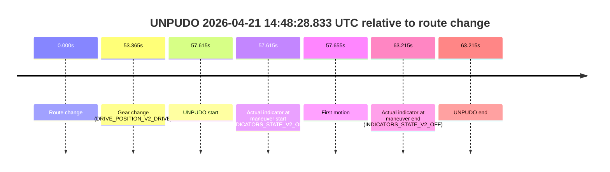
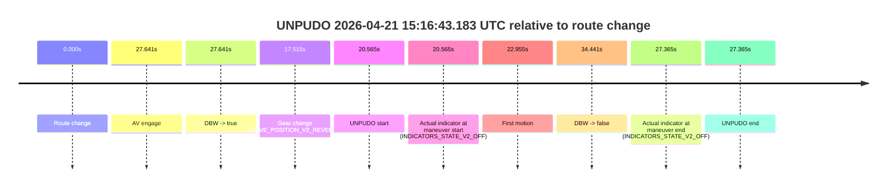

# Run Report: fme10011/2026-04-21--13-42-57--gen2-av-e1a79577-93ee-4a4a-9f08-65b0bb44d6de

| Field | Value |
|---|---|
| Run ID | `fme10011/2026-04-21--13-42-57--gen2-av-e1a79577-93ee-4a4a-9f08-65b0bb44d6de` |
| Date | `2026-04-21` |
| Model(s) | `blue-panther-solid` |
| Author | `guy.geva` |
| Event count | `3` |

## unpudo 2026-04-21 14:48:28.833 UTC

| Field | Value |
|---|---|
| Model | `blue-panther-solid` |
| Author | `guy.geva` |
| Run ID | `fme10011/2026-04-21--13-42-57--gen2-av-e1a79577-93ee-4a4a-9f08-65b0bb44d6de` |
| Date | `2026-04-21` |
| Time (UTC) | `14:48:28.833` |
| Event type | `unpudo` |
| Disengagement type | `none observed` |
| Route change | `found` |
| Console | [run](https://console.sso.wayve.ai/run/fme10011/2026-04-21--13-42-57--gen2-av-e1a79577-93ee-4a4a-9f08-65b0bb44d6de?id=&time-unixus=1776782908833297) |
| Foxglove | [segment](https://app.foxglove.dev/wayve-on-prem/p/prj_0dX18KZdVHg1fmmI/view?ds=foxglove-stream&ds.deviceName=fme10011&ds.start=2026-04-21T14%3A47%3A21.218175Z&ds.end=2026-04-21T14%3A48%3A44.433304Z&layoutId=lay_0e7VD4WIKDQGU73Y&time=2026-04-21T14%3A48%3A28.833297Z) |

### Event card: non-av

- Non-AV: there is no AV-owned portion anywhere inside the detected unpudo timeline, so it is kept for coverage but excluded from model success / failure scoring.

| Event | Time (UTC) | Delta from route change |
|---|---:|---:|
| Route change | 2026-04-21 14:47:31.218 | `0.000s` |
| Gear change (DRIVE_POSITION_V2_DRIVE) | 2026-04-21 14:48:24.583 | `53.365s` |
| UNPUDO start | 2026-04-21 14:48:28.833 | `57.615s` |
| Actual indicator at maneuver start (INDICATORS_STATE_V2_OFF) | 2026-04-21 14:48:28.833 | `57.615s` |
| First motion | 2026-04-21 14:48:28.872 | `57.655s` |
| Actual indicator at maneuver end (INDICATORS_STATE_V2_OFF) | 2026-04-21 14:48:34.433 | `63.215s` |
| UNPUDO end | 2026-04-21 14:48:34.433 | `63.215s` |

| Metric | Value |
|---|---|
| Outcome | `non-av` |
| Effective failure type | `none` |
| Route change status | `found` |
| DBW at event start | `false` |
| DBW at event end | `false` |
| Predicted gear at AV start | `n/a` |
| Actual gear at AV start | `n/a` |
| Predicted gear at event start | `DRIVE_POSITION_V2_DRIVE` |
| Actual gear at event start | `DRIVE_POSITION_V2_DRIVE` |
| Planned indicator direction | `INDICATORS_STATE_V2_LEFT_ON` |
| Controller indicator direction | `INDICATORS_STATE_V2_LEFT_ON` |
| Actual indicator direction | `INDICATORS_STATE_V2_OFF` |
| Actual indicator at maneuver end | `INDICATORS_STATE_V2_OFF` |
| Driver accel help in AV | `false` |
| Driver accel help timestamp | `n/a` |
| Max accel pedal pct in AV | `0.0%` |
| Max brake pedal pct in AV | `0.0%` |
| Max speed mps in AV | `0.000` |
| Route -> AV | `n/a` |
| AV -> event start | `n/a` |
| AV -> first motion | `n/a` |
| AV duration before disengagement | `n/a` |
| Trajectory waypoint count | `37` |
| Driving-plan step count | `11` |

The scored portion starts from the AV-owned window, not from the pre-AV setup. Route-change search in the stopped pre-event segment was `found`, with the baseline therefore set to route change. At the event anchor the model predicts `DRIVE_POSITION_V2_DRIVE` and the actual gear is `DRIVE_POSITION_V2_DRIVE`. The effective model outcome is `non-av` because `there is no AV-owned overlap inside the event timeline`.

### Resolution

| Field | Value |
|---|---|
| Final outcome | `non-av` |
| Do we agree with this label? | `yes` |
| Source disengagement type | `none observed` |
| Resolved effective failure type | `none` |
| Confidence | `high` |

## unpudo 2026-04-21 15:14:09.733 UTC

| Field | Value |
|---|---|
| Model | `blue-panther-solid` |
| Author | `guy.geva` |
| Run ID | `fme10011/2026-04-21--13-42-57--gen2-av-e1a79577-93ee-4a4a-9f08-65b0bb44d6de` |
| Date | `2026-04-21` |
| Time (UTC) | `15:14:09.733` |
| Event type | `unpudo` |
| Disengagement type | `none observed` |
| Route change | `found` |
| Console | [run](https://console.sso.wayve.ai/run/fme10011/2026-04-21--13-42-57--gen2-av-e1a79577-93ee-4a4a-9f08-65b0bb44d6de?id=&time-unixus=1776784449733303) |
| Foxglove | [segment](https://app.foxglove.dev/wayve-on-prem/p/prj_0dX18KZdVHg1fmmI/view?ds=foxglove-stream&ds.deviceName=fme10011&ds.start=2026-04-21T15%3A13%3A30.218271Z&ds.end=2026-04-21T15%3A15%3A25.857660Z&layoutId=lay_0e7VD4WIKDQGU73Y&time=2026-04-21T15%3A14%3A09.733303Z) |

### Event card: non-av

- Non-AV: there is no AV-owned portion anywhere inside the detected unpudo timeline, so it is kept for coverage but excluded from model success / failure scoring.

| Event | Time (UTC) | Delta from route change |
|---|---:|---:|
| Route change | 2026-04-21 15:13:40.218 | `0.000s` |
| AV engage | 2026-04-21 15:14:23.918 | `43.700s` |
| DBW -> true | 2026-04-21 15:14:23.918 | `43.700s` |
| Gear change (DRIVE_POSITION_V2_REVERSE) | 2026-04-21 15:14:05.283 | `25.065s` |
| UNPUDO start | 2026-04-21 15:14:09.733 | `29.515s` |
| Actual indicator at maneuver start (INDICATORS_STATE_V2_LEFT_ON) | 2026-04-21 15:14:09.733 | `29.515s` |
| First motion | 2026-04-21 15:14:11.893 | `31.675s` |
| DBW -> false | 2026-04-21 15:15:15.857 | `95.639s` |
| Actual indicator at maneuver end (INDICATORS_STATE_V2_OFF) | 2026-04-21 15:14:16.633 | `36.415s` |
| UNPUDO end | 2026-04-21 15:14:16.633 | `36.415s` |

| Metric | Value |
|---|---|
| Outcome | `non-av` |
| Effective failure type | `none` |
| Route change status | `found` |
| DBW at event start | `false` |
| DBW at event end | `false` |
| Predicted gear at AV start | `DRIVE_POSITION_V2_DRIVE` |
| Actual gear at AV start | `DRIVE_POSITION_V2_DRIVE` |
| Predicted gear at event start | `DRIVE_POSITION_V2_REVERSE` |
| Actual gear at event start | `DRIVE_POSITION_V2_REVERSE` |
| Planned indicator direction | `INDICATORS_STATE_V2_LEFT_ON` |
| Controller indicator direction | `INDICATORS_STATE_V2_LEFT_ON` |
| Actual indicator direction | `INDICATORS_STATE_V2_LEFT_ON` |
| Actual indicator at maneuver end | `INDICATORS_STATE_V2_OFF` |
| Driver accel help in AV | `false` |
| Driver accel help timestamp | `n/a` |
| Max accel pedal pct in AV | `0.0%` |
| Max brake pedal pct in AV | `0.0%` |
| Max speed mps in AV | `0.000` |
| Route -> AV | `43.700s` |
| AV -> event start | `-14.185s` |
| AV -> first motion | `-12.025s` |
| AV duration before disengagement | `51.939s` |
| Trajectory waypoint count | `37` |
| Driving-plan step count | `11` |

The scored portion starts from the AV-owned window, not from the pre-AV setup. Route-change search in the stopped pre-event segment was `found`, with the baseline therefore set to route change. At the event anchor the model predicts `DRIVE_POSITION_V2_REVERSE` and the actual gear is `DRIVE_POSITION_V2_REVERSE`. The effective model outcome is `non-av` because `there is no AV-owned overlap inside the event timeline`.

### Resolution

| Field | Value |
|---|---|
| Final outcome | `non-av` |
| Do we agree with this label? | `yes` |
| Source disengagement type | `none observed` |
| Resolved effective failure type | `none` |
| Confidence | `high` |

## unpudo 2026-04-21 15:16:43.183 UTC

| Field | Value |
|---|---|
| Model | `blue-panther-solid` |
| Author | `guy.geva` |
| Run ID | `fme10011/2026-04-21--13-42-57--gen2-av-e1a79577-93ee-4a4a-9f08-65b0bb44d6de` |
| Date | `2026-04-21` |
| Time (UTC) | `15:16:43.183` |
| Event type | `unpudo` |
| Disengagement type | `none observed` |
| Route change | `found` |
| Console | [run](https://console.sso.wayve.ai/run/fme10011/2026-04-21--13-42-57--gen2-av-e1a79577-93ee-4a4a-9f08-65b0bb44d6de?id=&time-unixus=1776784603183303) |
| Foxglove | [segment](https://app.foxglove.dev/wayve-on-prem/p/prj_0dX18KZdVHg1fmmI/view?ds=foxglove-stream&ds.deviceName=fme10011&ds.start=2026-04-21T15%3A16%3A12.618276Z&ds.end=2026-04-21T15%3A17%3A07.058941Z&layoutId=lay_0e7VD4WIKDQGU73Y&time=2026-04-21T15%3A16%3A43.183303Z) |

### Event card: non-av

- Non-AV: there is no AV-owned portion anywhere inside the detected unpudo timeline, so it is kept for coverage but excluded from model success / failure scoring.

| Event | Time (UTC) | Delta from route change |
|---|---:|---:|
| Route change | 2026-04-21 15:16:22.618 | `0.000s` |
| AV engage | 2026-04-21 15:16:50.258 | `27.641s` |
| DBW -> true | 2026-04-21 15:16:50.258 | `27.641s` |
| Gear change (DRIVE_POSITION_V2_REVERSE) | 2026-04-21 15:16:40.133 | `17.515s` |
| UNPUDO start | 2026-04-21 15:16:43.183 | `20.565s` |
| Actual indicator at maneuver start (INDICATORS_STATE_V2_OFF) | 2026-04-21 15:16:43.183 | `20.565s` |
| First motion | 2026-04-21 15:16:45.573 | `22.955s` |
| DBW -> false | 2026-04-21 15:16:57.058 | `34.441s` |
| Actual indicator at maneuver end (INDICATORS_STATE_V2_OFF) | 2026-04-21 15:16:49.983 | `27.365s` |
| UNPUDO end | 2026-04-21 15:16:49.983 | `27.365s` |

| Metric | Value |
|---|---|
| Outcome | `non-av` |
| Effective failure type | `none` |
| Route change status | `found` |
| DBW at event start | `false` |
| DBW at event end | `false` |
| Predicted gear at AV start | `DRIVE_POSITION_V2_DRIVE` |
| Actual gear at AV start | `DRIVE_POSITION_V2_DRIVE` |
| Predicted gear at event start | `DRIVE_POSITION_V2_REVERSE` |
| Actual gear at event start | `DRIVE_POSITION_V2_REVERSE` |
| Planned indicator direction | `INDICATORS_STATE_V2_LEFT_ON` |
| Controller indicator direction | `INDICATORS_STATE_V2_LEFT_ON` |
| Actual indicator direction | `INDICATORS_STATE_V2_OFF` |
| Actual indicator at maneuver end | `INDICATORS_STATE_V2_OFF` |
| Driver accel help in AV | `false` |
| Driver accel help timestamp | `n/a` |
| Max accel pedal pct in AV | `0.0%` |
| Max brake pedal pct in AV | `0.0%` |
| Max speed mps in AV | `0.000` |
| Route -> AV | `27.641s` |
| AV -> event start | `-7.076s` |
| AV -> first motion | `-4.686s` |
| AV duration before disengagement | `6.800s` |
| Trajectory waypoint count | `37` |
| Driving-plan step count | `11` |

The scored portion starts from the AV-owned window, not from the pre-AV setup. Route-change search in the stopped pre-event segment was `found`, with the baseline therefore set to route change. At the event anchor the model predicts `DRIVE_POSITION_V2_REVERSE` and the actual gear is `DRIVE_POSITION_V2_REVERSE`. The effective model outcome is `non-av` because `there is no AV-owned overlap inside the event timeline`.

### Resolution

| Field | Value |
|---|---|
| Final outcome | `non-av` |
| Do we agree with this label? | `yes` |
| Source disengagement type | `none observed` |
| Resolved effective failure type | `none` |
| Confidence | `high` |
