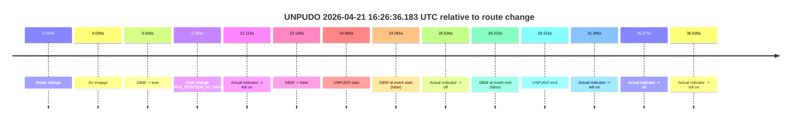
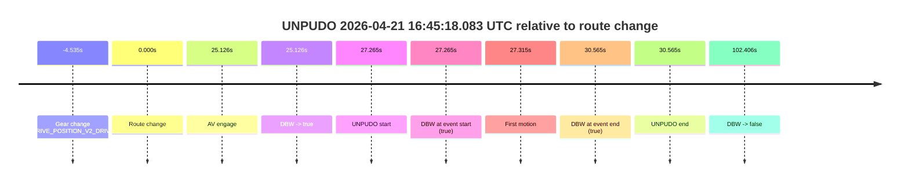
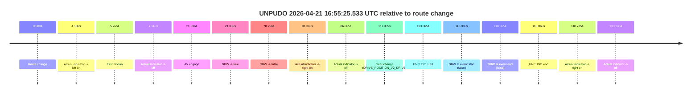
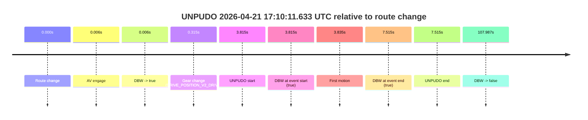
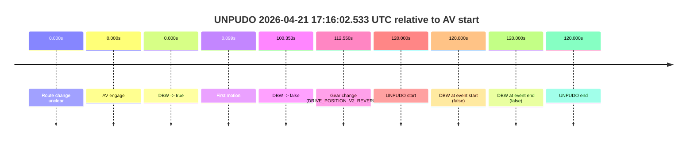
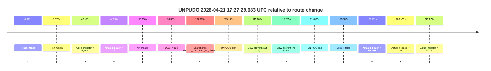

# Run Report: fme10011/2026-04-21--16-14-26--gen2-av-9f0c228a-9b71-407b-834d-29b70e16c322

| Field | Value |
|---|---|
| Run ID | `fme10011/2026-04-21--16-14-26--gen2-av-9f0c228a-9b71-407b-834d-29b70e16c322` |
| Date | `2026-04-21` |
| Model(s) | `eel-teal-outspoken` |
| Author | `zak` |
| Event count | `7` |

## unpudo 2026-04-21 16:26:36.183 UTC

| Field | Value |
|---|---|
| Model | `eel-teal-outspoken` |
| Author | `zak` |
| Run ID | `fme10011/2026-04-21--16-14-26--gen2-av-9f0c228a-9b71-407b-834d-29b70e16c322` |
| Date | `2026-04-21` |
| Time (UTC) | `16:26:36.183` |
| Event type | `unpudo` |
| Disengagement type | `none observed` |
| Route change | `found` |
| Console | [run](https://console.sso.wayve.ai/run/fme10011/2026-04-21--16-14-26--gen2-av-9f0c228a-9b71-407b-834d-29b70e16c322?id=&time-unixus=1776788796183293) |
| Foxglove | [segment](https://app.foxglove.dev/wayve-on-prem/p/prj_0dX18KZdVHg1fmmI/view?ds=foxglove-stream&ds.deviceName=fme10011&ds.start=2026-04-21T16%3A26%3A02.118254Z&ds.end=2026-04-21T16%3A26%3A51.433302Z&layoutId=lay_0e7VD4WIKDQGU73Y&time=2026-04-21T16%3A26%3A36.183293Z) |

### Event card: fail

- Fail: the credited unpudo does not stay AV-owned. The event window starts with DBW false, and the maneuver outcome lands outside a clean AV-owned segment.

| Event | Time (UTC) | Delta from route change |
|---|---:|---:|
| Route change | 2026-04-21 16:26:12.118 | `0.000s` |
| AV engage | 2026-04-21 16:26:12.123 | `0.006s` |
| DBW -> true | 2026-04-21 16:26:12.123 | `0.006s` |
| Gear change (DRIVE_POSITION_V2_DRIVE) | 2026-04-21 16:26:12.383 | `0.265s` |
| Actual indicator -> left on | 2026-04-21 16:26:34.233 | `22.115s` |
| DBW -> false | 2026-04-21 16:26:35.263 | `23.145s` |
| UNPUDO start | 2026-04-21 16:26:36.183 | `24.065s` |
| DBW at event start (false) | 2026-04-21 16:26:36.183 | `24.065s` |
| Actual indicator -> off | 2026-04-21 16:26:38.653 | `26.536s` |
| DBW at event end (false) | 2026-04-21 16:26:41.433 | `29.315s` |
| UNPUDO end | 2026-04-21 16:26:41.433 | `29.315s` |
| Actual indicator -> left on | 2026-04-21 16:26:43.612 | `31.495s` |
| Actual indicator -> off | 2026-04-21 16:26:47.392 | `35.275s` |
| Actual indicator -> left on | 2026-04-21 16:26:48.753 | `36.636s` |

| Metric | Value |
|---|---|
| Outcome | `fail` |
| Effective failure type | `not_av_owned` |
| Route change status | `found` |
| DBW at event start | `false` |
| DBW at event end | `false` |
| Predicted gear at AV start | `DRIVE_POSITION_V2_PARK` |
| Actual gear at AV start | `DRIVE_POSITION_V2_PARK` |
| Predicted gear at event start | `DRIVE_POSITION_V2_DRIVE` |
| Actual gear at event start | `DRIVE_POSITION_V2_DRIVE` |
| Planned indicator direction | `INDICATORS_STATE_V2_OFF` |
| Controller indicator direction | `INDICATORS_STATE_V2_OFF` |
| Actual indicator direction | `INDICATORS_STATE_V2_LEFT_ON` |
| Actual indicator at maneuver end | `INDICATORS_STATE_V2_OFF` |
| Driver accel help in AV | `false` |
| Driver accel help timestamp | `n/a` |
| Max accel pedal pct in AV | `0.0%` |
| Max brake pedal pct in AV | `8.0%` |
| Max speed mps in AV | `0.000` |
| Success timing baseline | `route change` |
| Route -> AV | `0.006s` |
| AV -> event start | `24.059s` |
| AV -> first motion | `n/a` |
| Success baseline -> event start | `24.065s` |
| Success baseline -> first motion | `n/a` |
| AV duration before disengagement | `23.139s` |
| Trajectory waypoint count | `37` |
| Driving-plan step count | `11` |

The scored portion starts from the AV-owned window, not from the pre-AV setup. Route-change search in the stopped pre-event segment was `found`, with the baseline therefore set to route change. At the event anchor the model predicts `DRIVE_POSITION_V2_DRIVE` and the actual gear is `DRIVE_POSITION_V2_DRIVE`. The effective model outcome is `fail` because `not_av_owned.`

### Resolution

| Field | Value |
|---|---|
| Final outcome | `fail` |
| Do we agree with this label? | `yes` |
| Source disengagement type | `none observed` |
| Resolved effective failure type | `not_av_owned` |
| Confidence | `high` |

## unpudo 2026-04-21 16:45:18.083 UTC

| Field | Value |
|---|---|
| Model | `eel-teal-outspoken` |
| Author | `zak` |
| Run ID | `fme10011/2026-04-21--16-14-26--gen2-av-9f0c228a-9b71-407b-834d-29b70e16c322` |
| Date | `2026-04-21` |
| Time (UTC) | `16:45:18.083` |
| Event type | `unpudo` |
| Disengagement type | `none observed` |
| Route change | `found` |
| Console | [run](https://console.sso.wayve.ai/run/fme10011/2026-04-21--16-14-26--gen2-av-9f0c228a-9b71-407b-834d-29b70e16c322?id=&time-unixus=1776789918083307) |
| Foxglove | [segment](https://app.foxglove.dev/wayve-on-prem/p/prj_0dX18KZdVHg1fmmI/view?ds=foxglove-stream&ds.deviceName=fme10011&ds.start=2026-04-21T16%3A44%3A36.283292Z&ds.end=2026-04-21T16%3A46%3A43.223946Z&layoutId=lay_0e7VD4WIKDQGU73Y&time=2026-04-21T16%3A45%3A18.083307Z) |

### Event card: pass

- Pass: AV owns the credited unpudo from route change through the official unpudo window, the gear state is aligned at the anchor, and the vehicle moves without driver accelerator help in AV.

| Event | Time (UTC) | Delta from route change |
|---|---:|---:|
| Gear change (DRIVE_POSITION_V2_DRIVE) | 2026-04-21 16:44:46.283 | `-4.535s` |
| Route change | 2026-04-21 16:44:50.818 | `0.000s` |
| AV engage | 2026-04-21 16:45:15.943 | `25.126s` |
| DBW -> true | 2026-04-21 16:45:15.943 | `25.126s` |
| UNPUDO start | 2026-04-21 16:45:18.083 | `27.265s` |
| DBW at event start (true) | 2026-04-21 16:45:18.083 | `27.265s` |
| First motion | 2026-04-21 16:45:18.133 | `27.315s` |
| DBW at event end (true) | 2026-04-21 16:45:21.383 | `30.565s` |
| UNPUDO end | 2026-04-21 16:45:21.383 | `30.565s` |
| DBW -> false | 2026-04-21 16:46:33.223 | `102.406s` |

| Metric | Value |
|---|---|
| Outcome | `pass` |
| Effective failure type | `none` |
| Route change status | `found` |
| DBW at event start | `true` |
| DBW at event end | `true` |
| Predicted gear at AV start | `DRIVE_POSITION_V2_DRIVE` |
| Actual gear at AV start | `DRIVE_POSITION_V2_DRIVE` |
| Predicted gear at event start | `DRIVE_POSITION_V2_DRIVE` |
| Actual gear at event start | `DRIVE_POSITION_V2_DRIVE` |
| Planned indicator direction | `INDICATORS_STATE_V2_OFF` |
| Controller indicator direction | `INDICATORS_STATE_V2_OFF` |
| Actual indicator direction | `INDICATORS_STATE_V2_OFF` |
| Actual indicator at maneuver end | `INDICATORS_STATE_V2_OFF` |
| Driver accel help in AV | `false` |
| Driver accel help timestamp | `n/a` |
| Max accel pedal pct in AV | `0.0%` |
| Max brake pedal pct in AV | `25.5%` |
| Max speed mps in AV | `5.381` |
| Success timing baseline | `route change` |
| Route -> AV | `25.126s` |
| AV -> event start | `2.139s` |
| AV -> first motion | `2.189s` |
| Success baseline -> event start | `27.265s` |
| Success baseline -> first motion | `27.315s` |
| AV duration before disengagement | `77.280s` |
| Trajectory waypoint count | `37` |
| Driving-plan step count | `11` |

The scored portion starts from the AV-owned window, not from the pre-AV setup. Route-change search in the stopped pre-event segment was `found`, with the baseline therefore set to route change. At the event anchor the model predicts `DRIVE_POSITION_V2_DRIVE` and the actual gear is `DRIVE_POSITION_V2_DRIVE`. The effective model outcome is `pass` because `the credited unpudo stays AV-owned through the official unpudo window.`

### Resolution

| Field | Value |
|---|---|
| Final outcome | `pass` |
| Do we agree with this label? | `yes` |
| Source disengagement type | `none observed` |
| Resolved effective failure type | `none` |
| Confidence | `high` |

## unpudo 2026-04-21 16:55:25.533 UTC

| Field | Value |
|---|---|
| Model | `eel-teal-outspoken` |
| Author | `zak` |
| Run ID | `fme10011/2026-04-21--16-14-26--gen2-av-9f0c228a-9b71-407b-834d-29b70e16c322` |
| Date | `2026-04-21` |
| Time (UTC) | `16:55:25.533` |
| Event type | `unpudo` |
| Disengagement type | `none observed` |
| Route change | `found` |
| Console | [run](https://console.sso.wayve.ai/run/fme10011/2026-04-21--16-14-26--gen2-av-9f0c228a-9b71-407b-834d-29b70e16c322?id=&time-unixus=1776790525533301) |
| Foxglove | [segment](https://app.foxglove.dev/wayve-on-prem/p/prj_0dX18KZdVHg1fmmI/view?ds=foxglove-stream&ds.deviceName=fme10011&ds.start=2026-04-21T16%3A53%3A22.168253Z&ds.end=2026-04-21T16%3A55%3A40.233311Z&layoutId=lay_0e7VD4WIKDQGU73Y&time=2026-04-21T16%3A55%3A25.533301Z) |

### Event card: fail

- Fail: the credited unpudo does not stay AV-owned. The event window starts with DBW false, and the maneuver outcome lands outside a clean AV-owned segment.

| Event | Time (UTC) | Delta from route change |
|---|---:|---:|
| Route change | 2026-04-21 16:53:32.168 | `0.000s` |
| Actual indicator -> left on | 2026-04-21 16:53:36.273 | `4.106s` |
| First motion | 2026-04-21 16:53:37.932 | `5.765s` |
| Actual indicator -> off | 2026-04-21 16:53:39.513 | `7.345s` |
| AV engage | 2026-04-21 16:53:53.503 | `21.336s` |
| DBW -> true | 2026-04-21 16:53:53.503 | `21.336s` |
| DBW -> false | 2026-04-21 16:54:50.923 | `78.756s` |
| Actual indicator -> right on | 2026-04-21 16:54:53.553 | `81.385s` |
| Actual indicator -> off | 2026-04-21 16:54:58.173 | `86.005s` |
| Gear change (DRIVE_POSITION_V2_DRIVE) | 2026-04-21 16:55:23.233 | `111.065s` |
| UNPUDO start | 2026-04-21 16:55:25.533 | `113.365s` |
| DBW at event start (false) | 2026-04-21 16:55:25.533 | `113.365s` |
| DBW at event end (false) | 2026-04-21 16:55:30.233 | `118.065s` |
| UNPUDO end | 2026-04-21 16:55:30.233 | `118.065s` |
| Actual indicator -> right on | 2026-04-21 16:55:30.892 | `118.725s` |
| Actual indicator -> off | 2026-04-21 16:55:47.532 | `135.365s` |

| Metric | Value |
|---|---|
| Outcome | `fail` |
| Effective failure type | `completed_outside_av` |
| Route change status | `found` |
| DBW at event start | `false` |
| DBW at event end | `false` |
| Predicted gear at AV start | `DRIVE_POSITION_V2_DRIVE` |
| Actual gear at AV start | `DRIVE_POSITION_V2_DRIVE` |
| Predicted gear at event start | `DRIVE_POSITION_V2_DRIVE` |
| Actual gear at event start | `DRIVE_POSITION_V2_DRIVE` |
| Planned indicator direction | `INDICATORS_STATE_V2_LEFT_ON` |
| Controller indicator direction | `INDICATORS_STATE_V2_LEFT_ON` |
| Actual indicator direction | `INDICATORS_STATE_V2_OFF` |
| Actual indicator at maneuver end | `INDICATORS_STATE_V2_OFF` |
| Driver accel help in AV | `false` |
| Driver accel help timestamp | `n/a` |
| Max accel pedal pct in AV | `0.0%` |
| Max brake pedal pct in AV | `17.0%` |
| Max speed mps in AV | `9.986` |
| Success timing baseline | `route change` |
| Route -> AV | `21.336s` |
| AV -> event start | `92.029s` |
| AV -> first motion | `-15.571s` |
| Success baseline -> event start | `113.365s` |
| Success baseline -> first motion | `5.765s` |
| AV duration before disengagement | `57.420s` |
| Trajectory waypoint count | `38` |
| Driving-plan step count | `11` |

The scored portion starts from the AV-owned window, not from the pre-AV setup. Route-change search in the stopped pre-event segment was `found`, with the baseline therefore set to route change. At the event anchor the model predicts `DRIVE_POSITION_V2_DRIVE` and the actual gear is `DRIVE_POSITION_V2_DRIVE`. The effective model outcome is `fail` because `completed_outside_av.`

### Resolution

| Field | Value |
|---|---|
| Final outcome | `fail` |
| Do we agree with this label? | `yes` |
| Source disengagement type | `none observed` |
| Resolved effective failure type | `completed_outside_av` |
| Confidence | `high` |

## unpudo 2026-04-21 17:02:08.433 UTC

| Field | Value |
|---|---|
| Model | `eel-teal-outspoken` |
| Author | `zak` |
| Run ID | `fme10011/2026-04-21--16-14-26--gen2-av-9f0c228a-9b71-407b-834d-29b70e16c322` |
| Date | `2026-04-21` |
| Time (UTC) | `17:02:08.433` |
| Event type | `unpudo` |
| Disengagement type | `none observed` |
| Route change | `found` |
| Console | [run](https://console.sso.wayve.ai/run/fme10011/2026-04-21--16-14-26--gen2-av-9f0c228a-9b71-407b-834d-29b70e16c322?id=&time-unixus=1776790928433317) |
| Foxglove | [segment](https://app.foxglove.dev/wayve-on-prem/p/prj_0dX18KZdVHg1fmmI/view?ds=foxglove-stream&ds.deviceName=fme10011&ds.start=2026-04-21T17%3A01%3A54.619412Z&ds.end=2026-04-21T17%3A03%3A11.483793Z&layoutId=lay_0e7VD4WIKDQGU73Y&time=2026-04-21T17%3A02%3A08.433317Z) |

### Event card: pass

- Pass: AV owns the credited unpudo from route change through the official unpudo window, the gear state is aligned at the anchor, and the vehicle moves without driver accelerator help in AV.

| Event | Time (UTC) | Delta from route change |
|---|---:|---:|
| Route change | 2026-04-21 17:02:04.619 | `0.000s` |
| AV engage | 2026-04-21 17:02:04.623 | `0.005s` |
| DBW -> true | 2026-04-21 17:02:04.623 | `0.005s` |
| Gear change (DRIVE_POSITION_V2_DRIVE) | 2026-04-21 17:02:04.883 | `0.264s` |
| UNPUDO start | 2026-04-21 17:02:08.433 | `3.814s` |
| DBW at event start (true) | 2026-04-21 17:02:08.433 | `3.814s` |
| First motion | 2026-04-21 17:02:08.453 | `3.834s` |
| DBW at event end (true) | 2026-04-21 17:02:12.233 | `7.614s` |
| UNPUDO end | 2026-04-21 17:02:12.233 | `7.614s` |
| DBW -> false | 2026-04-21 17:03:01.483 | `56.864s` |

| Metric | Value |
|---|---|
| Outcome | `pass` |
| Effective failure type | `none` |
| Route change status | `found` |
| DBW at event start | `true` |
| DBW at event end | `true` |
| Predicted gear at AV start | `DRIVE_POSITION_V2_PARK` |
| Actual gear at AV start | `DRIVE_POSITION_V2_PARK` |
| Predicted gear at event start | `DRIVE_POSITION_V2_DRIVE` |
| Actual gear at event start | `DRIVE_POSITION_V2_DRIVE` |
| Planned indicator direction | `INDICATORS_STATE_V2_LEFT_ON` |
| Controller indicator direction | `INDICATORS_STATE_V2_LEFT_ON` |
| Actual indicator direction | `INDICATORS_STATE_V2_OFF` |
| Actual indicator at maneuver end | `INDICATORS_STATE_V2_OFF` |
| Driver accel help in AV | `false` |
| Driver accel help timestamp | `n/a` |
| Max accel pedal pct in AV | `0.0%` |
| Max brake pedal pct in AV | `16.1%` |
| Max speed mps in AV | `5.433` |
| Success timing baseline | `route change` |
| Route -> AV | `0.005s` |
| AV -> event start | `3.809s` |
| AV -> first motion | `3.829s` |
| Success baseline -> event start | `3.814s` |
| Success baseline -> first motion | `3.834s` |
| AV duration before disengagement | `56.860s` |
| Trajectory waypoint count | `38` |
| Driving-plan step count | `11` |

The scored portion starts from the AV-owned window, not from the pre-AV setup. Route-change search in the stopped pre-event segment was `found`, with the baseline therefore set to route change. At the event anchor the model predicts `DRIVE_POSITION_V2_DRIVE` and the actual gear is `DRIVE_POSITION_V2_DRIVE`. The effective model outcome is `pass` because `the credited unpudo stays AV-owned through the official unpudo window.`

### Resolution

| Field | Value |
|---|---|
| Final outcome | `pass` |
| Do we agree with this label? | `yes` |
| Source disengagement type | `none observed` |
| Resolved effective failure type | `none` |
| Confidence | `high` |

## unpudo 2026-04-21 17:10:11.633 UTC

| Field | Value |
|---|---|
| Model | `eel-teal-outspoken` |
| Author | `zak` |
| Run ID | `fme10011/2026-04-21--16-14-26--gen2-av-9f0c228a-9b71-407b-834d-29b70e16c322` |
| Date | `2026-04-21` |
| Time (UTC) | `17:10:11.633` |
| Event type | `unpudo` |
| Disengagement type | `none observed` |
| Route change | `found` |
| Console | [run](https://console.sso.wayve.ai/run/fme10011/2026-04-21--16-14-26--gen2-av-9f0c228a-9b71-407b-834d-29b70e16c322?id=&time-unixus=1776791411633305) |
| Foxglove | [segment](https://app.foxglove.dev/wayve-on-prem/p/prj_0dX18KZdVHg1fmmI/view?ds=foxglove-stream&ds.deviceName=fme10011&ds.start=2026-04-21T17%3A09%3A57.818259Z&ds.end=2026-04-21T17%3A12%3A05.805066Z&layoutId=lay_0e7VD4WIKDQGU73Y&time=2026-04-21T17%3A10%3A11.633305Z) |

### Event card: pass

- Pass: AV owns the credited unpudo from route change through the official unpudo window, the gear state is aligned at the anchor, and the vehicle moves without driver accelerator help in AV.

| Event | Time (UTC) | Delta from route change |
|---|---:|---:|
| Route change | 2026-04-21 17:10:07.818 | `0.000s` |
| AV engage | 2026-04-21 17:10:07.823 | `0.006s` |
| DBW -> true | 2026-04-21 17:10:07.823 | `0.006s` |
| Gear change (DRIVE_POSITION_V2_DRIVE) | 2026-04-21 17:10:08.133 | `0.315s` |
| UNPUDO start | 2026-04-21 17:10:11.633 | `3.815s` |
| DBW at event start (true) | 2026-04-21 17:10:11.633 | `3.815s` |
| First motion | 2026-04-21 17:10:11.652 | `3.835s` |
| DBW at event end (true) | 2026-04-21 17:10:15.333 | `7.515s` |
| UNPUDO end | 2026-04-21 17:10:15.333 | `7.515s` |
| DBW -> false | 2026-04-21 17:11:55.805 | `107.987s` |

| Metric | Value |
|---|---|
| Outcome | `pass` |
| Effective failure type | `none` |
| Route change status | `found` |
| DBW at event start | `true` |
| DBW at event end | `true` |
| Predicted gear at AV start | `DRIVE_POSITION_V2_PARK` |
| Actual gear at AV start | `DRIVE_POSITION_V2_PARK` |
| Predicted gear at event start | `DRIVE_POSITION_V2_DRIVE` |
| Actual gear at event start | `DRIVE_POSITION_V2_DRIVE` |
| Planned indicator direction | `INDICATORS_STATE_V2_LEFT_ON` |
| Controller indicator direction | `INDICATORS_STATE_V2_LEFT_ON` |
| Actual indicator direction | `INDICATORS_STATE_V2_OFF` |
| Actual indicator at maneuver end | `INDICATORS_STATE_V2_OFF` |
| Driver accel help in AV | `false` |
| Driver accel help timestamp | `n/a` |
| Max accel pedal pct in AV | `0.0%` |
| Max brake pedal pct in AV | `8.0%` |
| Max speed mps in AV | `4.139` |
| Success timing baseline | `route change` |
| Route -> AV | `0.006s` |
| AV -> event start | `3.809s` |
| AV -> first motion | `3.829s` |
| Success baseline -> event start | `3.815s` |
| Success baseline -> first motion | `3.835s` |
| AV duration before disengagement | `107.981s` |
| Trajectory waypoint count | `38` |
| Driving-plan step count | `11` |

The scored portion starts from the AV-owned window, not from the pre-AV setup. Route-change search in the stopped pre-event segment was `found`, with the baseline therefore set to route change. At the event anchor the model predicts `DRIVE_POSITION_V2_DRIVE` and the actual gear is `DRIVE_POSITION_V2_DRIVE`. The effective model outcome is `pass` because `the credited unpudo stays AV-owned through the official unpudo window.`

### Resolution

| Field | Value |
|---|---|
| Final outcome | `pass` |
| Do we agree with this label? | `yes` |
| Source disengagement type | `none observed` |
| Resolved effective failure type | `none` |
| Confidence | `high` |

## unpudo 2026-04-21 17:16:02.533 UTC

| Field | Value |
|---|---|
| Model | `eel-teal-outspoken` |
| Author | `zak` |
| Run ID | `fme10011/2026-04-21--16-14-26--gen2-av-9f0c228a-9b71-407b-834d-29b70e16c322` |
| Date | `2026-04-21` |
| Time (UTC) | `17:16:02.533` |
| Event type | `unpudo` |
| Disengagement type | `none observed` |
| Route change | `unclear` |
| Console | [run](https://console.sso.wayve.ai/run/fme10011/2026-04-21--16-14-26--gen2-av-9f0c228a-9b71-407b-834d-29b70e16c322?id=&time-unixus=1776791762533294) |
| Foxglove | [segment](https://app.foxglove.dev/wayve-on-prem/p/prj_0dX18KZdVHg1fmmI/view?ds=foxglove-stream&ds.deviceName=fme10011&ds.start=2026-04-21T17%3A13%3A52.533745Z&ds.end=2026-04-21T17%3A16%3A12.533294Z&layoutId=lay_0e7VD4WIKDQGU73Y&time=2026-04-21T17%3A16%3A02.533294Z) |

### Event card: fail

- Fail: the credited unpudo does not stay AV-owned. The event window starts with DBW false, and the maneuver outcome lands outside a clean AV-owned segment.

| Event | Time (UTC) | Delta from AV start |
|---|---:|---:|
| Route change unclear | 2026-04-21 17:14:02.533 | `0.000s` |
| AV engage | 2026-04-21 17:14:02.533 | `0.000s` |
| DBW -> true | 2026-04-21 17:14:02.533 | `0.000s` |
| First motion | 2026-04-21 17:14:02.632 | `0.099s` |
| DBW -> false | 2026-04-21 17:15:42.886 | `100.353s` |
| Gear change (DRIVE_POSITION_V2_REVERSE) | 2026-04-21 17:15:55.083 | `112.550s` |
| UNPUDO start | 2026-04-21 17:16:02.533 | `120.000s` |
| DBW at event start (false) | 2026-04-21 17:16:02.533 | `120.000s` |
| DBW at event end (false) | 2026-04-21 17:16:02.533 | `120.000s` |
| UNPUDO end | 2026-04-21 17:16:02.533 | `120.000s` |

| Metric | Value |
|---|---|
| Outcome | `fail` |
| Effective failure type | `not_av_owned` |
| Route change status | `unclear` |
| DBW at event start | `false` |
| DBW at event end | `false` |
| Predicted gear at AV start | `DRIVE_POSITION_V2_DRIVE` |
| Actual gear at AV start | `DRIVE_POSITION_V2_DRIVE` |
| Predicted gear at event start | `DRIVE_POSITION_V2_REVERSE` |
| Actual gear at event start | `DRIVE_POSITION_V2_REVERSE` |
| Planned indicator direction | `INDICATORS_STATE_V2_OFF` |
| Controller indicator direction | `INDICATORS_STATE_V2_OFF` |
| Actual indicator direction | `INDICATORS_STATE_V2_OFF` |
| Actual indicator at maneuver end | `INDICATORS_STATE_V2_OFF` |
| Driver accel help in AV | `false` |
| Driver accel help timestamp | `n/a` |
| Max accel pedal pct in AV | `0.0%` |
| Max brake pedal pct in AV | `50.0%` |
| Max speed mps in AV | `8.656` |
| Success timing baseline | `AV start` |
| Route -> AV | `n/a` |
| AV -> event start | `120.000s` |
| AV -> first motion | `0.099s` |
| Success baseline -> event start | `120.000s` |
| Success baseline -> first motion | `0.099s` |
| AV duration before disengagement | `100.353s` |
| Trajectory waypoint count | `38` |
| Driving-plan step count | `11` |

The scored portion starts from the AV-owned window, not from the pre-AV setup. Route-change search in the stopped pre-event segment was `unclear`, with the baseline therefore set to AV start. At the event anchor the model predicts `DRIVE_POSITION_V2_REVERSE` and the actual gear is `DRIVE_POSITION_V2_REVERSE`. The effective model outcome is `fail` because `not_av_owned.`

### Resolution

| Field | Value |
|---|---|
| Final outcome | `fail` |
| Do we agree with this label? | `yes` |
| Source disengagement type | `none observed` |
| Resolved effective failure type | `not_av_owned` |
| Confidence | `medium` |

## unpudo 2026-04-21 17:27:29.683 UTC

| Field | Value |
|---|---|
| Model | `eel-teal-outspoken` |
| Author | `zak` |
| Run ID | `fme10011/2026-04-21--16-14-26--gen2-av-9f0c228a-9b71-407b-834d-29b70e16c322` |
| Date | `2026-04-21` |
| Time (UTC) | `17:27:29.683` |
| Event type | `unpudo` |
| Disengagement type | `none observed` |
| Route change | `found` |
| Console | [run](https://console.sso.wayve.ai/run/fme10011/2026-04-21--16-14-26--gen2-av-9f0c228a-9b71-407b-834d-29b70e16c322?id=&time-unixus=1776792449683297) |
| Foxglove | [segment](https://app.foxglove.dev/wayve-on-prem/p/prj_0dX18KZdVHg1fmmI/view?ds=foxglove-stream&ds.deviceName=fme10011&ds.start=2026-04-21T17%3A25%3A24.518267Z&ds.end=2026-04-21T17%3A28%3A58.504927Z&layoutId=lay_0e7VD4WIKDQGU73Y&time=2026-04-21T17%3A27%3A29.683297Z) |

### Event card: pass

- Pass: AV owns the credited unpudo from route change through the official unpudo window, the gear state is aligned at the anchor, and the vehicle moves without driver accelerator help in AV.

| Event | Time (UTC) | Delta from route change |
|---|---:|---:|
| Route change | 2026-04-21 17:25:34.518 | `0.000s` |
| First motion | 2026-04-21 17:25:40.092 | `5.575s` |
| Actual indicator -> right on | 2026-04-21 17:26:17.172 | `42.655s` |
| Actual indicator -> off | 2026-04-21 17:26:19.472 | `44.955s` |
| AV engage | 2026-04-21 17:26:30.884 | `56.366s` |
| DBW -> true | 2026-04-21 17:26:30.884 | `56.366s` |
| Gear change (DRIVE_POSITION_V2_DRIVE) | 2026-04-21 17:27:22.333 | `107.815s` |
| UNPUDO start | 2026-04-21 17:27:29.683 | `115.165s` |
| DBW at event start (true) | 2026-04-21 17:27:29.683 | `115.165s` |
| DBW at event end (true) | 2026-04-21 17:27:33.583 | `119.065s` |
| UNPUDO end | 2026-04-21 17:27:33.583 | `119.065s` |
| DBW -> false | 2026-04-21 17:28:48.504 | `193.987s` |
| Actual indicator -> right on | 2026-04-21 17:28:54.272 | `199.755s` |
| Actual indicator -> off | 2026-04-21 17:29:03.992 | `209.475s` |
| Actual indicator -> left on | 2026-04-21 17:29:07.792 | `213.275s` |

| Metric | Value |
|---|---|
| Outcome | `pass` |
| Effective failure type | `none` |
| Route change status | `found` |
| DBW at event start | `true` |
| DBW at event end | `true` |
| Predicted gear at AV start | `DRIVE_POSITION_V2_DRIVE` |
| Actual gear at AV start | `DRIVE_POSITION_V2_DRIVE` |
| Predicted gear at event start | `DRIVE_POSITION_V2_DRIVE` |
| Actual gear at event start | `DRIVE_POSITION_V2_DRIVE` |
| Planned indicator direction | `INDICATORS_STATE_V2_LEFT_ON` |
| Controller indicator direction | `INDICATORS_STATE_V2_LEFT_ON` |
| Actual indicator direction | `INDICATORS_STATE_V2_OFF` |
| Actual indicator at maneuver end | `INDICATORS_STATE_V2_OFF` |
| Driver accel help in AV | `false` |
| Driver accel help timestamp | `n/a` |
| Max accel pedal pct in AV | `0.0%` |
| Max brake pedal pct in AV | `11.1%` |
| Max speed mps in AV | `10.064` |
| Success timing baseline | `route change` |
| Route -> AV | `56.366s` |
| AV -> event start | `58.799s` |
| AV -> first motion | `-50.791s` |
| Success baseline -> event start | `115.165s` |
| Success baseline -> first motion | `5.575s` |
| AV duration before disengagement | `137.621s` |
| Trajectory waypoint count | `37` |
| Driving-plan step count | `11` |

The scored portion starts from the AV-owned window, not from the pre-AV setup. Route-change search in the stopped pre-event segment was `found`, with the baseline therefore set to route change. At the event anchor the model predicts `DRIVE_POSITION_V2_DRIVE` and the actual gear is `DRIVE_POSITION_V2_DRIVE`. The effective model outcome is `pass` because `the credited unpudo stays AV-owned through the official unpudo window.`

### Resolution

| Field | Value |
|---|---|
| Final outcome | `pass` |
| Do we agree with this label? | `yes` |
| Source disengagement type | `none observed` |
| Resolved effective failure type | `none` |
| Confidence | `high` |
