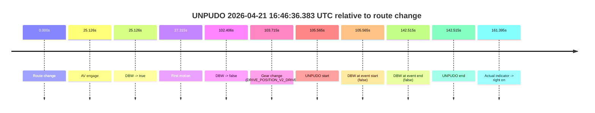
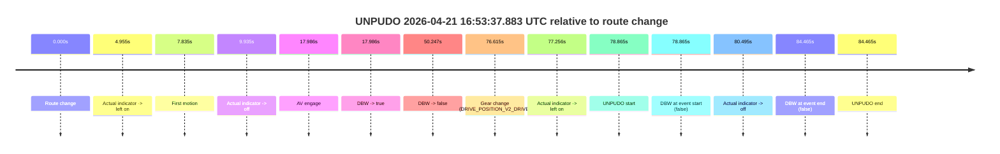
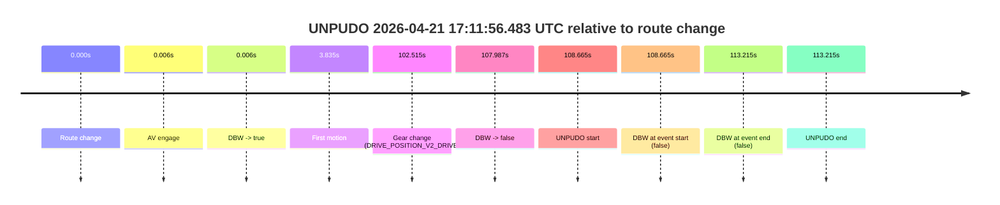
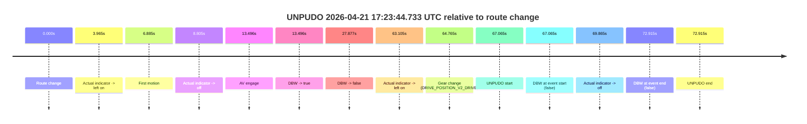
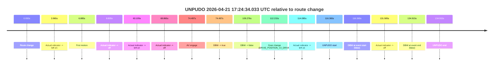
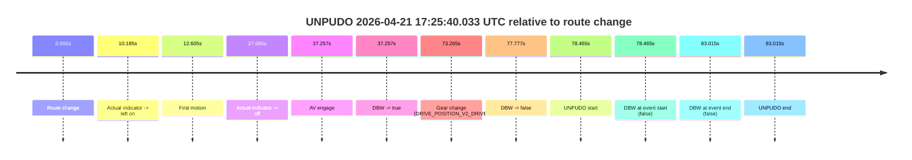
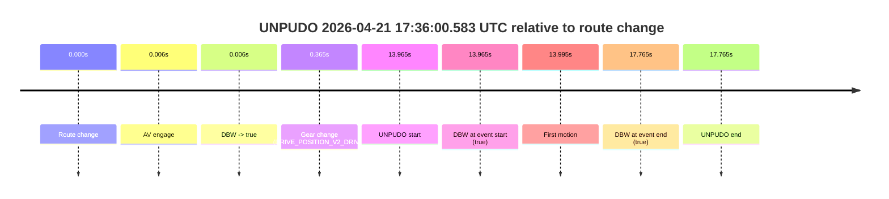

# Run Report: fme10011/2026-04-21--16-14-26--gen2-av-9f0c228a-9b71-407b-834d-29b70e16c322

| Field | Value |
|---|---|
| Run ID | `fme10011/2026-04-21--16-14-26--gen2-av-9f0c228a-9b71-407b-834d-29b70e16c322` |
| Date | `2026-04-21` |
| Model(s) | `pink-manta-ray-smooth` |
| Author | `guy.geva` |
| Event count | `8` |

## unpudo 2026-04-21 16:46:36.383 UTC

| Field | Value |
|---|---|
| Model | `pink-manta-ray-smooth` |
| Author | `guy.geva` |
| Run ID | `fme10011/2026-04-21--16-14-26--gen2-av-9f0c228a-9b71-407b-834d-29b70e16c322` |
| Date | `2026-04-21` |
| Time (UTC) | `16:46:36.383` |
| Event type | `unpudo` |
| Disengagement type | `none observed` |
| Route change | `found` |
| Console | [run](https://console.sso.wayve.ai/run/fme10011/2026-04-21--16-14-26--gen2-av-9f0c228a-9b71-407b-834d-29b70e16c322?id=&time-unixus=1776789996383311) |
| Foxglove | [segment](https://app.foxglove.dev/wayve-on-prem/p/prj_0dX18KZdVHg1fmmI/view?ds=foxglove-stream&ds.deviceName=fme10011&ds.start=2026-04-21T16%3A44%3A40.818314Z&ds.end=2026-04-21T16%3A47%3A23.333311Z&layoutId=lay_0e7VD4WIKDQGU73Y&time=2026-04-21T16%3A46%3A36.383311Z) |

### Event card: fail

- Fail: the credited unpudo does not stay AV-owned. The event window starts with DBW false, and the maneuver outcome lands outside a clean AV-owned segment.

| Event | Time (UTC) | Delta from route change |
|---|---:|---:|
| Route change | 2026-04-21 16:44:50.818 | `0.000s` |
| AV engage | 2026-04-21 16:45:15.943 | `25.126s` |
| DBW -> true | 2026-04-21 16:45:15.943 | `25.126s` |
| First motion | 2026-04-21 16:45:18.133 | `27.315s` |
| DBW -> false | 2026-04-21 16:46:33.223 | `102.406s` |
| Gear change (DRIVE_POSITION_V2_DRIVE) | 2026-04-21 16:46:34.533 | `103.715s` |
| UNPUDO start | 2026-04-21 16:46:36.383 | `105.565s` |
| DBW at event start (false) | 2026-04-21 16:46:36.383 | `105.565s` |
| DBW at event end (false) | 2026-04-21 16:47:13.333 | `142.515s` |
| UNPUDO end | 2026-04-21 16:47:13.333 | `142.515s` |
| Actual indicator -> right on | 2026-04-21 16:47:32.212 | `161.395s` |

| Metric | Value |
|---|---|
| Outcome | `fail` |
| Effective failure type | `not_av_owned` |
| Route change status | `found` |
| DBW at event start | `false` |
| DBW at event end | `false` |
| Predicted gear at AV start | `DRIVE_POSITION_V2_DRIVE` |
| Actual gear at AV start | `DRIVE_POSITION_V2_DRIVE` |
| Predicted gear at event start | `DRIVE_POSITION_V2_DRIVE` |
| Actual gear at event start | `DRIVE_POSITION_V2_DRIVE` |
| Planned indicator direction | `INDICATORS_STATE_V2_OFF` |
| Controller indicator direction | `INDICATORS_STATE_V2_OFF` |
| Actual indicator direction | `INDICATORS_STATE_V2_OFF` |
| Actual indicator at maneuver end | `INDICATORS_STATE_V2_OFF` |
| Driver accel help in AV | `false` |
| Driver accel help timestamp | `n/a` |
| Max accel pedal pct in AV | `0.0%` |
| Max brake pedal pct in AV | `25.5%` |
| Max speed mps in AV | `8.544` |
| Success timing baseline | `route change` |
| Route -> AV | `25.126s` |
| AV -> event start | `80.439s` |
| AV -> first motion | `2.189s` |
| Success baseline -> event start | `105.565s` |
| Success baseline -> first motion | `27.315s` |
| AV duration before disengagement | `77.280s` |
| Trajectory waypoint count | `37` |
| Driving-plan step count | `11` |

The scored portion starts from the AV-owned window, not from the pre-AV setup. Route-change search in the stopped pre-event segment was `found`, with the baseline therefore set to route change. At the event anchor the model predicts `DRIVE_POSITION_V2_DRIVE` and the actual gear is `DRIVE_POSITION_V2_DRIVE`. The effective model outcome is `fail` because `not_av_owned.`

### Resolution

| Field | Value |
|---|---|
| Final outcome | `fail` |
| Do we agree with this label? | `yes` |
| Source disengagement type | `none observed` |
| Resolved effective failure type | `not_av_owned` |
| Confidence | `high` |

## unpudo 2026-04-21 16:53:37.883 UTC

| Field | Value |
|---|---|
| Model | `pink-manta-ray-smooth` |
| Author | `guy.geva` |
| Run ID | `fme10011/2026-04-21--16-14-26--gen2-av-9f0c228a-9b71-407b-834d-29b70e16c322` |
| Date | `2026-04-21` |
| Time (UTC) | `16:53:37.883` |
| Event type | `unpudo` |
| Disengagement type | `none observed` |
| Route change | `found` |
| Console | [run](https://console.sso.wayve.ai/run/fme10011/2026-04-21--16-14-26--gen2-av-9f0c228a-9b71-407b-834d-29b70e16c322?id=&time-unixus=1776790417883304) |
| Foxglove | [segment](https://app.foxglove.dev/wayve-on-prem/p/prj_0dX18KZdVHg1fmmI/view?ds=foxglove-stream&ds.deviceName=fme10011&ds.start=2026-04-21T16%3A52%3A09.018234Z&ds.end=2026-04-21T16%3A53%3A53.483295Z&layoutId=lay_0e7VD4WIKDQGU73Y&time=2026-04-21T16%3A53%3A37.883304Z) |

### Event card: fail

- Fail: the credited unpudo does not stay AV-owned. The event window starts with DBW false, and the maneuver outcome lands outside a clean AV-owned segment.

| Event | Time (UTC) | Delta from route change |
|---|---:|---:|
| Route change | 2026-04-21 16:52:19.018 | `0.000s` |
| Actual indicator -> left on | 2026-04-21 16:52:23.973 | `4.955s` |
| First motion | 2026-04-21 16:52:26.853 | `7.835s` |
| Actual indicator -> off | 2026-04-21 16:52:28.953 | `9.935s` |
| AV engage | 2026-04-21 16:52:37.003 | `17.986s` |
| DBW -> true | 2026-04-21 16:52:37.003 | `17.986s` |
| DBW -> false | 2026-04-21 16:53:09.264 | `50.247s` |
| Gear change (DRIVE_POSITION_V2_DRIVE) | 2026-04-21 16:53:35.633 | `76.615s` |
| Actual indicator -> left on | 2026-04-21 16:53:36.273 | `77.256s` |
| UNPUDO start | 2026-04-21 16:53:37.883 | `78.865s` |
| DBW at event start (false) | 2026-04-21 16:53:37.883 | `78.865s` |
| Actual indicator -> off | 2026-04-21 16:53:39.513 | `80.495s` |
| DBW at event end (false) | 2026-04-21 16:53:43.483 | `84.465s` |
| UNPUDO end | 2026-04-21 16:53:43.483 | `84.465s` |

| Metric | Value |
|---|---|
| Outcome | `fail` |
| Effective failure type | `completed_outside_av` |
| Route change status | `found` |
| DBW at event start | `false` |
| DBW at event end | `false` |
| Predicted gear at AV start | `DRIVE_POSITION_V2_DRIVE` |
| Actual gear at AV start | `DRIVE_POSITION_V2_DRIVE` |
| Predicted gear at event start | `DRIVE_POSITION_V2_DRIVE` |
| Actual gear at event start | `DRIVE_POSITION_V2_DRIVE` |
| Planned indicator direction | `INDICATORS_STATE_V2_LEFT_ON` |
| Controller indicator direction | `INDICATORS_STATE_V2_LEFT_ON` |
| Actual indicator direction | `INDICATORS_STATE_V2_LEFT_ON` |
| Actual indicator at maneuver end | `INDICATORS_STATE_V2_OFF` |
| Driver accel help in AV | `false` |
| Driver accel help timestamp | `n/a` |
| Max accel pedal pct in AV | `0.0%` |
| Max brake pedal pct in AV | `26.4%` |
| Max speed mps in AV | `8.900` |
| Success timing baseline | `route change` |
| Route -> AV | `17.986s` |
| AV -> event start | `60.879s` |
| AV -> first motion | `-10.151s` |
| Success baseline -> event start | `78.865s` |
| Success baseline -> first motion | `7.835s` |
| AV duration before disengagement | `32.261s` |
| Trajectory waypoint count | `37` |
| Driving-plan step count | `11` |

The scored portion starts from the AV-owned window, not from the pre-AV setup. Route-change search in the stopped pre-event segment was `found`, with the baseline therefore set to route change. At the event anchor the model predicts `DRIVE_POSITION_V2_DRIVE` and the actual gear is `DRIVE_POSITION_V2_DRIVE`. The effective model outcome is `fail` because `completed_outside_av.`

### Resolution

| Field | Value |
|---|---|
| Final outcome | `fail` |
| Do we agree with this label? | `yes` |
| Source disengagement type | `none observed` |
| Resolved effective failure type | `completed_outside_av` |
| Confidence | `high` |

## unpudo 2026-04-21 17:11:56.483 UTC

| Field | Value |
|---|---|
| Model | `pink-manta-ray-smooth` |
| Author | `guy.geva` |
| Run ID | `fme10011/2026-04-21--16-14-26--gen2-av-9f0c228a-9b71-407b-834d-29b70e16c322` |
| Date | `2026-04-21` |
| Time (UTC) | `17:11:56.483` |
| Event type | `unpudo` |
| Disengagement type | `none observed` |
| Route change | `found` |
| Console | [run](https://console.sso.wayve.ai/run/fme10011/2026-04-21--16-14-26--gen2-av-9f0c228a-9b71-407b-834d-29b70e16c322?id=&time-unixus=1776791516483319) |
| Foxglove | [segment](https://app.foxglove.dev/wayve-on-prem/p/prj_0dX18KZdVHg1fmmI/view?ds=foxglove-stream&ds.deviceName=fme10011&ds.start=2026-04-21T17%3A09%3A57.818259Z&ds.end=2026-04-21T17%3A12%3A11.033297Z&layoutId=lay_0e7VD4WIKDQGU73Y&time=2026-04-21T17%3A11%3A56.483319Z) |

### Event card: fail

- Fail: the credited unpudo does not stay AV-owned. The event window starts with DBW false, and the maneuver outcome lands outside a clean AV-owned segment.

| Event | Time (UTC) | Delta from route change |
|---|---:|---:|
| Route change | 2026-04-21 17:10:07.818 | `0.000s` |
| AV engage | 2026-04-21 17:10:07.823 | `0.006s` |
| DBW -> true | 2026-04-21 17:10:07.823 | `0.006s` |
| First motion | 2026-04-21 17:10:11.652 | `3.835s` |
| Gear change (DRIVE_POSITION_V2_DRIVE) | 2026-04-21 17:11:50.333 | `102.515s` |
| DBW -> false | 2026-04-21 17:11:55.805 | `107.987s` |
| UNPUDO start | 2026-04-21 17:11:56.483 | `108.665s` |
| DBW at event start (false) | 2026-04-21 17:11:56.483 | `108.665s` |
| DBW at event end (false) | 2026-04-21 17:12:01.033 | `113.215s` |
| UNPUDO end | 2026-04-21 17:12:01.033 | `113.215s` |

| Metric | Value |
|---|---|
| Outcome | `fail` |
| Effective failure type | `not_av_owned` |
| Route change status | `found` |
| DBW at event start | `false` |
| DBW at event end | `false` |
| Predicted gear at AV start | `DRIVE_POSITION_V2_PARK` |
| Actual gear at AV start | `DRIVE_POSITION_V2_PARK` |
| Predicted gear at event start | `DRIVE_POSITION_V2_DRIVE` |
| Actual gear at event start | `DRIVE_POSITION_V2_DRIVE` |
| Planned indicator direction | `INDICATORS_STATE_V2_LEFT_ON` |
| Controller indicator direction | `INDICATORS_STATE_V2_LEFT_ON` |
| Actual indicator direction | `INDICATORS_STATE_V2_OFF` |
| Actual indicator at maneuver end | `INDICATORS_STATE_V2_OFF` |
| Driver accel help in AV | `false` |
| Driver accel help timestamp | `n/a` |
| Max accel pedal pct in AV | `0.0%` |
| Max brake pedal pct in AV | `23.2%` |
| Max speed mps in AV | `9.644` |
| Success timing baseline | `route change` |
| Route -> AV | `0.006s` |
| AV -> event start | `108.659s` |
| AV -> first motion | `3.829s` |
| Success baseline -> event start | `108.665s` |
| Success baseline -> first motion | `3.835s` |
| AV duration before disengagement | `107.981s` |
| Trajectory waypoint count | `37` |
| Driving-plan step count | `11` |

The scored portion starts from the AV-owned window, not from the pre-AV setup. Route-change search in the stopped pre-event segment was `found`, with the baseline therefore set to route change. At the event anchor the model predicts `DRIVE_POSITION_V2_DRIVE` and the actual gear is `DRIVE_POSITION_V2_DRIVE`. The effective model outcome is `fail` because `not_av_owned.`

### Resolution

| Field | Value |
|---|---|
| Final outcome | `fail` |
| Do we agree with this label? | `yes` |
| Source disengagement type | `none observed` |
| Resolved effective failure type | `not_av_owned` |
| Confidence | `high` |

## unpudo 2026-04-21 17:22:44.433 UTC

| Field | Value |
|---|---|
| Model | `pink-manta-ray-smooth` |
| Author | `guy.geva` |
| Run ID | `fme10011/2026-04-21--16-14-26--gen2-av-9f0c228a-9b71-407b-834d-29b70e16c322` |
| Date | `2026-04-21` |
| Time (UTC) | `17:22:44.433` |
| Event type | `unpudo` |
| Disengagement type | `none observed` |
| Route change | `found` |
| Console | [run](https://console.sso.wayve.ai/run/fme10011/2026-04-21--16-14-26--gen2-av-9f0c228a-9b71-407b-834d-29b70e16c322?id=&time-unixus=1776792164433308) |
| Foxglove | [segment](https://app.foxglove.dev/wayve-on-prem/p/prj_0dX18KZdVHg1fmmI/view?ds=foxglove-stream&ds.deviceName=fme10011&ds.start=2026-04-21T17%3A20%3A58.418245Z&ds.end=2026-04-21T17%3A22%3A59.733298Z&layoutId=lay_0e7VD4WIKDQGU73Y&time=2026-04-21T17%3A22%3A44.433308Z) |

### Event card: fail

- Fail: the credited unpudo does not stay AV-owned. The event window starts with DBW false, and the maneuver outcome lands outside a clean AV-owned segment.

| Event | Time (UTC) | Delta from route change |
|---|---:|---:|
| Route change | 2026-04-21 17:21:08.418 | `0.000s` |
| Actual indicator -> left on | 2026-04-21 17:21:15.693 | `7.275s` |
| First motion | 2026-04-21 17:21:17.833 | `9.415s` |
| Actual indicator -> off | 2026-04-21 17:21:19.693 | `11.275s` |
| AV engage | 2026-04-21 17:21:32.464 | `24.046s` |
| DBW -> true | 2026-04-21 17:21:32.464 | `24.046s` |
| DBW -> false | 2026-04-21 17:22:15.823 | `67.406s` |
| Actual indicator -> left on | 2026-04-21 17:22:41.633 | `93.215s` |
| Gear change (DRIVE_POSITION_V2_DRIVE) | 2026-04-21 17:22:42.233 | `93.815s` |
| UNPUDO start | 2026-04-21 17:22:44.433 | `96.015s` |
| DBW at event start (false) | 2026-04-21 17:22:44.433 | `96.015s` |
| Actual indicator -> off | 2026-04-21 17:22:46.472 | `98.055s` |
| DBW at event end (false) | 2026-04-21 17:22:49.733 | `101.315s` |
| UNPUDO end | 2026-04-21 17:22:49.733 | `101.315s` |

| Metric | Value |
|---|---|
| Outcome | `fail` |
| Effective failure type | `completed_outside_av` |
| Route change status | `found` |
| DBW at event start | `false` |
| DBW at event end | `false` |
| Predicted gear at AV start | `DRIVE_POSITION_V2_DRIVE` |
| Actual gear at AV start | `DRIVE_POSITION_V2_DRIVE` |
| Predicted gear at event start | `DRIVE_POSITION_V2_DRIVE` |
| Actual gear at event start | `DRIVE_POSITION_V2_DRIVE` |
| Planned indicator direction | `INDICATORS_STATE_V2_LEFT_ON` |
| Controller indicator direction | `INDICATORS_STATE_V2_LEFT_ON` |
| Actual indicator direction | `INDICATORS_STATE_V2_LEFT_ON` |
| Actual indicator at maneuver end | `INDICATORS_STATE_V2_OFF` |
| Driver accel help in AV | `false` |
| Driver accel help timestamp | `n/a` |
| Max accel pedal pct in AV | `0.0%` |
| Max brake pedal pct in AV | `8.0%` |
| Max speed mps in AV | `10.403` |
| Success timing baseline | `route change` |
| Route -> AV | `24.046s` |
| AV -> event start | `71.969s` |
| AV -> first motion | `-14.631s` |
| Success baseline -> event start | `96.015s` |
| Success baseline -> first motion | `9.415s` |
| AV duration before disengagement | `43.359s` |
| Trajectory waypoint count | `36` |
| Driving-plan step count | `11` |

The scored portion starts from the AV-owned window, not from the pre-AV setup. Route-change search in the stopped pre-event segment was `found`, with the baseline therefore set to route change. At the event anchor the model predicts `DRIVE_POSITION_V2_DRIVE` and the actual gear is `DRIVE_POSITION_V2_DRIVE`. The effective model outcome is `fail` because `completed_outside_av.`

### Resolution

| Field | Value |
|---|---|
| Final outcome | `fail` |
| Do we agree with this label? | `yes` |
| Source disengagement type | `none observed` |
| Resolved effective failure type | `completed_outside_av` |
| Confidence | `high` |

## unpudo 2026-04-21 17:23:44.733 UTC

| Field | Value |
|---|---|
| Model | `pink-manta-ray-smooth` |
| Author | `guy.geva` |
| Run ID | `fme10011/2026-04-21--16-14-26--gen2-av-9f0c228a-9b71-407b-834d-29b70e16c322` |
| Date | `2026-04-21` |
| Time (UTC) | `17:23:44.733` |
| Event type | `unpudo` |
| Disengagement type | `none observed` |
| Route change | `found` |
| Console | [run](https://console.sso.wayve.ai/run/fme10011/2026-04-21--16-14-26--gen2-av-9f0c228a-9b71-407b-834d-29b70e16c322?id=&time-unixus=1776792224733313) |
| Foxglove | [segment](https://app.foxglove.dev/wayve-on-prem/p/prj_0dX18KZdVHg1fmmI/view?ds=foxglove-stream&ds.deviceName=fme10011&ds.start=2026-04-21T17%3A22%3A27.668232Z&ds.end=2026-04-21T17%3A24%3A00.583311Z&layoutId=lay_0e7VD4WIKDQGU73Y&time=2026-04-21T17%3A23%3A44.733313Z) |

### Event card: fail

- Fail: the credited unpudo does not stay AV-owned. The event window starts with DBW false, and the maneuver outcome lands outside a clean AV-owned segment.

| Event | Time (UTC) | Delta from route change |
|---|---:|---:|
| Route change | 2026-04-21 17:22:37.668 | `0.000s` |
| Actual indicator -> left on | 2026-04-21 17:22:41.633 | `3.965s` |
| First motion | 2026-04-21 17:22:44.552 | `6.885s` |
| Actual indicator -> off | 2026-04-21 17:22:46.472 | `8.805s` |
| AV engage | 2026-04-21 17:22:51.164 | `13.496s` |
| DBW -> true | 2026-04-21 17:22:51.164 | `13.496s` |
| DBW -> false | 2026-04-21 17:23:05.545 | `27.877s` |
| Actual indicator -> left on | 2026-04-21 17:23:40.772 | `63.105s` |
| Gear change (DRIVE_POSITION_V2_DRIVE) | 2026-04-21 17:23:42.433 | `64.765s` |
| UNPUDO start | 2026-04-21 17:23:44.733 | `67.065s` |
| DBW at event start (false) | 2026-04-21 17:23:44.733 | `67.065s` |
| Actual indicator -> off | 2026-04-21 17:23:47.532 | `69.865s` |
| DBW at event end (false) | 2026-04-21 17:23:50.583 | `72.915s` |
| UNPUDO end | 2026-04-21 17:23:50.583 | `72.915s` |

| Metric | Value |
|---|---|
| Outcome | `fail` |
| Effective failure type | `completed_outside_av` |
| Route change status | `found` |
| DBW at event start | `false` |
| DBW at event end | `false` |
| Predicted gear at AV start | `DRIVE_POSITION_V2_DRIVE` |
| Actual gear at AV start | `DRIVE_POSITION_V2_DRIVE` |
| Predicted gear at event start | `DRIVE_POSITION_V2_DRIVE` |
| Actual gear at event start | `DRIVE_POSITION_V2_DRIVE` |
| Planned indicator direction | `INDICATORS_STATE_V2_LEFT_ON` |
| Controller indicator direction | `INDICATORS_STATE_V2_LEFT_ON` |
| Actual indicator direction | `INDICATORS_STATE_V2_LEFT_ON` |
| Actual indicator at maneuver end | `INDICATORS_STATE_V2_OFF` |
| Driver accel help in AV | `false` |
| Driver accel help timestamp | `n/a` |
| Max accel pedal pct in AV | `0.0%` |
| Max brake pedal pct in AV | `8.0%` |
| Max speed mps in AV | `4.836` |
| Success timing baseline | `route change` |
| Route -> AV | `13.496s` |
| AV -> event start | `53.569s` |
| AV -> first motion | `-6.612s` |
| Success baseline -> event start | `67.065s` |
| Success baseline -> first motion | `6.885s` |
| AV duration before disengagement | `14.381s` |
| Trajectory waypoint count | `36` |
| Driving-plan step count | `11` |

The scored portion starts from the AV-owned window, not from the pre-AV setup. Route-change search in the stopped pre-event segment was `found`, with the baseline therefore set to route change. At the event anchor the model predicts `DRIVE_POSITION_V2_DRIVE` and the actual gear is `DRIVE_POSITION_V2_DRIVE`. The effective model outcome is `fail` because `completed_outside_av.`

### Resolution

| Field | Value |
|---|---|
| Final outcome | `fail` |
| Do we agree with this label? | `yes` |
| Source disengagement type | `none observed` |
| Resolved effective failure type | `completed_outside_av` |
| Confidence | `high` |

## unpudo 2026-04-21 17:24:34.033 UTC

| Field | Value |
|---|---|
| Model | `pink-manta-ray-smooth` |
| Author | `guy.geva` |
| Run ID | `fme10011/2026-04-21--16-14-26--gen2-av-9f0c228a-9b71-407b-834d-29b70e16c322` |
| Date | `2026-04-21` |
| Time (UTC) | `17:24:34.033` |
| Event type | `unpudo` |
| Disengagement type | `none observed` |
| Route change | `found` |
| Console | [run](https://console.sso.wayve.ai/run/fme10011/2026-04-21--16-14-26--gen2-av-9f0c228a-9b71-407b-834d-29b70e16c322?id=&time-unixus=1776792274033305) |
| Foxglove | [segment](https://app.foxglove.dev/wayve-on-prem/p/prj_0dX18KZdVHg1fmmI/view?ds=foxglove-stream&ds.deviceName=fme10011&ds.start=2026-04-21T17%3A22%3A27.668232Z&ds.end=2026-04-21T17%3A25%3A02.583317Z&layoutId=lay_0e7VD4WIKDQGU73Y&time=2026-04-21T17%3A24%3A34.033305Z) |

### Event card: fail

- Fail: the credited unpudo does not stay AV-owned. The event window starts with DBW false, and the maneuver outcome lands outside a clean AV-owned segment.

| Event | Time (UTC) | Delta from route change |
|---|---:|---:|
| Route change | 2026-04-21 17:22:37.668 | `0.000s` |
| Actual indicator -> left on | 2026-04-21 17:22:41.633 | `3.965s` |
| First motion | 2026-04-21 17:22:44.552 | `6.885s` |
| Actual indicator -> off | 2026-04-21 17:22:46.472 | `8.805s` |
| Actual indicator -> left on | 2026-04-21 17:23:40.772 | `63.105s` |
| Actual indicator -> off | 2026-04-21 17:23:47.532 | `69.865s` |
| AV engage | 2026-04-21 17:23:52.164 | `74.497s` |
| DBW -> true | 2026-04-21 17:23:52.164 | `74.497s` |
| DBW -> false | 2026-04-21 17:24:26.944 | `109.276s` |
| Gear change (DRIVE_POSITION_V2_DRIVE) | 2026-04-21 17:24:29.883 | `112.215s` |
| Actual indicator -> left on | 2026-04-21 17:24:31.753 | `114.085s` |
| UNPUDO start | 2026-04-21 17:24:34.033 | `116.365s` |
| DBW at event start (false) | 2026-04-21 17:24:34.033 | `116.365s` |
| Actual indicator -> off | 2026-04-21 17:24:49.253 | `131.585s` |
| DBW at event end (false) | 2026-04-21 17:24:52.583 | `134.915s` |
| UNPUDO end | 2026-04-21 17:24:52.583 | `134.915s` |

| Metric | Value |
|---|---|
| Outcome | `fail` |
| Effective failure type | `completed_outside_av` |
| Route change status | `found` |
| DBW at event start | `false` |
| DBW at event end | `false` |
| Predicted gear at AV start | `DRIVE_POSITION_V2_DRIVE` |
| Actual gear at AV start | `DRIVE_POSITION_V2_DRIVE` |
| Predicted gear at event start | `DRIVE_POSITION_V2_DRIVE` |
| Actual gear at event start | `DRIVE_POSITION_V2_DRIVE` |
| Planned indicator direction | `INDICATORS_STATE_V2_LEFT_ON` |
| Controller indicator direction | `INDICATORS_STATE_V2_LEFT_ON` |
| Actual indicator direction | `INDICATORS_STATE_V2_LEFT_ON` |
| Actual indicator at maneuver end | `INDICATORS_STATE_V2_OFF` |
| Driver accel help in AV | `false` |
| Driver accel help timestamp | `n/a` |
| Max accel pedal pct in AV | `0.0%` |
| Max brake pedal pct in AV | `8.0%` |
| Max speed mps in AV | `10.100` |
| Success timing baseline | `route change` |
| Route -> AV | `74.497s` |
| AV -> event start | `41.868s` |
| AV -> first motion | `-67.612s` |
| Success baseline -> event start | `116.365s` |
| Success baseline -> first motion | `6.885s` |
| AV duration before disengagement | `34.780s` |
| Trajectory waypoint count | `36` |
| Driving-plan step count | `11` |

The scored portion starts from the AV-owned window, not from the pre-AV setup. Route-change search in the stopped pre-event segment was `found`, with the baseline therefore set to route change. At the event anchor the model predicts `DRIVE_POSITION_V2_DRIVE` and the actual gear is `DRIVE_POSITION_V2_DRIVE`. The effective model outcome is `fail` because `completed_outside_av.`

### Resolution

| Field | Value |
|---|---|
| Final outcome | `fail` |
| Do we agree with this label? | `yes` |
| Source disengagement type | `none observed` |
| Resolved effective failure type | `completed_outside_av` |
| Confidence | `high` |

## unpudo 2026-04-21 17:25:40.033 UTC

| Field | Value |
|---|---|
| Model | `pink-manta-ray-smooth` |
| Author | `guy.geva` |
| Run ID | `fme10011/2026-04-21--16-14-26--gen2-av-9f0c228a-9b71-407b-834d-29b70e16c322` |
| Date | `2026-04-21` |
| Time (UTC) | `17:25:40.033` |
| Event type | `unpudo` |
| Disengagement type | `none observed` |
| Route change | `found` |
| Console | [run](https://console.sso.wayve.ai/run/fme10011/2026-04-21--16-14-26--gen2-av-9f0c228a-9b71-407b-834d-29b70e16c322?id=&time-unixus=1776792340033311) |
| Foxglove | [segment](https://app.foxglove.dev/wayve-on-prem/p/prj_0dX18KZdVHg1fmmI/view?ds=foxglove-stream&ds.deviceName=fme10011&ds.start=2026-04-21T17%3A24%3A11.568246Z&ds.end=2026-04-21T17%3A25%3A54.583321Z&layoutId=lay_0e7VD4WIKDQGU73Y&time=2026-04-21T17%3A25%3A40.033311Z) |

### Event card: fail

- Fail: the credited unpudo does not stay AV-owned. The event window starts with DBW false, and the maneuver outcome lands outside a clean AV-owned segment.

| Event | Time (UTC) | Delta from route change |
|---|---:|---:|
| Route change | 2026-04-21 17:24:21.568 | `0.000s` |
| Actual indicator -> left on | 2026-04-21 17:24:31.753 | `10.185s` |
| First motion | 2026-04-21 17:24:34.173 | `12.605s` |
| Actual indicator -> off | 2026-04-21 17:24:49.253 | `27.685s` |
| AV engage | 2026-04-21 17:24:58.824 | `37.257s` |
| DBW -> true | 2026-04-21 17:24:58.824 | `37.257s` |
| Gear change (DRIVE_POSITION_V2_DRIVE) | 2026-04-21 17:25:34.833 | `73.265s` |
| DBW -> false | 2026-04-21 17:25:39.344 | `77.777s` |
| UNPUDO start | 2026-04-21 17:25:40.033 | `78.465s` |
| DBW at event start (false) | 2026-04-21 17:25:40.033 | `78.465s` |
| DBW at event end (false) | 2026-04-21 17:25:44.583 | `83.015s` |
| UNPUDO end | 2026-04-21 17:25:44.583 | `83.015s` |

| Metric | Value |
|---|---|
| Outcome | `fail` |
| Effective failure type | `completed_outside_av` |
| Route change status | `found` |
| DBW at event start | `false` |
| DBW at event end | `false` |
| Predicted gear at AV start | `DRIVE_POSITION_V2_DRIVE` |
| Actual gear at AV start | `DRIVE_POSITION_V2_DRIVE` |
| Predicted gear at event start | `DRIVE_POSITION_V2_DRIVE` |
| Actual gear at event start | `DRIVE_POSITION_V2_DRIVE` |
| Planned indicator direction | `INDICATORS_STATE_V2_LEFT_ON` |
| Controller indicator direction | `INDICATORS_STATE_V2_LEFT_ON` |
| Actual indicator direction | `INDICATORS_STATE_V2_OFF` |
| Actual indicator at maneuver end | `INDICATORS_STATE_V2_OFF` |
| Driver accel help in AV | `false` |
| Driver accel help timestamp | `n/a` |
| Max accel pedal pct in AV | `0.0%` |
| Max brake pedal pct in AV | `19.1%` |
| Max speed mps in AV | `11.372` |
| Success timing baseline | `route change` |
| Route -> AV | `37.257s` |
| AV -> event start | `41.208s` |
| AV -> first motion | `-24.652s` |
| Success baseline -> event start | `78.465s` |
| Success baseline -> first motion | `12.605s` |
| AV duration before disengagement | `40.520s` |
| Trajectory waypoint count | `36` |
| Driving-plan step count | `11` |

The scored portion starts from the AV-owned window, not from the pre-AV setup. Route-change search in the stopped pre-event segment was `found`, with the baseline therefore set to route change. At the event anchor the model predicts `DRIVE_POSITION_V2_DRIVE` and the actual gear is `DRIVE_POSITION_V2_DRIVE`. The effective model outcome is `fail` because `completed_outside_av.`

### Resolution

| Field | Value |
|---|---|
| Final outcome | `fail` |
| Do we agree with this label? | `yes` |
| Source disengagement type | `none observed` |
| Resolved effective failure type | `completed_outside_av` |
| Confidence | `high` |

## unpudo 2026-04-21 17:36:00.583 UTC

| Field | Value |
|---|---|
| Model | `pink-manta-ray-smooth` |
| Author | `guy.geva` |
| Run ID | `fme10011/2026-04-21--16-14-26--gen2-av-9f0c228a-9b71-407b-834d-29b70e16c322` |
| Date | `2026-04-21` |
| Time (UTC) | `17:36:00.583` |
| Event type | `unpudo` |
| Disengagement type | `none observed` |
| Route change | `found` |
| Console | [run](https://console.sso.wayve.ai/run/fme10011/2026-04-21--16-14-26--gen2-av-9f0c228a-9b71-407b-834d-29b70e16c322?id=&time-unixus=1776792960583305) |
| Foxglove | [segment](https://app.foxglove.dev/wayve-on-prem/p/prj_0dX18KZdVHg1fmmI/view?ds=foxglove-stream&ds.deviceName=fme10011&ds.start=2026-04-21T17%3A35%3A36.618252Z&ds.end=2026-04-21T17%3A36%3A14.383303Z&layoutId=lay_0e7VD4WIKDQGU73Y&time=2026-04-21T17%3A36%3A00.583305Z) |

### Event card: pass

- Pass: AV owns the credited unpudo from route change through the official unpudo window, the gear state is aligned at the anchor, and the vehicle moves without driver accelerator help in AV.

| Event | Time (UTC) | Delta from route change |
|---|---:|---:|
| Route change | 2026-04-21 17:35:46.618 | `0.000s` |
| AV engage | 2026-04-21 17:35:46.623 | `0.006s` |
| DBW -> true | 2026-04-21 17:35:46.623 | `0.006s` |
| Gear change (DRIVE_POSITION_V2_DRIVE) | 2026-04-21 17:35:46.983 | `0.365s` |
| UNPUDO start | 2026-04-21 17:36:00.583 | `13.965s` |
| DBW at event start (true) | 2026-04-21 17:36:00.583 | `13.965s` |
| First motion | 2026-04-21 17:36:00.612 | `13.995s` |
| DBW at event end (true) | 2026-04-21 17:36:04.383 | `17.765s` |
| UNPUDO end | 2026-04-21 17:36:04.383 | `17.765s` |

| Metric | Value |
|---|---|
| Outcome | `pass` |
| Effective failure type | `none` |
| Route change status | `found` |
| DBW at event start | `true` |
| DBW at event end | `true` |
| Predicted gear at AV start | `DRIVE_POSITION_V2_PARK` |
| Actual gear at AV start | `DRIVE_POSITION_V2_PARK` |
| Predicted gear at event start | `DRIVE_POSITION_V2_DRIVE` |
| Actual gear at event start | `DRIVE_POSITION_V2_DRIVE` |
| Planned indicator direction | `INDICATORS_STATE_V2_LEFT_ON` |
| Controller indicator direction | `INDICATORS_STATE_V2_LEFT_ON` |
| Actual indicator direction | `INDICATORS_STATE_V2_OFF` |
| Actual indicator at maneuver end | `INDICATORS_STATE_V2_OFF` |
| Driver accel help in AV | `false` |
| Driver accel help timestamp | `n/a` |
| Max accel pedal pct in AV | `0.0%` |
| Max brake pedal pct in AV | `10.2%` |
| Max speed mps in AV | `4.694` |
| Success timing baseline | `route change` |
| Route -> AV | `0.006s` |
| AV -> event start | `13.959s` |
| AV -> first motion | `13.989s` |
| Success baseline -> event start | `13.965s` |
| Success baseline -> first motion | `13.995s` |
| AV duration before disengagement | `n/a` |
| Trajectory waypoint count | `37` |
| Driving-plan step count | `11` |

The scored portion starts from the AV-owned window, not from the pre-AV setup. Route-change search in the stopped pre-event segment was `found`, with the baseline therefore set to route change. At the event anchor the model predicts `DRIVE_POSITION_V2_DRIVE` and the actual gear is `DRIVE_POSITION_V2_DRIVE`. The effective model outcome is `pass` because `the credited unpudo stays AV-owned through the official unpudo window.`

### Resolution

| Field | Value |
|---|---|
| Final outcome | `pass` |
| Do we agree with this label? | `yes` |
| Source disengagement type | `none observed` |
| Resolved effective failure type | `none` |
| Confidence | `high` |
