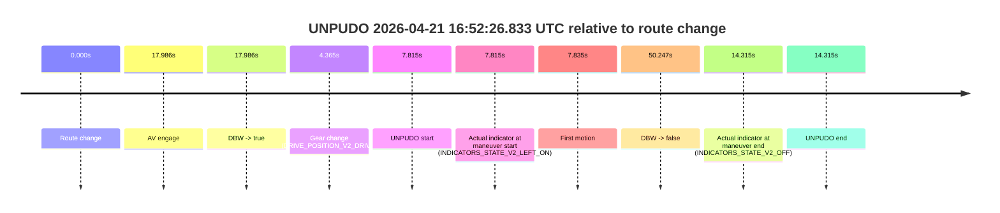
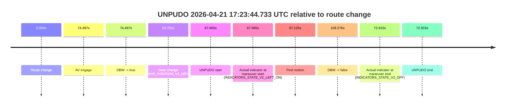
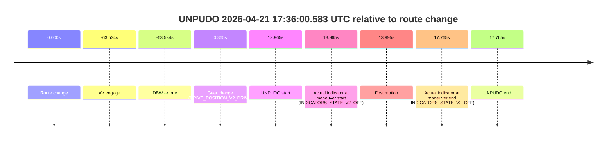

# Run Report: fme10011/2026-04-21--16-14-26--gen2-av-9f0c228a-9b71-407b-834d-29b70e16c322

| Field | Value |
|---|---|
| Run ID | `fme10011/2026-04-21--16-14-26--gen2-av-9f0c228a-9b71-407b-834d-29b70e16c322` |
| Date | `2026-04-21` |
| Model(s) | `pink-manta-ray-smooth` |
| Author | `guy.geva` |
| Event count | `11` |

## unpudo 2026-04-21 16:37:40.283 UTC

| Field | Value |
|---|---|
| Model | `pink-manta-ray-smooth` |
| Author | `guy.geva` |
| Run ID | `fme10011/2026-04-21--16-14-26--gen2-av-9f0c228a-9b71-407b-834d-29b70e16c322` |
| Date | `2026-04-21` |
| Time (UTC) | `16:37:40.283` |
| Event type | `unpudo` |
| Disengagement type | `none observed` |
| Route change | `found` |
| Console | [run](https://console.sso.wayve.ai/run/fme10011/2026-04-21--16-14-26--gen2-av-9f0c228a-9b71-407b-834d-29b70e16c322?id=&time-unixus=1776789460283304) |
| Foxglove | [segment](https://app.foxglove.dev/wayve-on-prem/p/prj_0dX18KZdVHg1fmmI/view?ds=foxglove-stream&ds.deviceName=fme10011&ds.start=2026-04-21T16%3A37%3A22.718638Z&ds.end=2026-04-21T16%3A39%3A52.823838Z&layoutId=lay_0e7VD4WIKDQGU73Y&time=2026-04-21T16%3A37%3A40.283304Z) |

### Event card: non-av

- Non-AV: there is no AV-owned portion anywhere inside the detected unpudo timeline, so it is kept for coverage but excluded from model success / failure scoring.

| Event | Time (UTC) | Delta from route change |
|---|---:|---:|
| Route change | 2026-04-21 16:37:32.718 | `0.000s` |
| AV engage | 2026-04-21 16:37:58.344 | `25.626s` |
| DBW -> true | 2026-04-21 16:37:58.344 | `25.626s` |
| Gear change (DRIVE_POSITION_V2_DRIVE) | 2026-04-21 16:37:37.283 | `4.565s` |
| UNPUDO start | 2026-04-21 16:37:40.283 | `7.565s` |
| Actual indicator at maneuver start (INDICATORS_STATE_V2_LEFT_ON) | 2026-04-21 16:37:40.283 | `7.565s` |
| First motion | 2026-04-21 16:37:40.332 | `7.614s` |
| DBW -> false | 2026-04-21 16:39:42.823 | `130.105s` |
| Actual indicator at maneuver end (INDICATORS_STATE_V2_OFF) | 2026-04-21 16:37:45.683 | `12.965s` |
| UNPUDO end | 2026-04-21 16:37:45.683 | `12.965s` |

| Metric | Value |
|---|---|
| Outcome | `non-av` |
| Effective failure type | `none` |
| Route change status | `found` |
| DBW at event start | `false` |
| DBW at event end | `false` |
| Predicted gear at AV start | `DRIVE_POSITION_V2_DRIVE` |
| Actual gear at AV start | `DRIVE_POSITION_V2_DRIVE` |
| Predicted gear at event start | `DRIVE_POSITION_V2_DRIVE` |
| Actual gear at event start | `DRIVE_POSITION_V2_DRIVE` |
| Planned indicator direction | `INDICATORS_STATE_V2_LEFT_ON` |
| Controller indicator direction | `INDICATORS_STATE_V2_LEFT_ON` |
| Actual indicator direction | `INDICATORS_STATE_V2_LEFT_ON` |
| Actual indicator at maneuver end | `INDICATORS_STATE_V2_OFF` |
| Driver accel help in AV | `false` |
| Driver accel help timestamp | `n/a` |
| Max accel pedal pct in AV | `0.0%` |
| Max brake pedal pct in AV | `0.0%` |
| Max speed mps in AV | `0.000` |
| Route -> AV | `25.626s` |
| AV -> event start | `-18.062s` |
| AV -> first motion | `-18.012s` |
| AV duration before disengagement | `104.479s` |
| Trajectory waypoint count | `37` |
| Driving-plan step count | `11` |

The scored portion starts from the AV-owned window, not from the pre-AV setup. Route-change search in the stopped pre-event segment was `found`, with the baseline therefore set to route change. At the event anchor the model predicts `DRIVE_POSITION_V2_DRIVE` and the actual gear is `DRIVE_POSITION_V2_DRIVE`. The effective model outcome is `non-av` because `there is no AV-owned overlap inside the event timeline`.

### Resolution

| Field | Value |
|---|---|
| Final outcome | `non-av` |
| Do we agree with this label? | `yes` |
| Source disengagement type | `none observed` |
| Resolved effective failure type | `none` |
| Confidence | `high` |

## unpudo 2026-04-21 16:46:36.383 UTC

| Field | Value |
|---|---|
| Model | `pink-manta-ray-smooth` |
| Author | `guy.geva` |
| Run ID | `fme10011/2026-04-21--16-14-26--gen2-av-9f0c228a-9b71-407b-834d-29b70e16c322` |
| Date | `2026-04-21` |
| Time (UTC) | `16:46:36.383` |
| Event type | `unpudo` |
| Disengagement type | `none observed` |
| Route change | `found` |
| Console | [run](https://console.sso.wayve.ai/run/fme10011/2026-04-21--16-14-26--gen2-av-9f0c228a-9b71-407b-834d-29b70e16c322?id=&time-unixus=1776789996383311) |
| Foxglove | [segment](https://app.foxglove.dev/wayve-on-prem/p/prj_0dX18KZdVHg1fmmI/view?ds=foxglove-stream&ds.deviceName=fme10011&ds.start=2026-04-21T16%3A44%3A40.818314Z&ds.end=2026-04-21T16%3A47%3A39.384214Z&layoutId=lay_0e7VD4WIKDQGU73Y&time=2026-04-21T16%3A46%3A36.383311Z) |

### Event card: non-av

- Non-AV: there is no AV-owned portion anywhere inside the detected unpudo timeline, so it is kept for coverage but excluded from model success / failure scoring.

| Event | Time (UTC) | Delta from route change |
|---|---:|---:|
| Route change | 2026-04-21 16:44:50.818 | `0.000s` |
| AV engage | 2026-04-21 16:47:15.104 | `144.287s` |
| DBW -> true | 2026-04-21 16:47:15.104 | `144.287s` |
| Gear change (DRIVE_POSITION_V2_DRIVE) | 2026-04-21 16:46:34.533 | `103.715s` |
| UNPUDO start | 2026-04-21 16:46:36.383 | `105.565s` |
| Actual indicator at maneuver start (INDICATORS_STATE_V2_OFF) | 2026-04-21 16:46:36.383 | `105.565s` |
| First motion | 2026-04-21 16:46:36.432 | `105.615s` |
| DBW -> false | 2026-04-21 16:47:29.384 | `158.566s` |
| Actual indicator at maneuver end (INDICATORS_STATE_V2_OFF) | 2026-04-21 16:47:13.333 | `142.515s` |
| UNPUDO end | 2026-04-21 16:47:13.333 | `142.515s` |

| Metric | Value |
|---|---|
| Outcome | `non-av` |
| Effective failure type | `none` |
| Route change status | `found` |
| DBW at event start | `false` |
| DBW at event end | `false` |
| Predicted gear at AV start | `DRIVE_POSITION_V2_DRIVE` |
| Actual gear at AV start | `DRIVE_POSITION_V2_DRIVE` |
| Predicted gear at event start | `DRIVE_POSITION_V2_DRIVE` |
| Actual gear at event start | `DRIVE_POSITION_V2_DRIVE` |
| Planned indicator direction | `INDICATORS_STATE_V2_OFF` |
| Controller indicator direction | `INDICATORS_STATE_V2_OFF` |
| Actual indicator direction | `INDICATORS_STATE_V2_OFF` |
| Actual indicator at maneuver end | `INDICATORS_STATE_V2_OFF` |
| Driver accel help in AV | `false` |
| Driver accel help timestamp | `n/a` |
| Max accel pedal pct in AV | `0.0%` |
| Max brake pedal pct in AV | `0.0%` |
| Max speed mps in AV | `0.000` |
| Route -> AV | `144.287s` |
| AV -> event start | `-38.722s` |
| AV -> first motion | `-38.672s` |
| AV duration before disengagement | `14.279s` |
| Trajectory waypoint count | `37` |
| Driving-plan step count | `11` |

The scored portion starts from the AV-owned window, not from the pre-AV setup. Route-change search in the stopped pre-event segment was `found`, with the baseline therefore set to route change. At the event anchor the model predicts `DRIVE_POSITION_V2_DRIVE` and the actual gear is `DRIVE_POSITION_V2_DRIVE`. The effective model outcome is `non-av` because `there is no AV-owned overlap inside the event timeline`.

### Resolution

| Field | Value |
|---|---|
| Final outcome | `non-av` |
| Do we agree with this label? | `yes` |
| Source disengagement type | `none observed` |
| Resolved effective failure type | `none` |
| Confidence | `high` |

## unpudo 2026-04-21 16:52:26.833 UTC

| Field | Value |
|---|---|
| Model | `pink-manta-ray-smooth` |
| Author | `guy.geva` |
| Run ID | `fme10011/2026-04-21--16-14-26--gen2-av-9f0c228a-9b71-407b-834d-29b70e16c322` |
| Date | `2026-04-21` |
| Time (UTC) | `16:52:26.833` |
| Event type | `unpudo` |
| Disengagement type | `none observed` |
| Route change | `found` |
| Console | [run](https://console.sso.wayve.ai/run/fme10011/2026-04-21--16-14-26--gen2-av-9f0c228a-9b71-407b-834d-29b70e16c322?id=&time-unixus=1776790346833298) |
| Foxglove | [segment](https://app.foxglove.dev/wayve-on-prem/p/prj_0dX18KZdVHg1fmmI/view?ds=foxglove-stream&ds.deviceName=fme10011&ds.start=2026-04-21T16%3A52%3A09.018234Z&ds.end=2026-04-21T16%3A53%3A19.264933Z&layoutId=lay_0e7VD4WIKDQGU73Y&time=2026-04-21T16%3A52%3A26.833298Z) |

### Event card: non-av

- Non-AV: there is no AV-owned portion anywhere inside the detected unpudo timeline, so it is kept for coverage but excluded from model success / failure scoring.

| Event | Time (UTC) | Delta from route change |
|---|---:|---:|
| Route change | 2026-04-21 16:52:19.018 | `0.000s` |
| AV engage | 2026-04-21 16:52:37.003 | `17.986s` |
| DBW -> true | 2026-04-21 16:52:37.003 | `17.986s` |
| Gear change (DRIVE_POSITION_V2_DRIVE) | 2026-04-21 16:52:23.383 | `4.365s` |
| UNPUDO start | 2026-04-21 16:52:26.833 | `7.815s` |
| Actual indicator at maneuver start (INDICATORS_STATE_V2_LEFT_ON) | 2026-04-21 16:52:26.833 | `7.815s` |
| First motion | 2026-04-21 16:52:26.853 | `7.835s` |
| DBW -> false | 2026-04-21 16:53:09.264 | `50.247s` |
| Actual indicator at maneuver end (INDICATORS_STATE_V2_OFF) | 2026-04-21 16:52:33.333 | `14.315s` |
| UNPUDO end | 2026-04-21 16:52:33.333 | `14.315s` |

| Metric | Value |
|---|---|
| Outcome | `non-av` |
| Effective failure type | `none` |
| Route change status | `found` |
| DBW at event start | `false` |
| DBW at event end | `false` |
| Predicted gear at AV start | `DRIVE_POSITION_V2_DRIVE` |
| Actual gear at AV start | `DRIVE_POSITION_V2_DRIVE` |
| Predicted gear at event start | `DRIVE_POSITION_V2_DRIVE` |
| Actual gear at event start | `DRIVE_POSITION_V2_DRIVE` |
| Planned indicator direction | `INDICATORS_STATE_V2_LEFT_ON` |
| Controller indicator direction | `INDICATORS_STATE_V2_LEFT_ON` |
| Actual indicator direction | `INDICATORS_STATE_V2_LEFT_ON` |
| Actual indicator at maneuver end | `INDICATORS_STATE_V2_OFF` |
| Driver accel help in AV | `false` |
| Driver accel help timestamp | `n/a` |
| Max accel pedal pct in AV | `0.0%` |
| Max brake pedal pct in AV | `0.0%` |
| Max speed mps in AV | `0.000` |
| Route -> AV | `17.986s` |
| AV -> event start | `-10.171s` |
| AV -> first motion | `-10.151s` |
| AV duration before disengagement | `32.261s` |
| Trajectory waypoint count | `36` |
| Driving-plan step count | `11` |

The scored portion starts from the AV-owned window, not from the pre-AV setup. Route-change search in the stopped pre-event segment was `found`, with the baseline therefore set to route change. At the event anchor the model predicts `DRIVE_POSITION_V2_DRIVE` and the actual gear is `DRIVE_POSITION_V2_DRIVE`. The effective model outcome is `non-av` because `there is no AV-owned overlap inside the event timeline`.

### Resolution

| Field | Value |
|---|---|
| Final outcome | `non-av` |
| Do we agree with this label? | `yes` |
| Source disengagement type | `none observed` |
| Resolved effective failure type | `none` |
| Confidence | `high` |

## unpudo 2026-04-21 16:53:37.883 UTC

| Field | Value |
|---|---|
| Model | `pink-manta-ray-smooth` |
| Author | `guy.geva` |
| Run ID | `fme10011/2026-04-21--16-14-26--gen2-av-9f0c228a-9b71-407b-834d-29b70e16c322` |
| Date | `2026-04-21` |
| Time (UTC) | `16:53:37.883` |
| Event type | `unpudo` |
| Disengagement type | `none observed` |
| Route change | `found` |
| Console | [run](https://console.sso.wayve.ai/run/fme10011/2026-04-21--16-14-26--gen2-av-9f0c228a-9b71-407b-834d-29b70e16c322?id=&time-unixus=1776790417883304) |
| Foxglove | [segment](https://app.foxglove.dev/wayve-on-prem/p/prj_0dX18KZdVHg1fmmI/view?ds=foxglove-stream&ds.deviceName=fme10011&ds.start=2026-04-21T16%3A52%3A09.018234Z&ds.end=2026-04-21T16%3A55%3A00.923827Z&layoutId=lay_0e7VD4WIKDQGU73Y&time=2026-04-21T16%3A53%3A37.883304Z) |

### Event card: non-av

- Non-AV: there is no AV-owned portion anywhere inside the detected unpudo timeline, so it is kept for coverage but excluded from model success / failure scoring.

| Event | Time (UTC) | Delta from route change |
|---|---:|---:|
| Route change | 2026-04-21 16:52:19.018 | `0.000s` |
| AV engage | 2026-04-21 16:53:53.503 | `94.486s` |
| DBW -> true | 2026-04-21 16:53:53.503 | `94.486s` |
| Gear change (DRIVE_POSITION_V2_DRIVE) | 2026-04-21 16:53:35.633 | `76.615s` |
| UNPUDO start | 2026-04-21 16:53:37.883 | `78.865s` |
| Actual indicator at maneuver start (INDICATORS_STATE_V2_LEFT_ON) | 2026-04-21 16:53:37.883 | `78.865s` |
| First motion | 2026-04-21 16:53:37.932 | `78.915s` |
| DBW -> false | 2026-04-21 16:54:50.923 | `151.906s` |
| Actual indicator at maneuver end (INDICATORS_STATE_V2_OFF) | 2026-04-21 16:53:43.483 | `84.465s` |
| UNPUDO end | 2026-04-21 16:53:43.483 | `84.465s` |

| Metric | Value |
|---|---|
| Outcome | `non-av` |
| Effective failure type | `none` |
| Route change status | `found` |
| DBW at event start | `false` |
| DBW at event end | `false` |
| Predicted gear at AV start | `DRIVE_POSITION_V2_DRIVE` |
| Actual gear at AV start | `DRIVE_POSITION_V2_DRIVE` |
| Predicted gear at event start | `DRIVE_POSITION_V2_DRIVE` |
| Actual gear at event start | `DRIVE_POSITION_V2_DRIVE` |
| Planned indicator direction | `INDICATORS_STATE_V2_LEFT_ON` |
| Controller indicator direction | `INDICATORS_STATE_V2_LEFT_ON` |
| Actual indicator direction | `INDICATORS_STATE_V2_LEFT_ON` |
| Actual indicator at maneuver end | `INDICATORS_STATE_V2_OFF` |
| Driver accel help in AV | `false` |
| Driver accel help timestamp | `n/a` |
| Max accel pedal pct in AV | `0.0%` |
| Max brake pedal pct in AV | `0.0%` |
| Max speed mps in AV | `0.000` |
| Route -> AV | `94.486s` |
| AV -> event start | `-15.621s` |
| AV -> first motion | `-15.571s` |
| AV duration before disengagement | `57.420s` |
| Trajectory waypoint count | `37` |
| Driving-plan step count | `11` |

The scored portion starts from the AV-owned window, not from the pre-AV setup. Route-change search in the stopped pre-event segment was `found`, with the baseline therefore set to route change. At the event anchor the model predicts `DRIVE_POSITION_V2_DRIVE` and the actual gear is `DRIVE_POSITION_V2_DRIVE`. The effective model outcome is `non-av` because `there is no AV-owned overlap inside the event timeline`.

### Resolution

| Field | Value |
|---|---|
| Final outcome | `non-av` |
| Do we agree with this label? | `yes` |
| Source disengagement type | `none observed` |
| Resolved effective failure type | `none` |
| Confidence | `high` |

## unpudo 2026-04-21 17:11:56.483 UTC

| Field | Value |
|---|---|
| Model | `pink-manta-ray-smooth` |
| Author | `guy.geva` |
| Run ID | `fme10011/2026-04-21--16-14-26--gen2-av-9f0c228a-9b71-407b-834d-29b70e16c322` |
| Date | `2026-04-21` |
| Time (UTC) | `17:11:56.483` |
| Event type | `unpudo` |
| Disengagement type | `none observed` |
| Route change | `found` |
| Console | [run](https://console.sso.wayve.ai/run/fme10011/2026-04-21--16-14-26--gen2-av-9f0c228a-9b71-407b-834d-29b70e16c322?id=&time-unixus=1776791516483319) |
| Foxglove | [segment](https://app.foxglove.dev/wayve-on-prem/p/prj_0dX18KZdVHg1fmmI/view?ds=foxglove-stream&ds.deviceName=fme10011&ds.start=2026-04-21T17%3A09%3A57.818259Z&ds.end=2026-04-21T17%3A12%3A58.725299Z&layoutId=lay_0e7VD4WIKDQGU73Y&time=2026-04-21T17%3A11%3A56.483319Z) |

### Event card: non-av

- Non-AV: there is no AV-owned portion anywhere inside the detected unpudo timeline, so it is kept for coverage but excluded from model success / failure scoring.

| Event | Time (UTC) | Delta from route change |
|---|---:|---:|
| Route change | 2026-04-21 17:10:07.818 | `0.000s` |
| AV engage | 2026-04-21 17:12:05.463 | `117.646s` |
| DBW -> true | 2026-04-21 17:12:05.463 | `117.646s` |
| Gear change (DRIVE_POSITION_V2_DRIVE) | 2026-04-21 17:11:50.333 | `102.515s` |
| UNPUDO start | 2026-04-21 17:11:56.483 | `108.665s` |
| Actual indicator at maneuver start (INDICATORS_STATE_V2_OFF) | 2026-04-21 17:11:56.483 | `108.665s` |
| First motion | 2026-04-21 17:11:56.553 | `108.735s` |
| DBW -> false | 2026-04-21 17:12:48.725 | `160.907s` |
| Actual indicator at maneuver end (INDICATORS_STATE_V2_OFF) | 2026-04-21 17:12:01.033 | `113.215s` |
| UNPUDO end | 2026-04-21 17:12:01.033 | `113.215s` |

| Metric | Value |
|---|---|
| Outcome | `non-av` |
| Effective failure type | `none` |
| Route change status | `found` |
| DBW at event start | `false` |
| DBW at event end | `false` |
| Predicted gear at AV start | `DRIVE_POSITION_V2_DRIVE` |
| Actual gear at AV start | `DRIVE_POSITION_V2_DRIVE` |
| Predicted gear at event start | `DRIVE_POSITION_V2_DRIVE` |
| Actual gear at event start | `DRIVE_POSITION_V2_DRIVE` |
| Planned indicator direction | `INDICATORS_STATE_V2_LEFT_ON` |
| Controller indicator direction | `INDICATORS_STATE_V2_LEFT_ON` |
| Actual indicator direction | `INDICATORS_STATE_V2_OFF` |
| Actual indicator at maneuver end | `INDICATORS_STATE_V2_OFF` |
| Driver accel help in AV | `false` |
| Driver accel help timestamp | `n/a` |
| Max accel pedal pct in AV | `0.0%` |
| Max brake pedal pct in AV | `0.0%` |
| Max speed mps in AV | `0.000` |
| Route -> AV | `117.646s` |
| AV -> event start | `-8.980s` |
| AV -> first motion | `-8.911s` |
| AV duration before disengagement | `43.262s` |
| Trajectory waypoint count | `37` |
| Driving-plan step count | `11` |

The scored portion starts from the AV-owned window, not from the pre-AV setup. Route-change search in the stopped pre-event segment was `found`, with the baseline therefore set to route change. At the event anchor the model predicts `DRIVE_POSITION_V2_DRIVE` and the actual gear is `DRIVE_POSITION_V2_DRIVE`. The effective model outcome is `non-av` because `there is no AV-owned overlap inside the event timeline`.

### Resolution

| Field | Value |
|---|---|
| Final outcome | `non-av` |
| Do we agree with this label? | `yes` |
| Source disengagement type | `none observed` |
| Resolved effective failure type | `none` |
| Confidence | `high` |

## unpudo 2026-04-21 17:18:57.433 UTC

| Field | Value |
|---|---|
| Model | `pink-manta-ray-smooth` |
| Author | `guy.geva` |
| Run ID | `fme10011/2026-04-21--16-14-26--gen2-av-9f0c228a-9b71-407b-834d-29b70e16c322` |
| Date | `2026-04-21` |
| Time (UTC) | `17:18:57.433` |
| Event type | `unpudo` |
| Disengagement type | `none observed` |
| Route change | `found` |
| Console | [run](https://console.sso.wayve.ai/run/fme10011/2026-04-21--16-14-26--gen2-av-9f0c228a-9b71-407b-834d-29b70e16c322?id=&time-unixus=1776791937433309) |
| Foxglove | [segment](https://app.foxglove.dev/wayve-on-prem/p/prj_0dX18KZdVHg1fmmI/view?ds=foxglove-stream&ds.deviceName=fme10011&ds.start=2026-04-21T17%3A18%3A22.968250Z&ds.end=2026-04-21T17%3A20%3A48.223730Z&layoutId=lay_0e7VD4WIKDQGU73Y&time=2026-04-21T17%3A18%3A57.433309Z) |

### Event card: non-av

- Non-AV: there is no AV-owned portion anywhere inside the detected unpudo timeline, so it is kept for coverage but excluded from model success / failure scoring.

| Event | Time (UTC) | Delta from route change |
|---|---:|---:|
| Route change | 2026-04-21 17:18:32.968 | `0.000s` |
| AV engage | 2026-04-21 17:19:44.464 | `71.496s` |
| DBW -> true | 2026-04-21 17:19:44.464 | `71.496s` |
| Gear change (DRIVE_POSITION_V2_REVERSE) | 2026-04-21 17:18:36.383 | `3.415s` |
| UNPUDO start | 2026-04-21 17:18:57.433 | `24.465s` |
| Actual indicator at maneuver start (INDICATORS_STATE_V2_OFF) | 2026-04-21 17:18:57.433 | `24.465s` |
| First motion | 2026-04-21 17:19:01.853 | `28.885s` |
| DBW -> false | 2026-04-21 17:20:38.223 | `125.255s` |
| Actual indicator at maneuver end (INDICATORS_STATE_V2_RIGHT_ON) | 2026-04-21 17:19:27.333 | `54.365s` |
| UNPUDO end | 2026-04-21 17:19:27.333 | `54.365s` |

| Metric | Value |
|---|---|
| Outcome | `non-av` |
| Effective failure type | `none` |
| Route change status | `found` |
| DBW at event start | `false` |
| DBW at event end | `false` |
| Predicted gear at AV start | `DRIVE_POSITION_V2_DRIVE` |
| Actual gear at AV start | `DRIVE_POSITION_V2_DRIVE` |
| Predicted gear at event start | `DRIVE_POSITION_V2_REVERSE` |
| Actual gear at event start | `DRIVE_POSITION_V2_REVERSE` |
| Planned indicator direction | `INDICATORS_STATE_V2_OFF` |
| Controller indicator direction | `INDICATORS_STATE_V2_OFF` |
| Actual indicator direction | `INDICATORS_STATE_V2_OFF` |
| Actual indicator at maneuver end | `INDICATORS_STATE_V2_RIGHT_ON` |
| Driver accel help in AV | `false` |
| Driver accel help timestamp | `n/a` |
| Max accel pedal pct in AV | `0.0%` |
| Max brake pedal pct in AV | `0.0%` |
| Max speed mps in AV | `0.000` |
| Route -> AV | `71.496s` |
| AV -> event start | `-47.031s` |
| AV -> first motion | `-42.611s` |
| AV duration before disengagement | `53.759s` |
| Trajectory waypoint count | `38` |
| Driving-plan step count | `11` |

The scored portion starts from the AV-owned window, not from the pre-AV setup. Route-change search in the stopped pre-event segment was `found`, with the baseline therefore set to route change. At the event anchor the model predicts `DRIVE_POSITION_V2_REVERSE` and the actual gear is `DRIVE_POSITION_V2_REVERSE`. The effective model outcome is `non-av` because `there is no AV-owned overlap inside the event timeline`.

### Resolution

| Field | Value |
|---|---|
| Final outcome | `non-av` |
| Do we agree with this label? | `yes` |
| Source disengagement type | `none observed` |
| Resolved effective failure type | `none` |
| Confidence | `high` |

## unpudo 2026-04-21 17:22:44.433 UTC

| Field | Value |
|---|---|
| Model | `pink-manta-ray-smooth` |
| Author | `guy.geva` |
| Run ID | `fme10011/2026-04-21--16-14-26--gen2-av-9f0c228a-9b71-407b-834d-29b70e16c322` |
| Date | `2026-04-21` |
| Time (UTC) | `17:22:44.433` |
| Event type | `unpudo` |
| Disengagement type | `none observed` |
| Route change | `found` |
| Console | [run](https://console.sso.wayve.ai/run/fme10011/2026-04-21--16-14-26--gen2-av-9f0c228a-9b71-407b-834d-29b70e16c322?id=&time-unixus=1776792164433308) |
| Foxglove | [segment](https://app.foxglove.dev/wayve-on-prem/p/prj_0dX18KZdVHg1fmmI/view?ds=foxglove-stream&ds.deviceName=fme10011&ds.start=2026-04-21T17%3A20%3A58.418245Z&ds.end=2026-04-21T17%3A23%3A15.545503Z&layoutId=lay_0e7VD4WIKDQGU73Y&time=2026-04-21T17%3A22%3A44.433308Z) |

### Event card: non-av

- Non-AV: there is no AV-owned portion anywhere inside the detected unpudo timeline, so it is kept for coverage but excluded from model success / failure scoring.

| Event | Time (UTC) | Delta from route change |
|---|---:|---:|
| Route change | 2026-04-21 17:21:08.418 | `0.000s` |
| AV engage | 2026-04-21 17:22:51.164 | `102.746s` |
| DBW -> true | 2026-04-21 17:22:51.164 | `102.746s` |
| Gear change (DRIVE_POSITION_V2_DRIVE) | 2026-04-21 17:22:42.233 | `93.815s` |
| UNPUDO start | 2026-04-21 17:22:44.433 | `96.015s` |
| Actual indicator at maneuver start (INDICATORS_STATE_V2_LEFT_ON) | 2026-04-21 17:22:44.433 | `96.015s` |
| First motion | 2026-04-21 17:22:44.552 | `96.135s` |
| DBW -> false | 2026-04-21 17:23:05.545 | `117.127s` |
| Actual indicator at maneuver end (INDICATORS_STATE_V2_OFF) | 2026-04-21 17:22:49.733 | `101.315s` |
| UNPUDO end | 2026-04-21 17:22:49.733 | `101.315s` |

| Metric | Value |
|---|---|
| Outcome | `non-av` |
| Effective failure type | `none` |
| Route change status | `found` |
| DBW at event start | `false` |
| DBW at event end | `false` |
| Predicted gear at AV start | `DRIVE_POSITION_V2_DRIVE` |
| Actual gear at AV start | `DRIVE_POSITION_V2_DRIVE` |
| Predicted gear at event start | `DRIVE_POSITION_V2_DRIVE` |
| Actual gear at event start | `DRIVE_POSITION_V2_DRIVE` |
| Planned indicator direction | `INDICATORS_STATE_V2_LEFT_ON` |
| Controller indicator direction | `INDICATORS_STATE_V2_LEFT_ON` |
| Actual indicator direction | `INDICATORS_STATE_V2_LEFT_ON` |
| Actual indicator at maneuver end | `INDICATORS_STATE_V2_OFF` |
| Driver accel help in AV | `false` |
| Driver accel help timestamp | `n/a` |
| Max accel pedal pct in AV | `0.0%` |
| Max brake pedal pct in AV | `0.0%` |
| Max speed mps in AV | `0.000` |
| Route -> AV | `102.746s` |
| AV -> event start | `-6.731s` |
| AV -> first motion | `-6.612s` |
| AV duration before disengagement | `14.381s` |
| Trajectory waypoint count | `36` |
| Driving-plan step count | `11` |

The scored portion starts from the AV-owned window, not from the pre-AV setup. Route-change search in the stopped pre-event segment was `found`, with the baseline therefore set to route change. At the event anchor the model predicts `DRIVE_POSITION_V2_DRIVE` and the actual gear is `DRIVE_POSITION_V2_DRIVE`. The effective model outcome is `non-av` because `there is no AV-owned overlap inside the event timeline`.

### Resolution

| Field | Value |
|---|---|
| Final outcome | `non-av` |
| Do we agree with this label? | `yes` |
| Source disengagement type | `none observed` |
| Resolved effective failure type | `none` |
| Confidence | `high` |

## unpudo 2026-04-21 17:23:44.733 UTC

| Field | Value |
|---|---|
| Model | `pink-manta-ray-smooth` |
| Author | `guy.geva` |
| Run ID | `fme10011/2026-04-21--16-14-26--gen2-av-9f0c228a-9b71-407b-834d-29b70e16c322` |
| Date | `2026-04-21` |
| Time (UTC) | `17:23:44.733` |
| Event type | `unpudo` |
| Disengagement type | `none observed` |
| Route change | `found` |
| Console | [run](https://console.sso.wayve.ai/run/fme10011/2026-04-21--16-14-26--gen2-av-9f0c228a-9b71-407b-834d-29b70e16c322?id=&time-unixus=1776792224733313) |
| Foxglove | [segment](https://app.foxglove.dev/wayve-on-prem/p/prj_0dX18KZdVHg1fmmI/view?ds=foxglove-stream&ds.deviceName=fme10011&ds.start=2026-04-21T17%3A22%3A27.668232Z&ds.end=2026-04-21T17%3A24%3A36.944687Z&layoutId=lay_0e7VD4WIKDQGU73Y&time=2026-04-21T17%3A23%3A44.733313Z) |

### Event card: non-av

- Non-AV: there is no AV-owned portion anywhere inside the detected unpudo timeline, so it is kept for coverage but excluded from model success / failure scoring.

| Event | Time (UTC) | Delta from route change |
|---|---:|---:|
| Route change | 2026-04-21 17:22:37.668 | `0.000s` |
| AV engage | 2026-04-21 17:23:52.164 | `74.497s` |
| DBW -> true | 2026-04-21 17:23:52.164 | `74.497s` |
| Gear change (DRIVE_POSITION_V2_DRIVE) | 2026-04-21 17:23:42.433 | `64.765s` |
| UNPUDO start | 2026-04-21 17:23:44.733 | `67.065s` |
| Actual indicator at maneuver start (INDICATORS_STATE_V2_LEFT_ON) | 2026-04-21 17:23:44.733 | `67.065s` |
| First motion | 2026-04-21 17:23:44.792 | `67.125s` |
| DBW -> false | 2026-04-21 17:24:26.944 | `109.276s` |
| Actual indicator at maneuver end (INDICATORS_STATE_V2_OFF) | 2026-04-21 17:23:50.583 | `72.915s` |
| UNPUDO end | 2026-04-21 17:23:50.583 | `72.915s` |

| Metric | Value |
|---|---|
| Outcome | `non-av` |
| Effective failure type | `none` |
| Route change status | `found` |
| DBW at event start | `false` |
| DBW at event end | `false` |
| Predicted gear at AV start | `DRIVE_POSITION_V2_DRIVE` |
| Actual gear at AV start | `DRIVE_POSITION_V2_DRIVE` |
| Predicted gear at event start | `DRIVE_POSITION_V2_DRIVE` |
| Actual gear at event start | `DRIVE_POSITION_V2_DRIVE` |
| Planned indicator direction | `INDICATORS_STATE_V2_LEFT_ON` |
| Controller indicator direction | `INDICATORS_STATE_V2_LEFT_ON` |
| Actual indicator direction | `INDICATORS_STATE_V2_LEFT_ON` |
| Actual indicator at maneuver end | `INDICATORS_STATE_V2_OFF` |
| Driver accel help in AV | `false` |
| Driver accel help timestamp | `n/a` |
| Max accel pedal pct in AV | `0.0%` |
| Max brake pedal pct in AV | `0.0%` |
| Max speed mps in AV | `0.000` |
| Route -> AV | `74.497s` |
| AV -> event start | `-7.432s` |
| AV -> first motion | `-7.372s` |
| AV duration before disengagement | `34.780s` |
| Trajectory waypoint count | `36` |
| Driving-plan step count | `11` |

The scored portion starts from the AV-owned window, not from the pre-AV setup. Route-change search in the stopped pre-event segment was `found`, with the baseline therefore set to route change. At the event anchor the model predicts `DRIVE_POSITION_V2_DRIVE` and the actual gear is `DRIVE_POSITION_V2_DRIVE`. The effective model outcome is `non-av` because `there is no AV-owned overlap inside the event timeline`.

### Resolution

| Field | Value |
|---|---|
| Final outcome | `non-av` |
| Do we agree with this label? | `yes` |
| Source disengagement type | `none observed` |
| Resolved effective failure type | `none` |
| Confidence | `high` |

## unpudo 2026-04-21 17:24:34.033 UTC

| Field | Value |
|---|---|
| Model | `pink-manta-ray-smooth` |
| Author | `guy.geva` |
| Run ID | `fme10011/2026-04-21--16-14-26--gen2-av-9f0c228a-9b71-407b-834d-29b70e16c322` |
| Date | `2026-04-21` |
| Time (UTC) | `17:24:34.033` |
| Event type | `unpudo` |
| Disengagement type | `none observed` |
| Route change | `found` |
| Console | [run](https://console.sso.wayve.ai/run/fme10011/2026-04-21--16-14-26--gen2-av-9f0c228a-9b71-407b-834d-29b70e16c322?id=&time-unixus=1776792274033305) |
| Foxglove | [segment](https://app.foxglove.dev/wayve-on-prem/p/prj_0dX18KZdVHg1fmmI/view?ds=foxglove-stream&ds.deviceName=fme10011&ds.start=2026-04-21T17%3A22%3A27.668232Z&ds.end=2026-04-21T17%3A25%3A49.344751Z&layoutId=lay_0e7VD4WIKDQGU73Y&time=2026-04-21T17%3A24%3A34.033305Z) |

### Event card: non-av

- Non-AV: there is no AV-owned portion anywhere inside the detected unpudo timeline, so it is kept for coverage but excluded from model success / failure scoring.

| Event | Time (UTC) | Delta from route change |
|---|---:|---:|
| Route change | 2026-04-21 17:22:37.668 | `0.000s` |
| AV engage | 2026-04-21 17:24:58.824 | `141.157s` |
| DBW -> true | 2026-04-21 17:24:58.824 | `141.157s` |
| Gear change (DRIVE_POSITION_V2_DRIVE) | 2026-04-21 17:24:29.883 | `112.215s` |
| UNPUDO start | 2026-04-21 17:24:34.033 | `116.365s` |
| Actual indicator at maneuver start (INDICATORS_STATE_V2_LEFT_ON) | 2026-04-21 17:24:34.033 | `116.365s` |
| First motion | 2026-04-21 17:24:34.173 | `116.505s` |
| DBW -> false | 2026-04-21 17:25:39.344 | `181.677s` |
| Actual indicator at maneuver end (INDICATORS_STATE_V2_OFF) | 2026-04-21 17:24:52.583 | `134.915s` |
| UNPUDO end | 2026-04-21 17:24:52.583 | `134.915s` |

| Metric | Value |
|---|---|
| Outcome | `non-av` |
| Effective failure type | `none` |
| Route change status | `found` |
| DBW at event start | `false` |
| DBW at event end | `false` |
| Predicted gear at AV start | `DRIVE_POSITION_V2_DRIVE` |
| Actual gear at AV start | `DRIVE_POSITION_V2_DRIVE` |
| Predicted gear at event start | `DRIVE_POSITION_V2_DRIVE` |
| Actual gear at event start | `DRIVE_POSITION_V2_DRIVE` |
| Planned indicator direction | `INDICATORS_STATE_V2_LEFT_ON` |
| Controller indicator direction | `INDICATORS_STATE_V2_LEFT_ON` |
| Actual indicator direction | `INDICATORS_STATE_V2_LEFT_ON` |
| Actual indicator at maneuver end | `INDICATORS_STATE_V2_OFF` |
| Driver accel help in AV | `false` |
| Driver accel help timestamp | `n/a` |
| Max accel pedal pct in AV | `0.0%` |
| Max brake pedal pct in AV | `0.0%` |
| Max speed mps in AV | `0.000` |
| Route -> AV | `141.157s` |
| AV -> event start | `-24.792s` |
| AV -> first motion | `-24.652s` |
| AV duration before disengagement | `40.520s` |
| Trajectory waypoint count | `36` |
| Driving-plan step count | `11` |

The scored portion starts from the AV-owned window, not from the pre-AV setup. Route-change search in the stopped pre-event segment was `found`, with the baseline therefore set to route change. At the event anchor the model predicts `DRIVE_POSITION_V2_DRIVE` and the actual gear is `DRIVE_POSITION_V2_DRIVE`. The effective model outcome is `non-av` because `there is no AV-owned overlap inside the event timeline`.

### Resolution

| Field | Value |
|---|---|
| Final outcome | `non-av` |
| Do we agree with this label? | `yes` |
| Source disengagement type | `none observed` |
| Resolved effective failure type | `none` |
| Confidence | `high` |

## unpudo 2026-04-21 17:25:40.033 UTC

| Field | Value |
|---|---|
| Model | `pink-manta-ray-smooth` |
| Author | `guy.geva` |
| Run ID | `fme10011/2026-04-21--16-14-26--gen2-av-9f0c228a-9b71-407b-834d-29b70e16c322` |
| Date | `2026-04-21` |
| Time (UTC) | `17:25:40.033` |
| Event type | `unpudo` |
| Disengagement type | `none observed` |
| Route change | `found` |
| Console | [run](https://console.sso.wayve.ai/run/fme10011/2026-04-21--16-14-26--gen2-av-9f0c228a-9b71-407b-834d-29b70e16c322?id=&time-unixus=1776792340033311) |
| Foxglove | [segment](https://app.foxglove.dev/wayve-on-prem/p/prj_0dX18KZdVHg1fmmI/view?ds=foxglove-stream&ds.deviceName=fme10011&ds.start=2026-04-21T17%3A24%3A11.568246Z&ds.end=2026-04-21T17%3A26%3A26.664969Z&layoutId=lay_0e7VD4WIKDQGU73Y&time=2026-04-21T17%3A25%3A40.033311Z) |

### Event card: non-av

- Non-AV: there is no AV-owned portion anywhere inside the detected unpudo timeline, so it is kept for coverage but excluded from model success / failure scoring.

| Event | Time (UTC) | Delta from route change |
|---|---:|---:|
| Route change | 2026-04-21 17:24:21.568 | `0.000s` |
| AV engage | 2026-04-21 17:25:50.683 | `89.116s` |
| DBW -> true | 2026-04-21 17:25:50.683 | `89.116s` |
| Gear change (DRIVE_POSITION_V2_DRIVE) | 2026-04-21 17:25:34.833 | `73.265s` |
| UNPUDO start | 2026-04-21 17:25:40.033 | `78.465s` |
| Actual indicator at maneuver start (INDICATORS_STATE_V2_OFF) | 2026-04-21 17:25:40.033 | `78.465s` |
| First motion | 2026-04-21 17:25:40.092 | `78.525s` |
| DBW -> false | 2026-04-21 17:26:16.664 | `115.097s` |
| Actual indicator at maneuver end (INDICATORS_STATE_V2_OFF) | 2026-04-21 17:25:44.583 | `83.015s` |
| UNPUDO end | 2026-04-21 17:25:44.583 | `83.015s` |

| Metric | Value |
|---|---|
| Outcome | `non-av` |
| Effective failure type | `none` |
| Route change status | `found` |
| DBW at event start | `false` |
| DBW at event end | `false` |
| Predicted gear at AV start | `DRIVE_POSITION_V2_DRIVE` |
| Actual gear at AV start | `DRIVE_POSITION_V2_DRIVE` |
| Predicted gear at event start | `DRIVE_POSITION_V2_DRIVE` |
| Actual gear at event start | `DRIVE_POSITION_V2_DRIVE` |
| Planned indicator direction | `INDICATORS_STATE_V2_LEFT_ON` |
| Controller indicator direction | `INDICATORS_STATE_V2_LEFT_ON` |
| Actual indicator direction | `INDICATORS_STATE_V2_OFF` |
| Actual indicator at maneuver end | `INDICATORS_STATE_V2_OFF` |
| Driver accel help in AV | `false` |
| Driver accel help timestamp | `n/a` |
| Max accel pedal pct in AV | `0.0%` |
| Max brake pedal pct in AV | `0.0%` |
| Max speed mps in AV | `0.000` |
| Route -> AV | `89.116s` |
| AV -> event start | `-10.650s` |
| AV -> first motion | `-10.591s` |
| AV duration before disengagement | `25.981s` |
| Trajectory waypoint count | `36` |
| Driving-plan step count | `11` |

The scored portion starts from the AV-owned window, not from the pre-AV setup. Route-change search in the stopped pre-event segment was `found`, with the baseline therefore set to route change. At the event anchor the model predicts `DRIVE_POSITION_V2_DRIVE` and the actual gear is `DRIVE_POSITION_V2_DRIVE`. The effective model outcome is `non-av` because `there is no AV-owned overlap inside the event timeline`.

### Resolution

| Field | Value |
|---|---|
| Final outcome | `non-av` |
| Do we agree with this label? | `yes` |
| Source disengagement type | `none observed` |
| Resolved effective failure type | `none` |
| Confidence | `high` |

## unpudo 2026-04-21 17:36:00.583 UTC

| Field | Value |
|---|---|
| Model | `pink-manta-ray-smooth` |
| Author | `guy.geva` |
| Run ID | `fme10011/2026-04-21--16-14-26--gen2-av-9f0c228a-9b71-407b-834d-29b70e16c322` |
| Date | `2026-04-21` |
| Time (UTC) | `17:36:00.583` |
| Event type | `unpudo` |
| Disengagement type | `none observed` |
| Route change | `found` |
| Console | [run](https://console.sso.wayve.ai/run/fme10011/2026-04-21--16-14-26--gen2-av-9f0c228a-9b71-407b-834d-29b70e16c322?id=&time-unixus=1776792960583305) |
| Foxglove | [segment](https://app.foxglove.dev/wayve-on-prem/p/prj_0dX18KZdVHg1fmmI/view?ds=foxglove-stream&ds.deviceName=fme10011&ds.start=2026-04-21T17%3A34%3A33.083796Z&ds.end=2026-04-21T17%3A36%3A14.383303Z&layoutId=lay_0e7VD4WIKDQGU73Y&time=2026-04-21T17%3A36%3A00.583305Z) |

### Event card: pass

- Pass: AV owns the credited unpudo through the official event window, the gear state is aligned at the anchor, and the vehicle moves without driver accelerator help in AV.

| Event | Time (UTC) | Delta from route change |
|---|---:|---:|
| Route change | 2026-04-21 17:35:46.618 | `0.000s` |
| AV engage | 2026-04-21 17:34:43.083 | `-63.534s` |
| DBW -> true | 2026-04-21 17:34:43.083 | `-63.534s` |
| Gear change (DRIVE_POSITION_V2_DRIVE) | 2026-04-21 17:35:46.983 | `0.365s` |
| UNPUDO start | 2026-04-21 17:36:00.583 | `13.965s` |
| Actual indicator at maneuver start (INDICATORS_STATE_V2_OFF) | 2026-04-21 17:36:00.583 | `13.965s` |
| First motion | 2026-04-21 17:36:00.612 | `13.995s` |
| Actual indicator at maneuver end (INDICATORS_STATE_V2_OFF) | 2026-04-21 17:36:04.383 | `17.765s` |
| UNPUDO end | 2026-04-21 17:36:04.383 | `17.765s` |

| Metric | Value |
|---|---|
| Outcome | `pass` |
| Effective failure type | `none` |
| Route change status | `found` |
| DBW at event start | `true` |
| DBW at event end | `true` |
| Predicted gear at AV start | `DRIVE_POSITION_V2_DRIVE` |
| Actual gear at AV start | `DRIVE_POSITION_V2_DRIVE` |
| Predicted gear at event start | `DRIVE_POSITION_V2_DRIVE` |
| Actual gear at event start | `DRIVE_POSITION_V2_DRIVE` |
| Planned indicator direction | `INDICATORS_STATE_V2_LEFT_ON` |
| Controller indicator direction | `INDICATORS_STATE_V2_LEFT_ON` |
| Actual indicator direction | `INDICATORS_STATE_V2_OFF` |
| Actual indicator at maneuver end | `INDICATORS_STATE_V2_OFF` |
| Driver accel help in AV | `false` |
| Driver accel help timestamp | `n/a` |
| Max accel pedal pct in AV | `0.0%` |
| Max brake pedal pct in AV | `0.0%` |
| Max speed mps in AV | `4.694` |
| Route -> AV | `-63.534s` |
| AV -> event start | `77.500s` |
| AV -> first motion | `77.529s` |
| AV duration before disengagement | `n/a` |
| Trajectory waypoint count | `37` |
| Driving-plan step count | `11` |

The scored portion starts from the AV-owned window, not from the pre-AV setup. Route-change search in the stopped pre-event segment was `found`, with the baseline therefore set to route change. At the event anchor the model predicts `DRIVE_POSITION_V2_DRIVE` and the actual gear is `DRIVE_POSITION_V2_DRIVE`. The effective model outcome is `pass` because `the credited maneuver stays AV-owned through the official event end`.

### Resolution

| Field | Value |
|---|---|
| Final outcome | `pass` |
| Do we agree with this label? | `yes` |
| Source disengagement type | `none observed` |
| Resolved effective failure type | `none` |
| Confidence | `high` |
