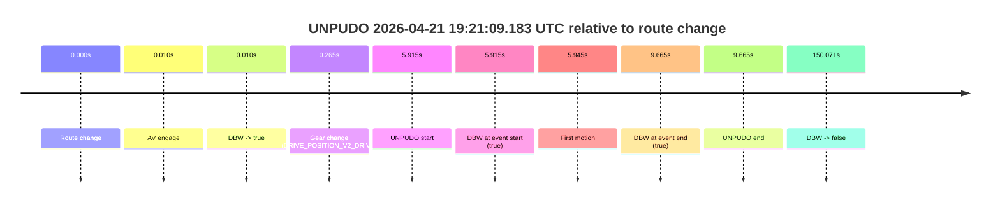
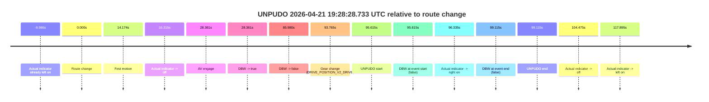
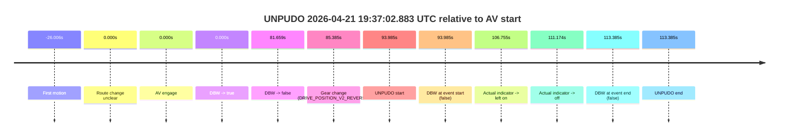
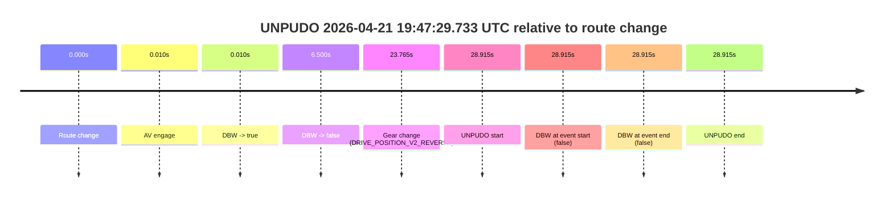

# Run Report: fme10011/2026-04-21--19-09-04--gen2-av-baa6b76c-60b2-486c-a0ca-88d62a3066c4

| Field | Value |
|---|---|
| Run ID | `fme10011/2026-04-21--19-09-04--gen2-av-baa6b76c-60b2-486c-a0ca-88d62a3066c4` |
| Date | `2026-04-21` |
| Model(s) | `eel-teal-outspoken` |
| Author | `zak` |
| Event count | `5` |

## unpudo 2026-04-21 19:21:09.183 UTC

| Field | Value |
|---|---|
| Model | `eel-teal-outspoken` |
| Author | `zak` |
| Run ID | `fme10011/2026-04-21--19-09-04--gen2-av-baa6b76c-60b2-486c-a0ca-88d62a3066c4` |
| Date | `2026-04-21` |
| Time (UTC) | `19:21:09.183` |
| Event type | `unpudo` |
| Disengagement type | `none observed` |
| Route change | `found` |
| Console | [run](https://console.sso.wayve.ai/run/fme10011/2026-04-21--19-09-04--gen2-av-baa6b76c-60b2-486c-a0ca-88d62a3066c4?id=&time-unixus=1776799269183295) |
| Foxglove | [segment](https://app.foxglove.dev/wayve-on-prem/p/prj_0dX18KZdVHg1fmmI/view?ds=foxglove-stream&ds.deviceName=fme10011&ds.start=2026-04-21T19%3A20%3A53.268247Z&ds.end=2026-04-21T19%3A23%3A43.338813Z&layoutId=lay_0e7VD4WIKDQGU73Y&time=2026-04-21T19%3A21%3A09.183295Z) |

### Event card: pass

- Pass: AV owns the credited unpudo from route change through the official unpudo window, the gear state is aligned at the anchor, and the vehicle moves without driver accelerator help in AV.

| Event | Time (UTC) | Delta from route change |
|---|---:|---:|
| Route change | 2026-04-21 19:21:03.268 | `0.000s` |
| AV engage | 2026-04-21 19:21:03.278 | `0.010s` |
| DBW -> true | 2026-04-21 19:21:03.278 | `0.010s` |
| Gear change (DRIVE_POSITION_V2_DRIVE) | 2026-04-21 19:21:03.533 | `0.265s` |
| UNPUDO start | 2026-04-21 19:21:09.183 | `5.915s` |
| DBW at event start (true) | 2026-04-21 19:21:09.183 | `5.915s` |
| First motion | 2026-04-21 19:21:09.213 | `5.945s` |
| DBW at event end (true) | 2026-04-21 19:21:12.933 | `9.665s` |
| UNPUDO end | 2026-04-21 19:21:12.933 | `9.665s` |
| DBW -> false | 2026-04-21 19:23:33.338 | `150.071s` |

| Metric | Value |
|---|---|
| Outcome | `pass` |
| Effective failure type | `none` |
| Route change status | `found` |
| DBW at event start | `true` |
| DBW at event end | `true` |
| Predicted gear at AV start | `DRIVE_POSITION_V2_PARK` |
| Actual gear at AV start | `DRIVE_POSITION_V2_PARK` |
| Predicted gear at event start | `DRIVE_POSITION_V2_DRIVE` |
| Actual gear at event start | `DRIVE_POSITION_V2_DRIVE` |
| Planned indicator direction | `INDICATORS_STATE_V2_LEFT_ON` |
| Controller indicator direction | `INDICATORS_STATE_V2_LEFT_ON` |
| Actual indicator direction | `INDICATORS_STATE_V2_OFF` |
| Actual indicator at maneuver end | `INDICATORS_STATE_V2_OFF` |
| Driver accel help in AV | `false` |
| Driver accel help timestamp | `n/a` |
| Max accel pedal pct in AV | `0.0%` |
| Max brake pedal pct in AV | `30.0%` |
| Max speed mps in AV | `4.894` |
| Success timing baseline | `route change` |
| Route -> AV | `0.010s` |
| AV -> event start | `5.905s` |
| AV -> first motion | `5.935s` |
| Success baseline -> event start | `5.915s` |
| Success baseline -> first motion | `5.945s` |
| AV duration before disengagement | `150.061s` |
| Trajectory waypoint count | `37` |
| Driving-plan step count | `11` |

The scored portion starts from the AV-owned window, not from the pre-AV setup. Route-change search in the stopped pre-event segment was `found`, with the baseline therefore set to route change. At the event anchor the model predicts `DRIVE_POSITION_V2_DRIVE` and the actual gear is `DRIVE_POSITION_V2_DRIVE`. The effective model outcome is `pass` because `the credited unpudo stays AV-owned through the official unpudo window.`

### Resolution

| Field | Value |
|---|---|
| Final outcome | `pass` |
| Do we agree with this label? | `yes` |
| Source disengagement type | `none observed` |
| Resolved effective failure type | `none` |
| Confidence | `high` |

## unpudo 2026-04-21 19:28:28.733 UTC

| Field | Value |
|---|---|
| Model | `eel-teal-outspoken` |
| Author | `zak` |
| Run ID | `fme10011/2026-04-21--19-09-04--gen2-av-baa6b76c-60b2-486c-a0ca-88d62a3066c4` |
| Date | `2026-04-21` |
| Time (UTC) | `19:28:28.733` |
| Event type | `unpudo` |
| Disengagement type | `none observed` |
| Route change | `found` |
| Console | [run](https://console.sso.wayve.ai/run/fme10011/2026-04-21--19-09-04--gen2-av-baa6b76c-60b2-486c-a0ca-88d62a3066c4?id=&time-unixus=1776799708733296) |
| Foxglove | [segment](https://app.foxglove.dev/wayve-on-prem/p/prj_0dX18KZdVHg1fmmI/view?ds=foxglove-stream&ds.deviceName=fme10011&ds.start=2026-04-21T19%3A26%3A43.118391Z&ds.end=2026-04-21T19%3A28%3A42.233298Z&layoutId=lay_0e7VD4WIKDQGU73Y&time=2026-04-21T19%3A28%3A28.733296Z) |

### Event card: fail

- Fail: the credited unpudo does not stay AV-owned. The event window starts with DBW false, and the maneuver outcome lands outside a clean AV-owned segment.

| Event | Time (UTC) | Delta from route change |
|---|---:|---:|
| Actual indicator already left on | 2026-04-21 19:26:43.132 | `-9.986s` |
| Route change | 2026-04-21 19:26:53.118 | `0.000s` |
| First motion | 2026-04-21 19:27:07.292 | `14.174s` |
| Actual indicator -> off | 2026-04-21 19:27:09.432 | `16.315s` |
| AV engage | 2026-04-21 19:27:21.479 | `28.361s` |
| DBW -> true | 2026-04-21 19:27:21.479 | `28.361s` |
| DBW -> false | 2026-04-21 19:28:19.098 | `85.980s` |
| Gear change (DRIVE_POSITION_V2_DRIVE) | 2026-04-21 19:28:26.883 | `93.765s` |
| UNPUDO start | 2026-04-21 19:28:28.733 | `95.615s` |
| DBW at event start (false) | 2026-04-21 19:28:28.733 | `95.615s` |
| Actual indicator -> right on | 2026-04-21 19:28:29.453 | `96.335s` |
| DBW at event end (false) | 2026-04-21 19:28:32.233 | `99.115s` |
| UNPUDO end | 2026-04-21 19:28:32.233 | `99.115s` |
| Actual indicator -> off | 2026-04-21 19:28:37.592 | `104.475s` |
| Actual indicator -> left on | 2026-04-21 19:28:51.012 | `117.895s` |

| Metric | Value |
|---|---|
| Outcome | `fail` |
| Effective failure type | `completed_outside_av` |
| Route change status | `found` |
| DBW at event start | `false` |
| DBW at event end | `false` |
| Predicted gear at AV start | `DRIVE_POSITION_V2_DRIVE` |
| Actual gear at AV start | `DRIVE_POSITION_V2_DRIVE` |
| Predicted gear at event start | `DRIVE_POSITION_V2_DRIVE` |
| Actual gear at event start | `DRIVE_POSITION_V2_DRIVE` |
| Planned indicator direction | `INDICATORS_STATE_V2_OFF` |
| Controller indicator direction | `INDICATORS_STATE_V2_OFF` |
| Actual indicator direction | `INDICATORS_STATE_V2_OFF` |
| Actual indicator at maneuver end | `INDICATORS_STATE_V2_RIGHT_ON` |
| Driver accel help in AV | `false` |
| Driver accel help timestamp | `n/a` |
| Max accel pedal pct in AV | `0.0%` |
| Max brake pedal pct in AV | `8.0%` |
| Max speed mps in AV | `11.247` |
| Success timing baseline | `route change` |
| Route -> AV | `28.361s` |
| AV -> event start | `67.254s` |
| AV -> first motion | `-14.186s` |
| Success baseline -> event start | `95.615s` |
| Success baseline -> first motion | `14.174s` |
| AV duration before disengagement | `57.619s` |
| Trajectory waypoint count | `38` |
| Driving-plan step count | `11` |

The scored portion starts from the AV-owned window, not from the pre-AV setup. Route-change search in the stopped pre-event segment was `found`, with the baseline therefore set to route change. At the event anchor the model predicts `DRIVE_POSITION_V2_DRIVE` and the actual gear is `DRIVE_POSITION_V2_DRIVE`. The effective model outcome is `fail` because `completed_outside_av.`

### Resolution

| Field | Value |
|---|---|
| Final outcome | `fail` |
| Do we agree with this label? | `yes` |
| Source disengagement type | `none observed` |
| Resolved effective failure type | `completed_outside_av` |
| Confidence | `high` |

## unpudo 2026-04-21 19:37:02.883 UTC

| Field | Value |
|---|---|
| Model | `eel-teal-outspoken` |
| Author | `zak` |
| Run ID | `fme10011/2026-04-21--19-09-04--gen2-av-baa6b76c-60b2-486c-a0ca-88d62a3066c4` |
| Date | `2026-04-21` |
| Time (UTC) | `19:37:02.883` |
| Event type | `unpudo` |
| Disengagement type | `none observed` |
| Route change | `unclear` |
| Console | [run](https://console.sso.wayve.ai/run/fme10011/2026-04-21--19-09-04--gen2-av-baa6b76c-60b2-486c-a0ca-88d62a3066c4?id=&time-unixus=1776800222883300) |
| Foxglove | [segment](https://app.foxglove.dev/wayve-on-prem/p/prj_0dX18KZdVHg1fmmI/view?ds=foxglove-stream&ds.deviceName=fme10011&ds.start=2026-04-21T19%3A35%3A18.898596Z&ds.end=2026-04-21T19%3A37%3A32.283303Z&layoutId=lay_0e7VD4WIKDQGU73Y&time=2026-04-21T19%3A37%3A02.883300Z) |

### Event card: fail

- Fail: the credited unpudo does not stay AV-owned. The event window starts with DBW false, and the maneuver outcome lands outside a clean AV-owned segment.

| Event | Time (UTC) | Delta from AV start |
|---|---:|---:|
| First motion | 2026-04-21 19:35:02.892 | `-26.006s` |
| Route change unclear | 2026-04-21 19:35:28.898 | `0.000s` |
| AV engage | 2026-04-21 19:35:28.898 | `0.000s` |
| DBW -> true | 2026-04-21 19:35:28.898 | `0.000s` |
| DBW -> false | 2026-04-21 19:36:50.557 | `81.659s` |
| Gear change (DRIVE_POSITION_V2_REVERSE) | 2026-04-21 19:36:54.283 | `85.385s` |
| UNPUDO start | 2026-04-21 19:37:02.883 | `93.985s` |
| DBW at event start (false) | 2026-04-21 19:37:02.883 | `93.985s` |
| Actual indicator -> left on | 2026-04-21 19:37:15.653 | `106.755s` |
| Actual indicator -> off | 2026-04-21 19:37:20.072 | `111.174s` |
| DBW at event end (false) | 2026-04-21 19:37:22.283 | `113.385s` |
| UNPUDO end | 2026-04-21 19:37:22.283 | `113.385s` |

| Metric | Value |
|---|---|
| Outcome | `fail` |
| Effective failure type | `completed_outside_av` |
| Route change status | `unclear` |
| DBW at event start | `false` |
| DBW at event end | `false` |
| Predicted gear at AV start | `DRIVE_POSITION_V2_DRIVE` |
| Actual gear at AV start | `DRIVE_POSITION_V2_DRIVE` |
| Predicted gear at event start | `DRIVE_POSITION_V2_REVERSE` |
| Actual gear at event start | `DRIVE_POSITION_V2_REVERSE` |
| Planned indicator direction | `INDICATORS_STATE_V2_OFF` |
| Controller indicator direction | `INDICATORS_STATE_V2_OFF` |
| Actual indicator direction | `INDICATORS_STATE_V2_OFF` |
| Actual indicator at maneuver end | `INDICATORS_STATE_V2_OFF` |
| Driver accel help in AV | `false` |
| Driver accel help timestamp | `n/a` |
| Max accel pedal pct in AV | `0.0%` |
| Max brake pedal pct in AV | `8.0%` |
| Max speed mps in AV | `10.358` |
| Success timing baseline | `AV start` |
| Route -> AV | `n/a` |
| AV -> event start | `93.985s` |
| AV -> first motion | `-26.006s` |
| Success baseline -> event start | `93.985s` |
| Success baseline -> first motion | `-26.006s` |
| AV duration before disengagement | `81.659s` |
| Trajectory waypoint count | `36` |
| Driving-plan step count | `11` |

The scored portion starts from the AV-owned window, not from the pre-AV setup. Route-change search in the stopped pre-event segment was `unclear`, with the baseline therefore set to AV start. At the event anchor the model predicts `DRIVE_POSITION_V2_REVERSE` and the actual gear is `DRIVE_POSITION_V2_REVERSE`. The effective model outcome is `fail` because `completed_outside_av.`

### Resolution

| Field | Value |
|---|---|
| Final outcome | `fail` |
| Do we agree with this label? | `yes` |
| Source disengagement type | `none observed` |
| Resolved effective failure type | `completed_outside_av` |
| Confidence | `medium` |

## unpudo 2026-04-21 19:41:54.583 UTC

| Field | Value |
|---|---|
| Model | `eel-teal-outspoken` |
| Author | `zak` |
| Run ID | `fme10011/2026-04-21--19-09-04--gen2-av-baa6b76c-60b2-486c-a0ca-88d62a3066c4` |
| Date | `2026-04-21` |
| Time (UTC) | `19:41:54.583` |
| Event type | `unpudo` |
| Disengagement type | `none observed` |
| Route change | `found` |
| Console | [run](https://console.sso.wayve.ai/run/fme10011/2026-04-21--19-09-04--gen2-av-baa6b76c-60b2-486c-a0ca-88d62a3066c4?id=&time-unixus=1776800514583311) |
| Foxglove | [segment](https://app.foxglove.dev/wayve-on-prem/p/prj_0dX18KZdVHg1fmmI/view?ds=foxglove-stream&ds.deviceName=fme10011&ds.start=2026-04-21T19%3A41%3A40.668253Z&ds.end=2026-04-21T19%3A44%3A59.758650Z&layoutId=lay_0e7VD4WIKDQGU73Y&time=2026-04-21T19%3A41%3A54.583311Z) |

### Event card: pass

- Pass: AV owns the credited unpudo from route change through the official unpudo window, the gear state is aligned at the anchor, and the vehicle moves without driver accelerator help in AV.

| Event | Time (UTC) | Delta from route change |
|---|---:|---:|
| Route change | 2026-04-21 19:41:50.668 | `0.000s` |
| AV engage | 2026-04-21 19:41:50.678 | `0.010s` |
| DBW -> true | 2026-04-21 19:41:50.678 | `0.010s` |
| Gear change (DRIVE_POSITION_V2_DRIVE) | 2026-04-21 19:41:51.033 | `0.365s` |
| UNPUDO start | 2026-04-21 19:41:54.583 | `3.915s` |
| DBW at event start (true) | 2026-04-21 19:41:54.583 | `3.915s` |
| First motion | 2026-04-21 19:41:54.612 | `3.945s` |
| DBW at event end (true) | 2026-04-21 19:41:57.983 | `7.315s` |
| UNPUDO end | 2026-04-21 19:41:57.983 | `7.315s` |
| DBW -> false | 2026-04-21 19:44:49.758 | `179.090s` |

| Metric | Value |
|---|---|
| Outcome | `pass` |
| Effective failure type | `none` |
| Route change status | `found` |
| DBW at event start | `true` |
| DBW at event end | `true` |
| Predicted gear at AV start | `DRIVE_POSITION_V2_PARK` |
| Actual gear at AV start | `DRIVE_POSITION_V2_PARK` |
| Predicted gear at event start | `DRIVE_POSITION_V2_DRIVE` |
| Actual gear at event start | `DRIVE_POSITION_V2_DRIVE` |
| Planned indicator direction | `INDICATORS_STATE_V2_LEFT_ON` |
| Controller indicator direction | `INDICATORS_STATE_V2_LEFT_ON` |
| Actual indicator direction | `INDICATORS_STATE_V2_OFF` |
| Actual indicator at maneuver end | `INDICATORS_STATE_V2_OFF` |
| Driver accel help in AV | `false` |
| Driver accel help timestamp | `n/a` |
| Max accel pedal pct in AV | `0.0%` |
| Max brake pedal pct in AV | `23.3%` |
| Max speed mps in AV | `4.933` |
| Success timing baseline | `route change` |
| Route -> AV | `0.010s` |
| AV -> event start | `3.905s` |
| AV -> first motion | `3.935s` |
| Success baseline -> event start | `3.915s` |
| Success baseline -> first motion | `3.945s` |
| AV duration before disengagement | `179.081s` |
| Trajectory waypoint count | `37` |
| Driving-plan step count | `11` |

The scored portion starts from the AV-owned window, not from the pre-AV setup. Route-change search in the stopped pre-event segment was `found`, with the baseline therefore set to route change. At the event anchor the model predicts `DRIVE_POSITION_V2_DRIVE` and the actual gear is `DRIVE_POSITION_V2_DRIVE`. The effective model outcome is `pass` because `the credited unpudo stays AV-owned through the official unpudo window.`

### Resolution

| Field | Value |
|---|---|
| Final outcome | `pass` |
| Do we agree with this label? | `yes` |
| Source disengagement type | `none observed` |
| Resolved effective failure type | `none` |
| Confidence | `high` |

## unpudo 2026-04-21 19:47:29.733 UTC

| Field | Value |
|---|---|
| Model | `eel-teal-outspoken` |
| Author | `zak` |
| Run ID | `fme10011/2026-04-21--19-09-04--gen2-av-baa6b76c-60b2-486c-a0ca-88d62a3066c4` |
| Date | `2026-04-21` |
| Time (UTC) | `19:47:29.733` |
| Event type | `unpudo` |
| Disengagement type | `none observed` |
| Route change | `found` |
| Console | [run](https://console.sso.wayve.ai/run/fme10011/2026-04-21--19-09-04--gen2-av-baa6b76c-60b2-486c-a0ca-88d62a3066c4?id=&time-unixus=1776800849733315) |
| Foxglove | [segment](https://app.foxglove.dev/wayve-on-prem/p/prj_0dX18KZdVHg1fmmI/view?ds=foxglove-stream&ds.deviceName=fme10011&ds.start=2026-04-21T19%3A46%3A50.818218Z&ds.end=2026-04-21T19%3A47%3A39.733315Z&layoutId=lay_0e7VD4WIKDQGU73Y&time=2026-04-21T19%3A47%3A29.733315Z) |

### Event card: fail

- Fail: the credited unpudo does not stay AV-owned. The event window starts with DBW false, and the maneuver outcome lands outside a clean AV-owned segment.

| Event | Time (UTC) | Delta from route change |
|---|---:|---:|
| Route change | 2026-04-21 19:47:00.818 | `0.000s` |
| AV engage | 2026-04-21 19:47:00.828 | `0.010s` |
| DBW -> true | 2026-04-21 19:47:00.828 | `0.010s` |
| DBW -> false | 2026-04-21 19:47:07.317 | `6.500s` |
| Gear change (DRIVE_POSITION_V2_REVERSE) | 2026-04-21 19:47:24.583 | `23.765s` |
| UNPUDO start | 2026-04-21 19:47:29.733 | `28.915s` |
| DBW at event start (false) | 2026-04-21 19:47:29.733 | `28.915s` |
| DBW at event end (false) | 2026-04-21 19:47:29.733 | `28.915s` |
| UNPUDO end | 2026-04-21 19:47:29.733 | `28.915s` |

| Metric | Value |
|---|---|
| Outcome | `fail` |
| Effective failure type | `not_av_owned` |
| Route change status | `found` |
| DBW at event start | `false` |
| DBW at event end | `false` |
| Predicted gear at AV start | `DRIVE_POSITION_V2_PARK` |
| Actual gear at AV start | `DRIVE_POSITION_V2_PARK` |
| Predicted gear at event start | `DRIVE_POSITION_V2_REVERSE` |
| Actual gear at event start | `DRIVE_POSITION_V2_REVERSE` |
| Planned indicator direction | `INDICATORS_STATE_V2_OFF` |
| Controller indicator direction | `INDICATORS_STATE_V2_OFF` |
| Actual indicator direction | `INDICATORS_STATE_V2_OFF` |
| Actual indicator at maneuver end | `INDICATORS_STATE_V2_OFF` |
| Driver accel help in AV | `false` |
| Driver accel help timestamp | `n/a` |
| Max accel pedal pct in AV | `0.0%` |
| Max brake pedal pct in AV | `8.0%` |
| Max speed mps in AV | `0.000` |
| Success timing baseline | `route change` |
| Route -> AV | `0.010s` |
| AV -> event start | `28.905s` |
| AV -> first motion | `n/a` |
| Success baseline -> event start | `28.915s` |
| Success baseline -> first motion | `n/a` |
| AV duration before disengagement | `6.490s` |
| Trajectory waypoint count | `37` |
| Driving-plan step count | `11` |

The scored portion starts from the AV-owned window, not from the pre-AV setup. Route-change search in the stopped pre-event segment was `found`, with the baseline therefore set to route change. At the event anchor the model predicts `DRIVE_POSITION_V2_REVERSE` and the actual gear is `DRIVE_POSITION_V2_REVERSE`. The effective model outcome is `fail` because `not_av_owned.`

### Resolution

| Field | Value |
|---|---|
| Final outcome | `fail` |
| Do we agree with this label? | `yes` |
| Source disengagement type | `none observed` |
| Resolved effective failure type | `not_av_owned` |
| Confidence | `high` |
